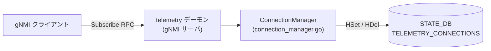

# TELEMETRY_CONNECTIONS テーブル (STATE_DB)

## 概要

`TELEMETRY_CONNECTIONS` は [STATE_DB](../../reference/glossary.md#term-state_db) 上の Redis Hash テーブル。`telemetry` デーモン (gNMI サーバ) が Subscribe RPC のアクティブな接続を管理・可視化するために使用する[^1]。

このテーブルは **CONFIG_DB からは一切参照されない** 書き込み専用のランタイム状態テーブルである。gNMI サーバが起動するたびに既存エントリは全削除され、接続の開始・終了に合わせてエントリが追加・削除される。

<!-- cdb-mermaid -->
### データフロー (自動生成)



!!! note "凡例"
    CONFIG_DB から SAI までの典型経路を `docs/reference/config-db-orch-map.md` から機械生成したミニ図。詳細・例外は本ページ本文と対応表を参照。
<!-- /cdb-mermaid -->

## key 構造

```text
TELEMETRY_CONNECTIONS   (Redis Hash — シングルキー)
```

Redis Hash 内の **フィールド名** が接続識別子 (connection key)、**値** が接続状態文字列。

### connection key のフォーマット

```text
<peer_ip:port>|<target_1>|[target_2|...]|<RFC3339_timestamp>
```

例:

```text
10.0.0.1:54321|STATE_DB|NEIGH_STATE_TABLE|2026-05-15T09:00:00Z
```

生成ロジック (`connection_manager.go:94-108`): クライアントアドレスと Subscribe リクエストの `target` / `element` フィールドを正規表現で抽出し、`|` 区切りで結合後、UTC タイムスタンプを末尾に付加する。

## フィールド

| フィールド (Redis Hash field) | 型 | 値 | 説明 |
|-------------------------------|----|----|------|
| `<connection_key>` | string | `"active"` (固定) | アクティブな Subscribe RPC 接続の存在を示す |

値は **常に文字列 `"active"`** で固定されており、接続の状態遷移は反映されない。接続の存在自体をキーの有無で表現する設計。

## ライフサイクル

| タイミング | 操作 | ソース |
|-----------|------|--------|
| `telemetry` デーモン起動 (`PrepareRedis()`) | 既存全エントリを `HDel` で削除 | `connection_manager.go:52-60` |
| Subscribe RPC 開始 (`Add()`) | `HSet(TELEMETRY_CONNECTIONS, key, "active")` | `connection_manager.go:76, 116` |
| Subscribe RPC 終了 (`Remove()`) | `HDel(TELEMETRY_CONNECTIONS, key)` | `connection_manager.go:127` |

## 制約

- `connection_key` の最大長は実装上制限されていない (正規表現マッチ + `|` + RFC3339 タイムスタンプ)
- Redis クライアント (`rclient`) が nil の場合、`HSet` / `HDel` は silent no-op となる — gNMI サーバはエラーなく継続動作する
- `threshold` (CONFIG_DB `GNMI|gnmi.threshold`) を超えた接続は `Add()` で拒否され STATE_DB への書き込みも発生しない

## 購読者

- `telemetry` バイナリ (`sonic-gnmi`): Subscribe RPC ごとに接続を登録・削除
- `show gnmi` 等の管理 CLI: `TELEMETRY_CONNECTIONS` を参照してアクティブ接続数を表示 (実装は `sonic-utilities` 側)

## 関連 CONFIG_DB / YANG / CLI

- 関連 [CONFIG_DB](../../reference/glossary.md#term-config_db): [`GNMI`](gnmi.md) (`threshold` フィールドが接続上限に影響)
- 関連 CLI: `show gnmi`
- 関連 YANG: なし (STATE_DB テーブルは YANG 未定義)

<!-- cdb-exceptions -->
## 例外条件・特殊挙動

| 条件 | 挙動 |
|------|------|
| `telemetry` デーモン起動時 | `PrepareRedis()` が `HGetAll` → 全 `HDel` で前回接続の残留エントリを削除 |
| STATE_DB 接続失敗 (`rclient == nil`) | `storeKeyRedis()` / `deleteKeyRedis()` が silent no-op。gNMI サーバ動作には影響なし |
| `threshold = 0` (CONFIG_DB) | 接続上限なし。`cm.threshold != 0` チェックで無制限が実現される |
| 同一 peer から重複 Subscribe | 旧クライアントを `Close()` して削除後、新クライアントを登録 (`server.go:872-876`) |
| `EnableStreamMultiplexing = true` | StreamID が client key に含まれ、同一 peer から複数ストリームが共存可能 (STATE_DB の connection_key に変化なし) |
<!-- /cdb-exceptions -->

<!-- defaults -->
## コード由来の暗黙デフォルト (Phase A)

> 調査対象: `sonic-net/sonic-gnmi/gnmi_server/connection_manager.go`, `client_subscribe.go`, `telemetry/telemetry.go`  
> 調査日: 2026-05-15

### `TELEMETRY_CONNECTIONS` — Hash value

| 種別 | 値 | ソース |
|------|----|--------|
| 接続登録時の固定値 | `"active"` | `connection_manager.go:116` — `HSet(..., key, "active")` |
| 起動時初期状態 | 全エントリ削除 | `connection_manager.go:52-60` — `PrepareRedis()` の `HGetAll` → 全 `HDel` |

**乖離なし**: 値は常にハードコード `"active"` 固定。CONFIG_DB / YANG デフォルトとの乖離は存在しない。

---

### threshold = 0 の特別意味 (STATE_DB エントリ数に影響)

| threshold 値 | 意味 | ソース |
|-------------|------|--------|
| `100` (デフォルト) | 同時接続上限 100。超過接続は `Add()` で拒否 → STATE_DB 書き込みなし | `telemetry.go:187` — `fs.Int("threshold", 100, ...)` |
| `0` | 上限なし (no threshold) | `connection_manager.go:65` — `cm.threshold != 0` 条件による |

CONFIG_DB の `GNMI|gnmi.threshold` が STATE_DB のエントリ数の最大値を間接的に決定する。`threshold` 自体は STATE_DB には書き込まれない。

---

### rclient nil ガード — フォールト許容

```go
// connection_manager.go:111-115
func storeKeyRedis(key string) {
    if rclient == nil {
        log.V(1).Infof("Redis client is nil, cannot store connection key")
        return
    }
    ...
}
```

STATE_DB が利用不可能な場合でも、gNMI サーバ本体は正常動作を継続する。STATE_DB への書き込みは best-effort であり、失敗してもパニックしない。

---

### connection key タイムスタンプ

connection key 末尾に付加される RFC3339 タイムスタンプは `time.Now().UTC()` で生成される。同一 peer から同一 query の接続が高速に繰り返された場合、秒精度の衝突が起こりえるが、コード上は重複ガードを行っていない (Hash の上書きで対応)。

<!-- evidence:
  connection_manager.go:16,32-60,63-108,110-130 — TELEMETRY_CONNECTIONS テーブル全ロジック
  client_subscribe.go:73-85 — setConnectionManager() / PrepareRedis() 呼び出し
  server.go:866 — Subscribe RPC ごとの setConnectionManager(s.config.Threshold) 呼び出し
  telemetry.go:187 — threshold flag default = 100
-->
<!-- /defaults -->

[^1]: `sonic-gnmi` `gnmi_server/connection_manager.go:16` — `const table = "TELEMETRY_CONNECTIONS"`、`PrepareRedis()` / `Add()` / `Remove()` で STATE_DB を読み書き
