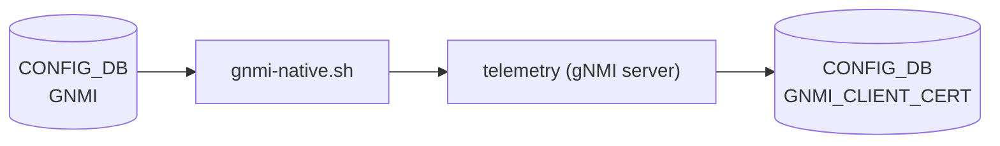

# GNMI / GNMI_CLIENT_CERT テーブル

## 概要

`GNMI` テーブルは gNMI (gRPC Network Management Interface) サーバ (`telemetry`) の動作パラメータを [CONFIG_DB](../../reference/glossary.md#term-config_db) に保持する[^1]。`gnmi-native.sh` 起動スクリプトが読み出し、`--port`・`--client_auth`・`--threshold` 等の CLI 引数に変換して `telemetry` バイナリへ渡す。

`GNMI_CLIENT_CERT` テーブルは `user_auth=cert` モード時に使用するクライアント証明書 CN (Common Name) → 認可ロールのマッピングを保持する[^2]。gNMI サーバが接続時に `GNMI_CLIENT_CERT|<CN>` を参照し、ロールを決定する。

<!-- cdb-mermaid -->
### データフロー (自動生成)



!!! note "凡例"
    CONFIG_DB から SAI までの典型経路を `docs/reference/config-db-orch-map.md` から機械生成したミニ図。詳細・例外は本ページ本文と対応表を参照。
<!-- /cdb-mermaid -->

## key 構造

```text
GNMI|gnmi
GNMI|certs
GNMI_CLIENT_CERT|<cname>
```

- `GNMI|gnmi` — gNMI サーバ動作パラメータ (固定 key)
- `GNMI|certs` — TLS 証明書ファイルパス (固定 key)
- `GNMI_CLIENT_CERT|<cname>` — クライアント証明書の CN を key とするマッピングエントリ

## フィールド

### GNMI|gnmi

| フィールド | 型 | デフォルト | 説明 |
|-----------|----|-----------|------|
| `port` | integer (string) | `8080` | gNMI サーバが listen する TCP ポート番号 |
| `client_auth` | string / boolean | `"false"` (allow_no_client_auth) | クライアント証明書要求有無。空または `"false"` で `--allow_no_client_auth` |
| `log_level` | integer (string) | `2` | ログ詳細度 (glog `-v` レベル) |
| `threshold` | integer (string) | `100` | 最大同時クライアント接続数 |
| `idle_conn_duration` | integer (string) | `5` | アイドル接続クローズまでの秒数 (0 = 無限) |
| `user_auth` | enum string | `"cert"` | 認証モード (`cert` / `password` / `jwt` / `none`) |
| `enable_crl` | boolean (string) | `"false"` | 証明書失効リスト (CRL) チェック有効化 |
| `crl_expire_duration` | integer (string) | `86400` | CRL キャッシュ有効期間 (秒) |

### GNMI|certs

| フィールド | 型 | デフォルト | 説明 |
|-----------|----|-----------|------|
| `server_crt` | string (path) | (なし) | サーバ TLS 証明書ファイルパス |
| `server_key` | string (path) | (なし) | サーバ TLS 秘密鍵ファイルパス |
| `ca_crt` | string (path) | (なし) | CA 証明書ファイルパス (クライアント証明書検証用) |

### GNMI_CLIENT_CERT|`<cname>`

| フィールド | 型 | デフォルト | 説明 |
|-----------|----|-----------|------|
| `role` | string | (なし、必須) | 証明書 CN に付与する認可ロール (単一値) |
| `role@` | string (カンマ区切り) | (なし) | 複数ロール指定時の配列フィールド (`role` より優先) |

## 制約

- `port` は正整数が必須。不正値の場合、起動スクリプトがエラー終了する
- `threshold` / `idle_conn_duration` は正整数が必須。不正値はエラー終了
- `GNMI|certs` の `server_crt` / `server_key` の一方でも欠ける場合は `--insecure` (テスト用自己署名証明書) モードで起動
- `GNMI` エントリがなく、かつ `DEVICE_METADATA|localhost.x509` も未設定の場合は `--noTLS` (TLS 完全無効) で起動
- `GNMI_CLIENT_CERT|<cname>` の `role` が存在しない場合、クライアント接続は `codes.Unauthenticated` で拒否される

## 購読者

- `gnmi-native.sh` (`docker-sonic-gnmi`): [CONFIG_DB](../../reference/glossary.md#term-config_db) → `telemetry` 起動引数変換
- `telemetry` バイナリ (`sonic-gnmi`): gNMI サーバ本体。接続時に `GNMI_CLIENT_CERT|<CN>` を参照して認可
- `docker-telemetry-sidecar/systemd_stub.py`: `GNMI_CLIENT_CERT|<cname>` エントリの自動作成/削除 (環境変数 `GNMI_CLIENT_CERTS` から注入)

## 関連 CONFIG_DB / YANG / CLI

- 関連 [CONFIG_DB](../../reference/glossary.md#term-config_db): `TELEMETRY` (旧テーブル、`migrate_gnmi()` でマイグレーション), `DEVICE_METADATA`
- 関連 CLI: `config gnmi`
- 関連 YANG: なし (現時点で YANG モデル未定義; スクリプト直接参照)

<!-- cdb-exceptions -->
## 例外条件・特殊挙動

- **フォールバック順序**: `GNMI|certs` → `DEVICE_METADATA|localhost.x509` → `--noTLS`。三段階フォールバックで TLS 証明書が解決される
- **SmartSwitch 自動 ZMQ 設定**: `DEVICE_METADATA|localhost.subtype = SmartSwitch` の場合、`gnmi-native.sh` が自動で `--zmq_port=8100` を追加する
- **管理 VRF 自動バインド**: `MGMT_VRF_CONFIG|vrf_global.mgmtVrfEnabled = true` の場合、`--vrf mgmt` が自動追加される
- **マイグレーション**: `db_migrator.migrate_gnmi()` が旧 `TELEMETRY|gnmi` エントリを `GNMI|gnmi` へ自動コピー
- **CRL キャッシュ**: CRL はメモリ内キャッシュのみ。サービス再起動でオンデマンドリフレッシュが発生する
<!-- /cdb-exceptions -->

<!-- defaults -->
## コード由来の暗黙デフォルト (Phase A)

> YANG `default` 以外の Shell/Go レベル fallback を per-field で整理する。
> 書き込み時デフォルト (gnmi-native.sh の分岐) と実行時 fallback (Go CLI フラグ定数) の乖離を区別する。

### `port` (GNMI|gnmi)

| 種別 | 値 | ソース |
|------|----|--------|
| Shell スクリプト fallback | `8080` | `gnmi-native.sh:65` — `GNMI` エントリ空の場合 |
| Go CLI フラグ default | `-1` (無効値) | `telemetry.go:174` — スクリプト経由では常に上書きされる |

**乖離**: `gnmi-native.sh` は `GNMI` エントリが無い場合のみ `8080` を使用する。DB に `GNMI|gnmi` エントリが存在するが `port` フィールドが欠如している場合、`jq -r '.port'` は `null` を返し正整数チェックに失敗するため起動エラーとなる。事実上 `8080` は「DB エントリ完全不在時」のフォールバックのみ有効。

---

### `log_level` (GNMI|gnmi)

| 種別 | 値 | ソース |
|------|----|--------|
| Shell スクリプト fallback | `2` | `gnmi-native.sh:85` — 数値パターン不一致時 |
| Go CLI フラグ default | `2` | `telemetry.go:176` — `fs.Int("v", 2, ...)` |

**乖離**: なし。Shell・Go 双方で `2` に一致。

---

### `threshold` (GNMI|gnmi)

| 種別 | 値 | ソース |
|------|----|--------|
| Shell スクリプト fallback | `100` | `gnmi-native.sh:106` — エントリ空または `null` 時 |
| Go CLI フラグ default | `100` | `telemetry.go:187` — `fs.Int("threshold", 100, ...)` |

**乖離**: なし。Shell・Go 双方で `100` に一致。

---

### `idle_conn_duration` (GNMI|gnmi)

| 種別 | 値 | ソース |
|------|----|--------|
| Shell スクリプト fallback | `5` | `gnmi-native.sh:119` — エントリ空または `null` 時 |
| Go CLI フラグ default | `5` | `telemetry.go:190` — `fs.Int("idle_conn_duration", 5, ...)` |

**乖離**: なし。Shell・Go 双方で `5` 秒に一致。

---

### `client_auth` (GNMI|gnmi)

| 種別 | 値 | ソース |
|------|----|--------|
| Shell スクリプト fallback | `--allow_no_client_auth` 付与 | `gnmi-native.sh:77-79` — 空または `"false"` 時 |
| Go 内部デフォルト (`GnmiTranslibWrite=false` 時) | `AuthTypes{jwt:false, password:false, cert:false}` | `telemetry.go:221` |
| Go 内部デフォルト (`GnmiTranslibWrite=true` 時) | `AuthTypes{password:true, cert:false, jwt:true}` | `telemetry.go:219` |

**乖離 (重要)**: `gnmi-native.sh` レベルのデフォルトは `--allow_no_client_auth` (クライアント証明書任意)。これは Go フラグの `client_auth` とは異なるフラグ (`allow_no_client_auth`) を付与する。`user_auth` フィールドが `"cert"` に設定されている場合は後述の `--client_auth cert` が優先される。

---

### `user_auth` (GNMI|gnmi)

| 種別 | 値 | ソース |
|------|----|--------|
| Shell スクリプト fallback | `"cert"` → `--client_auth cert` + `--config_table_name GNMI_CLIENT_CERT` | `gnmi-native.sh:129,135` |
| Go CLI フラグ default (引数なし時) | `GnmiTranslibWrite` に依存 | `telemetry.go:216-229` |

`user_auth` が DB に設定されていない場合 (`jq -r '.user_auth'` が `null`)、Shell スクリプトが `"cert"` にフォールバックし `--client_auth cert` および `--config_table_name GNMI_CLIENT_CERT` が渡される。つまりデフォルトでは証明書認証 + `GNMI_CLIENT_CERT` テーブル参照が有効になる。

---

### `enable_crl` (GNMI|gnmi)

| 種別 | 値 | ソース |
|------|----|--------|
| Shell スクリプト fallback | 無効 (フラグ付与なし) | `gnmi-native.sh:138` — `"true"` 以外はスキップ |
| Go CLI フラグ default | `false` | `telemetry.go:193` — `fs.Bool("enable_crl", false, ...)` |

**乖離**: なし。両方でデフォルト無効。

---

### `crl_expire_duration` (GNMI|gnmi)

| 種別 | 値 | ソース |
|------|----|--------|
| Shell スクリプト fallback | 引数なし → Go デフォルト適用 | `gnmi-native.sh:142-145` — `null` 時はフラグ不付与 |
| Go CLI フラグ default | `86400` 秒 (24 時間) | `telemetry.go:194` — `fs.Int("crl_expire_duration", 86400, ...)` |
| Go 定数 (clientCertAuth.go) | `24 * 60 * 60 * time.Second` | `clientCertAuth.go:22` |

**乖離**: なし。Shell は `null` 時にフラグを渡さず、Go CLI フラグのデフォルト `86400` が使われる。

---

### `server_crt` / `server_key` (GNMI|certs)

| 種別 | 値 | ソース |
|------|----|--------|
| Shell スクリプト fallback | `--insecure` (テスト用自己署名証明書) | `gnmi-native.sh:35-36` — 空の場合 |
| 最終フォールバック | `--noTLS` (TLS 完全無効) | `gnmi-native.sh:60-61` — `CERTS` / `X509` 両方とも未設定時 |

**乖離**: `--insecure` は `testcert.NewCert()` で Go 内部生成の自己署名証明書を使用する本番環境では非推奨のモード。`--noTLS` は TLS なしで gRPC を提供し、認証も無効になる。

---

### `role` (GNMI_CLIENT_CERT|`<cname>`)

| 種別 | 値 | ソース |
|------|----|--------|
| コード由来デフォルト | なし — エントリ不在 / `role` 欠如 = 認証失敗 | `clientCertAuth.go:279-283` |
| `role@` (配列型) | `role` より優先参照 | `clientCertAuth.go:265-267` |
| sidecar レガシー環境変数 default | `"gnmi_show_readonly"` | `systemd_stub.py:52` — `GNMI_CLIENT_ROLE` 未設定時のみ |

**フォールバックなし**: `GNMI_CLIENT_CERT|<cname>` エントリが存在しない、または `role` / `role@` フィールドがいずれも存在しない場合、`PopulateAuthStructByCommonName()` は `auth.Roles` を空のまま返し、呼び出し元が `codes.Unauthenticated` エラーを返す。デフォルトロールの自動付与は行われない。

<!-- evidence:
  gnmi-native.sh:64-151 — port/log_level/threshold/idle_conn_duration/client_auth/user_auth/enable_crl/crl_expire_duration の分岐
  telemetry.go:171-328 — setupFlags() Go CLI フラグデフォルト定義
  clientCertAuth.go:22,254-284 — CRL デフォルト定数, PopulateAuthStructByCommonName
  systemd_stub.py:22-55 — GNMI_CLIENT_CERT 書き込みロジック, GNMI_CLIENT_ROLE デフォルト
-->
<!-- /defaults -->

[^1]: `sonic-buildimage` `dockers/docker-sonic-gnmi/gnmi-native.sh` — ConfigDB → telemetry 引数変換ロジック全体
[^2]: `sonic-gnmi` `gnmi_server/clientCertAuth.go:254-284` — `PopulateAuthStructByCommonName()` による GNMI_CLIENT_CERT 参照
