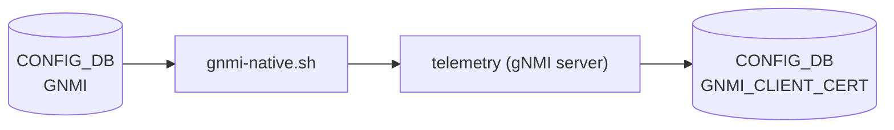

# GNMI / GNMI_CLIENT_CERT テーブル

## 概要

`GNMI` テーブルは [gNMI](../../reference/glossary.md#term-gnmi) (gRPC Network Management Interface) サーバ (`telemetry`) の動作パラメータを [CONFIG_DB](../../reference/glossary.md#term-config_db) に保持する[^1]。`gnmi-native.sh` 起動スクリプトが読み出し、`--port`・`--client_auth`・`--threshold` 等の CLI 引数に変換して `telemetry` バイナリへ渡す。

`GNMI_CLIENT_CERT` テーブルは `user_auth=cert` モード時に使用するクライアント証明書 CN (Common Name) → 認可ロールのマッピングを保持する[^2]。[gNMI](../../reference/glossary.md#term-gnmi) サーバが接続時に `GNMI_CLIENT_CERT|<CN>` を参照し、ロールを決定する。

<!-- cdb-mermaid -->
### データフロー (自動生成)



!!! note "凡例"
    CONFIG_DB から SAI までの典型経路を `docs/reference/config-db-orch-map.md` から機械生成したミニ図。詳細・例外は本ページ本文と対応表を参照。
<!-- /cdb-mermaid -->

## key 構造

```text
GNMI|gnmi
GNMI|certs
GNMI_CLIENT_CERT|<cname>
```

- `GNMI|gnmi` — [gNMI](../../reference/glossary.md#term-gnmi) サーバ動作パラメータ (固定 key)
- `GNMI|certs` — TLS 証明書ファイルパス (固定 key)
- `GNMI_CLIENT_CERT|<cname>` — クライアント証明書の CN を key とするマッピングエントリ

## フィールド

### GNMI|gnmi

| フィールド | 型 | デフォルト | 説明 |
|-----------|----|-----------|------|
| `port` | integer (string) | `8080` | gNMI サーバが listen する TCP ポート番号 |
| `client_auth` | string / boolean | `"false"` (allow_no_client_auth) | クライアント証明書要求有無。空または `"false"` で `--allow_no_client_auth` |
| `log_level` | integer (string) | `2` | ログ詳細度 (glog `-v` レベル) |
| `threshold` | integer (string) | `100` | 最大同時クライアント接続数 |
| `idle_conn_duration` | integer (string) | `5` | アイドル接続クローズまでの秒数 (0 = 無限) |
| `user_auth` | enum string | `"cert"` | 認証モード (`cert` / `password` / `jwt` / `none`) |
| `enable_crl` | boolean (string) | `"false"` | 証明書失効リスト (CRL) チェック有効化 |
| `crl_expire_duration` | integer (string) | `86400` | CRL キャッシュ有効期間 (秒) |

### GNMI|certs

| フィールド | 型 | デフォルト | 説明 |
|-----------|----|-----------|------|
| `server_crt` | string (path) | (なし) | サーバ TLS 証明書ファイルパス |
| `server_key` | string (path) | (なし) | サーバ TLS 秘密鍵ファイルパス |
| `ca_crt` | string (path) | (なし) | CA 証明書ファイルパス (クライアント証明書検証用) |

### GNMI_CLIENT_CERT|`<cname>`

| フィールド | 型 | デフォルト | 説明 |
|-----------|----|-----------|------|
| `role` | string | (なし、必須) | 証明書 CN に付与する認可ロール (単一値) |
| `role@` | string (カンマ区切り) | (なし) | 複数ロール指定時の配列フィールド (`role` より優先) |

## 制約

- `port` は正整数が必須。不正値の場合、起動スクリプトがエラー終了する
- `threshold` / `idle_conn_duration` は正整数が必須。不正値はエラー終了
- `GNMI|certs` の `server_crt` / `server_key` の一方でも欠ける場合は `--insecure` (テスト用自己署名証明書) モードで起動
- `GNMI` エントリがなく、かつ `DEVICE_METADATA|localhost.x509` も未設定の場合は `--noTLS` (TLS 完全無効) で起動
- `GNMI_CLIENT_CERT|<cname>` の `role` が存在しない場合、クライアント接続は `codes.Unauthenticated` で拒否される

## 購読者

- `gnmi-native.sh` (`docker-sonic-gnmi`): [CONFIG_DB](../../reference/glossary.md#term-config_db) → `telemetry` 起動引数変換
- `telemetry` バイナリ (`sonic-gnmi`): gNMI サーバ本体。接続時に `GNMI_CLIENT_CERT|<CN>` を参照して認可
- `docker-telemetry-sidecar/systemd_stub.py`: `GNMI_CLIENT_CERT|<cname>` エントリの自動作成/削除 (環境変数 `GNMI_CLIENT_CERTS` から注入)

## 関連 CONFIG_DB / YANG / CLI

- 関連 [CONFIG_DB](../../reference/glossary.md#term-config_db): `TELEMETRY` (旧テーブル、`migrate_gnmi()` でマイグレーション), `DEVICE_METADATA`
- 関連 CLI: `config gnmi`
- 関連 [YANG](../../reference/glossary.md#term-yang): なし (現時点で [YANG](../../reference/glossary.md#term-yang) モデル未定義; スクリプト直接参照)

<!-- cdb-exceptions -->
## 例外条件・特殊挙動

- **フォールバック順序**: `GNMI|certs` → `DEVICE_METADATA|localhost.x509` → `--noTLS`。三段階フォールバックで TLS 証明書が解決される
- **[SmartSwitch](../../reference/glossary.md#term-smartswitch) 自動 ZMQ 設定**: `DEVICE_METADATA|localhost.subtype = SmartSwitch` の場合、`gnmi-native.sh` が自動で `--zmq_port=8100` を追加する
- **管理 [VRF](../../reference/glossary.md#term-vrf) 自動バインド**: `MGMT_VRF_CONFIG|vrf_global.mgmtVrfEnabled = true` の場合、`--vrf mgmt` が自動追加される
- **マイグレーション**: `db_migrator.migrate_gnmi()` が旧 `TELEMETRY|gnmi` エントリを `GNMI|gnmi` へ自動コピー
- **CRL キャッシュ**: CRL はメモリ内キャッシュのみ。サービス再起動でオンデマンドリフレッシュが発生する
<!-- /cdb-exceptions -->

<!-- defaults -->
## コード由来の暗黙デフォルト (Phase A)

> [YANG](../../reference/glossary.md#term-yang) `default` 以外の Shell/Go レベル fallback を per-field で整理する。
> 書き込み時デフォルト (gnmi-native.sh の分岐) と実行時 fallback (Go CLI フラグ定数) の乖離を区別する。

### `port` (GNMI|gnmi)

| 種別 | 値 | ソース |
|------|----|--------|
| Shell スクリプト fallback | `8080` | `gnmi-native.sh:65` — `GNMI` エントリ空の場合 |
| Go CLI フラグ default | `-1` (無効値) | `telemetry.go:174` — スクリプト経由では常に上書きされる |

**乖離**: `gnmi-native.sh` は `GNMI` エントリが無い場合のみ `8080` を使用する。DB に `GNMI|gnmi` エントリが存在するが `port` フィールドが欠如している場合、`jq -r '.port'` は `null` を返し正整数チェックに失敗するため起動エラーとなる。事実上 `8080` は「DB エントリ完全不在時」のフォールバックのみ有効。

---

### `log_level` (GNMI|gnmi)

| 種別 | 値 | ソース |
|------|----|--------|
| Shell スクリプト fallback | `2` | `gnmi-native.sh:85` — 数値パターン不一致時 |
| Go CLI フラグ default | `2` | `telemetry.go:176` — `fs.Int("v", 2, ...)` |

**乖離**: なし。Shell・Go 双方で `2` に一致。

---

### `threshold` (GNMI|gnmi)

| 種別 | 値 | ソース |
|------|----|--------|
| Shell スクリプト fallback | `100` | `gnmi-native.sh:106` — エントリ空または `null` 時 |
| Go CLI フラグ default | `100` | `telemetry.go:187` — `fs.Int("threshold", 100, ...)` |

**乖離**: なし。Shell・Go 双方で `100` に一致。

---

### `idle_conn_duration` (GNMI|gnmi)

| 種別 | 値 | ソース |
|------|----|--------|
| Shell スクリプト fallback | `5` | `gnmi-native.sh:119` — エントリ空または `null` 時 |
| Go CLI フラグ default | `5` | `telemetry.go:190` — `fs.Int("idle_conn_duration", 5, ...)` |

**乖離**: なし。Shell・Go 双方で `5` 秒に一致。

---

### `client_auth` (GNMI|gnmi)

| 種別 | 値 | ソース |
|------|----|--------|
| Shell スクリプト fallback | `--allow_no_client_auth` 付与 | `gnmi-native.sh:77-79` — 空または `"false"` 時 |
| Go 内部デフォルト (`GnmiTranslibWrite=false` 時) | `AuthTypes{jwt:false, password:false, cert:false}` | `telemetry.go:221` |
| Go 内部デフォルト (`GnmiTranslibWrite=true` 時) | `AuthTypes{password:true, cert:false, jwt:true}` | `telemetry.go:219` |

**乖離 (重要)**: `gnmi-native.sh` レベルのデフォルトは `--allow_no_client_auth` (クライアント証明書任意)。これは Go フラグの `client_auth` とは異なるフラグ (`allow_no_client_auth`) を付与する。`user_auth` フィールドが `"cert"` に設定されている場合は後述の `--client_auth cert` が優先される。

---

### `user_auth` (GNMI|gnmi)

| 種別 | 値 | ソース |
|------|----|--------|
| Shell スクリプト fallback | `"cert"` → `--client_auth cert` + `--config_table_name GNMI_CLIENT_CERT` | `gnmi-native.sh:129,135` |
| Go CLI フラグ default (引数なし時) | `GnmiTranslibWrite` に依存 | `telemetry.go:216-229` |

`user_auth` が DB に設定されていない場合 (`jq -r '.user_auth'` が `null`)、Shell スクリプトが `"cert"` にフォールバックし `--client_auth cert` および `--config_table_name GNMI_CLIENT_CERT` が渡される。つまりデフォルトでは証明書認証 + `GNMI_CLIENT_CERT` テーブル参照が有効になる。

---

### `enable_crl` (GNMI|gnmi)

| 種別 | 値 | ソース |
|------|----|--------|
| Shell スクリプト fallback | 無効 (フラグ付与なし) | `gnmi-native.sh:138` — `"true"` 以外はスキップ |
| Go CLI フラグ default | `false` | `telemetry.go:193` — `fs.Bool("enable_crl", false, ...)` |

**乖離**: なし。両方でデフォルト無効。

---

### `crl_expire_duration` (GNMI|gnmi)

| 種別 | 値 | ソース |
|------|----|--------|
| Shell スクリプト fallback | 引数なし → Go デフォルト適用 | `gnmi-native.sh:142-145` — `null` 時はフラグ不付与 |
| Go CLI フラグ default | `86400` 秒 (24 時間) | `telemetry.go:194` — `fs.Int("crl_expire_duration", 86400, ...)` |
| Go 定数 (clientCertAuth.go) | `24 * 60 * 60 * time.Second` | `clientCertAuth.go:22` |

**乖離**: なし。Shell は `null` 時にフラグを渡さず、Go CLI フラグのデフォルト `86400` が使われる。

---

### `server_crt` / `server_key` (GNMI|certs)

| 種別 | 値 | ソース |
|------|----|--------|
| Shell スクリプト fallback | `--insecure` (テスト用自己署名証明書) | `gnmi-native.sh:35-36` — 空の場合 |
| 最終フォールバック | `--noTLS` (TLS 完全無効) | `gnmi-native.sh:60-61` — `CERTS` / `X509` 両方とも未設定時 |

**乖離**: `--insecure` は `testcert.NewCert()` で Go 内部生成の自己署名証明書を使用する本番環境では非推奨のモード。`--noTLS` は TLS なしで gRPC を提供し、認証も無効になる。

---

### `role` (GNMI_CLIENT_CERT|`<cname>`)

| 種別 | 値 | ソース |
|------|----|--------|
| コード由来デフォルト | なし — エントリ不在 / `role` 欠如 = 認証失敗 | `clientCertAuth.go:279-283` |
| `role@` (配列型) | `role` より優先参照 | `clientCertAuth.go:265-267` |
| sidecar レガシー環境変数 default | `"gnmi_show_readonly"` | `systemd_stub.py:52` — `GNMI_CLIENT_ROLE` 未設定時のみ |

**フォールバックなし**: `GNMI_CLIENT_CERT|<cname>` エントリが存在しない、または `role` / `role@` フィールドがいずれも存在しない場合、`PopulateAuthStructByCommonName()` は `auth.Roles` を空のまま返し、呼び出し元が `codes.Unauthenticated` エラーを返す。デフォルトロールの自動付与は行われない。

<!-- evidence:
  gnmi-native.sh:64-151 — port/log_level/threshold/idle_conn_duration/client_auth/user_auth/enable_crl/crl_expire_duration の分岐
  telemetry.go:171-328 — setupFlags() Go CLI フラグデフォルト定義
  clientCertAuth.go:22,254-284 — CRL デフォルト定数, PopulateAuthStructByCommonName
  systemd_stub.py:22-55 — GNMI_CLIENT_CERT 書き込みロジック, GNMI_CLIENT_ROLE デフォルト
-->
<!-- /defaults -->

<!-- ordering -->
## 書込み順依存 (Phase B)

`gnmi-native.sh` はコンテナ起動時に **一度だけ** CONFIG_DB を読み込み、`telemetry` バイナリへの引数を構築して `exec` する。このため順序制約のほとんどは「コンテナ起動前に設定完了していること」に集中する。

### 検出された順序依存

| # | 依存関係 | 方向 | 違反時の挙動 |
|---|----------|------|------------|
| 1 | `GNMI\|certs` (または `DEVICE_METADATA\|localhost.x509`) → telemetry 起動 | **先行必須** | `--noTLS` フォールバックで TLS 無効起動 |
| 2 | `MGMT_VRF_CONFIG\|vrf_global.mgmtVrfEnabled = true` → telemetry 起動 | **先行必須** | `--vrf mgmt` 付与なし。[VRF](../../reference/glossary.md#term-vrf) バインドに失敗して管理 [VRF](../../reference/glossary.md#term-vrf) 経由の接続不可 |
| 3 | `GNMI_CLIENT_CERT\|<CN>` エントリ群 → `GNMI\|gnmi.user_auth = cert` 有効化 | **先行推奨** | エントリ不在時は全クライアントが `codes.Unauthenticated` で接続拒否 |
| 4 | `GNMI\|gnmi` / `GNMI\|certs` 変更 → `systemctl restart gnmi` | **必須後続** | 変更は既存 telemetry プロセスに反映されない |

### 主要な制約詳細

**TLS 証明書先行必須 (依存 #1)**: `gnmi-native.sh` は `CERTS`（`GNMI|certs` テーブル由来）→ `X509`（`DEVICE_METADATA|localhost.x509` 由来）→ `--noTLS` の三段階フォールバックで TLS 設定を解決する（`gnmi-native.sh:32-61`）。コンテナ起動前に証明書パスを設定していない場合は TLS なしで起動し、後から `GNMI|certs` を設定してもコンテナ再起動まで反映されない。

**管理 VRF 先行必須 (依存 #2)**: `gnmi-native.sh:95-98` で `sonic-db-cli CONFIG_DB hget "MGMT_VRF_CONFIG|vrf_global" "mgmtVrfEnabled"` を実行してから `--vrf mgmt` を付与する。`MGMT_VRF_CONFIG` は telemetry コンテナ起動より前（`config vrf add mgmt` 完了後）に設定されている必要がある。

**GNMI_CLIENT_CERT 事前登録 (依存 #3)**: `user_auth = cert` モードでは各クライアント接続時に `clientCertAuth.go:PopulateAuthStructByCommonName()` が `GNMI_CLIENT_CERT|<CN>` を検索する。先に `GNMI|gnmi` を `user_auth=cert` で設定しても `GNMI_CLIENT_CERT` エントリが揃っていなければ即時に全クライアント拒否が発生する。安全な順序は `GNMI_CLIENT_CERT` エントリを先書きしてから `GNMI|gnmi` を有効化すること。

<!-- evidence:
  gnmi-native.sh:32-61 — CERTS/X509/noTLS フォールバック
  gnmi-native.sh:89-98 — SmartSwitch ZMQ + mgmt VRF 分岐
  clientCertAuth.go:254-284 — PopulateAuthStructByCommonName による GNMI_CLIENT_CERT 参照
-->
<!-- /ordering -->

<!-- cross-refs -->
## 暗黙参照テーブル (Phase C)

`gnmi-native.sh` は起動時に `sonic-cfggen -d -t telemetry_vars.j2` で CONFIG_DB 全体を読み込み、`GNMI` テーブルと `DEVICE_METADATA` の一部を JSON 化して参照する。実行時は `clientCertAuth.go` が接続ごとに `GNMI_CLIENT_CERT` テーブルを直接参照する。

| 参照先テーブル / リソース | 参照方向 | 条件 | 参照元 evidence |
|--------------------------|---------|------|----------------|
| `GNMI\|gnmi` (CONFIG_DB) | 起動引数生成（port / log_level / threshold / idle_conn_duration / user_auth / enable_crl / crl_expire_duration） | 常時。エントリ不在時は各フィールド独自の fallback 値を使用 | `gnmi-native.sh:19-22,64-148` — `sonic-cfggen` → `$GNMI` 変数 |
| `GNMI\|certs` (CONFIG_DB) | TLS 証明書パス解決（server_crt / server_key / ca_crt） | 常時。存在する場合 `DEVICE_METADATA|localhost.x509` より優先 | `gnmi-native.sh:19-22,31-43` — `$CERTS` 変数経由 |
| `DEVICE_METADATA\|localhost.x509` (CONFIG_DB) | TLS 証明書パス解決（フォールバック） | `GNMI|certs` が不在のとき。`telemetry_vars.j2:4` で `x509` キーを抽出 | `gnmi-native.sh:44-58` — `$X509` 変数経由; `telemetry_vars.j2:4` |
| `DEVICE_METADATA\|localhost.subtype` (CONFIG_DB) | [SmartSwitch](../../reference/glossary.md#term-smartswitch) 判定 → `--zmq_port=8100` 付与 | `subtype == "SmartSwitch"` のとき。ZMQ ポートを強制付与 | `gnmi-native.sh:89-91` — `sonic-db-cli CONFIG_DB hget` |
| `MGMT_VRF_CONFIG\|vrf_global.mgmtVrfEnabled` (CONFIG_DB) | 管理 VRF バインド → `--vrf mgmt` 付与 | `mgmtVrfEnabled == "true"` のとき | `gnmi-native.sh:95-98` — `sonic-db-cli CONFIG_DB hget` |
| `GNMI_CLIENT_CERT\|<CN>` (CONFIG_DB) | 実行時認可ロール解決（role / role@） | `user_auth=cert` モード時、各クライアント接続ごと | `gnmi_server/clientCertAuth.go:254-284` — `PopulateAuthStructByCommonName()` |
| `TELEMETRY\|gnmi` (CONFIG_DB) | マイグレーション元（レガシー） | `db_migrator.migrate_gnmi()` が `GNMI|gnmi` へ自動コピー。通常運用では参照されない | `sonic-utilities` `db_migrator.py` — `migrate_gnmi()` |

!!! note "`sonic-cfggen` 一括読み込みの意味"
    `gnmi-native.sh` は起動時に **1 回だけ** `sonic-cfggen -d -t telemetry_vars.j2` を実行し、その結果を変数に保持する。
    テンプレートは `GNMI["certs"]`・`GNMI["gnmi"]`・`DEVICE_METADATA["x509"]` の 3 キーを JSON 化する（`telemetry_vars.j2:2-4`）。
    コンテナが稼働中に CONFIG_DB が変更されても `telemetry` プロセスには反映されず、`systemctl restart gnmi` が必要。

!!! note "`DEVICE_METADATA|localhost.subtype` / `MGMT_VRF_CONFIG` は `sonic-db-cli` で直接取得"
    これら 2 つのフィールドは `sonic-cfggen` テンプレートではなく `sonic-db-cli CONFIG_DB hget` で個別取得される。
    取得は起動スクリプトの実行時点（`exec telemetry` の直前）に限られる。

<!-- evidence:
  gnmi-native.sh:19-22 — sonic-cfggen -d -t telemetry_vars.j2 で $GNMI/$CERTS/$X509 を一括取得
  telemetry_vars.j2:2-4 — GNMI["certs"], GNMI["gnmi"], DEVICE_METADATA["x509"] の Jinja2 テンプレート
  gnmi-native.sh:89-91 — DEVICE_METADATA|localhost subtype 取得 (sonic-db-cli)
  gnmi-native.sh:95-98 — MGMT_VRF_CONFIG|vrf_global mgmtVrfEnabled 取得 (sonic-db-cli)
  clientCertAuth.go:254-284 — PopulateAuthStructByCommonName による GNMI_CLIENT_CERT 参照
-->
<!-- /cross-refs -->

<!-- failure -->
## 失敗挙動マトリクス (Phase D)

ソース: `sonic-buildimage/dockers/docker-sonic-gnmi/gnmi-native.sh`、`sonic-gnmi/telemetry/telemetry.go`、`sonic-gnmi/gnmi_server/clientCertAuth.go`

### gnmi-native.sh レベル (コンテナ起動時)

`gnmi-native.sh` は起動スクリプトとして実行される。失敗時は非ゼロ終了コードでコンテナが落ちる（`exit 1` / `exit 2`）か、安全な fallback 値で継続する。

| 失敗条件 | 検出箇所 | 結果 | exit code |
|---|---|---|---|
| `TELEMETRY_VARS_FILE` テンプレートが存在しない | `gnmi-native.sh:12-15` | stderr 出力 + 即時終了 | 1 (`EXIT_TELEMETRY_VARS_FILE_NOT_FOUND`) |
| `port` フィールドが正整数でない (DB エントリ存在時) | `gnmi-native.sh:68-71` | stderr 出力 + 即時終了 | 2 (`INCORRECT_TELEMETRY_VALUE`) |
| `threshold` フィールドが正整数でない かつ `GNMI` エントリが存在する | `gnmi-native.sh:107-110` | stderr 出力 + 即時終了 | 2 |
| `idle_conn_duration` フィールドが正整数でない かつ `GNMI` エントリが存在する | `gnmi-native.sh:120-123` | stderr 出力 + 即時終了 | 2 |
| `GNMI` エントリが存在しない (`-z "$GNMI"` が真) | `gnmi-native.sh:64-65` | `PORT=8080` フォールバック、処理継続 | なし |
| `threshold` / `idle_conn_duration` が `null` | `gnmi-native.sh:105,118` | デフォルト値 (`100` / `5`) を使用、処理継続 | なし |

### telemetry.go レベル (Go フラグパース)

Go バイナリの `setupFlags()` が引数を検証し、不正な組み合わせを検出する。エラーは `main()` の `log.Errorf` で記録されてプロセスが終了する。

| 失敗条件 | 検出箇所 | 結果 |
|---|---|---|
| `--port <= 0` かつ `--unix_socket` も空 | `telemetry.go:232-234` | `fmt.Errorf` → `log.Errorf` → 終了 |
| `--threshold < 0` | `telemetry.go:237-239` | `fmt.Errorf` → 終了 |
| `--idle_conn_duration < 0` | `telemetry.go:241-243` | `fmt.Errorf` → 終了 |
| `--log_level < 0` | `telemetry.go:246-250` | `log.Infof` 警告のみ、デフォルト値 `2` に自動置換して**処理継続** |
| TLS モード (`--noTLS` / `--insecure` 両方とも false) で `--server_crt` が空 | `telemetry.go:252-256` | `fmt.Errorf` → 終了 |
| TLS モードで `--server_key` が空 | `telemetry.go:256-258` | `fmt.Errorf` → 終了 |
| `client_auth=cert` 指定かつ `--ca_crt` が空 | `telemetry.go:318-321` | cert モードを**静かに無効化** (`UserAuth.Unset("cert")`) + `log.V(2)` 警告のみ、処理継続 |

!!! warning "`client_auth=cert` + `ca_crt` 欠如の無音無効化"
    `user_auth = cert` を設定しかつ `GNMI|certs.ca_crt` を省略した場合、`gnmi-native.sh` は `--client_auth cert` を渡すが `--ca_crt` を渡さない。Go バイナリはこの組み合わせを検出して cert 認証モードを**警告のみで自動無効化**する (`telemetry.go:318-321`)。ログレベル 2 (INFO) 以上でのみ記録されるため、ログを監視していない場合は認証なし状態になっていることに気づきにくい。

### clientCertAuth.go レベル (クライアント接続時)

`user_auth = cert` モード時、各クライアント接続の認証・認可は `ClientCertAuthenAndAuthor()` が処理する。すべての失敗は gRPC `codes.Unauthenticated` を返し、接続を即時拒否する。

| 失敗条件 | 検出箇所 | gRPC エラーメッセージ |
|---|---|---|
| `peer.FromContext` 失敗 (peer 情報なし) | `clientCertAuth.go:118-120` | `"no peer found"` |
| TLS `AuthInfo` 取得失敗 | `clientCertAuth.go:121-123` | `"unexpected peer transport credentials"` |
| クライアント証明書検証チェーンが空 | `clientCertAuth.go:125-127` | `"could not verify peer certificate"` |
| 証明書の CN が空文字列 | `clientCertAuth.go:133-135` | `"invalid username in certificate common name."` |
| `serviceConfigTableName` が空文字列 | `clientCertAuth.go:255-257` | `"Service config table name should not be empty"` |
| `GNMI_CLIENT_CERT\|<CN>` エントリ不在または `role` / `role@` フィールド欠如 | `clientCertAuth.go:263-284` | `"Invalid cert cname:'%s', not a trusted cert common name."` |
| CRL ダウンロード失敗 (全 URL 試行後) | `clientCertAuth.go:230-236` | `"Can't download CRL and verify cert"` |
| 証明書が CRL で失効 (`CheckChainRevocation` 失敗) | `clientCertAuth.go:244-248` | `"Peer certificate revoked"` |

### 補足

- **`GNMI_CLIENT_CERT` エントリ不在の glog レベル**: `glog.Warningf` で記録される (`clientCertAuth.go:274`)。Warning は glog `-v=0` 以上で常に出力されるが、gRPC エラーは `codes.Unauthenticated` となるため接続は拒否される。
- **CRL の部分到達**: 複数の CRL 配布点 URL を持つ証明書の場合、1 つでも到達・ダウンロード成功した URL があれば `crlAvailable = true` となり、失効チェックが実施される (`clientCertAuth.go:189-204`)。全 URL が到達不能な場合のみ Unauthenticated を返す。
- **コンテナ再起動が唯一の回復手段**: gnmi-native.sh はコンテナ起動時の 1 回実行のみであるため、CONFIG_DB の誤設定を修正しても `systemctl restart gnmi` が必要。誤設定による exit 2 はコンテナ起動失敗として記録される。

<!-- evidence:
  gnmi-native.sh:12-15 — TELEMETRY_VARS_FILE 存在チェック・exit 1
  gnmi-native.sh:64-71 — GNMI エントリ空フォールバック + port 正整数チェック・exit 2
  gnmi-native.sh:101-124 — threshold / idle_conn_duration null フォールバック + 正整数チェック・exit 2
  telemetry.go:84-88 — main() の runTelemetry エラーハンドリング
  telemetry.go:232-258 — setupFlags() port / threshold / idle_conn_duration / log_level / TLS 検証
  telemetry.go:318-321 — client_auth=cert + ca_crt 欠如時の cert モード自動無効化
  clientCertAuth.go:115-157 — ClientCertAuthenAndAuthor 全体フロー
  clientCertAuth.go:254-284 — PopulateAuthStructByCommonName 失敗経路
  clientCertAuth.go:221-251 — VerifyCertCrl CRL ダウンロード失敗・失効証明書処理
-->
<!-- /failure -->

<!-- side-effects -->
## 副次 DB 書込 (Phase F)

`telemetry` バイナリ (gNMI サーバ) は CONFIG_DB の `GNMI` / `GNMI_CLIENT_CERT` テーブルを**読み取るだけ**で、コアデータパス ([orchagent](../../reference/glossary.md#term-orchagent) / [SAI](../../reference/glossary.md#term-sai)) へは一切書き込まない。ただし、実行中に [STATE_DB](../../reference/glossary.md#term-state_db) へ副次的な書き込みを行い、カウンタ統計は共有メモリ (SysV IPC) に書き込む。

### 1. STATE_DB — `TELEMETRY_CONNECTIONS` テーブル

| 副次 DB | テーブル / キー | 書込タイミング | 操作 | ソース |
|---|---|---|---|---|
| [STATE_DB](../../reference/glossary.md#term-state_db) | `TELEMETRY_CONNECTIONS` (Hash) | デーモン起動 (`PrepareRedis()`) | 全既存エントリを `HDel` で削除 (起動時クリア) | `connection_manager.go:52-60` |
| [STATE_DB](../../reference/glossary.md#term-state_db) | `TELEMETRY_CONNECTIONS` (Hash) | gNMI Subscribe RPC 開始 (`Add()`) | `HSet(table, key, "active")` | `connection_manager.go:116` |
| STATE_DB | `TELEMETRY_CONNECTIONS` (Hash) | gNMI Subscribe RPC 終了 (`Remove()`) | `HDel(table, key)` | `connection_manager.go:127` |

**Hash フィールド (connection key) の生成規則**: `createKey()` が `<peer_ip:port>|<target_1>|<target_2>|...|<RFC3339_timestamp>` 形式で生成する (`connection_manager.go:94-108`)。値は常にハードコード `"active"` 固定。

**threshold との関係**: `GNMI|gnmi.threshold` (デフォルト 100、0 = 無制限) を超えると新規接続の `Add()` が `false` を返して接続拒否となる。接続拒否時は STATE_DB への書き込みは行われない (`connection_manager.go:65`)。

**フォールトトレラント**: STATE_DB クライアントが `nil` の場合 (`connection_manager.go:111-115`) は書き込みをスキップし、`telemetry` サーバ自体は継続動作する。

### 2. COUNTERS_DB — 書込なし

`telemetry` デーモンはカウンタ統計を **[COUNTERS_DB](../../reference/glossary.md#term-counters_db) ([Redis](../../reference/glossary.md#term-redis)) ではなく SysV 共有メモリ** に書き込む。

| カウンタストア | 用途 | ソース |
|---|---|---|
| SysV 共有メモリ (`memKey=7749`, 1024 バイト) | GNMI_GET / GNMI_SET / GNMI_SET_BYPASS / GNOI_* / GNSI_* / DBUS_* カウンタ群 (計 32 種) を uint64 で保持 | `common_utils/shareMem.go` |
| [COUNTERS_DB](../../reference/glossary.md#term-counters_db) | **書込なし** | — |

カウンタ操作:
- **初期化**: `NewServer()` 起動時に `InitCounters()` が全 32 カウンタを `uint64(0)` にリセットして共有メモリへ書き込む (`gnmi_server/server.go:528`)
- **増分**: `IncCounter(cnt)` が `atomic.AddUint64` でアトミックにインクリメント後、`SetMemCounters` で共有メモリ全体を同期 (`common_utils/context.go`)
- **読み取り**: `gnmi_dump` ツール (`gnmi_dump/gnmi_dump.go`) が `GetMemCounters` で読み出して標準出力に表示する。[Redis](../../reference/glossary.md#term-redis) には公開されない
- **永続化**: なし。プロセス再起動 / システム再起動で全カウンタが 0 にリセット

!!! note "`gnmi_dump` コマンドで カウンタを表示"
    `docker exec gnmi gnmi_dump` を実行すると現在の全カウンタが `<CounterType.String()>: <uint64_value>` 形式で表示される。
    COUNTERS_DB / STATE_DB からは取得できないため、通常の Redis 監視ツール (`redis-cli`) では見えない点に注意。

### 3. その他の DB — 書込なし

| DB | 書込有無 | 根拠 |
|---|---|---|
| [APPL_DB](../../reference/glossary.md#term-appl_db) | なし | `telemetry` バイナリに Producer / Notification 書込なし (`gnmi_server/server.go` 全体を `ProducerStateTable`/`NotificationProducer` で grep してヒット 0 件) |
| [ASIC_DB](../../reference/glossary.md#term-asic_db) | なし | [SAI](../../reference/glossary.md#term-sai) 非経由。gNMI 経由の Write は swss/[orchagent](../../reference/glossary.md#term-orchagent) に転送されるが `telemetry` 自身は [ASIC_DB](../../reference/glossary.md#term-asic_db) を保持しない |
| [FLEX_COUNTER_DB](../../reference/glossary.md#term-flex_counter_db) | なし | `telemetry` に [FLEX_COUNTER_DB](../../reference/glossary.md#term-flex_counter_db) 参照なし |

<!-- evidence:
  gnmi_server/connection_manager.go:52-60 — PrepareRedis: 起動時に TELEMETRY_CONNECTIONS 全エントリ削除
  gnmi_server/connection_manager.go:65 — threshold による接続拒否 (0 = 無制限)
  gnmi_server/connection_manager.go:94-108 — createKey: connection key 生成ロジック
  gnmi_server/connection_manager.go:111-116 — storeKeyRedis: nil ガード + HSet "active"
  gnmi_server/connection_manager.go:127 — HDel による接続終了時エントリ削除
  common_utils/context.go — CounterType iota 定義 (GNMI_GET=0 ... COUNTER_SIZE=32), IncCounter, InitCounters
  common_utils/shareMem.go — memKey=7749, memSize=1024, GetMemCounters/SetMemCounters
  gnmi_server/server.go:528 — NewServer で InitCounters 呼び出し
  gnmi_dump/gnmi_dump.go — GetMemCounters で共有メモリ読み取り・表示
-->
<!-- /side-effects -->

<!-- pubsub -->
## 通信メカニズム (Phase G)

### GNMI / GNMI_CLIENT_CERT テーブルの読み取り方式

`GNMI` / `GNMI_CLIENT_CERT` の各 CONFIG_DB テーブルは **`swsscommon.ConfigDBConnector` によるポイントインタイム読み取り**のみで消費される。`ConsumerStateTable` / `SubscriberStateTable` (チャネルベース Pub/Sub) は使用しない。CONFIG_DB は永続前提のため TTL は設定されない。

| 消費者 | API 種別 | 対象テーブル | タイミング |
|--------|---------|------------|-----------|
| `gnmi-native.sh` | `sonic-cfggen -d -t telemetry_vars.j2` (一括スナップショット) | `GNMI\|gnmi`・`GNMI\|certs`・`DEVICE_METADATA\|localhost.x509` | コンテナ起動時 1 回のみ |
| `clientCertAuth.go` — `PopulateAuthStructByCommonName()` | `ConfigDBConnector.Connect(false)` + `Get_entry()` (接続ごとポイントインタイム読み取り) | `GNMI_CLIENT_CERT\|<CN>` | gNMI クライアント接続ごと |

`gnmi-native.sh` は `sonic-cfggen` の結果を Shell 変数に保持したまま `exec telemetry` する。コンテナ稼働中に CONFIG_DB の `GNMI` エントリが変更されても `telemetry` プロセスへの通知は **一切発生しない**。`systemctl restart gnmi` が唯一の反映手段となる。

### TELEMETRY_CLIENT テーブル — Redis keyspace 購読 (dialout モード)

`dialout_client.go` の `DialOutRun()` は CONFIG_DB の `TELEMETRY_CLIENT` テーブルを **[Redis](../../reference/glossary.md#term-redis) `PSUBSCRIBE`** でリアルタイム監視する。`GNMI|gnmi` / `GNMI_CLIENT_CERT` テーブルは対象外。

```
PSUBSCRIBE "__keyspace@<configdb_id>__:TELEMETRY_CLIENT|*"
  ↓ hset / hdel 通知を受信
processTelemetryClientConfig(ctx, redisDb, key, op)
  ↓ HGetAll で最新値を取得
  ↓ Global → clientCfg 更新 → 全 destGroup クライアント再起動
     DestinationGroup_* → gRPC 接続先を再構成
     Subscription_* → push サブスクリプション再構成
```

`DialOutRun()` は起動時に `TELEMETRY_CLIENT|*` の全既存 key を `KEYS` コマンドで一括取得してから PSUBSCRIBE ループに入る (`dialout_client.go:706-715`)。つまり初回スナップショット + 差分通知の 2 段構成。

### CONFIG_DB ジャーナル — 全テーブル keyspace 購読 (オプション)

`telemetry` バイナリの起動引数に `--enable_config_db_journal=true` を指定した場合、`NewDbJournal("CONFIG_DB")` が CONFIG_DB の **全テーブル** に対して keyspace 通知を購読し、変更履歴をホスト側ファイル (`/host/var/log/config_db.txt`) に記録する。通常運用では `gnmi-native.sh` からこのフラグは付与されないため、ジャーナルは無効 (`false` デフォルト)。

```go
// gnmi_server/db_journal.go:67-69
keyspace := fmt.Sprintf("__keyspace@%d__:*", dbNum)
keyevent  := fmt.Sprintf("__keyevent@%d__:*", dbNum)
journal.ps = journal.rc.PSubscribe(ctx, keyspace, keyevent)
```

### gNMI Subscribe RPC — DB データの keyspace 購読

`telemetry` は外部 gNMI クライアントからの **Subscribe RPC** を受けると、要求されたパス (例: `STATE_DB/PORT_TABLE/Ethernet0`) に対応する Redis DB へ `PSubscribe __keyspace@<N>__:<table>|<key>*` を張る。この購読は **CONFIG_DB の GNMI テーブル自体** ではなく、gNMI クライアントが監視したい任意の [SONiC](../../reference/glossary.md#term-sonic) DB テーブルを対象とする (`sonic_data_client/db_client.go:1419-1447`)。

| Subscribe モード | 実装 | キャッシュ更新トリガー |
|----------------|------|-------------------|
| `ON_CHANGE` | `dbTableKeySubscribe()` が `PSubscribe` を張り、keyspace 通知で差分をキュー送信 | Redis keyspace event |
| `SAMPLE` | `streamSampleSubscription()` がポーリング間隔で `subscribeTableData2TypedValue()` を呼ぶ | タイマ (`time.Ticker`) |
| `POLL` | `PollRun()` がクライアントの Poll メッセージ受信時に全パスを読み取り | クライアント要求 |
| `ONCE` | `OnceRun()` が全パスを 1 回読み取って完了通知を送信 | 即時 1 回 |

!!! note "GNMI|gnmi テーブルへの subscribe は存在しない"
    `GNMI|gnmi` / `GNMI_CLIENT_CERT` テーブルを watch して設定変更を動的反映する仕組みは、`sonic-gnmi` リポジトリ内に存在しない。変更の反映はコンテナ再起動のみ。

<!-- evidence:
  gnmi-native.sh:19-22 — sonic-cfggen -d -t telemetry_vars.j2 による 1 回読み取り
  gnmi_server/clientCertAuth.go:259-261 — ConfigDBConnector.Connect(false).Get_entry() (接続ごとポイントインタイム)
  dialout/dialout_client/dialout_client.go:646-745 — DialOutRun: TELEMETRY_CLIENT PSUBSCRIBE + 初回スナップショット
  dialout/dialout_client/dialout_client.go:686 — pattern "__keyspace@<N>__:TELEMETRY_CLIENT|*"
  dialout/dialout_client/dialout_client.go:462-643 — processTelemetryClientConfig: hset/hdel ハンドラ
  gnmi_server/db_journal.go:67-69 — CONFIG_DB 全テーブル keyspace + keyevent 購読 (--enable_config_db_journal 時)
  gnmi_server/server.go:60,646-651 — enable_config_db_journal フラグ (デフォルト false)
  sonic_data_client/db_client.go:1419-1447 — dbTableKeySubscribe: gNMI Subscribe RPC 用 PSubscribe
  sonic_data_client/db_client.go:224-317 — StreamRun: ON_CHANGE / SAMPLE 分岐
-->
<!-- /pubsub -->

<!-- platform -->
## プラットフォーム差分 (Phase H)

> **調査根拠**: `sonic-buildimage/dockers/docker-sonic-gnmi/gnmi-native.sh`、`sonic-gnmi/telemetry/telemetry.go`、`sonic-gnmi/sonic_data_client/mixed_db_client.go`、`sonic-gnmi/sonic_data_client/db_client.go`、`sonic-gnmi/sonic_db_config/db_config.go` 全行精読 (2026-05-19)
> 詳細証跡: `meta/_intermediate/cdb-flow/gnmi-ordering.md`

### 差異 1: SmartSwitch — ZMQ ポート自動付与

`gnmi-native.sh:89-91`

| `DEVICE_METADATA.localhost.subtype` | telemetry 起動オプション | 効果 |
|-------------------------------------|------------------------|------|
| `SmartSwitch` | `-zmq_port=8100` を自動付与 | `orchagent` との通信を Redis ベースから ZMQ ベースに切り替え。CONFIG_DB フィールドではなく gnmi-native.sh が固定ポート `8100` を挿入する |
| その他 (`npu` / `dpu` 等)、または `DEVICE_METADATA|localhost` 不在 | ZMQ 無効 (フラグ付与なし) | `telemetry` は Redis ベースの通信チャネルを使用 |

`subtype` の参照は `sonic-cfggen` テンプレートではなく `sonic-db-cli CONFIG_DB hget "DEVICE_METADATA|localhost" "subtype"` で直接取得するため、`GNMI` テーブルとは独立して解決される。

### 差異 2: SmartSwitch + multi-ASIC NPU — gNMI パスの namespace/container 二段解決

`sonic_data_client/mixed_db_client.go:437-463`

[SmartSwitch](../../reference/glossary.md#term-smartswitch) 構成では **namespace 数 (`namespace_cnt`)** と **container 数 (`container_cnt`)** の両方が 1 より大きくなる。この場合、gNMI パスの第 2 要素は namespace ([ASIC](../../reference/glossary.md#term-asic)) と container ([DPU](../../reference/glossary.md#term-dpu)) の両方の候補として試行される。

| 構成 | `namespace_cnt` | `container_cnt` | パス第 2 要素の解釈 |
|------|-----------------|-----------------|---------------------|
| single-[ASIC](../../reference/glossary.md#term-asic) / single-container | 1 | 1 | 第 2 要素はテーブル名 (namespace/container 無視) |
| multi-[ASIC](../../reference/glossary.md#term-asic) only (pure multi-asic [NPU](../../reference/glossary.md#term-npu)) | > 1 | 1 | 第 2 要素を namespace (例: `asic0`, `asic1`) として解釈 |
| multi-container only (SmartSwitch [DPU](../../reference/glossary.md#term-dpu)) | 1 | > 1 | 第 2 要素を container (例: `dpu0`, `dpu1`) として解釈 |
| multi-ASIC + multi-container (SmartSwitch with multi-ASIC) | > 1 | > 1 | 第 2 要素を namespace で試行し、失敗した場合に container として再試行。`localhost` は常にデフォルト namespace にマップ |

**gNMI パス例 (SmartSwitch [DPU](../../reference/glossary.md#term-dpu))**:

```
/DPU_APPL_DB/dpu0/DASH_QOS   → DPU_APPL_DB target、container=dpu0
/DPU_APPL_DB/localhost/...   → DPU_APPL_DB target、container=デフォルト
```

DPU container 向け Write 操作は `getZmqAddress(dpuId, zmqPort)` で DPU の IP アドレス (DHCP_SERVER_IPV4_PORT 経由) を解決し、TCP ZMQ 経由で送信される。localhost (デフォルト container) の場合は `127.0.0.1:<zmqPort>` に直接接続する (`mixed_db_client.go:198-200`)。

### 差異 3: multi-ASIC 構成 — DB target の namespace サフィックス

`sonic_data_client/db_client.go:513-535`

`IsTargetDb()` 関数は gNMI Subscribe/Get リクエストの target 文字列を `"DB名/namespace"` 形式でパースする。

| 構成 | target 形式 | 動作 |
|------|------------|------|
| single-ASIC | `CONFIG_DB` / `STATE_DB` 等 | namespace = デフォルト (グローバル) |
| multi-ASIC | `CONFIG_DB/asic0`、`STATE_DB/asic1` 等 | namespace サフィックスを抽出し、対応する Redis インスタンスに接続 |

multi-ASIC 環境では各 ASIC ごとに独立した Redis インスタンスが `/var/run/redis/sonic-db/database_global.json` で定義される。`CheckDbMultiNamespace()` がインスタンス数 > 1 を検出した場合のみ namespace サフィックスが有効になる。

### 差異 4: 管理 VRF 構成 — VRF バインド

`gnmi-native.sh:95-98`

| `MGMT_VRF_CONFIG.vrf_global.mgmtVrfEnabled` | telemetry 起動オプション | 効果 |
|---------------------------------------------|------------------------|------|
| `true` | `--vrf mgmt` を自動付与 | gNMI サーバが管理 VRF (`mgmt`) の netns にバインド。管理ポート (eth0) 経由でのみ到達可能 |
| `false` / 未設定 | VRF オプションなし | デフォルト VRF でリッスン。全インターフェースから到達可能 |

`MGMT_VRF_CONFIG` は `sonic-db-cli CONFIG_DB hget` で直接参照されるため、`GNMI` テーブルとは独立して起動時に解決される。`--vrf mgmt` が付与されると `telemetry` の Go バイナリが `vrf_config.go` 内で管理 VRF netns に切り替えてから listen を開始する。

### 要約

| プラットフォーム | `GNMI` テーブルへの影響 | 追加される起動オプション |
|-----------------|------------------------|-------------------------|
| standard [NPU](../../reference/glossary.md#term-npu) (single-ASIC) | 変化なし | なし |
| multi-ASIC [NPU](../../reference/glossary.md#term-npu) | DB target に `/asicN` サフィックス対応 | なし (テーブルへの影響なし) |
| SmartSwitch (DPU 有り) | なし (GNMI テーブル自体は共通) | `-zmq_port=8100` (固定) |
| SmartSwitch + multi-ASIC NPU | 上記 2 つの組み合わせ | `-zmq_port=8100` (固定) |
| 管理 VRF 有効 | なし | `--vrf mgmt` |

<!-- evidence:
  gnmi-native.sh:89-91 — SmartSwitch subtype 判定 → zmq_port=8100 固定付与
  gnmi-native.sh:95-98 — mgmtVrfEnabled 判定 → --vrf mgmt 付与
  sonic_data_client/mixed_db_client.go:437-463 — ParseDatabase: namespace_cnt/container_cnt による二段解決
  sonic_data_client/mixed_db_client.go:55 — HOSTNAME = "localhost"
  sonic_data_client/mixed_db_client.go:118-165 — getDpuAddress/getZmqAddress: DPU IP 解決
  sonic_data_client/mixed_db_client.go:192-208 — getZmqClient: local/remote ZMQ 分岐
  sonic_data_client/db_client.go:513-535 — IsTargetDb: multi-namespace target/asicN パース
  sonic_db_config/db_config.go:32-46 — CheckDbMultiNamespace: namespace > 1 判定
-->
<!-- /platform -->

<!-- constants -->
## ハードコード定数 (Phase E)

`telemetry` バイナリ (`telemetry.go`) および `gnmi-native.sh` 起動スクリプトに埋め込まれた固定値を整理する。これらは CONFIG_DB フィールドとは独立して動作し、設定変更なしに挙動に影響する。

### 1. Unix ソケットパス (telemetry.go)

| 定数 | 値 | 用途 | ソース |
|------|----|------|--------|
| `unix_socket` デフォルト | `/var/run/gnmi/gnmi.sock` | TLS なしのローカル接続用 Unix ドメインソケットパス。空文字列を渡すと無効化される | `telemetry.go:175` |

`unix_socket` は CONFIG_DB に対応フィールドがなく、`gnmi-native.sh` からも付与されない。つまり常にデフォルト `/var/run/gnmi/gnmi.sock` が使用される。同一コンテナ内の他プロセスはこのソケット経由で TLS なしに gNMI へ接続できる。

---

### 2. JWT 認証インターバル (telemetry.go)

| 定数 | 値 | 用途 | ソース |
|------|----|------|--------|
| `jwt_refresh_int` デフォルト | `900` 秒 (15 分) | JWT 有効期限切れ前にトークンをリフレッシュできる残り時間の閾値 | `telemetry.go:183` |
| `jwt_valid_int` デフォルト | `3600` 秒 (1 時間) | JWT アクセストークンの有効期間 | `telemetry.go:184` |

`JwtRefreshInt` / `JwtValidInt` は `gnmi_server/jwtAuth.go:17-18` で宣言されるパッケージグローバル変数に `telemetry.go:262-263` で代入される。CONFIG_DB には対応フィールドがなく、`gnmi-native.sh` からも設定されないため、常にデフォルト値が適用される。

---

### 3. 証明書シンボリックリンクパス (telemetry.go)

| 定数 | 値 | 用途 | ソース |
|------|----|------|--------|
| `ca_cert_lnk` デフォルト | `/keys/ca_cert.lnk` | CA 証明書シンボリックリンクパス (mTLS ローテーション用) | `telemetry.go:199` |
| `server_cert_lnk` デフォルト | `/keys/server_cert.lnk` | サーバ証明書シンボリックリンクパス | `telemetry.go:200` |
| `server_key_lnk` デフォルト | `/keys/server_key.lnk` | サーバ秘密鍵シンボリックリンクパス | `telemetry.go:201` |

**自動上書きロジック**: `GNMI|certs.server_crt` が設定されている場合、`telemetry.go:306-310` でシンボリックリンクパスを `GNMI|certs.server_crt` と同一ディレクトリに自動変更する (`filepath.Dir(cfg.SrvCertFile)`)。デフォルト `/keys/` は証明書が `DEVICE_METADATA` 由来でディレクトリが `/keys/` である場合のみ有効。

---

### 4. gRPC メッセージサイズ制限 (telemetry.go)

| 定数 | 値 | 用途 | ソース |
|------|----|------|--------|
| `max_recv_msg_size` デフォルト | `4 * 1024 * 1024` = 4 MiB | gRPC サーバが受信できる最大メッセージサイズ | `telemetry.go:209` |
| `max_send_msg_size` デフォルト | `4 * 1024 * 1024` = 4 MiB | gRPC サーバが送信できる最大メッセージサイズ | `telemetry.go:210` |

CONFIG_DB に対応フィールドはなく、`gnmi-native.sh` からも設定されない。大量の Subscribe レスポンス (例: 全 [BGP](../../reference/glossary.md#term-bgp) テーブル) を取得する場合、4 MiB を超えるメッセージはサイズ制限エラーになることがある。

---

### 5. gnmi-native.sh 固定環境変数・パス

| 定数 | 値 | 用途 | ソース |
|------|----|------|--------|
| `GRPC_GO_LOG_VERBOSITY_LEVEL` | `99` | gRPC-Go 内部ログ冗長度。99 = 最大詳細。`-logtostderr` と組み合わせでコンテナログに全 gRPC イベントを出力する | `gnmi-native.sh:26` |
| `GRPC_GO_LOG_SEVERITY_LEVEL` | `info` | gRPC-Go ログ重要度フィルタ。`info` = INFO 以上を全出力 | `gnmi-native.sh:27` |
| `CVL_SCHEMA_PATH` | `/usr/sbin/schema` | CVL (Config Validation Library) スキーマ読み込みパス。固定パスが設定されないと gNMI native write が CVL 検証失敗になる | `gnmi-native.sh:30` |
| `TELEMETRY_VARS_FILE` | `/usr/share/sonic/templates/telemetry_vars.j2` | CONFIG_DB 読み込み用 Jinja2 テンプレートの固定パス。不在時は exit 1 で起動失敗 | `gnmi-native.sh:5` |
| SmartSwitch ZMQ ポート | `8100` | `DEVICE_METADATA|localhost.subtype == "SmartSwitch"` のとき `--zmq_port=8100` を強制付与。固定値で上書き不可 | `gnmi-native.sh:91` |

---

### 6. その他 Go バイナリ固定定数

| 定数 | 値 | 用途 | ソース |
|------|----|------|--------|
| `img_dir` デフォルト | `/tmp/host_tmp` | [gNOI](../../reference/glossary.md#term-gnoi) OS ダウンロード一時ディレクトリパス (OS アップグレード用) | `telemetry.go:195` |
| `cert_crl_dir` デフォルト | `/mtls/crl` | CRL ファイル格納ディレクトリ (`--enable_crl` 有効時) | `telemetry.go:203` |
| `grpc_meta` デフォルト | `/keys/grpc-version.json` | gRPC 証明書メタデータ JSON ファイルパス (certz 機能用) | `telemetry.go:204` |
| `authz_meta` デフォルト | `/keys/authz-version.json` | 認可ポリシーメタデータ JSON ファイルパス | `telemetry.go:205` |
| `authorization_policy_file` デフォルト | `/keys/authorization_policy.json` | 認可ポリシー JSON ファイルパス (`--authz_policy_enabled` 有効時) | `telemetry.go:207` |
| `ENABLE_NATIVE_WRITE` | `false` (ビルドタグ `gnmi_native_write` 未指定時) | gNMI ネイティブ書込み機能の有効/無効。ビルド時に決定 | `gnmi_server/constants_native.go:5` |
| `ENABLE_TRANSLIB_WRITE` | `false` (ビルドタグ `gnmi_translib_write` 未指定時) | gNMI translib 書込み機能の有効/無効。ビルド時に決定 | `gnmi_server/constants_translib.go:5` |

!!! warning "ビルドタグによる書込み機能の有効化"
    `ENABLE_NATIVE_WRITE` / `ENABLE_TRANSLIB_WRITE` はビルド時の Go ビルドタグ (`-tags gnmi_native_write`, `-tags gnmi_translib_write`) で制御される。SONiC コミュニティ master の標準ビルドではいずれも `false`。管理フレームワーク統合ビルドでは `gnmi_translib_write` タグが付与され、`ENABLE_TRANSLIB_WRITE = true` / デフォルト認証モード `password+jwt` が有効になる (`telemetry.go:219`)。

<!-- evidence:
  telemetry.go:175 — unix_socket "/var/run/gnmi/gnmi.sock" デフォルト
  telemetry.go:183-184 — jwt_refresh_int=900, jwt_valid_int=3600 デフォルト
  telemetry.go:195 — img_dir "/tmp/host_tmp" デフォルト
  telemetry.go:199-201 — /keys/ シンボリックリンクパスデフォルト
  telemetry.go:203-207 — cert_crl_dir, grpc_meta, authz_meta, authorization_policy_file デフォルト
  telemetry.go:209-210 — max_recv_msg_size, max_send_msg_size 4*1024*1024
  telemetry.go:262-263 — JwtRefreshInt, JwtValidInt 代入
  telemetry.go:303-313 — /keys/ シンボリックリンク自動上書きロジック
  gnmi-native.sh:5 — TELEMETRY_VARS_FILE 固定パス
  gnmi-native.sh:26-27 — GRPC_GO_LOG_VERBOSITY_LEVEL=99, GRPC_GO_LOG_SEVERITY_LEVEL=info
  gnmi-native.sh:30 — CVL_SCHEMA_PATH=/usr/sbin/schema
  gnmi-native.sh:91 — SmartSwitch zmq_port=8100 固定値
  gnmi_server/constants_native.go:5 — ENABLE_NATIVE_WRITE=false
  gnmi_server/constants_translib.go:5 — ENABLE_TRANSLIB_WRITE=false
  gnmi_server/jwtAuth.go:17-18 — JwtRefreshInt, JwtValidInt パッケージグローバル宣言
-->
<!-- /constants -->

[^1]: `sonic-buildimage` `dockers/docker-sonic-gnmi/gnmi-native.sh` — ConfigDB → telemetry 引数変換ロジック全体
[^2]: `sonic-gnmi` `gnmi_server/clientCertAuth.go:254-284` — `PopulateAuthStructByCommonName()` による GNMI_CLIENT_CERT 参照

<!-- glossary-links-injected: 865a18402f05 -->
