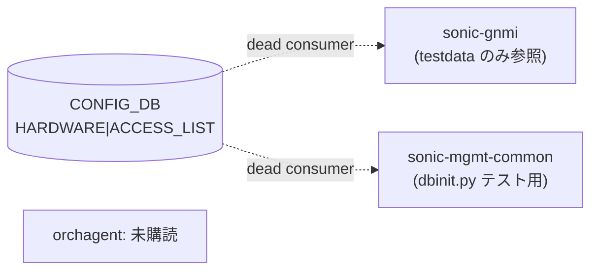

# HARDWARE テーブル

## 概要

`HARDWARE|ACCESS_LIST` は ACL ハードウェア動作モードを CONFIG_DB に宣言するためのテーブルである。`COUNTER_MODE`（カウンタ粒度）、`LOOKUP_MODE`（TCAM ルックアップ戦略）、`TCAM_SHARING`（TCAM 共有グループ）の 3 フィールドを持つ。

!!! danger "community 実装での dead consumer"
    **community sonic-swss/orchagent はこのテーブルを購読しない。** 値を書き込んでも `AclOrch` には届かず、SAI にも影響しない。sonic-gnmi testdata および sonic-mgmt-common のテスト初期化スクリプトにのみ参照が確認できる。YANG モジュールも存在しないため、CVL (Config Validation Layer) による値検証も行われない。

    Dell 等のベンダー向け gNMI/translib スタック（sonic-mgmt-common の transformer 層）でのみ消費されると推定される。

!!! warning "YANG 未定義"
    `HARDWARE` テーブルは `sonic-yang-models` に対応 YANG モジュールが存在しない。スキーマの正本となるソースコードは community SONiC リポジトリ内には未確認。

<!-- cdb-mermaid -->
### データフロー



!!! note "凡例"
    community orchagent はこのテーブルを消費しない。破線はテスト/testdata 内での参照を示す。
<!-- /cdb-mermaid -->

## key 構造

```text
HARDWARE|<component>
```

現在確認されている component は `ACCESS_LIST` のみ。

## フィールド一覧

| フィールド | 型 | 必須 | 説明 |
|-----------|----|------|------|
| `COUNTER_MODE` | string | - | ACL カウンタの粒度。観測値: `per-rule`、`PER-RULE` |
| `LOOKUP_MODE` | string | - | ACL TCAM ルックアップ戦略。観測値: `optimized`、`advanced`、`LEGACY` |
| `TCAM_SHARING` | leaf-list (string) | - | TCAM 共有グループ名リスト（`@` サフィックス付き Redis leaf-list エンコーディング）。空リストが観測されている |

## 観測例

**sonic-gnmi/testdata/db_dump.json**[^1]:

```json
"HARDWARE|ACCESS_LIST": {
  "TCAM_SHARING@": "",
  "COUNTER_MODE": "per-rule",
  "LOOKUP_MODE":  "advanced"
}
```

**sonic-mgmt-common/tools/test/dbinit.py**[^2]:

```python
db_hmset(ConfigDB, "HARDWARE|ACCESS_LIST", {
    "COUNTER_MODE": "per-rule",
    "LOOKUP_MODE":  "optimized",
})
```

**sonic-gnmi/testdata/db_dump.json (HARDWARE_TABLE 変種)**[^1]:

```json
"HARDWARE_TABLE|ACCESS_LIST": {
  "LOOKUP_MODE": "LEGACY",
  "COUNTER_MODE": "PER-RULE"
}
```

## 関連 CONFIG_DB / YANG / CLI

- 関連 CONFIG_DB: `ACL_TABLE`、`ACL_RULE`
- 関連 CLI: なし（コマンドは確認されていない）
- 関連 YANG: なし（YANG 未定義）

<!-- ordering -->
## 書込み順依存 (Phase B)

community sonic-swss/orchagent は `HARDWARE` テーブルを**購読しない**（dead consumer）。
`orchagent/`・`cfgmgr/`・`fpmsyncd/` 全体で `COUNTER_MODE` / `LOOKUP_MODE` / `TCAM_SHARING` / `ACCESS_LIST` の参照は 0 件であり、書込み順依存は community コードパスでは発生しない。

### 検出された順序依存

| # | 依存関係 | 方向 | 緩和策 |
|---|----------|------|--------|
| 1 | `HARDWARE\|ACCESS_LIST` 書込み → AclOrch への反映 | **依存なし（dead consumer）** | community orchagent は無視。SAI / ASIC への影響なし |
| 2 | `HARDWARE_TABLE\|ACCESS_LIST`（アンダースコア版）書込み | **依存なし** | こちらも community では未消費。testdata でのみ観測 |
| 3 | `ACL_TABLE` / `ACL_RULE` との書込み前後関係 | **無関係** | `HARDWARE\|ACCESS_LIST` は `AclOrch` に到達しないため前後依存は存在しない |

!!! note "ベンダー実装（Dell translib 等）での順序依存"
    Dell 等のベンダー向け gNMI/translib スタック（`sonic-mgmt-common` transformer 層）では
    `HARDWARE|ACCESS_LIST` を READ/WRITE するとされる。当該コードは community リポジトリ外のため
    書込み順序の詳細は本ページの対象外。

詳細探索証跡: `meta/_intermediate/cdb-flow/hardware-ordering.md`
<!-- /ordering -->

<!-- cross-refs -->
## 暗黙参照・共依存コンポーネント (Phase C)

> 調査証跡: `meta/_intermediate/cdb-flow/hardware-cross-refs.md`

`HARDWARE|ACCESS_LIST` は CONFIG_DB に書き込まれるが、community SONiC コードパスでは**いずれのコンポーネントも参照しない**（dead consumer）。YANG モジュールが存在しないため leafref による参照整合性保証も一切ない。

| 参照元 / 参照先 | DB / リソース | 参照方向 | YANG leafref | 実装上の必須度 | 証拠 |
|---|---|---|---|---|---|
| `HARDWARE\|ACCESS_LIST` → AclOrch | CONFIG_DB → orchagent | 書込み側のみ | なし | **community では無関係** | `sonic-swss/orchagent/aclorch.cpp` に COUNTER_MODE / LOOKUP_MODE / TCAM_SHARING の参照 0 件 |
| `HARDWARE\|ACCESS_LIST` → sonic-gnmi | CONFIG_DB → gnmi | testdata のみ参照 | なし | テストデータのみ | `sonic-gnmi/testdata/db_dump.json` に出現; 本番 gNMI コードには参照なし |
| `HARDWARE\|ACCESS_LIST` → sonic-mgmt-common | CONFIG_DB → translib | テスト初期化のみ | なし | テストデータのみ | `sonic-mgmt-common/tools/test/dbinit.py:88-90` |
| `ACL_TABLE` / `ACL_RULE` | CONFIG_DB | 設計上の関連テーブル | なし | **実装上は無関係** | `aclorch.cpp` は HARDWARE テーブルを参照せず独立して動作する |

### community では参照なし

`sonic-swss` (`orchagent/` `cfgmgr/` `fpmsyncd/`)、`sonic-utilities`、`sonic-gnmi`（本番コード）のいずれも
`COUNTER_MODE` / `LOOKUP_MODE` / `TCAM_SHARING` を参照しない。
YANG leafref が存在しないため CVL (Config Validation Layer) も無効である。

### ベンダー実装での参照（対象外）

Dell 等のベンダー向け gNMI/translib スタック（`sonic-mgmt-common` transformer 層の vendored 拡張）では
`HARDWARE|ACCESS_LIST` を READ/WRITE する可能性が高い。ただし当該コードは community リポジトリ外のため、
本ページの調査対象外とする。

<!-- /cross-refs -->

<!-- cdb-exceptions -->
## 例外条件・特殊挙動

| 条件 | 挙動 |
|------|------|
| community orchagent 実行中に `HARDWARE|ACCESS_LIST` を書き込む | orchagent は無視。SAI / ASIC への影響なし |
| `COUNTER_MODE` 不正値 | YANG 検証なし、consumer なし。書き込み成功するが効果なし |
| `LOOKUP_MODE` 不正値 | YANG 検証なし、consumer なし。書き込み成功するが効果なし |
| `TCAM_SHARING` フィールド | leaf-list として `@` サフィックス付きで格納。空リストはデフォルト |
| `HARDWARE_TABLE|ACCESS_LIST` (アンダースコア版) | testdata にのみ出現。community SONiC では使用意図不明 |

<!-- evidence: sonic-net/sonic-swss → 0 hits for COUNTER_MODE, LOOKUP_MODE, TCAM_SHARING, ACCESS_LIST -->
<!-- /cdb-exceptions -->

<!-- defaults -->
## コード由来の暗黙デフォルト

| フィールド | YANG default | コード fallback | 乖離種類 |
|---|---|---|---|
| `COUNTER_MODE` | なし (YANG 未定義) | なし — **dead consumer** | dead consumer |
| `LOOKUP_MODE` | なし (YANG 未定義) | なし — **dead consumer** | dead consumer |
| `TCAM_SHARING` | なし (YANG 未定義) | なし — **dead consumer** | dead consumer |

**大文字小文字制約**: `COUNTER_MODE` の値 `per-rule` と `PER-RULE` が並存しており、統一基準なし。consumer 不在のため実際の正規化ルールは不明。

**フィールド由来**: sonic-gnmi/testdata と sonic-mgmt-common/dbinit.py で確認。community sonic-swss (`grep -rn 'COUNTER_MODE\|LOOKUP_MODE\|TCAM_SHARING' sonic-swss/`) は 0 件。

詳細探索証跡: `meta/_intermediate/cdb-flow/hardware-defaults.md`
<!-- /defaults -->

## 引用元

[^1]: sonic-net/sonic-gnmi `testdata/db_dump.json` @ eb635b7679b260c3fd0786a6d0734fc8e82c9a22
[^2]: sonic-net/sonic-mgmt-common `tools/test/dbinit.py` @ f71cf829883c36963455cf4d90fe16dae35f0b80
