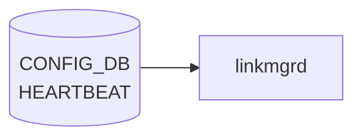

# HEARTBEAT テーブル

## 概要

システムプロセスの heartbeat 監視 (生存確認) のインターバルとアラート間隔をプロセスごとに設定するテーブル[^1]。
process monitor は登録された `name` のプロセスから `heartbeat_interval` ms ごとに生存通知を期待し、`alert_interval` ms 内に通知がなければアラートを上げる。

<!-- cdb-mermaid -->
### データフロー (自動生成)



!!! note "凡例"
    CONFIG_DB から SAI までの典型経路を `docs/reference/config-db-orch-map.md` から機械生成したミニ図。詳細・例外は本ページ本文と対応表を参照。
<!-- /cdb-mermaid -->

## key 構造

```
HEARTBEAT|<name>
```

`<name>`: 1–32 文字。監視対象プロセス名 (例: `pmon`, `swss`, `syncd` 等)。

## フィールド

| フィールド | 型 | 既定 | 説明 |
|-----------|----|------|------|
| `heartbeat_interval` | uint32 | `10000` | 期待される heartbeat 送信間隔 [ms] |
| `alert_interval`     | uint32 | `60000` | この時間内に heartbeat 不達ならアラート [ms] |

## 購読者

- process monitor デーモン (heartbeat 監視機能を持つ host service)。各プロセスは `STATE_DB` 等に生存通知を書き、監視側がタイムアウトを検査する

## 関連 YANG

- `sonic-heartbeat`

<!-- ref-triangle:start -->

## 関連リファレンス

- YANG: `sonic-heartbeat`

<!-- ref-triangle:end -->

## 引用元

[^1]: YANG 定義: `sonic-heartbeat.yang`. <https://github.com/sonic-net/sonic-buildimage/blob/9ea932ec2e18f35e58268ec2e4456b1d4afd65cd/src/sonic-yang-models/yang-models/sonic-heartbeat.yang>

## 関連ページ
- [CONFIG_DB index](index.md)

<!-- ops-hint -->
## 運用ヒント

### 典型値

- key 形式: `HEARTBEAT|<key>`。
- `interval`: 秒単位の hearbeat 間隔。デフォルトはイメージ依存。

### よくある誤設定

- interval を極端に短くすると CPU 負荷が上がり他デーモン処理が遅延する。

### 確認コマンド

```bash
sonic-db-cli CONFIG_DB keys 'HEARTBEAT|*'
```
<!-- /ops-hint -->
