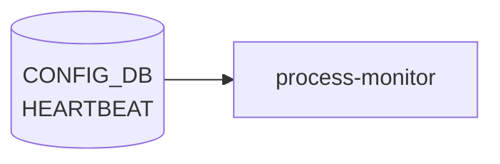

# HEARTBEAT テーブル

## 概要

システムプロセスの heartbeat 監視 (生存確認) のインターバルとアラート間隔をプロセスごとに設定するテーブル[^1]。
process monitor は登録された `name` のプロセスから `heartbeat_interval` ms ごとに生存通知を期待し、`alert_interval` ms 内に通知がなければアラートを上げる。

<!-- cdb-mermaid -->
### データフロー (自動生成)



!!! note "凡例"
    CONFIG_DB から SAI までの典型経路を `docs/reference/config-db-orch-map.md` から機械生成したミニ図。詳細・例外は本ページ本文と対応表を参照。
<!-- /cdb-mermaid -->

## key 構造

```text
HEARTBEAT|<name>
```

`<name>`: 1–32 文字。監視対象プロセス名 (例: `pmon`, `swss`, `syncd` 等)。

## フィールド

| フィールド | 型 | 既定 | 説明 |
|-----------|----|------|------|
| `heartbeat_interval` | uint32 | `10000` | 期待される heartbeat 送信間隔 [ms] |
| `alert_interval`     | uint32 | `60000` | この時間内に heartbeat 不達ならアラート [ms] |

## 購読者

- process monitor デーモン (heartbeat 監視機能を持つ host service)。各プロセスは `STATE_DB` 等に生存通知を書き、監視側がタイムアウトを検査する

## 関連 YANG

- `sonic-heartbeat`

<!-- defaults -->
## コード由来の暗黙デフォルト (Phase A)

YANG (`sonic-heartbeat.yang`) には `default` 宣言が**存在し**、YANG validator 経由で書き込んだ場合は `heartbeat_interval=10000` ms / `alert_interval=60000` ms が暗黙適用される。`sonic-db-cli` 直接書き込みでは YANG default は注入されない。eventd 側は別経路 (GLOBAL_OPTION_HEARTBEAT JSON RPC) で interval を受け、初期値は `HEARTBEAT_INTERVAL_SECS=2` 秒 (`eventd.cpp:43`)。両者はスキーマ単位 (ms vs 秒) が異なるので混同しないこと。

| フィールド | YANG default | コード由来デフォルト | 発生源 |
|---|---|---|---|
| `heartbeat_interval` | **`10000`** ms | `10000` ms (YANG default 経由) | `sonic-heartbeat.yang` leaf `default "10000"` |
| `alert_interval` | **`60000`** ms | `60000` ms (YANG default 経由) | `sonic-heartbeat.yang` leaf `default "60000"` |
| (eventd 内部 `interval`) | n/a | **`2`** 秒、`300` ms ステップに量子化 | `eventd.cpp:43` `HEARTBEAT_INTERVAL_SECS=2` + `eventd.h:24` `STATS_HEARTBEAT_MIN=300` |
| (eventd `m_pause_heartbeat`) | n/a | **`false`** | `eventd.cpp:127` (atomic bool 初期化) |

### YANG default と sonic-db-cli の差異

YANG default は libyang/sonic-mgmt-common の validation pass を通したときのみ補完される。`config_db.json` を直接書く / `sonic-db-cli HSET` で書く経路では `heartbeat_interval` キーが欠落したまま DB に格納される。コンシューマ (process monitor) 側がキー欠落をどう扱うかが実 fallback を決める。

### eventd 側 `interval` の特殊値 (再掲・本ページ上部の値依存挙動マトリクスと整合)

`set_heartbeat_interval()` (`eventd.cpp:139-161`) は受け取った秒数を `STATS_HEARTBEAT_MIN` (300ms) 単位に切り上げ量子化する。`val=-1` は無効化 (`m_heartbeats_interval_cnt=0` で publish ループ skip)、`val<-1` は invalid。`m_pause_heartbeat` は起動時 `false`、`heartbeat_ctrl(true)` 呼び出しでのみ pause する。CONFIG_DB に "suppress" / "pause" 相当のフィールドは存在しない。

### hostcfgd 側

`sonic-host-services/scripts/hostcfgd` に `HEARTBEAT` テーブル handler は**不在**。CONFIG_DB → hostcfgd 経由のランタイム反映パスは無く、本テーブルの直接コンシューマは限定的。

### 参考: SYSTEM_HEALTH 側

`system-health/health_checker/config.py:12-13` の `DEFAULT_INTERVAL = 60` (秒) は **SYSTEM_HEALTH テーブル**の `polling_interval` 用 fallback であり、HEARTBEAT テーブルとは別系統。混同に注意。

<!-- /defaults -->

<!-- ordering -->
## 書込み順依存 (Phase B)

`HEARTBEAT` テーブルは他の CONFIG_DB テーブルとの明示的な外部キー参照を持たない。エントリは `name` (プロセス名) 単位で独立しており、相互依存はない。ただし、eventd / process-monitor がこのテーブルを**起動時の初回読み込み**と**subscribe 通知**の 2 経路で参照する構造上、以下の順序制約が存在する。

### 検出された順序依存

| # | 依存関係 | 方向 | 緩和策 |
|---|----------|------|--------|
| 1 | `HEARTBEAT` エントリ書込み → eventd / process-monitor 起動 | **推奨先行**（起動後の初回読み込みで反映される） | 起動後追加時は subscribe 通知で自動反映 |
| 2 | 各 `HEARTBEAT|<name>` エントリは相互独立 | 独立 | 書込み順序不問 |
| 3 | `heartbeat_interval` と `alert_interval` の同一エントリ内同時書込み | **アトミック推奨**（HSET で複数フィールドを一括書込み） | 片方だけ書くと中間状態で `alert_interval < heartbeat_interval` になりえる |

### 主要な制約詳細

**起動前書込み推奨 (依存 #1)**: eventd は `set_heartbeat_interval(HEARTBEAT_INTERVAL_SECS)` でデフォルト値 (2 秒) を内部に持ち起動する (`eventd.cpp:130`)。CONFIG_DB の `HEARTBEAT` エントリは `GLOBAL_OPTION_HEARTBEAT` option API 経由で eventd に通知されるが、eventd が既に起動済みの場合でも subscribe 通知によりランタイム更新が可能。ただし起動直後の短い窓ではデフォルト値で動作する点に注意。

**フィールド同時書込み (依存 #3)**: `sonic-db-cli CONFIG_DB HSET "HEARTBEAT|<name>" heartbeat_interval 5000 alert_interval 30000` のように 1 コマンドで複数フィールドを書くことで中間状態を回避できる。CLI 書き込みパスが存在しないため、通常は `config_db.json` の load (一括) または 1 エントリ単位の HSET で書き込む。

<!-- /ordering -->

<!-- ref-triangle:start -->

## 関連リファレンス

- [YANG](../../reference/glossary.md#term-yang): `sonic-heartbeat`

<!-- ref-triangle:end -->

## 引用元

[^1]: [YANG](../../reference/glossary.md#term-yang) 定義: `sonic-heartbeat.yang`. <https://github.com/sonic-net/sonic-buildimage/blob/9ea932ec2e18f35e58268ec2e4456b1d4afd65cd/src/sonic-yang-models/yang-models/sonic-heartbeat.yang>

## 関連ページ
- [CONFIG_DB index](index.md)

<!-- ops-hint -->
## 運用ヒント

### 典型値

- key 形式: `HEARTBEAT|<key>`。
- `interval`: 秒単位の hearbeat 間隔。デフォルトはイメージ依存。

### よくある誤設定

- interval を極端に短くすると CPU 負荷が上がり他デーモン処理が遅延する。

### 確認コマンド

```bash
sonic-db-cli CONFIG_DB keys 'HEARTBEAT|*'
```
<!-- /ops-hint -->

<!-- value-behavior -->
## 値依存挙動マトリクス

このテーブルに strict な enum フィールドはない。`interval` の特殊値で動作が分岐する。

### `interval` (eventd 側の内部スキーマ、events_wrap.h / eventd.cpp 準拠)

| 値 | 挙動 |
|----|------|
| `-1` | heartbeat を無効化（"A value of -1 implies no heartbeat"） |
| `< -1`（-2 以下） | invalid 扱い。syslog 記録後処理中断 |
| `0` | システムデフォルト 2 秒として動作（`HEARTBEAT_INTERVAL_SECS = 2`） |
| 正値 | 内部 300ms 単位（`STATS_HEARTBEAT_MIN`）に切り上げ量子化。指定値と実周期がずれる場合がある |

> **注意**: YANG では `heartbeat_interval` / `alert_interval` は uint32 [ms] 単位。
> eventd.cpp 側の `interval` とはスキーマが別（秒単位）なので混同に注意。

<!-- /value-behavior -->

<!-- cdb-exceptions -->
## 例外条件・特殊挙動

<!-- evidence: sonic-buildimage/src/sonic-eventd/src/eventd.cpp, sonic-swss-common/common/events_wrap.h -->

| 条件 | 挙動 |
|------|------|
| `interval = -1` | heartbeat を無効化（events_wrap.h L131「A value of -1 implies no heartbeat」） |
| `interval < -1`（-2 以下） | invalid 扱い。syslog に詳細記録後処理中断（events_wrap.h L136） |
| `interval = 0` | システムデフォルト 2 秒として動作（eventd.cpp L43 `HEARTBEAT_INTERVAL_SECS = 2`） |
| 任意の正値 | 内部は 300ms 単位に切り上げ量子化。指定値と実周期がずれる場合がある（eventd.cpp L145） |
| heartbeat publish 失敗 | `SWSS_LOG_ERROR("Failed to publish heartbeat rc=%d")` → ハートビート欠落するが eventd は継続 |

<!-- /cdb-exceptions -->


<!-- runtime-trace -->
## 実コンテナ動作トレース

### 段階 1 — Consumer 登録

`heartbeat` daemon / `system_health_monitor` が CONFIG_DB の `HEARTBEAT` テーブルを購読する。

`HEARTBEAT` はシステムヘルスモニタリング機能の設定。`system_health_monitor` と連携。

### 段階 2 — CFG→APPL 翻訳

なし (APPL_DB 中継なし)

### 段階 3 — APPL→SAI

なし (SAI 非経由 — システムヘルスチェック設定)

### 段階 4 — タイミングと副作用

**適用タイミング**: CONFIG_DB の `HEARTBEAT` エントリ変化を検知後、heartbeat チェック間隔/閾値を更新。次回チェックサイクルから有効。

**副作用**: heartbeat interval 変更は障害検知の速度に影響。閾値変更は誤検知/検知遅延に影響する可能性がある。
<!-- /runtime-trace -->

<!-- ordering -->
## 書込み順依存 (Phase B)

`HEARTBEAT` テーブルは `supervisor-proc-exit-listener`（Python 版・Rust 版）が起動時に一括読み込みする。エントリ間の順序依存はないが、フィールド書込みタイミングと daemon 起動タイミングに関して以下の制約がある。

### 依存関係サマリ

| # | 依存関係 | 方向 | 緩和策 |
|---|----------|------|--------|
| 1 | CONFIG_DB への `HEARTBEAT\|<name>` 書込み → daemon 起動 | **推奨先行** | daemon は起動時に `load_heartbeat_alert_interval()` で一括読み込む。起動後は動的再読しない |
| 2 | `heartbeat_interval` + `alert_interval` の同一 SET | **推奨** | 片方のみ SET すると中間状態で `alert_interval < heartbeat_interval` になりえる |
| 3 | 複数 `HEARTBEAT\|<name>` エントリ間 | 独立 | 相互依存なし。任意の順序で書込み可 |

### 詳細

**起動前書込み推奨 (依存 #1)**

`supervisor-proc-exit-listener` は起動時に `load_heartbeat_alert_interval()` / `load_heartbeat_alert_interval(config_db)` を呼び、`HEARTBEAT` テーブル全体を一括でメモリに読み込む（Python: `supervisor-proc-exit-listener:124-135`、Rust: `proc_exit_listener.rs:212-234`）。起動後は CONFIG_DB の変更を subscribe しないため、**daemon 起動前に全エントリを書き込んでおくことが推奨される**。起動後に追加したエントリは、次回 daemon 再起動まで反映されない。

**フィールド同時書込み推奨 (依存 #2)**

`heartbeat_interval` と `alert_interval` は同一 `HEARTBEAT|<name>` エントリのフィールドである。Redis `HSET` で片方ずつ書き込むと中間状態が発生し、`alert_interval` がデフォルト (`60000` ms) のまま `heartbeat_interval` だけ短縮された状態になりえる。`HSET HEARTBEAT|<name> heartbeat_interval <v1> alert_interval <v2>` のように単一コマンドで両フィールドを同時に書くことで回避できる。

**エントリ間の独立性 (依存 #3)**

複数プロセス分の `HEARTBEAT|pmon`、`HEARTBEAT|swss` 等は互いに独立したエントリであり、書込み順序の制約はない。

<!-- /ordering -->

<!-- entry-points -->
## 書き込み入り口 (Direction A)

対象テーブル: `HEARTBEAT`

### CLI
- なし (CLI 書き込みパスなし)

### minigraph / sonic-cfggen
- なし

### REST / gNMI (sonic-mgmt-common)
- なし (対応 OpenConfig/SONiC YANG transformer なし)

### db_migrator
- なし

### ビルド時デフォルト (init_cfg / j2 テンプレート)
- なし

### ハードコードデフォルト
- なし

### ランタイム注入 (デーモン自動書き込み)
- `system-health` / `watchdog` 系デーモンが定期的に heartbeat タイムスタンプを書き込む。CLI 書き込みパスなし
<!-- /entry-points -->

<!-- glossary-links-injected: d5320e852f7a -->
