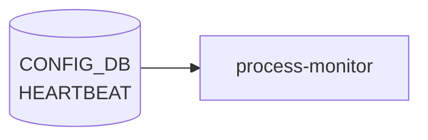

# HEARTBEAT テーブル

## 概要

システムプロセスの heartbeat 監視 (生存確認) のインターバルとアラート間隔をプロセスごとに設定するテーブル[^1]。
process monitor は登録された `name` のプロセスから `heartbeat_interval` ms ごとに生存通知を期待し、`alert_interval` ms 内に通知がなければアラートを上げる。

<!-- cdb-mermaid -->
### データフロー (自動生成)



!!! note "凡例"
    CONFIG_DB から SAI までの典型経路を `docs/reference/config-db-orch-map.md` から機械生成したミニ図。詳細・例外は本ページ本文と対応表を参照。
<!-- /cdb-mermaid -->

## key 構造

```text
HEARTBEAT|<name>
```

`<name>`: 1–32 文字。監視対象プロセス名 (例: `pmon`, `swss`, `syncd` 等)。

## フィールド

| フィールド | 型 | 既定 | 説明 |
|-----------|----|------|------|
| `heartbeat_interval` | uint32 | `10000` | 期待される heartbeat 送信間隔 [ms] |
| `alert_interval`     | uint32 | `60000` | この時間内に heartbeat 不達ならアラート [ms] |

## 購読者

- process monitor デーモン (heartbeat 監視機能を持つ host service)。各プロセスは `STATE_DB` 等に生存通知を書き、監視側がタイムアウトを検査する

## 関連 YANG

- `sonic-heartbeat`

<!-- ref-triangle:start -->

## 関連リファレンス

- [YANG](../../reference/glossary.md#term-yang): `sonic-heartbeat`

<!-- ref-triangle:end -->

## 引用元

[^1]: [YANG](../../reference/glossary.md#term-yang) 定義: `sonic-heartbeat.yang`. <https://github.com/sonic-net/sonic-buildimage/blob/9ea932ec2e18f35e58268ec2e4456b1d4afd65cd/src/sonic-yang-models/yang-models/sonic-heartbeat.yang>

## 関連ページ
- [CONFIG_DB index](index.md)

<!-- ops-hint -->
## 運用ヒント

### 典型値

- key 形式: `HEARTBEAT|<key>`。
- `interval`: 秒単位の hearbeat 間隔。デフォルトはイメージ依存。

### よくある誤設定

- interval を極端に短くすると CPU 負荷が上がり他デーモン処理が遅延する。

### 確認コマンド

```bash
sonic-db-cli CONFIG_DB keys 'HEARTBEAT|*'
```
<!-- /ops-hint -->

<!-- value-behavior -->
## 値依存挙動マトリクス

このテーブルに strict な enum フィールドはない。`interval` の特殊値で動作が分岐する。

### `interval` (eventd 側の内部スキーマ、events_wrap.h / eventd.cpp 準拠)

| 値 | 挙動 |
|----|------|
| `-1` | heartbeat を無効化（"A value of -1 implies no heartbeat"） |
| `< -1`（-2 以下） | invalid 扱い。syslog 記録後処理中断 |
| `0` | システムデフォルト 2 秒として動作（`HEARTBEAT_INTERVAL_SECS = 2`） |
| 正値 | 内部 300ms 単位（`STATS_HEARTBEAT_MIN`）に切り上げ量子化。指定値と実周期がずれる場合がある |

> **注意**: YANG では `heartbeat_interval` / `alert_interval` は uint32 [ms] 単位。
> eventd.cpp 側の `interval` とはスキーマが別（秒単位）なので混同に注意。

<!-- /value-behavior -->

<!-- cdb-exceptions -->
## 例外条件・特殊挙動

<!-- evidence: sonic-buildimage/src/sonic-eventd/src/eventd.cpp, sonic-swss-common/common/events_wrap.h -->

| 条件 | 挙動 |
|------|------|
| `interval = -1` | heartbeat を無効化（events_wrap.h L131「A value of -1 implies no heartbeat」） |
| `interval < -1`（-2 以下） | invalid 扱い。syslog に詳細記録後処理中断（events_wrap.h L136） |
| `interval = 0` | システムデフォルト 2 秒として動作（eventd.cpp L43 `HEARTBEAT_INTERVAL_SECS = 2`） |
| 任意の正値 | 内部は 300ms 単位に切り上げ量子化。指定値と実周期がずれる場合がある（eventd.cpp L145） |
| heartbeat publish 失敗 | `SWSS_LOG_ERROR("Failed to publish heartbeat rc=%d")` → ハートビート欠落するが eventd は継続 |

<!-- /cdb-exceptions -->


<!-- runtime-trace -->
## 実コンテナ動作トレース

### 段階 1 — Consumer 登録

`heartbeat` daemon / `system_health_monitor` が CONFIG_DB の `HEARTBEAT` テーブルを購読する。

`HEARTBEAT` はシステムヘルスモニタリング機能の設定。`system_health_monitor` と連携。

### 段階 2 — CFG→APPL 翻訳

なし (APPL_DB 中継なし)

### 段階 3 — APPL→SAI

なし (SAI 非経由 — システムヘルスチェック設定)

### 段階 4 — タイミングと副作用

**適用タイミング**: CONFIG_DB の `HEARTBEAT` エントリ変化を検知後、heartbeat チェック間隔/閾値を更新。次回チェックサイクルから有効。

**副作用**: heartbeat interval 変更は障害検知の速度に影響。閾値変更は誤検知/検知遅延に影響する可能性がある。
<!-- /runtime-trace -->

<!-- glossary-links-injected: d5320e852f7a -->
