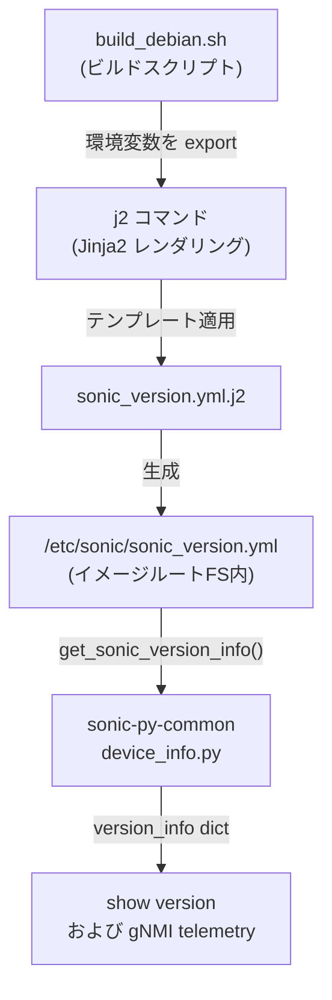

# SONiC イメージバージョン情報 (sonic_version.yml)

## 概要

SONiC OS のイメージバージョン・ビルド情報は `/etc/sonic/sonic_version.yml` に格納される[^1]。このファイルは `sonic-buildimage` のビルドプロセス（`build_debian.sh`）が Jinja2 テンプレート（`files/build_templates/sonic_version.yml.j2`）から生成し、インストールされたイメージのファイルシステムルートに配置される。

Redis の CONFIG_DB / STATE_DB テーブルとは異なり、**ファイルシステム上の静的 YAML ファイル**として提供される。ランタイムでは `sonic-py-common` の `device_info.get_sonic_version_info()` API が読み込んで返す。

!!! note "STATE_DB 直接格納なし"
    `/etc/sonic/sonic_version.yml` のデータは Redis STATE_DB には書き込まれない。`show version` コマンドおよび gNMI telemetry はいずれもファイルから直接読む。

## ファイル位置

```text
/etc/sonic/sonic_version.yml
```

## フィールド

| フィールド | 型 | 省略可 | 説明 |
|-----------|-----|--------|------|
| `build_version` | string | 必須 | イメージのバージョン文字列。タグ付きビルドではタグ名、開発ビルドでは `<branch>.<build_number>-<commit_sha>` 形式 |
| `debian_version` | string | 任意 | ビルド時の Debian OS バージョン (`/etc/debian_version` の内容) |
| `kernel_version` | string | 任意 | ビルドに使用したカーネルバージョン |
| `asic_type` | string | 必須 | ASIC プラットフォーム種別 (例: `broadcom`, `mellanox`, `vs`) |
| `asic_subtype` | string | 任意 | ターゲットマシン種別 (`TARGET_MACHINE`)。空の場合は省略 |
| `commit_id` | string | 必須 | ビルド時の git コミット short SHA |
| `branch` | string | 必須 | ビルド時の git ブランチ名 |
| `release` | string | 必須 (デフォルト `none`) | sonic_release ファイルが存在すればその内容、なければ `'none'` |
| `build_date` | string | 必須 | ビルド日時 (UTC, `date -u` の出力形式) |
| `build_number` | integer | 必須 (デフォルト `0`) | CI ビルド番号 (`BUILD_NUMBER` 変数、未設定時 `0`) |
| `built_by` | string | 必須 | ビルドを実行したユーザー (`$USER@$BUILD_HOSTNAME`) |
| `sonic_os_version` | string | 必須 | SONiC OS バージョン番号。`SONIC_OS_VERSION` 変数 (デフォルト `13`) |
| `secure_boot_image` | string | 必須 | `'yes'` または `'no'`。`SECURE_UPGRADE_MODE` が `dev` か `prod` のとき `'yes'` |
| `asan` | string | 任意 | `'yes'` (ASAN 有効ビルド時のみ存在) |
| `<component>` | string | 任意 | `COMPONENTS` 変数で列挙されたパッケージ名をキー、バージョンを値とする動的フィールド群 |

## 生成プロセス



## `build_version` の生成ロジック

`sonic_get_version()` 関数 (`functions.sh:53-68`) が以下の規則で決定する[^2]:

1. タグ付きコミットの場合: `<git-tag>` (dirty ビルドでは末尾に `-dirty-<timestamp>`)
2. 通常ビルド: `<branch>.<BUILD_NUMBER>-<commit_sha>` 形式
   - `BUILD_NUMBER` 未設定時は `0`
   - dirty ビルド (uncommitted 変更あり) では `-<commit_sha>` の代わりに `-dirty-<timestamp>`

## アクセス方法

```bash
# ファイルを直接確認
cat /etc/sonic/sonic_version.yml

# show version コマンドで確認
show version

# Python API 経由
python3 -c "from sonic_py_common import device_info; import json; print(json.dumps(device_info.get_sonic_version_info(), indent=2))"
```

## 出力例 (show version)

```
SONiC Software Version: SONiC.master.487-a98cf221
SONiC OS Version: 13
Distribution: Debian 12.5
Kernel: 6.1.0-20-2-amd64
Build commit: a98cf221
Build date: Thu Nov 12 12:21:45 UTC 2020
Built by: johnar@jenkins-worker-8
```

<!-- defaults -->
## フィールド暗黙デフォルト (Phase A — コード由来)

`/etc/sonic/sonic_version.yml` は Redis STATE_DB テーブルではなく YAML ファイルとして提供される。YANG schema は存在しない。フィールドとデフォルト値はすべてビルドスクリプトとテンプレートで定義される。

| フィールド | コード由来デフォルト | 根拠 |
|-----------|------------------|------|
| `build_version` | `sonic_get_version()` 出力 (`<branch>.<BUILD_NUMBER>-<commit_sha>`) | `build_debian.sh:642`, `functions.sh:53-68` |
| `debian_version` | ビルド時 `cat /etc/debian_version` | `build_debian.sh:643` — 取得失敗時は省略 |
| `kernel_version` | ビルド環境の `kversion` 変数 | `build_debian.sh:644` — 取得失敗時は省略 |
| `asic_type` | ビルド時の `sonic_asic_platform` 変数 | `build_debian.sh:645` — 必須フィールド |
| `asic_subtype` | `TARGET_MACHINE` 変数 | `build_debian.sh:646` — 空なら YAML に出力されない (テンプレートL10-12) |
| `commit_id` | `git rev-parse --short HEAD` | `build_debian.sh:647` |
| `branch` | `git rev-parse --abbrev-ref HEAD` | `build_debian.sh:648` |
| `release` | `/etc/sonic/sonic_release` の内容、なければ `'none'` | `build_debian.sh:649`, テンプレートL15-19 |
| `build_date` | `date -u` の出力 (UTC タイムスタンプ) | `build_debian.sh:650` |
| `build_number` | `BUILD_NUMBER` 変数、未設定時 `0` | `build_debian.sh:651`, `functions.sh:60` |
| `built_by` | `$USER@$BUILD_HOSTNAME` | `build_debian.sh:652` |
| `sonic_os_version` | `SONIC_OS_VERSION` 変数、未設定時 `13` | `rules/config:379`, `build_debian.sh:653` |
| `secure_boot_image` | `SECURE_UPGRADE_MODE` が `dev`/`prod` なら `'yes'`、それ以外 `'no'` | テンプレートL33-37 |
| `asan` | `ENABLE_ASAN == "y"` のとき `'yes'`、それ以外は**フィールドなし** | テンプレートL29-31 |

### 補足

- `build_version` は `SONiC.` プレフィックス付きで `show version` に表示されるが、ファイル内の値には `SONiC.` は含まれない。`show version` 側が `"SONiC.{}".format(version_info.get('build_version', 'N/A'))` と連結している (`show/main.py:1727`)。
- `debian_version` / `kernel_version` は Jinja2 テンプレートで `` ガードがあるため、未定義の場合はフィールド自体が YAML から省略される。
- `<component>` フィールド群は `COMPONENTS` 変数が `name==version` 形式のスペース区切りリストで定義されている場合のみ出力される。空の場合はフィールドなし。
- `get_sonic_version_info()` は戻り値を `sonic_ver_info` グローバル変数でキャッシュする。同一プロセス内で 2 回目以降の呼び出しはファイルを再読しない (`device_info.py:515-525`)。
- YANG schema、CONFIG_DB エントリ、STATE_DB エントリは存在しない。バージョン情報は専らファイルシステムから参照される。
<!-- /defaults -->

<!-- ordering -->
## 書込み順依存 (Phase B)

`/etc/sonic/sonic_version.yml` はビルド時に生成される静的ファイルであり、CONFIG_DB / STATE_DB への書込みは行わない。ただし、ビルドパイプライン内の変数確定順序と、ランタイムでの読込みキャッシュ挙動に順序依存が存在する。

### 検出された順序依存

| # | 依存関係 | 方向 | 違反時の挙動 |
|---|----------|------|------------|
| 1 | 環境変数エクスポート → `j2` レンダリング (`build_debian.sh`) | **強制先行（同スクリプト内逐次実行）** | 必須フィールドが空、またはガード対象フィールドが省略される |
| 2 | CI による `BUILD_NUMBER` 設定 → `build_debian.sh` 実行 | **推奨先行** | `BUILD_NUMBER` 未設定時は `functions.sh:60` の `${BUILD_NUMBER:-0}` フォールバックで `build_number: 0` が刻まれる |
| 3 | SONiC イメージインストール（ファイル配置完了） → `get_sonic_version_info()` 呼び出し | **強制先行** | ファイル不在時は `os.path.isfile()` チェックで `None` を返す（`device_info.py:512-513`）。`show version` / gNMI が version なし表示になる |
| 4 | 初回 `get_sonic_version_info()` 呼び出し → 以降の同プロセス参照 | **プロセスライフタイム固定（キャッシュ）** | `global sonic_ver_info` に結果を保持し、2 回目以降はファイルを再読しない（`device_info.py:515-517`）。ファイルを書き換えてもプロセス再起動なしでは反映されない |

### 主要な制約詳細

**ビルド時の変数先行 (依存 #1)**: `build_debian.sh:642-654` は `BUILD_VERSION`・`DEBIAN_VERSION`・`KERNEL_VERSION` 等の環境変数をエクスポートしてから `j2 <template>` を呼び出す。これらは同一 Bash スクリプト内で逐次実行されるため、通常は問題が生じない。ただし `asic_subtype`（`TARGET_MACHINE` 変数が空なら省略）や `asan`（`ENABLE_ASAN != "y"` なら省略）は Jinja2 `` ガードで条件付き出力となる（`sonic_version.yml.j2:10-12, 29-31`）。

**`BUILD_NUMBER` フォールバック (依存 #2)**: `functions.sh:60` の `BUILD_NUMBER=${BUILD_NUMBER:-0}` により、CI 環境変数が未設定のローカルビルドでは常に `build_number: 0` が埋め込まれる。`build_version` 文字列も `<branch>.0-<commit_sha>` 形式になるため、同一コミットの複数ローカルビルドを `build_version` で区別できない。

**プロセスキャッシュと hot-reload 不可 (依存 #4)**: `device_info.get_sonic_version_info()` は `sonic_ver_info` グローバル変数でキャッシュするため、`show version` CLI や gNMI telemetry サービスが起動してから `/etc/sonic/sonic_version.yml` を手動書き換えしても、**該当プロセスを再起動するまで旧バージョン情報が返り続ける**。sonic-py-common を使う全デーモン（`telemetry`・`sonic-utilities`）が影響を受ける。

<!-- /ordering -->

<!-- cross-refs -->
## 暗黙参照・共依存コンポーネント (Phase C)

> 調査証跡: `meta/_intermediate/cdb-flow/image-state-cross-refs.md`

`/etc/sonic/sonic_version.yml` は Redis テーブルではないため YANG leafref による参照整合性保証は存在しない。しかし複数のコンポーネントがこのファイルを直接読み込んでおり、ファイル不在またはフィールド欠落時の影響は広範囲に及ぶ。

| コンポーネント | 依存フィールド | ファイル不在時の挙動 | フィールド欠落時の挙動 | evidence |
|---|---|---|---|---|
| `show version` (sonic-utilities) | `build_version`・`asic_type` 等 | `get_sonic_version_info()` が `None` を返す → 各フィールド `.get(key, 'N/A')` で graceful fallback | `N/A` 表示 | `show/main.py:1718-1733` |
| gNMI telemetry (sonic-gnmi) | `build_version` | `SonicVersionInfo.Error` にエラー文字列、`build_version=""` として返却 | 同上 | `non_db_client.go:42-58` |
| `db_migrator.py` | `asic_type` | `version_info.get('asic_type')` が `None` → asic 固有 migration が mellanox 向け等でスキップ | mellanox 向け migrate_xxx が実行されない | `db_migrator.py:96-98` |
| `field_operation_validators.py` (gcu) | `asic_type` | `device_info.get_sonic_version_info()['asic_type']` の直接キーアクセスで **`KeyError`** → gcu フィールド操作が失敗 | `None` 比較で asic 固有ルールが不適用 | `field_operation_validators.py:33` |
| `sonic_package_manager` | version_info dict 全体 | `None` アクセスでクラッシュの可能性 | パッケージバージョン検証の欠落 | `manager.py:323` |
| show プラグイン (mlnx / barefoot / cisco-8000) | `asic_type` | `None` 参照エラー → プラットフォーム固有 show コマンドが失敗 | プラグイン固有処理がスキップ | `show/plugins/*.py:157,48,22` |

### キャッシュによる共通制約

- **sonic-py-common** (`get_sonic_version_info()`): `global sonic_ver_info` にプロセスライフタイム固定でキャッシュ。ファイルを書き換えてもプロセス再起動なしでは反映されない (`device_info.py:515-517`)
- **sonic-gnmi**: `sync.Once` で 1 回のみ読み込む。telemetry サービス再起動まで更新されない。`InvalidateVersionFileStash()` API が存在するがテスト用途のみ (`non_db_client.go:55-58`)

### `asic_type` フィールドの重要性

`asic_type` は最も多くのコンポーネントが参照するフィールドであり、`db_migrator`・`gcu`・mirrororch (`gre_type` プラットフォーム分岐)・各 show プラグインが `asic_type` に基づいて動作を切り替える。ビルド時には必ず `sonic_asic_platform` 変数から設定される必須フィールドだが、テスト環境・VS 環境では `asic_type: vs` が入る。

<!-- /cross-refs -->

<!-- failure -->
## 失敗挙動 (Phase D)

<!-- evidence: sonic-buildimage/src/sonic-py-common/sonic_py_common/device_info.py:511-525, sonic-utilities/show/main.py:1718-1733, sonic-gnmi/sonic_data_client/non_db_client.go:302-336, sonic-utilities/generic_config_updater/field_operation_validators.py:33 -->

`/etc/sonic/sonic_version.yml` は静的ファイルであり CONFIG_DB への書込みは行わないが、読み込み側の各コンポーネントで失敗時の挙動が異なる。

### 失敗シナリオ一覧

| # | 失敗トリガー | 影響コンポーネント | 挙動 | evidence |
|---|------------|-----------------|------|---------|
| 1 | ファイル不在 | `get_sonic_version_info()` | `None` を返す | `device_info.py:512-513` |
| 2 | ファイル不在 → `show version` | sonic-utilities | `version_info['commit_id']` 等の直接キーアクセスで `TypeError` クラッシュ | `show/main.py:1731-1733` |
| 3 | ファイル不在 / YAML パース失敗 | gNMI telemetry | `BuildVersion="sonic.NA"` + `Error` フィールドに理由文字列を格納して JSON 返却（graceful fallback） | `non_db_client.go:306-319` |
| 4 | ファイル不在 → gcu バリデーション | generic_config_updater | `get_sonic_version_info()['asic_type']` の直接キーアクセスで `TypeError` 例外伝播、フィールド操作が失敗 | `field_operation_validators.py:33` |
| 5 | `asic_type` フィールド欠落 | gcu バリデーション | `KeyError` 例外伝播 | `field_operation_validators.py:33` |
| 6 | YAML パース失敗 | `get_sonic_version_info()` | `yaml.YAMLError` が呼び出し元に伝播（例外ハンドリングなし） | `device_info.py:519-523` |
| 7 | ファイル書き換え（プロセス稼働中） | 全コンポーネント | キャッシュ固定のため再起動なしでは反映されない | `device_info.py:515-517`、`non_db_client.go:305` |

### 詳細

#### 1 & 2. ファイル不在時の `show version` クラッシュ

`get_sonic_version_info()` は `os.path.isfile()` チェックで `None` を返す (`device_info.py:512-513`)。`show/main.py:1727-1730` は `.get(key, 'N/A')` で graceful fallback するが、**`show/main.py:1731-1733` の 3 行は直接キーアクセス** (`version_info['commit_id']`, `version_info['build_date']`, `version_info['built_by']`) であるため、`version_info` が `None` のとき `TypeError: 'NoneType' object is not subscriptable` が発生して `show version` がクラッシュする。

#### 3. gNMI の graceful fallback

`non_db_client.go:302-336` は `sync.Once` ブロック内でファイルを読み込む。ファイル読み込み失敗・YAML パース失敗のどちらでも:
```
BuildVersion = "sonic.NA"  // デフォルト値
Error = <エラー文字列>      // 失敗理由
```
この構造体を JSON シリアライズして返す。telemetry クライアントは `Error` フィールドを確認することでファイル読み込み失敗を検出できる。

#### 4 & 5. gcu (generic_config_updater) の例外伝播

`field_operation_validators.py:33` は:
```python
asic_type = device_info.get_sonic_version_info()['asic_type']
```
と直接キーアクセスしており、`get_sonic_version_info()` が `None` を返した場合は `TypeError`、`asic_type` フィールドが YAML に存在しない場合は `KeyError` が上位に伝播する。これらは gcu のフィールド操作バリデーション全体を失敗させる。

#### 7. キャッシュ固定と hot-reload 不可

- **Python 側** (`device_info.py:515-517`): `global sonic_ver_info` に結果を保持し、`sonic_ver_info` が truthy な限り再読しない。`sonic-utilities`・`db_migrator` 等が影響。
- **Go 側** (`non_db_client.go:305`): `sync.Once` で 1 回のみ読み込む。`InvalidateVersionFileStash()` API が存在するが、テストコードからのみ呼ばれるもので、本番 telemetry 稼働中は使用されない (`non_db_client.go:56-58`)。

いずれも `/etc/sonic/sonic_version.yml` を書き換えた場合、**当該プロセスを再起動するまで旧バージョン情報が使われ続ける**。

<!-- /failure -->

<!-- constants -->
## ハードコード定数 (Phase E)

<!-- evidence: sonic-buildimage/rules/config:291-296,358-359,378-379, sonic-buildimage/functions.sh:60, sonic-buildimage/build_debian.sh:651,653, sonic-buildimage/files/build_templates/sonic_version.yml.j2, sonic-py-common/sonic_py_common/device_info.py:19,60,520-523 -->

`/etc/sonic/sonic_version.yml` の生成・読み込みに関与するハードコード定数を一覧化する。フィールド値の実装上の制約を把握するための参照用。

### ファイルパス定数

| 定数名 | 値 | ソース |
|--------|-----|--------|
| `SONIC_VERSION_YAML_PATH` | `"/etc/sonic/sonic_version.yml"` | `device_info.py:19` |

### ビルドデフォルト値

| 変数名 | ハードコードデフォルト | 適用条件 | ソース |
|--------|----------------------|---------|--------|
| `BUILD_NUMBER` | `0` | `BUILD_NUMBER` 環境変数が未設定の場合 | `build_debian.sh:651` (`${BUILD_NUMBER:-0}`)、`functions.sh:60` |
| `SONIC_OS_VERSION` | `13` | `SONIC_OS_VERSION` 変数が未設定の場合 | `rules/config:379` (`SONIC_OS_VERSION ?= 13`) |
| `SECURE_UPGRADE_MODE` | `"no_sign"` | デフォルトビルド設定 | `rules/config:296` (`SECURE_UPGRADE_MODE ?= "no_sign"`) |
| `ENABLE_ASAN` | `n` | デフォルトビルド設定 | `rules/config:359` (`ENABLE_ASAN ?= n`) |

### YAML フィールドデフォルト値（テンプレート埋め込み）

| フィールド | デフォルト文字列値 | 適用条件 | ソース |
|-----------|-----------------|---------|--------|
| `release` | `'none'` | `/etc/sonic/sonic_release` が存在しない場合 | `sonic_version.yml.j2:16-19` |
| `secure_boot_image` | `'no'` | `SECURE_UPGRADE_MODE` が `dev` でも `prod` でもない場合 | `sonic_version.yml.j2:35-37` |

!!! note "SECURE_UPGRADE_MODE と secure_boot_image の関係"
    `SECURE_UPGRADE_MODE` は `dev` / `prod` / `no_sign` の 3 値を取る。`no_sign`（デフォルト）の場合は `secure_boot_image: 'no'` が書き込まれる。`dev` または `prod` の場合のみ `secure_boot_image: 'yes'` となる。

### YAML 読み込み API の定数

| 定数名 | 値 | 役割 | ソース |
|--------|-----|------|--------|
| `sonic_ver_info` | `{}` (空 dict) | キャッシュ変数初期値。プロセスグローバルで結果を保持 | `device_info.py:60` |
| yaml バージョン閾値 | `"5.1"` | `yaml.__version__ >= "5.1"` のとき `yaml.full_load()` を使用し、それ未満は `yaml.safe_load()` にフォールバック | `device_info.py:520-523` |

<!-- /constants -->

<!-- side-effects -->
## 副次 DB 書込み (Phase F)

> 調査証跡: `meta/_intermediate/cdb-flow/image-state-side.md`

<!-- evidence: sonic-buildimage/src/sonic-ctrmgrd/ctrmgr/ctrmgrd.py:292-306,440, sonic-sairedis/syncd/scripts/syncd_init_common.sh:20-21, sonic-buildimage/files/image_config/rsyslog/rsyslog-config.sh:33, sonic-utilities/generic_config_updater/field_operation_validators.py:33 -->

`/etc/sonic/sonic_version.yml` の値を起点に副次的に DB へ書き込むのは `ctrmgrd` のみ。他のコンポーネント（`syncd_init_common.sh`・`rsyslog-config.sh`・`generic_config_updater`・`show version`・`db_migrator`）はファイル内容を読み取るが DB への書込は行わない。

| 副次 DB | テーブル / キー | フィールド | 書込み値 | evidence |
|---------|--------------|---------|---------|---------|
| STATE_DB | `KUBE_LABEL_TABLE\|kube_labels` | `sonic_version` | `build_version` の値 | `ctrmgrd.py:301, 305-306` |

### ctrmgrd による STATE_DB 書込みの詳細

Kubernetes 環境 (`FEATURE` テーブルで `set_owner=kube` が設定されている場合) においてのみ動作する。`ctrmgrd.py:292-306` の `set_node_labels()` 関数が、`build_version` を Kubernetes ノードラベル `sonic_version` として STATE_DB の `KUBE_LABEL_TABLE|kube_labels` に書き込む。

**書込みタイミング**: ctrmgrd 起動後に Kubernetes master 接続が確立した時点で 1 回だけ実行される (`ctrmgrd.py:440`)。以後は `sonic_version.yml` が変わっても再書込みされない（ctrmgrd 再起動が必要）。

**非 Kubernetes 環境**: `set_node_labels()` が呼ばれないため、STATE_DB への副次書込みは一切発生しない。

### 副次書込みなしのコンポーネント

| コンポーネント | 参照フィールド | 用途 | DB 書込み |
|---|---|---|---|
| `syncd_init_common.sh` | `asic_type` | syncd 起動パラメータ決定 (`syncd_init_common.sh:20-21`) | なし（環境変数として利用） |
| `rsyslog-config.sh` | `build_version` | rsyslog タグ文字列設定 (`rsyslog-config.sh:33`) | なし（設定ファイルのみ） |
| `generic_config_updater` | `asic_type`、`build_version` | ASIC 固有バリデーション判定 (`field_operation_validators.py:33`) | なし |
| `db_migrator.py` | `asic_type` | asic 固有マイグレーション分岐 (`db_migrator.py:96-97`) | なし（判定用途のみ） |
| `show version` | 全フィールド | CLI 表示 | なし |

<!-- /side-effects -->

<!-- pubsub -->
## 通信メカニズム (Phase G)

<!-- evidence: sonic-buildimage/src/sonic-py-common/sonic_py_common/device_info.py:511-525, sonic-gnmi/sonic_data_client/non_db_client.go:302-336, sonic-buildimage/src/sonic-ctrmgrd/ctrmgr/ctrmgrd.py:292-306 -->

### 購読方式: なし (Redis pub/sub 不使用 — ファイル直読み)

`/etc/sonic/sonic_version.yml` は **Redis テーブルではなくファイルシステム上の静的 YAML ファイル**であるため、Redis keyspace notification / ConsumerStateTable / SubscriberStateTable は一切関与しない。全コンシューマはファイルを直接読み込む。

| コンポーネント | 読み方式 | タイミング | 変更通知 |
|---|---|---|---|
| `sonic-py-common` (`get_sonic_version_info()`) | `open()` + `yaml.safe_load()` / `yaml.full_load()` | 初回呼び出し時 1 回、以降はプロセスグローバルキャッシュ | なし — ファイル変更を検知する inotify / polling も不使用 |
| `sonic-gnmi` (`non_db_client.go`) | Go `os.ReadFile()` + YAML デシリアライズ | `sync.Once` で起動時 1 回のみ | なし — `InvalidateVersionFileStash()` はテスト用 API のみ |
| `ctrmgrd.py` (`set_node_labels`) | `device_info.get_sonic_version_info()` 経由 | Kubernetes master 接続確立時 1 回 | なし |
| `db_migrator.py` | `device_info.get_sonic_version_info()` 経由 | マイグレーション実行時 1 回 | なし |
| `syncd_init_common.sh` | `python3 -c "import sonic_py_common..."` シェル呼び出し | syncd 起動スクリプト実行時 1 回 | なし |

### ファイル変更の反映経路

Redis pub/sub が存在しないため、`/etc/sonic/sonic_version.yml` を書き換えた場合の反映はプロセス再起動のみ:

```
(ビルド時) build_debian.sh → j2 → /etc/sonic/sonic_version.yml ← inotify なし
                                                    ↓
              プロセス起動時に os.open() / os.ReadFile() で 1 回読み込み
                                                    ↓
              sonic_ver_info グローバル変数 / sync.Once にキャッシュ
              ← 以降の参照はキャッシュから。ファイル更新を自動検知しない
```

### APPL_DB / STATE_DB / SAI 中継

直接は存在しない。`ctrmgrd` のみが例外で、Kubernetes 環境においてのみ `build_version` の値を `STATE_DB:KUBE_LABEL_TABLE|kube_labels.sonic_version` に書き込む（Phase F 参照）。この書き込みも Redis pub/sub トリガではなく、ctrmgrd 起動後の一度限りの API 呼び出し経由である。

<!-- /pubsub -->

<!-- platform -->
## プラットフォーム差 (Phase H)

`/etc/sonic/sonic_version.yml` のフィールド構造・YANG スキーマ・読込み API はプラットフォーム非依存である。ただし、`asic_type` / `asic_subtype` フィールドの**値**がプラットフォームごとに異なり、読み込み後の下流ロジックに分岐を生じさせる。

| 観点 | 結果 | 根拠 |
|------|------|------|
| テンプレート (`sonic_version.yml.j2`) | 実質差なし | VS プラットフォーム固有テンプレート (`platform/vs/sonic-version/sonic_version.yml.j2`) が存在するが、共通版 (`files/build_templates/sonic_version.yml.j2`) と**内容完全一致**。他プラットフォームに固有テンプレートはない |
| フィールド定義・YANG | 差なし | YANG モジュール未定義。全プラットフォームで同一フィールド構造 |
| `asic_type` の値 | プラットフォーム依存 | `broadcom` / `mellanox` / `marvell` / `vs` 等、ビルドターゲット (`sonic_asic_platform`) がそのまま入る |
| `asic_subtype` の値 | HW SKU 依存 | `TARGET_MACHINE` 変数。空の場合はフィールド自体が省略される |
| multi-asic / VOQ chassis | 影響なし | `sonic_version.yml` は 1 ファイル。multi-asic 環境でも ASIC ごとに複数のファイルは存在しない |

### `asic_type` 依存の下流分岐

`device_info.get_platform_mac_address()` は `asic_type` の値を読み取り、MAC アドレス取得戦略をプラットフォームごとに切り替える (`device_info.py:845-940`)。これは `sonic_version.yml` 自体の挙動ではなく、ファイルの読み込み後に生じる二次的なプラットフォーム差である。

| `asic_type` | MAC 取得戦略 |
|-------------|------------|
| `mellanox`, `nvidia-bluefield` | ONIE `onie_base_mac` → `decode-syseeprom` の順 (`device_info.py:851-866`) |
| `marvell-prestera`, `nokia-vs` | `decode-syseeprom` → `profile.ini:switchMacAddress` → `eth0` の順 (`device_info.py:867-887`) |
| `cisco-8000` | `profile.ini` namespace 付き → `eth0` → `decode-syseeprom` の順 (`device_info.py:888-913`) |
| `pensando` | `eth0-midplane` から取得 (`device_info.py:914-917`) |
| `centec` | `eth0` 取得後、最終バイトを +1 してアライン (`device_info.py:936-940`) |
| VS (`x86_64-kvm_x86_64-r0`) | `generate_mac_for_vs(hostname, namespace)` に委譲 (`device_info.py:848`) |
| その他 (Broadcom 等) | `/sys/class/net/eth0/address` から読む (`device_info.py:918-921`) |

詳細根拠は `meta/_intermediate/cdb-flow/image-state-platform.md` を参照。
<!-- /platform -->

## 引用元

<!-- footnote anchor seeds -->
出典: [^3] [^4] [^5]

[^1]: `sonic-buildimage/build_debian.sh` L642-654 — sonic_version.yml 生成処理。<https://github.com/sonic-net/sonic-buildimage/blob/master/build_debian.sh>

[^2]: `sonic-buildimage/functions.sh:sonic_get_version()` L53-68 — build_version 文字列の生成ロジック。<https://github.com/sonic-net/sonic-buildimage/blob/master/functions.sh>

[^3]: `sonic-buildimage/files/build_templates/sonic_version.yml.j2` — YAML テンプレート全体。<https://github.com/sonic-net/sonic-buildimage/blob/master/files/build_templates/sonic_version.yml.j2>

[^4]: `sonic-py-common/sonic_py_common/device_info.py:get_sonic_version_info()` L511-525 — 読み込み API 実装。<https://github.com/sonic-net/sonic-buildimage/blob/master/src/sonic-py-common/sonic_py_common/device_info.py>

[^5]: `sonic-utilities/show/main.py:version()` L1716-1733 — `show version` コマンド実装。<https://github.com/sonic-net/sonic-utilities/blob/master/show/main.py>
