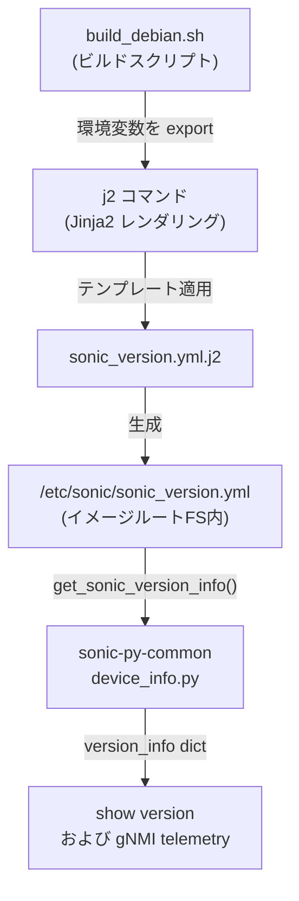

# SONiC イメージバージョン情報 (sonic_version.yml)

## 概要

SONiC OS のイメージバージョン・ビルド情報は `/etc/sonic/sonic_version.yml` に格納される[^1]。このファイルは `sonic-buildimage` のビルドプロセス（`build_debian.sh`）が Jinja2 テンプレート（`files/build_templates/sonic_version.yml.j2`）から生成し、インストールされたイメージのファイルシステムルートに配置される。

Redis の CONFIG_DB / STATE_DB テーブルとは異なり、**ファイルシステム上の静的 YAML ファイル**として提供される。ランタイムでは `sonic-py-common` の `device_info.get_sonic_version_info()` API が読み込んで返す。

!!! note "STATE_DB 直接格納なし"
    `/etc/sonic/sonic_version.yml` のデータは Redis STATE_DB には書き込まれない。`show version` コマンドおよび gNMI telemetry はいずれもファイルから直接読む。

## ファイル位置

```text
/etc/sonic/sonic_version.yml
```

## フィールド

| フィールド | 型 | 省略可 | 説明 |
|-----------|-----|--------|------|
| `build_version` | string | 必須 | イメージのバージョン文字列。タグ付きビルドではタグ名、開発ビルドでは `<branch>.<build_number>-<commit_sha>` 形式 |
| `debian_version` | string | 任意 | ビルド時の Debian OS バージョン (`/etc/debian_version` の内容) |
| `kernel_version` | string | 任意 | ビルドに使用したカーネルバージョン |
| `asic_type` | string | 必須 | ASIC プラットフォーム種別 (例: `broadcom`, `mellanox`, `vs`) |
| `asic_subtype` | string | 任意 | ターゲットマシン種別 (`TARGET_MACHINE`)。空の場合は省略 |
| `commit_id` | string | 必須 | ビルド時の git コミット short SHA |
| `branch` | string | 必須 | ビルド時の git ブランチ名 |
| `release` | string | 必須 (デフォルト `none`) | sonic_release ファイルが存在すればその内容、なければ `'none'` |
| `build_date` | string | 必須 | ビルド日時 (UTC, `date -u` の出力形式) |
| `build_number` | integer | 必須 (デフォルト `0`) | CI ビルド番号 (`BUILD_NUMBER` 変数、未設定時 `0`) |
| `built_by` | string | 必須 | ビルドを実行したユーザー (`$USER@$BUILD_HOSTNAME`) |
| `sonic_os_version` | string | 必須 | SONiC OS バージョン番号。`SONIC_OS_VERSION` 変数 (デフォルト `13`) |
| `secure_boot_image` | string | 必須 | `'yes'` または `'no'`。`SECURE_UPGRADE_MODE` が `dev` か `prod` のとき `'yes'` |
| `asan` | string | 任意 | `'yes'` (ASAN 有効ビルド時のみ存在) |
| `<component>` | string | 任意 | `COMPONENTS` 変数で列挙されたパッケージ名をキー、バージョンを値とする動的フィールド群 |

## 生成プロセス



## `build_version` の生成ロジック

`sonic_get_version()` 関数 (`functions.sh:53-68`) が以下の規則で決定する[^2]:

1. タグ付きコミットの場合: `<git-tag>` (dirty ビルドでは末尾に `-dirty-<timestamp>`)
2. 通常ビルド: `<branch>.<BUILD_NUMBER>-<commit_sha>` 形式
   - `BUILD_NUMBER` 未設定時は `0`
   - dirty ビルド (uncommitted 変更あり) では `-<commit_sha>` の代わりに `-dirty-<timestamp>`

## アクセス方法

```bash
# ファイルを直接確認
cat /etc/sonic/sonic_version.yml

# show version コマンドで確認
show version

# Python API 経由
python3 -c "from sonic_py_common import device_info; import json; print(json.dumps(device_info.get_sonic_version_info(), indent=2))"
```

## 出力例 (show version)

```
SONiC Software Version: SONiC.master.487-a98cf221
SONiC OS Version: 13
Distribution: Debian 12.5
Kernel: 6.1.0-20-2-amd64
Build commit: a98cf221
Build date: Thu Nov 12 12:21:45 UTC 2020
Built by: johnar@jenkins-worker-8
```

<!-- defaults -->
## フィールド暗黙デフォルト (Phase A — コード由来)

`/etc/sonic/sonic_version.yml` は Redis STATE_DB テーブルではなく YAML ファイルとして提供される。YANG schema は存在しない。フィールドとデフォルト値はすべてビルドスクリプトとテンプレートで定義される。

| フィールド | コード由来デフォルト | 根拠 |
|-----------|------------------|------|
| `build_version` | `sonic_get_version()` 出力 (`<branch>.<BUILD_NUMBER>-<commit_sha>`) | `build_debian.sh:642`, `functions.sh:53-68` |
| `debian_version` | ビルド時 `cat /etc/debian_version` | `build_debian.sh:643` — 取得失敗時は省略 |
| `kernel_version` | ビルド環境の `kversion` 変数 | `build_debian.sh:644` — 取得失敗時は省略 |
| `asic_type` | ビルド時の `sonic_asic_platform` 変数 | `build_debian.sh:645` — 必須フィールド |
| `asic_subtype` | `TARGET_MACHINE` 変数 | `build_debian.sh:646` — 空なら YAML に出力されない (テンプレートL10-12) |
| `commit_id` | `git rev-parse --short HEAD` | `build_debian.sh:647` |
| `branch` | `git rev-parse --abbrev-ref HEAD` | `build_debian.sh:648` |
| `release` | `/etc/sonic/sonic_release` の内容、なければ `'none'` | `build_debian.sh:649`, テンプレートL15-19 |
| `build_date` | `date -u` の出力 (UTC タイムスタンプ) | `build_debian.sh:650` |
| `build_number` | `BUILD_NUMBER` 変数、未設定時 `0` | `build_debian.sh:651`, `functions.sh:60` |
| `built_by` | `$USER@$BUILD_HOSTNAME` | `build_debian.sh:652` |
| `sonic_os_version` | `SONIC_OS_VERSION` 変数、未設定時 `13` | `rules/config:379`, `build_debian.sh:653` |
| `secure_boot_image` | `SECURE_UPGRADE_MODE` が `dev`/`prod` なら `'yes'`、それ以外 `'no'` | テンプレートL33-37 |
| `asan` | `ENABLE_ASAN == "y"` のとき `'yes'`、それ以外は**フィールドなし** | テンプレートL29-31 |

### 補足

- `build_version` は `SONiC.` プレフィックス付きで `show version` に表示されるが、ファイル内の値には `SONiC.` は含まれない。`show version` 側が `"SONiC.{}".format(version_info.get('build_version', 'N/A'))` と連結している (`show/main.py:1727`)。
- `debian_version` / `kernel_version` は Jinja2 テンプレートで `` ガードがあるため、未定義の場合はフィールド自体が YAML から省略される。
- `<component>` フィールド群は `COMPONENTS` 変数が `name==version` 形式のスペース区切りリストで定義されている場合のみ出力される。空の場合はフィールドなし。
- `get_sonic_version_info()` は戻り値を `sonic_ver_info` グローバル変数でキャッシュする。同一プロセス内で 2 回目以降の呼び出しはファイルを再読しない (`device_info.py:515-525`)。
- YANG schema、CONFIG_DB エントリ、STATE_DB エントリは存在しない。バージョン情報は専らファイルシステムから参照される。
<!-- /defaults -->

## 引用元

[^1]: `sonic-buildimage/build_debian.sh` L642-654 — sonic_version.yml 生成処理。<https://github.com/sonic-net/sonic-buildimage/blob/master/build_debian.sh>

[^2]: `sonic-buildimage/functions.sh:sonic_get_version()` L53-68 — build_version 文字列の生成ロジック。<https://github.com/sonic-net/sonic-buildimage/blob/master/functions.sh>

[^3]: `sonic-buildimage/files/build_templates/sonic_version.yml.j2` — YAML テンプレート全体。<https://github.com/sonic-net/sonic-buildimage/blob/master/files/build_templates/sonic_version.yml.j2>

[^4]: `sonic-py-common/sonic_py_common/device_info.py:get_sonic_version_info()` L511-525 — 読み込み API 実装。<https://github.com/sonic-net/sonic-buildimage/blob/master/src/sonic-py-common/sonic_py_common/device_info.py>

[^5]: `sonic-utilities/show/main.py:version()` L1716-1733 — `show version` コマンド実装。<https://github.com/sonic-net/sonic-utilities/blob/master/show/main.py>
