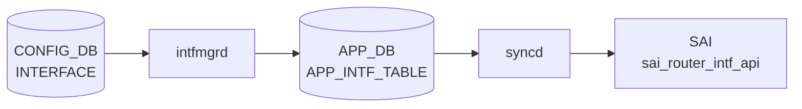

# INTERFACE テーブル

## 概要

物理 Ethernet ポート (`PORT`) を L3 IF として扱う設定を保持する。[VRF](../../reference/glossary.md#term-vrf) / [VNET](../../reference/glossary.md#term-vnet) binding、IP アサイン、[NAT](../../reference/glossary.md#term-nat) zone、[MPLS](../../reference/glossary.md#term-mpls)、IPv6 link-local モード、MAC を持つ[^1]。VLAN_MEMBER に登録された port は L2 として扱われるため `INTERFACE` には登録できない（VLAN_MEMBER 側の `must` で除外される）。

<!-- cdb-mermaid -->
### データフロー (自動生成)



!!! note "凡例"
    CONFIG_DB から SAI までの典型経路を `docs/reference/config-db-orch-map.md` から機械生成したミニ図。詳細・例外は本ページ本文と対応表を参照。
<!-- /cdb-mermaid -->

## key 構造

```text
INTERFACE|<name>                       # 属性ロウ
INTERFACE|<name>|<ip_prefix>           # IP プレフィクス
```

`<name>` は `PORT.name` への leafref。

## 属性ロウのフィールド一覧

| フィールド | 型 | 必須 | デフォルト | 説明 |
|-----------|----|------|-----------|------|
| `name` (key) | leafref `PORT.name` | ✅ | - | 物理ポート名 |
| `vrf_name` | leafref `VRF.name` | - | - | バインドする [VRF](../../reference/glossary.md#term-vrf) |
| `vnet_name` | leafref `VNET.name` | - | - | バインドする [VNET](../../reference/glossary.md#term-vnet) |
| `nat_zone` | uint8 (0..3) | - | `0` | [NAT](../../reference/glossary.md#term-nat) zone |
| `mpls` | enum `enable`/`disable` | - | - | [MPLS](../../reference/glossary.md#term-mpls) routing |
| `ipv6_use_link_local_only` | `mode-status` | - | `disable` | IPv6 link-local のみ |
| `mac_addr` | mac-address | - | - | 管理者指定 MAC |
| `loopback_action` | `loopback_action` | - | - | ingress→same-IF routing 動作 |

## IP プレフィクスロウ

| フィールド | 型 | 必須 | 説明 |
|-----------|----|------|------|
| `name` (key) | leafref `PORT.name` | ✅ | ポート名 (`INTERFACE_LIST` に存在することが `must` で要求) |
| `ip-prefix` (key) | union (v4/v6 prefix) | ✅ | IP/プレフィクス |
| `scope` | enum `global`/`local` | - | アドレススコープ |
| `family` | `ip-family` (`IPv4`/`IPv6`) | - | アドレスファミリ。`ip-prefix` の `:` / `.` と整合する `must` |

## 購読者

- `intfmgrd`: [VRF](../../reference/glossary.md#term-vrf) / MAC / [MPLS](../../reference/glossary.md#term-mpls) / IPv6 LL を Linux に反映
- `orchagent` `IntfsOrch`: [SAI](../../reference/glossary.md#term-sai) ルータインタフェースを生成
- `natmgrd`: `nat_zone` を利用

## 関連 CONFIG_DB / YANG / CLI

- 関連 [CONFIG_DB](../../reference/glossary.md#term-config_db): `PORT`、`VRF`、`VNET`、`VLAN_MEMBER`（排他）
- 関連 CLI: `config interface ip add/remove`、`config interface vrf bind/unbind`
- 関連 [YANG](../../reference/glossary.md#term-yang): `sonic-interface`

<!-- ref-triangle:start -->

## 関連リファレンス

- [YANG](../../reference/glossary.md#term-yang): [`sonic-interface`](../yang/sonic-interface.md)
- CLI: [`config interface`](../cli/config-interface.md)

<!-- ref-triangle:end -->

## 引用元

[^1]: [YANG](../../reference/glossary.md#term-yang) 定義: `sonic-interface.yang`. <https://github.com/sonic-net/sonic-buildimage/blob/9ea932ec2e18f35e58268ec2e4456b1d4afd65cd/src/sonic-yang-models/yang-models/sonic-interface.yang>

## 関連ページ
- [HLD: VRF サポート](../../routing/sonic-vrf-support-design-spec-draft.md)
- [CLI: config interface](../cli/config-interface.md)
- [CONFIG_DB: PORT](port.md)
- [YANG: sonic-interface](../yang/sonic-interface.md)

<!-- topics-back-ref -->
## 関連 Topics

- [Topics: L2 / VLAN / LAG / MC-LAG](../../topics/06-l2-vlan-lag/index.md)

<!-- /topics-back-ref -->

<!-- ops-hint -->
## 運用ヒント

### 典型値

- key 形式: `INTERFACE|EthernetN` (L3 enable 行) と `INTERFACE|EthernetN|<ip/prefix>` (IP 行)。
- `vrf_name`: `Vrfdefault` か `Vrf<name>`。

### よくある誤設定

- [VLAN](../../reference/glossary.md#term-vlan) メンバになっているポートを `INTERFACE` で L3 化すると [orchagent](../../reference/glossary.md#term-orchagent) が拒否する。VLAN_MEMBER から外してから。
- IPv6 link-local だけ欲しい場合でも L3 enable 行が必要。

### 確認コマンド

```bash
sonic-db-cli CONFIG_DB keys 'INTERFACE|Ethernet0*'
show ip interfaces
```
<!-- /ops-hint -->

<!-- value-behavior -->
## 値依存挙動マトリクス

### `mpls`

| 値 | 挙動 |
|----|------|
| `enable` | `ip link set mpls on` → Linux MPLS ルーティングを有効化 |
| `disable`（または空） | MPLS 無効化 |
| その他 | `SWSS_LOG_ERROR("MPLS state is invalid")` → 設定適用されない |

### `ipv6_use_link_local_only`

| 値 | 挙動 |
|----|------|
| `enable` | IPv6 link-local only モード有効化。`m_ipv6LinkLocalModeList` に追加 |
| `disable`（デフォルト） | link-local only モード解除。グローバルアドレス割り当て可能 |

### `admin_status`

| 値 | 挙動 |
|----|------|
| `up` | インタフェース UP |
| `down` | インタフェース DOWN |
| その他 | `SWSS_LOG_WARN` → `up` にデフォルト（intfmgr.cpp L867） |

### `loopback_action`

| 値 | 挙動 |
|----|------|
| `drop` | `SAI_PACKET_ACTION_DROP`：ingress → 同 IF 宛パケットを破棄 |
| `forward` | `SAI_PACKET_ACTION_FORWARD`：通常転送 |
| 未設定 | SAI プラットフォームデフォルト動作 |

### `scope`（IP プレフィクスロウ）

| 値 | 挙動 |
|----|------|
| `global` | グローバルスコープアドレス（intfmgrd が APP_DB に `scope=global` を書く） |
| `local` | ローカルスコープアドレス |

<!-- /value-behavior -->

<!-- cdb-exceptions -->
## 例外条件・特殊挙動

<!-- evidence: sonic-swss/cfgmgr/intfmgr.cpp -->

| 条件 | 挙動 |
|------|------|
| IPv6 有効化失敗 | `SWSS_LOG_ERROR("Failed to enable IPv6 on interface %s")` → 処理継続・再試行あり |
| `admin_status` に `up`/`down` 以外の値 | `SWSS_LOG_WARN` → `up` にデフォルト（intfmgr.cpp L867） |
| `mpls` に `enable`/`disable` 以外の値 | `SWSS_LOG_ERROR("MPLS state is invalid")` → MPLS 設定適用されない |
| 別 VRF への直接変更 | `SWSS_LOG_ERROR("%s can not change to %s directly, skipping")` → VRF 除去 → 再設定の 2 ステップが必要 |
| interface / VRF が未 ready | `SWSS_LOG_DEBUG("Interface is not ready, skipping %s")` → Consumer キューに残り再試行 |
| `grat_arp` / `proxy_arp` に不正値 | `SWSS_LOG_ERROR("GARP state is invalid")` / `"Proxy ARP state is invalid"` → 設定適用されない |
| サブインターフェース名が不正 | `SWSS_LOG_ERROR("Invalid subnitf: %s")` → エントリスキップ |
| MTU 設定コマンド失敗 | `SWSS_LOG_WARN("Setting mtu to %s netdev failed")` → warn のみ、旧 MTU のまま継続 |

<!-- /cdb-exceptions -->


<!-- runtime-trace -->
## 実コンテナ動作トレース

### 段階 1 — Consumer 登録

`intfmgrd` → `IntfsOrch` (APPL_DB 経由) が CONFIG_DB の `INTERFACE` テーブルを購読する。

`INTERFACE` の key は `<intf_name>|<ip_prefix>` または `<intf_name>` (intf 属性のみ)。physical port の L3 設定。

### 段階 2 — CFG→APPL 翻訳

`APP_INTF_TABLE` に書き込み (IP address 付き router interface)

### 段階 3 — APPL→SAI

`sai_router_intf_api` — router interface を作成/更新 + `sai_neighbor_api` で ネイバー設定

### 段階 4 — タイミングと副作用

**適用タイミング**: CONFIG_DB 変化を `intfmgrd` が検知後 `APP_INTF_TABLE` に書き込み。`IntfsOrch` が APPL_DB を購読して SAI router interface を作成/更新。IP address 追加は即時反映。

**副作用**: IP address 追加は ARP/NDP 送信を開始。IP address 削除は関連する ARP エントリと neighbor を削除。MTU 変更は PMTUD に影響。
<!-- /runtime-trace -->

<!-- entry-points -->
## 書き込み入り口 (Direction A)

対象テーブル: `INTERFACE`

### CLI
- `config interface ip add/remove <port> <ip/prefix>`
- `config interface vrf bind/unbind <port> <vrf>`
  - ソース: `sonic-utilities/config/main.py (interface グループ)`

### minigraph / sonic-cfggen
- あり: `sonic-cfggen -m <minigraph.xml>` 実行時に本テーブルが生成・上書きされる

### REST / gNMI (sonic-mgmt-common)
- sonic-mgmt-common OpenConfig interfaces 経由 (xfmr_intf.go)

### db_migrator
- なし

### ビルド時デフォルト (init_cfg / j2 テンプレート)
- `sonic-cfggen -m` で minigraph から L3 インタフェース IP を生成

### ハードコードデフォルト
- なし

### ランタイム注入 (デーモン自動書き込み)
- なし
<!-- /entry-points -->

<!-- cross-refs -->
## 暗黙参照 (Phase C)

YANG leafref を超えた他テーブル・他 DB・プラットフォームファイルへの実装上の依存関係。

| 参照先 | DB / 場所 | 方向 | 契機 | 根拠コード |
|--------|-----------|------|------|-----------|
| `PORT` (via `gPortsOrch->getPort()`) | CONFIG_DB / PortOrch | READ | RIF 作成時。`Port::PHY` / `Port::LAG` / `Port::VLAN` / `Port::SUBPORT` の type と SAI oid を取得し SAI RIF 属性 (`SAI_ROUTER_INTERFACE_ATTR_PORT_ID`) に使用 | `intfsorch.cpp` L403, L609, L905, L1085, L1216-1251 |
| `VLAN_INTERFACE` (warm-reboot replay) | CONFIG_DB | READ | `intfmgrd` warm-reboot 時に `buildIntfReplayList()` がキー収集。VLAN L3 IF も replay 対象に含む | `intfmgr.cpp` L277-278 |
| `PORTCHANNEL_INTERFACE` / `LAG_INTERFACE` (warm-reboot replay) | CONFIG_DB | READ | `buildIntfReplayList()` が LAG IF もキー収集し pending replay リストに追加 | `intfmgr.cpp` L280-281 |
| `LOOPBACK_INTERFACE` (warm-reboot replay) | CONFIG_DB | READ | `buildIntfReplayList()` が Loopback IF もキー収集し pending replay リストに追加 | `intfmgr.cpp` L274-275 |
| `STATE_VLAN_TABLE` | STATE_DB | READ | SET 時 readiness ガード。alias が `Vlan` プレフィクスのとき `m_stateVlanTable.get()` で VLAN が state=ok か確認 | `intfmgr.cpp` L653-659 |
| `STATE_PORT_TABLE` | STATE_DB | READ | SET 時 readiness ガード。ポートが state=ok でなければ処理をキューに戻し再試行 | `intfmgr.cpp` L686 |
| `STATE_LAG_TABLE` | STATE_DB | READ | PortChannel / LAG サブインタフェースの readiness を確認 | `intfmgr.cpp` L663, L702 |
| `STATE_VRF_TABLE` | STATE_DB | READ | `vrf_name` / `vnet_name` 指定時に VRF/VNET が ready か確認 | `intfmgr.cpp` L671-684 |
| `DEVICE_METADATA|localhost.switch_type` | CONFIG_DB | READ | `intfmgrd` 起動時 1 回。`voq` のとき IPv6 アドレス追加に `metric 256` を付与 | `intfmgr.cpp` L71-75 |
| `NAT_GLOBAL` → `gIsNatSupported` | CONFIG_DB | READ | orchagent 起動時にグローバルフラグ化。`gIsNatSupported==true` のとき SAI RIF 作成時に `SAI_ROUTER_INTERFACE_ATTR_NAT_ZONE_ID` を設定する | `intfsorch.cpp` L1287-1294 |
| `DEVICE_METADATA|localhost.mac` → `gMacAddress` | CONFIG_DB | READ | orchagent 起動時にグローバル変数化。ポート固有 `mac_addr` 未指定時に SAI `SAI_ROUTER_INTERFACE_ATTR_SRC_MAC_ADDRESS` のフォールバック値として使用 | `intfsorch.cpp` L1205 |
| `VLAN_MEMBER` (YANG `must` 排他制約) | CONFIG_DB | READ | YANG バリデーション時。`VLAN_MEMBER` の `must "not(INTERFACE_LIST[name=current()])"` でポートの L2/L3 二重登録を防止 | `sonic-vlan.yang` L305 |
| `port_config.ini` / `platform.json` | プラットフォームファイル | READ | `sonic-cfggen -m <minigraph.xml>` 実行時。ポート名が platform ファイルに存在しなければ `INTERFACE` エントリをスキップ | `minigraph.py` L2064 |
| `CHASSIS_APP_DB::SYSTEM_INTERFACE_TABLE` | CHASSIS_APP_DB | WRITE | VoQ スイッチ (`switch_type=voq`) 限定。`INTERFACE` の ADD/DEL に連動してラインカード間インタフェース情報を同期 | `intfsorch.cpp` L1316-1317 |
| `APP_NEIGH_TABLE` | APP_DB | WRITE | `ipv6_use_link_local_only` を `disable` に変更したとき、同 IF の link-local ネイバーエントリを削除する副作用 | `intfmgr.cpp` L712-738 |

!!! note "補足"
    - **`PORT` / `gPortsOrch` 依存** は YANG leafref では `PORT.name` への leafref として現れるが、実行時は PortOrch が管理するポートオブジェクト（型・SAI OID）への直接参照に変わる。ポートが PortOrch に未登録なら `INTERFACE` の SAI 適用もスキップされる。
    - **warm-reboot replay 参照** (`VLAN_INTERFACE`, `PORTCHANNEL_INTERFACE`, `LOOPBACK_INTERFACE`) は通常起動では関係しない。warm-start 時のみ `buildIntfReplayList()` がこれら兄弟テーブルを横断的に読む。
    - **`STATE_VLAN_TABLE` 依存** は `VLAN_INTERFACE` (VLAN L3 IF) のユースケースで関係するが、`INTERFACE` テーブル（物理ポート）の readiness 判定ではこの分岐に入らない。
    - **`STATE_*TABLE` 依存** は leafref には現れない実行時 readiness ガード。VRF / LAG / ポートのいずれかが未 ready なら Consumer がエントリを保持して再試行する。
    - **`NAT_GLOBAL` 依存** は `nat_zone` フィールドを持っていても NAT が無効なプラットフォームでは SAI に渡らないことを意味する。
    - **VoQ 専用参照** (`DEVICE_METADATA.switch_type=voq`, `CHASSIS_APP_DB`) は non-VoQ 環境では動作しない。

<!-- /cross-refs -->

<!-- glossary-links-injected: 8c01908c2492 -->
