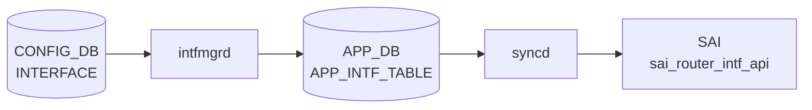

# INTERFACE テーブル

## 概要

物理 Ethernet ポート (`PORT`) を L3 IF として扱う設定を保持する。[VRF](../../reference/glossary.md#term-vrf) / [VNET](../../reference/glossary.md#term-vnet) binding、IP アサイン、[NAT](../../reference/glossary.md#term-nat) zone、[MPLS](../../reference/glossary.md#term-mpls)、IPv6 link-local モード、MAC を持つ[^1]。VLAN_MEMBER に登録された port は L2 として扱われるため `INTERFACE` には登録できない（VLAN_MEMBER 側の `must` で除外される）。

<!-- cdb-mermaid -->
### データフロー (自動生成)



!!! note "凡例"
    CONFIG_DB から SAI までの典型経路を `docs/reference/config-db-orch-map.md` から機械生成したミニ図。詳細・例外は本ページ本文と対応表を参照。
<!-- /cdb-mermaid -->

## key 構造

```text
INTERFACE|<name>                       # 属性ロウ
INTERFACE|<name>|<ip_prefix>           # IP プレフィクス
```

`<name>` は `PORT.name` への leafref。

## 属性ロウのフィールド一覧

| フィールド | 型 | 必須 | デフォルト | 説明 |
|-----------|----|------|-----------|------|
| `name` (key) | leafref `PORT.name` | ✅ | - | 物理ポート名 |
| `vrf_name` | leafref `VRF.name` | - | - | バインドする [VRF](../../reference/glossary.md#term-vrf) |
| `vnet_name` | leafref `VNET.name` | - | - | バインドする [VNET](../../reference/glossary.md#term-vnet) |
| `nat_zone` | uint8 (0..3) | - | `0` | [NAT](../../reference/glossary.md#term-nat) zone |
| `mpls` | enum `enable`/`disable` | - | - | [MPLS](../../reference/glossary.md#term-mpls) routing |
| `ipv6_use_link_local_only` | `mode-status` | - | `disable` | IPv6 link-local のみ |
| `mac_addr` | mac-address | - | - | 管理者指定 MAC |
| `loopback_action` | `loopback_action` | - | - | ingress→same-IF routing 動作 |

## IP プレフィクスロウ

| フィールド | 型 | 必須 | 説明 |
|-----------|----|------|------|
| `name` (key) | leafref `PORT.name` | ✅ | ポート名 (`INTERFACE_LIST` に存在することが `must` で要求) |
| `ip-prefix` (key) | union (v4/v6 prefix) | ✅ | IP/プレフィクス |
| `scope` | enum `global`/`local` | - | アドレススコープ |
| `family` | `ip-family` (`IPv4`/`IPv6`) | - | アドレスファミリ。`ip-prefix` の `:` / `.` と整合する `must` |

## 購読者

- `intfmgrd`: [VRF](../../reference/glossary.md#term-vrf) / MAC / [MPLS](../../reference/glossary.md#term-mpls) / IPv6 LL を Linux に反映
- `orchagent` `IntfsOrch`: [SAI](../../reference/glossary.md#term-sai) ルータインタフェースを生成
- `natmgrd`: `nat_zone` を利用

## 関連 CONFIG_DB / YANG / CLI

- 関連 [CONFIG_DB](../../reference/glossary.md#term-config_db): `PORT`、`VRF`、`VNET`、`VLAN_MEMBER`（排他）
- 関連 CLI: `config interface ip add/remove`、`config interface vrf bind/unbind`
- 関連 [YANG](../../reference/glossary.md#term-yang): `sonic-interface`

<!-- ref-triangle:start -->

## 関連リファレンス

- [YANG](../../reference/glossary.md#term-yang): [`sonic-interface`](../yang/sonic-interface.md)
- CLI: [`config interface`](../cli/config-interface.md)

<!-- ref-triangle:end -->

## 引用元

[^1]: [YANG](../../reference/glossary.md#term-yang) 定義: `sonic-interface.yang`. <https://github.com/sonic-net/sonic-buildimage/blob/9ea932ec2e18f35e58268ec2e4456b1d4afd65cd/src/sonic-yang-models/yang-models/sonic-interface.yang>

## 関連ページ
- [HLD: VRF サポート](../../routing/sonic-vrf-support-design-spec-draft.md)
- [CLI: config interface](../cli/config-interface.md)
- [CONFIG_DB: PORT](port.md)
- [YANG: sonic-interface](../yang/sonic-interface.md)

<!-- topics-back-ref -->
## 関連 Topics

- [Topics: L2 / VLAN / LAG / MC-LAG](../../topics/06-l2-vlan-lag/index.md)

<!-- /topics-back-ref -->

<!-- ops-hint -->
## 運用ヒント

### 典型値

- key 形式: `INTERFACE|EthernetN` (L3 enable 行) と `INTERFACE|EthernetN|<ip/prefix>` (IP 行)。
- `vrf_name`: `Vrfdefault` か `Vrf<name>`。

### よくある誤設定

- [VLAN](../../reference/glossary.md#term-vlan) メンバになっているポートを `INTERFACE` で L3 化すると [orchagent](../../reference/glossary.md#term-orchagent) が拒否する。VLAN_MEMBER から外してから。
- IPv6 link-local だけ欲しい場合でも L3 enable 行が必要。

### 確認コマンド

```bash
sonic-db-cli CONFIG_DB keys 'INTERFACE|Ethernet0*'
show ip interfaces
```
<!-- /ops-hint -->

<!-- value-behavior -->
## 値依存挙動マトリクス

### `mpls`

| 値 | 挙動 |
|----|------|
| `enable` | `ip link set mpls on` → Linux MPLS ルーティングを有効化 |
| `disable`（または空） | MPLS 無効化 |
| その他 | `SWSS_LOG_ERROR("MPLS state is invalid")` → 設定適用されない |

### `ipv6_use_link_local_only`

| 値 | 挙動 |
|----|------|
| `enable` | IPv6 link-local only モード有効化。`m_ipv6LinkLocalModeList` に追加 |
| `disable`（デフォルト） | link-local only モード解除。グローバルアドレス割り当て可能 |

### `admin_status`

| 値 | 挙動 |
|----|------|
| `up` | インタフェース UP |
| `down` | インタフェース DOWN |
| その他 | `SWSS_LOG_WARN` → `up` にデフォルト（intfmgr.cpp L867） |

### `loopback_action`

| 値 | 挙動 |
|----|------|
| `drop` | `SAI_PACKET_ACTION_DROP`：ingress → 同 IF 宛パケットを破棄 |
| `forward` | `SAI_PACKET_ACTION_FORWARD`：通常転送 |
| 未設定 | SAI プラットフォームデフォルト動作 |

### `scope`（IP プレフィクスロウ）

| 値 | 挙動 |
|----|------|
| `global` | グローバルスコープアドレス（intfmgrd が APP_DB に `scope=global` を書く） |
| `local` | ローカルスコープアドレス |

<!-- /value-behavior -->

<!-- cdb-exceptions -->
## 例外条件・特殊挙動

<!-- evidence: sonic-swss/cfgmgr/intfmgr.cpp -->

| 条件 | 挙動 |
|------|------|
| IPv6 有効化失敗 | `SWSS_LOG_ERROR("Failed to enable IPv6 on interface %s")` → 処理継続・再試行あり |
| `admin_status` に `up`/`down` 以外の値 | `SWSS_LOG_WARN` → `up` にデフォルト（intfmgr.cpp L867） |
| `mpls` に `enable`/`disable` 以外の値 | `SWSS_LOG_ERROR("MPLS state is invalid")` → MPLS 設定適用されない |
| 別 VRF への直接変更 | `SWSS_LOG_ERROR("%s can not change to %s directly, skipping")` → VRF 除去 → 再設定の 2 ステップが必要 |
| interface / VRF が未 ready | `SWSS_LOG_DEBUG("Interface is not ready, skipping %s")` → Consumer キューに残り再試行 |
| `grat_arp` / `proxy_arp` に不正値 | `SWSS_LOG_ERROR("GARP state is invalid")` / `"Proxy ARP state is invalid"` → 設定適用されない |
| サブインターフェース名が不正 | `SWSS_LOG_ERROR("Invalid subnitf: %s")` → エントリスキップ |
| MTU 設定コマンド失敗 | `SWSS_LOG_WARN("Setting mtu to %s netdev failed")` → warn のみ、旧 MTU のまま継続 |

<!-- /cdb-exceptions -->


<!-- runtime-trace -->
## 実コンテナ動作トレース

### 段階 1 — Consumer 登録

`intfmgrd` → `IntfsOrch` (APPL_DB 経由) が CONFIG_DB の `INTERFACE` テーブルを購読する。

`INTERFACE` の key は `<intf_name>|<ip_prefix>` または `<intf_name>` (intf 属性のみ)。physical port の L3 設定。

### 段階 2 — CFG→APPL 翻訳

`APP_INTF_TABLE` に書き込み (IP address 付き router interface)

### 段階 3 — APPL→SAI

`sai_router_intf_api` — router interface を作成/更新 + `sai_neighbor_api` で ネイバー設定

### 段階 4 — タイミングと副作用

**適用タイミング**: CONFIG_DB 変化を `intfmgrd` が検知後 `APP_INTF_TABLE` に書き込み。`IntfsOrch` が APPL_DB を購読して SAI router interface を作成/更新。IP address 追加は即時反映。

**副作用**: IP address 追加は ARP/NDP 送信を開始。IP address 削除は関連する ARP エントリと neighbor を削除。MTU 変更は PMTUD に影響。
<!-- /runtime-trace -->

<!-- entry-points -->
## 書き込み入り口 (Direction A)

対象テーブル: `INTERFACE`

### CLI
- `config interface ip add/remove <port> <ip/prefix>`
- `config interface vrf bind/unbind <port> <vrf>`
  - ソース: `sonic-utilities/config/main.py (interface グループ)`

### minigraph / sonic-cfggen
- あり: `sonic-cfggen -m <minigraph.xml>` 実行時に本テーブルが生成・上書きされる

### REST / gNMI (sonic-mgmt-common)
- sonic-mgmt-common OpenConfig interfaces 経由 (xfmr_intf.go)

### db_migrator
- なし

### ビルド時デフォルト (init_cfg / j2 テンプレート)
- `sonic-cfggen -m` で minigraph から L3 インタフェース IP を生成

### ハードコードデフォルト
- なし

### ランタイム注入 (デーモン自動書き込み)
- なし
<!-- /entry-points -->

<!-- pubsub -->
## 通信メカニズム (Phase G)

### Producer/Consumer ペア

CONFIG_DB から SAI までの全通信は Redis の **keyspace notification** と **ProducerStateTable/ConsumerStateTable** パターンで構成される。

#### CONFIG_DB → intfmgrd

`intfmgrd` は起動時に以下のテーブルを `SubscriberStateTable` で購読する。

| テーブル | 用途 |
|---------|------|
| `INTERFACE` | 物理 L3 IF 属性・IP プレフィクス |
| `VLAN_INTERFACE` | VLAN L3 IF |
| `LAG_INTERFACE` | PortChannel L3 IF |
| `LOOPBACK_INTERFACE` | Loopback IF |
| `VLAN_SUB_INTERFACE` | サブインタフェース |
| `VOQ_INBAND_INTERFACE` | VOQ inband IF |

`SubscriberStateTable` は Redis の **keyspace notification** を用いる。

```
PSUBSCRIBE __keyspace@{db_id}__:INTERFACE|*
```

イベント (`hset` / `hdel` / `del`) 受信 → `readData()` がバッファに蓄積 → `pops()` でキーを取り出し `TABLE.get(key)` で現在値取得 → `Consumer::doTask()` 呼び出し。

また、PORT / LAG の状態変化を検知するために STATE_DB の `STATE_PORT_TABLE` と `STATE_LAG_TABLE` も別途 `SubscriberStateTable` で購読する（親ポートの admin_status・MTU 変化をサブインタフェースに伝播）。

#### intfmgrd → APPL_DB

処理完了後、`ProducerStateTable m_appIntfTableProducer` で `APP_INTF_TABLE` に書き込む。

| 項目 | 値 |
|------|----|
| Publish チャンネル | `APP_INTF_TABLE_CHANNEL@0` |
| Key SET | `APP_INTF_TABLE_KEY_SET` |
| Del SET | `APP_INTF_TABLE_DEL_SET` |
| 一時 hash | `_APP_INTF_TABLE:<key>` |

Lua スクリプト (`EVALSHA`) が `SADD KEY_SET` + `HSET _<table>:<key>` + `PUBLISH APP_INTF_TABLE_CHANNEL@0 G` をアトミックに実行する。

#### APPL_DB → orchagent (IntfsOrch)

`orchdaemon` が `IntfsOrch(m_applDb, APP_INTF_TABLE_NAME, ...)` を生成し、`ConsumerStateTable` が `APP_INTF_TABLE_CHANNEL@0` を購読する。

```
WATCH APP_INTF_TABLE_KEY_SET
SUBSCRIBE APP_INTF_TABLE_CHANNEL@0
```

チャンネル通知で `Select::select()` が wake-up → `consumer_state_table_pops.lua` (`SPOP KEY_SET` + `HGETALL _<table>:<key>`) で一括取得 → `IntfsOrch::doTask()` → `sai_router_intf_api`。

### STATE_DB への書き込み (hset / TTL)

`intfmgrd` は以下のタイミングで STATE_DB (`STATE_INTERFACE_TABLE`) に書き込む。TTL は使用しない。

| タイミング | 操作 |
|-----------|------|
| L3 IF 属性設定完了 | `m_stateIntfTable.hset(alias, "vrf", vrf_name)` |
| IP アドレス追加完了 | `m_stateIntfTable.hset("<alias>\|<prefix>", "state", "ok")` |
| IP アドレス削除 | `m_stateIntfTable.del("<alias>\|<prefix>")` |
| L3 IF 削除 | `m_stateIntfTable.del(alias)` |

`isIntfCreated(alias)` は `m_stateIntfTable.get(alias, ...)` で STATE_DB エントリの有無を確認し、IP アドレス設定の前提条件チェックに用いる。

### select() ループと retry

`intfmgrd` の main ループはタイムアウト 1000 ms で `Select::select()` を呼ぶ。

```
SELECT_TIMEOUT = 1000 ms
if (TIMEOUT) { intfmgr.doTask(); }   // 未処理タスクを全 consumer で再試行
```

`doIntfGeneralTask` / `doIntfAddrTask` が `false` を返した場合（IF/VRF が not ready）、エントリは `m_toSync` に残留し次のループで再試行される。

### cross-namespace 通信 (VOQ / Chassis)

VOQ システム (`isChassisDbInUse()` が真) では `CHASSIS_APP_DB` の `SYSTEM_INTERFACE_TABLE` も `SubscriberStateTable` で購読し、リモートシステムポートの IF 情報を受信する。通常の単体スイッチでは使用されない。

### 通信フロー全体図

```
CONFIG_DB[INTERFACE|*]
  │  keyspace notification (psubscribe __keyspace@N__:INTERFACE|*)
  ▼
intfmgrd::doIntfGeneralTask / doIntfAddrTask
  │  ProducerStateTable::set/del
  │  EVALSHA → SADD KEY_SET + HSET _APP_INTF_TABLE:key
  │            + PUBLISH APP_INTF_TABLE_CHANNEL@0 G
  ▼
APPL_DB[APP_INTF_TABLE|*]
  │  ConsumerStateTable (subscribe APP_INTF_TABLE_CHANNEL@0)
  │  consumer_state_table_pops.lua → SPOP + HGETALL
  ▼
orchagent::IntfsOrch::doTask
  ▼
sai_router_intf_api (SAI)

STATE_DB[STATE_INTERFACE_TABLE]
  ← intfmgrd hset(vrf) / hset(state=ok)  ← TTL なし

STATE_DB[STATE_PORT_TABLE / STATE_LAG_TABLE]
  → SubscriberStateTable → intfmgrd::doPortTableTask
    (admin_status / MTU 変化をサブインタフェースへ伝播)
```

<!-- /pubsub -->

<!-- defaults -->
## 暗黙デフォルト・コード由来挙動 (Phase A)

> 調査対象: `sonic-swss/cfgmgr/intfmgr.cpp`, `sonic-swss/orchagent/intfsorch.cpp`
> 調査日: 2026-05-14

### 属性ロウ

| フィールド | YANG default | 実装上の暗黙デフォルト / fallback | 備考 |
|-----------|-------------|----------------------------------|------|
| `nat_zone` | `"0"` | C++ 初期値 `0`、SAI default `0` — YANG と一致 | `gIsNatSupported==false` の場合 SAI 未設定 (プラットフォーム依存) |
| `mpls` | なし | 省略時 → Linux `sysctl input=0`、SAI RIF 作成時に `ADMIN_MPLS_STATE` 属性を省略 (SAI default = disabled) | 不正値 → `SWSS_LOG_ERROR` + `return false`、エントリがキューに残り retry |
| `ipv6_use_link_local_only` | `disable` | 省略時は何もしない (APP_DB に書かない) | IF 削除時に `m_ipv6LinkLocalModeList` と link-local neigh を自動 reset。warm reboot 後は in-memory リストが空に戻るため再 replay なし |
| `mac_addr` | なし | 省略時 → intfmgr が `"00:00:00:00:00:00"` を APP_DB に書き込み、orchagent が switch global MAC (`gMacAddress`) を SAI に設定 — **CONFIG_DB の空値と SAI 実際値が乖離** | silent substitution: APP_DB 上は `00:00:00:00:00:00`、SAI では switch MAC |
| `loopback_action` | なし | 省略時 → SAI RIF 作成時に `LOOPBACK_PACKET_ACTION` 属性を省略 → SAI プラットフォームデフォルト動作 | 不正値 → `SWSS_LOG_WARN` + 設定スキップ (silent drop of setting) |
| `vrf_name` / `vnet_name` | なし | 省略時 → グローバル VRF (`gVirtualRouterId`) | VRF 直接変更不可: `SWSS_LOG_ERROR` → 2 ステップ (unbind → rebind) 必須 |

### IP プレフィクスロウ

| フィールド | YANG default | 実装上の暗黙デフォルト / fallback | 備考 |
|-----------|-------------|----------------------------------|------|
| `scope` | なし | **dead field**: intfmgr は CONFIG_DB の `scope` を無視し、常に `"global"` を APP_DB に書き込む | `scope=local` を書いても orchagent には `global` が届く |
| `family` | なし | **dead field**: intfmgr は CONFIG_DB の `family` を無視し、ip-prefix の `:` / `.` から `IPv6`/`IPv4` を自動計算して APP_DB に書く | IPv4 link-local (169.254.x.x) は APP_DB / SAI に送られない (silent drop) |

### ハードコード固定値

| 定数 | 値 | 適用箇所 |
|------|----|---------|
| `DEFAULT_MTU_STR` | `9100` | subintf に `mtu` 未設定時のデフォルト MTU (intfmgr.cpp L29) |
| `LOOPBACK_DEFAULT_MTU_STR` | `65536` | Loopback 作成時の MTU (intfmgr.cpp L28) |
| `MTU_INHERITANCE` | `"0"` | subintf で mtu 省略時に APP_DB に書く値。orchagent 側で親 PORT MTU を継承するシグナル |
| admin_status fallback | `"up"` | Loopback IF で `admin_status` 省略または不正値のとき強制 up (intfmgr.cpp L862-869) |

### 前提条件依存

1. **IP プレフィクスロウ追加は L3 enable 行が先**: `isIntfCreated()` が false の場合スキップ → retry
2. **PORT が STATE_DB に `state=ok`**: `isIntfStateOk()` 確認 → 未 ready はキューに戻す
3. **VRF が STATE_DB に ready**: `isIntfStateOk(vrf_name)` → 未 ready はスキップ
4. **eth0 / docker0 / usb0 は silent drop**: intfsorch が即 erase (SAI に届かない)
<!-- /defaults -->

<!-- ordering -->
## 書込み順依存 (Phase B)

> 調査対象: `sonic-swss/cfgmgr/intfmgr.cpp`, `sonic-swss/orchagent/intfsorch.cpp`
> 調査日: 2026-05-14

### 他テーブル先行必須

| 先行テーブル / 条件 | 依存の内容 | コード根拠 |
|-------------------|-----------|-----------|
| `PORT` + portmgrd が STATE_DB に `state=ok` を書く | `isIntfStateOk(alias)` が false → `INTERFACE` SET をスキップ・retry | `intfmgr.cpp:831-837` |
| `VRF` + vrfmgrd が STATE_DB に ready を書く | `isIntfStateOk(vrf_name)` が false → `vrf_name` 付き SET をスキップ | `intfmgr.cpp:839-842` |
| `INTERFACE|<port>` (L3 enable 行) が STATE_INTERFACE_TABLE に存在 | `isIntfCreated(alias)` が false → IP プレフィクスロウの SET をスキップ | `intfmgr.cpp:1115` |
| orchagent 側: `VRF` オブジェクトが orchagent 内に存在 | `m_vrfOrch->isVRFexists(vrf_name)` が false → APP_DB 側の処理もスキップ | `intfsorch.cpp:826-830` |

### SET 後 DEL 順依存

| 操作 | 必須順序 | コード根拠 |
|------|---------|-----------|
| L3 enable 行 (`INTERFACE|<port>`) の DEL | すべての IP プレフィクスロウ (`INTERFACE|<port>|<ip>`) を先に DEL してから | `intfmgr.cpp:1058-1063` |
| VRF 変更 | 直接変更不可。`vrf_name=""` で unbind → 新 VRF で rebind の 2 ステップ | `intfmgr.cpp:846-849` |

### Notification 順序

`intfmgrd` は起動時に `SubscriberStateTable` で `STATE_PORT_TABLE` と `STATE_LAG_TABLE` を購読する。portmgrd / lagmgrd が `state=ok` を STATE_DB に書いた瞬間、intfmgrd の `doPortTableTask` がトリガされ、キューに積まれていた `INTERFACE` エントリが再処理される。このため、**CONFIG_DB に書いた時点ではなく STATE_DB 通知のタイミングで実際の適用が始まる**。

### warm-reboot 影響

- warm-start 時、intfmgrd は `buildIntfReplayList()` で CONFIG_DB の `INTERFACE` / `VLAN_INTERFACE` / `PORTCHANNEL_INTERFACE` キーを収集し、カーネルへ replay する。replay リストが空になると即 `RECONCILED` に遷移する（reconciliation ロジックなし）。
- `m_ipv6LinkLocalModeList` は in-memory の `std::set` であり、warm-reboot 後は空に戻る。CONFIG_DB の `ipv6_use_link_local_only: enable` エントリが replay されて再 SET されるまで link-local モードは失われる。
- cold restart では `flushLoopbackIntfs()` で Loopback インタフェースをカーネルから全削除してから再作成する。INTERFACE は PORT STATE_DB ready 待ちから通常の順序依存で処理される。

<!-- /ordering -->

<!-- platform -->
## プラットフォーム差 (Phase H)

> 調査対象: `sonic-swss/orchagent/intfsorch.cpp`, `sonic-swss/orchagent/main.cpp`, `sonic-swss/cfgmgr/intfmgr.cpp`, `sonic-buildimage/device/mellanox|broadcom/*/sai.profile`
> 調査日: 2026-05-14

### `nat_zone` — SAI capability query による有効/無効

`gIsNatSupported` フラグが `false` の ASIC では `nat_zone` フィールドを設定しても SAI に渡されない。起動時に `SAI_SWITCH_ATTR_AVAILABLE_SNAT_ENTRY` を取得し、返り値が `0` なら NAT 非対応と判断する。

```cpp
// main.cpp:936-947
attr.id = SAI_SWITCH_ATTR_AVAILABLE_SNAT_ENTRY;
status = sai_switch_api->get_switch_attribute(gSwitchId, 1, &attr);
if (status == SAI_STATUS_SUCCESS && attr.value.u32 != 0) {
    gIsNatSupported = true;
}
// intfsorch.cpp:1287-1294
if (gIsNatSupported) {
    attr.id = SAI_ROUTER_INTERFACE_ATTR_NAT_ZONE_ID;
    ...
}
```

| ASIC / プラットフォーム | `nat_zone` SAI 反映 |
|------------------------|---------------------|
| NAT HW オフロード対応 ASIC | 反映される |
| NAT 非対応 ASIC (SAI が `AVAILABLE_SNAT_ENTRY=0` を返す) | 黙殺 |
| VS (virtual switch) | 反映される (`AVAILABLE_SNAT_ENTRY=100` を返す) |

### `ipv6_use_link_local_only` — Mellanox/NVIDIA 専用 SAI プロファイルキー

Mellanox/NVIDIA の全 SKU `sai.profile` に `SAI_NOT_DROP_SIP_DIP_LINK_LOCAL=1` が設定されている（`Mellanox-SN2700/sai.profile`, `Mellanox-SN4700-C128/sai.profile` 等）。

```
SAI_NOT_DROP_SIP_DIP_LINK_LOCAL=1
```

Mellanox/NVIDIA ASIC はデフォルトで link-local (169.254.x.x / fe80::/10) パケットをハードウェアでドロップする。このキーを `1` にすることで L3 インタフェース経由の転送を許可する。Broadcom / Marvell / Barefoot の `sai.profile` にはこのキーが存在しない。

`INTERFACE|<port>` に `ipv6_use_link_local_only: enable` を設定しても、Mellanox 側の `sai.profile` 未設定環境では link-local パケットが ASIC 段でドロップされ続ける可能性がある。

### `loopback_action` — SAI プラットフォームデフォルト依存

省略時は `SAI_ROUTER_INTERFACE_ATTR_LOOPBACK_PACKET_ACTION` 属性を SAI に渡さず、ASIC プラットフォームのデフォルト動作に委ねる。ASIC ベンダーによってデフォルト動作が異なるため、`loopback_action` 未設定時の実際の挙動はベンダー依存。

### `proxy_arp` — VLAN IF のみ SAI 操作、物理 IF は SAI 無変更

```cpp
// intfsorch.cpp:409-425
if (port.m_type == Port::VLAN) {
    // SAI_VLAN_ATTR_BROADCAST_FLOOD_CONTROL_TYPE を変更
    // SAI_VLAN_ATTR_UNKNOWN_MULTICAST_FLOOD_CONTROL_TYPE も変更
}
// PHY / LAG には SAI 変更なし
```

物理 Ethernet ポートに `proxy_arp` を設定してもカーネル層での処理となり、SAI/ASIC 側には変更が走らない。VLAN IF のみ SAI VLAN flood type を制御する。

### `mac_addr` — VS プラットフォームでの特例

実 ASIC では orchagent が `mac_addr` 省略時に switch global MAC (`gMacAddress`) を SAI に設定する。VS (virtual switch) プラットフォーム (`ASIC_VENDOR=vs`) では、近傍プログラミング時に `gMacAddress` への置換をスキップし元の MAC を保持する特例がある（`neighorch.cpp:2213-2218`）。

### SAI 初期化ファイルによる RIF 上限差

| プラットフォーム | SAI 設定方式 | 備考 |
|----------------|-------------|------|
| Mellanox/NVIDIA | XML ファイル (`sai_<chip>.xml`) | `SAI_INIT_CONFIG_FILE` で指定 |
| Broadcom (Arista 等) | `config.bcm` ファイル | `SAI_INIT_CONFIG_FILE` で指定 |

RIF (Router Interface) 数上限・ECMP メンバ数はこれらの初期化ファイルで決定される。`INTERFACE` テーブルで大量の L3 IF を作成する場合は ASIC ごとの制限に注意が必要。

<!-- /platform -->

<!-- side-effects -->
## 副次 DB 書込 (Phase F)

INTERFACE テーブルへの SET/DEL が引き起こす、CONFIG_DB 以外の DB への書込みと SAI 呼び出しを示す。

### SET — 属性ロウ (`INTERFACE|<name>`)

| 操作 | 対象 DB / テーブル | キー / フィールド | 条件 |
|------|------------------|-----------------|------|
| `INTF_TABLE.set(<name>, data)` | APPL_DB / `INTF_TABLE` | `<name>` | 常時 (`intfmgrd`) |
| `INTERFACE_TABLE.hset(<name>, "vrf", vrf_name)` | STATE_DB / `INTERFACE_TABLE` | `<name>` field=`vrf` | 常時 (`intfmgrd`) |
| `PORT_TABLE.set(<name>, {state:ok})` | STATE_DB / `PORT_TABLE` | `<name>` | サブ IF かつ Ethernet 系 (`intfmgrd`) |
| `LAG_TABLE.set(<name>, {state:ok})` | STATE_DB / `LAG_TABLE` | `<name>` | サブ IF かつ PortChannel 系 (`intfmgrd`) |
| `COUNTERS_RIF_NAME_MAP.set("", {<alias>:<oid>})` | COUNTERS_DB / `COUNTERS_RIF_NAME_MAP` | `""` field=`<alias>` | RIF 作成後タイマーで (`IntfsOrch`) |
| `COUNTERS_RIF_TYPE_MAP.set("", {<oid>:<type>})` | COUNTERS_DB / `COUNTERS_RIF_TYPE_MAP` | `""` field=`<oid>` | RIF 作成後タイマーで (`IntfsOrch`) |
| FlexCounter エントリ登録 | FLEX_COUNTER_DB / `RIF_STAT_COUNTER_FLEX_COUNTER_GROUP:<oid>` | `<oid>` | RIF 作成時 (`IntfsOrch`) |
| `SYSTEM_INTERFACE_TABLE.set(<sys_alias>, {oper_status})` | CHASSIS_APP_DB / `SYSTEM_INTERFACE_TABLE` | `<system_port_alias>` | VoQ システムかつ Local IF |

SAI 呼び出し (`ASIC_DB` に反映):

- `sai_router_intfs_api->create_router_interface(...)` — RIF OID 生成
- `set_router_interface_attribute(NAT_ZONE_ID)` — `nat_zone` 設定時
- `set_router_interface_attribute(ADMIN_MPLS_STATE)` — `mpls` 設定時
- `set_router_interface_attribute(SRC_MAC_ADDRESS)` — `mac_addr` 設定時
- `set_router_interface_attribute(LOOPBACK_PACKET_ACTION)` — `loopback_action` 設定時

### SET — IP プレフィクスロウ (`INTERFACE|<name>|<ip_prefix>`)

| 操作 | 対象 DB / テーブル | キー / フィールド | 条件 |
|------|------------------|-----------------|------|
| `INTF_TABLE.set(<name>:<ip_prefix>, {scope,family})` | APPL_DB / `INTF_TABLE` | `<name>:<ip_prefix>` | IPv4 link-local 以外 (`intfmgrd`) |
| `INTERFACE_TABLE.hset("<name>|<ip_prefix>", "state", "ok")` | STATE_DB / `INTERFACE_TABLE` | `<name>|<ip_prefix>` | IPv4 link-local 以外 (`intfmgrd`) |
| CRM カウンタ increment | COUNTERS_DB / CRM | — | 常時 (`IntfsOrch`) |
| FlexCounter misc route 登録 | FLEX_COUNTER_DB | — | 常時 (`IntfsOrch`) |

SAI 呼び出し:

- `sai_route_api->create_route_entry(...)` — IP2me ルート (CPU trap) 追加
- `sai_neighbor_api->create_neighbor_entry(broadcast)` — VLAN ポートの IPv4 /30 以上で Directed Broadcast 追加

### DEL — 属性ロウ (`INTERFACE|<name>`)

| 操作 | 対象 DB / テーブル | キー | 条件 |
|------|------------------|------|------|
| `INTF_TABLE.del(<name>)` | APPL_DB / `INTF_TABLE` | `<name>` | 常時 (`intfmgrd`) |
| `INTERFACE_TABLE.del(<name>)` | STATE_DB / `INTERFACE_TABLE` | `<name>` | 常時 (`intfmgrd`) |
| `PORT_TABLE.del(<name>)` | STATE_DB / `PORT_TABLE` | `<name>` | サブ IF かつ Ethernet 系 |
| `LAG_TABLE.del(<name>)` | STATE_DB / `LAG_TABLE` | `<name>` | サブ IF かつ PortChannel 系 |
| `COUNTERS_RIF_NAME_MAP.hdel("", <alias>)` | COUNTERS_DB / `COUNTERS_RIF_NAME_MAP` | — | RIF 削除時 (`IntfsOrch`) |
| `COUNTERS_RIF_TYPE_MAP.hdel("", <oid>)` | COUNTERS_DB / `COUNTERS_RIF_TYPE_MAP` | — | RIF 削除時 (`IntfsOrch`) |
| FlexCounter エントリ削除 | FLEX_COUNTER_DB | `<oid>` | RIF 削除時 (`IntfsOrch`) |
| `SYSTEM_INTERFACE_TABLE.del(<sys_alias>)` | CHASSIS_APP_DB / `SYSTEM_INTERFACE_TABLE` | `<system_port_alias>` | VoQ システムかつ Local IF |

SAI 呼び出し:

- `sai_router_intfs_api->remove_router_interface(...)` — RIF 削除

### DEL — IP プレフィクスロウ (`INTERFACE|<name>|<ip_prefix>`)

| 操作 | 対象 DB / テーブル | キー | 条件 |
|------|------------------|------|------|
| `INTF_TABLE.del(<name>:<ip_prefix>)` | APPL_DB / `INTF_TABLE` | `<name>:<ip_prefix>` | IPv4 link-local 以外 (`intfmgrd`) |
| `INTERFACE_TABLE.del("<name>|<ip_prefix>")` | STATE_DB / `INTERFACE_TABLE` | `<name>|<ip_prefix>` | IPv4 link-local 以外 (`intfmgrd`) |
| CRM カウンタ decrement | COUNTERS_DB / CRM | — | 常時 (`IntfsOrch`) |
| FlexCounter misc route 削除 | FLEX_COUNTER_DB | — | 常時 (`IntfsOrch`) |

SAI 呼び出し:

- `sai_route_api->remove_route_entry(...)` — IP2me ルート削除
- `sai_neighbor_api->remove_neighbor_entry(broadcast)` — VLAN ポートの Directed Broadcast 削除

<!-- 証跡: sonic-swss/cfgmgr/intfmgr.cpp, sonic-swss/orchagent/intfsorch.cpp -->
<!-- /side-effects -->

<!-- glossary-links-injected: 8c01908c2492 -->
