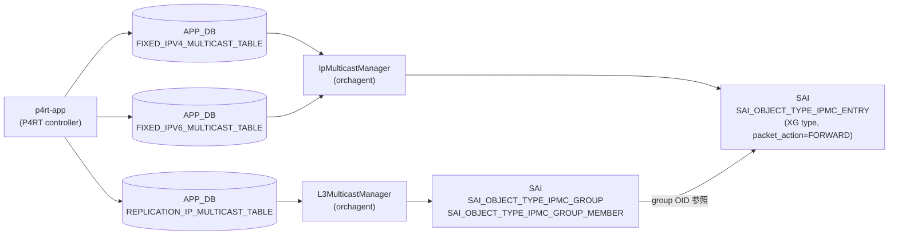

# IP マルチキャストルート (P4RT)

## 概要

SONiC の P4RT サブシステムは IP マルチキャスト転送を 2 種類の APP_DB テーブルで実現する。

| テーブル | 役割 |
|---------|------|
| `REPLICATION_IP_MULTICAST_TABLE` | マルチキャストグループ ID → レプリカ (出力ポート + インスタンス) の多対多マッピング |
| `FIXED_IPV4_MULTICAST_TABLE` | VRF + IPv4 マルチキャスト宛先 → グループ ID のルート |
| `FIXED_IPV6_MULTICAST_TABLE` | VRF + IPv6 マルチキャスト宛先 → グループ ID のルート |

これらはすべて **APP_DB** テーブルであり、P4RT-app (`p4rt`) がコントロールプレーンの指示を受けて書き込む。CONFIG_DB には専用テーブルは存在しない。

orchagent の `L3MulticastManager` が `REPLICATION_IP_MULTICAST_TABLE` を消費して SAI `IPMC_GROUP` / `IPMC_GROUP_MEMBER` を作成し、`IpMulticastManager` が `FIXED_IPV4/IPV6_MULTICAST_TABLE` を消費して SAI `IPMC_ENTRY` を作成する[^1]。

<!-- cdb-mermaid -->
### データフロー


<!-- /cdb-mermaid -->

## key 構造

```text
# レプリケーショングループ
P4RT:REPLICATION_IP_MULTICAST_TABLE:<multicast_group_id>

# IPv4 マルチキャストルート
P4RT:FIXED_IPV4_MULTICAST_TABLE:{"match/vrf_id":"<vrf>","match/ipv4_dst":"<ip>"}

# IPv6 マルチキャストルート
P4RT:FIXED_IPV6_MULTICAST_TABLE:{"match/vrf_id":"<vrf>","match/ipv6_dst":"<ip>"}
```

## フィールド — REPLICATION_IP_MULTICAST_TABLE

| フィールド | 型 | 必須 | 説明 |
|-----------|----|------|------|
| `replicas` | JSON 配列 | 必須 | 出力レプリカのリスト。各要素は `{"multicast_replica_port":"EthernetX","multicast_replica_instance":"0x0"}` |
| `backups` | JSON 配列の配列 | 任意 | フォールバックレプリカ。primary と同じ長さが必要 |
| `multicast_metadata` | string | 任意 | コントローラ定義メタデータ |
| `controller_metadata` | string | 任意 | コントローラ内部追跡用 (SAI には転送されない) |

## フィールド — FIXED_IPV4/IPV6_MULTICAST_TABLE

| フィールド | 型 | 必須 | 説明 |
|-----------|----|------|------|
| `action` | string | 任意 | `"set_multicast_group_id"` のみ有効。省略可 |
| `param/multicast_group_id` | string | 必須 | REPLICATION_IP_MULTICAST_TABLE のキー (OID が登録済みであること) |
| `controller_metadata` | string | 任意 | コントローラ内部追跡用 |

<!-- defaults -->
## フィールド暗黙デフォルト (Phase A — コード由来)

### `replicas` (REPLICATION_IP_MULTICAST_TABLE)

| 状況 | 挙動 | コード根拠 |
|------|------|-----------|
| フィールドなし / 空配列 | `SWSS_RC_INVALID_PARAM` でエラー | `l3_multicast_manager.cpp:L990-993` `if (entry.replicas.empty())` |
| 有効な配列 | 各レプリカの RIF 存在確認後、active replicas を選択 | `l3_multicast_manager.cpp:L1060-1090` `setActiveReplicas()` |

`replicas` はプロトコル上の必須フィールドであり、デフォルト値は存在しない。

### `backups` (REPLICATION_IP_MULTICAST_TABLE)

| 状況 | 挙動 | コード根拠 |
|------|------|-----------|
| フィールドなし | `backup_replicas` が空 → バックアップなし扱い | `l3_multicast_manager.cpp:L788-792` (空なら長さチェックをスキップ) |
| 指定あり | primary と同じ長さが必要。不一致時は `SWSS_RC_INVALID_PARAM` | `l3_multicast_manager.cpp:L788-793` |

フォールバック選択: `setActiveReplicas()` は primary RIF が UP なら primary を採用、ダウン時は backup リストを順に試み、全滅なら primary[0] を強制選択する。

### `multicast_metadata` (REPLICATION_IP_MULTICAST_TABLE)

| 状況 | 挙動 | コード根拠 |
|------|------|-----------|
| フィールドなし | `""` (空文字列) のまま保持 | `l3_multicast_manager.cpp:L729` ゼロ初期化 `P4MulticastGroupEntry group_entry = {}` |
| フィールドあり | 値をそのまま格納、SAI には転送されない | `l3_multicast_manager.cpp:L739-740` |

### `controller_metadata` (両テーブル共通)

| 状況 | 挙動 | コード根拠 |
|------|------|-----------|
| フィールドなし | `""` (空文字列) のまま保持 | `ip_multicast_manager.cpp:L415` `P4IpMulticastEntry ip_multicast_entry = {}` |
| フィールドあり | 値をそのまま格納、SAI には転送されない | `ip_multicast_manager.cpp:L451-452` |

`controller_metadata` はオーケストレーション内部キャッシュに格納されるが、SAI API への属性として渡されることはない。

### `action` (FIXED_IPV4/IPV6_MULTICAST_TABLE)

| 状況 | 挙動 | コード根拠 |
|------|------|-----------|
| フィールドなし | `""` → バリデーションをパス (空文字は `!action.empty()` が false) | `ip_multicast_manager.cpp:L498` |
| `"set_multicast_group_id"` | 有効な唯一のアクション | `ip_multicast_manager.cpp:L498-501` |
| それ以外の値 | `SWSS_RC_INVALID_PARAM` | `ip_multicast_manager.cpp:L500-502` |

### `param/multicast_group_id` (FIXED_IPV4/IPV6_MULTICAST_TABLE)

| 状況 | 挙動 | コード根拠 |
|------|------|-----------|
| フィールドなし / 空文字列 | `SWSS_RC_INVALID_PARAM` でエラー | `ip_multicast_manager.cpp:L504-507` |
| P4OidMapper 未登録の ID | `SWSS_RC_NOT_FOUND` でエラー | `ip_multicast_manager.cpp:L509-513` |
| 登録済みの ID | IPMC エントリ作成時に OID を取得して SAI に設定 | `ip_multicast_manager.cpp:L746-756` |

### SAI レベルの固定属性

IpMulticastManager が IPMC エントリを作成する際、以下の属性は常に固定値で設定される[^2]:

| SAI 属性 | 固定値 | 変更可否 |
|---------|--------|---------|
| `SAI_IPMC_ENTRY_ATTR_PACKET_ACTION` | `SAI_PACKET_ACTION_FORWARD` | 不可 |
| `SAI_IPMC_ENTRY_TYPE` | `SAI_IPMC_ENTRY_TYPE_XG` (any-source) | 不可 |
| Source IP | `0` (any-source) | 不可 |
| `SAI_IPMC_ENTRY_ATTR_RPF_GROUP_ID` | 内部自動生成の private RPF group | 不可 |

RPF group は最初の IPMC エントリ追加時に自動作成され (`createDefaultRpfGroup()`)、全エントリ削除時に自動削除される[^3]。

<!-- /defaults -->

## 購読者

| コンポーネント | テーブル | SAI 操作 |
|--------------|---------|---------|
| `L3MulticastManager` (orchagent) | REPLICATION_IP_MULTICAST_TABLE | `SAI_OBJECT_TYPE_IPMC_GROUP` + `SAI_OBJECT_TYPE_IPMC_GROUP_MEMBER` 作成/削除 |
| `IpMulticastManager` (orchagent) | FIXED_IPV4/IPV6_MULTICAST_TABLE | `SAI_OBJECT_TYPE_IPMC_ENTRY` 作成/更新/削除 |

## 制約事項

- `replicas` が空の場合はグループ作成が拒否される。
- `backups` を指定する場合、primary replicas と配列長が一致しなければならない。
- 同一バッチ内で同一エントリを複数回変更することはできない (`SWSS_RC_INVALID_PARAM`)。
- `FIXED_IPV4/IPV6_MULTICAST_TABLE` エントリを作成する前に、参照先の `REPLICATION_IP_MULTICAST_TABLE` エントリが存在しなければならない。
- 全 IPMC エントリを削除すると、内部 RPF group も自動削除される。RPF group 削除に失敗した場合、削除済みエントリが自動復元される。

## 引用元

[^1]: L3MulticastManager / IpMulticastManager: `sonic-net/sonic-swss` `orchagent/p4orch/l3_multicast_manager.cpp` / `ip_multicast_manager.cpp`
[^2]: SAI 固定属性: `ip_multicast_manager.cpp:L54-79` `prepareIpmcSaiAttrs()` および `L699-721` `prepareSaiIpmcEntry()`
[^3]: RPF group ライフサイクル: `ip_multicast_manager.cpp:L647-697` `createDefaultRpfGroup()` / `L687-697` `deleteDefaultRpfGroup()`
