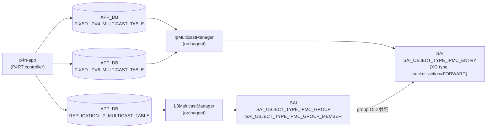

# IP マルチキャストルート (P4RT)

## 概要

SONiC の P4RT サブシステムは IP マルチキャスト転送を 2 種類の APP_DB テーブルで実現する。

| テーブル | 役割 |
|---------|------|
| `REPLICATION_IP_MULTICAST_TABLE` | マルチキャストグループ ID → レプリカ (出力ポート + インスタンス) の多対多マッピング |
| `FIXED_IPV4_MULTICAST_TABLE` | VRF + IPv4 マルチキャスト宛先 → グループ ID のルート |
| `FIXED_IPV6_MULTICAST_TABLE` | VRF + IPv6 マルチキャスト宛先 → グループ ID のルート |

これらはすべて **APP_DB** テーブルであり、P4RT-app (`p4rt`) がコントロールプレーンの指示を受けて書き込む。CONFIG_DB には専用テーブルは存在しない。

orchagent の `L3MulticastManager` が `REPLICATION_IP_MULTICAST_TABLE` を消費して SAI `IPMC_GROUP` / `IPMC_GROUP_MEMBER` を作成し、`IpMulticastManager` が `FIXED_IPV4/IPV6_MULTICAST_TABLE` を消費して SAI `IPMC_ENTRY` を作成する[^1]。

<!-- cdb-mermaid -->
### データフロー


<!-- /cdb-mermaid -->

## key 構造

```text
# レプリケーショングループ
P4RT:REPLICATION_IP_MULTICAST_TABLE:<multicast_group_id>

# IPv4 マルチキャストルート
P4RT:FIXED_IPV4_MULTICAST_TABLE:{"match/vrf_id":"<vrf>","match/ipv4_dst":"<ip>"}

# IPv6 マルチキャストルート
P4RT:FIXED_IPV6_MULTICAST_TABLE:{"match/vrf_id":"<vrf>","match/ipv6_dst":"<ip>"}
```

## フィールド — REPLICATION_IP_MULTICAST_TABLE

| フィールド | 型 | 必須 | 説明 |
|-----------|----|------|------|
| `replicas` | JSON 配列 | 必須 | 出力レプリカのリスト。各要素は `{"multicast_replica_port":"EthernetX","multicast_replica_instance":"0x0"}` |
| `backups` | JSON 配列の配列 | 任意 | フォールバックレプリカ。primary と同じ長さが必要 |
| `multicast_metadata` | string | 任意 | コントローラ定義メタデータ |
| `controller_metadata` | string | 任意 | コントローラ内部追跡用 (SAI には転送されない) |

## フィールド — FIXED_IPV4/IPV6_MULTICAST_TABLE

| フィールド | 型 | 必須 | 説明 |
|-----------|----|------|------|
| `action` | string | 任意 | `"set_multicast_group_id"` のみ有効。省略可 |
| `param/multicast_group_id` | string | 必須 | REPLICATION_IP_MULTICAST_TABLE のキー (OID が登録済みであること) |
| `controller_metadata` | string | 任意 | コントローラ内部追跡用 |

<!-- defaults -->
## フィールド暗黙デフォルト (Phase A — コード由来)

### `replicas` (REPLICATION_IP_MULTICAST_TABLE)

| 状況 | 挙動 | コード根拠 |
|------|------|-----------|
| フィールドなし / 空配列 | `SWSS_RC_INVALID_PARAM` でエラー | `l3_multicast_manager.cpp:L990-993` `if (entry.replicas.empty())` |
| 有効な配列 | 各レプリカの RIF 存在確認後、active replicas を選択 | `l3_multicast_manager.cpp:L1060-1090` `setActiveReplicas()` |

`replicas` はプロトコル上の必須フィールドであり、デフォルト値は存在しない。

### `backups` (REPLICATION_IP_MULTICAST_TABLE)

| 状況 | 挙動 | コード根拠 |
|------|------|-----------|
| フィールドなし | `backup_replicas` が空 → バックアップなし扱い | `l3_multicast_manager.cpp:L788-792` (空なら長さチェックをスキップ) |
| 指定あり | primary と同じ長さが必要。不一致時は `SWSS_RC_INVALID_PARAM` | `l3_multicast_manager.cpp:L788-793` |

フォールバック選択: `setActiveReplicas()` は primary RIF が UP なら primary を採用、ダウン時は backup リストを順に試み、全滅なら primary[0] を強制選択する。

### `multicast_metadata` (REPLICATION_IP_MULTICAST_TABLE)

| 状況 | 挙動 | コード根拠 |
|------|------|-----------|
| フィールドなし | `""` (空文字列) のまま保持 | `l3_multicast_manager.cpp:L729` ゼロ初期化 `P4MulticastGroupEntry group_entry = {}` |
| フィールドあり | 値をそのまま格納、SAI には転送されない | `l3_multicast_manager.cpp:L739-740` |

### `controller_metadata` (両テーブル共通)

| 状況 | 挙動 | コード根拠 |
|------|------|-----------|
| フィールドなし | `""` (空文字列) のまま保持 | `ip_multicast_manager.cpp:L415` `P4IpMulticastEntry ip_multicast_entry = {}` |
| フィールドあり | 値をそのまま格納、SAI には転送されない | `ip_multicast_manager.cpp:L451-452` |

`controller_metadata` はオーケストレーション内部キャッシュに格納されるが、SAI API への属性として渡されることはない。

### `action` (FIXED_IPV4/IPV6_MULTICAST_TABLE)

| 状況 | 挙動 | コード根拠 |
|------|------|-----------|
| フィールドなし | `""` → バリデーションをパス (空文字は `!action.empty()` が false) | `ip_multicast_manager.cpp:L498` |
| `"set_multicast_group_id"` | 有効な唯一のアクション | `ip_multicast_manager.cpp:L498-501` |
| それ以外の値 | `SWSS_RC_INVALID_PARAM` | `ip_multicast_manager.cpp:L500-502` |

### `param/multicast_group_id` (FIXED_IPV4/IPV6_MULTICAST_TABLE)

| 状況 | 挙動 | コード根拠 |
|------|------|-----------|
| フィールドなし / 空文字列 | `SWSS_RC_INVALID_PARAM` でエラー | `ip_multicast_manager.cpp:L504-507` |
| P4OidMapper 未登録の ID | `SWSS_RC_NOT_FOUND` でエラー | `ip_multicast_manager.cpp:L509-513` |
| 登録済みの ID | IPMC エントリ作成時に OID を取得して SAI に設定 | `ip_multicast_manager.cpp:L746-756` |

### SAI レベルの固定属性

IpMulticastManager が IPMC エントリを作成する際、以下の属性は常に固定値で設定される[^2]:

| SAI 属性 | 固定値 | 変更可否 |
|---------|--------|---------|
| `SAI_IPMC_ENTRY_ATTR_PACKET_ACTION` | `SAI_PACKET_ACTION_FORWARD` | 不可 |
| `SAI_IPMC_ENTRY_TYPE` | `SAI_IPMC_ENTRY_TYPE_XG` (any-source) | 不可 |
| Source IP | `0` (any-source) | 不可 |
| `SAI_IPMC_ENTRY_ATTR_RPF_GROUP_ID` | 内部自動生成の private RPF group | 不可 |

RPF group は最初の IPMC エントリ追加時に自動作成され (`createDefaultRpfGroup()`)、全エントリ削除時に自動削除される[^3]。

<!-- /defaults -->

<!-- ordering -->
## 書込み順依存・タイミング依存 (Phase B)

> 根拠: `ip_multicast_manager.cpp` `validateSetIpMulticastEntry()` L493-533、`validateIpMulticastEntry()` L471-491、`l3_multicast_manager.cpp` `validateReplicas()` L978-1057 全行精読。
> evidence: `meta/_intermediate/cdb-flow/ip-mcast-route-ordering.md`

P4RT フレームワークは依存オブジェクトが未存在の場合に即座に `SWSS_RC_NOT_FOUND` を返す。**pending キューや自動 retry は存在しない**。コントローラ (`p4rt-app`) が依存関係を守った順序で書き込む必要がある。

### 検出された順序依存

| # | 書き込みテーブル | 必須先行 | 不成立時の挙動 |
|---|-----------------|---------|---------------|
| 1 | `FIXED_IPV4/IPV6_MULTICAST_TABLE` | `REPLICATION_IP_MULTICAST_TABLE` (同一 `multicast_group_id`) | 即時 `SWSS_RC_NOT_FOUND`・エントリ破棄 |
| 2 | `REPLICATION_IP_MULTICAST_TABLE` | `MULTICAST_ROUTER_INTERFACE_TABLE` (全 replica の `(port, instance)`) | 即時 `SWSS_RC_NOT_FOUND`・エントリ破棄 |
| 3 | `FIXED_IPV4/IPV6_MULTICAST_TABLE` | VRF (VrfOrch) — 非空 `vrf_id` のみ | 即時 `SWSS_RC_NOT_FOUND`・エントリ破棄 |

### 依存 1: FIXED テーブル → REPLICATION_IP_MULTICAST_TABLE

`validateSetIpMulticastEntry()` (`ip_multicast_manager.cpp:L509-514`) が `param/multicast_group_id` を
P4OidMapper で検索し、`SAI_OBJECT_TYPE_IPMC_GROUP` の OID が未登録の場合は即座にエラーを返す:

```cpp
if (!m_p4OidMapper->existsOID(SAI_OBJECT_TYPE_IPMC_GROUP,
                              ip_multicast_entry.multicast_group_id)) {
  return ReturnCode(StatusCode::SWSS_RC_NOT_FOUND)
         << "No multicast group ID found for "
         << QuotedVar(ip_multicast_entry.multicast_group_id);
}
```

`L3MulticastManager` が `REPLICATION_IP_MULTICAST_TABLE` を消化して SAI `IPMC_GROUP` を作成し
P4OidMapper に OID を登録してから `FIXED_*_MULTICAST_TABLE` を書き込む必要がある。

### 依存 2: REPLICATION テーブル → MULTICAST_ROUTER_INTERFACE_TABLE

`validateReplicas()` (`l3_multicast_manager.cpp:L1002-1008`) が各レプリカの `(port, instance)` を
`L3MulticastManager` の内部テーブルで検索し、対応する `MULTICAST_ROUTER_INTERFACE_TABLE`
エントリが未登録の場合は即座にエラーを返す:

```cpp
if (router_interface_entry_ptr == nullptr) {
  return ReturnCode(StatusCode::SWSS_RC_NOT_FOUND)
         << "No corresponding "
         << APP_P4RT_MULTICAST_ROUTER_INTERFACE_TABLE_NAME
         << " entry found for multicast group " << ...;
}
```

### 依存 3: FIXED テーブル → VRF

`validateIpMulticastEntry()` (`ip_multicast_manager.cpp:L477-481`) が非空の `vrf_id` を VrfOrch で確認し、
未登録の場合は即座にエラーを返す。デフォルト VRF (`vrf_id` 空文字列) はチェックをスキップする。

### 推奨書込み順序

```
1. VRF を CONFIG_DB に投入 (非デフォルト VRF 使用時のみ)
2. MULTICAST_ROUTER_INTERFACE_TABLE を APP_DB に投入
3. REPLICATION_IP_MULTICAST_TABLE を APP_DB に投入
4. FIXED_IPV4/IPV6_MULTICAST_TABLE を APP_DB に投入
```

DEL 時は逆順: `FIXED_*` → `REPLICATION_*` → `MULTICAST_ROUTER_INTERFACE_TABLE` の順で削除する。
`REPLICATION_IP_MULTICAST_TABLE` に対する参照カウント (`increaseRefCount`/`decreaseRefCount`) が
IpMulticastManager 内で管理されており、参照が残っているグループを先に削除しようとすると SAI 削除が失敗する。
<!-- /ordering -->

<!-- cross-refs -->
## 暗黙参照テーブル (Phase C)

本ページの APP_DB 3 テーブル（`REPLICATION_IP_MULTICAST_TABLE` / `FIXED_IPV4_MULTICAST_TABLE` / `FIXED_IPV6_MULTICAST_TABLE`）はいずれも P4RT YANG 未定義のため leafref は存在しない。`L3MulticastManager` / `IpMulticastManager` が消費する際に以下のテーブル / Orch に対する暗黙参照が発生する。

| 参照先テーブル / リソース | 参照方向 | 条件 | 参照元 evidence |
|--------------------------|---------|------|----------------|
| `FIXED_MULTICAST_ROUTER_INTERFACE_TABLE` (APP_DB) | OID 解決（必須先行） | `REPLICATION_IP_MULTICAST_TABLE` の `replicas` 内の各 `(port, instance)` を処理するとき。エントリ不在は即時 `SWSS_RC_NOT_FOUND` — pending retry なし | `l3_multicast_manager.cpp` L1002-1008 (`validateReplicas` router interface lookup) |
| `REPLICATION_IP_MULTICAST_TABLE` (APP_DB) — P4OidMapper `IPMC_GROUP` OID | OID 存在確認（必須先行） | `FIXED_IPV4/IPV6_MULTICAST_TABLE` の `param/multicast_group_id` を処理するとき。OID 未登録は即時 `SWSS_RC_NOT_FOUND` — pending retry なし | `ip_multicast_manager.cpp` L509-514 (`validateSetIpMulticastEntry` existsOID), L748-756 (`getOID` → `SAI_IPMC_ENTRY_ATTR_OUTPUT_GROUP_ID`) |
| `VRFOrch::isVRFexists()` / `getVRFid()` / `increaseVrfRefCount()` | Orch 照合 + 参照カウント管理 | `FIXED_IPV4/IPV6_MULTICAST_TABLE` の `match/vrf_id` が空文字列以外のとき。VRF 未作成は即時 `SWSS_RC_NOT_FOUND`。デフォルト VRF (`vrf_id` = 空) は確認スキップ | `ip_multicast_manager.cpp` L477-481, L703 (`getVRFid`), L775 (`increaseVrfRefCount`), L886 (`decreaseVrfRefCount`) |
| `PortsOrch::getPort()` | ポート OID 解決 | `REPLICATION_IP_MULTICAST_TABLE` の `replicas` 内の各 `multicast_replica_port` を処理するとき。ポート未登録は `SWSS_RC_NOT_FOUND` | `l3_multicast_manager.cpp` L67-72 (`getSaiPort` → `PortsOrch::getPort`) |
| P4OidMapper `IPMC_GROUP` 参照カウント | 参照カウント管理（書き込み） | `FIXED_*` エントリ作成 / 削除のたびに `increaseRefCount` / `decreaseRefCount` を呼ぶ。参照が残っている `IPMC_GROUP` を先に削除しようとすると SAI 削除が失敗 | `ip_multicast_manager.cpp` L776 (`increaseRefCount`), L838-839 / L881 (`decreaseRefCount`) |

!!! note "pending retry は存在しない"
    P4RT フレームワークは依存オブジェクト不在時に即座にエラーを返し、自動 retry キューを持たない。`p4rt-app` (コントローラ) が依存解決済みの順序で書き込む必要がある。書き込み順序の詳細は [Phase B](#書込み順依存タイミング依存-phase-b) を参照。

!!! note "デフォルト VRF 使用時の VRFOrch 依存はスキップ"
    `match/vrf_id` が空文字列の場合、`validateIpMulticastEntry()` は VRF 存在確認をスキップし、SAI エントリ作成時に `vr_id = 0` (`SAI_NULL_OBJECT_ID`) を使用する。VRFOrch への参照は非デフォルト VRF 専用。

詳細分析: `meta/_intermediate/cdb-flow/ip-mcast-route-cross-refs.md`
<!-- /cross-refs -->

## 購読者

| コンポーネント | テーブル | SAI 操作 |
|--------------|---------|---------|
| `L3MulticastManager` (orchagent) | REPLICATION_IP_MULTICAST_TABLE | `SAI_OBJECT_TYPE_IPMC_GROUP` + `SAI_OBJECT_TYPE_IPMC_GROUP_MEMBER` 作成/削除 |
| `IpMulticastManager` (orchagent) | FIXED_IPV4/IPV6_MULTICAST_TABLE | `SAI_OBJECT_TYPE_IPMC_ENTRY` 作成/更新/削除 |

## 制約事項

- `replicas` が空の場合はグループ作成が拒否される。
- `backups` を指定する場合、primary replicas と配列長が一致しなければならない。
- 同一バッチ内で同一エントリを複数回変更することはできない (`SWSS_RC_INVALID_PARAM`)。
- `FIXED_IPV4/IPV6_MULTICAST_TABLE` エントリを作成する前に、参照先の `REPLICATION_IP_MULTICAST_TABLE` エントリが存在しなければならない。
- 全 IPMC エントリを削除すると、内部 RPF group も自動削除される。RPF group 削除に失敗した場合、削除済みエントリが自動復元される。

## 引用元

[^1]: L3MulticastManager / IpMulticastManager: `sonic-net/sonic-swss` `orchagent/p4orch/l3_multicast_manager.cpp` / `ip_multicast_manager.cpp`
[^2]: SAI 固定属性: `ip_multicast_manager.cpp:L54-79` `prepareIpmcSaiAttrs()` および `L699-721` `prepareSaiIpmcEntry()`
[^3]: RPF group ライフサイクル: `ip_multicast_manager.cpp:L647-697` `createDefaultRpfGroup()` / `L687-697` `deleteDefaultRpfGroup()`
