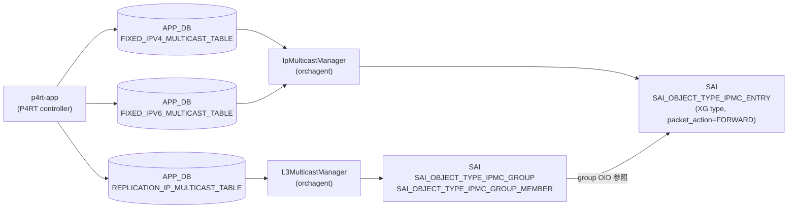

# IP マルチキャストルート (P4RT)

## 概要

SONiC の P4RT サブシステムは IP マルチキャスト転送を 2 種類の APP_DB テーブルで実現する。

| テーブル | 役割 |
|---------|------|
| `REPLICATION_IP_MULTICAST_TABLE` | マルチキャストグループ ID → レプリカ (出力ポート + インスタンス) の多対多マッピング |
| `FIXED_IPV4_MULTICAST_TABLE` | VRF + IPv4 マルチキャスト宛先 → グループ ID のルート |
| `FIXED_IPV6_MULTICAST_TABLE` | VRF + IPv6 マルチキャスト宛先 → グループ ID のルート |

これらはすべて **APP_DB** テーブルであり、P4RT-app (`p4rt`) がコントロールプレーンの指示を受けて書き込む。CONFIG_DB には専用テーブルは存在しない。

orchagent の `L3MulticastManager` が `REPLICATION_IP_MULTICAST_TABLE` を消費して SAI `IPMC_GROUP` / `IPMC_GROUP_MEMBER` を作成し、`IpMulticastManager` が `FIXED_IPV4/IPV6_MULTICAST_TABLE` を消費して SAI `IPMC_ENTRY` を作成する[^1]。

<!-- cdb-mermaid -->
### データフロー


<!-- /cdb-mermaid -->

## key 構造

```text
# レプリケーショングループ
P4RT:REPLICATION_IP_MULTICAST_TABLE:<multicast_group_id>

# IPv4 マルチキャストルート
P4RT:FIXED_IPV4_MULTICAST_TABLE:{"match/vrf_id":"<vrf>","match/ipv4_dst":"<ip>"}

# IPv6 マルチキャストルート
P4RT:FIXED_IPV6_MULTICAST_TABLE:{"match/vrf_id":"<vrf>","match/ipv6_dst":"<ip>"}
```

## フィールド — REPLICATION_IP_MULTICAST_TABLE

| フィールド | 型 | 必須 | 説明 |
|-----------|----|------|------|
| `replicas` | JSON 配列 | 必須 | 出力レプリカのリスト。各要素は `{"multicast_replica_port":"EthernetX","multicast_replica_instance":"0x0"}` |
| `backups` | JSON 配列の配列 | 任意 | フォールバックレプリカ。primary と同じ長さが必要 |
| `multicast_metadata` | string | 任意 | コントローラ定義メタデータ |
| `controller_metadata` | string | 任意 | コントローラ内部追跡用 (SAI には転送されない) |

## フィールド — FIXED_IPV4/IPV6_MULTICAST_TABLE

| フィールド | 型 | 必須 | 説明 |
|-----------|----|------|------|
| `action` | string | 任意 | `"set_multicast_group_id"` のみ有効。省略可 |
| `param/multicast_group_id` | string | 必須 | REPLICATION_IP_MULTICAST_TABLE のキー (OID が登録済みであること) |
| `controller_metadata` | string | 任意 | コントローラ内部追跡用 |

<!-- defaults -->
## フィールド暗黙デフォルト (Phase A — コード由来)

### `replicas` (REPLICATION_IP_MULTICAST_TABLE)

| 状況 | 挙動 | コード根拠 |
|------|------|-----------|
| フィールドなし / 空配列 | `SWSS_RC_INVALID_PARAM` でエラー | `l3_multicast_manager.cpp:L990-993` `if (entry.replicas.empty())` |
| 有効な配列 | 各レプリカの RIF 存在確認後、active replicas を選択 | `l3_multicast_manager.cpp:L1060-1090` `setActiveReplicas()` |

`replicas` はプロトコル上の必須フィールドであり、デフォルト値は存在しない。

### `backups` (REPLICATION_IP_MULTICAST_TABLE)

| 状況 | 挙動 | コード根拠 |
|------|------|-----------|
| フィールドなし | `backup_replicas` が空 → バックアップなし扱い | `l3_multicast_manager.cpp:L788-792` (空なら長さチェックをスキップ) |
| 指定あり | primary と同じ長さが必要。不一致時は `SWSS_RC_INVALID_PARAM` | `l3_multicast_manager.cpp:L788-793` |

フォールバック選択: `setActiveReplicas()` は primary RIF が UP なら primary を採用、ダウン時は backup リストを順に試み、全滅なら primary[0] を強制選択する。

### `multicast_metadata` (REPLICATION_IP_MULTICAST_TABLE)

| 状況 | 挙動 | コード根拠 |
|------|------|-----------|
| フィールドなし | `""` (空文字列) のまま保持 | `l3_multicast_manager.cpp:L729` ゼロ初期化 `P4MulticastGroupEntry group_entry = {}` |
| フィールドあり | 値をそのまま格納、SAI には転送されない | `l3_multicast_manager.cpp:L739-740` |

### `controller_metadata` (両テーブル共通)

| 状況 | 挙動 | コード根拠 |
|------|------|-----------|
| フィールドなし | `""` (空文字列) のまま保持 | `ip_multicast_manager.cpp:L415` `P4IpMulticastEntry ip_multicast_entry = {}` |
| フィールドあり | 値をそのまま格納、SAI には転送されない | `ip_multicast_manager.cpp:L451-452` |

`controller_metadata` はオーケストレーション内部キャッシュに格納されるが、SAI API への属性として渡されることはない。

### `action` (FIXED_IPV4/IPV6_MULTICAST_TABLE)

| 状況 | 挙動 | コード根拠 |
|------|------|-----------|
| フィールドなし | `""` → バリデーションをパス (空文字は `!action.empty()` が false) | `ip_multicast_manager.cpp:L498` |
| `"set_multicast_group_id"` | 有効な唯一のアクション | `ip_multicast_manager.cpp:L498-501` |
| それ以外の値 | `SWSS_RC_INVALID_PARAM` | `ip_multicast_manager.cpp:L500-502` |

### `param/multicast_group_id` (FIXED_IPV4/IPV6_MULTICAST_TABLE)

| 状況 | 挙動 | コード根拠 |
|------|------|-----------|
| フィールドなし / 空文字列 | `SWSS_RC_INVALID_PARAM` でエラー | `ip_multicast_manager.cpp:L504-507` |
| P4OidMapper 未登録の ID | `SWSS_RC_NOT_FOUND` でエラー | `ip_multicast_manager.cpp:L509-513` |
| 登録済みの ID | IPMC エントリ作成時に OID を取得して SAI に設定 | `ip_multicast_manager.cpp:L746-756` |

### SAI レベルの固定属性

IpMulticastManager が IPMC エントリを作成する際、以下の属性は常に固定値で設定される[^2]:

| SAI 属性 | 固定値 | 変更可否 |
|---------|--------|---------|
| `SAI_IPMC_ENTRY_ATTR_PACKET_ACTION` | `SAI_PACKET_ACTION_FORWARD` | 不可 |
| `SAI_IPMC_ENTRY_TYPE` | `SAI_IPMC_ENTRY_TYPE_XG` (any-source) | 不可 |
| Source IP | `0` (any-source) | 不可 |
| `SAI_IPMC_ENTRY_ATTR_RPF_GROUP_ID` | 内部自動生成の private RPF group | 不可 |

RPF group は最初の IPMC エントリ追加時に自動作成され (`createDefaultRpfGroup()`)、全エントリ削除時に自動削除される[^3]。

<!-- /defaults -->

<!-- ordering -->
## 書込み順依存・タイミング依存 (Phase B)

> 根拠: `ip_multicast_manager.cpp` `validateSetIpMulticastEntry()` L493-533、`validateIpMulticastEntry()` L471-491、`l3_multicast_manager.cpp` `validateReplicas()` L978-1057 全行精読。
> evidence: `meta/_intermediate/cdb-flow/ip-mcast-route-ordering.md`

P4RT フレームワークは依存オブジェクトが未存在の場合に即座に `SWSS_RC_NOT_FOUND` を返す。**pending キューや自動 retry は存在しない**。コントローラ (`p4rt-app`) が依存関係を守った順序で書き込む必要がある。

### 検出された順序依存

| # | 書き込みテーブル | 必須先行 | 不成立時の挙動 |
|---|-----------------|---------|---------------|
| 1 | `FIXED_IPV4/IPV6_MULTICAST_TABLE` | `REPLICATION_IP_MULTICAST_TABLE` (同一 `multicast_group_id`) | 即時 `SWSS_RC_NOT_FOUND`・エントリ破棄 |
| 2 | `REPLICATION_IP_MULTICAST_TABLE` | `MULTICAST_ROUTER_INTERFACE_TABLE` (全 replica の `(port, instance)`) | 即時 `SWSS_RC_NOT_FOUND`・エントリ破棄 |
| 3 | `FIXED_IPV4/IPV6_MULTICAST_TABLE` | VRF (VrfOrch) — 非空 `vrf_id` のみ | 即時 `SWSS_RC_NOT_FOUND`・エントリ破棄 |

### 依存 1: FIXED テーブル → REPLICATION_IP_MULTICAST_TABLE

`validateSetIpMulticastEntry()` (`ip_multicast_manager.cpp:L509-514`) が `param/multicast_group_id` を
P4OidMapper で検索し、`SAI_OBJECT_TYPE_IPMC_GROUP` の OID が未登録の場合は即座にエラーを返す:

```cpp
if (!m_p4OidMapper->existsOID(SAI_OBJECT_TYPE_IPMC_GROUP,
                              ip_multicast_entry.multicast_group_id)) {
  return ReturnCode(StatusCode::SWSS_RC_NOT_FOUND)
         << "No multicast group ID found for "
         << QuotedVar(ip_multicast_entry.multicast_group_id);
}
```

`L3MulticastManager` が `REPLICATION_IP_MULTICAST_TABLE` を消化して SAI `IPMC_GROUP` を作成し
P4OidMapper に OID を登録してから `FIXED_*_MULTICAST_TABLE` を書き込む必要がある。

### 依存 2: REPLICATION テーブル → MULTICAST_ROUTER_INTERFACE_TABLE

`validateReplicas()` (`l3_multicast_manager.cpp:L1002-1008`) が各レプリカの `(port, instance)` を
`L3MulticastManager` の内部テーブルで検索し、対応する `MULTICAST_ROUTER_INTERFACE_TABLE`
エントリが未登録の場合は即座にエラーを返す:

```cpp
if (router_interface_entry_ptr == nullptr) {
  return ReturnCode(StatusCode::SWSS_RC_NOT_FOUND)
         << "No corresponding "
         << APP_P4RT_MULTICAST_ROUTER_INTERFACE_TABLE_NAME
         << " entry found for multicast group " << ...;
}
```

### 依存 3: FIXED テーブル → VRF

`validateIpMulticastEntry()` (`ip_multicast_manager.cpp:L477-481`) が非空の `vrf_id` を VrfOrch で確認し、
未登録の場合は即座にエラーを返す。デフォルト VRF (`vrf_id` 空文字列) はチェックをスキップする。

### 推奨書込み順序

```
1. VRF を CONFIG_DB に投入 (非デフォルト VRF 使用時のみ)
2. MULTICAST_ROUTER_INTERFACE_TABLE を APP_DB に投入
3. REPLICATION_IP_MULTICAST_TABLE を APP_DB に投入
4. FIXED_IPV4/IPV6_MULTICAST_TABLE を APP_DB に投入
```

DEL 時は逆順: `FIXED_*` → `REPLICATION_*` → `MULTICAST_ROUTER_INTERFACE_TABLE` の順で削除する。
`REPLICATION_IP_MULTICAST_TABLE` に対する参照カウント (`increaseRefCount`/`decreaseRefCount`) が
IpMulticastManager 内で管理されており、参照が残っているグループを先に削除しようとすると SAI 削除が失敗する。
<!-- /ordering -->

<!-- cross-refs -->
## 暗黙参照 (Phase C)

> 根拠: `ip_multicast_manager.cpp:L477-481,L509-514,L775,L886`、`l3_multicast_manager.cpp:L1002-1008,L2196`、`vrforch.h:L58-119`、`orchdaemon.cpp:L283`、`schema.h:L73-80`
> evidence: `meta/_intermediate/cdb-flow/ip-mcast-route-cross-refs.md`

これらテーブルは APP_DB 上の P4RT ネームスペースに存在するため **YANG leafref は定義されていない**。ただしコード上の実行時参照として以下の暗黙依存が存在する。

| 参照元 | 参照先 (DB:テーブル:キー) | 参照方法 | 未存在時の挙動 |
|--------|--------------------------|---------|---------------|
| `FIXED_IPV4/IPV6_MULTICAST_TABLE` | `APP_DB:VRF_TABLE:<vrf_name>` | `VRFOrch::isVRFexists()` (非空 `vrf_id` のみ) | `SWSS_RC_NOT_FOUND` で即拒否 |
| `REPLICATION_IP_MULTICAST_TABLE` | `APP_DB:P4RT:FIXED_MULTICAST_ROUTER_INTERFACE_TABLE` (全 replica の `(port, instance)`) | `L3MulticastManager` 内部キャッシュ参照 | `SWSS_RC_NOT_FOUND` で即拒否 |
| `FIXED_IPV4/IPV6_MULTICAST_TABLE` | P4OidMapper 内 `SAI_OBJECT_TYPE_IPMC_GROUP:multicast_group_id` | `P4OidMapper::existsOID()` | `SWSS_RC_NOT_FOUND` で即拒否 |

### VRF 参照カウント管理

`IpMulticastManager` は IPMC エントリ作成時に `m_vrfOrch->increaseVrfRefCount(vrf_id)` を呼び (`ip_multicast_manager.cpp:L775`)、削除時に `decreaseVrfRefCount` を呼ぶ (`L886`)。これにより VRF に対する参照カウントが正しく管理される。VRF を先に削除すると参照カウント不整合が発生するため、VRF 削除前に `FIXED_IPV4/IPV6_MULTICAST_TABLE` エントリをすべて削除する必要がある。

### CONFIG_DB への直接依存なし

`ip_multicast_manager.cpp` / `l3_multicast_manager.cpp` はいずれも CONFIG_DB を直接 subscribe / get しない。CONFIG_DB 依存は VRFOrch および P4Orch 上位レイヤが間接処理する。
<!-- /cross-refs -->

<!-- failure -->
## 失敗挙動 (Phase D)

> 調査証跡: `meta/_intermediate/cdb-flow/ip-mcast-route-failure.md`

<!-- evidence: sonic-swss/orchagent/p4orch/ip_multicast_manager.cpp:120-195,612-697,741-831,862-876, sonic-swss/orchagent/p4orch/l3_multicast_manager.cpp:430-478,525-596,978-1033 -->

P4RT フレームワークの失敗モデルは**バッチ内一括適用**で、失敗発生時は残りのエントリに `SWSS_RC_NOT_EXECUTED` を付与して中断する。個別エントリの自動 retry はなく、コントローラ (`p4rt-app`) が状態確認のうえ再送を担う。

### IpMulticastManager (FIXED_IPV4/IPV6_MULTICAST_TABLE) の失敗パターン

| # | 失敗ケース | 発生箇所 | 返却コード | retry | ログレベル |
|---|-----------|---------|-----------|-------|-----------|
| 1 | APP_DB エントリのデシリアライズ失敗 | `ip_multicast_manager.cpp:L127-135` | エラーコード (parse 失敗内容) | なし | ERROR |
| 2 | 同一バッチ内での同一エントリ重複 | `ip_multicast_manager.cpp:L142-150` | `SWSS_RC_INVALID_PARAM` | なし | ERROR |
| 3 | バリデーション失敗 (`validateIpMulticastEntry`) | `ip_multicast_manager.cpp:L154-163` | `SWSS_RC_NOT_FOUND` / `SWSS_RC_INVALID_PARAM` | なし | ERROR |
| 4 | multicast group OID が P4OidMapper 未登録 (CREATE) | `ip_multicast_manager.cpp:L748-755` | `SWSS_RC_NOT_FOUND` | なし | — |
| 5 | SAI `create_ipmc_entry` 失敗 | `ip_multicast_manager.cpp:L761-764` | SAI ステータスコード | なし | — |
| 6 | SAI `create_rpf_group` / RIF 作成失敗 (初回エントリ追加時) | `ip_multicast_manager.cpp:L661-665` | SAI ステータスコード | なし | ERROR |
| 7 | 内部キャッシュに存在しないエントリの UPDATE | `ip_multicast_manager.cpp:L794-798` | `SWSS_RC_INTERNAL` | なし | — |
| 8 | multicast group OID が P4OidMapper 未登録 (UPDATE) | `ip_multicast_manager.cpp:L817-820` | `SWSS_RC_NOT_FOUND` | なし | — |
| 9 | SAI `set_ipmc_entry_attribute` 失敗 (UPDATE) | `ip_multicast_manager.cpp:L827-830` | SAI ステータスコード | なし | — |
| 10 | 内部キャッシュに存在しないエントリの DEL | `ip_multicast_manager.cpp:L866` | `SWSS_RC_NOT_FOUND` | なし | — |
| 11 | SAI `remove_rpf_group` 失敗 (全エントリ削除後) | `ip_multicast_manager.cpp:L691-693` | SAI ステータスコード | なし | ERROR |

### L3MulticastManager (REPLICATION_IP_MULTICAST_TABLE) の失敗パターン

| # | 失敗ケース | 発生箇所 | 返却コード | retry | ログレベル |
|---|-----------|---------|-----------|-------|-----------|
| 12 | APP_DB エントリのデシリアライズ失敗 | `l3_multicast_manager.cpp:L430` | エラーコード | なし | ERROR |
| 13 | `replicas` フィールドが空 | `l3_multicast_manager.cpp:L991` | `SWSS_RC_INVALID_PARAM` | なし | — |
| 14 | replica の router interface が内部キャッシュ未登録 | `l3_multicast_manager.cpp:L1003-1008` | `SWSS_RC_NOT_FOUND` | なし | — |

### 代表的な失敗コード

**バッチ中断と `SWSS_RC_NOT_EXECUTED` 付与 (Pattern 1〜3)**:
```cpp
// ip_multicast_manager.cpp:L183-189
if (!status.ok()) {
  // Return SWSS_RC_NOT_EXECUTED if failure has occured.
  m_publisher->publish(APP_P4RT_TABLE_NAME, kfvKey(key_op_fvs_tuple),
                       kfvFieldsValues(key_op_fvs_tuple),
                       ReturnCode(StatusCode::SWSS_RC_NOT_EXECUTED),
                       /*replace=*/true);
  break;
}
```

**multicast group OID 未登録 (Pattern 4)**:
```cpp
// ip_multicast_manager.cpp:L748-755
if (!m_p4OidMapper->getOID(SAI_OBJECT_TYPE_IPMC_GROUP,
                           ip_multicast_entry.multicast_group_id,
                           &group_oid)) {
  statuses[i] = ReturnCode(StatusCode::SWSS_RC_NOT_FOUND)
                << "Multicast group ID "
                << QuotedVar(ip_multicast_entry.multicast_group_id)
                << " has not been created yet.";
  break;
}
```

**RPF group 削除失敗 (Pattern 11)**:
```cpp
// ip_multicast_manager.cpp:L688-694
ReturnCode IpMulticastManager::deleteDefaultRpfGroup() {
  sai_status_t status =
      sai_rpf_group_api->remove_rpf_group(ipmc_rpf_group_oid_);
  if (status != SAI_STATUS_SUCCESS) {
    LOG_ERROR_AND_RETURN(ReturnCode(status)
                         << "Failed to delete default RPF group");
  }
```

### STATE_DB / ERROR_TABLE への影響

- P4RT マネージャは STATE_DB を直接操作しない
- 失敗は `m_publisher->publish()` で `APP_P4RT_TABLE_NAME` にステータスコードとして書き戻される（コントローラが確認可能）
- CONFIG_DB は本テーブルに対して無関係（直接 subscribe / get なし）
- Pattern 11（RPF group 削除失敗）では全 IPMC エントリが正常削除済みでも RPF group が残存する可能性があり、その場合は orchagent 再起動が必要

<!-- /failure -->

<!-- constants -->
## ハードコード定数 (Phase E)

> 根拠: `ip_multicast_manager.cpp:L45,L61,L376,L596,L704,L712,L719`、`l3_multicast_manager.cpp:L53-56,L167,L189,L641,L1415-1416`
> evidence: `meta/_intermediate/cdb-flow/ip-mcast-route-constants.md`

以下の定数はいずれもコード中にハードコードされており、CONFIG_DB フィールド・YANG スキーマ・環境変数による上書きは不可能。

### ip_multicast_manager.cpp 内定数

| 定数 | 値 | 用途 | 変更可否 |
|------|----|------|---------|
| `kRifMemberMacAddress` | `"00:00:00:00:00:01"` | RPF group 向けに自動生成される RIF の `SAI_ROUTER_INTERFACE_ATTR_SRC_MAC_ADDRESS` に固定設定 (`ip_multicast_manager.cpp:L596`) | 不可 |
| `SAI_PACKET_ACTION_FORWARD` | SAI enum (`0`) | 全 IPMC エントリのパケットアクション (`ip_multicast_manager.cpp:L61,L376`) | 不可 |
| `SAI_IPMC_ENTRY_TYPE_XG` | SAI enum (`0`) | 全 IPMC エントリタイプを any-source (XG) 固定。SSM (Source-Specific Multicast) は本実装で非対応 (`ip_multicast_manager.cpp:L704`) | 不可 |
| Source IP `0` | IPv4 `0.0.0.0` / IPv6 `::` | IPMC エントリの送信元 IP フィールドをゼロ埋め (any-source を示す) (`ip_multicast_manager.cpp:L712,L719`) | 不可 |

### l3_multicast_manager.cpp 内定数

ソースコードコメント (`l3_multicast_manager.cpp:L48-52`) に「これらはプレースホルダ値。リンクローカル IP はどんな値でも構わない。デフォルト MAC は MAC 書き換えを行わない場合は無視される」と明記されている。

| 定数 | 値 | 用途 | 変更可否 |
|------|----|------|---------|
| `kLinkLocalIpv4Address` | `"169.254.0.1"` | SAI neighbor entry および next hop オブジェクト作成時の IP アドレスフィールドに固定設定 (`l3_multicast_manager.cpp:L167,L189`)。実データプレーン転送には影響しない | 不可 |
| `kNeighborMacAddress` | `"00:00:00:00:00:01"` | `MULTICAST_ROUTER_INTERFACE_TABLE` エントリの内部デフォルト `dst_mac` (`l3_multicast_manager.cpp:L641`)。アクションが明示的な MAC 書き換えを指定しない限り無視 | 不可 |
| `kDefaultMyMacAddress` | `"00:00:00:00:00:01"` | SAI my-mac エントリの `SAI_MY_MAC_ATTR_MAC_ADDRESS` に固定設定 (`l3_multicast_manager.cpp:L1415`) | 不可 |
| `kDefaultMyMacAddressMask` | `"00:00:00:00:00:00"` | SAI my-mac エントリの `SAI_MY_MAC_ATTR_MAC_ADDRESS_MASK` に固定設定 (`l3_multicast_manager.cpp:L1416`)。オールゼロマスクにより任意 MAC にマッチするワイルドカードとして機能する | 不可 |

### 設計上の含意

- `kLinkLocalIpv4Address` / `kNeighborMacAddress` は SAI 構造体の「必須フィールドを埋めるプレースホルダ」であり、これらの値が実際のパケット転送ロジックに影響することはない
- `kDefaultMyMacAddressMask` がオールゼロであるため、SAI my-mac ACL エントリは全 MAC に対してワイルドカードマッチを行う
- `SAI_IPMC_ENTRY_TYPE_XG` 固定により、このテーブルは ASM (Any-Source Multicast) のみをサポートする。SSM を必要とする場合は別実装が必要
<!-- /constants -->

<!-- side-effects -->
## 副次 DB 書込 (Phase F)

> 詳細証跡: `meta/_intermediate/cdb-flow/ip-mcast-route-side-effects.md`
> 調査対象: `sonic-swss/orchagent/p4orch/ip_multicast_manager.cpp`, `sonic-swss/orchagent/p4orch/l3_multicast_manager.cpp`

`REPLICATION_IP_MULTICAST_TABLE` / `FIXED_IPV4_MULTICAST_TABLE` / `FIXED_IPV6_MULTICAST_TABLE` への SET/DEL が引き起こす CONFIG_DB 以外への書き込みを示す。STATE_DB / APPL_DB への直接書き込みは存在しない。

### SAI / ASIC_STATE 書込み

| 操作 | SAI オブジェクトタイプ | SAI API | コード根拠 |
|------|---------------------|---------|-----------|
| REPLICATION SET 成功 | `SAI_OBJECT_TYPE_IPMC_GROUP` | `sai_ipmc_group_api->create_ipmc_group()` | `l3_multicast_manager.cpp:L2196` |
| REPLICATION SET 成功 (replicas ごと) | `SAI_OBJECT_TYPE_IPMC_GROUP_MEMBER` | `sai_ipmc_group_api->create_ipmc_group_member()` | `l3_multicast_manager.cpp:L2262` |
| REPLICATION DEL 成功 (replicas ごと) | `SAI_OBJECT_TYPE_IPMC_GROUP_MEMBER` | `sai_ipmc_group_api->remove_ipmc_group_member()` | `l3_multicast_manager.cpp:L2552` |
| REPLICATION DEL 成功 | `SAI_OBJECT_TYPE_IPMC_GROUP` | `sai_ipmc_group_api->remove_ipmc_group()` | `l3_multicast_manager.cpp:L2247` |
| FIXED SET 成功 (初回 IPMC エントリのみ) | `SAI_OBJECT_TYPE_RPF_GROUP` + `SAI_OBJECT_TYPE_RPF_GROUP_MEMBER` | `sai_rpf_group_api->create_rpf_group()` / `create_rpf_group_member()` | `ip_multicast_manager.cpp:L651-665` |
| FIXED SET 成功 | `SAI_OBJECT_TYPE_IPMC_ENTRY` | `sai_ipmc_api->create_ipmc_entry()` | `ip_multicast_manager.cpp:L761` |
| FIXED DEL 成功 | `SAI_OBJECT_TYPE_IPMC_ENTRY` | `sai_ipmc_api->remove_ipmc_entry()` | `ip_multicast_manager.cpp:L874` |
| FIXED DEL 成功 (全エントリ削除後) | `SAI_OBJECT_TYPE_RPF_GROUP_MEMBER` + `SAI_OBJECT_TYPE_RPF_GROUP` | `sai_rpf_group_api->remove_rpf_group_member()` / `remove_rpf_group()` | `ip_multicast_manager.cpp:L688-694` |

### CRM カウンタ更新 (FIXED テーブルのみ)

`gCrmOrch` 経由で orchagent 内部の CRM (Critical Resource Monitor) カウンタを更新する。COUNTERS_DB への書き込みは CRM ポーリングタイマで非同期に反映される。

| 操作 | CRM リソースタイプ | コード根拠 |
|------|-----------------|-----------|
| `FIXED_IPV4/IPV6_MULTICAST_TABLE` SET 成功 | `CRM_IPMC_ENTRY` + 1 | `ip_multicast_manager.cpp:L774` `gCrmOrch->incCrmResUsedCounter()` |
| `FIXED_IPV4/IPV6_MULTICAST_TABLE` DEL 成功 | `CRM_IPMC_ENTRY` - 1 | `ip_multicast_manager.cpp:L885` `gCrmOrch->decCrmResUsedCounter()` |

`REPLICATION_IP_MULTICAST_TABLE` による IPMC_GROUP / IPMC_GROUP_MEMBER には対応 CRM リソースタイプが存在しない (`l3_multicast_manager.cpp` に `incCrmResUsedCounter` 呼び出しなし)。

### VRF 参照カウント更新 (FIXED テーブルのみ)

`vrf_id` が非空の場合、`VRFOrch` インプロセスカウンタを更新する。Redis への書き込みはなし。

| 操作 | VRF 操作 | コード根拠 |
|------|---------|-----------|
| `FIXED_IPV4/IPV6_MULTICAST_TABLE` SET 成功 (非空 vrf_id) | `increaseVrfRefCount(vrf_id)` | `ip_multicast_manager.cpp:L775` |
| `FIXED_IPV4/IPV6_MULTICAST_TABLE` DEL 成功 (非空 vrf_id) | `decreaseVrfRefCount(vrf_id)` | `ip_multicast_manager.cpp:L886` |

### APP_P4RT_TABLE へのステータス書き戻し

処理結果は `m_publisher->publish(APP_P4RT_TABLE_NAME, ...)` で APP_DB に書き戻され、コントローラ (`p4rt-app`) が確認できる。バッチ中断時は未処理エントリに `SWSS_RC_NOT_EXECUTED` が付与される (`ip_multicast_manager.cpp:L183-189`、`l3_multicast_manager.cpp:L375`)。

### STATE_DB / FLEX_COUNTER_DB への書き込み — なし

`ip_multicast_manager.cpp` / `l3_multicast_manager.cpp` ともに STATE_DB・FLEX_COUNTER_DB への直接書き込みは存在しない。

<!-- /side-effects -->

<!-- pubsub -->
## 通信メカニズム (Phase G) — ZMQ 経由の購読

<!-- evidence: sonic-swss/orchagent/p4orch/p4orch.cpp:36-43,51-54,72-79 / orchdaemon.cpp:847-849 / orchdaemon.h:121 / ip_multicast_manager.cpp:84-93,132,147,159,185,230 / l3_multicast_manager.cpp:310-318,329-332,375,433,476,530 -->

`FIXED_IPV4_MULTICAST_TABLE` / `FIXED_IPV6_MULTICAST_TABLE` / `FIXED_MULTICAST_ROUTER_INTERFACE_TABLE` / `REPLICATION_IP_MULTICAST_TABLE` はいずれも **通常の redis ConsumerStateTable / keyspace 通知パスを使わず、専用 ZMQ チャネル経由で配送される**。これは CONFIG_DB の `MIRROR_SESSION` 等を購読する通常の `Orch` + `ConsumerStateTable` 経路とは根本的に異なる通信モデルである。

### 転送経路

| 層 | クラス / 実体 | 役割 |
|----|--------------|------|
| 受信エンドポイント | `swss::ZmqServer` (`m_p4OrchZmqServer`、エンドポイント `"ipc:///zmq_swss/p4orch_zmq_swss_ep"`) | P4RT クライアントからの ZMQ フレームを受信 |
| Orch 基底 | `P4Orch : public ZmqOrch` | 全 P4RT テーブルを 1 インスタンスで保有。`ZmqOrch(db, tableNames, zmqServer, orderedQueue=true, dbPersistence=false)` で初期化 |
| ディスパッチ | `P4Orch::doTask(ConsumerBase &consumer)` | バッチ受信時に `APP_P4RT_TABLE_NAME` を検証し、`m_p4TableToManagerMap` でテーブル別マネージャに振り分け |
| ハンドラ (FIXED テーブル) | `p4orch::IpMulticastManager` | `FIXED_IPV4_MULTICAST_TABLE` / `FIXED_IPV6_MULTICAST_TABLE` を処理 |
| ハンドラ (REPLICATION / FIXED_MULTICAST_ROUTER_INTERFACE テーブル) | `p4orch::L3MulticastManager` | `REPLICATION_IP_MULTICAST_TABLE` / `FIXED_MULTICAST_ROUTER_INTERFACE_TABLE` を処理 |
| 応答パス | `ResponsePublisher m_publisher("APPL_DB", buffered=true, db_write_thread=true, zmqServer)` | 処理結果ステータスを同じ `ZmqServer` 経由で P4RT クライアントに返す |

### テーブル → マネージャ マッピング

```cpp
// p4orch.cpp:72-79
m_p4TableToManagerMap[APP_P4RT_IPV4_MULTICAST_TABLE_NAME] =      // "FIXED_IPV4_MULTICAST_TABLE"
    m_ipMulticastManager.get();
m_p4TableToManagerMap[APP_P4RT_IPV6_MULTICAST_TABLE_NAME] =      // "FIXED_IPV6_MULTICAST_TABLE"
    m_ipMulticastManager.get();
m_p4TableToManagerMap[APP_P4RT_MULTICAST_ROUTER_INTERFACE_TABLE_NAME] =  // "FIXED_MULTICAST_ROUTER_INTERFACE_TABLE"
    m_l3MulticastManager.get();
m_p4TableToManagerMap[APP_P4RT_REPLICATION_IP_MULTICAST_TABLE_NAME] =    // "REPLICATION_IP_MULTICAST_TABLE"
    m_l3MulticastManager.get();
```

### P4Orch コンストラクタ

```cpp
// orchagent/p4orch/p4orch.cpp:36-54
P4Orch::P4Orch(swss::DBConnector* db, std::vector<std::string> tableNames,
               ZmqServer* zmqServer, VRFOrch* vrfOrch, CoppOrch* coppOrch)
    : ZmqOrch(db, tableNames, zmqServer, /*orderedQueue=*/true,
              /*dbPersistence=*/false),
      m_zmqServer(zmqServer),
      m_publisher("APPL_DB", /*bool buffered=*/true,
                  /*db_write_thread=*/true, zmqServer)
{
    // ...
    m_l3MulticastManager = std::make_unique<p4orch::L3MulticastManager>(
        &m_p4OidMapper, vrfOrch, &m_publisher);
    m_ipMulticastManager = std::make_unique<p4orch::IpMulticastManager>(
        &m_p4OidMapper, vrfOrch, &m_publisher);
```

`orchdaemon.cpp:847-849` で ZMQ サーバを生成し `P4Orch` に渡す:

```cpp
vector<string> p4rt_tables = {APP_P4RT_TABLE_NAME};  // orchdaemon.cpp:847
m_p4OrchZmqServer = new swss::ZmqServer(m_p4OrchZmqServerEp, "", false, true);  // :848
gP4Orch = new P4Orch(m_applDb, p4rt_tables, m_p4OrchZmqServer, vrf_orch, gCoppOrch);  // :849
```

### redis keyspace ベースとの差異

- `p4rt_tables` は `{APP_P4RT_TABLE_NAME}` のみ (`orchdaemon.cpp:847`)。`ConsumerStateTable` の redis SUBSCRIBE / keyspace 通知は**使わない**。
- そのため `redis-cli psubscribe '__keyspace@*__:FIXED_IPV4_MULTICAST_TABLE*'` 等での観測はできない。
- P4RT クライアントは ZMQ ソケットに対して書き込み、orchagent 側 `ZmqServer` がキューに積み、`P4Orch::doTask` が同期的にドレインする。

### 応答パブリッシュ

各マネージャは `m_publisher->publish(APP_P4RT_TABLE_NAME, kfvKey(...), attrs, status, replace=true)` で処理結果を返す。バッチ中断時は未処理エントリに `SWSS_RC_NOT_EXECUTED` が付与される:

- `IpMulticastManager::drain()`: `ip_multicast_manager.cpp:132, 147, 159, 185, 230`
- `L3MulticastManager::drain()`: `l3_multicast_manager.cpp:375, 433, 448, 476, 530, 547, 562, 594`

<!-- /pubsub -->

## 購読者

| コンポーネント | テーブル | SAI 操作 |
|--------------|---------|---------|
| `L3MulticastManager` (orchagent) | REPLICATION_IP_MULTICAST_TABLE | `SAI_OBJECT_TYPE_IPMC_GROUP` + `SAI_OBJECT_TYPE_IPMC_GROUP_MEMBER` 作成/削除 |
| `IpMulticastManager` (orchagent) | FIXED_IPV4/IPV6_MULTICAST_TABLE | `SAI_OBJECT_TYPE_IPMC_ENTRY` 作成/更新/削除 |

## 制約事項

- `replicas` が空の場合はグループ作成が拒否される。
- `backups` を指定する場合、primary replicas と配列長が一致しなければならない。
- 同一バッチ内で同一エントリを複数回変更することはできない (`SWSS_RC_INVALID_PARAM`)。
- `FIXED_IPV4/IPV6_MULTICAST_TABLE` エントリを作成する前に、参照先の `REPLICATION_IP_MULTICAST_TABLE` エントリが存在しなければならない。
- 全 IPMC エントリを削除すると、内部 RPF group も自動削除される。RPF group 削除に失敗した場合、削除済みエントリが自動復元される。

## 引用元

[^1]: L3MulticastManager / IpMulticastManager: `sonic-net/sonic-swss` `orchagent/p4orch/l3_multicast_manager.cpp` / `ip_multicast_manager.cpp`
[^2]: SAI 固定属性: `ip_multicast_manager.cpp:L54-79` `prepareIpmcSaiAttrs()` および `L699-721` `prepareSaiIpmcEntry()`
[^3]: RPF group ライフサイクル: `ip_multicast_manager.cpp:L647-697` `createDefaultRpfGroup()` / `L687-697` `deleteDefaultRpfGroup()`
