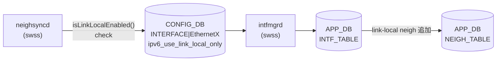

# IPv6 Link-local モード

## 概要

`ipv6_use_link_local_only` フィールドは `INTERFACE` / `PORTCHANNEL_INTERFACE` / `VLAN_INTERFACE` テーブルの属性ロウに共通して存在し、対象インターフェースで IPv6 link-local アドレス自動生成 (EUI-64) を有効にする[^1]。

有効化すると、手動でグローバル IPv6 アドレスを設定しない場合でも `FE80::/64` の link-local アドレスが自動生成される。BGP unnumbered ピアリング (RFC 5549) や ICMPv6 近隣探索 (NDP) を利用する IPv6 データセンターネットワークで使われる。

<!-- cdb-mermaid -->
### データフロー



!!! note "凡例"
    CONFIG_DB から APP_DB までの経路。SAI への転送は `ipv6_use_link_local_only` フィールド自体では発生しない (orchagent は本フィールドを SAI に転送しない)。
<!-- /cdb-mermaid -->

## key 構造

```text
INTERFACE|<name>                    # 属性ロウ (Ethernet ポート)
PORTCHANNEL_INTERFACE|<name>        # 属性ロウ (PortChannel)
VLAN_INTERFACE|<name>               # 属性ロウ (VLAN)
```

`ipv6_use_link_local_only` は属性ロウ (IP プレフィクスロウではなく) に格納される。

## フィールド

| フィールド | 型 | YANG default | 説明 |
|-----------|----|-------------|------|
| `ipv6_use_link_local_only` | `mode-status` (`enable`/`disable`) | `disable` | IPv6 link-local アドレス自動生成の on/off |

`mode-status` 型は `sonic-types.yang` で定義: `enum enable | enum disable`。

<!-- defaults -->
## フィールド暗黙デフォルト (Phase A — コード由来)

YANG `default disable` はスキーマ上の宣言であり、DB エントリ自体がない場合のランタイム fallback はコードで決まる。

### `ipv6_use_link_local_only`

| 状況 | 挙動 | コード根拠 |
|------|------|-----------|
| CONFIG_DB にフィールドなし (エントリ自体存在) | `intfmgr` は APP_DB に書かない (silent skip) | `intfmgr.cpp:L913` `if (!ipv6_link_local_mode.empty())` |
| CONFIG_DB にフィールドなし (エントリも存在しない) | `neighsync` は `m_cfgInterfaceTable.get()` が false → link-local neigh を無視 | `neighsync.cpp:L215-219` |
| `"disable"` を明示設定し他属性なし | `mod_entry` でなく `set_entry(None)` → **エントリごと CONFIG_DB から削除** | `config/main.py:L9484` |
| `"disable"` を明示設定し他属性あり (VRF/IP) | `mod_entry` で `"disable"` を書く (エントリは残る) | `config/main.py:L9482` |
| `"enable"` 設定後 DEL_COMMAND | `m_ipv6LinkLocalModeList.erase()` + `delIpv6LinkLocalNeigh()` で link-local neigh 自動削除 | `intfmgr.cpp:L1081-1086` |
| warm restart 後 | `m_ipv6LinkLocalModeList` がリセットされ CONFIG_DB replay で再 insert される | `intfmgr.cpp:L917` |

**HLD との乖離**: HLD (doc/ipv6/ipv6_link_local.md) は APP_DB にも `"disable"` が書かれると示唆するが、実装ではフィールドが空の場合は APP_DB への書き込みをスキップする。

**orchagent (dead consumer)**: IntfsOrch は APP_DB の `ipv6_use_link_local_only` フィールドを受け取っても SAI に転送しない。IPv6 link-local 自体は Linux カーネルの IPv6 スタックと intfmgr の sysctl 制御で実現するため、SAI 側の RIF 属性変更は不要。

**neighsync の silent drop パターン**:
- `Ethernet` / `PortChannel` / `Vlan` で始まらないインターフェース名 (例: `eth0`, `lo`, `docker0`) → `isLinkLocalEnabled()` が即 `false` 返却
- 値が `"enable"` 以外 (`"disable"` 含む) → `false` 返却 → link-local neigh は APP_DB に登録されない
- 属性ロウのエントリ自体が CONFIG_DB に存在しない → `false` → 同様に登録しない

**重複設定の no-op**: `set_ipv6_link_local_only_on_interface()` は `curr_mode == mode` の場合 early return する。未設定に `"disable"` を設定した場合も no-op になる。

<!-- /defaults -->

<!-- ordering -->
## 書込み順依存 (Phase B)

`intfmgrd` は CONFIG_DB の `INTERFACE` / `PORTCHANNEL_INTERFACE` / `VLAN_INTERFACE` テーブルを購読し、`ipv6_use_link_local_only` フィールドを APP_DB に転送する。この転送はインターフェースの STATE_DB 状態に依存するため、いくつかの順序依存が存在する。

### 検出された順序依存

| # | 依存関係 | 方向 | 緩和策 |
|---|----------|------|--------|
| 1 | STATE_DB インターフェース state OK → APP_DB 転送 | **強制先行**（未 OK 時は skip）| `intfmgrd` が自動再キューし、インターフェース UP 後に自然反映 |
| 2 | VRF STATE_DB エントリ存在 → VRF バインド済みインターフェースへの設定 | 条件付き先行（VRF 未 ready 時は skip）| VRF 作成後に設定するか、自動再キューを利用 |
| 3 | CONFIG_DB 書込み → `neighsyncd` の neigh フィルタリング | CONFIG_DB が正 source（APP_DB 転送完了を待たない） | APP_DB 転送前でも `neighsyncd` は CONFIG_DB を直接参照する |
| 4 | CONFIG_DB への `"disable"` 書込み → NEIGH_TABLE 即時削除 | 同期的（同一イベント処理内） | `"disable"` 後の link-local neigh は即時消えることを考慮 |

### 主要な制約詳細

**インターフェース state 先行必須 (依存 #1)**: `intfmgr.cpp:L833-837` で `isIntfStateOk()` が `false` を返す間、`intfmgrd` はイベント処理を `return false` で再キューし続ける。`isIntfStateOk()` のチェック先は インターフェース種別で異なり: `Ethernet*` → `STATE_PORT_TABLE`（`state` フィールドあり）、`PortChannel*` → `STATE_LAG_TABLE`、`Vlan*` → `STATE_VLAN_TABLE`。起動直後やインターフェース初期化中は CONFIG_DB への書込みが先行しても APP_DB への転送は自動的に遅延される（evidence: `intfmgr.cpp:831-837`, `intfmgr.cpp:649-708`）。

**VRF バインド時の追加チェック (依存 #2)**: インターフェースが VRF に所属する場合、`intfmgr.cpp:L839-843` で VRF の `STATE_VRF_TABLE` エントリも確認する。VRF が未作成の状態で `ipv6_use_link_local_only` を設定しても APP_DB 転送がスキップされる。実運用では VRF 作成（`VRF|<name>` → `vrfmgrd` → STATE_VRF_TABLE）後にインターフェース属性を設定することが推奨される（evidence: `intfmgr.cpp:839-843`）。

**neighsyncd の CONFIG_DB 直接参照 (依存 #3)**: `neighsync.cpp` の `isLinkLocalEnabled()` は APP_DB ではなく CONFIG_DB を直接参照する（`m_cfgInterfaceTable.get()` / `m_cfgVlanInterfaceTable.get()` / `m_cfgLagInterfaceTable.get()`）。このため `intfmgrd` による APP_DB 転送が完了していなくても、CONFIG_DB に `"enable"` が書かれた時点から link-local neigh の NEIGH_TABLE への書込みが始まる。CONFIG_DB が削除されると即座にフィルタアウトされる（evidence: `neighsync.cpp:193-239`）。

**disable 時の即時 neigh 削除 (依存 #4)**: `intfmgrd` が `"disable"` イベントを受け取ると、`m_ipv6LinkLocalModeList.erase(alias)` と `delIpv6LinkLocalNeigh(alias)` を同一処理内で同期的に実行する。この削除は CONFIG_DB イベント受信時に即時トリガーされる。`"disable"` 書込みと APP_DB NEIGH_TABLE 削除は実質的に同時であるため、運用変更時には接続中の BGP unnumbered セッションへの影響を考慮すること（evidence: `intfmgr.cpp:920-923`）。

<!-- /ordering -->

<!-- cross-refs -->
## 横断リファレンス (Phase C)

`ipv6_use_link_local_only` フィールドはインターフェース系 3 テーブルで共有され、複数の swss daemon・CLI・YANG モジュールから参照される。

### 参照マップ

| 種別 | 識別子 | 参照位置 | 役割 |
|------|--------|----------|------|
| CONFIG_DB | `INTERFACE` (属性ロウ) | `cfgmgr/intfmgr.cpp:817-820` | Ethernet 系の一次格納 |
| CONFIG_DB | `PORTCHANNEL_INTERFACE` | 同上 (共通 parser) | PortChannel 系の一次格納 |
| CONFIG_DB | `VLAN_INTERFACE` | 同上 (共通 parser) | VLAN 系の一次格納 |
| CONFIG_DB | `PORT` / `PORTCHANNEL` / `VLAN` | `show/main.py:1611-1623` | `show ipv6 link-local-mode` の母集合 |
| STATE_DB | `PORT_TABLE` / `LAG_TABLE` / `VLAN_TABLE` | `intfmgr.cpp:833-837` (`isIntfStateOk`) | APP_DB 転送の gating (Phase B 既述) |
| STATE_DB | `VRF_TABLE` | `intfmgr.cpp:839-843` | VRF バインド時の gating (Phase B 既述) |
| APP_DB | `INTF_TABLE` | `intfmgr.cpp:926` (`fvTuple`) | `"enable"` 時に転送、ただし orchagent は dead consumer |
| APP_DB | `NEIGH_TABLE` | `neighsyncd/neighsync.cpp:227` | link-local neigh 登録時のフィルタキー |
| daemon | `intfmgrd` | `cfgmgr/intfmgr.cpp` | CONFIG_DB → APP_DB 転送と `m_ipv6LinkLocalModeList` 管理 |
| daemon | `neighsyncd` | `neighsync.cpp:193-239` | **CONFIG_DB を直接参照** (APP_DB 経由ではない) |
| daemon | `orchagent` IntfsOrch | `orchagent/intfsorch.cpp` | APP_DB を購読するが本フィールドを SAI 転送しない (dead consumer) |
| CLI (config) | `config interface ipv6 enable/disable use-link-local-only` | `config/main.py:L9462-L9484` | 個別 IF への書込み、テーブルは `get_interface_table_name()` で判別 |
| CLI (config) | `config ipv6 enable/disable link-local` | `config/main.py` (`enable_ipv6_link_local_all` 系) | 全 IF 一括、VLAN/PortChannel member は除外 |
| CLI (show) | `show ipv6 link-local-mode` | `show/main.py:1611-1630` | `PORT`/`PORTCHANNEL`/`VLAN` と INTERFACE 属性ロウの join 表示 |
| YANG | `sonic-interface:INTERFACE_LIST/ipv6_use_link_local_only` | `sonic-interface.yang:95-99` | スキーマ宣言、`default disable` |
| YANG | `sonic-portchannel-interface` / `sonic-vlan-interface` | 同様の leaf | PortChannel / VLAN 用 |
| YANG 型 | `sonic-types:mode-status` | `sonic-types.yang` | `enum enable` / `enum disable` |

### 整合性メモ

- **三テーブル共有**: `INTERFACE` / `PORTCHANNEL_INTERFACE` / `VLAN_INTERFACE` はフィールド名・型・semantics が完全に同一で、`intfmgr.cpp` の `doIntfGeneralTask()` が共通 parser で処理する。CLI レイヤだけが `get_interface_table_name(interface_name)` で書き分ける
- **APP_DB は dead path**: `intfmgr` は `INTF_TABLE` に `ipv6_use_link_local_only` を転送するが、orchagent IntfsOrch は受信しても SAI に渡さない。実効的な依存先は `neighsyncd` であり、しかも `neighsyncd` は CONFIG_DB を直接参照するため APP_DB の値変更は実質的に観測者がいない
- **`show` 母集合の非対称**: `show ipv6 link-local-mode` は PORT / PORTCHANNEL / VLAN を全件走査し、INTERFACE 属性ロウが欠如するポートを `Disabled` 表示する。属性ロウ削除と `"disable"` 設定はランタイム上区別されない (Phase A の "disable は属性ロウ自体を削除する" 挙動と整合)
- **YANG default と実装の役割分担**: YANG `default disable` はスキーマ宣言上の値で、`intfmgr` のフィールド欠如時 fallback (APP_DB に書かない) とは別レイヤ。YANG validation を通った絶対無設定状態でも `intfmgrd` は何もしない

<!-- /cross-refs -->

<!-- failure -->
## 失敗挙動 (Phase D)

> 調査証跡: `meta/_intermediate/cdb-flow/ipv6-link-local-failure.md`

<!-- evidence: sonic-swss/cfgmgr/intfmgr.cpp:712-740,832-843, sonic-swss/neighsyncd/neighsync.cpp:93-110,193-243 -->

`ipv6_use_link_local_only` フィールドに関連する失敗シナリオは、CONFIG_DB への書込みが APP_DB に転送されない silent-skip 系と、近傍エントリ操作コマンドの失敗を無視する系に大別される。

### 失敗シナリオ一覧

| # | 失敗トリガー | 影響コンポーネント | 挙動 | ログレベル | 再試行 |
|---|------------|-----------------|------|-----------|--------|
| 1 | インターフェースが `STATE_DB` に未登録（起動直後・初期化中） | `intfmgrd` | CONFIG_DB SET を `return false` で再キュー、APP_DB への転送スキップ | `SWSS_LOG_DEBUG`（不可視） | 自動（インターフェース ready 後に再処理） |
| 2 | VRF が `STATE_VRF_TABLE` に未登録 | `intfmgrd` | 同様に `return false` で再キュー | `SWSS_LOG_DEBUG`（不可視） | 自動（VRF ready 後に再処理） |
| 3 | `disable` 時の `ip neigh del` コマンド失敗 | `intfmgrd` `delIpv6LinkLocalNeigh()` | `swss::exec()` の戻り値を無視して続行、カーネルの近傍エントリが残存する可能性 | `SWSS_LOG_INFO` のみ | なし |
| 4 | CONFIG_DB テーブル `.get()` 失敗（エントリ不在 / DB 一時障害） | `neighsyncd` `isLinkLocalEnabled()` | `false` 返却 → link-local neigh ADD を silent drop | `SWSS_LOG_INFO` のみ | なし（次の neigh イベント発生時に再評価） |
| 5 | サポート外インターフェース種別（`eth0`, `lo`, `docker0` 等） | `neighsyncd` `isLinkLocalEnabled()` | `false` 返却 → link-local neigh を無条件無視 | `SWSS_LOG_INFO` のみ | なし |

### 詳細

#### 1 & 2. インターフェース / VRF 未 ready による再キュー

`intfmgr.cpp:832-843` の冒頭ゲートでは、インターフェース（`STATE_PORT_TABLE` / `STATE_LAG_TABLE` / `STATE_VLAN_TABLE`）および VRF（`STATE_VRF_TABLE`）の両方が ready である必要がある。どちらかが未登録の場合 `return false` となり、swss ConsumerStateTable の再キューメカニズムで自動リトライされる。

この挙動自体は意図的な設計だが、**`SWSS_LOG_DEBUG` レベル**のためデフォルト設定では出力されない。`ipv6_use_link_local_only=enable` を設定してもすぐに効果が現れない場合、インターフェース初期化遅延が原因である可能性がある。

#### 3. `delIpv6LinkLocalNeigh()` — `ip neigh del` 失敗の無視

`disable` イベント受信時、`intfmgrd` は `delIpv6LinkLocalNeigh()` を呼び出して APP_DB `NEIGH_TABLE` の link-local エントリを `ip neigh del` コマンド経由で削除する。しかし `swss::exec()` の戻り値をチェックしていないため (`intfmgr.cpp:733`)、コマンドが失敗してもカーネルの近傍キャッシュにエントリが残存する。残存した link-local neigh は NDP タイムアウト（通常数十秒〜数分）まで有効のままとなる。

#### 4. `neighsyncd` の CONFIG_DB 参照失敗

`neighsyncd` は link-local neigh の ADD イベント処理時に `isLinkLocalEnabled()` を呼び CONFIG_DB を直接参照する (`neighsync.cpp:193-243`)。この参照が失敗した場合（エントリが存在しない、または一時的な DB 接続障害）、`false` を返して neigh ADD を無視する。この挙動はフィルタリング（意図的無視）と障害（意図しない無視）を区別できないため、link-local neigh が学習されない場合のデバッグを困難にする。

#### 5. サポート外インターフェース種別の silent drop

`isLinkLocalEnabled()` は `Ethernet` / `Vlan` / `PortChannel` で始まるインターフェース名のみを処理する (`neighsync.cpp:198-226`)。これ以外（`eth0`、`lo`、管理 OOB ポート等）は実装上サポートされておらず、CONFIG_DB に設定が存在しても link-local neigh は一切 APP_DB に登録されない。エラーログは `SWSS_LOG_INFO` レベルのみ。

!!! note "観測手段"
    失敗シナリオ 1・2 は `swssconfig -d` で DEBUG ログを有効化すると `intfmgrd` のログに現れる。シナリオ 3〜5 は `SWSS_LOG_INFO` レベルのため `swssconfig -a INFO` 以上が必要。

<!-- /failure -->

<!-- constants -->
## ハードコード定数 (Phase E)

> 調査対象: `sonic-swss/cfgmgr/intfmgr.cpp` L712-740, L817-926, L1272-1280; `sonic-swss/neighsyncd/neighsync.cpp` L193-243; `sonic-utilities/config/main.py` L9451-9484
> 調査日: 2026-05-19

### フィールド名・値文字列リテラル

| 種別 | 値 | 用途 | ソース |
|------|-----|------|--------|
| フィールド名 | `"ipv6_use_link_local_only"` | CONFIG_DB フィールド名。`intfmgr.cpp` が parse し APP_DB fvTuple に転送。`neighsync.cpp` が検索キーとして使用。CLI が `mod_entry` / `get_entry` に指定 | intfmgr.cpp:817,926; neighsync.cpp:227; config/main.py:9453 |
| 有効値 | `"enable"` | link-local 有効化値。`== "enable"` リテラル比較で判定 | intfmgr.cpp:915; neighsync.cpp:230; config/main.py:9461 |
| 無効値 | `"disable"` | link-local 無効化値。YANG `default disable` と一致 | intfmgr.cpp:920; config/main.py:9482 |

### インターフェース名プレフィクス (neighsync.cpp:197-222)

`isLinkLocalEnabled()` はインターフェース名プレフィクスで参照先 CONFIG_DB テーブルを振り分ける。

| プレフィクス文字列 | 参照テーブル | サポート状況 |
|---|---|---|
| `"Vlan"` | `VLAN_INTERFACE` | supported |
| `"PortChannel"` | `PORTCHANNEL_INTERFACE` | supported |
| `"Ethernet"` | `INTERFACE` | supported |
| 上記以外 (`eth0`, `lo`, `docker0` 等) | — | **non-supported → `false` 返却** |

プレフィクス比較は `std::string::compare(0, strlen("<prefix>"), "<prefix>")` のリテラルマッチ。サブインターフェース (`Ethernet0.10`) は `"Ethernet"` にマッチするため `INTERFACE` テーブルを参照する。

### アドレス判定定数 (intfmgr.cpp:727)

`delIpv6LinkLocalNeigh()` は `IpAddress::AddrScope::LINK_SCOPE` で近傍エントリが link-local (FE80::/10) か判定する。このスコープ定数は `swsscommon` の `IpAddress` クラスで定義されており、`ip neigh del` 対象を link-local のみに限定する。

### sysctl キー (intfmgr.cpp:1276)

`enableIpv6Flag()` はインターフェースの IPv6 を有効化する際に以下の sysctl を実行する。

| sysctl パラメータ | 設定値 | 用途 |
|---|---|---|
| `net.ipv6.conf.<alias>.disable_ipv6` | `0` | IPv6 無効状態のインターフェースを再有効化 |

パラメータ名はコードに直接リテラルとして埋め込まれている（CONFIG_DB / YANG 管理外）。

### YANG スキーマ定数

| 定数 | 値 | ソース |
|------|-----|--------|
| `default` | `disable` | `sonic-interface.yang:99` |
| 型 | `stypes:mode-status` = `enum enable \| enum disable` | `sonic-types.yang` |

詳細は `meta/_intermediate/cdb-flow/ipv6-link-local-constants.md` を参照。
<!-- /constants -->

<!-- side-effects -->
## 副次 DB 書込 (Phase F)

`ipv6_use_link_local_only` フィールドへの SET/DEL を受けた `intfmgrd` は CONFIG_DB 以外に **APP_DB と STATE_DB** へ副次書込を行う。詳細スキャンノート: [`meta/_intermediate/cdb-flow/ipv6-link-local-side-effects.md`](https://github.com/aoki-taquan/sonic-unofficial-docs/blob/main/meta/_intermediate/cdb-flow/ipv6-link-local-side-effects.md)。

### APP_DB への書込

| タイミング | テーブル | キー | フィールド | 値 | evidence |
|-----------|---------|------|-----------|-----|---------|
| SET (enable/disable) | `APP_DB / INTF_TABLE` | `INTF_TABLE\|<interface_name>` | `ipv6_use_link_local_only` | `"enable"` / `"disable"` | `intfmgr.cpp:926, 1053` |

`intfmgrd` の `doIntfGeneralTask()` は `ipv6_use_link_local_only` フィールドを他の INTF_TABLE フィールドと合わせて `m_appIntfTableProducer.set()` で APP_DB に書き込む。

確認コマンド:
```bash
sonic-db-cli APPL_DB hgetall 'INTF_TABLE|Ethernet0'
```

### STATE_DB への書込

| タイミング | テーブル | キー | フィールド | 値 | evidence |
|-----------|---------|------|-----------|-----|---------|
| SET 処理完了時 | `STATE_DB / INTERFACE_TABLE` | `<interface_name>` | `vrf` | VRF 名 (デフォルト: `""`) | `intfmgr.cpp:1054` |
| DEL 処理時 | `STATE_DB / INTERFACE_TABLE` | `<interface_name>` | — | エントリ削除 | `intfmgr.cpp:1089` |

STATE_DB への書込はインタフェース設定処理全体の一部であり、`ipv6_use_link_local_only` フィールド単体の変更に限らず SET 操作全体で実行される。

### カーネル操作（DB 書込なし）

disable 時に `delIpv6LinkLocalNeigh()` が呼ばれ、NEIGH_TABLE (APP_DB) から FE80::/64 スコープのネイバーエントリを検索し `ip neigh del` コマンドでカーネルの近隣テーブルから削除する（`intfmgr.cpp:712-738`）。DB への書込は行われないが、カーネル操作によって neighsyncd が NEIGH_TABLE を更新する可能性がある。

### ASIC_DB への影響

APP_DB.INTF_TABLE の `ipv6_use_link_local_only` フィールドは IntfsOrch (orchagent) が購読するが、このフィールドは SAI API に転送しないため **ASIC_DB への書込は発生しない**（dead consumer、HLD なし）。

### 副次書込サマリ

| 副次 DB | テーブル | トリガ | 書込主体 |
|---------|---------|--------|---------|
| APP_DB | `INTF_TABLE` | SET (enable / disable) | intfmgrd |
| STATE_DB | `INTERFACE_TABLE` | SET 処理完了時 | intfmgrd |
| カーネル | 近隣テーブル | disable 時 | intfmgrd (`ip neigh del`) |
<!-- /side-effects -->

<!-- pubsub -->
## 通信メカニズム (Phase G)

`ipv6_use_link_local_only` フィールド周辺の Pub/Sub・通知経路を `intfmgrd.cpp` / `intfmgr.cpp` / `neighsync.cpp` から抽出した結果。

### CONFIG_DB → IntfMgr (ConsumerStateTable)

`intfmgrd` は起動時に以下のテーブルリストを `IntfMgr` コンストラクタに渡す（`intfmgrd.cpp:28-35`）:

```cpp
CFG_INTF_TABLE_NAME,           // "INTERFACE"
CFG_LAG_INTF_TABLE_NAME,       // "PORTCHANNEL_INTERFACE"
CFG_VLAN_INTF_TABLE_NAME,      // "VLAN_INTERFACE"
CFG_LOOPBACK_INTERFACE_TABLE_NAME,
CFG_VLAN_SUB_INTF_TABLE_NAME,
CFG_VOQ_INBAND_INTERFACE_TABLE_NAME,
```

`IntfMgr` は `Orch(cfgDb, tableNames)` を継承するため、Orch 基底クラスが各テーブルを `ConsumerStateTable`（Redis keyspace notification）でラップして `Executor` に登録する。`ipv6_use_link_local_only` フィールドへの `HSET`/`DEL` が INTERFACE / PORTCHANNEL_INTERFACE / VLAN_INTERFACE テーブルで発生すると `doIntfGeneralTask()` が駆動される。明示的な `PUBLISH` コマンドは不要で、CONFIG_DB への書き込み自体がトリガとなる。

### IntfMgr → APPL_DB (ProducerStateTable)

`IntfMgr` コンストラクタで `ProducerStateTable` を宣言する（`intfmgr.cpp:42`）:

```cpp
m_appIntfTableProducer(appDb, APP_INTF_TABLE_NAME)
```

SET 処理内（`intfmgr.cpp:1053`）で `m_appIntfTableProducer.set(alias, data)` により `INTF_TABLE|<ifname>` に `ipv6_use_link_local_only` フィールドを書き込む。DEL 時は `m_appIntfTableProducer.del(alias)`（`intfmgr.cpp:1088`）。

`IntfsOrch`（orchagent）は `APP_INTF_TABLE_NAME` を `ConsumerStateTable` で購読するが、`ipv6_use_link_local_only` フィールドを SAI に転送しないため **dead consumer** となる。

### neighsyncd — CONFIG_DB 直接参照 (Table::get, 購読なし)

`neighsync.cpp:25-27` で `Table` オブジェクト（SubscriberStateTable ではない）を宣言し、イベント駆動でなくポイントインタイム参照を行う:

```cpp
m_cfgInterfaceTable(cfgDb, CFG_INTF_TABLE_NAME),
m_cfgLagInterfaceTable(cfgDb, CFG_LAG_INTF_TABLE_NAME),
m_cfgVlanInterfaceTable(cfgDb, CFG_VLAN_INTF_TABLE_NAME),
```

`isLinkLocalEnabled()` は netlink `RTM_NEWNEIGH` / `RTM_DELNEIGH` イベント受信時に呼ばれ、CONFIG_DB を同期的に `get()` する。これにより `intfmgrd` の APP_DB 転送完了を待たずに CONFIG_DB 書き込みの瞬間からフィルタリングが有効になる（Phase B 依存 #3 で既述）。

### 通信フロー概要

```mermaid
flowchart TD
  CLI["config interface ipv6\n(CLI)"] -->|HSET| CDB[("CONFIG_DB\nINTERFACE / PORTCHANNEL_INTERFACE\n/ VLAN_INTERFACE")]
  CDB -->|ConsumerStateTable\n(keyspace notification)| IntfMgr["IntfMgrd\n(swss)"]
  IntfMgr -->|ProducerStateTable| APPL[("APPL_DB\nINTF_TABLE\|<ifname>")]
  APPL -->|ConsumerStateTable| IntfsOrch["IntfsOrch\n(orchagent)\n※dead consumer"]

  kernel["Linux kernel\nnetlink RTM_NEWNEIGH"] -->|rtnetlink socket| neighsyncd["neighsyncd\n(swss)"]
  CDB -->|Table::get\n(直接参照)| neighsyncd
  neighsyncd -->|ProducerStateTable\n(link-local enabled 時のみ)| NEIGH[("APPL_DB\nNEIGH_TABLE")]
  NEIGH -->|ConsumerStateTable| NeighOrch["NeighOrch\n(orchagent)"]
```

### チャンネル種別まとめ

| Publisher | チャンネル種別 | テーブル | Subscriber | 備考 |
|-----------|-------------|---------|------------|------|
| CLI / minigraph | ConsumerStateTable (Orch 継承) | `CONFIG_DB INTERFACE\|<name>` 等 | IntfMgrd | `HSET` トリガ |
| IntfMgrd | ProducerStateTable | `APPL_DB INTF_TABLE\|<name>` | IntfsOrch | dead consumer（SAI 転送なし） |
| kernel netlink | rtnetlink `RTM_NEWNEIGH` | — | neighsyncd | DB pubsub 外 |
| neighsyncd | Table::get（直接参照） | `CONFIG_DB INTERFACE / PORTCHANNEL_INTERFACE / VLAN_INTERFACE` | — | 購読チャンネルなし、同期参照 |
| neighsyncd | ProducerStateTable | `APPL_DB NEIGH_TABLE\|<intf>:<ip>` | NeighOrch | link-local enabled 時のみ ADD |

> `ipv6_use_link_local_only` の処理経路に Redis `PUBLISH` コマンドや `Notifier` 機構は使用されていない。すべてのトリガは ConsumerStateTable（keyspace notification）または netlink イベントによる。

<!-- /pubsub -->

<!-- platform -->
## プラットフォーム差 (Phase H)

`ipv6_use_link_local_only` の処理経路は **全プラットフォームで同一**。`cfgmgr/intfmgr.cpp`・`neighsyncd/neighsync.cpp`・`sonic-interface.yang` をプラットフォーム識別キーワード (`multi_asic|is_multi_npu|chassis|asic[0-9]|namespace|platform|vendor|broadcom|mellanox|barefoot|cisco`) で検索してもヒット 0 件であり、機種依存コードが存在しない。

### intfmgrd は per-asic スコープではない (host 単一インスタンス)

`intfmgrd.cpp` はシングルインスタンスで起動し、複数 ASIC 構成でも追加インスタンスを持たない。`INTERFACE` / `PORTCHANNEL_INTERFACE` / `VLAN_INTERFACE` テーブルは host namespace の CONFIG_DB のみに存在し、`asic0..N` の Redis には複製されない。

| 構成 | 挙動 |
|------|------|
| single-asic | intfmgrd が 1 インスタンス、host CONFIG_DB を購読 |
| multi-asic (VOQ chassis 含む) | intfmgrd は host 側で 1 インスタンスのみ起動。各 asic namespace の CONFIG_DB には `INTERFACE` テーブルが存在せず、per-asic intfmgrd インスタンスも起動しない |
| Virtual Switch (VS) | 挙動は real ASIC と同一。sysctl は実行されるが Linux カーネルの動作に依存 |

### Linux sysctl 依存（カーネルドライバ不問）

`enableIpv6Flag()` が実行する `net.ipv6.conf.<alias>.disable_ipv6 = 0` は Linux カーネルの IPv6 スタック制御であり、ASIC / SAI ドライバとは独立している。SAI API の呼び出しは一切なく、ASIC_DB への書込も発生しない（dead consumer の確認は Phase G 済み）。このため、Broadcom / Mellanox / Barefoot / Cisco など ASIC 種別を問わず動作は一定である。

### neighsyncd の動作もプラットフォーム不問

`neighsync.cpp` の `isLinkLocalEnabled()` はプレフィクス文字列比較と CONFIG_DB 直接参照のみで構成されており（Phase E 定数表参照）、platform 定数・vendor フラグ・capability クエリを一切参照しない。link-local neigh の学習有効/無効判定は CONFIG_DB 値のみで決まる。

### 差異が残る唯一の領域（インターフェース名種別）

Phase E で示したインターフェース名プレフィクス (`Ethernet` / `PortChannel` / `Vlan`) によるテーブル振り分けは、特定 ASIC 機種固有ではなくインターフェース命名規則依存である。スマートスイッチ / DPU などで異なるプレフィクス名を持つインターフェース (`dpu0` 等) が登場した場合、`isLinkLocalEnabled()` が `false` を返して link-local neigh を無視するが、これはプラットフォーム分岐ではなく未サポートインターフェース種別として Phase D (#5) で既述。
<!-- /platform -->

## 購読者

| コンポーネント | 役割 | テーブル |
|--------------|------|---------|
| `intfmgrd` (swss) | CONFIG_DB を購読し `m_ipv6LinkLocalModeList` を更新、APP_DB に転送 | INTERFACE / PORTCHANNEL_INTERFACE / VLAN_INTERFACE |
| `neighsyncd` (swss) | link-local neigh の ADD/DEL 時に `isLinkLocalEnabled()` を参照し、無効なら NEIGH_TABLE への書き込みをスキップ | CONFIG_DB 直接参照 |
| `orchagent` IntfsOrch | APP_DB `INTF_TABLE` を購読するが `ipv6_use_link_local_only` は SAI に転送しない (dead consumer) | APP_DB |

## CLI

```bash
# 個別インターフェースに設定
config interface ipv6 enable use-link-local-only Ethernet0
config interface ipv6 disable use-link-local-only Ethernet0

# 全インターフェースに一括設定 (VLAN member / PortChannel member は除外)
config ipv6 enable link-local
config ipv6 disable link-local

# 確認
show ipv6 link-local-mode
```

`config ipv6 enable link-local` は VLAN member ポートおよび PortChannel member ポートを自動スキップする。Loopback (`lo`) と OOB (`eth0`) は対象外。

`show ipv6 link-local-mode` は PORT / PORTCHANNEL / VLAN テーブルを基準に表示するため、Loopback は表示されない。INTERFACE エントリが存在しないポートは `Disabled` 表示。

## 関連制約

- VLAN member として登録されたポートへの `enable` は CLI で拒否される (明示エラー)
- PortChannel member として登録されたポートへの `enable` は CLI で拒否される (明示エラー)
- `use-link-local-only` が有効なポートを VLAN member として登録しようとすると拒否される ("is a router interface" エラー)

## 関連 CONFIG_DB / YANG / CLI

- 関連 [CONFIG_DB](../../reference/glossary.md#term-config_db): `INTERFACE`、`PORTCHANNEL_INTERFACE`、`VLAN_INTERFACE`
- 関連 CLI: `config interface ipv6 enable/disable use-link-local-only`、`config ipv6 enable/disable link-local`
- 関連 [YANG](../../reference/glossary.md#term-yang): `sonic-interface`、`sonic-portchannel`、`sonic-vlan`

<!-- ref-triangle:start -->

## 関連リファレンス

- [YANG](../../reference/glossary.md#term-yang): [`sonic-interface`](../yang/sonic-interface.md)
- [CONFIG_DB](../../reference/glossary.md#term-config_db): [INTERFACE テーブル](interface.md)

<!-- ref-triangle:end -->

## 引用元

[^1]: YANG 定義: `sonic-interface.yang` L95-99. <https://github.com/sonic-net/sonic-buildimage/blob/9ea932ec2e18f35e58268ec2e4456b1d4afd65cd/src/sonic-yang-models/yang-models/sonic-interface.yang>

## 関連ページ
- [CONFIG_DB index](index.md)
- [INTERFACE テーブル](interface.md)
