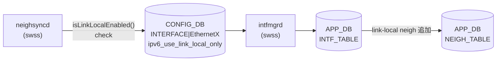

# IPv6 Link-local モード

## 概要

`ipv6_use_link_local_only` フィールドは `INTERFACE` / `PORTCHANNEL_INTERFACE` / `VLAN_INTERFACE` テーブルの属性ロウに共通して存在し、対象インターフェースで IPv6 link-local アドレス自動生成 (EUI-64) を有効にする[^1]。

有効化すると、手動でグローバル IPv6 アドレスを設定しない場合でも `FE80::/64` の link-local アドレスが自動生成される。BGP unnumbered ピアリング (RFC 5549) や ICMPv6 近隣探索 (NDP) を利用する IPv6 データセンターネットワークで使われる。

<!-- cdb-mermaid -->
### データフロー



!!! note "凡例"
    CONFIG_DB から APP_DB までの経路。SAI への転送は `ipv6_use_link_local_only` フィールド自体では発生しない (orchagent は本フィールドを SAI に転送しない)。
<!-- /cdb-mermaid -->

## key 構造

```text
INTERFACE|<name>                    # 属性ロウ (Ethernet ポート)
PORTCHANNEL_INTERFACE|<name>        # 属性ロウ (PortChannel)
VLAN_INTERFACE|<name>               # 属性ロウ (VLAN)
```

`ipv6_use_link_local_only` は属性ロウ (IP プレフィクスロウではなく) に格納される。

## フィールド

| フィールド | 型 | YANG default | 説明 |
|-----------|----|-------------|------|
| `ipv6_use_link_local_only` | `mode-status` (`enable`/`disable`) | `disable` | IPv6 link-local アドレス自動生成の on/off |

`mode-status` 型は `sonic-types.yang` で定義: `enum enable | enum disable`。

<!-- defaults -->
## フィールド暗黙デフォルト (Phase A — コード由来)

YANG `default disable` はスキーマ上の宣言であり、DB エントリ自体がない場合のランタイム fallback はコードで決まる。

### `ipv6_use_link_local_only`

| 状況 | 挙動 | コード根拠 |
|------|------|-----------|
| CONFIG_DB にフィールドなし (エントリ自体存在) | `intfmgr` は APP_DB に書かない (silent skip) | `intfmgr.cpp:L913` `if (!ipv6_link_local_mode.empty())` |
| CONFIG_DB にフィールドなし (エントリも存在しない) | `neighsync` は `m_cfgInterfaceTable.get()` が false → link-local neigh を無視 | `neighsync.cpp:L215-219` |
| `"disable"` を明示設定し他属性なし | `mod_entry` でなく `set_entry(None)` → **エントリごと CONFIG_DB から削除** | `config/main.py:L9484` |
| `"disable"` を明示設定し他属性あり (VRF/IP) | `mod_entry` で `"disable"` を書く (エントリは残る) | `config/main.py:L9482` |
| `"enable"` 設定後 DEL_COMMAND | `m_ipv6LinkLocalModeList.erase()` + `delIpv6LinkLocalNeigh()` で link-local neigh 自動削除 | `intfmgr.cpp:L1081-1086` |
| warm restart 後 | `m_ipv6LinkLocalModeList` がリセットされ CONFIG_DB replay で再 insert される | `intfmgr.cpp:L917` |

**HLD との乖離**: HLD (doc/ipv6/ipv6_link_local.md) は APP_DB にも `"disable"` が書かれると示唆するが、実装ではフィールドが空の場合は APP_DB への書き込みをスキップする。

**orchagent (dead consumer)**: IntfsOrch は APP_DB の `ipv6_use_link_local_only` フィールドを受け取っても SAI に転送しない。IPv6 link-local 自体は Linux カーネルの IPv6 スタックと intfmgr の sysctl 制御で実現するため、SAI 側の RIF 属性変更は不要。

**neighsync の silent drop パターン**:
- `Ethernet` / `PortChannel` / `Vlan` で始まらないインターフェース名 (例: `eth0`, `lo`, `docker0`) → `isLinkLocalEnabled()` が即 `false` 返却
- 値が `"enable"` 以外 (`"disable"` 含む) → `false` 返却 → link-local neigh は APP_DB に登録されない
- 属性ロウのエントリ自体が CONFIG_DB に存在しない → `false` → 同様に登録しない

**重複設定の no-op**: `set_ipv6_link_local_only_on_interface()` は `curr_mode == mode` の場合 early return する。未設定に `"disable"` を設定した場合も no-op になる。

<!-- /defaults -->

<!-- ordering -->
## 書込み順依存 (Phase B)

`intfmgrd` は CONFIG_DB の `INTERFACE` / `PORTCHANNEL_INTERFACE` / `VLAN_INTERFACE` テーブルを購読し、`ipv6_use_link_local_only` フィールドを APP_DB に転送する。この転送はインターフェースの STATE_DB 状態に依存するため、いくつかの順序依存が存在する。

### 検出された順序依存

| # | 依存関係 | 方向 | 緩和策 |
|---|----------|------|--------|
| 1 | STATE_DB インターフェース state OK → APP_DB 転送 | **強制先行**（未 OK 時は skip）| `intfmgrd` が自動再キューし、インターフェース UP 後に自然反映 |
| 2 | VRF STATE_DB エントリ存在 → VRF バインド済みインターフェースへの設定 | 条件付き先行（VRF 未 ready 時は skip）| VRF 作成後に設定するか、自動再キューを利用 |
| 3 | CONFIG_DB 書込み → `neighsyncd` の neigh フィルタリング | CONFIG_DB が正 source（APP_DB 転送完了を待たない） | APP_DB 転送前でも `neighsyncd` は CONFIG_DB を直接参照する |
| 4 | CONFIG_DB への `"disable"` 書込み → NEIGH_TABLE 即時削除 | 同期的（同一イベント処理内） | `"disable"` 後の link-local neigh は即時消えることを考慮 |

### 主要な制約詳細

**インターフェース state 先行必須 (依存 #1)**: `intfmgr.cpp:L833-837` で `isIntfStateOk()` が `false` を返す間、`intfmgrd` はイベント処理を `return false` で再キューし続ける。`isIntfStateOk()` のチェック先は インターフェース種別で異なり: `Ethernet*` → `STATE_PORT_TABLE`（`state` フィールドあり）、`PortChannel*` → `STATE_LAG_TABLE`、`Vlan*` → `STATE_VLAN_TABLE`。起動直後やインターフェース初期化中は CONFIG_DB への書込みが先行しても APP_DB への転送は自動的に遅延される（evidence: `intfmgr.cpp:831-837`, `intfmgr.cpp:649-708`）。

**VRF バインド時の追加チェック (依存 #2)**: インターフェースが VRF に所属する場合、`intfmgr.cpp:L839-843` で VRF の `STATE_VRF_TABLE` エントリも確認する。VRF が未作成の状態で `ipv6_use_link_local_only` を設定しても APP_DB 転送がスキップされる。実運用では VRF 作成（`VRF|<name>` → `vrfmgrd` → STATE_VRF_TABLE）後にインターフェース属性を設定することが推奨される（evidence: `intfmgr.cpp:839-843`）。

**neighsyncd の CONFIG_DB 直接参照 (依存 #3)**: `neighsync.cpp` の `isLinkLocalEnabled()` は APP_DB ではなく CONFIG_DB を直接参照する（`m_cfgInterfaceTable.get()` / `m_cfgVlanInterfaceTable.get()` / `m_cfgLagInterfaceTable.get()`）。このため `intfmgrd` による APP_DB 転送が完了していなくても、CONFIG_DB に `"enable"` が書かれた時点から link-local neigh の NEIGH_TABLE への書込みが始まる。CONFIG_DB が削除されると即座にフィルタアウトされる（evidence: `neighsync.cpp:193-239`）。

**disable 時の即時 neigh 削除 (依存 #4)**: `intfmgrd` が `"disable"` イベントを受け取ると、`m_ipv6LinkLocalModeList.erase(alias)` と `delIpv6LinkLocalNeigh(alias)` を同一処理内で同期的に実行する。この削除は CONFIG_DB イベント受信時に即時トリガーされる。`"disable"` 書込みと APP_DB NEIGH_TABLE 削除は実質的に同時であるため、運用変更時には接続中の BGP unnumbered セッションへの影響を考慮すること（evidence: `intfmgr.cpp:920-923`）。

<!-- /ordering -->

## 購読者

| コンポーネント | 役割 | テーブル |
|--------------|------|---------|
| `intfmgrd` (swss) | CONFIG_DB を購読し `m_ipv6LinkLocalModeList` を更新、APP_DB に転送 | INTERFACE / PORTCHANNEL_INTERFACE / VLAN_INTERFACE |
| `neighsyncd` (swss) | link-local neigh の ADD/DEL 時に `isLinkLocalEnabled()` を参照し、無効なら NEIGH_TABLE への書き込みをスキップ | CONFIG_DB 直接参照 |
| `orchagent` IntfsOrch | APP_DB `INTF_TABLE` を購読するが `ipv6_use_link_local_only` は SAI に転送しない (dead consumer) | APP_DB |

## CLI

```bash
# 個別インターフェースに設定
config interface ipv6 enable use-link-local-only Ethernet0
config interface ipv6 disable use-link-local-only Ethernet0

# 全インターフェースに一括設定 (VLAN member / PortChannel member は除外)
config ipv6 enable link-local
config ipv6 disable link-local

# 確認
show ipv6 link-local-mode
```

`config ipv6 enable link-local` は VLAN member ポートおよび PortChannel member ポートを自動スキップする。Loopback (`lo`) と OOB (`eth0`) は対象外。

`show ipv6 link-local-mode` は PORT / PORTCHANNEL / VLAN テーブルを基準に表示するため、Loopback は表示されない。INTERFACE エントリが存在しないポートは `Disabled` 表示。

## 関連制約

- VLAN member として登録されたポートへの `enable` は CLI で拒否される (明示エラー)
- PortChannel member として登録されたポートへの `enable` は CLI で拒否される (明示エラー)
- `use-link-local-only` が有効なポートを VLAN member として登録しようとすると拒否される ("is a router interface" エラー)

## 関連 CONFIG_DB / YANG / CLI

- 関連 [CONFIG_DB](../../reference/glossary.md#term-config_db): `INTERFACE`、`PORTCHANNEL_INTERFACE`、`VLAN_INTERFACE`
- 関連 CLI: `config interface ipv6 enable/disable use-link-local-only`、`config ipv6 enable/disable link-local`
- 関連 [YANG](../../reference/glossary.md#term-yang): `sonic-interface`、`sonic-portchannel`、`sonic-vlan`

<!-- ref-triangle:start -->

## 関連リファレンス

- [YANG](../../reference/glossary.md#term-yang): [`sonic-interface`](../yang/sonic-interface.md)
- [CONFIG_DB](../../reference/glossary.md#term-config_db): [INTERFACE テーブル](interface.md)

<!-- ref-triangle:end -->

## 引用元

[^1]: YANG 定義: `sonic-interface.yang` L95-99. <https://github.com/sonic-net/sonic-buildimage/blob/9ea932ec2e18f35e58268ec2e4456b1d4afd65cd/src/sonic-yang-models/yang-models/sonic-interface.yang>

## 関連ページ
- [CONFIG_DB index](index.md)
- [INTERFACE テーブル](interface.md)
