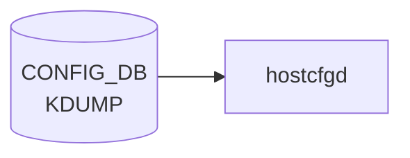

# KDUMP テーブル

## 概要

Linux kernel crash dump (kdump) の設定。`KDUMP|config` の単一 container[^1]。`hostcfgd` がこの container を購読し、`/etc/default/kdump-tools` の生成・`kdump-config` の起動を実施する。

<!-- cdb-mermaid -->
### データフロー (自動生成)



!!! note "凡例"
    CONFIG_DB から SAI までの典型経路を `docs/reference/config-db-orch-map.md` から機械生成したミニ図。詳細・例外は本ページ本文と対応表を参照。
<!-- /cdb-mermaid -->

## key 構造

```text
KDUMP|config
```

(list ではなく単一 container)

## 主要フィールド

| フィールド | 型 | 説明 |
|-----------|----|------|
| `enabled` | boolean | kdump メカニズムの有効化 |
| `memory` | string | crash kernel に確保するメモリ。`512M-2G:64M,2G-:128M` 形式または絶対値 (`512M`) |
| `num_dumps` | uint8 (1..9) | 保持する core file 数 |
| `remote` | boolean | リモート (SSH) ダンプ転送の有効化 |
| `ssh_string` | string | リモート ssh 接続文字列 (`user@host` パターン) |
| `ssh_path` | string | リモート ssh 秘密鍵パス |

## 購読者

- `hostcfgd` (`docker-config-engine`): [CONFIG_DB](../../reference/glossary.md#term-config_db) → `/etc/default/kdump-tools`

## 関連 CONFIG_DB / YANG / CLI

- 関連 CLI: `config kdump enable/disable/memory/num_dumps/remote/add ssh_string`、`show kdump`
- 関連 [YANG](../../reference/glossary.md#term-yang): `sonic-kdump`

<!-- ref-triangle:start -->

## 関連リファレンス

- [YANG](../../reference/glossary.md#term-yang): [`sonic-kdump`](../yang/sonic-kdump.md)
- CLI: [`config kdump`](../cli/config-kdump.md)

<!-- ref-triangle:end -->

## 引用元

[^1]: [YANG](../../reference/glossary.md#term-yang) 定義: `sonic-kdump.yang`. <https://github.com/sonic-net/sonic-buildimage/blob/9ea932ec2e18f35e58268ec2e4456b1d4afd65cd/src/sonic-yang-models/yang-models/sonic-kdump.yang>

## 関連ページ
- [HLD: kdump](../../system/kdump.md)
- [CLI: config kdump](../cli/config-kdump.md)

<!-- ops-hint -->
## 運用ヒント

### 典型値

- key 形式: `KDUMP|config`。
- `enabled`: `true`、`memory`: `0M-2G:256M,2G-:512M`、`num_dumps`: `3`。

### よくある誤設定

- memory が小さすぎると kdump kernel が起動できず crash dump が取れない。

### 確認コマンド

```bash
sonic-db-cli CONFIG_DB hgetall 'KDUMP|config'
show kdump config
```
<!-- /ops-hint -->

<!-- value-behavior -->
## 値依存挙動マトリクス

このテーブルに strict な enum フィールドはない。boolean と文字列フィールドで動作が決まる。

### `enabled`

| 値 | 挙動 |
|----|------|
| `true` | kdump 有効化。grub パラメータ変更のため次回 reboot 後に有効化 |
| `false` | kdump 無効化（デフォルト） |

### `remote`

| 値 | 挙動 |
|----|------|
| `true` | SSH 経由リモートダンプ転送。`ssh_string` / `ssh_path` の設定が必要 |
| `false` | ローカル保存のみ（デフォルト） |

### `memory`（文字列書式）

| 書式 | 挙動 |
|------|------|
| `512M-2G:64M,2G-:128M`（範囲形式） | 実装メモリに応じて確保量を変える |
| `512M`（絶対値形式） | 固定サイズ確保 |
| 小さすぎる値 | kdump kernel 起動失敗（DB には書けるが YANG 経由時のみ検証あり） |

<!-- /value-behavior -->

<!-- cdb-exceptions -->
## 例外条件・特殊挙動

<!-- evidence: sonic-utilities/config/kdump.py -->

| 条件 | 挙動 |
|------|------|
| `enabled` 変更は即時反映されない | grub エントリ変更のため次回 reboot 後に有効化。現行カーネルへの影響なし |
| `memory` の値が小さすぎる | DB には書けるが kdump kernel 起動失敗（コード上のバリデーションなし、YANG 経由時のみ検証） |
| `num_dumps` が 0 以下 | CLI は `int` として受け取るが下限チェックなし。hostcfgd が `kdump-config` にそのまま渡すため動作は実装依存 |
| SSH key の不正フォーマット | `is_valid_ssh_key()` で検証 → エラーメッセージ出力して DB 書き込み中断 |
| remote 未 enable 状態で remote サーバ設定 | `"Remote feature is not enabled. Please enable the remote feature first."` を表示して中断 |
| SSH path の不正フォーマット | `is_valid_ssh_path()` で検証 → エラーメッセージ出力して DB 書き込み中断 |

<!-- /cdb-exceptions -->

<!-- failure -->
## 失敗挙動

<!-- evidence: sonic-utilities/scripts/sonic-kdump-config -->

### crashkernel メモリ確保失敗

| 失敗条件 | 挙動 |
|---------|------|
| `memory` 値が小さすぎる（例: `32M`）でリブート | kdump カーネルがロードされず `/sys/kernel/kexec_crash_size = 0`。`show kdump status` は `Not Ready` を表示。CONFIG_DB の値は変更されない |
| 物理メモリ不足で crashkernel 確保不可 | 同上。エラーログはカーネルブート時にのみ出力。`sonic-kdump-config` スクリプトは `get_crash_kernel_size()` で `"0"` を返して例外を呑み込む（`sonic-kdump-config:94-99`） |
| `locate_image()` が `-1` 返却（イメージ名不一致） | `lines[-1]`（最終行）を誤って更新。クラッシュなしだが無効エントリが書き込まれる（`sonic-kdump-config:655-683`） |

### systemd / kdump-config サービス起動失敗

| 失敗条件 | 挙動 |
|---------|------|
| `/etc/default/kdump-tools` の `USE_KDUMP` 書き換え失敗 | `print_err("Error while writing USE_KDUMP into ...")` → `sys.exit(1)`。CONFIG_DB の巻き戻しなし（`sonic-kdump-config:483-496`） |
| `kdump-config unload` が非ゼロ終了 | `print_err("Error Unable to unload the Kdump kernel ...")` → `sys.exit(1)` |
| `kdump-config load` が非ゼロ終了 | `print_err("Error: Unable to reload kdump configuration")` → `sys.exit(1)`（`sonic-kdump-config:713-716`） |
| リモート設定時 `kdump-config set-remote` 失敗 | `print_err("Error: Unable to set remote crash dump configuration")` → `sys.exit(1)` |

いずれも CONFIG_DB への巻き戻しは行われない。`enabled: true` が DB に残ったまま kdump サービスが停止する不整合が生じる。

### 不正 num_dumps 値

| 失敗条件 | 挙動 |
|---------|------|
| `num_dumps = 0` | CLI は下限チェックなし。`KDUMP_NUM_DUMPS=0` が `/etc/default/kdump-tools` に書き込まれる。kdump-tools はローテーションを無制限として扱う可能性がある（`sonic-kdump-config:521-529`） |
| `num_dumps` が負値 | 同様に下限チェックなし。`KDUMP_NUM_DUMPS=-1` が書き込まれ動作は実装依存 |
| YANG 検証（`uint8` range `1..9`）は mgmt-framework 経由時のみ有効 | CLI / `sonic-kdump-config` 直接呼び出しではバイパスされる |

<!-- /failure -->

<!-- runtime-trace -->
## 実コンテナ動作トレース

### 段階 1 — Consumer 登録

`hostcfgd` の `KdumpHandler` が CONFIG_DB の `KDUMP` テーブルを購読する。

`KDUMP` の key は `config` (単一エントリ)。`enabled` / `memory` / `num_dumps` フィールドを持つ。

### 段階 2 — CFG→APPL 翻訳

なし (APPL_DB 中継なし)

### 段階 3 — APPL→SAI

なし (SAI 非経由 — `kdump-tools` の設定ファイルを更新)

### 段階 4 — タイミングと副作用

**適用タイミング**: CONFIG_DB 変化を検知後、`/etc/default/kdump-tools` を書き換え。`kdump-tools` の設定は次回サービス再起動またはシステム再起動で反映。

**副作用**: `enabled: true` にしてもシステム再起動なしでは kdump カーネルがロードされない。`num_dumps` 変更は次回 coredump 発生時から適用。
<!-- /runtime-trace -->

<!-- side-effects -->
## 副次ファイル書込 (Direction B)

`sonic-kdump-config` スクリプト (`sonic-utilities/scripts/sonic-kdump-config`) が CONFIG_DB 変更を契機に、以下のシステムファイルを書き換える。

<!-- evidence: sonic-utilities/scripts/sonic-kdump-config -->

| 書込先ファイル | フィールド / 操作 | トリガー条件 |
|--------------|----------------|------------|
| `/etc/default/kdump-tools` | `USE_KDUMP=1` / `USE_KDUMP=0` | `enabled` 変更時 (`write_use_kdump()`) |
| `/etc/default/kdump-tools` | `KDUMP_NUM_DUMPS=<n>` | `num_dumps` 変更時 (`write_num_dumps()`) |
| `/etc/default/kdump-tools` | `SSH=<ssh_string>` / `#SSH` コメントアウト | `remote` 変更時 (`write_kdump_remote()`) |
| `/etc/default/kdump-tools` | `SSH_KEY=<ssh_path>` | `ssh_path` 変更時 (`write_ssh_path()`) |
| `/host/grub/grub.cfg` | `crashkernel=<memory>` をカーネルコマンドラインに追加/更新/削除 | `enabled=true` → `kdump_enable()` / `enabled=false` → `kdump_disable()` |
| `/host/image-<ver>/kernel-cmdline` | `crashkernel=<memory>` (Aboot プラットフォーム用) | 上記と同条件（Aboot 環境のみ） |
| U-Boot 環境変数 (`fw_setenv`) | `crashkernel=<memory>` / `crashkernel=0` | 上記と同条件（U-Boot プラットフォームのみ） |

### 外部コマンド呼び出し

| コマンド | タイミング |
|---------|----------|
| `/usr/sbin/kdump-config load` | `enabled=true` かつ `crashkernel` が `/proc/cmdline` に反映済みの場合 |
| `/usr/sbin/kdump-config unload` | `enabled=false` に変更し `USE_KDUMP=0` 書込成功後 |
| `/usr/sbin/kdump-config set-remote <ssh_string> <ssh_path>` | `remote=true` でリモート設定を構成する場合 |

### 備考

- `grub.cfg` への `crashkernel` 追記は **次回 reboot 後** に有効化。現行カーネルへの即時反映はされない。
- `/etc/default/kdump-tools` は `hostcfgd` 経由ではなく `sonic-kdump-config` が直接 `sed -i` で書き換える。
- `num_dumps` 変更は `/etc/default/kdump-tools` の `KDUMP_NUM_DUMPS` を更新するが、有効化は次回 crash 発生時。

<!-- /side-effects -->

<!-- entry-points -->
## 書き込み入り口 (Direction A)

対象テーブル: `KDUMP`

### CLI
- `config kdump enable/disable`
- `config kdump memory <size>`
- `config kdump num_dumps <n>`
  - ソース: `sonic-utilities/config/kdump.py`

### minigraph / sonic-cfggen
- なし

### REST / gNMI (sonic-mgmt-common)
- なし (対応 OpenConfig/SONiC YANG transformer なし)

### db_migrator
- なし

### ビルド時デフォルト (init_cfg / j2 テンプレート)
- `init_cfg.json.j2` の `KDUMP` セクションでデフォルト値 (`enabled: false`, `memory: 0M-2G:256M,2G-4G:320M,...`) が注入

### ハードコードデフォルト
- なし

### ランタイム注入 (デーモン自動書き込み)
- `hostcfgd` の kdump ハンドラが kernel crashkernel 設定と同期
<!-- /entry-points -->

<!-- cross-refs -->
## 暗黙参照 (Phase C)

### DEVICE_METADATA への暗黙参照

`KDUMP|config|enabled` のデフォルト値はビルド時プラットフォーム識別子 (`sonic_asic_platform`) で分岐する。
`cisco-8000` プラットフォームでは `enabled: true` がデフォルトになり、他プラットフォームでは `false`。
これは `DEVICE_METADATA|localhost|platform` に対応するビルド時設定であり、`init_cfg.json.j2` 経由で注入される。

また `hostcfgd` 起動時に `/proc/cmdline` の `crashkernel=` パラメータを確認し、存在する場合は
`KDUMP|config|enabled` と `KDUMP|config|memory` を CLI 設定より優先して自動上書きする
(`sonic-host-services/scripts/hostcfgd:1179-1207`)。

### FEATURE テーブルとの関係

`KDUMP` テーブルは `FEATURE` テーブルの管理対象外。kdump は独立した Docker コンテナを持たず、
`docker-config-engine` コンテナ内の `hostcfgd` が `KDUMP` テーブルを直接購読・処理する。
`FEATURE|<name>` の `state` フィールドによる有効化フローは存在しない。

```
KDUMP (CONFIG_DB) 変更
  → hostcfgd.kdump_handler()           # subscribe('KDUMP', ...)
  → KdumpCfg.kdump_update()
  → sonic-kdump-config (--enable/--disable/--memory/--num_dumps/--ssh_string/--ssh_path/--remote)
  → /etc/default/kdump-tools 更新
  → 次回システム再起動で反映
```

| 暗黙参照元 | 参照先 | 種別 |
|-----------|--------|------|
| `KDUMP|config|enabled` デフォルト | `DEVICE_METADATA|localhost|platform` (cisco-8000 判定) | ビルド時条件分岐 |
| `KDUMP|config|enabled/memory` | `/proc/cmdline` の `crashkernel=` | 起動時自動上書き |
| `KDUMP` 全フィールド | `hostcfgd` (docker-config-engine) | ランタイム購読 (FEATURE 非管理) |

<!-- /cross-refs -->

<!-- platform -->
## プラットフォーム差異 (Phase H)

### ブートローダー別 `crashkernel` 書き込みパス

`sonic-kdump-config` はブートローダーを自動検出し、`crashkernel=` パラメータの書き込み先を切り替える。

| ブートローダー | 判定条件 | `crashkernel` 書き込み先 |
|--------------|---------|------------------------|
| GRUB (x86_64 汎用) | `/host/grub/grub.cfg` 存在 | `/host/grub/grub.cfg` |
| Aboot (Arista) | `/host/machine.conf` に `aboot_platform` を含む | `/host/image-<version>/kernel-cmdline` |
| U-Boot (ARM 系) | `fw_printenv` コマンドが存在 | `fw_setenv` 経由で `linuxargs` を更新 |
| 非対応 | 上記以外 | `"Feature not supported on this platform"` を出力して中断 |

### ASIC ベンダー別デフォルト値

`init_cfg.json.j2` のビルド時テンプレートで `sonic_asic_platform` に基づいて `enabled` デフォルトが分岐する。

| `sonic_asic_platform` | `KDUMP|config|enabled` デフォルト |
|-----------------------|--------------------------------|
| `cisco-8000` | `"true"` (デフォルト有効) |
| その他 (broadcom, mellanox, vs 等) | `"false"` (デフォルト無効) |

`memory` / `num_dumps` のデフォルト (`"0M-2G:256M,2G-4G:320M,4G-8G:384M,8G-:448M"` / `"3"`) はプラットフォーム非依存。

### KVM / 仮想プラットフォーム (VS) の差異

KVM/QEMU 環境を考慮した `ata_piix.prefer_ms_hyperv=0` パラメータが `/etc/default/kdump-tools` の `KDUMP_CMDLINE_APPEND` にデフォルトで含まれる。実機 ASIC プラットフォームでは `ata_piix` ドライバが存在しないため無害に無視される。

### ARM (U-Boot) プラットフォームの特殊処理

U-Boot 環境では `fw_printenv`/`fw_setenv` で `linuxargs` の `crashkernel=` を更新する。アーキテクチャ固有のデフォルト `crashkernel` 値はコード上に存在せず、CONFIG_DB の `memory` 値をそのまま使用する。

### デバイス固有の `crashkernel` (installer.conf)

一部デバイスは `ONIE_PLATFORM_EXTRA_CMDLINE_LINUX` で固有の `crashkernel` を持つ。CONFIG_DB の `memory` 変更時は `sonic-kdump-config` が上書きする。

| デバイス | `crashkernel` 初期値 |
|---------|-------------------|
| Celestica `cel_ds1000` | `0M-2G:256M,2G-4G:320M,4G-8G:384M,8G-:448M` |
| Nexthop `5010` / `4010` | `512M` (絶対値固定) |
| Nokia `ixr7250e` 各 SKU | `8G-:1G` (高メモリ帯のみ) |

<!-- /platform -->

<!-- ordering -->
## 書込み順依存・起動順序

### kernel crashkernel 予約順序

`crashkernel=` パラメータは **GRUB / U-Boot / Aboot のブートローダ設定** に埋め込まれ、次のリブート時にカーネルが予約メモリを確保する。

```
[1] config kdump enable / hostcfgd kdump_update()
      └─ sonic-kdump-config --enable
           └─ kdump_enable() 関数
                ├─ grub.cfg / kernel-cmdline / uboot-env に crashkernel=<memory> を追記
                │    (sonic-buildimage/files/image_config/kdump/kdump-tools 設定をベースに)
                └─ write_use_kdump(1)  →  USE_KDUMP=1 を /etc/default/kdump-tools へ書込み

[2] システムリブート
      └─ ブートローダが crashkernel= を kernel cmdline に渡す
           └─ 物理メモリの一部が crash kernel 用に予約される
                (/sys/kernel/kexec_crash_size > 0 になる)

[3] kexec_load（kdump-tools パッケージ提供の kdump-config load）
      └─ crash kernel イメージを予約メモリへロード
           └─ /usr/sbin/kdump-config load
                (hostcfgd の kdump_update() 内で
                 crash_kernel_in_cmdline != None の場合に実行)
```

evidence: `sonic-utilities/scripts/sonic-kdump-config` `kdump_enable()` L640-715、`sonic-host-services/scripts/hostcfgd` `KdumpCfg.kdump_update()` L1225-1270

### systemd kdump.service 起動順序

hostcfgd の `load()` は `wait_till_system_init_done()` 完了後に `kdumpCfg.load(kdump)` を呼ぶ。これにより kdump の初期化はシステム基盤サービスが stable になった後に実施される。

```
systemd target: sonic.target
  └─ hostcfgd.service (docker-config-engine)
       ├─ __init__()
       │    ├─ KdumpCfg.__init__()
       │    │    └─ init_kdump_config_from_cmdline()
       │    │         └─ /proc/cmdline に crashkernel= が存在する場合
       │    │              → CONFIG_DB KDUMP|config を上書き (enabled=true, memory=<値>)
       │    │              → update_config_from_proc_cmdline = True フラグセット
       │    └─ (他のハンドラ初期化)
       │
       ├─ load_independent_config()   ← AAA/TACACS/RADIUS のみ（kdump はここに含まれない）
       │
       ├─ wait_till_system_init_done()   ← systemctl is-system-running --wait
       │
       └─ load()                         ← system init 完了後
            ├─ kdumpCfg.load(init_data['KDUMP'])
            │    └─ CONFIG_DB の値がデフォルト未設定なら mod_entry でデフォルト埋め
            │         └─ kdump_update("config", data)
            │              ├─ sonic-kdump-config --enable / --disable
            │              ├─ sonic-kdump-config --memory <size>
            │              ├─ sonic-kdump-config --num_dumps <n>
            │              ├─ sonic-kdump-config --ssh_string <str>
            │              ├─ sonic-kdump-config --ssh_path <path>
            │              └─ sonic-kdump-config --remote
            │
            └─ register_callbacks()
                 └─ config_db.subscribe('KDUMP', kdump_handler)
                      └─ 変更イベント → kdumpCfg.kdump_update(key, data)
```

evidence: `sonic-host-services/scripts/hostcfgd` L2160-2280、L2393-2395、L2468

### 起動順依存の要点

| 依存関係 | 詳細 |
|---------|------|
| **crashkernel 予約はリブート必須** | `enabled=true` を DB に書いても現行カーネルでは kdump が動作しない。grub/U-Boot へのパラメータ追記 → リブート → kexec_load が完了して初めて有効化 |
| **/proc/cmdline 先読みによる DB 上書き** | hostcfgd 起動時に `init_kdump_config_from_cmdline()` が `/proc/cmdline` を参照し、`crashkernel=` が既に存在する場合は CONFIG_DB を `enabled=true` に強制上書きする。これが完了する前に `kdump_update()` が呼ばれると `update_config_from_proc_cmdline` フラグにより最初の更新がスキップされる |
| **system init 完了待機** | `load()` は `wait_till_system_init_done()` 後に実行される。kdump が依存するファイルシステム (`/host/grub/grub.cfg` 等) が安定してからでないと `kdump_enable()` が失敗する |
| **ssh_string / ssh_path の適用タイミング** | `/etc/default/kdump-tools` への SSH 設定書き込みは即時だが、実際のリモートダンプ有効化は次回リブート後のカーネルロード時 |

<!-- /ordering -->

<!-- defaults -->
## コード由来の暗黙デフォルト

YANG に `default` 句は一切ない。デフォルト値はすべて実装コードに埋め込まれており、3 層（init_cfg.json.j2 / hostcfgd ハードコード / sonic-kdump-config フォールバック）が独立して存在する。

### フィールド別デフォルト一覧

| フィールド | YANG default | init_cfg.json.j2 | hostcfgd ハードコード | sonic-kdump-config fallback |
|---|---|---|---|---|
| `enabled` | なし | `"false"` (cisco-8000 のみ `"true"`) | `"false"` | — |
| `memory` | なし | `"0M-2G:256M,2G-4G:320M,4G-8G:384M,8G-:448M"` | `"0M-2G:256M,2G-4G:320M,4G-8G:384M,8G-16G:448M,16G-32G:768M,32G-:1G"` | `"0M-2G:256M,2G-4G:320M,4G-8G:384M,8G-:448M"` |
| `num_dumps` | なし | `"3"` | `"3"` | `3` (int) |
| `remote` | なし | 記載なし | `"false"` | `False` |
| `ssh_string` | なし | 記載なし | `"user@localhost"` (プレースホルダー) | `None` |
| `ssh_path` | なし | 記載なし | `"/a/b/c"` (プレースホルダー) | `None` |

### 重要な暗黙挙動

**プラットフォーム依存 + 暗黙 reset (`enabled`)**:
hostcfgd 起動時に `/proc/cmdline` を読み、`crashkernel=` が存在する場合は `enabled` を `"true"` に強制書き戻し・DB 更新する（`init_kdump_config_from_cmdline()`）。CONFIG_DB に `"false"` を設定していても上書きされる。これはブートローダーで crashkernel を設定済みのプラットフォーム（cisco-8000 等）で発生する。

**YANG-実装 discrepancy (`memory`)**:
`memory` の初期値が 3 箇所で異なる。`init_cfg.json.j2` は 2 段階（`8G-:448M` 止まり）、hostcfgd は 4 段階（`16G-32G:768M,32G-:1G` を含む）、`sonic-kdump-config` の `get_kdump_memory()` は init_cfg と同じ 2 段階。高メモリ環境（16GB 超）では hostcfgd 経由と init_cfg 経由で異なる予約量になる。

**silent substitution (`ssh_string`, `ssh_path`)**:
CONFIG_DB に値が未設定の場合、hostcfgd は `"user@localhost"` / `"/a/b/c"` をフォールバックとして sonic-kdump-config に渡す。これらはプレースホルダー値だがエラーにならず `/etc/default/kdump-tools` に書き込まれる。

**YANG-実装 discrepancy (`ssh_string` 検証)**:
検証ルールが 3 系統で異なる。YANG パターン（`[a-zA-Z0-9._%+-]+@...`、ユーザー名先頭に `_` 等を許容）、CLI `is_valid_ssh_key()`（`username.isalnum()` のみ、英数字限定）、sonic-kdump-config `SSH_STRING_RE`（`[a-zA-Z0-9][a-zA-Z0-9._%+-]*@...`、先頭英数字必須）。直接 DB 書き込みでは YANG 制約もバイパスされる。

**partial failure (`ssh_path`)**:
CLI `add_ssh_path` は `os.path.exists()` で実在チェックするが、sonic-kdump-config `write_ssh_path()` はパターン検証のみで存在チェックなし。DB 直接書き込みや hostcfgd フォールバック（`"/a/b/c"`）経由では存在しないパスが `/etc/default/kdump-tools` に書き込まれる。

**dead consumer (YANG `num_dumps` 範囲制約)**:
YANG は `range "1 .. 9"` を定義するが、CLI `config kdump num_dumps` は `type=int` のみで範囲チェックなし。0 や 10 以上の値も DB に書き込み可能。sonic-yang-mgmt を経由する REST/gNMI 経由時のみ YANG 範囲検証が有効。

<!-- /defaults -->

<!-- constants -->
## ハードコード定数

ソース: `sonic-utilities/scripts/sonic-kdump-config`

| 定数 | 値 | 説明 |
|------|----|------|
| `DEFAULT_MEMORY` | `"0M-2G:256M,2G-4G:320M,4G-8G:384M,8G-:448M"` | `memory` フィールドのフォールバック値。DB 未設定時に `get_kdump_memory()` が返す |
| `DEFAULT_NUM_DUMPS` | `3` | `num_dumps` フィールドのフォールバック値。DB 未設定時に `get_kdump_num_dumps()` が返す |
| `DEFAULT_ENABLED` | `false` | `enabled` のデフォルト。`get_kdump_administrative_mode()` は DB 未設定時 `False` を返す |
| `DEFAULT_REMOTE` | `false` | `remote` のデフォルト。`get_kdump_remote()` は DB 未設定時 `False` を返す |
| `NUM_DUMPS_RANGE` | `1..9` | YANG `uint8` range 制約。CLI / NETCONF 経由時のみ適用 |

### enabled / remote の enum 値

`enabled` と `remote` はどちらも boolean だが、DB 格納形式は文字列 `"true"` / `"false"`。
判定コードは `value.lower() == 'true'` で大文字小文字を無視する。

### memory フォールバック書式

```
0M-2G:256M,2G-4G:320M,4G-8G:384M,8G-:448M
```

- RAM 0〜2 GB → crashkernel 256 MB 確保
- RAM 2〜4 GB → 320 MB
- RAM 4〜8 GB → 384 MB
- RAM 8 GB 超 → 448 MB
<!-- /constants -->

<!-- pubsub -->
## 通信メカニズム (Phase G)

### CONFIG_DB Subscribe (hostcfgd Python)

`hostcfgd` (`sonic-host-services/scripts/hostcfgd`) は Python の `swsscommon.ConfigDBConnector` を使い、
`KDUMP` テーブルを subscribe する。

```python
# sonic-host-services/scripts/hostcfgd:2468
self.config_db.subscribe('KDUMP', make_callback(self.kdump_handler))
```

`make_callback` はテーブル変化イベントを `(key, op, data)` に変換し `kdump_handler` へ転送する。

```python
# sonic-host-services/scripts/hostcfgd:2393-2395
def kdump_handler(self, key, op, data):
    syslog.syslog(syslog.LOG_INFO, 'Kdump handler...')
    self.kdumpCfg.kdump_update(key, data)
```

### ハンドラ分岐 (KdumpCfg.kdump_update)

`key == "config"` の場合のみ処理が走る（単一 container のため実質常にこの分岐）。

```python
# sonic-host-services/scripts/hostcfgd:1225-1270
def kdump_update(self, key, data):
    if key == "config":
        # enabled / memory / num_dumps / ssh_string / ssh_path を data から取得し
        # sonic-kdump-config コマンド群を順に実行する
        run_cmd(["sonic-kdump-config", "--enable"])   # または --disable
        run_cmd(["sonic-kdump-config", "--memory", memory])
        run_cmd(["sonic-kdump-config", "--num_dumps", num_dumps])
        run_cmd(["sonic-kdump-config", "--ssh_string", ssh_string])
        run_cmd(["sonic-kdump-config", "--ssh_path", ssh_path])
        run_cmd(["sonic-kdump-config", "--remote"])
```

### sonic-kdump-config → grub-mkconfig 経路

`sonic-kdump-config --enable/--disable` はカーネルブートラインの `crashkernel=` パラメータを
`/host/grub/grub.cfg` に直接書き込む (`rewrite_cfg()`)。grub-mkconfig は呼ばず、
SONiC 独自の grub.cfg 直接書き換え方式を採用している。

```python
# sonic-utilities/scripts/sonic-kdump-config:686-687
if changed:
    rewrite_cfg(lines, cmdline_file)  # /host/grub/grub.cfg を上書き
```

`sonic-kdump-config --memory/--num_dumps` は `/etc/default/kdump-tools`
(`USE_KDUMP` / `KDUMP_NUM_DUMPS` フィールド) を直接書き換える。

### systemctl 制御

hostcfgd 自体は `kdump-tools` サービスを直接 `systemctl restart` しない。
grub.cfg と `/etc/default/kdump-tools` の更新のみを行い、
次回システム再起動時に kdump kernel がロードされる仕組み。

クラッシュカーネルがすでに /proc/cmdline にロードされている場合のみ
`/usr/sbin/kdump-config load` を呼び出してオンラインリロードを試みる。

```python
# sonic-utilities/scripts/sonic-kdump-config:712-716
if crash_kernel_in_cmdline is not None:
    run_command("/usr/sbin/kdump-config load", use_shell=False)
```

### 起動時初期化フロー

```
hostcfgd 起動
  → KdumpCfg.__init__()
    → init_kdump_config_from_cmdline()   # /proc/cmdline の crashkernel= を確認
    → 存在する場合: KDUMP|config|enabled / memory を強制上書き
  → HostConfigDaemon.start()
    → get_table('KDUMP') で初期値取得
    → KdumpCfg.load()                   # 未設定フィールドをデフォルトで埋め込み
    → kdump_update("config", data)      # 初回 sonic-kdump-config 実行
  → register_callbacks()
    → config_db.subscribe('KDUMP', ...)  # 以降の変化はイベント駆動
```

### イベント経路まとめ

```
KDUMP|config 変更 (CLI / DB 直接書き込み)
  → ConfigDBConnector subscribe コールバック
  → HostConfigDaemon.kdump_handler(key, op, data)
  → KdumpCfg.kdump_update(key, data)
  → sonic-kdump-config --enable/--disable   → /host/grub/grub.cfg 更新
  → sonic-kdump-config --memory <val>       → /etc/default/kdump-tools 更新
  → sonic-kdump-config --num_dumps <val>    → /etc/default/kdump-tools 更新
  → sonic-kdump-config --ssh_string <val>   → /etc/default/kdump-tools 更新
  → sonic-kdump-config --ssh_path <val>     → /etc/default/kdump-tools 更新
  → sonic-kdump-config --remote             → /etc/default/kdump-tools 更新
  (次回 reboot でカーネル反映)
```

<!-- /pubsub -->

<!-- cross-refs -->
## 暗黙参照 (Phase C)

### DEVICE_METADATA への暗黙参照

`KDUMP|config|enabled` のデフォルト値はビルド時プラットフォーム識別子 (`sonic_asic_platform`) で分岐する。
`cisco-8000` プラットフォームでは `enabled: true` がデフォルトになり、他プラットフォームでは `false`。
これは `DEVICE_METADATA|localhost|platform` に対応するビルド時設定であり、`init_cfg.json.j2` 経由で注入される。

また `hostcfgd` 起動時に `/proc/cmdline` の `crashkernel=` パラメータを確認し、存在する場合は
`KDUMP|config|enabled` と `KDUMP|config|memory` を CLI 設定より優先して自動上書きする
(`sonic-host-services/scripts/hostcfgd:1179-1207`)。

### FEATURE テーブルとの関係

`KDUMP` テーブルは `FEATURE` テーブルの管理対象外。kdump は独立した Docker コンテナを持たず、
`docker-config-engine` コンテナ内の `hostcfgd` が `KDUMP` テーブルを直接購読・処理する。
`FEATURE|<name>` の `state` フィールドによる有効化フローは存在しない。

```
KDUMP (CONFIG_DB) 変更
  → hostcfgd.kdump_handler()           # subscribe('KDUMP', ...)
  → KdumpCfg.kdump_update()
  → sonic-kdump-config (--enable/--disable/--memory/--num_dumps/--ssh_string/--ssh_path/--remote)
  → /etc/default/kdump-tools 更新
  → 次回システム再起動で反映
```

| 暗黙参照元 | 参照先 | 種別 |
|-----------|--------|------|
| `KDUMP|config|enabled` デフォルト | `DEVICE_METADATA|localhost|platform` (cisco-8000 判定) | ビルド時条件分岐 |
| `KDUMP|config|enabled/memory` | `/proc/cmdline` の `crashkernel=` | 起動時自動上書き |
| `KDUMP` 全フィールド | `hostcfgd` (docker-config-engine) | ランタイム購読 (FEATURE 非管理) |

<!-- /cross-refs -->

<!-- glossary-links-injected: b5626ca1f0f9 -->
