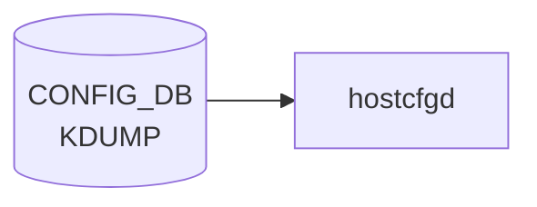

# KDUMP テーブル

## 概要

Linux kernel crash dump (kdump) の設定。`KDUMP|config` の単一 container[^1]。`hostcfgd` がこの container を購読し、`/etc/default/kdump-tools` の生成・`kdump-config` の起動を実施する。

<!-- cdb-mermaid -->
### データフロー (自動生成)



!!! note "凡例"
    CONFIG_DB から SAI までの典型経路を `docs/reference/config-db-orch-map.md` から機械生成したミニ図。詳細・例外は本ページ本文と対応表を参照。
<!-- /cdb-mermaid -->

## key 構造

```text
KDUMP|config
```

(list ではなく単一 container)

## 主要フィールド

| フィールド | 型 | 説明 |
|-----------|----|------|
| `enabled` | boolean | kdump メカニズムの有効化 |
| `memory` | string | crash kernel に確保するメモリ。`512M-2G:64M,2G-:128M` 形式または絶対値 (`512M`) |
| `num_dumps` | uint8 (1..9) | 保持する core file 数 |
| `remote` | boolean | リモート (SSH) ダンプ転送の有効化 |
| `ssh_string` | string | リモート ssh 接続文字列 (`user@host` パターン) |
| `ssh_path` | string | リモート ssh 秘密鍵パス |

## 購読者

- `hostcfgd` (`docker-config-engine`): [CONFIG_DB](../../reference/glossary.md#term-config_db) → `/etc/default/kdump-tools`

## 関連 CONFIG_DB / YANG / CLI

- 関連 CLI: `config kdump enable/disable/memory/num_dumps/remote/add ssh_string`、`show kdump`
- 関連 [YANG](../../reference/glossary.md#term-yang): `sonic-kdump`

<!-- ref-triangle:start -->

## 関連リファレンス

- [YANG](../../reference/glossary.md#term-yang): [`sonic-kdump`](../yang/sonic-kdump.md)
- CLI: [`config kdump`](../cli/config-kdump.md)

<!-- ref-triangle:end -->

## 引用元

[^1]: [YANG](../../reference/glossary.md#term-yang) 定義: `sonic-kdump.yang`. <https://github.com/sonic-net/sonic-buildimage/blob/9ea932ec2e18f35e58268ec2e4456b1d4afd65cd/src/sonic-yang-models/yang-models/sonic-kdump.yang>

## 関連ページ
- [HLD: kdump](../../system/kdump.md)
- [CLI: config kdump](../cli/config-kdump.md)

<!-- ops-hint -->
## 運用ヒント

### 典型値

- key 形式: `KDUMP|config`。
- `enabled`: `true`、`memory`: `0M-2G:256M,2G-:512M`、`num_dumps`: `3`。

### よくある誤設定

- memory が小さすぎると kdump kernel が起動できず crash dump が取れない。

### 確認コマンド

```bash
sonic-db-cli CONFIG_DB hgetall 'KDUMP|config'
show kdump config
```
<!-- /ops-hint -->

<!-- cdb-exceptions -->
## 例外条件・特殊挙動

<!-- evidence: sonic-utilities/config/kdump.py -->

| 条件 | 挙動 |
|------|------|
| `enabled` 変更は即時反映されない | grub エントリ変更のため次回 reboot 後に有効化。現行カーネルへの影響なし |
| `memory` の値が小さすぎる | DB には書けるが kdump kernel 起動失敗（コード上のバリデーションなし、YANG 経由時のみ検証） |
| `num_dumps` が 0 以下 | CLI は `int` として受け取るが下限チェックなし。hostcfgd が `kdump-config` にそのまま渡すため動作は実装依存 |
| SSH key の不正フォーマット | `is_valid_ssh_key()` で検証 → エラーメッセージ出力して DB 書き込み中断 |
| remote 未 enable 状態で remote サーバ設定 | `"Remote feature is not enabled. Please enable the remote feature first."` を表示して中断 |
| SSH path の不正フォーマット | `is_valid_ssh_path()` で検証 → エラーメッセージ出力して DB 書き込み中断 |

<!-- /cdb-exceptions -->

<!-- glossary-links-injected: b5626ca1f0f9 -->
