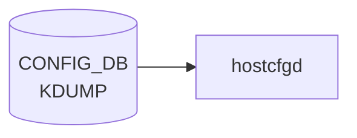

# KDUMP テーブル

## 概要

Linux kernel crash dump (kdump) の設定。`KDUMP|config` の単一 container[^1]。`hostcfgd` がこの container を購読し、`/etc/default/kdump-tools` の生成・`kdump-config` の起動を実施する。

<!-- cdb-mermaid -->
### データフロー (自動生成)



!!! note "凡例"
    CONFIG_DB から SAI までの典型経路を `docs/reference/config-db-orch-map.md` から機械生成したミニ図。詳細・例外は本ページ本文と対応表を参照。
<!-- /cdb-mermaid -->

## key 構造

```text
KDUMP|config
```

(list ではなく単一 container)

## 主要フィールド

| フィールド | 型 | 説明 |
|-----------|----|------|
| `enabled` | boolean | kdump メカニズムの有効化 |
| `memory` | string | crash kernel に確保するメモリ。`512M-2G:64M,2G-:128M` 形式または絶対値 (`512M`) |
| `num_dumps` | uint8 (1..9) | 保持する core file 数 |
| `remote` | boolean | リモート (SSH) ダンプ転送の有効化 |
| `ssh_string` | string | リモート ssh 接続文字列 (`user@host` パターン) |
| `ssh_path` | string | リモート ssh 秘密鍵パス |

## 購読者

- `hostcfgd` (`docker-config-engine`): [CONFIG_DB](../../reference/glossary.md#term-config_db) → `/etc/default/kdump-tools`

## 関連 CONFIG_DB / YANG / CLI

- 関連 CLI: `config kdump enable/disable/memory/num_dumps/remote/add ssh_string`、`show kdump`
- 関連 [YANG](../../reference/glossary.md#term-yang): `sonic-kdump`

<!-- ref-triangle:start -->

## 関連リファレンス

- [YANG](../../reference/glossary.md#term-yang): [`sonic-kdump`](../yang/sonic-kdump.md)
- CLI: [`config kdump`](../cli/config-kdump.md)

<!-- ref-triangle:end -->

## 引用元

[^1]: [YANG](../../reference/glossary.md#term-yang) 定義: `sonic-kdump.yang`. <https://github.com/sonic-net/sonic-buildimage/blob/9ea932ec2e18f35e58268ec2e4456b1d4afd65cd/src/sonic-yang-models/yang-models/sonic-kdump.yang>

## 関連ページ
- [HLD: kdump](../../system/kdump.md)
- [CLI: config kdump](../cli/config-kdump.md)

<!-- ops-hint -->
## 運用ヒント

### 典型値

- key 形式: `KDUMP|config`。
- `enabled`: `true`、`memory`: `0M-2G:256M,2G-:512M`、`num_dumps`: `3`。

### よくある誤設定

- memory が小さすぎると kdump kernel が起動できず crash dump が取れない。

### 確認コマンド

```bash
sonic-db-cli CONFIG_DB hgetall 'KDUMP|config'
show kdump config
```
<!-- /ops-hint -->

<!-- value-behavior -->
## 値依存挙動マトリクス

このテーブルに strict な enum フィールドはない。boolean と文字列フィールドで動作が決まる。

### `enabled`

| 値 | 挙動 |
|----|------|
| `true` | kdump 有効化。grub パラメータ変更のため次回 reboot 後に有効化 |
| `false` | kdump 無効化（デフォルト） |

### `remote`

| 値 | 挙動 |
|----|------|
| `true` | SSH 経由リモートダンプ転送。`ssh_string` / `ssh_path` の設定が必要 |
| `false` | ローカル保存のみ（デフォルト） |

### `memory`（文字列書式）

| 書式 | 挙動 |
|------|------|
| `512M-2G:64M,2G-:128M`（範囲形式） | 実装メモリに応じて確保量を変える |
| `512M`（絶対値形式） | 固定サイズ確保 |
| 小さすぎる値 | kdump kernel 起動失敗（DB には書けるが YANG 経由時のみ検証あり） |

<!-- /value-behavior -->

<!-- cdb-exceptions -->
## 例外条件・特殊挙動

<!-- evidence: sonic-utilities/config/kdump.py -->

| 条件 | 挙動 |
|------|------|
| `enabled` 変更は即時反映されない | grub エントリ変更のため次回 reboot 後に有効化。現行カーネルへの影響なし |
| `memory` の値が小さすぎる | DB には書けるが kdump kernel 起動失敗（コード上のバリデーションなし、YANG 経由時のみ検証） |
| `num_dumps` が 0 以下 | CLI は `int` として受け取るが下限チェックなし。hostcfgd が `kdump-config` にそのまま渡すため動作は実装依存 |
| SSH key の不正フォーマット | `is_valid_ssh_key()` で検証 → エラーメッセージ出力して DB 書き込み中断 |
| remote 未 enable 状態で remote サーバ設定 | `"Remote feature is not enabled. Please enable the remote feature first."` を表示して中断 |
| SSH path の不正フォーマット | `is_valid_ssh_path()` で検証 → エラーメッセージ出力して DB 書き込み中断 |

<!-- /cdb-exceptions -->


<!-- runtime-trace -->
## 実コンテナ動作トレース

### 段階 1 — Consumer 登録

`hostcfgd` の `KdumpHandler` が CONFIG_DB の `KDUMP` テーブルを購読する。

`KDUMP` の key は `config` (単一エントリ)。`enabled` / `memory` / `num_dumps` フィールドを持つ。

### 段階 2 — CFG→APPL 翻訳

なし (APPL_DB 中継なし)

### 段階 3 — APPL→SAI

なし (SAI 非経由 — `kdump-tools` の設定ファイルを更新)

### 段階 4 — タイミングと副作用

**適用タイミング**: CONFIG_DB 変化を検知後、`/etc/default/kdump-tools` を書き換え。`kdump-tools` の設定は次回サービス再起動またはシステム再起動で反映。

**副作用**: `enabled: true` にしてもシステム再起動なしでは kdump カーネルがロードされない。`num_dumps` 変更は次回 coredump 発生時から適用。
<!-- /runtime-trace -->

<!-- entry-points -->
## 書き込み入り口 (Direction A)

対象テーブル: `KDUMP`

### CLI
- `config kdump enable/disable`
- `config kdump memory <size>`
- `config kdump num-dumps <n>`
  - ソース: `sonic-utilities/config/kdump.py`

### minigraph / sonic-cfggen
- なし

### REST / gNMI (sonic-mgmt-common)
- なし (対応 OpenConfig/SONiC YANG transformer なし)

### db_migrator
- なし

### ビルド時デフォルト (init_cfg / j2 テンプレート)
- `init_cfg.json.j2` の `KDUMP` セクションでデフォルト値 (`enabled: false`, `memory: 0M-2G:256M,2G-4G:320M,...`) が注入

### ハードコードデフォルト
- なし

### ランタイム注入 (デーモン自動書き込み)
- `hostcfgd` の kdump ハンドラが kernel crashkernel 設定と同期
<!-- /entry-points -->

<!-- defaults -->
## コード由来の暗黙デフォルト

YANG に `default` 句は一切ない。デフォルト値はすべて実装コードに埋め込まれており、3 層（init_cfg.json.j2 / hostcfgd ハードコード / sonic-kdump-config フォールバック）が独立して存在する。

### フィールド別デフォルト一覧

| フィールド | YANG default | init_cfg.json.j2 | hostcfgd ハードコード | sonic-kdump-config fallback |
|---|---|---|---|---|
| `enabled` | なし | `"false"` (cisco-8000 のみ `"true"`) | `"false"` | — |
| `memory` | なし | `"0M-2G:256M,2G-4G:320M,4G-8G:384M,8G-:448M"` | `"0M-2G:256M,2G-4G:320M,4G-8G:384M,8G-16G:448M,16G-32G:768M,32G-:1G"` | `"0M-2G:256M,2G-4G:320M,4G-8G:384M,8G-:448M"` |
| `num_dumps` | なし | `"3"` | `"3"` | `3` (int) |
| `remote` | なし | 記載なし | `"false"` | `False` |
| `ssh_string` | なし | 記載なし | `"user@localhost"` (プレースホルダー) | `None` |
| `ssh_path` | なし | 記載なし | `"/a/b/c"` (プレースホルダー) | `None` |

### 重要な暗黙挙動

**プラットフォーム依存 + 暗黙 reset (`enabled`)**:
hostcfgd 起動時に `/proc/cmdline` を読み、`crashkernel=` が存在する場合は `enabled` を `"true"` に強制書き戻し・DB 更新する（`init_kdump_config_from_cmdline()`）。CONFIG_DB に `"false"` を設定していても上書きされる。これはブートローダーで crashkernel を設定済みのプラットフォーム（cisco-8000 等）で発生する。

**YANG-実装 discrepancy (`memory`)**:
`memory` の初期値が 3 箇所で異なる。`init_cfg.json.j2` は 2 段階（`8G-:448M` 止まり）、hostcfgd は 4 段階（`16G-32G:768M,32G-:1G` を含む）、`sonic-kdump-config` の `get_kdump_memory()` は init_cfg と同じ 2 段階。高メモリ環境（16GB 超）では hostcfgd 経由と init_cfg 経由で異なる予約量になる。

**silent substitution (`ssh_string`, `ssh_path`)**:
CONFIG_DB に値が未設定の場合、hostcfgd は `"user@localhost"` / `"/a/b/c"` をフォールバックとして sonic-kdump-config に渡す。これらはプレースホルダー値だがエラーにならず `/etc/default/kdump-tools` に書き込まれる。

**YANG-実装 discrepancy (`ssh_string` 検証)**:
検証ルールが 3 系統で異なる。YANG パターン（`[a-zA-Z0-9._%+-]+@...`、ユーザー名先頭に `_` 等を許容）、CLI `is_valid_ssh_key()`（`username.isalnum()` のみ、英数字限定）、sonic-kdump-config `SSH_STRING_RE`（`[a-zA-Z0-9][a-zA-Z0-9._%+-]*@...`、先頭英数字必須）。直接 DB 書き込みでは YANG 制約もバイパスされる。

**partial failure (`ssh_path`)**:
CLI `add_ssh_path` は `os.path.exists()` で実在チェックするが、sonic-kdump-config `write_ssh_path()` はパターン検証のみで存在チェックなし。DB 直接書き込みや hostcfgd フォールバック（`"/a/b/c"`）経由では存在しないパスが `/etc/default/kdump-tools` に書き込まれる。

**dead consumer (YANG `num_dumps` 範囲制約)**:
YANG は `range "1 .. 9"` を定義するが、CLI `config kdump num_dumps` は `type=int` のみで範囲チェックなし。0 や 10 以上の値も DB に書き込み可能。sonic-yang-mgmt を経由する REST/gNMI 経由時のみ YANG 範囲検証が有効。

<!-- /defaults -->

<!-- pubsub -->
## 通信メカニズム (Phase G)

### CONFIG_DB Subscribe (hostcfgd Python)

`hostcfgd` (`sonic-host-services/scripts/hostcfgd`) は Python の `swsscommon.ConfigDBConnector` を使い、
`KDUMP` テーブルを subscribe する。

```python
# sonic-host-services/scripts/hostcfgd:2468
self.config_db.subscribe('KDUMP', make_callback(self.kdump_handler))
```

`make_callback` はテーブル変化イベントを `(key, op, data)` に変換し `kdump_handler` へ転送する。

```python
# sonic-host-services/scripts/hostcfgd:2393-2395
def kdump_handler(self, key, op, data):
    syslog.syslog(syslog.LOG_INFO, 'Kdump handler...')
    self.kdumpCfg.kdump_update(key, data)
```

### ハンドラ分岐 (KdumpCfg.kdump_update)

`key == "config"` の場合のみ処理が走る（単一 container のため実質常にこの分岐）。

```python
# sonic-host-services/scripts/hostcfgd:1225-1270
def kdump_update(self, key, data):
    if key == "config":
        # enabled / memory / num_dumps / ssh_string / ssh_path を data から取得し
        # sonic-kdump-config コマンド群を順に実行する
        run_cmd(["sonic-kdump-config", "--enable"])   # または --disable
        run_cmd(["sonic-kdump-config", "--memory", memory])
        run_cmd(["sonic-kdump-config", "--num_dumps", num_dumps])
        run_cmd(["sonic-kdump-config", "--ssh_string", ssh_string])
        run_cmd(["sonic-kdump-config", "--ssh_path", ssh_path])
        run_cmd(["sonic-kdump-config", "--remote"])
```

### sonic-kdump-config → grub-mkconfig 経路

`sonic-kdump-config --enable/--disable` はカーネルブートラインの `crashkernel=` パラメータを
`/host/grub/grub.cfg` に直接書き込む (`rewrite_cfg()`)。grub-mkconfig は呼ばず、
SONiC 独自の grub.cfg 直接書き換え方式を採用している。

```python
# sonic-utilities/scripts/sonic-kdump-config:686-687
if changed:
    rewrite_cfg(lines, cmdline_file)  # /host/grub/grub.cfg を上書き
```

`sonic-kdump-config --memory/--num_dumps` は `/etc/default/kdump-tools`
(`USE_KDUMP` / `KDUMP_NUM_DUMPS` フィールド) を直接書き換える。

### systemctl 制御

hostcfgd 自体は `kdump-tools` サービスを直接 `systemctl restart` しない。
grub.cfg と `/etc/default/kdump-tools` の更新のみを行い、
次回システム再起動時に kdump kernel がロードされる仕組み。

クラッシュカーネルがすでに /proc/cmdline にロードされている場合のみ
`/usr/sbin/kdump-config load` を呼び出してオンラインリロードを試みる。

```python
# sonic-utilities/scripts/sonic-kdump-config:712-716
if crash_kernel_in_cmdline is not None:
    run_command("/usr/sbin/kdump-config load", use_shell=False)
```

### 起動時初期化フロー

```
hostcfgd 起動
  → KdumpCfg.__init__()
    → init_kdump_config_from_cmdline()   # /proc/cmdline の crashkernel= を確認
    → 存在する場合: KDUMP|config|enabled / memory を強制上書き
  → HostConfigDaemon.start()
    → get_table('KDUMP') で初期値取得
    → KdumpCfg.load()                   # 未設定フィールドをデフォルトで埋め込み
    → kdump_update("config", data)      # 初回 sonic-kdump-config 実行
  → register_callbacks()
    → config_db.subscribe('KDUMP', ...)  # 以降の変化はイベント駆動
```

### イベント経路まとめ

```
KDUMP|config 変更 (CLI / DB 直接書き込み)
  → ConfigDBConnector subscribe コールバック
  → HostConfigDaemon.kdump_handler(key, op, data)
  → KdumpCfg.kdump_update(key, data)
  → sonic-kdump-config --enable/--disable   → /host/grub/grub.cfg 更新
  → sonic-kdump-config --memory <val>       → /etc/default/kdump-tools 更新
  → sonic-kdump-config --num_dumps <val>    → /etc/default/kdump-tools 更新
  → sonic-kdump-config --ssh_string <val>   → /etc/default/kdump-tools 更新
  → sonic-kdump-config --ssh_path <val>     → /etc/default/kdump-tools 更新
  → sonic-kdump-config --remote             → /etc/default/kdump-tools 更新
  (次回 reboot でカーネル反映)
```

<!-- /pubsub -->

<!-- glossary-links-injected: b5626ca1f0f9 -->
