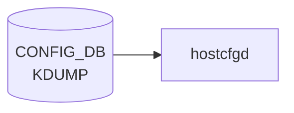

# KDUMP テーブル

## 概要

Linux kernel crash dump (kdump) の設定。`KDUMP|config` の単一 container[^1]。`hostcfgd` がこの container を購読し、`/etc/default/kdump-tools` の生成・`kdump-config` の起動を実施する。

<!-- cdb-mermaid -->
### データフロー (自動生成)



!!! note "凡例"
    CONFIG_DB から SAI までの典型経路を `docs/reference/config-db-orch-map.md` から機械生成したミニ図。詳細・例外は本ページ本文と対応表を参照。
<!-- /cdb-mermaid -->

## key 構造

```text
KDUMP|config
```

(list ではなく単一 container)

## 主要フィールド

| フィールド | 型 | 説明 |
|-----------|----|------|
| `enabled` | boolean | kdump メカニズムの有効化 |
| `memory` | string | crash kernel に確保するメモリ。`512M-2G:64M,2G-:128M` 形式または絶対値 (`512M`) |
| `num_dumps` | uint8 (1..9) | 保持する core file 数 |
| `remote` | boolean | リモート (SSH) ダンプ転送の有効化 |
| `ssh_string` | string | リモート ssh 接続文字列 (`user@host` パターン) |
| `ssh_path` | string | リモート ssh 秘密鍵パス |

## 購読者

- `hostcfgd` (`docker-config-engine`): [CONFIG_DB](../../reference/glossary.md#term-config_db) → `/etc/default/kdump-tools`

## 関連 CONFIG_DB / YANG / CLI

- 関連 CLI: `config kdump enable/disable/memory/num_dumps/remote/add ssh_string`、`show kdump`
- 関連 [YANG](../../reference/glossary.md#term-yang): `sonic-kdump`

<!-- ref-triangle:start -->

## 関連リファレンス

- [YANG](../../reference/glossary.md#term-yang): [`sonic-kdump`](../yang/sonic-kdump.md)
- CLI: [`config kdump`](../cli/config-kdump.md)

<!-- ref-triangle:end -->

## 引用元

[^1]: [YANG](../../reference/glossary.md#term-yang) 定義: `sonic-kdump.yang`. <https://github.com/sonic-net/sonic-buildimage/blob/9ea932ec2e18f35e58268ec2e4456b1d4afd65cd/src/sonic-yang-models/yang-models/sonic-kdump.yang>

## 関連ページ
- [HLD: kdump](../../system/kdump.md)
- [CLI: config kdump](../cli/config-kdump.md)

<!-- ops-hint -->
## 運用ヒント

### 典型値

- key 形式: `KDUMP|config`。
- `enabled`: `true`、`memory`: `0M-2G:256M,2G-:512M`、`num_dumps`: `3`。

### よくある誤設定

- memory が小さすぎると kdump kernel が起動できず crash dump が取れない。

### 確認コマンド

```bash
sonic-db-cli CONFIG_DB hgetall 'KDUMP|config'
show kdump config
```
<!-- /ops-hint -->

<!-- value-behavior -->
## 値依存挙動マトリクス

このテーブルに strict な enum フィールドはない。boolean と文字列フィールドで動作が決まる。

### `enabled`

| 値 | 挙動 |
|----|------|
| `true` | kdump 有効化。grub パラメータ変更のため次回 reboot 後に有効化 |
| `false` | kdump 無効化（デフォルト） |

### `remote`

| 値 | 挙動 |
|----|------|
| `true` | SSH 経由リモートダンプ転送。`ssh_string` / `ssh_path` の設定が必要 |
| `false` | ローカル保存のみ（デフォルト） |

### `memory`（文字列書式）

| 書式 | 挙動 |
|------|------|
| `512M-2G:64M,2G-:128M`（範囲形式） | 実装メモリに応じて確保量を変える |
| `512M`（絶対値形式） | 固定サイズ確保 |
| 小さすぎる値 | kdump kernel 起動失敗（DB には書けるが YANG 経由時のみ検証あり） |

<!-- /value-behavior -->

<!-- cdb-exceptions -->
## 例外条件・特殊挙動

<!-- evidence: sonic-utilities/config/kdump.py -->

| 条件 | 挙動 |
|------|------|
| `enabled` 変更は即時反映されない | grub エントリ変更のため次回 reboot 後に有効化。現行カーネルへの影響なし |
| `memory` の値が小さすぎる | DB には書けるが kdump kernel 起動失敗（コード上のバリデーションなし、YANG 経由時のみ検証） |
| `num_dumps` が 0 以下 | CLI は `int` として受け取るが下限チェックなし。hostcfgd が `kdump-config` にそのまま渡すため動作は実装依存 |
| SSH key の不正フォーマット | `is_valid_ssh_key()` で検証 → エラーメッセージ出力して DB 書き込み中断 |
| remote 未 enable 状態で remote サーバ設定 | `"Remote feature is not enabled. Please enable the remote feature first."` を表示して中断 |
| SSH path の不正フォーマット | `is_valid_ssh_path()` で検証 → エラーメッセージ出力して DB 書き込み中断 |

<!-- /cdb-exceptions -->

<!-- failure -->
## 失敗挙動

<!-- evidence: sonic-utilities/scripts/sonic-kdump-config -->

### crashkernel メモリ確保失敗

| 失敗条件 | 挙動 |
|---------|------|
| `memory` 値が小さすぎる（例: `32M`）でリブート | kdump カーネルがロードされず `/sys/kernel/kexec_crash_size = 0`。`show kdump status` は `Not Ready` を表示。CONFIG_DB の値は変更されない |
| 物理メモリ不足で crashkernel 確保不可 | 同上。エラーログはカーネルブート時にのみ出力。`sonic-kdump-config` スクリプトは `get_crash_kernel_size()` で `"0"` を返して例外を呑み込む（`sonic-kdump-config:94-99`） |
| `locate_image()` が `-1` 返却（イメージ名不一致） | `lines[-1]`（最終行）を誤って更新。クラッシュなしだが無効エントリが書き込まれる（`sonic-kdump-config:655-683`） |

### systemd / kdump-config サービス起動失敗

| 失敗条件 | 挙動 |
|---------|------|
| `/etc/default/kdump-tools` の `USE_KDUMP` 書き換え失敗 | `print_err("Error while writing USE_KDUMP into ...")` → `sys.exit(1)`。CONFIG_DB の巻き戻しなし（`sonic-kdump-config:483-496`） |
| `kdump-config unload` が非ゼロ終了 | `print_err("Error Unable to unload the Kdump kernel ...")` → `sys.exit(1)` |
| `kdump-config load` が非ゼロ終了 | `print_err("Error: Unable to reload kdump configuration")` → `sys.exit(1)`（`sonic-kdump-config:713-716`） |
| リモート設定時 `kdump-config set-remote` 失敗 | `print_err("Error: Unable to set remote crash dump configuration")` → `sys.exit(1)` |

いずれも CONFIG_DB への巻き戻しは行われない。`enabled: true` が DB に残ったまま kdump サービスが停止する不整合が生じる。

### 不正 num_dumps 値

| 失敗条件 | 挙動 |
|---------|------|
| `num_dumps = 0` | CLI は下限チェックなし。`KDUMP_NUM_DUMPS=0` が `/etc/default/kdump-tools` に書き込まれる。kdump-tools はローテーションを無制限として扱う可能性がある（`sonic-kdump-config:521-529`） |
| `num_dumps` が負値 | 同様に下限チェックなし。`KDUMP_NUM_DUMPS=-1` が書き込まれ動作は実装依存 |
| YANG 検証（`uint8` range `1..9`）は mgmt-framework 経由時のみ有効 | CLI / `sonic-kdump-config` 直接呼び出しではバイパスされる |

<!-- /failure -->

<!-- runtime-trace -->
## 実コンテナ動作トレース

### 段階 1 — Consumer 登録

`hostcfgd` の `KdumpHandler` が CONFIG_DB の `KDUMP` テーブルを購読する。

`KDUMP` の key は `config` (単一エントリ)。`enabled` / `memory` / `num_dumps` フィールドを持つ。

### 段階 2 — CFG→APPL 翻訳

なし (APPL_DB 中継なし)

### 段階 3 — APPL→SAI

なし (SAI 非経由 — `kdump-tools` の設定ファイルを更新)

### 段階 4 — タイミングと副作用

**適用タイミング**: CONFIG_DB 変化を検知後、`/etc/default/kdump-tools` を書き換え。`kdump-tools` の設定は次回サービス再起動またはシステム再起動で反映。

**副作用**: `enabled: true` にしてもシステム再起動なしでは kdump カーネルがロードされない。`num_dumps` 変更は次回 coredump 発生時から適用。
<!-- /runtime-trace -->

<!-- entry-points -->
## 書き込み入り口 (Direction A)

対象テーブル: `KDUMP`

### CLI
- `config kdump enable/disable`
- `config kdump memory <size>`
- `config kdump num-dumps <n>`
  - ソース: `sonic-utilities/config/kdump.py`

### minigraph / sonic-cfggen
- なし

### REST / gNMI (sonic-mgmt-common)
- なし (対応 OpenConfig/SONiC YANG transformer なし)

### db_migrator
- なし

### ビルド時デフォルト (init_cfg / j2 テンプレート)
- `init_cfg.json.j2` の `KDUMP` セクションでデフォルト値 (`enabled: false`, `memory: 0M-2G:256M,2G-4G:320M,...`) が注入

### ハードコードデフォルト
- なし

### ランタイム注入 (デーモン自動書き込み)
- `hostcfgd` の kdump ハンドラが kernel crashkernel 設定と同期
<!-- /entry-points -->

<!-- glossary-links-injected: b5626ca1f0f9 -->
