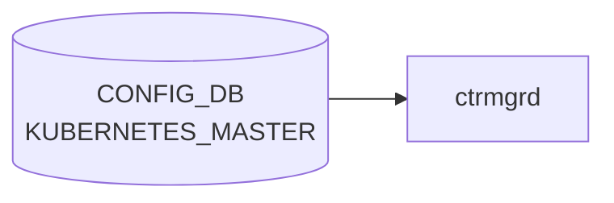

# KUBERNETES_MASTER テーブル

## 概要

SONiC ホストを Kubernetes worker としてマスターに参加させるための接続情報を保持するテーブル。SONiC の K8s 統合 (Smart Switch でも参照される [DPU](../../reference/glossary.md#term-dpu) 管理経路の一部) でコンテナ化された feature を K8s から起動するために使われる[^1]。

<!-- ordering -->
## 書込み順依存 (Phase B)

`ctrmgrd` は `KUBERNETES_MASTER` テーブルを直接 CONFIG_DB から購読し、`ip` / `disable` / `insecure` の変化に応じて kubelet join / reset を実行する。Kubernetes join はネットワーク到達が前提であるため、テーブル内フィールドの書込み順と、`STATE_DB:KUBERNETES_MASTER|SERVER` の初期状態が join タイミングを左右する。

### 検出された順序依存

| # | 依存関係 | 方向 | 緩和策 |
|---|----------|------|--------|
| 1 | `/etc/sonic/remote_ctr.config.json` 読み込み → `remote_ctr_config` 確定 | **強制先行**（`ctrmgrd.init()` が CONFIG_DB 読み込みより先に実行） | ctrmgrd 起動前にファイルを配置する |
| 2 | `STATE_DB:KUBERNETES_MASTER\|SERVER.update_time` 有無 → `JOIN_LATENCY` 適用分岐 | 起動時評価（初回起動時は 10 秒遅延） | 初回起動時は `JOIN_LATENCY`（デフォルト 10 秒）を見込む |
| 3 | `ip` の書込み + `disable=false` → `do_join()` 実行 | **強制先行**（`ip` が空または `disable=true` の間は `do_reset()` を繰り返す） | `ip` を最後に書くか、`ip` と `disable=false` を同時に保証する |
| 4 | JOIN_RETRY 中の `ip` 変更 → 旧タイマー残留 | 非自明（実害小） | `on_config_update()` が即時 `handle_update()` を呼んで最新 ip で join するため実質無害 |
| 5 | `STATE_DB:KUBERNETES_MASTER\|SERVER.connected=true` 確認 → `FEATURE.set_owner=kube` | **推奨先行**（join 未完了のまま kube モード移行するとサービスが応答なし状態になる） | STATE_DB を polling して `connected=true` を確認後に FEATURE を変更する |

### 主要な制約詳細

**JOIN_LATENCY による初回起動遅延 (依存 #2)**: `RemoteServerHandler.__init__()` は起動時に `STATE_DB:KUBERNETES_MASTER|SERVER.update_time` を読む。値が空（初回起動）の場合、`JOIN_LATENCY` 秒後（デフォルト 10 秒）に timer で `handle_update()` を登録し、それまでは `pending = True` として join を抑制する。`KUBERNETES_MASTER` への書込みが起動後即座に行われても、この latency 期間中は kubelet join が行われない（evidence: `ctrmgrd.py:339-356`）。

**`ip` の有無による `do_join()` / `do_reset()` 分岐 (依存 #3)**: `handle_update()` は `disable != "false"` または `ip` が空文字の場合に `kube_reset_master(True)` を呼び `connected = "false"` を STATE_DB に書く。`ip` が設定された後に CONFIG_DB 変化が `on_config_update()` 経由で検知され、初めて `do_join()` が実行される。このため `ip` を後から書き込む運用では、それまでの間 STATE_DB は `connected = "false"` のままである（evidence: `ctrmgrd.py:392-413`）。

**`FEATURE.set_owner=kube` との連動 (依存 #5)**: `FeatureTransition.on_config_update()` は `CONFIG_DB:FEATURE` を購読し、`set_owner` が `kube` になった feature を systemd restart する。この移行は `KUBERNETES_MASTER` の接続状態とは独立してトリガーされるため、kubelet join 完了前に `FEATURE.set_owner=kube` を書くと、対象コンテナが K8s からのデプロイを待ち続けてサービスが起動しない状態になる（evidence: `ctrmgrd.py:467-511`）。

詳細解析: `meta/_intermediate/cdb-flow/kubernetes-master-ordering.md`

<!-- evidence: sonic-buildimage/src/sonic-ctrmgrd/ctrmgr/ctrmgrd.py:23,169-173,339-356,370-413,444-455,467-511,688-694; sonic-buildimage/src/sonic-ctrmgrd/ctrmgr/ctrmgrd.service:3-6 -->
<!-- /ordering -->

<!-- defaults -->
## フィールドデフォルト

| フィールド | デフォルト値 | ソース |
|-----------|------------|--------|
| `ip` | (なし — 空文字) | ctrmgrd.py L73; `ip` は YANG に `default` 宣言なし |
| `port` | `6443` | sonic-kubernetes_master.yang L40–41; ctrmgrd.py L74 |
| `disable` | `"false"` | sonic-kubernetes_master.yang L47; ctrmgrd.py L75 |
| `insecure` | `"true"` | sonic-kubernetes_master.yang L53; ctrmgrd.py L76 |

> **注**: CLI レイヤー (`config/kube.py L27–32`) は `"True"/"False"` (先頭大文字) で書き込む場合がある。ConfigDB 比較ロジックは大文字小文字を区別しない。
<!-- /defaults -->

<!-- cdb-mermaid -->
### データフロー (自動生成)



!!! note "凡例"
    CONFIG_DB から SAI までの典型経路を `docs/reference/config-db-orch-map.md` から機械生成したミニ図。詳細・例外は本ページ本文と対応表を参照。
<!-- /cdb-mermaid -->

## key 構造

```text
KUBERNETES_MASTER|SERVER
```

(list ではなく単一 container)

## 主要フィールド

| フィールド | 型 | 既定 | 説明 |
|-----------|----|------|------|
| `ip` | inet:host | - | API server endpoint (IP または DNS) |
| `port` | inet:port-number | 6443 | API server ポート |
| `disable` | boolean (string `true`/`false`) | `false` | K8s 統合を無効化 |
| `insecure` | boolean (string `true`/`false`) | `true` | CA 証明書取得時に HTTP を許可 |

## 購読者

- `ctrmgrd` (`docker-config-engine`): [CONFIG_DB](../../reference/glossary.md#term-config_db) を購読し、対象 feature の K8s モード切替・kubelet 設定を実施
- `FEATURE` テーブルの `set_owner = kube` を持つコンテナが K8s からデプロイされる

## 関連 CONFIG_DB / YANG / CLI

- 関連 [CONFIG_DB](../../reference/glossary.md#term-config_db): `FEATURE` (`set_owner`、`state`、`auto_restart`)
- 関連 CLI: `config kubernetes server ip/port/disable`、`show kubernetes`
- 関連 [YANG](../../reference/glossary.md#term-yang): `sonic-kubernetes_master`

<!-- ref-triangle:start -->

## 関連リファレンス

- [YANG](../../reference/glossary.md#term-yang): `sonic-kubernetes_master`
- CLI: `config kubernetes`

<!-- ref-triangle:end -->

## 引用元

[^1]: [YANG](../../reference/glossary.md#term-yang) 定義: `sonic-kubernetes_master.yang`. <https://github.com/sonic-net/sonic-buildimage/blob/9ea932ec2e18f35e58268ec2e4456b1d4afd65cd/src/sonic-yang-models/yang-models/sonic-kubernetes_master.yang>

<!-- ops-hint -->
## 運用ヒント

### 典型値

- key 形式: `KUBERNETES_MASTER|SERVER`。
- `ip`: master VIP、`disable`: `false`、`insecure`: `false`。

### よくある誤設定

- ip を hostname にすると DNS 未解決時に kubelet が起動しない。

### 確認コマンド

```bash
sonic-db-cli CONFIG_DB hgetall 'KUBERNETES_MASTER|SERVER'
show kube server config
```
<!-- /ops-hint -->

<!-- value-behavior -->
## 値依存挙動マトリクス

このテーブルに strict な enum フィールドはない。boolean の組み合わせと `ip` の型で動作が決まる。

### `disable`

| 値 | 挙動 |
|----|------|
| `false`（デフォルト） | K8s 統合有効。`ctrmgrd` が kubelet 設定を実施 |
| `true` | K8s 統合無効化。kubelet 接続を停止 |

### `insecure`

| 値 | 挙動 |
|----|------|
| `true`（デフォルト） | CA 証明書取得時に HTTP を許可（TLS 検証なし） |
| `false` | TLS 証明書検証あり（セキュアモード） |
| その他 | YANG バリデーションで reject |

### `ip`（型別挙動）

| 型 | 挙動 |
|----|------|
| IPv4 アドレス | 推奨。起動早期から安定して接続可能 |
| FQDN（ホスト名） | DNS 解決失敗環境（起動早期）では kubelet 接続失敗リスク |
| 数値変換不可文字列 | `ValueError` をキャッチしてデフォルト値を設定（kube.py L39, L47） |

<!-- /value-behavior -->

<!-- cdb-exceptions -->
## 例外条件・特殊挙動

<!-- evidence: sonic-utilities/config/kube.py -->

| 条件 | 挙動 |
|------|------|
| `ip` フィールドが数値変換できない文字列 | `ValueError` をキャッチしてデフォルト値を設定（kube.py L39, L47） |
| `ip` に FQDN（ホスト名）を使用 | DNS 解決失敗環境（起動早期）では kubelet 接続失敗。IP アドレス指定を推奨 |
| `disable` 未設定 | デフォルト `false`（kubelet 接続有効） |
| `insecure=true` 設定 | TLS 証明書検証を無効化。`true`/`false` 以外の値は YANG バリデーションで reject |

<!-- /cdb-exceptions -->


<!-- runtime-trace -->
## 実コンテナ動作トレース

### 段階 1 — Consumer 登録

`kube_scheduler` / `hostcfgd` が CONFIG_DB の `KUBERNETES_MASTER` テーブルを購読する。

`KUBERNETES_MASTER` の key は `SERVER` (単一エントリ)。`ip` / `port` / `insecure` フィールド。

### 段階 2 — CFG→APPL 翻訳

なし (APPL_DB 中継なし)

### 段階 3 — APPL→SAI

なし (SAI 非経由 — Kubernetes master 接続設定)

### 段階 4 — タイミングと副作用

**適用タイミング**: CONFIG_DB の `KUBERNETES_MASTER` 変化を検知後、Kubernetes クライアント設定を更新。接続は非同期で再確立。

**副作用**: Kubernetes master アドレス変更は `set_owner: kube` のフィーチャーの管理移行に影響。TLS 証明書の再取得が必要な場合がある。
<!-- /runtime-trace -->

<!-- entry-points -->
## 書き込み入り口 (Direction A)

対象テーブル: `KUBERNETES_MASTER`

### CLI
- `config kubernetes server ip <ip>`
- `config kubernetes server enable/disable`
  - ソース: `sonic-utilities/config/main.py (kubernetes グループ)`

### minigraph / sonic-cfggen
- なし

### REST / gNMI (sonic-mgmt-common)
- なし (対応 OpenConfig/SONiC YANG transformer なし)

### db_migrator
- なし

### ビルド時デフォルト (init_cfg / j2 テンプレート)
- なし

### ハードコードデフォルト
- なし

### ランタイム注入 (デーモン自動書き込み)
- `kubemgrd` が Kubernetes 接続状態を CONFIG_DB と同期
<!-- /entry-points -->

<!-- glossary-links-injected: 48d5f456ebb6 -->
