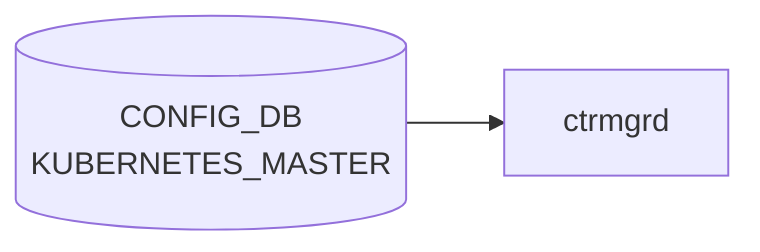

# KUBERNETES_MASTER テーブル

## 概要

SONiC ホストを Kubernetes worker としてマスターに参加させるための接続情報を保持するテーブル。SONiC の K8s 統合 (Smart Switch でも参照される [DPU](../../reference/glossary.md#term-dpu) 管理経路の一部) でコンテナ化された feature を K8s から起動するために使われる[^1]。

<!-- cdb-mermaid -->
### データフロー (自動生成)



!!! note "凡例"
    CONFIG_DB から SAI までの典型経路を `docs/reference/config-db-orch-map.md` から機械生成したミニ図。詳細・例外は本ページ本文と対応表を参照。
<!-- /cdb-mermaid -->

## key 構造

```
KUBERNETES_MASTER|SERVER
```

(list ではなく単一 container)

## 主要フィールド

| フィールド | 型 | 既定 | 説明 |
|-----------|----|------|------|
| `ip` | inet:host | - | API server endpoint (IP または DNS) |
| `port` | inet:port-number | 6443 | API server ポート |
| `disable` | boolean (string `true`/`false`) | `false` | K8s 統合を無効化 |
| `insecure` | boolean (string `true`/`false`) | `true` | CA 証明書取得時に HTTP を許可 |

## 購読者

- `ctrmgrd` (`docker-config-engine`): [CONFIG_DB](../../reference/glossary.md#term-config_db) を購読し、対象 feature の K8s モード切替・kubelet 設定を実施
- `FEATURE` テーブルの `set_owner = kube` を持つコンテナが K8s からデプロイされる

## 関連 CONFIG_DB / YANG / CLI

- 関連 CONFIG_DB: `FEATURE` (`set_owner`、`state`、`auto_restart`)
- 関連 CLI: `config kubernetes server ip/port/disable`、`show kubernetes`
- 関連 [YANG](../../reference/glossary.md#term-yang): `sonic-kubernetes_master`

<!-- ref-triangle:start -->

## 関連リファレンス

- YANG: `sonic-kubernetes_master`
- CLI: `config kubernetes`

<!-- ref-triangle:end -->

## 引用元

[^1]: YANG 定義: `sonic-kubernetes_master.yang`. <https://github.com/sonic-net/sonic-buildimage/blob/9ea932ec2e18f35e58268ec2e4456b1d4afd65cd/src/sonic-yang-models/yang-models/sonic-kubernetes_master.yang>

<!-- ops-hint -->
## 運用ヒント

### 典型値

- key 形式: `KUBERNETES_MASTER|SERVER`。
- `ip`: master VIP、`disable`: `false`、`insecure`: `false`。

### よくある誤設定

- ip を hostname にすると DNS 未解決時に kubelet が起動しない。

### 確認コマンド

```bash
sonic-db-cli CONFIG_DB hgetall 'KUBERNETES_MASTER|SERVER'
show kube server config
```
<!-- /ops-hint -->

<!-- glossary-links-injected: c8088b9a65fe -->
