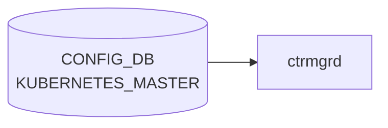

# KUBERNETES_MASTER テーブル

## 概要

SONiC ホストを Kubernetes worker としてマスターに参加させるための接続情報を保持するテーブル。SONiC の K8s 統合 (Smart Switch でも参照される [DPU](../../reference/glossary.md#term-dpu) 管理経路の一部) でコンテナ化された feature を K8s から起動するために使われる[^1]。

<!-- ordering -->
## 書込み順依存 (Phase B)

`ctrmgrd` は `KUBERNETES_MASTER` テーブルを直接 CONFIG_DB から購読し、`ip` / `disable` / `insecure` の変化に応じて kubelet join / reset を実行する。Kubernetes join はネットワーク到達が前提であるため、テーブル内フィールドの書込み順と、`STATE_DB:KUBERNETES_MASTER|SERVER` の初期状態が join タイミングを左右する。

### 検出された順序依存

| # | 依存関係 | 方向 | 緩和策 |
|---|----------|------|--------|
| 1 | `/etc/sonic/remote_ctr.config.json` 読み込み → `remote_ctr_config` 確定 | **強制先行**（`ctrmgrd.init()` が CONFIG_DB 読み込みより先に実行） | ctrmgrd 起動前にファイルを配置する |
| 2 | `STATE_DB:KUBERNETES_MASTER\|SERVER.update_time` 有無 → `JOIN_LATENCY` 適用分岐 | 起動時評価（初回起動時は 10 秒遅延） | 初回起動時は `JOIN_LATENCY`（デフォルト 10 秒）を見込む |
| 3 | `ip` の書込み + `disable=false` → `do_join()` 実行 | **強制先行**（`ip` が空または `disable=true` の間は `do_reset()` を繰り返す） | `ip` を最後に書くか、`ip` と `disable=false` を同時に保証する |
| 4 | JOIN_RETRY 中の `ip` 変更 → 旧タイマー残留 | 非自明（実害小） | `on_config_update()` が即時 `handle_update()` を呼んで最新 ip で join するため実質無害 |
| 5 | `STATE_DB:KUBERNETES_MASTER\|SERVER.connected=true` 確認 → `FEATURE.set_owner=kube` | **推奨先行**（join 未完了のまま kube モード移行するとサービスが応答なし状態になる） | STATE_DB を polling して `connected=true` を確認後に FEATURE を変更する |

### 主要な制約詳細

**JOIN_LATENCY による初回起動遅延 (依存 #2)**: `RemoteServerHandler.__init__()` は起動時に `STATE_DB:KUBERNETES_MASTER|SERVER.update_time` を読む。値が空（初回起動）の場合、`JOIN_LATENCY` 秒後（デフォルト 10 秒）に timer で `handle_update()` を登録し、それまでは `pending = True` として join を抑制する。`KUBERNETES_MASTER` への書込みが起動後即座に行われても、この latency 期間中は kubelet join が行われない（evidence: `ctrmgrd.py:339-356`）。

**`ip` の有無による `do_join()` / `do_reset()` 分岐 (依存 #3)**: `handle_update()` は `disable != "false"` または `ip` が空文字の場合に `kube_reset_master(True)` を呼び `connected = "false"` を STATE_DB に書く。`ip` が設定された後に CONFIG_DB 変化が `on_config_update()` 経由で検知され、初めて `do_join()` が実行される。このため `ip` を後から書き込む運用では、それまでの間 STATE_DB は `connected = "false"` のままである（evidence: `ctrmgrd.py:392-413`）。

**`FEATURE.set_owner=kube` との連動 (依存 #5)**: `FeatureTransition.on_config_update()` は `CONFIG_DB:FEATURE` を購読し、`set_owner` が `kube` になった feature を systemd restart する。この移行は `KUBERNETES_MASTER` の接続状態とは独立してトリガーされるため、kubelet join 完了前に `FEATURE.set_owner=kube` を書くと、対象コンテナが K8s からのデプロイを待ち続けてサービスが起動しない状態になる（evidence: `ctrmgrd.py:467-511`）。

詳細解析: `meta/_intermediate/cdb-flow/kubernetes-master-ordering.md`

<!-- evidence: sonic-buildimage/src/sonic-ctrmgrd/ctrmgr/ctrmgrd.py:23,169-173,339-356,370-413,444-455,467-511,688-694; sonic-buildimage/src/sonic-ctrmgrd/ctrmgr/ctrmgrd.service:3-6 -->
<!-- /ordering -->

<!-- cross-refs -->
## 暗黙参照 (Phase C)

`ctrmgrd` は `KUBERNETES_MASTER` テーブルを購読するだけでなく、join 完了後のラベル設定・フィーチャー所有権移行のために複数の CONFIG_DB / STATE_DB テーブルを参照・書き込む。`sonic-kubernetes_master.yang` には `leafref` 宣言は存在しないため、以下はすべてコードレベルの暗黙参照である。

### CONFIG_DB — 起動時読み出し

| テーブル | キー | フィールド | 参照種別 | 用途 | evidence |
|---|---|---|---|---|---|
| `DEVICE_METADATA` | `localhost` | `type` | get_db_entry（起動時） | Kubernetes ノードラベル生成時に `deployment_type` を取得して `STATE_DB:KUBE_LABELS\|SET` に書き込む | ctrmgrd.py:297-299 |

### CONFIG_DB — subscribe 連動

| テーブル | キー | フィールド | 参照種別 | 用途 | evidence |
|---|---|---|---|---|---|
| `FEATURE` | `<feature>` | `set_owner` | SubscriberStateTable | `set_owner=kube` になると `KUBE_LABELS|SET.<feat>_enabled=true` を書き込みサービス再起動を判断する | ctrmgrd.py:471-472,488,505-506 |

### STATE_DB — 起動時読み出し

| テーブル | キー | フィールド | 参照種別 | 用途 | evidence |
|---|---|---|---|---|---|
| `KUBERNETES_MASTER` | `SERVER` | `update_time` | get_db_entry（起動時） | 値が空なら初回起動と判断し `JOIN_LATENCY`（デフォルト 10 秒）を挿入する | ctrmgrd.py:341-342,349-356 |

### STATE_DB — subscribe 連動

| テーブル | キー | フィールド | 参照種別 | 用途 | evidence |
|---|---|---|---|---|---|
| `FEATURE` | `<feature>` | `ct_owner`, `remote_state` | SubscriberStateTable | `set_owner` と組み合わせて `handle_update()` を呼び、サービス再起動とラベル変更を制御する | ctrmgrd.py:473-474,478-511 |

### STATE_DB — ctrmgrd が連動して書き込む副作用テーブル

`KUBERNETES_MASTER` の変化がトリガーとなって ctrmgrd が書き込む STATE_DB テーブル。

| 書き込み先 | キー | フィールド | 書込元 | タイミング | evidence |
|---|---|---|---|---|---|
| `KUBERNETES_MASTER` | `SERVER` | `connected`, `update_time`, `ip`, `port` | RemoteServerHandler | join 成功 / リセット時 | ctrmgrd.py:413-414 |
| `KUBE_LABELS` | `SET` | `sonic_version`, `hwsku`, `deployment_type`, `worker.sonic/platform` | set_node_labels() | join 成功後（`do_join()` → `set_node_labels()`） | ctrmgrd.py:306-307,440 |
| `KUBE_LABELS` | `SET` | `<feat>_enabled` | FeatureTransitionHandler | `FEATURE.set_owner` 変化時 | ctrmgrd.py:505-506 |
| `FEATURE` | `<feature>` | `restart` | restart_systemd_service() | サービス再起動が必要な場合 | ctrmgrd.py:157-158 |

> **FEATURE との双方向参照**: `FEATURE.set_owner` の変化が `KUBERNETES_MASTER` 接続の副作用（ラベル付け）を引き起こし、逆に `KUBERNETES_MASTER` 接続状態が `FEATURE` の起動モード遷移に影響する。両テーブルは相互依存関係にある（Phase B `ordering` 依存 #5 参照）。

詳細解析: `meta/_intermediate/cdb-flow/kubernetes-master-cross-refs.md`

<!-- evidence: sonic-buildimage/src/sonic-ctrmgrd/ctrmgr/ctrmgrd.py:157-158,292-307,333-342,413-414,440,471-474,488,505-506 -->
<!-- /cross-refs -->

<!-- failure -->
## 失敗挙動 (Phase D)

<!-- evidence: sonic-buildimage/src/sonic-ctrmgrd/ctrmgr/ctrmgrd.py:113-114,273-275,395-455,668-685 -->

`ctrmgrd` は `KUBERNETES_MASTER` の変化を受けて `do_join()` / `do_reset()` を実行し、その成否に応じてタイマーリトライまたはプロセス abort で自己回復する。

### kube_join_master 失敗 → JOIN_RETRY による自動リトライ

`RemoteServerHandler.do_join()` (`ctrmgrd.py:429-455`) が `kube_commands.kube_join_master(ip, port, insecure)` を呼び、戻り値が非ゼロの場合:

| 手順 | 処理内容 | evidence |
|---|---|---|
| 1 | `st_server[ST_SER_CONNECTED] = "false"` → STATE_DB 即時更新 | `ctrmgrd.py:444` |
| 2 | `remote_connected = False` | `ctrmgrd.py:445` |
| 3 | `JOIN_RETRY` 秒後にタイマー登録 (`register_timer(self.start_time, self.handle_update)`) | `ctrmgrd.py:449-451` |
| 4 | `self.pending = True` — タイマー満了まで新規 join を抑制 | `ctrmgrd.py:452` |

`JOIN_RETRY` のデフォルト値は **10 秒** (`ctrmgrd.py:113`)。join が成功するまで 10 秒間隔で無制限にリトライが続く。STATE_DB の `connected` は join 成功時のみ `"true"` に変わる。

> **FQDN ip での DNS 解決失敗**: `ip` フィールドに FQDN を設定した場合、起動早期 (DNS 未起動 / キャッシュ未熱) は `kube_join_master` が非ゼロを返し JOIN_RETRY ループに入る。静的 IP アドレスの使用を推奨する。

### kube_reset_master 失敗

`do_reset()` (`ctrmgrd.py:418-426`) は `kube_commands.kube_reset_master(True)` の戻り値を無視する。

| 条件 | 挙動 |
|---|---|
| reset 成功・失敗いずれも | `st_server[ST_SER_CONNECTED] = "false"` に即時書き込み (`ctrmgrd.py:423`) |
| reset コマンド失敗 | `log_debug` のみ。エラーログ出力後に続行、リトライなし |

reset は「接続解除の意思表示」であり、コマンド失敗でも STATE_DB 側の `connected` フラグは `"false"` に確定するため、上位 Orch の接続状態に不整合は残らない。

### kube_write_labels 失敗 → LABEL_RETRY による自動リトライ

join 成功直後に `set_node_labels()` → `LabelsPendingHandler.update_node_labels()` (`ctrmgrd.py:668-685`) が `kube_commands.kube_write_labels(self.set_labels)` を実行し、非ゼロ返却の場合:

| 手順 | 処理内容 | evidence |
|---|---|---|
| 1 | `self.pending = True` | `ctrmgrd.py:678` |
| 2 | `LABEL_RETRY` 秒後にタイマー再登録 (`register_timer(ts, self.update_node_labels)`) | `ctrmgrd.py:679-681` |

`LABEL_RETRY` のデフォルト値は **2 秒** (`ctrmgrd.py:114`)。ラベル書き込みが成功するまで 2 秒間隔で繰り返す。`STATE_DB:KUBE_LABELS|SET` への書き込みは `kube_write_labels` 内部で行われるため、失敗時は前回値が残留する。

### select() エラー → ctrmgrd プロセス abort

`ctrmgrd.py:273-275`: メインループの `select()` が EINTR 以外のエラーを返すと `raise Exception("Received error from select")` が送出される。catch なしで ctrmgrd プロセスが abort し、systemd の `Restart=on-failure` 設定により自動再起動で自己回復する。

### 失敗挙動まとめ

| 失敗箇所 | 回復方式 | リトライ間隔 (デフォルト) | STATE_DB への影響 |
|---|---|---|---|
| `kube_join_master` 失敗 | タイマー再試行 (無制限) | JOIN_RETRY: **10s** | `connected = "false"` |
| `kube_reset_master` 失敗 | ログのみ・続行 | なし | `connected = "false"` (確定) |
| `kube_write_labels` 失敗 | タイマー再試行 (無制限) | LABEL_RETRY: **2s** | `KUBE_LABELS|SET` 前値残留 |
| `select()` エラー | ctrmgrd abort → systemd 再起動 | systemd restart delay | 再起動後に再構築 |
| DNS 解決失敗 (FQDN) | JOIN_RETRY ループ | **10s** | `connected = "false"` |

詳細調査ノートは `meta/_intermediate/cdb-flow/kubernetes-master-failure.md` 参照。
<!-- /failure -->

<!-- constants -->
## ハードコード定数 (Phase E)

> 調査証跡: `meta/_intermediate/cdb-flow/kubernetes-master-constants.md`

### タイマー定数 (`ctrmgrd.py:112-118`)

`ctrmgrd` が使用するリトライ・遅延タイマーはすべてコード内にデフォルト値を持ち、`/etc/sonic/remote_ctr.config.json` が存在する場合のみ上書きされる。ファイルが存在しない場合はコード埋め込み値がそのまま使われる。

| 変数名 | JSON キー | デフォルト値 | 用途 |
|--------|-----------|-------------|------|
| `JOIN_LATENCY` | `"join_latency_on_boot_seconds"` | **10 秒** | 初回起動時の kubelet join 遅延 |
| `JOIN_RETRY` | `"retry_join_interval_seconds"` | **10 秒** | join 失敗時のリトライ間隔 |
| `LABEL_RETRY` | `"retry_labels_update_seconds"` | **2 秒** | ラベル書き込み失敗時のリトライ間隔 |
| `TAG_IMAGE_LATEST` | `"tag_latest_image_on_wait_seconds"` | **5 秒** | latest イメージタグ付け待機時間 |
| `TAG_RETRY` | `"retry_tag_latest_seconds"` | **5 秒** | タグ付け失敗時のリトライ間隔 |
| `CLEAN_IMAGE_RETRY` | `"retry_clean_image_seconds"` | **5 秒** | 旧イメージ削除失敗時のリトライ間隔 |
| `USE_K8S_PROXY` | `"use_k8s_as_http_proxy"` | `""` (無効) | K8s を HTTP プロキシとして使用するか |

### 設定ファイルパス定数 (`ctrmgrd.py:23`)

```python
SONIC_CTR_CONFIG = "/etc/sonic/remote_ctr.config.json"
```

タイマー定数の外部上書き用 JSON ファイルのパスはハードコードされており、このパス以外にファイルを配置しても読み込まれない。

### CONFIG_DB / STATE_DB フィールド名定数 (`ctrmgrd.py:30-45`)

| 種別 | 変数名 | 値 (文字列) | 用途 |
|------|--------|------------|------|
| CONFIG_DB | `SERVER_KEY` | `"SERVER"` | `KUBERNETES_MASTER` テーブルの単一 key 名 |
| CONFIG_DB | `CFG_SER_PORT` | デフォルト `"6443"` | API server デフォルトポート (YANG `default` 宣言とも一致) |
| STATE_DB | `ST_SER_CONNECTED` | `"connected"` | join 成否フラグ (`"true"` / `"false"`) |
| STATE_DB | `ST_SER_UPDATE_TS` | `"update_time"` | 最終 join タイムスタンプ (初回起動判定に使用) |

### 所有者モード定数 (`ctrmgrd.py:59-62`)

```python
MODE_KUBE = OWNER_KUBE = "kube"
MODE_LOCAL = OWNER_LOCAL = "local"
```

`FEATURE.set_owner` の値と照合するための文字列定数。`"kube"` / `"local"` 以外の値は `handle_update()` 内で未定義動作になる。

### KUBE_LABELS テーブル名定数 (`ctrmgrd.py:56-57`)

| 変数名 | 値 | 用途 |
|--------|----|------|
| `KUBE_LABEL_TABLE` | `"KUBE_LABELS"` | STATE_DB のラベルテーブル名 |
| `KUBE_LABEL_SET_KEY` | `"SET"` | ラベルテーブル内の単一 key |

### SELECT_TIMEOUT 定数 (`ctrmgrd.py:181`)

```python
SELECT_TIMEOUT = 1000  # ms
```

メインループの `swsscommon.Select.select()` タイムアウト値。1000 ms 間隔でイベントポーリングする。設定変更不可。

<!-- evidence: sonic-buildimage/src/sonic-ctrmgrd/ctrmgr/ctrmgrd.py:23,30-45,56-57,59-62,74,103-118,181 -->
<!-- /constants -->

<!-- side-effects -->
## 副次 DB 書込 (Phase F)

`ctrmgrd` は `KUBERNETES_MASTER|SERVER` 設定変化を受けて join / reset を実行し、その結果を STATE_DB に書き戻す。さらに join 成功時はノードラベルを STATE_DB に登録し、`FEATURE.set_owner` 変化時は feature ラベルと restart フラグを書き込む。

| 副次 DB | テーブル / キー | 書込フィールド | 書込元 | トリガー | evidence |
|---|---|---|---|---|---|
| STATE_DB | `KUBERNETES_MASTER\|SERVER` | `connected` (`"true"` / `"false"`), `update_time`, `ip`, `port` | `RemoteServerHandler.do_join()` / `do_reset()` → `set_db_entry()` | `KUBERNETES_MASTER` 設定変化 (join 成功・失敗・reset いずれの場合も) | `ctrmgrd.py:413-414, 423, 435-437` |
| STATE_DB | `KUBE_LABELS\|SET` | `sonic_version`, `hwsku`, `deployment_type`, `worker.sonic/platform` | `set_node_labels()` → `mod_db_entry()` | `do_join()` 成功直後 (`kube_join_master` 戻り値 0) | `ctrmgrd.py:306-307, 440` |
| STATE_DB | `KUBE_LABELS\|SET` | `<feat>_enabled` (`"true"` / `"false"`) | `FeatureTransitionHandler.handle_update()` → `mod_db_entry()` | `CONFIG_DB:FEATURE.<feat>.set_owner` 変化時 | `ctrmgrd.py:505-506` |
| STATE_DB | `FEATURE\|<feat>` | `restart` (`"true"`) | `restart_systemd_service()` → `mod_db_entry()` | サービス再起動が必要と判断された場合 (`set_owner` 変化 + 条件成立) | `ctrmgrd.py:157-158` |
| APPL_DB | — | なし | — | — | `ctrmgrd` は APPL_DB への `ProducerStateTable` 等を保有しない |
| ASIC_DB / FLEX_COUNTER_DB | — | なし | — | — | SAI 非経由。Kubernetes 制御は SAI を通らない |
| COUNTERS_DB | — | なし | — | — | `ctrmgrd` に COUNTERS_DB 参照は存在しない |

### STATE_DB:KUBERNETES_MASTER|SERVER への書込詳細

`RemoteServerHandler` は join / reset の完了後に `st_server` dict を更新し、前回状態と異なる場合のみ `set_db_entry()` で STATE_DB に全フィールドを一括書き込む（`ctrmgrd.py:411-414`）。フィールド一覧:

| フィールド | 書込タイミング | 値 |
|-----------|-------------|-----|
| `connected` | join 成功時 | `"true"` |
| `connected` | join 失敗 / reset 時 | `"false"` |
| `ip` | join 成功時 | CONFIG_DB の `ip` 値 |
| `port` | join 成功時 | CONFIG_DB の `port` 値 |
| `update_time` | 状態変化時 (join / reset) | `ts_now()` タイムスタンプ文字列 |

### STATE_DB:KUBE_LABELS|SET へのラベル書込詳細

`set_node_labels()` (`ctrmgrd.py:292-307`) は join 成功直後に呼ばれ、ノード識別用ラベルを `mod_db_entry()` で STATE_DB に書き込む。`LabelsPendingHandler` がこれを検知し `kube_commands.kube_write_labels()` で Kubernetes API Server へ反映する（`ctrmgrd.py:659-681`）。

| ラベルキー | 値ソース | evidence |
|------------|---------|---------|
| `sonic_version` | `device_info.get_sonic_version_info()["build_version"]` | `ctrmgrd.py:301` |
| `hwsku` | `device_info.get_hwsku()` | `ctrmgrd.py:302` |
| `deployment_type` | `CONFIG_DB:DEVICE_METADATA\|localhost.type` | `ctrmgrd.py:297-299, 303` |
| `worker.sonic/platform` | `device_info.get_platform()` | `ctrmgrd.py:304-305` |

> **Evidence**: `sonic-buildimage/src/sonic-ctrmgrd/ctrmgr/ctrmgrd.py:157-158, 292-307, 306-307, 411-414, 423, 435-437, 440, 505-506, 659-681`; 詳細スキャン結果は `meta/_intermediate/cdb-flow/kubernetes-master-side-effects.md` 参照。
<!-- /side-effects -->

<!-- pubsub -->
## 通信メカニズム (Phase G)

> 調査対象: `sonic-buildimage/src/sonic-ctrmgrd/ctrmgr/ctrmgrd.py` L204-217, L249-288, L329-359, L466-475, L640-646
> 調査日: 2026-05-19

`ctrmgrd` は `MainServer.register_handler()` を通じて全テーブルを `swsscommon.SubscriberStateTable` で購読する (ctrmgrd.py:204-217)。`KUBERNETES_MASTER` への書き込みは Redis keyspace 通知として配信される。APPL_DB 中継・ProducerStateTable・ConsumerStateTable は使用しない。

### 購読チャンネル一覧

| チャンネル | DB | テーブル名 | 購読クラス | 購読者 | 発行元 |
|---|---|---|---|---|---|
| CONFIG_DB → ctrmgrd | CONFIG_DB | `KUBERNETES_MASTER` | `SubscriberStateTable` | `RemoteServerHandler.on_config_update()` | `sonic-utilities/config/kube.py` (CLI) |
| CONFIG_DB → ctrmgrd | CONFIG_DB | `FEATURE` | `SubscriberStateTable` | `FeatureTransitionHandler.on_config_update()` | `hostcfgd`、各管理 daemon |
| STATE_DB → ctrmgrd | STATE_DB | `FEATURE` | `SubscriberStateTable` | `FeatureTransitionHandler.on_state_update()` | `containercfgd`、systemd service proxy |
| STATE_DB → ctrmgrd | STATE_DB | `KUBE_LABELS` | `SubscriberStateTable` | `LabelsPendingHandler.on_update()` | `ctrmgrd` 自身（`set_node_labels()`、`FeatureTransitionHandler`） |

### CONFIG_DB:KUBERNETES_MASTER 経路（`RemoteServerHandler`）

`RemoteServerHandler.__init__()` (ctrmgrd.py:333-334) が `server.register_handler(CONFIG_DB_NAME, SERVER_TABLE, self.on_config_update)` を呼び出す。`MainServer.register_handler()` (ctrmgrd.py:204-217) は `SubscriberStateTable` を生成して `selector.addSelectable()` に登録する。

- Redis keyspace 通知: `PSUBSCRIBE __keyspace@4__:KUBERNETES_MASTER|*`
- 受信キー: `SERVER`（単一エントリ）
- ハンドラ: `on_config_update()` → `handle_update()` → `do_join()` / `do_reset()`
- **起動時スナップショット**: `SubscriberStateTable` は購読開始前の既存エントリを buffer に流し込む。加えて ctrmgrd.py:335-336 が `get_db_entry()` で初期値を明示読み出しするため、起動時の既存設定は必ず反映される。

### CONFIG_DB + STATE_DB:FEATURE 経路（`FeatureTransitionHandler`）

`FeatureTransitionHandler.__init__()` (ctrmgrd.py:466-475) が CONFIG_DB と STATE_DB の両 `FEATURE` テーブルを購読する。

- `on_config_update()`: `set_owner` 変化時のみ `handle_update()` を呼ぶ。STATE_DB 側のデータ（`ct_owner`、`remote_state`）がまだ届いていない場合は処理を保留する（ctrmgrd.py:533-543）
- `on_state_update()`: `remote_state` 変化時に `handle_update()` を呼ぶ。CONFIG_DB 側のデータがある場合のみ実行

両イベントが揃うまで `handle_update()` の実行を待機する設計であり、イベント到着の順序依存は排除されている。

### STATE_DB:KUBE_LABELS 経路（`LabelsPendingHandler`）

`LabelsPendingHandler` (ctrmgrd.py:640-685) は `STATE_DB:KUBE_LABELS` テーブルを購読し、`SET` キーの更新を検知して Kubernetes API Server へラベルを反映する。

- `remote_connected == True` かつ `pending == False` の場合のみ即時 `kube_write_labels()` を実行
- `remote_connected == False`（join 未完了）の場合はラベルをバッファリングし、join 成功時に `do_join()` が直接 `update_node_labels()` を呼んで反映する（ctrmgrd.py:439-440）

### Select ループによるディスパッチ

`MainServer.run()` (ctrmgrd.py:249-288) の select ループが全 `SubscriberStateTable` を共通の `swsscommon.Select` インスタンスで多重化する。タイムアウト値は `SELECT_TIMEOUT = 1000 ms`（ctrmgrd.py:181）。

```text
selector.select(1000ms)
  └─ for subscriber in self.subscribers:
       key, op, fvs = subscriber.pop()
       → callback(key, op, dict(fvs))
```

複数テーブルへの同時更新は Python `set` の反復順でディスパッチされるため処理順序は不定。ただし `KUBERNETES_MASTER` と `FEATURE` は別クラスのハンドラで独立処理されるため相互干渉はない。

詳細調査ノートは `meta/_intermediate/cdb-flow/kubernetes-master-pubsub.md` 参照。

<!-- evidence: sonic-buildimage/src/sonic-ctrmgrd/ctrmgr/ctrmgrd.py:181,204-217,249-288,329-334,340-342,363-390,439-440,466-475,515-543,546-580,640-685 -->
<!-- /pubsub -->

<!-- platform -->
## プラットフォーム差 (Phase H)

`KUBERNETES_MASTER` テーブルの処理コア (`ctrmgrd`) は **全プラットフォームで動作ロジックが同一**。`ctrmgrd.py` を `namespace|asic|multi_asic|is_multi_npu|chassis|per_asic` で grep してもヒット 0 件で、機種依存分岐コードは存在しない。プラットフォーム依存性は (1) ビルド時フラグによるパッケージ有無、(2) join 成功後に Kubernetes ラベルへ設定される文字列、の 2 点に限定される。

### ビルド時フラグ `INCLUDE_KUBERNETES_MASTER` (rules/config:260)

```makefile
INCLUDE_KUBERNETES_MASTER ?= n
```

デフォルト `n`。`y` にセットした場合のみ kubelet / kubeadm パッケージがビルドイメージに組み込まれる (`build_debian.sh:271`、`sonic_debian_extension.j2:974`)。`n` のイメージでは `ctrmgrd` が `kube_join_master()` を呼んでも必ず失敗し、`connected = "false"` のまま JOIN_RETRY ループに入る。

| ビルド設定 | 動作 |
|-----------|------|
| `INCLUDE_KUBERNETES_MASTER=n`（デフォルト） | kubelet / kubeadm 未インストール。join は常に失敗し JOIN_RETRY が継続する |
| `INCLUDE_KUBERNETES_MASTER=y` | kubelet / kubeadm インストール済み。`ip` / `disable` 設定後に join 可能 |

CI ビルド (`azure-pipelines-build.yml:148`) では VS (Virtual Switch) イメージのみ `y` でビルドしており、`broadcom` / `mellanox` 等のプラットフォームでは一般に `n` が使われる（ベンダー判断依存）。

### `worker.sonic/platform` ラベルへの platform 文字列設定 (ctrmgrd.py:304-305)

`set_node_labels()` は join 成功直後に `device_info.get_platform()` を呼び、その返り値を `STATE_DB:KUBE_LABELS|SET.worker.sonic/platform` に書き込む。

```python
platform = device_info.get_platform()
labels["worker.sonic/platform"] = platform if platform is not None else ""
```

| 環境 | `get_platform()` の返り値 | `worker.sonic/platform` ラベル値 |
|------|--------------------------|----------------------------------|
| 実機（例: `x86_64-grub`） | プラットフォームディレクトリ名文字列 | そのまま送信 |
| VS (Virtual Switch) / UNIT_TESTING | `None` または `""` の場合あり | 空文字列 `""` に置換 |

この値は Kubernetes API Server への K8s ラベルとして送信されるだけで、ctrmgrd のローカル動作（join / reset / retry タイマー）には影響しない。`hwsku` ラベル (`ctrmgrd.py:302`) も同様に機種依存文字列だが処理ロジックへの影響はない。

### multi-asic / VOQ chassis 非依存

ctrmgrd.service は host namespace 固定の単一インスタンスとして動作し (`ctrmgrd.service:10`)、`SubscriberStateTable` は host namespace の `CONFIG_DB` / `STATE_DB` のみを購読する。multi-asic 環境でも:

- ctrmgrd インスタンスは host に 1 個のみ
- `asic0..N` の各 Redis には `KUBERNETES_MASTER` テーブルは存在しない
- VOQ chassis の line card / supervisor も host 個別の `CONFIG_DB` を持ち、chassis 全体の集中制御経路はない

詳細解析: `meta/_intermediate/cdb-flow/kubernetes-master-platform.md`

<!-- evidence: sonic-buildimage/src/sonic-ctrmgrd/ctrmgr/ctrmgrd.py:290-307; sonic-buildimage/rules/config:258-260; sonic-buildimage/files/build_templates/sonic_debian_extension.j2:974-1011; sonic-buildimage/.azure-pipelines/azure-pipelines-build.yml:148; sonic-buildimage/src/sonic-ctrmgrd/ctrmgr/ctrmgrd.service -->
<!-- /platform -->

<!-- defaults -->
## フィールドデフォルト

| フィールド | デフォルト値 | ソース |
|-----------|------------|--------|
| `ip` | (なし — 空文字) | ctrmgrd.py L73; `ip` は YANG に `default` 宣言なし |
| `port` | `6443` | sonic-kubernetes_master.yang L40–41; ctrmgrd.py L74 |
| `disable` | `"false"` | sonic-kubernetes_master.yang L47; ctrmgrd.py L75 |
| `insecure` | `"true"` | sonic-kubernetes_master.yang L53; ctrmgrd.py L76 |

> **注**: CLI レイヤー (`config/kube.py L27–32`) は `"True"/"False"` (先頭大文字) で書き込む場合がある。ConfigDB 比較ロジックは大文字小文字を区別しない。
<!-- /defaults -->

<!-- cdb-mermaid -->
### データフロー (自動生成)



!!! note "凡例"
    CONFIG_DB から SAI までの典型経路を `docs/reference/config-db-orch-map.md` から機械生成したミニ図。詳細・例外は本ページ本文と対応表を参照。
<!-- /cdb-mermaid -->

## key 構造

```text
KUBERNETES_MASTER|SERVER
```

(list ではなく単一 container)

## 主要フィールド

| フィールド | 型 | 既定 | 説明 |
|-----------|----|------|------|
| `ip` | inet:host | - | API server endpoint (IP または DNS) |
| `port` | inet:port-number | 6443 | API server ポート |
| `disable` | boolean (string `true`/`false`) | `false` | K8s 統合を無効化 |
| `insecure` | boolean (string `true`/`false`) | `true` | CA 証明書取得時に HTTP を許可 |

## 購読者

- `ctrmgrd` (`docker-config-engine`): [CONFIG_DB](../../reference/glossary.md#term-config_db) を購読し、対象 feature の K8s モード切替・kubelet 設定を実施
- `FEATURE` テーブルの `set_owner = kube` を持つコンテナが K8s からデプロイされる

## 関連 CONFIG_DB / YANG / CLI

- 関連 [CONFIG_DB](../../reference/glossary.md#term-config_db): `FEATURE` (`set_owner`、`state`、`auto_restart`)
- 関連 CLI: `config kubernetes server ip/port/disable`、`show kubernetes`
- 関連 [YANG](../../reference/glossary.md#term-yang): `sonic-kubernetes_master`

<!-- ref-triangle:start -->

## 関連リファレンス

- [YANG](../../reference/glossary.md#term-yang): `sonic-kubernetes_master`
- CLI: `config kubernetes`

<!-- ref-triangle:end -->

## 引用元

[^1]: [YANG](../../reference/glossary.md#term-yang) 定義: `sonic-kubernetes_master.yang`. <https://github.com/sonic-net/sonic-buildimage/blob/9ea932ec2e18f35e58268ec2e4456b1d4afd65cd/src/sonic-yang-models/yang-models/sonic-kubernetes_master.yang>

<!-- ops-hint -->
## 運用ヒント

### 典型値

- key 形式: `KUBERNETES_MASTER|SERVER`。
- `ip`: master VIP、`disable`: `false`、`insecure`: `false`。

### よくある誤設定

- ip を hostname にすると DNS 未解決時に kubelet が起動しない。

### 確認コマンド

```bash
sonic-db-cli CONFIG_DB hgetall 'KUBERNETES_MASTER|SERVER'
show kube server config
```
<!-- /ops-hint -->

<!-- value-behavior -->
## 値依存挙動マトリクス

このテーブルに strict な enum フィールドはない。boolean の組み合わせと `ip` の型で動作が決まる。

### `disable`

| 値 | 挙動 |
|----|------|
| `false`（デフォルト） | K8s 統合有効。`ctrmgrd` が kubelet 設定を実施 |
| `true` | K8s 統合無効化。kubelet 接続を停止 |

### `insecure`

| 値 | 挙動 |
|----|------|
| `true`（デフォルト） | CA 証明書取得時に HTTP を許可（TLS 検証なし） |
| `false` | TLS 証明書検証あり（セキュアモード） |
| その他 | YANG バリデーションで reject |

### `ip`（型別挙動）

| 型 | 挙動 |
|----|------|
| IPv4 アドレス | 推奨。起動早期から安定して接続可能 |
| FQDN（ホスト名） | DNS 解決失敗環境（起動早期）では kubelet 接続失敗リスク |
| 数値変換不可文字列 | `ValueError` をキャッチしてデフォルト値を設定（kube.py L39, L47） |

<!-- /value-behavior -->

<!-- cdb-exceptions -->
## 例外条件・特殊挙動

<!-- evidence: sonic-utilities/config/kube.py -->

| 条件 | 挙動 |
|------|------|
| `ip` フィールドが数値変換できない文字列 | `ValueError` をキャッチしてデフォルト値を設定（kube.py L39, L47） |
| `ip` に FQDN（ホスト名）を使用 | DNS 解決失敗環境（起動早期）では kubelet 接続失敗。IP アドレス指定を推奨 |
| `disable` 未設定 | デフォルト `false`（kubelet 接続有効） |
| `insecure=true` 設定 | TLS 証明書検証を無効化。`true`/`false` 以外の値は YANG バリデーションで reject |

<!-- /cdb-exceptions -->


<!-- runtime-trace -->
## 実コンテナ動作トレース

### 段階 1 — Consumer 登録

`ctrmgrd` (`docker-config-engine`) が CONFIG_DB の `KUBERNETES_MASTER` テーブルを購読する。

`KUBERNETES_MASTER` の key は `SERVER` (単一エントリ)。`ip` / `port` / `insecure` フィールド。

### 段階 2 — CFG→APPL 翻訳

なし (APPL_DB 中継なし)

### 段階 3 — APPL→SAI

なし (SAI 非経由 — Kubernetes master 接続設定)

### 段階 4 — タイミングと副作用

**適用タイミング**: CONFIG_DB の `KUBERNETES_MASTER` 変化を検知後、Kubernetes クライアント設定を更新。接続は非同期で再確立。

**副作用**: Kubernetes master アドレス変更は `set_owner: kube` のフィーチャーの管理移行に影響。TLS 証明書の再取得が必要な場合がある。
<!-- /runtime-trace -->

<!-- entry-points -->
## 書き込み入り口 (Direction A)

対象テーブル: `KUBERNETES_MASTER`

### CLI
- `config kubernetes server ip <ip>`
- `config kubernetes server enable/disable`
  - ソース: `sonic-utilities/config/main.py (kubernetes グループ)`

### minigraph / sonic-cfggen
- なし

### REST / gNMI (sonic-mgmt-common)
- なし (対応 OpenConfig/SONiC YANG transformer なし)

### db_migrator
- なし

### ビルド時デフォルト (init_cfg / j2 テンプレート)
- なし

### ハードコードデフォルト
- なし

### ランタイム注入 (デーモン自動書き込み)
- `kubemgrd` が Kubernetes 接続状態を CONFIG_DB と同期
<!-- /entry-points -->

<!-- glossary-links-injected: 48d5f456ebb6 -->
