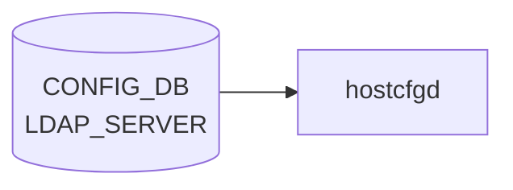

# LDAP_SERVER テーブル

## 概要

LDAP 認証サーバの一覧と global LDAP クライアント設定。`hostcfgd` が [CONFIG_DB](../../reference/glossary.md#term-config_db) を購読し、`/etc/nslcd.conf` を生成する[^1]。最大 8 サーバまで登録可能。

<!-- cdb-mermaid -->
### データフロー (自動生成)



!!! note "凡例"
    CONFIG_DB から SAI までの典型経路を `docs/reference/config-db-orch-map.md` から機械生成したミニ図。詳細・例外は本ページ本文と対応表を参照。
<!-- /cdb-mermaid -->

## key 構造

```text
LDAP_SERVER|<hostname>      # サーバ別エントリ
LDAP|global                 # グローバル設定
```

## LDAP_SERVER

| フィールド | 型 | 既定 | 説明 |
|-----------|----|------|------|
| `priority` | uint8 (1..8) | 1 | サーバ選択優先度 (大きいほど先) |

key の `<hostname>` は `inet:host` (FQDN または IPv4/IPv6 アドレス)。

## LDAP|global

| フィールド | 型 | 既定 | 説明 |
|-----------|----|------|------|
| `bind_dn` | string (1..65) | - | バインド DN |
| `bind_password` | string (1..65, ASCII printable except SPACE/`#`/`,`) | - | バインドパスワード |
| `bind_timeout` | uint16 (1..120) | 5 | バインド timeout [秒] |
| `version` | uint16 (1..3) | 3 | LDAP プロトコルバージョン |
| `base_dn` | string (1..65) | - | ユーザ検索 base DN |
| `port` | inet:port-number | 389 | LDAP サーバポート |
| `timeout` | uint16 (1..60) | - | クエリ timeout [秒] |

<!-- defaults -->
## フィールドデフォルト

デフォルト値は 2 層で決まる: (1) **YANG schema `default` 宣言**（CONFIG_DB に書き込む時点で適用）、(2) **`ldap.py` LdapCfg クラス属性**（hostcfgd が `nslcd.conf` を生成する際の fallback）。

### LDAP_SERVER エントリ

| フィールド | YANG default | LdapCfg fallback | 備考 |
|-----------|-------------|-----------------|------|
| `priority` | **1** | — | CLI `--priority` 省略時に YANG が適用。hostcfgd の priority ソートに必須 |

### LDAP\|global

| フィールド | YANG default | LdapCfg fallback | 備考 |
|-----------|-------------|-----------------|------|
| `bind_timeout` | **5** 秒 | `TIMEOUT_BIND = 5` | 両値一致。nslcd.conf `bind_timelimit 5` に反映 |
| `version` | **3** | `VERSION = '3'` | 両値一致。nslcd.conf `ldap_version 3` に反映 |
| `port` | **389** | `PORT = 389` | 両値一致。URI `ldap://ip:389/` に埋め込まれる |
| `timeout` | なし | `TIMEOUT_SEARCH = 5` 秒 | LdapCfg が `search_timeout` キーで引くため YANG フィールド名 `timeout` との不一致あり[^2] |
| `bind_dn` | なし | `BIND = ''` (空文字) | 未設定時 nslcd.conf に `binddn ` (空) が出力される |
| `bind_password` | なし | `BINDPW = ""` (空文字) | 未設定時 nslcd.conf に `bindpw ` (空) が出力される |
| `base_dn` | なし | `BASE = 'ou=users,dc=example,dc=com'` | 未設定のまま nslcd が起動されることはない (`is_ldap_config_complete` ガード)[^3] |
| `scope` | (YANG にフィールドなし) | `SCOPE = "sub"` | CONFIG_DB から設定不可。nslcd.conf は常に `scope sub` |

> **注**: `hostcfgd` の `ldap_global_default = {}` は空 dict。TACACS/RADIUS と異なり LDAP は hostcfgd 層での追加デフォルト注入を行わない。YANG default と LdapCfg fallback のみが有効。

<!-- /defaults -->

## 購読者

- `hostcfgd` (`docker-config-engine`): [CONFIG_DB](../../reference/glossary.md#term-config_db) → `nslcd` / `nss-pam-ldapd` 設定

## 関連 CONFIG_DB / YANG / CLI

- 関連 [CONFIG_DB](../../reference/glossary.md#term-config_db): `AAA` (login source 順序), `TACPLUS_SERVER`, `RADIUS_SERVER`
- 関連 CLI: `config aaa authentication login`、`config ldap`
- 関連 [YANG](../../reference/glossary.md#term-yang): `sonic-system-ldap`、`sonic-system-aaa`

<!-- ref-triangle:start -->

## 関連リファレンス

- [YANG](../../reference/glossary.md#term-yang): [`sonic-system-ldap`](../yang/sonic-system-ldap.md)
- CLI: [`config aaa`](../cli/config-aaa.md)

<!-- ref-triangle:end -->

## 引用元

[^1]: [YANG](../../reference/glossary.md#term-yang) 定義: `sonic-system-ldap.yang`. <https://github.com/sonic-net/sonic-buildimage/blob/9ea932ec2e18f35e58268ec2e4456b1d4afd65cd/src/sonic-yang-models/yang-models/sonic-system-ldap.yang>
[^2]: `ldap.py:76` `cfg_timeout()` は `_ldapsrvs_conf[0].get('search_timeout', TIMEOUT_SEARCH)` でキーを引く。CONFIG_DB の YANG フィールド名 `timeout` とは異なるため、DB に `timeout` を設定しても `cfg_timeout()` が拾わない可能性がある。実使用では `bind_timeout` (YANG default 5) が `bind_timelimit` として反映される。
[^3]: `hostcfgd:437-441` `is_ldap_config_complete()` は `bind_dn`、`base_dn`、`bind_password` の全てが設定されている場合のみ `True` を返す。いずれか未設定の場合 nslcd は起動されない。

<!-- topics-back-ref -->
## 関連 Topics

- [Topics: Security / AAA / FIPS / Hardening](../../topics/15-security-aaa/index.md)

<!-- /topics-back-ref -->

<!-- ops-hint -->
## 運用ヒント

### 典型値

- key 形式: `LDAP_SERVER|<host>` (例 `LDAP_SERVER|ldap.example.com`)、`LDAP|global`。
- `port=389` (LDAP) / `636` (LDAPS)、`version=3`、`bind_timeout=5`、最大 8 サーバ。

### よくある誤設定

- `bind_password` に SPACE / `#` / `,` を含めて YANG pattern で reject される。
- `base_dn` 未設定で `nslcd` がユーザ検索できず認証失敗。
- 複数 `LDAP_SERVER` の `priority` 重複でフェイルオーバ順序が不定。

### 確認コマンド

```bash
sonic-db-cli CONFIG_DB keys 'LDAP_SERVER|*'
sonic-db-cli CONFIG_DB hgetall 'LDAP|global'
show ldap-server
sudo cat /etc/nslcd.conf
```
<!-- /ops-hint -->

<!-- value-behavior -->
## 値依存挙動マトリクス

このテーブルに strict な enum フィールドはない。数値・文字列フィールドの値で動作が決まる。

### `priority`（LDAP_SERVER）

| 値 | 挙動 |
|----|------|
| 1〜8 | サーバ選択優先度。大きいほど先に試行 |
| 重複値 | CLI 上でチェックなし → nslcd 内部挿入順依存でフェイルオーバ順序が不定 |
| 9 件目以降のサーバ登録 | YANG スキーマ最大数制約で `exit_with_error` 拒否 |

### `port`（LDAP|global）

| 値 | 挙動 |
|----|------|
| `389` | 平文 LDAP |
| `636` | LDAPS（TLS）。`nslcd.conf` の `ssl on` と組み合わせて使用 |

### `version`（LDAP|global）

| 値 | 挙動 |
|----|------|
| `3`（デフォルト） | LDAPv3 を使用（推奨） |
| `1`、`2` | 古い LDAP プロトコルバージョン |

### `bind_password`（文字列制約）

| 値 | 挙動 |
|----|------|
| SPACE / `#` / `,` を含む | YANG pattern 検証で `exit_with_error` → DB に書かれない |
| 正常値 | `/etc/nslcd.conf` の `bindpw` ディレクティブに反映 |

### `base_dn`

| 値 | 挙動 |
|----|------|
| 設定あり | `nslcd.conf` に `base` ディレクティブを書き込み |
| 未設定 | `base` ディレクティブなし → `nslcd` がユーザ検索失敗 → 認証不可 |

<!-- /value-behavior -->

<!-- cdb-exceptions -->
## 例外条件・特殊挙動

<!-- evidence: sonic-utilities/config/plugins/sonic-system-ldap_yang.py -->

| 条件 | 挙動 |
|------|------|
| YANG スキーマ違反（`bind_password` に特殊文字等） | `exit_with_error(f"Error: {err}")` → 処理中断。DB には書かれない |
| `priority` 重複 | CLI 上でチェックなし。重複した場合は nslcd の内部挿入順依存でフェイルオーバ順序が不定になる |
| `base_dn` 未設定 | `nslcd.conf` に `base` ディレクティブが書かれずユーザ検索失敗 → 認証不可。DB には書ける |
| 9 件目以降の `LDAP_SERVER` 追加 | YANG スキーマの最大数制約により `exit_with_error` で拒否 |
| `hostname` に不正 IP / FQDN 形式 | YANG `pattern` 検証 → `exit_with_error` で拒否 |
| `bind_timeout` 未設定 | YANG default `5` 秒が適用。nslcd.conf に `bind_timelimit 5` として反映 |

<!-- /cdb-exceptions -->


<!-- runtime-trace -->
## 実コンテナ動作トレース

### 段階 1 — Consumer 登録

`hostcfgd` の `LdapHandler` が CONFIG_DB の `LDAP_SERVER` テーブルを購読する。

`LDAP_SERVER` の key は LDAP server の IP アドレス。複数サーバをリストで指定可能。`AAA` テーブルで `login` に `ldap` を含む場合に有効。

### 段階 2 — CFG→APPL 翻訳

なし (APPL_DB 中継なし)

### 段階 3 — APPL→SAI

なし (SAI 非経由 — `nslcd` / LDAP クライアント設定を更新)

### 段階 4 — タイミングと副作用

**適用タイミング**: CONFIG_DB 変化を検知後、LDAP クライアント設定ファイルを更新して `nslcd` を再起動。次回 LDAP 認証から新設定が有効。

**副作用**: `nslcd` 再起動中は LDAP 認証が一時中断。既存 SSH session は影響なし (PAM session は認証完了済み)。
<!-- /runtime-trace -->

<!-- entry-points -->
## 書き込み入り口 (Direction A)

対象テーブル: `LDAP_SERVER`

### CLI
- `config ldap add/del <server>`
- `config ldap global <params>`
  - ソース: `sonic-utilities/config/aaa.py (ldap コマンド群)`

### minigraph / sonic-cfggen
- なし

### REST / gNMI (sonic-mgmt-common)
- なし (対応 OpenConfig/SONiC YANG transformer なし)

### db_migrator
- なし

### ビルド時デフォルト (init_cfg / j2 テンプレート)
- なし

### ハードコードデフォルト
- なし

### ランタイム注入 (デーモン自動書き込み)
- なし
<!-- /entry-points -->

<!-- ordering -->
## 書込み順依存 (Phase B)

`hostcfgd` (`AaaCfg`) の `modify_conf_file()` はイベントごとに PAM / NSS / NSLCD 設定を**全部まとめて再生成**する。`is_ldap_config_complete()` が全条件を満たすまで `nslcd` は起動しない。書き込み順序が nslcd の可用性に直結する。

### 検出された順序依存

| # | 依存関係 | 方向 | 緩和策 |
|---|----------|------|--------|
| 1 | `LDAP\|global`（`bind_dn` / `base_dn` / `bind_password`）+ `LDAP_SERVER` エントリ → `AAA` `login=ldap` | **先行必須**（欠如時 nslcd 停止） | 後から設定追加で自動復旧（`ldap_global_update` / `aaa_update` が再評価） |
| 2 | `LDAP_SERVER` → `LDAP\|global` → `AAA` の順で書き込む | 推奨（中間 nslcd 停止回避） | 逆順でも最終的に自動復旧するが nslcd 停止期間が生じる |
| 3 | `LDAP_SERVER` の `priority` 重複 → フェイルオーバ順序不定 | 運用上の注意 | priority 値の一意性を運用ルールで担保 |
| 4 | `LDAP\|global` 未設定時の `LDAP_SERVER` 単体 → `LdapCfg` fallback 値（`example.com` 等）が使われる | 設計上の前提 | `LDAP_SERVER` 追加前に `LDAP\|global` を設定済みにする |
| 5 | load フェーズ内は AAA バッチで一括処理 → 中間状態なし | 自動保証（対策不要） | `AaaCfg.load()` が全テーブルを読んだ後に `modify_conf_file()` を 1 回のみ呼ぶ |

### 主要な制約詳細

**LDAP 先行必須 (依存 #1)**: `is_ldap_config_complete()` は `LDAP|global` の `bind_dn` / `base_dn` / `bind_password` が全て設定済みかつ `LDAP_SERVER` エントリが 1 件以上存在し `AAA|authentication.login` に `ldap` を含む場合のみ `True` を返す。いずれかが欠けた状態で `aaa_update()` が呼ばれると `handle_nslcd_service(False)` が実行され nslcd が停止・mask される（evidence: `hostcfgd:437-442`, `hostcfgd:241-250`）。

**mergeWith による前提 (依存 #4)**: `modify_conf_file()` は `server = ldap_global.copy(); server.update(self.ldap_servers[addr])` で各サーバ設定を構築する。`LDAP|global` が未設定の場合は `LdapCfg` のクラス属性 fallback（`BASE = 'ou=users,dc=example,dc=com'` など）が使われるため、`LDAP_SERVER` のみ先に書いた状態では nslcd 設定が example.com のデフォルト値になる（evidence: `hostcfgd:650-651`, `hostcfgd:706-713`, `ldap.py:8-18`）。

**priority ソートの安定性 (依存 #3)**: `ldapsrvs_conf` は `sorted(..., key=lambda t: int(t['priority']), reverse=True)` で降順ソートされる。Python の `sorted()` は安定ソートだが、同一 priority 値の場合は CONFIG_DB からの取得順（Redis 依存）になるため書き込み順が保証されない（evidence: `hostcfgd:706-713`）。

<!-- /ordering -->

<!-- derivation -->
## 派生・条件付き登録 (Phase 6/7)

> **調査根拠**: `sonic-host-services/scripts/hostcfgd` L.386, L.437-442, L.547-564, L.650-651, L.706-713, L.855-863; `sonic-host-services/scripts/ldap.py` L.8-18  
> 詳細証跡: `meta/_intermediate/cdb-flow/ldap-server-derivation.md`

### Phase 6: 自動派生

hostcfgd は `LDAP_SERVER` テーブルを受信後、`modify_conf_file()` 内で以下の自動補完・派生処理を行う。

**ldap_global_default は空 dict**: `AaaCfg.__init__()` で `self.ldap_global_default = {}` と初期化する (`hostcfgd:386`)。TACACS+ / RADIUS と異なり LDAP は hostcfgd レイヤでのデフォルト注入を行わない。未設定フィールドの fallback は `LdapCfg` クラス属性が担う。

**LdapCfg クラス属性による fallback 補完**: `modify_conf_file()` は Jinja2 テンプレートへ `ldap_cfg=ldap.LdapCfg` を渡す (`hostcfgd:855, 863`)。テンプレートが `ldap_cfg` を参照して CONFIG_DB に値が存在しないフィールドを補完する。

| フィールド | LdapCfg 定数 | fallback 値 | コード |
|-----------|------------|------------|--------|
| `base_dn` | `LdapCfg.BASE` | `'ou=users,dc=example,dc=com'` | `ldap.py:9` |
| `bind_dn` | `LdapCfg.BIND` | `''` (空文字) | `ldap.py:10` |
| `bind_password` | `LdapCfg.BINDPW` | `""` (空文字) | `ldap.py:11` |
| `version` | `LdapCfg.VERSION` | `'3'` | `ldap.py:12` |
| `timeout` (search) | `LdapCfg.TIMEOUT_SEARCH` | `5` | `ldap.py:13` |
| `bind_timeout` | `LdapCfg.TIMEOUT_BIND` | `5` | `ldap.py:14` |
| `port` | `LdapCfg.PORT` | `389` | `ldap.py:15` |
| `scope` | `LdapCfg.SCOPE` | `"sub"` (CONFIG_DB から設定不可) | `ldap.py:16` |

**priority 降順ソートによる nslcd サーバ順序派生**: `ldapsrvs_conf = sorted(ldapsrvs_conf, key=lambda t: int(t['priority']), reverse=True)` でサーバリストを降順ソートし nslcd.conf / ldap.conf へ反映する (`hostcfgd:713`)。YANG default `priority=1` との組み合わせで、単一サーバ登録時も常にソート処理が実行される。

**global → per-server マージ**: `ldap_global = self.ldap_global_default.copy(); ldap_global.update(self.ldap_global)` で global 設定を確定後、各サーバで `server = ldap_global.copy(); server.update(self.ldap_servers[addr])` とマージする (`hostcfgd:650-651, 708-711`)。per-server フィールドが global フィールドを上書きする継承パターン。

### Phase 7: 条件付き登録 (add_manager 条件)

hostcfgd は起動時から `LDAP` / `LDAP_SERVER` テーブルを常時購読する (`hostcfgd:2475-2476`)。ただし `is_ldap_config_complete()` が `True` を返す場合のみ nslcd が起動する。

**`is_ldap_config_complete()` の AND 条件** (`hostcfgd:437-442`):

1. `LDAP|global.bind_dn` が空でない
2. `LDAP|global.base_dn` が空でない
3. `LDAP|global.bind_password` が空でない
4. `AAA|authentication.login` に `ldap` が含まれる
5. `LDAP_SERVER` にエントリが 1 件以上存在する

いずれか未達の場合 `handle_nslcd_service(False)` が呼ばれ nslcd を停止・mask する (`hostcfgd:241-251`)。条件が揃うと `handle_nslcd_service(True)` で nslcd を再起動する（自動復旧）。

<!-- /derivation -->

<!-- cross-refs -->
## 暗黙参照テーブル (Phase C)

> **調査根拠**: `sonic-host-services/scripts/hostcfgd` 全行精読 (2026-05-16)  
> 詳細証跡: `meta/_intermediate/cdb-flow/ldap-server-cross-refs.md`

`LDAP_SERVER` テーブルは YANG leafref を持たないが、`hostcfgd` の `AaaCfg` クラスが以下のテーブルを暗黙参照する。**3 テーブルが揃って初めて nslcd が起動し LDAP 認証が有効になる**。

| 参照先テーブル | DB | 参照方向 | YANG leafref | 実装上の必須度 | 証拠 |
|---|---|---|---|---|---|
| `AAA\|authentication` (`login` フィールド) | CONFIG_DB | 読み取り (`is_ldap_config_complete()` 判定) | なし | **必須** (未設定または `login` に `ldap` なしで nslcd 停止) | `hostcfgd:437-442`, `hostcfgd:241-251` |
| `LDAP\|global` (`bind_dn`, `base_dn`, `bind_password`) | CONFIG_DB | 読み取り (nslcd.conf 生成・completeness チェック) | なし (同一 YANG モジュール内の別コンテナ) | **必須** (未設定で nslcd 停止・`LdapCfg` fallback 値使用) | `hostcfgd:437-442`, `hostcfgd:650-651`, `hostcfgd:706-713` |
| `DEVICE_METADATA\|localhost` (`hostname`) | CONFIG_DB | 読み取り (hostcfgd 初期化時) | なし | 任意 (LDAP 動作への直接影響なし; RADIUS `nas_id` で使用) | `hostcfgd:1422-1496`, `hostcfgd:675-678` |

### AAA|authentication — LDAP 有効化ゲート

`is_ldap_config_complete()` は `'ldap' in self.authentication.get('login', "")` を条件の一つとして評価する (`hostcfgd:441`)。`AAA|authentication.login` に `ldap` が含まれない場合、`LDAP_SERVER` と `LDAP|global` が完全に設定済みであっても `handle_nslcd_service(False)` が呼ばれ nslcd を stop & mask する。**`config aaa authentication login ldap` を実行して AAA テーブルを更新するまで LDAP 認証は機能しない**。

### LDAP|global — nslcd.conf 生成の前提

`modify_conf_file()` は `server = ldap_global.copy(); server.update(self.ldap_servers[addr])` で各サーバのパラメータを合成し `nslcd.conf.j2` / `ldap.conf.j2` テンプレートに渡す (`hostcfgd:706-713`, `hostcfgd:854-863`)。`LDAP|global` が未設定の場合は `ldap_global == {}` → `is_ldap_config_complete()` が即 `False` を返す。推奨設定順序: `LDAP|global` → `LDAP_SERVER` → `AAA|authentication.login=ldap`。

### DEVICE_METADATA|localhost — hostname 取得

hostcfgd 初期化時に `DEVICE_METADATA` から `localhost.hostname` を取得し `self.hostname` に保持する (`hostcfgd:1422-1496`)。この値は RADIUS の `nas_id` に使われるが LDAP の nslcd.conf 生成には直接関与しない。`DEVICE_METADATA|localhost` が未設定でも LDAP 認証は動作する。

### SAI 参照

なし。LDAP 認証は nslcd / PAM のユーザー空間で完結し、APPL_DB 中継も SAI への書き込みも一切ない。

<!-- /cross-refs -->

<!-- failure -->
## 失敗挙動マトリクス (Phase D)

> **調査根拠**: `sonic-host-services/scripts/hostcfgd` L.241-251, L.437-442, L.547-564, L.706-713, L.854-863  
> 詳細証跡: `meta/_intermediate/cdb-flow/ldap-server-failure.md`

### `is_ldap_config_complete()` が False → nslcd stop + mask

`hostcfgd` の `is_ldap_config_complete()` は `bind_dn`・`base_dn`・`bind_password` の全フィールド設定、`AAA|authentication.login` に `ldap` が含まれること、`LDAP_SERVER` エントリが 1 件以上存在することをすべて AND 評価する（`hostcfgd` L.437-442）。いずれかが欠けると `handle_nslcd_service(False)` が呼ばれ、nslcd が `stop` + `mask` される（`hostcfgd` L.247-251）。LDAP 設定が追加・修正された次のイベントで `is_ldap_config_complete()` が再評価され自動復旧する。

### 不正 `priority` による ValueError — modify_conf_file() 中断

`ldapsrvs_conf = sorted(..., key=lambda t: int(t['priority']), reverse=True)` のソート処理で、`priority` フィールドが整数変換不可能な文字列の場合 `int()` が `ValueError` を送出し `modify_conf_file()` 全体が中断される（`hostcfgd` L.713）。`/etc/nslcd.conf` および `/etc/ldap/ldap.conf` は更新されず前回の内容のまま残る。例外はキャッチされず呼び出し元に伝播する（unhandled）。CLI 経由では有効な数値が書き込まれるため通常は発生しないが、`sonic-db-cli` での直接書き込み時に注意が必要。

### generate_file_from_template 失敗 — LOG_ERR のみ・前回設定で nslcd 再起動

`nslcd.conf` / `ldap.conf` の生成は `generate_file_from_template()` 経由で行われる（`hostcfgd` L.855, L.863）。ファイルシステム権限不足・ディスクフル・Jinja2 テンプレートエラーが発生した場合、例外は関数内でキャッチされ `syslog LOG_ERR: 'Failed generate_file_from_template error={e}'` が出力されるが処理は継続する。設定ファイルは更新されず前回の内容のまま残り、その後 `handle_nslcd_service(is_ldap_config_complete())` が呼ばれるため nslcd は**前回の設定で再起動**される。メモリ上の `self.ldap_servers` と nslcd 実行設定が乖離する可能性がある。

### 失敗ケース一覧

| 失敗ケース | トリガー | syslog 出力 | 自動復旧 | evidence |
|---|---|---|---|---|
| `is_ldap_config_complete() == False` | `bind_dn`/`base_dn`/`bind_password` 欠如、`AAA login` に `ldap` なし、`LDAP_SERVER` 空 | LOG_DEBUG "nslcd: deactivating (Ldap disabled)" | 次の LDAP 更新イベントで自動復旧 | `hostcfgd` L.437-442, L.247-251 |
| `priority` 不正値 ValueError | `int(t['priority'])` 変換失敗（直接 DB 書き込み時） | なし（unhandled exception） | なし（手動修正が必要） | `hostcfgd` L.713 |
| `generate_file_from_template` 失敗 | FS 権限不足・ディスクフル・テンプレートエラー | LOG_ERR "Failed generate_file_from_template error={e}" | なし（前回設定で nslcd 再起動） | `hostcfgd` L.200-216, L.855, L.863 |
| `pam_conf` 生成失敗 | `open`/`write`/`rename` エラー（FS 障害等） | 例外伝播（syslog 保証なし） | なし | `hostcfgd` L.716-731 |
| 存在しない key の DEL | `data == {}` + key 未存在 | なし（silent skip） | 不要（副作用なし） | `hostcfgd` L.554-558 |

<!-- /failure -->

<!-- constants -->
## 実装定数一覧 (Phase E)

> **調査根拠**: `sonic-host-services/scripts/ldap.py` 全行精読, `sonic-host-services/scripts/hostcfgd` L.40-43, L.106-107, `sonic-buildimage/src/sonic-yang-models/yang-models/sonic-system-ldap.yang`, `sonic-host-services/data/templates/nslcd.conf.j2`  
> 詳細証跡: `meta/_intermediate/cdb-flow/ldap-server-constants.md`

### LdapCfg クラス定数 (`ldap.py`)

`hostcfgd` は `nslcd.conf` / `ldap.conf` 生成時に `ldap.LdapCfg` を Jinja2 テンプレートへ渡す (`hostcfgd` L.855, L.863)。CONFIG_DB に値が存在しないフィールドはこれらの定数で補完される。

| 定数 | 値 | フィールド対応 | 備考 |
|------|----|----------------|------|
| `LdapCfg.BASE` | `'ou=users,dc=example,dc=com'` | `base_dn` | 未設定時 fallback。`is_ldap_config_complete()` が False を返すため実際には起動しない |
| `LdapCfg.BIND` | `''` (空文字) | `bind_dn` | 未設定時 fallback |
| `LdapCfg.BINDPW` | `""` (空文字) | `bind_password` | 未設定時 fallback |
| `LdapCfg.VERSION` | `'3'` | `version` | YANG default `3` と一致 |
| `LdapCfg.TIMEOUT_SEARCH` | `5` (秒) | `timeout` | YANG フィールド名 `timeout`、LdapCfg は `'search_timeout'` キーで引く |
| `LdapCfg.TIMEOUT_BIND` | `5` (秒) | `bind_timeout` | YANG default `5` と一致 |
| `LdapCfg.PORT` | `389` | `port` | YANG default `389` と一致 |
| `LdapCfg.SCOPE` | `"sub"` | — | CONFIG_DB 非対応。nslcd.conf 常時固定 |
| `LdapCfg.HOST` | `""` | — | サーバ未登録時の URI 文字列 |
| `LdapCfg.IPV6` | `6` | — | `ipaddress.ip_address(ip).version == 6` 判定値 |

モジュールレベル定数 (`ldap.py` L.3-4):

| 定数 | 値 | 備考 |
|------|----|----|
| `TLS1_2` | `"SECURE128:SECURE192:SECURE256:-VERS-TLS1.0:-VERS-DTLS1.0:-VERS-TLS1.1:-SHA1"` | GnuTLS プライオリティ文字列 (TLS 1.2)。現行テンプレートでは未使用 |
| `TLS1_3` | `"SECURE128:SECURE192:SECURE256:-VERS-TLS-ALL:-VERS-DTLS-ALL:+VERS-TLS1.3"` | GnuTLS プライオリティ文字列 (TLS 1.3)。現行テンプレートでは未使用 |

### hostcfgd モジュールレベル定数 (LDAP 関連)

| 定数 | 値 | 用途 |
|------|----|------|
| `LDAP_CONF_TEMPLATE` | `"/usr/share/sonic/templates/ldap.conf.j2"` | `ldap.conf` 生成テンプレートパス (`hostcfgd` L.40) |
| `LDAP_CONF` | `"/etc/ldap/ldap.conf"` | 出力先 `ldap.conf` パス (`hostcfgd` L.41) |
| `NSLCD_CONF_TEMPLATE` | `"/usr/share/sonic/templates/nslcd.conf.j2"` | `nslcd.conf` 生成テンプレートパス (`hostcfgd` L.42) |
| `NSLCD_CONF` | `"/etc/nslcd.conf"` | 出力先 `nslcd.conf` パス (`hostcfgd` L.43) |
| `NSS_CONF` | `"/etc/nsswitch.conf"` | nsswitch.conf パス。`ldap` エントリの追加/削除に使用 (`hostcfgd` L.39) |

### YANG 制約定数

| 制約 | 値 | YANG 宣言 |
|------|----|-----------|
| `LDAP_SERVER_LIST` 最大エントリ数 | **8** | `max-elements 8` |
| `priority` 有効範囲 | 1..8 | `range "1..8"` |
| `bind_timeout` 有効範囲 | 1..120 秒 | `range "1..120"` |
| `version` 有効範囲 | 1..3 | `range "1..3"` |
| `port` 型 | `inet:port-number` (0..65535) | IETF YANG 型 |
| `timeout` 有効範囲 | 1..60 秒 | `range "1..60"` |
| `bind_dn` / `base_dn` / `bind_password` 長さ | 1..65 文字 | `length "1..65"` |
| `bind_password` 使用禁止文字 | SPACE / `#` / `,` | `pattern "[^ #,]*"` |

### nslcd.conf テンプレート固定値

`nslcd.conf.j2` が CONFIG_DB 値に関わらず常時出力する静的フィールド:

| フィールド | 固定値 | 説明 |
|-----------|--------|------|
| `uid` / `gid` | `nslcd` | nslcd デーモンの実行ユーザ/グループ |
| `tls_cacertfile` | `/etc/ssl/certs/ca-certificates.crt` | TLS CA 証明書バンドル |
| `nss_initgroups_ignoreusers` | `ALLLOCAL` | ローカルユーザの initgroups スキップ |
| `nss_min_uid` | `1000` | LDAP 経由で見えるユーザの最小 UID (システムアカウント除外) |

<!-- /constants -->

<!-- side-effects -->
## 副次 DB 書込 (Phase F)

CONFIG_DB `LDAP_SERVER` / `LDAP|global` テーブルの変更に伴って `hostcfgd` の `AaaCfg` ハンドラが副次的に書き込む DB エントリは **存在しない**。副作用はすべて Linux ホスト OS の設定ファイル書き換えおよび `nslcd` サービス再起動に閉じる。

| 副次 DB | 書込有無 | 根拠 |
|---|---|---|
| APPL_DB | なし | `ldap_server_update` / `ldap_global_update` 内に Producer/Table の書込呼出が 0 件 (`sonic-host-services/scripts/hostcfgd:547-564` を `set(`/`hset`/`Producer`/`Notification` で grep して 0 ヒット) |
| STATE_DB | なし | `hostcfgd` の `STATE_DB` 参照は `FipsCfg` (`hostcfgd:1792`) と `RestartWaiter` 用 (`hostcfgd:2160-2163`) のみ。`AaaCfg` は `state_db_conn` を保持しない |
| COUNTERS_DB | なし | `hostcfgd` 全体に COUNTERS_DB 参照なし。LDAP は認証経路のため統計テーブルも存在しない |
| その他 (ASIC_DB / FLEX_COUNTER_DB / LOGLEVEL_DB) | なし | SAI 非経由（実コンテナ動作トレース参照）。`LDAP_SERVER` テーブルを購読する mgrd/orchagent は `sonic-swss/` に存在しない |

### Linux ホスト OS 副作用（ファイル書換とサービス再起動）

`ldap_server_update()` / `ldap_global_update()` は `handle_nslcd_service()` と `modify_conf_file()` を経由して以下を変更する:

| 副作用 | 対象 | 条件 | evidence |
|--------|------|------|----------|
| `nslcd.conf` 再生成 | `/etc/nslcd.conf` | LDAP_SERVER / LDAP\|global 変更時常時 | `hostcfgd` L.43, `handle_nslcd_service()` L.241–251 |
| `nslcd` サービス再起動 | `systemctl restart nslcd` | `is_ldap_config_complete()` = True のとき | `hostcfgd` L.241–244 |
| `nslcd` 停止・mask | `systemctl stop/mask nslcd` | `is_ldap_config_complete()` = False かつ nslcd が enabled のとき | `hostcfgd` L.246–251 |
| `common-auth-sonic` 再生成 (PAM) | `/etc/pam.d/common-auth-sonic` | `AAA.authentication.login` に `ldap` を含む場合 | `hostcfgd` L.28, L.720–731 |
| `common-session` 更新 (PAM mkhomedir) | `/etc/pam.d/common-session` / `/etc/pam.d/common-session-noninteractive` | `ldap` 有効時: `pam_mkhomedir.so` 行を挿入、無効時: 削除 | `hostcfgd` L.44–45, L.733–742 |
| `nsswitch.conf` 更新 (NSS) | `/etc/nsswitch.conf` | `ldap` 優先時: `passwd`/`group`/`shadow` 行に `ldap` を追加；他方式（tacacs+/radius）選択時: `ldap` を削除 | `hostcfgd` L.39, L.770–783 |
| `sshd` / `login` PAM インクルード書換 | `/etc/pam.d/sshd`, `/etc/pam.d/login` | `common-auth-sonic` 存在時に `@include` を `common-auth-sonic` へ切替 | `hostcfgd` L.50–51, L.747–751 |

!!! note "既存 SSH セッションへの影響"
    `nslcd` 再起動中は LDAP 認証が一時中断されるが、既存 SSH セッションは影響なし（PAM session フェーズは認証完了済みのため）。新規ログイン試行のみが中断期間中に失敗する可能性がある。

詳細スキャン手順と grep 結果は `meta/_intermediate/cdb-flow/ldap-server-side-effects.md` を参照。
<!-- /side-effects -->

<!-- pubsub -->
## 通信メカニズム (Phase G)

> **調査根拠**: `sonic-host-services/scripts/hostcfgd` L.2454-2466, L.2475-2476, L.2528, L.2331-2343, L.399-417, L.547-564, L.437-442, L.241-251  
> 詳細証跡: `meta/_intermediate/cdb-flow/ldap-server-pubsub.md`

### Redis 購読方式

`LDAP_SERVER` / `LDAP|global` テーブルへの変更通知は、`hostcfgd` が **`ConfigDBConnector.subscribe()` + `listen()`** で登録する **Redis keyspace 通知 (PSUBSCRIBE `__keyspace@<dbId>__:<TABLE>|*`)** によって配信される。`swsscommon.SubscriberStateTable` や `ConsumerStateTable` (channel ベース PUBLISH/SUBSCRIBE) は**使用しない**。CONFIG_DB は永続前提のため TTL は設定されない。

| 購読者 | 購読 API | 購読テーブル | ハンドラ |
|--------|---------|--------------|---------|
| `hostcfgd` (`AaaCfg` 経由) | `ConfigDBConnector.subscribe()` | `LDAP` | `ldap_global_handler` → `ldap_global_update` |
| `hostcfgd` (`AaaCfg` 経由) | 同上 | `LDAP_SERVER` | `ldap_server_handler` → `ldap_server_update` |

`hostcfgd` 以外で `LDAP_SERVER` テーブルを購読するプロセスは存在しない（`pam_ldap` / `nslcd` は設定ファイルを起動時に読むのみで Redis を購読しない）。

### keyspace 通知 → ハンドラ呼び出しの流れ

```
config ldap add 10.0.0.1
  ↓ HSET "LDAP_SERVER|10.0.0.1" priority "1"
Redis keyspace PUBLISH "__keyspace@4__:LDAP_SERVER|10.0.0.1"  "hset"
  ↓ ConfigDBConnector.listen() がパターンマッチ
make_callback() で (key, op, data) を生成
  ↓ HGETALL "LDAP_SERVER|10.0.0.1"  ← 通知後に値を再取得
ldap_server_handler(key="10.0.0.1", op=SET, data={priority:"1"})
  ↓ AaaCfg.ldap_server_update() → modify_conf_file()
  ↓ nslcd.conf / ldap.conf 再生成 (/etc/nslcd.conf, /etc/ldap/ldap.conf)
  ↓ handle_nslcd_service(is_ldap_config_complete())
```

- keyspace 通知のペイロードは操作名 (`hset`/`del` 等) のみ。フィールド値は `HGETALL` で取得する。
- `op` は `data is None ? DEL : SET` で 2 値判定。`HDEL` / `HSET` の Redis 操作種別自体は区別しない。
- 起動時は `config_db.listen(init_data_handler=self.load)` (hostcfgd:2528) により、Subscribe ループ開始前に `AaaCfg.load()` が `init_data['LDAP']` / `init_data['LDAP_SERVER']` を一括スナップショットで適用する。

### keyspace 通知パターン

| Redis 通知チャンネル | 操作 | hostcfgd 受信 |
|---|---|---|
| `__keyspace@4__:LDAP\|global` | `hset` | `ldap_global_handler("global", SET, {...})` |
| `__keyspace@4__:LDAP\|global` | `del` | `ldap_global_handler("global", DEL, {})` |
| `__keyspace@4__:LDAP_SERVER\|<ip>` | `hset` | `ldap_server_handler("<ip>", SET, {priority:"1",...})` |
| `__keyspace@4__:LDAP_SERVER\|<ip>` | `del` | `ldap_server_handler("<ip>", DEL, {})` |

dbId は CONFIG_DB の通常値 4 (sonic-swss-common の `database_config.json` 既定)。

### サービス再起動トリガー

| 契機 | 操作 | コード |
|------|------|--------|
| `LDAP_SERVER` / `LDAP\|global` 変更で `is_ldap_config_complete()` が True | `systemctl unmask/restart nslcd` | `restart_service("nslcd")` — hostcfgd:241-244 |
| `LDAP_SERVER` / `LDAP\|global` / `AAA` 変更で `is_ldap_config_complete()` が False | `systemctl stop/mask nslcd` | `handle_nslcd_service(False)` — hostcfgd:246-251 |
| `nslcd.conf` / `ldap.conf` 書き換え | デーモン restart あり (`nslcd` は設定をロード時のみ読む) | `modify_conf_file()` → `handle_nslcd_service()` |

> **ConsumerStateTable / NotificationProducer 非使用の確認**: `LDAP_SERVER` は `swsscommon.ConsumerStateTable` の購読者なし。`NotificationProducer` で LDAP 関連通知を出す箇所も SONiC ソース内になし。APPL_DB/STATE_DB の中継・通知パスを持たない。

<!-- /pubsub -->

<!-- platform -->
## プラットフォーム差 (Phase H)

ソース: `sonic-net/sonic-host-services/scripts/hostcfgd`, `sonic-net/sonic-host-services/scripts/ldap.py`, `sonic-net/sonic-buildimage/files/build_templates/sonic_debian_extension.j2`

### 結論

**プラットフォーム差なし**。LDAP_SERVER 処理は host 単位で適用され、ASIC 種別・multi-asic / VOQ chassis 構成・SmartSwitch DPU・ベンダー固有 PAM モジュールに依存しない。

### 根拠

#### 1. multi-asic: `is_multi_npu` は AaaCfg に渡されない

`hostcfgd` 行 2182 で `self.is_multi_npu = device_info.is_multi_npu()` を取得するが、行 2185 の `AaaCfg(self.config_db)` コンストラクタには渡されない。`AaaCfg.__init__` は `ConfigDBConnector` 1 個のみを保持し、`asic0..N` namespace への接続や iteration を一切しない。`LDAP_SERVER` / `LDAP|global` テーブルは host CONFIG_DB のみに置かれ、`asicN` namespace の CONFIG_DB には存在しない（`hostcfgd:2182-2185`）。

#### 2. VOQ chassis / line card

`hostcfgd` ソース全体を `chassis`, `supervisor`, `linecard` で検索してもゼロヒット。VOQ chassis の各 line card / supervisor は独立した host `hostcfgd` を持ち、それぞれが自身の host CONFIG_DB の LDAP_SERVER テーブルを処理する。chassis 全体での集中適用機構は存在しない。オペレータが各 host に同一の LDAP_SERVER 設定を流す運用が前提。

#### 3. SmartSwitch / DPU

`AaaCfg` クラスに `has_per_dpu_scope` や `num_dpus` を参照する箇所はない。SmartSwitch 固有の LDAP 処理分岐は存在しない。

#### 4. ビルド時 platform 条件分岐なし

`sonic_debian_extension.j2` の LDAP 関連インストール部分（行 304–315）に `` 等の条件分岐は存在しない。`libnss-ldapd` / `libpam-ldapd` / `nslcd` は全プラットフォーム共通でインストールされ、デフォルトで masked 状態に設定される。

#### 5. PAM / nslcd 設定にプラットフォーム差なし

`nslcd.conf.j2` テンプレートに `platform`, `asic`, `chassis`, `namespace` キーワードなし。`uid nslcd` / `gid nslcd` / `tls_cacertfile /etc/ssl/certs/ca-certificates.crt` / `nss_min_uid 1000` / `nss_initgroups_ignoreusers ALLLOCAL` は全プラットフォーム固定値（`sonic-host-services/data/templates/nslcd.conf.j2`）。

#### 6. MGMT_VRF は LDAP に影響しない

LDAP_SERVER / LDAP|global テーブルには RADIUS の `vrf` フィールドに相当するフィールドが YANG で定義されていない。`mgmt_vrf_handler` は `MgmtIfaceCfg.update_mgmt_vrf()` のみを呼び、`AaaCfg.modify_conf_file()` は呼ばれない。nslcd の VRF バインドはシステムレベルでの対応が必要だが、hostcfgd はこれを自動化しない（`hostcfgd:2352-2353`）。

> 詳細証跡: `meta/_intermediate/cdb-flow/ldap-server-platform.md`
<!-- /platform -->

<!-- glossary-links-injected: 32758c44ab11 -->
