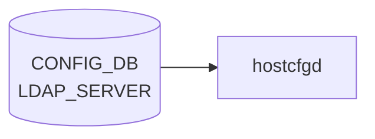

# LDAP_SERVER テーブル

## 概要

LDAP 認証サーバの一覧と global LDAP クライアント設定。`hostcfgd` が [CONFIG_DB](../../reference/glossary.md#term-config_db) を購読し、`/etc/nslcd.conf` を生成する[^1]。最大 8 サーバまで登録可能。

<!-- cdb-mermaid -->
### データフロー (自動生成)



!!! note "凡例"
    CONFIG_DB から SAI までの典型経路を `docs/reference/config-db-orch-map.md` から機械生成したミニ図。詳細・例外は本ページ本文と対応表を参照。
<!-- /cdb-mermaid -->

## key 構造

```text
LDAP_SERVER|<hostname>      # サーバ別エントリ
LDAP|global                 # グローバル設定
```

## LDAP_SERVER

| フィールド | 型 | 既定 | 説明 |
|-----------|----|------|------|
| `priority` | uint8 (1..8) | 1 | サーバ選択優先度 (大きいほど先) |

key の `<hostname>` は `inet:host` (FQDN または IPv4/IPv6 アドレス)。

## LDAP|global

| フィールド | 型 | 既定 | 説明 |
|-----------|----|------|------|
| `bind_dn` | string (1..65) | - | バインド DN |
| `bind_password` | string (1..65, ASCII printable except SPACE/`#`/`,`) | - | バインドパスワード |
| `bind_timeout` | uint16 (1..120) | 5 | バインド timeout [秒] |
| `version` | uint16 (1..3) | 3 | LDAP プロトコルバージョン |
| `base_dn` | string (1..65) | - | ユーザ検索 base DN |
| `port` | inet:port-number | 389 | LDAP サーバポート |
| `timeout` | uint16 (1..60) | - | クエリ timeout [秒] |

<!-- defaults -->
## フィールドデフォルト

デフォルト値は 2 層で決まる: (1) **YANG schema `default` 宣言**（CONFIG_DB に書き込む時点で適用）、(2) **`ldap.py` LdapCfg クラス属性**（hostcfgd が `nslcd.conf` を生成する際の fallback）。

### LDAP_SERVER エントリ

| フィールド | YANG default | LdapCfg fallback | 備考 |
|-----------|-------------|-----------------|------|
| `priority` | **1** | — | CLI `--priority` 省略時に YANG が適用。hostcfgd の priority ソートに必須 |

### LDAP\|global

| フィールド | YANG default | LdapCfg fallback | 備考 |
|-----------|-------------|-----------------|------|
| `bind_timeout` | **5** 秒 | `TIMEOUT_BIND = 5` | 両値一致。nslcd.conf `bind_timelimit 5` に反映 |
| `version` | **3** | `VERSION = '3'` | 両値一致。nslcd.conf `ldap_version 3` に反映 |
| `port` | **389** | `PORT = 389` | 両値一致。URI `ldap://ip:389/` に埋め込まれる |
| `timeout` | なし | `TIMEOUT_SEARCH = 5` 秒 | LdapCfg が `search_timeout` キーで引くため YANG フィールド名 `timeout` との不一致あり[^2] |
| `bind_dn` | なし | `BIND = ''` (空文字) | 未設定時 nslcd.conf に `binddn ` (空) が出力される |
| `bind_password` | なし | `BINDPW = ""` (空文字) | 未設定時 nslcd.conf に `bindpw ` (空) が出力される |
| `base_dn` | なし | `BASE = 'ou=users,dc=example,dc=com'` | 未設定のまま nslcd が起動されることはない (`is_ldap_config_complete` ガード)[^3] |
| `scope` | (YANG にフィールドなし) | `SCOPE = "sub"` | CONFIG_DB から設定不可。nslcd.conf は常に `scope sub` |

> **注**: `hostcfgd` の `ldap_global_default = {}` は空 dict。TACACS/RADIUS と異なり LDAP は hostcfgd 層での追加デフォルト注入を行わない。YANG default と LdapCfg fallback のみが有効。

<!-- /defaults -->

## 購読者

- `hostcfgd` (`docker-config-engine`): [CONFIG_DB](../../reference/glossary.md#term-config_db) → `nslcd` / `nss-pam-ldapd` 設定

## 関連 CONFIG_DB / YANG / CLI

- 関連 [CONFIG_DB](../../reference/glossary.md#term-config_db): `AAA` (login source 順序), `TACPLUS_SERVER`, `RADIUS_SERVER`
- 関連 CLI: `config aaa authentication login`、`config ldap`
- 関連 [YANG](../../reference/glossary.md#term-yang): `sonic-system-ldap`、`sonic-system-aaa`

<!-- ref-triangle:start -->

## 関連リファレンス

- [YANG](../../reference/glossary.md#term-yang): [`sonic-system-ldap`](../yang/sonic-system-ldap.md)
- CLI: [`config aaa`](../cli/config-aaa.md)

<!-- ref-triangle:end -->

## 引用元

[^1]: [YANG](../../reference/glossary.md#term-yang) 定義: `sonic-system-ldap.yang`. <https://github.com/sonic-net/sonic-buildimage/blob/9ea932ec2e18f35e58268ec2e4456b1d4afd65cd/src/sonic-yang-models/yang-models/sonic-system-ldap.yang>
[^2]: `ldap.py:76` `cfg_timeout()` は `_ldapsrvs_conf[0].get('search_timeout', TIMEOUT_SEARCH)` でキーを引く。CONFIG_DB の YANG フィールド名 `timeout` とは異なるため、DB に `timeout` を設定しても `cfg_timeout()` が拾わない可能性がある。実使用では `bind_timeout` (YANG default 5) が `bind_timelimit` として反映される。
[^3]: `hostcfgd:437-441` `is_ldap_config_complete()` は `bind_dn`、`base_dn`、`bind_password` の全てが設定されている場合のみ `True` を返す。いずれか未設定の場合 nslcd は起動されない。

<!-- topics-back-ref -->
## 関連 Topics

- [Topics: Security / AAA / FIPS / Hardening](../../topics/15-security-aaa/index.md)

<!-- /topics-back-ref -->

<!-- ops-hint -->
## 運用ヒント

### 典型値

- key 形式: `LDAP_SERVER|<host>` (例 `LDAP_SERVER|ldap.example.com`)、`LDAP|global`。
- `port=389` (LDAP) / `636` (LDAPS)、`version=3`、`bind_timeout=5`、最大 8 サーバ。

### よくある誤設定

- `bind_password` に SPACE / `#` / `,` を含めて YANG pattern で reject される。
- `base_dn` 未設定で `nslcd` がユーザ検索できず認証失敗。
- 複数 `LDAP_SERVER` の `priority` 重複でフェイルオーバ順序が不定。

### 確認コマンド

```bash
sonic-db-cli CONFIG_DB keys 'LDAP_SERVER|*'
sonic-db-cli CONFIG_DB hgetall 'LDAP|global'
show ldap-server
sudo cat /etc/nslcd.conf
```
<!-- /ops-hint -->

<!-- value-behavior -->
## 値依存挙動マトリクス

このテーブルに strict な enum フィールドはない。数値・文字列フィールドの値で動作が決まる。

### `priority`（LDAP_SERVER）

| 値 | 挙動 |
|----|------|
| 1〜8 | サーバ選択優先度。大きいほど先に試行 |
| 重複値 | CLI 上でチェックなし → nslcd 内部挿入順依存でフェイルオーバ順序が不定 |
| 9 件目以降のサーバ登録 | YANG スキーマ最大数制約で `exit_with_error` 拒否 |

### `port`（LDAP|global）

| 値 | 挙動 |
|----|------|
| `389` | 平文 LDAP |
| `636` | LDAPS（TLS）。`nslcd.conf` の `ssl on` と組み合わせて使用 |

### `version`（LDAP|global）

| 値 | 挙動 |
|----|------|
| `3`（デフォルト） | LDAPv3 を使用（推奨） |
| `1`、`2` | 古い LDAP プロトコルバージョン |

### `bind_password`（文字列制約）

| 値 | 挙動 |
|----|------|
| SPACE / `#` / `,` を含む | YANG pattern 検証で `exit_with_error` → DB に書かれない |
| 正常値 | `/etc/nslcd.conf` の `bindpw` ディレクティブに反映 |

### `base_dn`

| 値 | 挙動 |
|----|------|
| 設定あり | `nslcd.conf` に `base` ディレクティブを書き込み |
| 未設定 | `base` ディレクティブなし → `nslcd` がユーザ検索失敗 → 認証不可 |

<!-- /value-behavior -->

<!-- cdb-exceptions -->
## 例外条件・特殊挙動

<!-- evidence: sonic-utilities/config/plugins/sonic-system-ldap_yang.py -->

| 条件 | 挙動 |
|------|------|
| YANG スキーマ違反（`bind_password` に特殊文字等） | `exit_with_error(f"Error: {err}")` → 処理中断。DB には書かれない |
| `priority` 重複 | CLI 上でチェックなし。重複した場合は nslcd の内部挿入順依存でフェイルオーバ順序が不定になる |
| `base_dn` 未設定 | `nslcd.conf` に `base` ディレクティブが書かれずユーザ検索失敗 → 認証不可。DB には書ける |
| 9 件目以降の `LDAP_SERVER` 追加 | YANG スキーマの最大数制約により `exit_with_error` で拒否 |
| `hostname` に不正 IP / FQDN 形式 | YANG `pattern` 検証 → `exit_with_error` で拒否 |
| `bind_timeout` 未設定 | YANG default `5` 秒が適用。nslcd.conf に `bind_timelimit 5` として反映 |

<!-- /cdb-exceptions -->


<!-- runtime-trace -->
## 実コンテナ動作トレース

### 段階 1 — Consumer 登録

`hostcfgd` の `LdapHandler` が CONFIG_DB の `LDAP_SERVER` テーブルを購読する。

`LDAP_SERVER` の key は LDAP server の IP アドレス。複数サーバをリストで指定可能。`AAA` テーブルで `login` に `ldap` を含む場合に有効。

### 段階 2 — CFG→APPL 翻訳

なし (APPL_DB 中継なし)

### 段階 3 — APPL→SAI

なし (SAI 非経由 — `nslcd` / LDAP クライアント設定を更新)

### 段階 4 — タイミングと副作用

**適用タイミング**: CONFIG_DB 変化を検知後、LDAP クライアント設定ファイルを更新して `nslcd` を再起動。次回 LDAP 認証から新設定が有効。

**副作用**: `nslcd` 再起動中は LDAP 認証が一時中断。既存 SSH session は影響なし (PAM session は認証完了済み)。
<!-- /runtime-trace -->

<!-- entry-points -->
## 書き込み入り口 (Direction A)

対象テーブル: `LDAP_SERVER`

### CLI
- `config ldap add/del <server>`
- `config ldap global <params>`
  - ソース: `sonic-utilities/config/aaa.py (ldap コマンド群)`

### minigraph / sonic-cfggen
- なし

### REST / gNMI (sonic-mgmt-common)
- なし (対応 OpenConfig/SONiC YANG transformer なし)

### db_migrator
- なし

### ビルド時デフォルト (init_cfg / j2 テンプレート)
- なし

### ハードコードデフォルト
- なし

### ランタイム注入 (デーモン自動書き込み)
- なし
<!-- /entry-points -->

<!-- ordering -->
## 書込み順依存 (Phase B)

`hostcfgd` (`AaaCfg`) の `modify_conf_file()` はイベントごとに PAM / NSS / NSLCD 設定を**全部まとめて再生成**する。`is_ldap_config_complete()` が全条件を満たすまで `nslcd` は起動しない。書き込み順序が nslcd の可用性に直結する。

### 検出された順序依存

| # | 依存関係 | 方向 | 緩和策 |
|---|----------|------|--------|
| 1 | `LDAP\|global`（`bind_dn` / `base_dn` / `bind_password`）+ `LDAP_SERVER` エントリ → `AAA` `login=ldap` | **先行必須**（欠如時 nslcd 停止） | 後から設定追加で自動復旧（`ldap_global_update` / `aaa_update` が再評価） |
| 2 | `LDAP_SERVER` → `LDAP\|global` → `AAA` の順で書き込む | 推奨（中間 nslcd 停止回避） | 逆順でも最終的に自動復旧するが nslcd 停止期間が生じる |
| 3 | `LDAP_SERVER` の `priority` 重複 → フェイルオーバ順序不定 | 運用上の注意 | priority 値の一意性を運用ルールで担保 |
| 4 | `LDAP\|global` 未設定時の `LDAP_SERVER` 単体 → `LdapCfg` fallback 値（`example.com` 等）が使われる | 設計上の前提 | `LDAP_SERVER` 追加前に `LDAP\|global` を設定済みにする |
| 5 | load フェーズ内は AAA バッチで一括処理 → 中間状態なし | 自動保証（対策不要） | `AaaCfg.load()` が全テーブルを読んだ後に `modify_conf_file()` を 1 回のみ呼ぶ |

### 主要な制約詳細

**LDAP 先行必須 (依存 #1)**: `is_ldap_config_complete()` は `LDAP|global` の `bind_dn` / `base_dn` / `bind_password` が全て設定済みかつ `LDAP_SERVER` エントリが 1 件以上存在し `AAA|authentication.login` に `ldap` を含む場合のみ `True` を返す。いずれかが欠けた状態で `aaa_update()` が呼ばれると `handle_nslcd_service(False)` が実行され nslcd が停止・mask される（evidence: `hostcfgd:437-442`, `hostcfgd:241-250`）。

**mergeWith による前提 (依存 #4)**: `modify_conf_file()` は `server = ldap_global.copy(); server.update(self.ldap_servers[addr])` で各サーバ設定を構築する。`LDAP|global` が未設定の場合は `LdapCfg` のクラス属性 fallback（`BASE = 'ou=users,dc=example,dc=com'` など）が使われるため、`LDAP_SERVER` のみ先に書いた状態では nslcd 設定が example.com のデフォルト値になる（evidence: `hostcfgd:650-651`, `hostcfgd:706-713`, `ldap.py:8-18`）。

**priority ソートの安定性 (依存 #3)**: `ldapsrvs_conf` は `sorted(..., key=lambda t: int(t['priority']), reverse=True)` で降順ソートされる。Python の `sorted()` は安定ソートだが、同一 priority 値の場合は CONFIG_DB からの取得順（Redis 依存）になるため書き込み順が保証されない（evidence: `hostcfgd:706-713`）。

<!-- /ordering -->

<!-- glossary-links-injected: 32758c44ab11 -->
