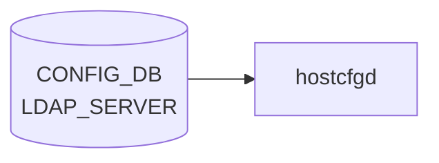

# LDAP_SERVER テーブル

## 概要

LDAP 認証サーバの一覧と global LDAP クライアント設定。`hostcfgd` が [CONFIG_DB](../../reference/glossary.md#term-config_db) を購読し、`/etc/nslcd.conf` を生成する[^1]。最大 8 サーバまで登録可能。

<!-- cdb-mermaid -->
### データフロー (自動生成)



!!! note "凡例"
    CONFIG_DB から SAI までの典型経路を `docs/reference/config-db-orch-map.md` から機械生成したミニ図。詳細・例外は本ページ本文と対応表を参照。
<!-- /cdb-mermaid -->

## key 構造

```text
LDAP_SERVER|<hostname>      # サーバ別エントリ
LDAP|global                 # グローバル設定
```

## LDAP_SERVER

| フィールド | 型 | 既定 | 説明 |
|-----------|----|------|------|
| `priority` | uint8 (1..8) | 1 | サーバ選択優先度 (大きいほど先) |

key の `<hostname>` は `inet:host` (FQDN または IPv4/IPv6 アドレス)。

## LDAP|global

| フィールド | 型 | 既定 | 説明 |
|-----------|----|------|------|
| `bind_dn` | string (1..65) | - | バインド DN |
| `bind_password` | string (1..65, ASCII printable except SPACE/`#`/`,`) | - | バインドパスワード |
| `bind_timeout` | uint16 (1..120) | 5 | バインド timeout [秒] |
| `version` | uint16 (1..3) | 3 | LDAP プロトコルバージョン |
| `base_dn` | string (1..65) | - | ユーザ検索 base DN |
| `port` | inet:port-number | 389 | LDAP サーバポート |
| `timeout` | uint16 (1..60) | - | クエリ timeout [秒] |

## 購読者

- `hostcfgd` (`docker-config-engine`): [CONFIG_DB](../../reference/glossary.md#term-config_db) → `nslcd` / `nss-pam-ldapd` 設定

## 関連 CONFIG_DB / YANG / CLI

- 関連 [CONFIG_DB](../../reference/glossary.md#term-config_db): `AAA` (login source 順序), `TACPLUS_SERVER`, `RADIUS_SERVER`
- 関連 CLI: `config aaa authentication login`、`config ldap`
- 関連 [YANG](../../reference/glossary.md#term-yang): `sonic-system-ldap`、`sonic-system-aaa`

<!-- ref-triangle:start -->

## 関連リファレンス

- [YANG](../../reference/glossary.md#term-yang): [`sonic-system-ldap`](../yang/sonic-system-ldap.md)
- CLI: [`config aaa`](../cli/config-aaa.md)

<!-- ref-triangle:end -->

## 引用元

[^1]: [YANG](../../reference/glossary.md#term-yang) 定義: `sonic-system-ldap.yang`. <https://github.com/sonic-net/sonic-buildimage/blob/9ea932ec2e18f35e58268ec2e4456b1d4afd65cd/src/sonic-yang-models/yang-models/sonic-system-ldap.yang>

<!-- topics-back-ref -->
## 関連 Topics

- [Topics: Security / AAA / FIPS / Hardening](../../topics/15-security-aaa/index.md)

<!-- /topics-back-ref -->

<!-- ops-hint -->
## 運用ヒント

### 典型値

- key 形式: `LDAP_SERVER|<host>` (例 `LDAP_SERVER|ldap.example.com`)、`LDAP|global`。
- `port=389` (LDAP) / `636` (LDAPS)、`version=3`、`bind_timeout=5`、最大 8 サーバ。

### よくある誤設定

- `bind_password` に SPACE / `#` / `,` を含めて YANG pattern で reject される。
- `base_dn` 未設定で `nslcd` がユーザ検索できず認証失敗。
- 複数 `LDAP_SERVER` の `priority` 重複でフェイルオーバ順序が不定。

### 確認コマンド

```bash
sonic-db-cli CONFIG_DB keys 'LDAP_SERVER|*'
sonic-db-cli CONFIG_DB hgetall 'LDAP|global'
show ldap-server
sudo cat /etc/nslcd.conf
```
<!-- /ops-hint -->

<!-- value-behavior -->
## 値依存挙動マトリクス

このテーブルに strict な enum フィールドはない。数値・文字列フィールドの値で動作が決まる。

### `priority`（LDAP_SERVER）

| 値 | 挙動 |
|----|------|
| 1〜8 | サーバ選択優先度。大きいほど先に試行 |
| 重複値 | CLI 上でチェックなし → nslcd 内部挿入順依存でフェイルオーバ順序が不定 |
| 9 件目以降のサーバ登録 | YANG スキーマ最大数制約で `exit_with_error` 拒否 |

### `port`（LDAP|global）

| 値 | 挙動 |
|----|------|
| `389` | 平文 LDAP |
| `636` | LDAPS（TLS）。`nslcd.conf` の `ssl on` と組み合わせて使用 |

### `version`（LDAP|global）

| 値 | 挙動 |
|----|------|
| `3`（デフォルト） | LDAPv3 を使用（推奨） |
| `1`、`2` | 古い LDAP プロトコルバージョン |

### `bind_password`（文字列制約）

| 値 | 挙動 |
|----|------|
| SPACE / `#` / `,` を含む | YANG pattern 検証で `exit_with_error` → DB に書かれない |
| 正常値 | `/etc/nslcd.conf` の `bindpw` ディレクティブに反映 |

### `base_dn`

| 値 | 挙動 |
|----|------|
| 設定あり | `nslcd.conf` に `base` ディレクティブを書き込み |
| 未設定 | `base` ディレクティブなし → `nslcd` がユーザ検索失敗 → 認証不可 |

<!-- /value-behavior -->

<!-- cdb-exceptions -->
## 例外条件・特殊挙動

<!-- evidence: sonic-utilities/config/plugins/sonic-system-ldap_yang.py -->

| 条件 | 挙動 |
|------|------|
| YANG スキーマ違反（`bind_password` に特殊文字等） | `exit_with_error(f"Error: {err}")` → 処理中断。DB には書かれない |
| `priority` 重複 | CLI 上でチェックなし。重複した場合は nslcd の内部挿入順依存でフェイルオーバ順序が不定になる |
| `base_dn` 未設定 | `nslcd.conf` に `base` ディレクティブが書かれずユーザ検索失敗 → 認証不可。DB には書ける |
| 9 件目以降の `LDAP_SERVER` 追加 | YANG スキーマの最大数制約により `exit_with_error` で拒否 |
| `hostname` に不正 IP / FQDN 形式 | YANG `pattern` 検証 → `exit_with_error` で拒否 |
| `bind_timeout` 未設定 | YANG default `5` 秒が適用。nslcd.conf に `bind_timelimit 5` として反映 |

<!-- /cdb-exceptions -->

<!-- glossary-links-injected: 32758c44ab11 -->
