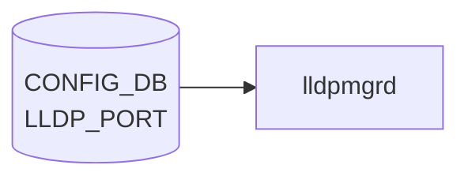

# LLDP_PORT テーブル

## 概要

`LLDP_PORT` は **ポート単位の [LLDP](../../reference/glossary.md#term-lldp) 設定** を保持する [CONFIG_DB](../../reference/glossary.md#term-config_db) テーブル[^1]。`lldp` (lldpd / lldpmgrd) コンテナが [CONFIG_DB](../../reference/glossary.md#term-config_db) から読み、各物理ポートで [LLDP](../../reference/glossary.md#term-lldp) を有効化するか、また RX / TX どちらのモードで動かすかを決める。

`LLDP` (グローバル) テーブルが `hello_time` / `multiplier` / `system_name` / `system_description` 等のシャーシ全体の設定を持つのに対し、本テーブルはポート単位の上書き設定。

<!-- cdb-mermaid -->
### データフロー (自動生成)



!!! note "凡例"
    CONFIG_DB から SAI までの典型経路を `docs/reference/config-db-orch-map.md` から機械生成したミニ図。詳細・例外は本ページ本文と対応表を参照。
<!-- /cdb-mermaid -->

## key 構造

```text
LLDP_PORT|<ifname>
```

- `<ifname>`: `PORT.name` への leafref (例: `Ethernet0`)

## フィールド

| フィールド | 型 | デフォルト | 説明 |
|-----------|----|----------|------|
| `ifname` (key) | leafref → `PORT.name` | - | 対象ポート |
| `enabled` | boolean | `true` | このポートで [LLDP](../../reference/glossary.md#term-lldp) を有効化するか |
| `mode` | enum `RECEIVE`/`TRANSMIT` | - | LLDP フレームの RX/TX モード |

`enabled` と `mode` は `sonic-lldp` の `lldp_mode_config` grouping から `uses` されている共通フィールド。`mode` を省略した場合は lldpd のデフォルト (双方向) で動作する実装が多い。

## 制約

- `ifname` は `PORT_LIST.name` への leafref のため、存在しないポートは validation でエラー。
- `mode` は `RECEIVE` または `TRANSMIT` のみ。`BOTH` などの値は無く、双方向は `mode` を未指定にすることで表現する。

## 購読者

- `lldpmgrd` (`docker-lldp`): [CONFIG_DB](../../reference/glossary.md#term-config_db) → `lldpcli` コマンドに変換し `lldpd` に投入
- `lldpd`: 実際の LLDPDU 送受信

## 関連 CONFIG_DB / YANG / CLI

- 関連 CONFIG_DB: `LLDP` (グローバル設定), `PORT`, `DEVICE_NEIGHBOR` (静的隣接)
- 関連 CLI: `config lldp interface enable/disable`, `show lldp neighbors`, `show lldp table`
- 関連 [YANG](../../reference/glossary.md#term-yang): `sonic-lldp`

<!-- ref-triangle:start -->

## 関連リファレンス

- [YANG](../../reference/glossary.md#term-yang): [`sonic-lldp`](../yang/sonic-lldp.md)
- CLI: `config lldp` / [`show lldp`](../cli/show-lldp.md)

<!-- ref-triangle:end -->

## 引用元

[^1]: [YANG](../../reference/glossary.md#term-yang) 定義: `sonic-lldp.yang` (revision 2021-07-08). <https://github.com/sonic-net/sonic-buildimage/blob/9ea932ec2e18f35e58268ec2e4456b1d4afd65cd/src/sonic-yang-models/yang-models/sonic-lldp.yang>

## 関連ページ
- [YANG: sonic-lldp](../yang/sonic-lldp.md)

<!-- ops-hint -->
## 運用ヒント

### 典型値

- key 形式: `LLDP_PORT|<Ethernet>`。
- `admin_status`: `rx_and_tx`。`description` を物理配線管理用に活用する。

### よくある誤設定

- LLDP を `disabled` にしている port は DEVICE_NEIGHBOR 自動学習されないため minigraph と乖離する。

### 確認コマンド

```bash
sonic-db-cli CONFIG_DB keys 'LLDP_PORT|*'
show lldp table
```
<!-- /ops-hint -->

<!-- defaults -->
## コード由来デフォルト

`LLDP_PORT` の per-port フィールドは YANG `default` 文と lldpmgrd / `lldpd.conf.j2` のハードコードで決まる。

### field: `enabled`

**コード由来デフォルト**: `true` (YANG `default`)

```yang
// sonic-buildimage/src/sonic-yang-models/yang-models/sonic-lldp.yang:24-31
grouping lldp_mode_config {
    leaf enabled {
        type boolean;
        default true;
        description "Enable LLDP on this port";
    }
```

`LLDP_PORT` は `lldp_mode_config` を `uses` するため、フィールド省略時は `true` 扱い。`config lldp interface <port> disable` で `false` に切り替わるまでは LLDP TX/RX が有効。

### field: `mode`

**コード由来デフォルト**: 未設定 (= lldpd 組み込みの双方向 rx+tx)

`sonic-lldp.yang` の `mode` には `default` 文がなく、enum も `RECEIVE` / `TRANSMIT` の 2 値のみ (`BOTH` は存在しない)。`mode` 未指定時は lldpmgrd が `lldpcli configure ports ... lldp status` を発行しないため、lldpd の組み込みデフォルト (双方向送受信) が有効になる。

### field: portidsubtype (per-port の暗黙デフォルト)

**コード由来デフォルト (per-port)**: `local <PORT.alias>` (alias 空時は port name)

```python
# sonic-buildimage/dockers/docker-lldp/lldpmgrd:156
lldpcli_cmd = ["lldpcli", "configure", "ports", port_name, "lldp",
               "portidsubtype", "local", port_alias]
```

`port_alias` は `PORT.alias` を参照し、空/None の場合は `port_name` (例: `Ethernet0`) を fallback (lldpmgrd:147-150)。

**コード由来デフォルト (起動時グローバル)**: `ifname`

```jinja2
{# sonic-buildimage/dockers/docker-lldp/lldpd.conf.j2:30-31 #}
{# Use ifname globally to avoid MAC-as-Port-ID; lldpmgrd sets alias per port later. #}
configure lldp portidsubtype ifname
```

lldpd 起動初期は `ifname` (linux iface 名)、その後 lldpmgrd が CONFIG_DB の `PORT.alias` を読んで per-port で `local <alias>` に上書きする二段構成。

### field: `description`

**コード由来デフォルト**: なし (空のまま `lldpcli` に渡されない)

```python
# sonic-buildimage/dockers/docker-lldp/lldpmgrd:152-162
port_desc = port_table_dict.get("description")
# ...
if port_desc:
    lldpcli_cmd += ["description", port_desc]
else:
    self.log_info("Unable to retrieve description for port '{}'. "
                  "Not adding port description".format(port_name))
```

`description` が空/未設定なら lldpcli の description 引数を省略。lldpd は description 無しで LLDPDU を送信。

### 特殊ポートのスキップ

inband / recirc / backplane prefix を持つポートは `LLDP_PORT` エントリがあっても lldpmgrd が lldpcli への変換をスキップする (`lldpmgrd:141-142`)。CONFIG_DB に書いても lldpd には反映されない。

!!! note "interval / ttl は本テーブルの対象外"
    LLDPDU 送出周期 (`hello_time`) や保持時間 (`multiplier`、ttl = hello_time × multiplier) は per-port ではなく **グローバル `LLDP` テーブル** のフィールド。YANG では `hello_time` の `default 30`、`multiplier` の `default 4` が定義されている (`sonic-lldp.yang:53,66`)。詳細はグローバル `LLDP` テーブルのページを参照。

<!-- /defaults -->

<!-- value-behavior -->
## 値依存挙動マトリクス

### `enabled`

| 値 | 挙動 |
|----|------|
| `true`（デフォルト） | このポートで LLDP フレームの送受信を有効化 |
| `false` | LLDP 送受信を停止。`DEVICE_NEIGHBOR` 自動学習が発生せず minigraph との乖離リスク |

### `mode`

| 値 | 挙動 |
|----|------|
| `RECEIVE` | RX のみ。送信しないため自ノードが対向スイッチのトポロジーに映らない |
| `TRANSMIT` | TX のみ。受信しないため対向の LLDP 情報を学習しない |
| 未設定 | `lldpd` デフォルト（双方向）。`BOTH` 等の値は存在しない |
| 不正値 | `lldpcli` がエラー。CONFIG_DB には書けるが `lldpd` に反映されない |

<!-- /value-behavior -->

<!-- cdb-exceptions -->
## 例外条件・特殊挙動

<!-- evidence: sonic-buildimage/dockers/docker-lldp/lldpmgrd -->

| 条件 | 挙動 |
|------|------|
| `admin_status` に不正値 | `lldpcli configure ports ... lldp status <value>` が失敗。CONFIG_DB にはバリデーションなしで書けるが lldpd には反映されない |
| `admin_status=disabled` | LLDP フレームの送受信停止。`DEVICE_NEIGHBOR` テーブルへの自動学習が発生せず minigraph との乖離が生じる |
| 実在しないポート名でエントリ投入 | lldpd に対応ポートが存在しないため設定無視。エントリは CONFIG_DB に残存 |
| `description` の反映タイミング | lldpmgrd のポーリング周期（数秒）に依存する非同期反映 |

<!-- /cdb-exceptions -->

<!-- runtime-trace -->
## 実コンテナ動作トレース

### 段階 1 — Consumer 登録

`lldpmgrd` が CONFIG_DB の `LLDP_PORT` テーブルを購読する。

`LLDP_PORT` の key は `<port>` (例: `Ethernet0`)。ポート毎の LLDP 動作 (rx/tx/rxtx/disabled) を設定。

### 段階 2 — CFG→APPL 翻訳

なし ([APPL_DB](../../reference/glossary.md#term-appl_db) 中継なし)

### 段階 3 — APPL→SAI

なし ([SAI](../../reference/glossary.md#term-sai) 非経由 — `lldpd` デーモンの設定を更新)

### 段階 4 — タイミングと副作用

**適用タイミング**: CONFIG_DB 変化を `lldpmgrd` が検知後、`lldpcli` コマンドで `lldpd` に設定を注入。即時反映。

**副作用**: LLDP port 設定変更は次回 LLDP PDU 送受信から反映。`lldp_enable` 変更でポート毎に LLDP を有効/無効化可能。
<!-- /runtime-trace -->

<!-- entry-points -->
## 書き込み入り口 (Direction A)

対象テーブル: `LLDP_PORT`

### CLI
- `config lldp <port> enable/disable`
- `config lldp portdesc <port> <description>`
- `config lldp portid-subtype <port> <subtype>`
  - ソース: `sonic-utilities/config/main.py (lldp グループ)`

### minigraph / sonic-cfggen
- あり: `sonic-cfggen -m <minigraph.xml>` 実行時に本テーブルが生成・上書きされる

### REST / gNMI (sonic-mgmt-common)
- [sonic-mgmt](../../reference/glossary.md#term-sonic-mgmt)-common lldp_app.go 経由 (OpenConfig LLDP)

### db_migrator
- なし

### ビルド時デフォルト (init_cfg / j2 テンプレート)
- なし

### ハードコードデフォルト
- なし

### ランタイム注入 (デーモン自動書き込み)
- なし
<!-- /entry-points -->

<!-- ordering -->
## 書込み順序依存 (Phase F)

> 根拠: `dockers/docker-lldp/lldpmgrd`, `src/sonic-yang-models/yang-models/sonic-lldp.yang`

### 依存関係マップ

```
PORT|<ifname>
  └─► LLDP_PORT|<ifname>          （leafref: YANG バリデーション有効時は先行必須）

STATE_DB: PORT_TABLE|<ifname>.netdev_oper_status = "up"
  └─► lldpcli configure ports <ifname> 発行
          （up になるまで pending_cmds にキューイング）

APPL_DB: PORT_TABLE PortInitDone + PortConfigDone
  └─► lldpcli resume              （LLDP PDU 送出開始のゲート）
```

### 書込み順序ルール

| 優先度 | ルール | 根拠 |
|--------|--------|------|
| 必須 | `PORT\|<ifname>` を先に書いてから `LLDP_PORT\|<ifname>` を書く | `sonic-lldp.yang` leafref 制約。lldpcli は存在しない linux netdev に対して失敗する |
| 必須 | ポートの `netdev_oper_status=up` になるまで lldpcli configure ports は発行されない | `lldpmgrd.is_port_up()` が [STATE_DB](../../reference/glossary.md#term-state_db) を確認し、down の場合はスキップして 10 秒後に再チェック |
| 注意 | lldpcli が RETRY_LIMIT=5 回失敗するとポートが pending_cmds から除去される | 再度 [APPL_DB](../../reference/glossary.md#term-appl_db) から PORT イベントが届くまで再設定されない |
| 情報 | `LLDP_PORT.enabled` / `LLDP_PORT.mode` は lldpcli に変換されない | lldpmgrd は `LLDP_PORT` テーブルを直接購読しておらず、これらは dead field |

### タイミング制約

- **`LLDP_PORT` への書き込みは CONFIG_DB に即座に蓄積される**が、lldpd に反映されるのはポートが up になった後。
- **`PortInitDone` + `PortConfigDone` が [APPL_DB](../../reference/glossary.md#term-appl_db) に届くまで（最大 300 秒）LLDP PDU は送出されない**。lldpd は起動直後から `pause` 状態。
- **lldpmgrd は LLDP_PORT テーブルを購読しない**。`enabled` / `mode` フィールドを CONFIG_DB に書いても lldpcli コマンドは発行されず、lldpd に反映されない（構造的 no-op）。

<!-- /ordering -->

<!-- cross-refs -->
## 暗黙参照テーブル (Phase C)

> 根拠: `dockers/docker-lldp/lldpmgrd`, `src/sonic-yang-models/yang-models/sonic-lldp.yang`

`LLDP_PORT` エントリが処理される際に lldpmgrd が暗黙的に参照する他テーブルの依存関係を示す。

| 依存方向 | 参照元フィールド / 参照元 | 参照先テーブル | 参照先キー形式 | 依存内容 | 証跡 |
|---------|------------------------|--------------|--------------|---------|------|
| 順参照（YANG leafref） | `LLDP_PORT.ifname` | `CONFIG_DB: PORT` | `PORT\|<ifname>` | mgmt-framework 経由バリデーション有効時、`PORT` に存在しないインターフェース名は SET 拒否。直接 redis-cli 書き込みはスキップ可だが後続 lldpcli が失敗する | `sonic-lldp.yang:107-110` |
| runtime 読み取り | lldpmgrd 内部 | `CONFIG_DB: PORT` | `PORT\|<ifname>` | `PORT.alias` → lldpcli `portidsubtype local <alias>`、`PORT.description` → lldpcli `description <desc>` に変換。`LLDP_PORT` 自体のフィールドは読まれない | `lldpmgrd:75,140-162` |
| runtime 読み取り（up ゲート） | lldpmgrd `is_port_up()` | `STATE_DB: PORT_TABLE` | `PORT_TABLE\|<ifname>` | `netdev_oper_status=up` になるまで lldpcli configure ports をスキップ（10 秒ループ）。up 後に自動適用 | `lldpmgrd:78,116-134` |
| subscribe + 読み取り | lldpmgrd `lldp_process_port_table_event()` | `APPL_DB: PORT_TABLE` | `PORT_TABLE\|PortInitDone`, `PORT_TABLE\|PortConfigDone` | 両イベント受信まで `lldpcli resume` を保留。resume 前は LLDP PDU が送出されない（最大 300 秒待機） | `lldpmgrd:77,301,259-273` |
| subscribe（間接） | lldpmgrd `lldp_process_device_table_event()` | `CONFIG_DB: DEVICE_METADATA` | `DEVICE_METADATA\|localhost` | `hostname` / `chassis_hostname` → lldpcli system hostname。LLDP_PORT 処理の直接依存ではないが同一デーモン内で管理 | `lldpmgrd:73,319-320` |
| subscribe（間接） | lldpmgrd `lldp_process_mgmt_info_change()` | `CONFIG_DB: MGMT_INTERFACE` | `MGMT_INTERFACE\|<ifname>\|<prefix>` | mgmt IP → lldpcli Management Address TLV 設定。LLDP_PORT 処理の直接依存ではないが同一 event ループで処理 | `lldpmgrd:74,317-318` |

### 解決タイミング

- **PORT leafref 確認**: mgmt-framework 経由 SET 時に即座に確認。直接 redis-cli 書き込み時はスキップされ lldpcli 失敗で検知される。
- **PORT.alias / PORT.description 読み取り**: APPL_DB PORT_TABLE から `oper_status=up` イベントを受信した時点で CONFIG_DB PORT エントリを読み取り、lldpcli コマンドを生成する。
- **[STATE_DB](../../reference/glossary.md#term-state_db) oper_status ゲート**: 10 秒ポーリングで `netdev_oper_status` を再確認。up になると自動で pending_cmds から lldpcli を発行（RETRY_LIMIT=5 超過で silent drop）。
- **PortInitDone / PortConfigDone**: lldpd 起動後に [orchagent](../../reference/glossary.md#term-orchagent) / [portsyncd](../../reference/glossary.md#term-portsyncd) が APPL_DB へ書き込むセンチネルキー。受信後に `lldpcli resume` が発行され LLDP PDU 送出が開始される。

<!-- /cross-refs -->

<!-- failure -->
## 失敗挙動マトリクス (Phase D)

> 根拠: `dockers/docker-lldp/lldpmgrd` (`process_pending_cmds`, `run`)

### 構造的前提

`lldpmgrd` は `LLDP_PORT` テーブルを**直接購読しない**。`LLDP_PORT.enabled` / `LLDP_PORT.mode` は lldpcli に変換されず、CONFIG_DB に書いても lldpd に一切到達しない（構造的 no-op）。lldpmgrd が `lldpcli configure ports <ifname>` を発行するのは `APPL_DB PORT_TABLE` の oper_status イベントを契機として、`CONFIG_DB PORT` テーブルから `alias` / `description` を読んだ場合のみ。

### SET 処理における失敗経路

| 失敗条件 | 検出箇所 | 結果 | [STATE_DB](../../reference/glossary.md#term-state_db) 記録 | evidence |
|---------|---------|------|--------------|---------|
| `LLDP_PORT\|<ifname>` への SET（直接） | — | lldpmgrd はイベントを受信しない（構造的 no-op）。CONFIG_DB には書けるが lldpd に反映されない | なし | `lldpmgrd:300-325` |
| ポートが `netdev_oper_status != up` の状態で PORT oper_status イベント受信 | `process_pending_cmds()` | INFO ログ → コマンドをキューに残し 10 秒後に再チェック | なし | `lldpmgrd:176-179` |
| `lldpcli configure ports <ifname> lldp portidsubtype ...` 失敗（retry 中） | `process_pending_cmds()` | INFO ログ → `failed_count++`、6 秒後に再試行（最大 5 回） | なし | `lldpmgrd:197-200` |
| `lldpcli configure ports <ifname>` 失敗（RETRY_LIMIT=5 回超過） | `process_pending_cmds()` | **ERROR ログ → silent drop**。当該ポートの `portidsubtype` / `description` が lldpd に未反映のまま継続。ポートの alias が LLDPDU に広告されない | なし | `lldpmgrd:193-196` |
| 存在しないポート名で `LLDP_PORT` エントリを投入 | lldpcli 内部 | linux netdev が存在しないため lldpcli がエラー → RETRY_LIMIT 超過で silent drop。CONFIG_DB にはエントリが残存し続ける | なし | `lldpmgrd:168-204` |
| inband / recirc / backplane prefix を持つポートで `LLDP_PORT` 投入 | `generate_pending_lldp_config_cmd_for_port()` | `return`（lldpcli 未発行）。エラーログなし | なし | `lldpmgrd:141-142` |
| `PORT_INIT_TIMEOUT`（300 秒）超過（フロントエンドポートあり） | `check_timeout()` | **ERROR ログ → 強制 `lldpcli resume`**。pending_cmds 未解決のポートは誤 portid を広告する可能性あり | なし | `lldpmgrd:363-368` |

### retry / recovery まとめ

| 失敗種別 | retry | 上限 | 間隔 | recovery 条件 |
|---------|-------|------|------|--------------|
| portidsubtype lldpcli 失敗 | あり | 5 回 | 6 秒 | 5 回超過で silent drop |
| ポート down 待機 | 自動 | なし | 10 秒ループ | `STATE_DB netdev_oper_status=up` 検知 |
| LLDP_PORT 書き込み（enabled/mode） | 構造的 no-op | — | — | なし（lldpmgrd 未購読、設計上 dead field） |
| 存在しないポートへの設定 | 5 回まで | 5 回 | 6 秒 | ポート追加 + 再 PORT oper_status イベント |

<!-- /failure -->

<!-- side-effects -->
## 副次 DB 書込 (Phase F)

> 根拠: `dockers/docker-lldp/lldpmgrd` (全行 grep: `set(` / `hset` / `Producer` / `Notification` / `Table`)

`lldpmgrd` が `LLDP_PORT` に関連する処理で副次的に書き込む DB エントリは **存在しない**。副作用はすべて `lldpcli` コマンド呼び出し（lldpd デーモンへの設定注入）に閉じる。

| 副次 DB | 書込有無 | 根拠 |
|---|---|---|
| APPL_DB | なし | `lldpmgrd` の APPL_DB 接続は `self.appl_db = swsscommon.DBConnector("APPL_DB", ...)` の読み取り専用。`APP_PORT_TABLE` の `SubscriberStateTable` で購読するのみで、Producer / Table.set() を呼ぶコードなし (`lldpmgrd:60-63,77,301`) |
| STATE_DB | なし | `self.state_db` は `is_port_up()` 内の `self.state_port_table.get()` で読み取りのみ。STATE_DB への書込メソッドなし (`lldpmgrd:66-68,78,116-134`) |
| [COUNTERS_DB](../../reference/glossary.md#term-counters_db) | なし | `lldpmgrd` 全体に [COUNTERS_DB](../../reference/glossary.md#term-counters_db) 参照なし |
| [ASIC_DB](../../reference/glossary.md#term-asic_db) / [FLEX_COUNTER_DB](../../reference/glossary.md#term-flex_counter_db) / [LOGLEVEL_DB](../../reference/glossary.md#term-loglevel_db) | なし | [SAI](../../reference/glossary.md#term-sai) 非経由。lldpmgrd は [ASIC_DB](../../reference/glossary.md#term-asic_db) を一切参照しない |

`LLDP_PORT` テーブルを処理する際の唯一の副作用は `subprocess.Popen(["lldpcli", "configure", "ports", ...])` コマンドの発行で、lldpd プロセス内部の設定状態（portidsubtype / description）が更新される。この変更は `STATE_DB` にも `APPL_DB` にも記録されない。

lldp ネイバー情報の STATE_DB への書込は `lldp-syncd` が担当する（`APPL_DB: LLDP_ENTRY_TABLE` 経由）が、これは `LLDP_PORT` の書き込みイベントとは独立した別経路であり、本テーブルの SET に連鎖して発生するものではない。

<!-- /side-effects -->

<!-- constants -->
## ハードコード定数 (Phase E)

> 証跡: `meta/_intermediate/cdb-flow/lldp-port-constants.md`  
> ソース: `dockers/docker-lldp/lldpmgrd`, `dockers/docker-lldp/lldpd.conf.j2`, `src/sonic-yang-models/yang-models/sonic-lldp.yang`

### lldpmgrd Python 定数（LLDP_PORT の retry / timeout 制御）

| 定数名 | 値 | ファイル:行 | 用途 |
|-------|----|-----------|------|
| `PORT_INIT_TIMEOUT` | `300` 秒 | `lldpmgrd:33` | PortInitDone / PortConfigDone 待機上限。超過すると強制 `lldpcli resume` を実行し、未設定ポートの誤 portid 広告リスクがある |
| `FAILED_CMD_TIMEOUT` | `6` 秒 | `lldpmgrd:34` | lldpcli 失敗時の再試行インターバル |
| `RETRY_LIMIT` | `5` 回 | `lldpmgrd:35` | per-port lldpcli の最大再試行回数。超過すると当該ポートの alias/description が lldpd に未反映のまま継続（silent drop） |
| `SELECT_TIMEOUT_MS` | `10000` ms | `lldpmgrd:291` | [Redis](../../reference/glossary.md#term-redis) select ループのタイムアウト。`process_pending_cmds()` の実行周期（約 10 秒）を兼ねる |
| `REDIS_TIMEOUT_MS` | `0` | `lldpmgrd:50` | DBConnector タイムアウト（0 = ブロッキング） |

### lldpd.conf.j2 — per-port portidsubtype ハードコード

コンテナ起動時に `sonic-cfggen` が展開する Jinja2 テンプレートの固定値。

| 設定内容 | 固定値 | ソース行 | 説明 |
|---------|-------|---------|------|
| グローバル portidsubtype 初期値 | `ifname` | `lldpd.conf.j2:31` | 起動時に全フロントエンドポートへ適用。lldpmgrd が後で per-port `local <alias>` に上書きする二段構成 |
| lldpd 起動状態 | `pause` | `lldpd.conf.j2:33` | コンテナ起動直後は LLDP PDU 送出を停止。lldpmgrd の `lldpcli resume` まで継続 |
| eth0 portidsubtype | `local <MGMT_PORT.alias>` / `local eth0` | `lldpd.conf.j2:17-20` | MGMT_PORT に alias が存在する場合は alias を使用、なければポート名 `eth0`。`CONFIG_DB LLDP_PORT` は参照しない |

### YANG default 値（LLDP_PORT フィールド）

`sonic-lldp.yang` の `lldp_mode_config` grouping に定義されているが、`lldpmgrd` は `LLDP_PORT` テーブルを直接購読しないため、これらの YANG default は CONFIG_DB バリデーション上の意味しか持たない。

| フィールド | YANG default | lldpmgrd 読み取り | 実効 |
|-----------|-------------|-----------------|------|
| `enabled` | `true` | 読まれない（dead field） | YANG バリデーション時のみ参照。lldpd の実動作はポート oper_status で間接制御 |
| `mode` | なし（`RECEIVE` / `TRANSMIT` の 2 値のみ） | 読まれない（dead field） | lldpd 組み込みデフォルト（双方向 rx+tx）が有効 |

!!! warning "RETRY_LIMIT 超過は silent drop"
    `lldpcli configure ports <ifname>` が `RETRY_LIMIT=5` 回超えて失敗すると、当該ポートの `portidsubtype` / `description` が lldpd に反映されないまま継続する（`lldpmgrd:193-196`）。ポートの再設定は次回 APPL_DB から oper_status イベントが届くまで再試行されない。

<!-- /constants -->

<!-- pubsub -->
## 通信メカニズム (Phase G)

> **調査根拠**: `dockers/docker-lldp/lldpmgrd` 全行精読 (2026-05-18)  
> 詳細証跡: `meta/_intermediate/cdb-flow/lldp-port-pubsub.md`

`LLDP_PORT` テーブルは **`lldpmgrd` に直接購読されていない**。lldpmgrd が購読するのは `APPL_DB PORT_TABLE`・`CONFIG_DB MGMT_INTERFACE`・`CONFIG_DB DEVICE_METADATA` の 3 テーブルのみであり、`LLDP_PORT` への書き込みは lldpmgrd のイベントループに到達しない。

### 購読メカニズム一覧

| Consumer | メカニズム | 対象テーブル | タイミング |
|----------|-----------|-------------|----------|
| `lldpmgrd` | `swsscommon.SubscriberStateTable` ([Redis](../../reference/glossary.md#term-redis) pub/sub ラッパー) | `APPL_DB: PORT_TABLE` | ランタイム常時購読。`PortInitDone` / `PortConfigDone` + ポート `oper_status` イベントを検知して `lldpcli` コマンドをキューから発行 |
| `lldpmgrd` | `swsscommon.SubscriberStateTable` | `CONFIG_DB: DEVICE_METADATA` | ランタイム常時購読。`localhost.hostname` / `chassis_hostname` 変化を検知して `lldpcli configure system hostname` を発行 |
| `lldpmgrd` | `swsscommon.SubscriberStateTable` | `CONFIG_DB: MGMT_INTERFACE` | ランタイム常時購読。管理 IP 変化を検知して `lldpcli configure system ip management pattern` を更新 |
| `lldpd.conf.j2` | `sonic-cfggen -d`（one-shot 一括読み取り） | `DEVICE_METADATA`, `MGMT_INTERFACE`, `MGMT_PORT` | コンテナ起動時のみ。lldpd の初期設定ファイルを生成 |

### `LLDP_PORT` テーブルが購読されない理由

```python
# lldpmgrd:298-311
sel = swsscommon.Select()

# APPL_DB PORT_TABLE（ポート oper_status + PortInitDone/PortConfigDone）
sst_appdb = swsscommon.SubscriberStateTable(self.appl_db, swsscommon.APP_PORT_TABLE_NAME)
sel.addSelectable(sst_appdb)

# CONFIG_DB MGMT_INTERFACE（管理 IP）
sst_mgmt_ip_confdb = swsscommon.SubscriberStateTable(self.config_db, swsscommon.CFG_MGMT_INTERFACE_TABLE_NAME)
sel.addSelectable(sst_mgmt_ip_confdb)

# CONFIG_DB DEVICE_METADATA（hostname）
sst_device_confdb = swsscommon.SubscriberStateTable(self.config_db, swsscommon.CFG_DEVICE_METADATA_TABLE_NAME)
sel.addSelectable(sst_device_confdb)
# ← LLDP_PORT / LLDP テーブルは登録されていない
```

`LLDP_PORT` への `CONFIG_DB` 書き込みは、lldpmgrd の `Select()` ループに到達しない。`enabled` / `mode` フィールドは **dead field**（詳細は `<!-- constants -->` ブロック参照）。

### ポート alias / description の実際の設定経路

`LLDP_PORT` フィールドではなく、以下の非直感的な経路でポート設定が lldpd に反映される:

1. `portsyncd` / `orchagent` が `APPL_DB PORT_TABLE` に `oper_status=up` を書き込む
2. `lldpmgrd` が `sst_appdb` 経由でイベントを受信 → `lldp_process_port_table_event()` が呼ばれる
3. lldpmgrd が `CONFIG_DB PORT.alias` / `PORT.description` を読み取り `lldpcli configure ports <ifname> lldp portidsubtype local <alias>` を生成
4. ポートが up であれば即時発行、down であれば `pending_cmds` にキューイングして 10 秒後に再試行

### Redis Pub/Sub 使用状況

| メカニズム | 使用有無 | 備考 |
|-----------|---------|------|
| `swsscommon.SubscriberStateTable` | 使用（3 テーブル） | APPL_DB PORT, CONFIG_DB DEVICE_METADATA, MGMT_INTERFACE |
| [Redis](../../reference/glossary.md#term-redis) native keyspace notification (`psubscribe __keyspace@*__:*`) | 不使用 | lldpmgrd は swsscommon ラッパー経由のみ |
| `LLDP_PORT` keyspace 購読 | なし | 設計上未購読。書き込んでも lldpd に反映されない |
| `LLDP\|GLOBAL` keyspace 購読 | なし | 同上 |

<!-- /pubsub -->

<!-- platform -->
## プラットフォーム差 (Phase H)

> 調査対象: `sonic-buildimage/dockers/docker-lldp/lldpmgrd`, `lldpd.conf.j2`, `supervisord.conf.j2`  
> 詳細根拠: `meta/_intermediate/cdb-flow/lldp-port-platform.md`

### ASIC 種別による影響

`LLDP_PORT` の処理は `lldpmgrd`（Python）+ `lldpd`（open-lldp フォーク）のユーザー空間スタックで完結し、[SAI](../../reference/glossary.md#term-sai) を経由しない。ASIC 種別（Broadcom / Mellanox / Marvell / Innovium 等）は `LLDP_PORT` の挙動に影響を与えない。

| 観点 | 結果 | 根拠 |
|------|------|------|
| ASIC 種別 (Broadcom / Mellanox / Marvell 等) | 影響なし | LLDP は SAI 非経由。`lldpmgrd` / `lldpd` は ASIC を直接操作しない |
| multi-asic (namespace あり) | **挙動差あり** | `supervisord.conf.j2` / `lldpd.conf.j2` に `namespace_id` 分岐が存在（下記参照） |
| [VOQ](../../reference/glossary.md#term-voq) chassis | 部分的差異あり | `DEVICE_METADATA.chassis_hostname` 優先解決（System Name TLV のみ影響、LLDP_PORT 処理には非影響） |
| [SmartSwitch](../../reference/glossary.md#term-smartswitch) | 調査対象外 | community master に [SmartSwitch](../../reference/glossary.md#term-smartswitch) 固有 LLDP_PORT 分岐なし |

### multi-asic (namespace) における挙動差

`supervisord.conf.j2` で `namespace_id` の有無により `lldpd` の起動コマンドが変わる:

```jinja2

command=/usr/sbin/lldpd -d -I Ethernet[0-9]* -C Ethernet[0-9]*

command=/usr/sbin/lldpd -d -I Ethernet[0-9]*,eth0 -C eth0

```

- **通常構成（`namespace_id` 未設定）**: eth0（management port）を含む全インタフェースが LLDP 対象。
- **multi-asic / namespace あり**: eth0 を除外。各 namespace（asic0/asic1…）の `lldpd` インスタンスがフロントエンドポートのみを管理する。

`LLDP_PORT|<Ethernet*>` への書き込みに対する `lldpmgrd` の処理ロジック（`generate_pending_lldp_config_cmd_for_port` / `process_pending_cmds`）は namespace の有無によらず同一。ただし multi-asic 構成では `LLDP_PORT` エントリは該当 namespace の CONFIG_DB インスタンスに書く必要がある。

`lldpd.conf.j2` にも同様の分岐があり、namespace 内では eth0 の portidsubtype 設定がスキップされる:

```jinja2

configure ports eth0 lldp portidsubtype local {{ mgmt_if.port_name }}

```

### backplane / inband / recirc インターフェース

`lldpmgrd` は `LLDP_PORT` に書かれていても以下の prefix を持つポートはスキップする（プラットフォーム非依存の共通ロジック）:

```python
# lldpmgrd:141-142
if any([port_name.startswith(inband_prefix()),
        port_name.startswith(recirc_prefix()),
        port_name.startswith(backplane_prefix())]):
    return
```

これらの prefix は `sonic_py_common.interface` が返すプラットフォーム共通値であり、ASIC 種別によらず同一の除外ロジックが適用される。

<!-- /platform -->

<!-- glossary-links-injected: bb2fc1abc72b -->
