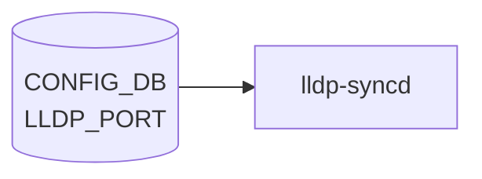

# LLDP_PORT テーブル

## 概要

`LLDP_PORT` は **ポート単位の [LLDP](../../reference/glossary.md#term-lldp) 設定** を保持する [CONFIG_DB](../../reference/glossary.md#term-config_db) テーブル[^1]。`lldp` (lldpd / lldpmgrd) コンテナが CONFIG_DB から読み、各物理ポートで LLDP を有効化するか、また RX / TX どちらのモードで動かすかを決める。

`LLDP` (グローバル) テーブルが `hello_time` / `multiplier` / `system_name` / `system_description` 等のシャーシ全体の設定を持つのに対し、本テーブルはポート単位の上書き設定。

<!-- cdb-mermaid -->
### データフロー (自動生成)



!!! note "凡例"
    CONFIG_DB から SAI までの典型経路を `docs/reference/config-db-orch-map.md` から機械生成したミニ図。詳細・例外は本ページ本文と対応表を参照。
<!-- /cdb-mermaid -->

## key 構造

```
LLDP_PORT|<ifname>
```

- `<ifname>`: `PORT.name` への leafref (例: `Ethernet0`)

## フィールド

| フィールド | 型 | デフォルト | 説明 |
|-----------|----|----------|------|
| `ifname` (key) | leafref → `PORT.name` | - | 対象ポート |
| `enabled` | boolean | `true` | このポートで LLDP を有効化するか |
| `mode` | enum `RECEIVE`/`TRANSMIT` | - | LLDP フレームの RX/TX モード |

`enabled` と `mode` は `sonic-lldp` の `lldp_mode_config` grouping から `uses` されている共通フィールド。`mode` を省略した場合は lldpd のデフォルト (双方向) で動作する実装が多い。

## 制約

- `ifname` は `PORT_LIST.name` への leafref のため、存在しないポートは validation でエラー。
- `mode` は `RECEIVE` または `TRANSMIT` のみ。`BOTH` などの値は無く、双方向は `mode` を未指定にすることで表現する。

## 購読者

- `lldpmgrd` (`docker-lldp`): CONFIG_DB → `lldpcli` コマンドに変換し `lldpd` に投入
- `lldpd`: 実際の LLDPDU 送受信

## 関連 CONFIG_DB / YANG / CLI

- 関連 CONFIG_DB: `LLDP` (グローバル設定), `PORT`, `DEVICE_NEIGHBOR` (静的隣接)
- 関連 CLI: `config lldp interface enable/disable`, `show lldp neighbors`, `show lldp table`
- 関連 [YANG](../../reference/glossary.md#term-yang): `sonic-lldp`

<!-- ref-triangle:start -->

## 関連リファレンス

- YANG: [`sonic-lldp`](../yang/sonic-lldp.md)
- CLI: `config lldp` / [`show lldp`](../cli/show-lldp.md)

<!-- ref-triangle:end -->

## 引用元

[^1]: YANG 定義: `sonic-lldp.yang` (revision 2021-07-08). <https://github.com/sonic-net/sonic-buildimage/blob/9ea932ec2e18f35e58268ec2e4456b1d4afd65cd/src/sonic-yang-models/yang-models/sonic-lldp.yang>

## 関連ページ
- [YANG: sonic-lldp](../yang/sonic-lldp.md)

<!-- ops-hint -->
## 運用ヒント

### 典型値

- key 形式: `LLDP_PORT|<Ethernet>`。
- `admin_status`: `rx_and_tx`。`description` を物理配線管理用に活用する。

### よくある誤設定

- LLDP を `disabled` にしている port は DEVICE_NEIGHBOR 自動学習されないため minigraph と乖離する。

### 確認コマンド

```bash
sonic-db-cli CONFIG_DB keys 'LLDP_PORT|*'
show lldp table
```
<!-- /ops-hint -->

<!-- glossary-links-injected: e5ca7b6a3d0f -->
