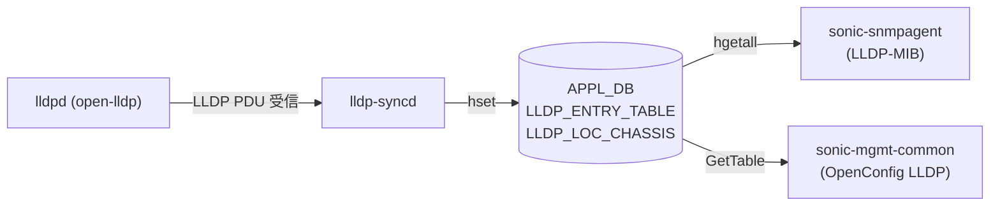

# LLDP_ENTRY_TABLE / LLDP_LOC_CHASSIS テーブル (APPL_DB)

## 概要

`LLDP_ENTRY_TABLE` は **lldp-syncd** が [lldpd](../../reference/glossary.md#term-lldp) の受信 PDU 情報を **APPL_DB** に書き込む、実質的な LLDP neighbor cache テーブル[^1]。CONFIG_DB への書き込みは存在せず、外部からの直接書き込みも行わない。

隣接ノードごとに 1 エントリが作成され、chassis ID / port ID / システム名 / 管理アドレス / 能力 TLV などが格納される。

`LLDP_LOC_CHASSIS` は自ノードのローカル LLDP 情報を保持する単一エントリテーブルで、同様に APPL_DB に存在する[^2]。

<!-- cdb-mermaid -->
### データフロー (自動生成)



!!! note "凡例"
    APPL_DB への書き込みは lldp-syncd のみ。CONFIG_DB 経路なし。
<!-- /cdb-mermaid -->

## key 構造

```text
LLDP_ENTRY_TABLE|<ifname>      # 隣接情報 (per ポート)
LLDP_LOC_CHASSIS               # ローカル chassis 情報 (単一エントリ)
```

- `<ifname>`: 自ノードの受信ポート名 (例: `Ethernet0`, `eth0`)

## フィールド (`LLDP_ENTRY_TABLE|<ifname>`)

| フィールド | 型 | 典型値 | 説明 |
|-----------|----|--------|------|
| `lldp_rem_chassis_id` | string | `"6a:c1:1c:fc:f7:38"` | 隣接ノードの chassis ID |
| `lldp_rem_chassis_id_subtype` | string (int) | `"4"` | chassis ID の subtype (4=MAC, 5=NetworkAddr, 7=Local) |
| `lldp_rem_port_id` | string | `"Ethernet1"` | 隣接ノードの port ID |
| `lldp_rem_port_id_subtype` | string (int) | `"5"` | port ID の subtype (5=InterfaceName, 7=LocallyAssigned) |
| `lldp_rem_port_desc` | string | `""` / `"Port 1/1"` | 隣接ポートの Description TLV |
| `lldp_rem_sys_name` | string | `"ARISTA01T1"` | 隣接ノードのシステム名 |
| `lldp_rem_sys_desc` | string | `"SONiC Software Version..."` | 隣接ノードのシステム説明 |
| `lldp_rem_sys_cap_supported` | string | `"28 00"` | 対応 capability ビットマスク (hex) |
| `lldp_rem_sys_cap_enabled` | string | `"28 00"` | 有効 capability ビットマスク (hex) |
| `lldp_rem_man_addr` | string | `"10.250.2.55"` | 管理アドレス。複数の場合カンマ区切り (IPv4, IPv6) |
| `lldp_rem_time_mark` | string (int) | `"1765"` | SNMP TimeMark (sysUpTime の 10ms 単位) |
| `lldp_rem_index` | string (int) | `"1"` | LLDP-MIB lldpRemIndex |

## フィールド (`LLDP_LOC_CHASSIS`)

| フィールド | 型 | 典型値 | 説明 |
|-----------|----|--------|------|
| `lldp_loc_chassis_id_subtype` | string (int) | `"5"` | ローカル chassis ID subtype |
| `lldp_loc_chassis_id` | string | `"00:11:22:AB:CD:EF"` | ローカル chassis ID |
| `lldp_loc_sys_name` | string | `"SONiC"` | ローカルシステム名 |
| `lldp_loc_sys_desc` | string | `"SONiC Software Version..."` | ローカルシステム説明 |
| `lldp_loc_sys_cap_supported` | string | `"28 00"` | サポート capability ビットマスク (hex) |
| `lldp_loc_sys_cap_enabled` | string | `"28 00"` | 有効 capability ビットマスク (hex) |
| `lldp_loc_man_addr` | string | `"10.224.25.26,fe80::..."` | ローカル管理アドレス (カンマ区切り) |

## 購読者

- `sonic-snmpagent` (`ieee802_1ab.py`) — LLDP-MIB (IEEE 802.1AB) を SNMP で提供
- `sonic-mgmt-common` (`lldp_app.go`) — OpenConfig LLDP を REST / gNMI で提供

## 関連 CONFIG_DB / YANG / CLI

- 関連 CONFIG_DB: `LLDP`, `LLDP_PORT`, `PORT`
- 関連 YANG: `sonic-lldp` (CONFIG_DB 定義), OpenConfig LLDP
- 関連 CLI: `show lldp table`, `show lldp neighbors`

<!-- ref-triangle:start -->

## 関連リファレンス

- [CONFIG_DB: LLDP](lldp.md)
- [CONFIG_DB: LLDP_PORT](lldp-port.md)
- [YANG: sonic-lldp](../yang/sonic-lldp.md)
- CLI: [`show lldp`](../cli/show-lldp.md)

<!-- ref-triangle:end -->

## 引用元

[^1]: sonic-snmpagent `mibs/__init__.py` — `lldp_entry_table()` 関数が `'LLDP_ENTRY_TABLE:' + if_name` (APPL_DB) を返す。<https://github.com/sonic-net/sonic-snmpagent/blob/329f1cc/src/sonic_ax_impl/mibs/__init__.py>
[^2]: sonic-snmpagent `tests/mock_tables/appl_db.json` — LLDP_ENTRY_TABLE / LLDP_LOC_CHASSIS のフィールドセットを確認。<https://github.com/sonic-net/sonic-snmpagent/blob/329f1cc/tests/mock_tables/appl_db.json>

## 関連ページ

- [CONFIG_DB: LLDP](lldp.md)
- [CONFIG_DB: LLDP_PORT](lldp-port.md)

<!-- ops-hint -->
## 運用ヒント

### 典型値

- key 形式: `LLDP_ENTRY_TABLE|Ethernet0`。
- `lldp_rem_chassis_id_subtype`: 通常 `4` (MAC Address)。
- `lldp_rem_man_addr`: IPv4 のみ、または `IPv4,IPv6` カンマ区切り。

### 確認コマンド

```bash
# 隣接テーブル一覧
sonic-db-cli APPL_DB keys 'LLDP_ENTRY_TABLE:*'

# 特定ポートの隣接情報
sonic-db-cli APPL_DB hgetall 'LLDP_ENTRY_TABLE:Ethernet0'

# ローカル chassis 情報
sonic-db-cli APPL_DB hgetall 'LLDP_LOC_CHASSIS'

# CLI での確認
show lldp table
show lldp neighbors Ethernet0
```
<!-- /ops-hint -->

<!-- value-behavior -->
## 値依存挙動マトリクス

### `lldp_rem_chassis_id_subtype`

| 値 | 意味 | 挙動 |
|----|------|------|
| `"4"` | MAC Address | 最多。lldpd デフォルト。SNMP MIB の chassisIdSubtype=macAddress(4) |
| `"5"` | Network Address | IP ベースの chassis ID |
| `"7"` | Locally Assigned | ベンダー独自値。`show lldp` で文字列表示 |

### `lldp_rem_port_id_subtype`

| 値 | 意味 | 挙動 |
|----|------|------|
| `"5"` | Interface Name | SONiC 同士接続で多い |
| `"7"` | Locally Assigned | 一部ベンダー装置 |

### `lldp_rem_man_addr` (複数値)

| 値形式 | 挙動 |
|--------|------|
| `"10.x.x.x"` | IPv4 単一。SNMP の Management Address MIB に直接返す |
| `"10.x.x.x,2001:db8::1"` | カンマ区切り複数。sonic-snmpagent は先頭 IPv4 を優先 |
| `""` (空文字列) | `update_rem_if_mgmt()` が early return。SNMP の Management Address MIB エントリが欠落 |

### `lldp_rem_sys_cap_*` (ビットマスク)

| hex 値 | 解釈 |
|--------|------|
| `"28 00"` | Bridge(bit3) + Router(bit5) が有効 |
| `"00 00"` | capability なし |

<!-- /value-behavior -->

<!-- cdb-exceptions -->
## 例外条件・特殊挙動

<!-- evidence: sonic-snmpagent/src/sonic_ax_impl/mibs/ieee802_1ab.py -->

| 条件 | 挙動 |
|------|------|
| `lldp_rem_man_addr` が空文字列 | `sonic-snmpagent` の `update_rem_if_mgmt()` が early return。そのポートの Management Address SNMP MIB エントリが欠落する |
| `lldp_rem_sys_cap_*` フィールド欠落 | `KeyError` をキャッチし、警告ログ (`0 - b'LLDP_ENTRY_TABLE' missing attribute`) のみ出力。MIB エントリは 0 として返す |
| `lldp_rem_time_mark` が欠落 | `lldp_rem_time_mark` は SNMP TimeMark として使用。欠落時は int 変換に失敗し AttributeError、当該エントリの SNMP 応答が欠落する可能性 |
| lldpd が TTL 切れエントリを削除 | `lldpd` が TTL 超過時に lldp-syncd へ削除通知を送る。lldp-syncd が APPL_DB の当該エントリを削除。SONiC コード側では TTL 管理を行わない |
| ポートが down になった場合 | lldpd がエントリを削除 → lldp-syncd が APPL_DB から削除。`show lldp table` からエントリが消える |

<!-- /cdb-exceptions -->

<!-- runtime-trace -->
## 実コンテナ動作トレース

### 段階 1 — LLDP PDU 受信

`lldpd` (docker-lldp コンテナ) が物理ポートで LLDP PDU を受信し、内部 DB に隣接情報を保持する。

### 段階 2 — APPL_DB への書き込み

`lldp-syncd` が lldpd の JSON イベント (lldpctl -f json) をポーリングし、差分を `APPL_DB:LLDP_ENTRY_TABLE|<ifname>` に `HSET` で書き込む。削除通知受信時は `DEL` を実行。

### 段階 3 — Consumer による読み取り

`sonic-snmpagent` は SNMP walk 時に `APPL_DB:LLDP_ENTRY_TABLE:*` を `hgetall` で読み出し、LLDP-MIB (lldpRemTable, lldpRemManAddrTable) として SNMP エージェントに返す。

`sonic-mgmt-common lldp_app.go` は `processGet` 時に `GetTable(neighTs)` で全エントリを取得し、OpenConfig LLDP YANG モデルにマッピングして REST / gNMI レスポンスを生成する。

### 段階 4 — タイミングと副作用

**書き込みタイミング**: lldpd が PDU 受信後、lldp-syncd のポーリング周期 (デフォルト: lldpd TTL / 4 程度) で APPL_DB に反映。即時ではなく数秒の遅延が生じる場合がある。

**削除タイミング**: lldpd の TTL タイマーが切れると、lldpd が APPL_DB エントリを削除するよう lldp-syncd に通知。デフォルト hold time = 120 秒 (hello 30s × multiplier 4)。

<!-- /runtime-trace -->

<!-- entry-points -->
## 書き込み入り口 (Direction A)

対象テーブル: `LLDP_ENTRY_TABLE`, `LLDP_LOC_CHASSIS`

### 自動書き込み (lldp-syncd)

- `lldp-syncd` が lldpd の出力を購読して APPL_DB に書き込む。外部からの書き込み経路は存在しない

### CLI / REST / gNMI

- 読み取り専用。書き込み不可

### db_migrator

- なし (APPL_DB テーブルのため migrator 対象外)

### ビルド時デフォルト

- なし

<!-- /entry-points -->

<!-- ordering -->
## 書込み順序依存 (Phase B)

> 根拠: `sonic-buildimage/dockers/docker-lldp/supervisord.conf.j2`, `sonic-buildimage/dockers/docker-lldp/lldpmgrd`, `sonic-snmpagent/src/sonic_ax_impl/mibs/ieee802_1ab.py`

### 依存関係マップ

```
lldpd 起動 (open-lldp デーモン)
  └─► waitfor_lldp_ready.sh (UNIX ソケット待機)
        └─► lldp-syncd 起動 (priority=4)
              └─► APPL_DB: LLDP_ENTRY_TABLE / LLDP_LOC_CHASSIS 書き込み開始

LLDP PDU 受信 (物理ポート)
  └─► lldpd 内部 DB 更新
        └─► lldp-syncd ポーリング (lldpctl -f json)
              └─► APPL_DB: LLDP_ENTRY_TABLE|<ifname> hset

APPL_DB: LLDP_ENTRY_TABLE|<ifname> 存在
  └─► sonic-snmpagent (LLDP-MIB hgetall)
  └─► sonic-mgmt-common lldp_app.go (GetTable → REST / gNMI)
```

### 書込み順序ルール

| 優先度 | ルール | 根拠 |
|--------|--------|------|
| 必須 | lldpd が起動し UNIX ソケットが ready になるまで lldp-syncd は開始しない | `supervisord.conf.j2`: lldp-syncd は `waitfor_lldp_ready:exited` を `dependent_startup_wait_for` に指定 |
| 必須 | LLDP PDU が実際に受信されるまで `LLDP_ENTRY_TABLE` にエントリは現れない | エントリ生成は lldpd の PDU 受信イベントに依存。lldp-syncd は polling で差分を書き込む |
| 情報 | `LLDP_LOC_CHASSIS` はローカル情報のため PDU 受信前から書き込まれる | lldp-syncd 起動後に lldpctl でローカル chassis 情報を取得して書き込む |
| 情報 | SNMP / REST は `LLDP_ENTRY_TABLE` を polling で読む。エントリが存在しない間は空結果を返す | sonic-snmpagent の `poll_lldp_entry_updates()` は pubsub で変化を購読する |

### タイミング制約

- **lldp-syncd はポーリング周期で APPL_DB を更新する**。PDU 受信から APPL_DB に反映されるまで数秒の遅延がある。即時性は保証されない。
- **エントリ削除タイミング**: lldpd の TTL タイマー切れ（デフォルト hold time = 30s × 4 = 120 秒）により lldp-syncd が APPL_DB エントリを DEL する。ポートがリンクダウンした場合も同様に削除される。
- **LLDP コンテナ再起動**: lldp-syncd 再起動後は lldpd の全エントリを再スキャンして APPL_DB に書き込む。一時的に `LLDP_ENTRY_TABLE` が空になる可能性がある（再書き込みまでのウィンドウ）。
- **`lldpcli resume` 前は LLDP PDU が送出されない**: `lldpmgrd` が `PortInitDone` + `PortConfigDone` を受信するまで lldpd は pause 状態。この間は自ノードの LLDPDU が送出されないため、対向ノードの `LLDP_ENTRY_TABLE` に自ノードのエントリが現れない（最大 300 秒）。

<!-- /ordering -->

<!-- cross-refs -->
## 暗黙参照テーブル (Phase C)

`LLDP_ENTRY_TABLE` / `LLDP_LOC_CHASSIS` (APPL_DB) の書き手・読み手が参照する他テーブルおよびリソースを整理する。
本テーブルは lldp-syncd が **producer only** として書き込み、sonic-snmpagent / sonic-mgmt-common (lldp_app.go) が読み手として参照する。

| 参照先テーブル / リソース | 参照方向 | 条件 | 参照元 evidence |
|--------------------------|---------|------|----------------|
| `PORT_TABLE` (APPL_DB) | 読み取り: OID→IF マッピング構築 | 常時。`LLDPRemTableUpdater.reinit_data()` が `init_sync_d_interface_tables()` 経由で参照。OID マップ不在ポートの LLDP エントリは SNMP walk に現れない | `ieee802_1ab.py:416-423`, `mibs/__init__.py:276-333` |
| `MGMT_PORT_TABLE` (CONFIG_DB) | 読み取り: 管理ポートの alias 取得 | 管理ポート (`eth0` 等) のみ。データプレーンポートは APPL_DB `PORT_TABLE` 経由 | `ieee802_1ab.py:206-215` |
| `DEVICE_METADATA\|localhost` (CONFIG_DB) | 間接: lldpmgrd → lldpcli → LLDPDU TLV | 常時。`hostname` / `chassis_hostname` 変更時に `lldpcli configure system hostname` を実行。対向ノードの `lldp_rem_sys_name` に伝播 | `lldpmgrd:247-256, 308-310` |
| `MGMT_INTERFACE` (CONFIG_DB) | 間接: lldpmgrd → lldpcli → LLDPDU TLV | 常時。管理 IP 変更時に `lldpcli configure system ip management pattern` を実行。対向ノードの `lldp_rem_man_addr` に伝播 | `lldpmgrd:228-245, 304-306` |
| `PORT_TABLE.alias` (APPL_DB) | 間接: lldpmgrd → lldpcli → LLDPDU TLV | ポート up 時。alias / description を `lldpcli configure ports` で lldpd に設定。対向ノードの `lldp_rem_port_id` に伝播。alias 未設定時はポート名を使用 | `lldpmgrd:136-166, 300-325` |
| `LLDP_LOC_CHASSIS` (APPL_DB) | 直接読み取り: SNMP lldpLocalSystemData | 常時。`LLDPLocalSystemDataUpdater` が `dbs_get_all` で全フィールドを取得して SNMP MIB に返す | `ieee802_1ab.py:114-146, 302-345` |

!!! note "lldp_app.go の参照範囲"
    `sonic-mgmt-common/translib/lldp_app.go` は `LLDP_ENTRY_TABLE` のみを参照する（`neighTs = &db.TableSpec{Name: "LLDP_ENTRY_TABLE"}`）。
    `LLDP_LOC_CHASSIS` は参照せず、OpenConfig LLDP の local chassis 情報はスコープ外。

!!! note "lldpmgrd の間接影響"
    `lldpmgrd` は `LLDP_ENTRY_TABLE` / `LLDP_LOC_CHASSIS` への直接書き込みを行わないが、
    `DEVICE_METADATA` / `MGMT_INTERFACE` / `PORT_TABLE` の変化を lldpd に伝達することで
    lldpd が送出する LLDPDU 内容を制御し、**対向ノードの** APPL_DB に書かれる値を間接的に決定する。

<!-- /cross-refs -->

<!-- defaults -->
## コード由来の暗黙デフォルトと dead field

> 根拠: `sonic-snmpagent/src/sonic_ax_impl/mibs/ieee802_1ab.py`, `sonic-mgmt-common/translib/lldp_app.go`, `sonic-snmpagent/tests/mock_tables/appl_db.json`

### dead field（APPL_DB に書けるが上位レイヤに伝わらないフィールド）

| フィールド | 理由 |
|-----------|------|
| `lldp_rem_time_mark` | sonic-snmpagent の SNMP エージェントは SNMP TimeMark として使用するが、`lldp_app.go` の REST/gNMI パスでは `case LLDP_REMOTE_REM_TIME: /* Ignore Remote System time */` としてコメントアウトされており無視される |
| `lldp_rem_sys_cap_enabled` (lldp_app.go) | `getLldpNeighInfoFromInternalMap()` は capability を `lldpCapTableMap` で別途管理する。`lldp_rem_sys_cap_enabled` / `lldp_rem_sys_cap_supported` は `lldpNeighTableMap` に入るが、switch-case の `default:` に落ちて `"Not a valid attribute!"` と判定され OpenConfig YANG モデルには設定されない。SNMP 経由では正常に提供される |

### 暗黙デフォルトとハードコード固定値

| フィールド / 設定 | 暗黙値 | ソース |
|-----------------|-------|--------|
| `lldp_rem_chassis_id_subtype` | `"4"` (MAC Address) | lldpd デフォルト。SONiC 同士では通常 4 |
| `lldp_rem_port_id_subtype` | `"5"` (Interface Name) | lldpd.conf.j2 で `configure lldp portidsubtype ifname` をハードコード |
| `lldp_rem_port_desc` | `""` (空文字列) | Description TLV が送信されない隣接装置からは空になる。SONiC 側は port alias を portid として送るが Description TLV 自体の送信は構成依存 |
| `lldp_rem_sys_cap_*` の値 `"28 00"` | Bridge + Router | SONiC デフォルトの capability ビットマスク。`28 00` = 0x2800 = bit3(Bridge) + bit5(Router) |
| `lldp_rem_man_addr` 複数値区切り | カンマ `,` | lldp-syncd が IPv4 と IPv6 をカンマ結合して 1 フィールドに格納。SNMP agent は先頭 IPv4 を優先して返す |
| エントリ TTL 管理 | lldpd 依存 | SONiC コードは TTL 計算を行わない。TTL 超過時のエントリ削除は lldpd が lldp-syncd に通知し、lldp-syncd が APPL_DB の DEL を実行 |

### lldp_app.go の capability 処理（dead field の詳細）

`sonic-mgmt-common/translib/lldp_app.go` の `getLldpNeighInfoFromInternalMap()` は LLDP_ENTRY_TABLE の全フィールドを switch-case で処理するが、`LLDP_REMOTE_CAP_ENABLED` / `LLDP_REMOTE_CAP_SUPPORTED` に対応する case が存在しない。これらは `default:` の "Not a valid attribute!" に落ちる。

capability 情報は別途 `lldpCapTableMap` (bool map) として管理され、`Router` / `Bridge` / `Repeater` の 3 種類のみ OpenConfig YANG の `capabilities` リストとして公開される。それ以外の capability type は無視される。

<!-- /defaults -->

<!-- glossary-links-injected: lldp-state-v1 -->
