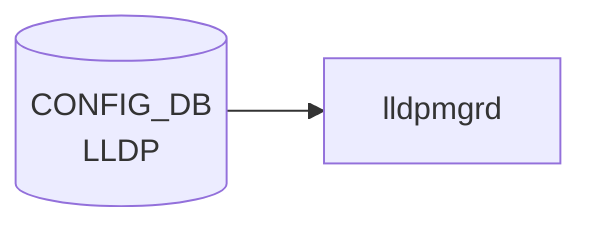

# LLDP / LLDP_PORT テーブル

## 概要

`LLDP` テーブルはシステム全体の [LLDP](../../reference/glossary.md#term-lldp) 設定 (`GLOBAL` キー) を、`LLDP_PORT` テーブルはポート単位の [LLDP](../../reference/glossary.md#term-lldp) 有効化 / モードを保持する[^1]。`lldp-syncd` および `docker-lldp` 内の `lldpd` が [CONFIG_DB](../../reference/glossary.md#term-config_db) を読み出して動作する。

<!-- cdb-mermaid -->
### データフロー (自動生成)



!!! note "凡例"
    CONFIG_DB から SAI までの典型経路を `docs/reference/config-db-orch-map.md` から機械生成したミニ図。詳細・例外は本ページ本文と対応表を参照。
<!-- /cdb-mermaid -->

## key 構造

```text
LLDP|GLOBAL
LLDP_PORT|<ifname>
```

`LLDP` テーブルは `GLOBAL` 単一エントリ（[YANG](../../reference/glossary.md#term-yang) では `container GLOBAL` 直下のスカラー leaf 群）。`LLDP_PORT` は `PORT` への leafref をキーに持つリスト。

| キー | 型 | 説明 |
|------|----|------|
| `GLOBAL` | 固定 | システム全体設定 |
| `ifname` | leafref → `PORT.name` | ポート単位設定 |

## フィールド (`LLDP|GLOBAL`)

| フィールド | 型 | デフォルト | 説明 |
|-----------|----|-----------|------|
| `hello_time` | uint8 (5..254) [秒] | 30 | 周期 hello の間隔 |
| `multiplier` | uint8 (1..10) | 4 | `hello_time × multiplier` がネイバー保持時間 |
| `system_name` | string | — | 管理者割当のシステム名 |
| `system_description` | string | — | システム説明 |
| `supp_mgmt_address_tlv` | boolean | false | Management Address TLV 送信抑制 |
| `supp_system_capabilities_tlv` | boolean | false | System Capabilities TLV 送信抑制 |
| `enabled` | boolean (grouping `lldp_mode_config`) | true | [LLDP](../../reference/glossary.md#term-lldp) 有効化 |
| `mode` | enum `RECEIVE` / `TRANSMIT` | — | RX/TX モード |

## フィールド (`LLDP_PORT|<ifname>`)

grouping `lldp_mode_config` を `uses`:

| フィールド | 型 | デフォルト | 説明 |
|-----------|----|-----------|------|
| `enabled` | boolean | true | ポート単位の LLDP 有効化 |
| `mode` | enum `RECEIVE` / `TRANSMIT` | — | ポート単位の RX/TX モード |

## 制約

- `hello_time` 5..254 秒、`multiplier` 1..10（hold time = hello × multiplier）
- `LLDP_PORT.ifname` は `PORT` への leafref（[VLAN](../../reference/glossary.md#term-vlan) / [PortChannel](../../reference/glossary.md#term-portchannel) 等は対象外）

## 購読者

- `lldp-syncd` (`docker-lldp`) — `lldpd` 設定生成、[STATE_DB](../../reference/glossary.md#term-state_db) への neighbor 反映
- `lldpd` (open-lldp フォーク)

## 関連 CONFIG_DB / YANG / CLI

- 関連 [CONFIG_DB](../../reference/glossary.md#term-config_db): `PORT`、`DEVICE_NEIGHBOR`、`DEVICE_NEIGHBOR_METADATA`
- 関連 [YANG](../../reference/glossary.md#term-yang): `sonic-lldp`、`sonic-port`
- 関連 CLI: `config lldp`、`show lldp`

<!-- failure -->
## 失敗挙動マトリクス (Phase D)

> 根拠: `dockers/docker-lldp/lldpmgrd`

### 構造的前提

`lldpmgrd` は `LLDP` / `LLDP_PORT` テーブルを**直接購読しない**。購読対象は `APPL_DB PORT`（ポート oper_status）、`CONFIG_DB MGMT_INTERFACE`、`CONFIG_DB DEVICE_METADATA` のみ。したがって `LLDP|GLOBAL` や `LLDP_PORT|<ifname>` への書き込みは lldpmgrd に到達せず、エラーログも生成されない（構造的 no-op）。

### SET 処理における失敗経路

| 失敗条件 | 検出箇所 | 結果 | STATE_DB 記録 | evidence |
|---------|---------|------|--------------|---------|
| `hostname` が空文字 / None | `update_hostname()` | WARNING ログ → `return`（lldpcli 未発行） | なし | `lldpmgrd:84-87` |
| `lldpcli configure system hostname` 失敗 | `update_hostname()` | WARNING ログ → `self.hostname` 未更新。次回 DEVICE_METADATA イベントまで再試行なし | なし | `lldpmgrd:90-96` |
| `lldpcli configure system ip management pattern` 失敗 | `update_mgmt_addr()` | WARNING ログ → `self.mgmt_ip` 未更新。次回 MGMT_INTERFACE イベントまで再試行なし | なし | `lldpmgrd:109-114` |
| ポートが `netdev_oper_status != up` | `process_pending_cmds()` | INFO ログ → コマンドをキューに残し 10 秒後に再チェック | なし | `lldpmgrd:176-179` |
| `lldpcli configure ports <ifname>` 失敗（retry 中） | `process_pending_cmds()` | INFO ログ → `failed_count++`、6 秒後に再試行（最大 5 回） | なし | `lldpmgrd:197-200` |
| `lldpcli configure ports <ifname>` 失敗（5 回超過） | `process_pending_cmds()` | **ERROR ログ → silent drop**。当該ポートの `portidsubtype`/`description` が lldpd に未反映のまま継続 | なし | `lldpmgrd:193-196` |
| `lldpcli resume` 失敗 | `run()` | **ERROR ログ → `sys.exit(1)`**。supervisord がプロセス再起動。lldpd は `pause` 状態のまま PDU 送出停止 | なし | `lldpmgrd:340-341` |
| `PORT_INIT_TIMEOUT`（300 秒）超過 かつフロントエンドポートあり | `check_timeout()` | **ERROR ログ → 強制 `lldpcli resume`**。未設定ポートが誤 portid を広告する可能性あり | なし | `lldpmgrd:363-368` |
| `PORT_INIT_TIMEOUT` 超過 かつフロントエンドポート不在 | `check_timeout()` | ログなし（silent timeout）→ 強制 resume | なし | `lldpmgrd:365` |
| `LLDP\|GLOBAL` / `LLDP_PORT\|<ifname>` への書き込み | — | **lldpmgrd はイベントを受信しない（構造的 no-op）**。CONFIG_DB には書けるが lldpd に一切反映されない | なし | `lldpmgrd:300-325` |

### retry / recovery まとめ

| 失敗種別 | retry | 上限 | 間隔 | recovery 条件 |
|---------|-------|------|------|--------------|
| hostname lldpcli 失敗 | なし | — | — | 次回 DEVICE_METADATA 変化 |
| mgmt IP lldpcli 失敗 | なし | — | — | 次回 MGMT_INTERFACE 変化 |
| portidsubtype lldpcli 失敗 | あり | 5 回 | 6 秒 | 5 回超過で silent drop |
| ポート down 待機 | 自動 | なし | 10 秒ループ | ポート up 検知 |
| `lldpcli resume` 失敗 | supervisord 再起動後に再試行 | — | — | lldpmgrd 再起動 |
| LLDP/LLDP_PORT 書き込み | 構造的 no-op | — | — | なし（設計上未購読） |

<!-- /failure -->

<!-- cross-refs -->
## 暗黙参照 — `lldpmgrd` が読み出す関連テーブル (Phase C)

`lldpmgrd` は `LLDP` / `LLDP_PORT` テーブルを**直接購読しない**。LLDP の実際の動作を制御するのは以下の暗黙参照テーブルである（根拠: `dockers/docker-lldp/lldpmgrd` および `lldpd.conf.j2`）。

### CONFIG_DB: 購読テーブル (SubscriberStateTable)

| テーブル | handler | 用途 | evidence |
|---|---|---|---|
| [`DEVICE_METADATA`](device-metadata.md) (`localhost`) | `lldp_process_device_table_event()` | `chassis_hostname` / `hostname` フィールドを読み取り `lldpcli configure system hostname <name>` を発行。ランタイムの hostname 変化を追従する | lldpmgrd:308,320-322 |
| [`MGMT_INTERFACE`](mgmt-interface.md) | `lldp_process_mgmt_info_change()` | 管理 IP (IPv4 優先、次点 IPv6) の変化を検知して `lldpcli configure system ip management pattern <ip>` を更新 | lldpmgrd:305,317-319 |

### APPL_DB: 購読テーブル

| テーブル | handler | 用途 | evidence |
|---|---|---|---|
| `APPL_DB: PORT_TABLE` | `lldp_process_port_table_event()` | `PortInitDone` / `PortConfigDone` イベントで `lldpcli resume` を制御。ポート `oper_status=up` を検知して `lldpcli configure ports <ifname>` をキューから実行 | lldpmgrd:301,259-273 |

### CONFIG_DB / STATE_DB: 読み取りテーブル (Table.get / getKeys)

| テーブル | 参照箇所 | 用途 | evidence |
|---|---|---|---|
| [`PORT`](port.md) (`alias`, `description`) | `generate_pending_lldp_config_cmd_for_port()` | ポートエイリアス (`portidsubtype local <alias>`) と description を lldpcli コマンドに埋め込む。alias 未設定時はポート名で代替 | lldpmgrd:75,148-164 |
| `STATE_DB: PORT_TABLE` (`netdev_oper_status`) | `is_port_up()` | ポートが `up` になるまで lldpcli コマンドをキューイングし、up 後に発行 | lldpmgrd:78,122-134 |
| [`MGMT_INTERFACE`](mgmt-interface.md) | `lldp_get_mgmt_ip()` — `mgmt_table.getKeys()` | DEL イベント時に残存する管理 IP を再決定するためのフォールバック検索 | lldpmgrd:76,206-226 |

### 起動時テンプレート参照 (`lldpd.conf.j2`)

コンテナ起動時に `sonic-cfggen` が展開する Jinja2 テンプレートが読み取るテーブル。

| テーブル | 用途 | evidence |
|---|---|---|
| [`MGMT_INTERFACE`](mgmt-interface.md) | IPv4/IPv6 アドレス抽出 → `configure system ip management pattern <ip>` | lldpd.conf.j2:2-28 |
| [`MGMT_PORT`](mgmt-port.md) | eth0 の `alias` が存在すれば `configure ports eth0 lldp portidsubtype local <alias>` に使用 | lldpd.conf.j2:17-21 |
| [`DEVICE_METADATA`](device-metadata.md) (`localhost.hostname`) | 起動時の `configure system hostname <name>` 生成 | lldpd.conf.j2:29 |

> `LLDP|GLOBAL` / `LLDP_PORT|<ifname>` への書き込みは lldpmgrd に到達しない（構造的 no-op）。実質的に LLDP の送出内容を制御するのは上記の暗黙参照テーブルである（詳細は `<!-- failure -->` および `<!-- defaults -->` ブロック参照）。
<!-- /cross-refs -->

<!-- ref-triangle:start -->

## 関連リファレンス

- [YANG](../../reference/glossary.md#term-yang): [`sonic-lldp`](../yang/sonic-lldp.md)
- CLI: `config lldp`

<!-- ref-triangle:end -->

## 引用元

[^1]: YANG 定義: `sonic-lldp.yang`. <https://github.com/sonic-net/sonic-buildimage/blob/9ea932ec2e18f35e58268ec2e4456b1d4afd65cd/src/sonic-yang-models/yang-models/sonic-lldp.yang>

## 関連ページ
- [CONFIG_DB: DEVICE_NEIGHBOR](device-neighbor.md)
- [CONFIG_DB: PORT](port.md)

<!-- ops-hint -->
## 運用ヒント

### 典型値

- key 形式: `LLDP|GLOBAL`。
- `hello_timer`: 10、`mode`: `receive` / `transmit-and-receive`。

### よくある誤設定

- `mode: receive` のみだと対向 LLDP に自身が見えず、トポロジ把握が崩れる。

### 確認コマンド

```bash
sonic-db-cli CONFIG_DB hgetall 'LLDP|GLOBAL'
show lldp table
```
<!-- /ops-hint -->

<!-- value-behavior -->
## 値依存挙動マトリクス

### `mode`（LLDP|GLOBAL および LLDP_PORT）

| 値 | 挙動 |
|----|------|
| `RECEIVE` | RX のみ。自ノードの LLDP TLV を送出しない。対向スイッチのトポロジービューに当該ノードが映らない |
| `TRANSMIT` | TX のみ。受信しないため対向の LLDP 情報を学習しない |
| 未設定 | `lldpd` デフォルト（双方向 tx_and_rx）。`BOTH` 等の値は存在しない |
| 不正値 | `lldpcli` がエラー → `lldpd` に反映されない |

### `enabled`

| 値 | 挙動 |
|----|------|
| `true`（デフォルト） | LLDP 有効 |
| `false` | LLDP 無効 |

### `hello_time`（uint8 5..254）

| 値 | 挙動 |
|----|------|
| 5〜254 秒 | hold time = hello_time × multiplier で計算 |
| 0 または負 | `lldpd` がデフォルト 30 秒で動作。YANG バリデーション有効時は reject |

### TLV 抑制 boolean フィールド

| フィールド | `false`（デフォルト） | `true` |
|-----------|----------------------|--------|
| `supp_mgmt_address_tlv` | Management Address TLV を送信 | Management Address TLV を抑制 |
| `supp_system_capabilities_tlv` | System Capabilities TLV を送信 | System Capabilities TLV を抑制 |

<!-- /value-behavior -->

<!-- cdb-exceptions -->
## 例外条件・特殊挙動

<!-- evidence: sonic-buildimage/dockers/docker-lldp/lldpmgrd -->

| 条件 | 挙動 |
|------|------|
| `mode` に不正値 | `lldpcli` が不正コマンドエラー。CONFIG_DB には書けるが lldpd に反映されない |
| `hello_timer` が 0 または負 | lldpd がデフォルト 30 秒で動作。YANG バリデーション有効時は mgmt-framework 経由で拒否 |
| `mode=rx_only` / `receive` 設定 | 自ノードの LLDP TLV を送出しない。対向スイッチのトポロジービューに当該ノードが映らなくなる |
| `LLDP\|GLOBAL` エントリが存在しない | lldpd がデフォルト設定（hello=30s, mode=tx_and_rx）で起動。エントリ削除後は再起動後にデフォルトへ戻る |

<!-- /cdb-exceptions -->


<!-- runtime-trace -->
## 実コンテナ動作トレース

### 段階 1 — Consumer 登録

`lldpmgrd` が CONFIG_DB の `LLDP` テーブルを購読する。

`LLDP` の key は `GLOBAL` (単一エントリ)。system description / hello timer 等のグローバルパラメータ。

### 段階 2 — CFG→APPL 翻訳

なし (APPL_DB 中継なし)

### 段階 3 — APPL→SAI

なし (SAI 非経由 — `lldpd` デーモンのグローバル設定)

### 段階 4 — タイミングと副作用

**適用タイミング**: CONFIG_DB 変化を `lldpmgrd` が検知後、`lldpcli` でグローバル設定を注入。即時反映。

**副作用**: global LLDP 設定変更 (system description / chassis ID 等) は次回 LLDP PDU 送信から反映。隣接機器の LLDP テーブルが更新されるまで時間がかかる。
<!-- /runtime-trace -->

<!-- entry-points -->
## 書き込み入り口 (Direction A)

対象テーブル: `LLDP`

### CLI
- `config lldp global txinterval <n>`
- `config lldp global sysdescr <desc>`
- `config lldp global sysdescr-type <type>`
  - ソース: `sonic-utilities/config/main.py (lldp グループ)`

### minigraph / sonic-cfggen
- あり: `sonic-cfggen -m <minigraph.xml>` 実行時に本テーブルが生成・上書きされる

### REST / gNMI (sonic-mgmt-common)
- sonic-mgmt-common lldp_app.go 経由 (OpenConfig LLDP)

### db_migrator
- なし

### ビルド時デフォルト (init_cfg / j2 テンプレート)
- なし

### ハードコードデフォルト
- なし

### ランタイム注入 (デーモン自動書き込み)
- なし
<!-- /entry-points -->

<!-- defaults -->
## コード由来の暗黙デフォルトと dead field

> 根拠: `dockers/docker-lldp/lldpmgrd`, `lldpd.conf.j2`, `lldpdSysDescr.conf.j2`, `sonic-lldp.yang`

### dead field（CONFIG_DB に書けるが lldpd に伝わらないフィールド）

| フィールド | 理由 |
|-----------|------|
| `multiplier` | `lldpmgrd` も `lldpd.conf.j2` も lldpcli/conf に inject しない。lldpd 自体のデフォルト hold-multiplier = 4 で偶然一致するが、変更しても反映されない |
| `system_name` | `lldpmgrd` は `DEVICE_METADATA\|localhost` の `hostname` / `chassis_hostname` を直接 `lldpcli configure system hostname` に渡す。`LLDP\|GLOBAL.system_name` は読まれない |
| `system_description` | 起動時に `lldpdSysDescr.conf.j2` が `SONiC Software Version: SONiC.<ver> - HwSku: <sku> - Distribution: Debian <ver> - Kernel: <ver>` 形式でハードコード生成する。CONFIG_DB の値は無視される |
| `supp_mgmt_address_tlv` | `lldpmgrd` に読み取りパスなし。Management IP 制御は `MGMT_INTERFACE` テーブル + `lldpmgrd.update_mgmt_addr()` の別経路 |
| `supp_system_capabilities_tlv` | `lldpmgrd` に読み取りパスなし |
| `LLDP\|GLOBAL.enabled` | `lldpmgrd` は `LLDP|GLOBAL` テーブルを購読しない。lldpd の起動停止はコンテナ制御に委ねられる |
| `LLDP\|GLOBAL.mode` | 同上。未設定時 lldpd デフォルト = 双方向 (tx_and_rx) |
| `LLDP_PORT.enabled` | `lldpmgrd` は `LLDP_PORT` テーブルを購読しない（ポートの on/off は APP_DB PORT の oper_status 経由で間接制御） |
| `LLDP_PORT.mode` | 同上 |

### 暗黙デフォルトとハードコード固定値

| フィールド / 設定 | 暗黙値 | ソース |
|-----------------|-------|--------|
| `hello_time` 未設定 | 30 秒 | lldpd ハードコード（YANG default と一致） |
| `multiplier` 未設定 | 4 | lldpd ハードコード（YANG default と一致だが CONFIG_DB 変更は無効） |
| system description | `SONiC Software Version: SONiC.<ver> - HwSku: <sku> - Distribution: Debian <ver> - Kernel: <ver>` | `lldpdSysDescr.conf.j2` 起動時展開 |
| portidsubtype (global) | `ifname` | `lldpd.conf.j2` でハードコード (`configure lldp portidsubtype ifname`) |
| eth0 portidsubtype | `MGMT_PORT.alias` なければ `eth0` | `lldpd.conf.j2` |
| Management IP | MGMT_INTERFACE の IPv4 優先、なければ IPv6 | `lldpd.conf.j2` + `lldpmgrd.update_mgmt_addr()` |
| LLDP PDU 送信 | コンテナ起動直後は `pause` 状態 | `lldpd.conf.j2` 末尾 `pause` 命令。全ポート設定完了後に `lldpmgrd` が `lldpcli resume` を発行 |

### ポート設定の書込み順依存・retry 挙動

`lldpmgrd` はポートごとの `lldpcli configure ports <ifname> lldp portidsubtype local <alias>` コマンドを、**PORT が `oper_status=up` になるまでキューイング**する。コマンド失敗時は `RETRY_LIMIT=5` 回まで `FAILED_CMD_TIMEOUT=6` 秒間隔で再試行し、超過すると **silent drop**（ログのみ出力、lldpd への alias/description 未反映で継続）。

起動タイムアウト `PORT_INIT_TIMEOUT=300` 秒に達すると `PortInitDone` / `PortConfigDone` 待ちを強制完了し `lldpcli resume` を実行する。フロントエンドポートが存在しない場合（`device_info.is_frontend_port_present_in_host()` が False）はエラーログなしでタイムアウト処理される。

<!-- /defaults -->

<!-- ordering -->
## 書込み順序依存

### 依存関係マップ

```
PORT|<ifname>
  └─► LLDP_PORT|<ifname>          （leafref: YANG バリデーション有効時は先行必須）

DEVICE_METADATA|localhost
  └─► lldpd 起動時 hostname 設定  （lldpd.conf.j2 テンプレート展開時）
  └─► lldpmgrd ランタイム反映     （CONFIG_DB 購読、後追い自動更新）

MGMT_INTERFACE|<ifname>|<prefix>
  └─► Management Address TLV      （lldpd.conf.j2 + lldpmgrd ランタイム反映）

APPL_DB: PORT_TABLE PortInitDone + PortConfigDone
  └─► lldpcli resume              （LLDP PDU 送出開始のゲート）

STATE_DB: PORT_TABLE|<ifname>.netdev_oper_status = "up"
  └─► LLDP_PORT|<ifname> 反映    （up になるまで lldpcli configure ports はスキップ）
```

### 書込み順序ルール

| 優先度 | ルール | 根拠 |
|--------|--------|------|
| 必須 | `PORT\|<ifname>` を先に書いてから `LLDP_PORT\|<ifname>` を書く | sonic-lldp.yang leafref 制約; lldpcli は存在しない linux netdev に対して失敗する |
| 必須 | `DEVICE_METADATA\|localhost.hostname` を minigraph / sonic-cfggen で先に投入してから lldpd コンテナを起動する | lldpd.conf.j2 テンプレートが起動時に hostname を読む |
| 推奨 | `MGMT_INTERFACE` を LLDP 設定より先に書く | 管理 IP を含む Management Address TLV を正しく送出するため |
| 推奨 | `LLDP\|GLOBAL` を `LLDP_PORT\|<ifname>` より先に書く | グローバル設定が先に lldpd に届くことで設定の階層が明確になる（違反しても即時障害は軽微） |
| 注意 | `lldpcli` コマンドが RETRY_LIMIT=5 回失敗するとポートが pending から除去される | PORT イベントが再度来るまで再適用されない; 正しいポート設定を確認してから LLDP_PORT を書くこと |

### タイミング制約

- **lldpd コンテナ起動前の CONFIG_DB 書込みは問題ない**。lldpmgrd は起動後に CONFIG_DB を購読して追いつく。
- **lldpcli resume 前は LLDP PDU が送出されない**。`PortInitDone` + `PortConfigDone` の両イベントが APPL_DB に届くまで（最大 300 秒）lldpd は pause 状態。
- **netdev が up になるまで LLDP_PORT のポートエイリアス設定は保留**される。ポートがリンクダウン状態で LLDP_PORT を書いても、リンクアップ後に自動適用される（RETRY_LIMIT 超過前に限る）。

<!-- /ordering -->

<!-- glossary-links-injected: 9d2a20a8f03b -->
