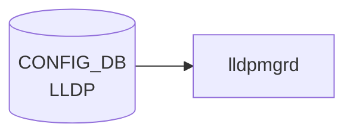

# LLDP / LLDP_PORT テーブル

## 概要

`LLDP` テーブルはシステム全体の [LLDP](../../reference/glossary.md#term-lldp) 設定 (`GLOBAL` キー) を、`LLDP_PORT` テーブルはポート単位の [LLDP](../../reference/glossary.md#term-lldp) 有効化 / モードを保持する[^1]。`lldp-syncd` および `docker-lldp` 内の `lldpd` が [CONFIG_DB](../../reference/glossary.md#term-config_db) を読み出して動作する。

<!-- cdb-mermaid -->
### データフロー (自動生成)



!!! note "凡例"
    CONFIG_DB から SAI までの典型経路を `docs/reference/config-db-orch-map.md` から機械生成したミニ図。詳細・例外は本ページ本文と対応表を参照。
<!-- /cdb-mermaid -->

## key 構造

```text
LLDP|GLOBAL
LLDP_PORT|<ifname>
```

`LLDP` テーブルは `GLOBAL` 単一エントリ（[YANG](../../reference/glossary.md#term-yang) では `container GLOBAL` 直下のスカラー leaf 群）。`LLDP_PORT` は `PORT` への leafref をキーに持つリスト。

| キー | 型 | 説明 |
|------|----|------|
| `GLOBAL` | 固定 | システム全体設定 |
| `ifname` | leafref → `PORT.name` | ポート単位設定 |

## フィールド (`LLDP|GLOBAL`)

| フィールド | 型 | デフォルト | 説明 |
|-----------|----|-----------|------|
| `hello_time` | uint8 (5..254) [秒] | 30 | 周期 hello の間隔 |
| `multiplier` | uint8 (1..10) | 4 | `hello_time × multiplier` がネイバー保持時間 |
| `system_name` | string | — | 管理者割当のシステム名 |
| `system_description` | string | — | システム説明 |
| `supp_mgmt_address_tlv` | boolean | false | Management Address TLV 送信抑制 |
| `supp_system_capabilities_tlv` | boolean | false | System Capabilities TLV 送信抑制 |
| `enabled` | boolean (grouping `lldp_mode_config`) | true | [LLDP](../../reference/glossary.md#term-lldp) 有効化 |
| `mode` | enum `RECEIVE` / `TRANSMIT` | — | RX/TX モード |

## フィールド (`LLDP_PORT|<ifname>`)

grouping `lldp_mode_config` を `uses`:

| フィールド | 型 | デフォルト | 説明 |
|-----------|----|-----------|------|
| `enabled` | boolean | true | ポート単位の LLDP 有効化 |
| `mode` | enum `RECEIVE` / `TRANSMIT` | — | ポート単位の RX/TX モード |

## 制約

- `hello_time` 5..254 秒、`multiplier` 1..10（hold time = hello × multiplier）
- `LLDP_PORT.ifname` は `PORT` への leafref（[VLAN](../../reference/glossary.md#term-vlan) / [PortChannel](../../reference/glossary.md#term-portchannel) 等は対象外）

## 購読者

- `lldp-syncd` (`docker-lldp`) — `lldpd` 設定生成、[STATE_DB](../../reference/glossary.md#term-state_db) への neighbor 反映
- `lldpd` (open-lldp フォーク)

## 関連 CONFIG_DB / YANG / CLI

- 関連 [CONFIG_DB](../../reference/glossary.md#term-config_db): `PORT`、`DEVICE_NEIGHBOR`、`DEVICE_NEIGHBOR_METADATA`
- 関連 [YANG](../../reference/glossary.md#term-yang): `sonic-lldp`、`sonic-port`
- 関連 CLI: `config lldp`、`show lldp`

<!-- ref-triangle:start -->

## 関連リファレンス

- [YANG](../../reference/glossary.md#term-yang): [`sonic-lldp`](../yang/sonic-lldp.md)
- CLI: `config lldp`

<!-- ref-triangle:end -->

## 引用元

[^1]: YANG 定義: `sonic-lldp.yang`. <https://github.com/sonic-net/sonic-buildimage/blob/9ea932ec2e18f35e58268ec2e4456b1d4afd65cd/src/sonic-yang-models/yang-models/sonic-lldp.yang>

## 関連ページ
- [CONFIG_DB: DEVICE_NEIGHBOR](device-neighbor.md)
- [CONFIG_DB: PORT](port.md)

<!-- ops-hint -->
## 運用ヒント

### 典型値

- key 形式: `LLDP|GLOBAL`。
- `hello_timer`: 10、`mode`: `receive` / `transmit-and-receive`。

### よくある誤設定

- `mode: receive` のみだと対向 LLDP に自身が見えず、トポロジ把握が崩れる。

### 確認コマンド

```bash
sonic-db-cli CONFIG_DB hgetall 'LLDP|GLOBAL'
show lldp table
```
<!-- /ops-hint -->

<!-- cdb-exceptions -->
## 例外条件・特殊挙動

<!-- evidence: sonic-buildimage/dockers/docker-lldp/lldpmgrd -->

| 条件 | 挙動 |
|------|------|
| `mode` に不正値 | `lldpcli` が不正コマンドエラー。CONFIG_DB には書けるが lldpd に反映されない |
| `hello_timer` が 0 または負 | lldpd がデフォルト 30 秒で動作。YANG バリデーション有効時は mgmt-framework 経由で拒否 |
| `mode=rx_only` / `receive` 設定 | 自ノードの LLDP TLV を送出しない。対向スイッチのトポロジービューに当該ノードが映らなくなる |
| `LLDP\|GLOBAL` エントリが存在しない | lldpd がデフォルト設定（hello=30s, mode=tx_and_rx）で起動。エントリ削除後は再起動後にデフォルトへ戻る |

<!-- /cdb-exceptions -->

<!-- glossary-links-injected: 9d2a20a8f03b -->
