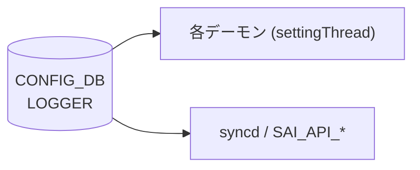

# LOGGER テーブル

## 概要

`LOGGER` テーブルは、SONiC の各デーモン（`orchagent`、`syncd` 等）および SAI API コンポーネント（`SAI_API_*`）のログ verbosity と出力先を [CONFIG_DB](../../reference/glossary.md#term-config_db) に保持する[^1]。各プロセスは起動時に `Logger::linkToDbNative()` / `linkToDb()` で自分のエントリを DB に登録し、以降 `settingThread` がテーブル変更を購読してリアルタイムに loglevel を変更する。

<!-- cdb-mermaid -->
### データフロー (自動生成)



!!! note "凡例"
    CONFIG_DB から各デーモンへの典型経路。詳細・例外は本ページ本文を参照。
<!-- /cdb-mermaid -->

## key 構造

```text
LOGGER|<component>
```

`<component>` はコンポーネント名（例: `orchagent`、`syncd`、`SAI_API_LAG`）。SAI コンポーネントは `SAI_API_` プレフィクスを持つ。

## フィールド

| フィールド | 型 | デフォルト | 説明 |
|-----------|----|-----------|------|
| `LOGLEVEL` | enum (swss または SAI) | `NOTICE` / `SAI_LOG_LEVEL_NOTICE` | ログ verbosity。swss コンポーネント: `EMERG`/`ALERT`/`CRIT`/`ERROR`/`WARN`/`NOTICE`/`INFO`/`DEBUG`。SAI コンポーネント: `SAI_LOG_LEVEL_CRITICAL`/`ERROR`/`WARN`/`NOTICE`/`INFO`/`DEBUG` |
| `LOGOUTPUT` | enum `SYSLOG`/`STDOUT`/`STDERR` | `SYSLOG` | ログ出力先。YANG `default SYSLOG` |
| `require_manual_refresh` | boolean | なし（省略可） | `true` の場合、loglevel 変更に SIGHUP が必要。未設定時は false 相当 |

<!-- defaults -->
## コード由来デフォルト (Phase A)

### `LOGLEVEL`

- **swss コンポーネント**: デフォルト `"NOTICE"`
  - 根拠: `sonic-swss-common/common/loglevel.h:4` — `#define DEFAULT_LOGLEVEL "NOTICE"`
  - `logger.cpp:linkToDbNative()` のデフォルト引数: `const char * defPrio="NOTICE"`[^2]
  - DB に `LOGLEVEL` キーが存在しない場合、`defPrio` の値でエントリを初期書き込みする（`logger.cpp:132-149`）
- **SAI コンポーネント (`SAI_API_*`)**: デフォルト `"SAI_LOG_LEVEL_NOTICE"`
  - 根拠: `sonic-swss-common/common/loglevel.h:5` — `#define SAI_DEFAULT_LOGLEVEL "SAI_LOG_LEVEL_NOTICE"`
  - `swssloglevel -d` 実行時は全 SAI コンポーネントを `SAI_LOG_LEVEL_NOTICE` にリセット（`loglevel.cpp:168-169`）
- **invalid 値フォールバック**: 未知の文字列が書き込まれた場合、`swssPrioNotify()` は `"NOTICE"` にフォールバックしてエラーログを出力（`logger.cpp:83-84`）

### `LOGOUTPUT`

- デフォルト: `"SYSLOG"`
- 根拠 (コード): `logger.cpp:161` — `linkToDb()` は `linkToDbWithOutput(...)` に固定値 `"SYSLOG"` を渡す
- 根拠 (YANG): `sonic-logger.yang:69` — `default SYSLOG;`
- 内部初期値: `logger.h:162` — `std::atomic<Output> m_output = { SWSS_SYSLOG };`
- **invalid 値フォールバック**: 未知の文字列が書き込まれた場合、`swssOutputNotify()` は `SWSS_SYSLOG` にフォールバック（`logger.cpp:105-106`）

### `require_manual_refresh`

- YANG に `default` 節なし
- `settingThread` は `LOGLEVEL`/`LOGOUTPUT` のみ購読し、`require_manual_refresh` を直接読むコードは `sonic-swss-common` 内に確認できない
- 未設定時は false 相当（SIGHUP 不要）として動作する
<!-- /defaults -->

## 制約

- `LOGLEVEL` は `mandatory true`（YANG）。エントリ作成時に必須
- swss コンポーネントと SAI コンポーネントで loglevel の enum 型が異なる（`swss_loglevel` vs `sai_loglevel`）
- `swssloglevel` ツール（`-s` フラグ）で SAI コンポーネントを区別して操作可能

## 購読者

- **各デーモン** (`orchagent`、`syncd` 等): `Logger::settingThread()` が `CFG_LOGGER_TABLE_NAME` を `SubscriberStateTable` で購読し、`LOGLEVEL`/`LOGOUTPUT` 変更をリアルタイム反映
- **`swssloglevel` コマンド**: `sonic-swss-common/common/loglevel.cpp` — CLI から `LOGGER` テーブルを直接書き込む

## 関連 CONFIG_DB / YANG / CLI

- 関連 YANG: `sonic-logger`
- 関連 CLI: `swssloglevel -l <level> -c <component>`、`swssloglevel -p`（登録済みコンポーネント一覧）

<!-- ref-triangle:start -->

## 関連リファレンス

- [YANG: sonic-logger](../yang/sonic-logger.md)

<!-- ref-triangle:end -->

## 引用元

[^1]: `src/sonic-yang-models/yang-models/sonic-logger.yang` (container `LOGGER`). <https://github.com/sonic-net/sonic-buildimage/blob/9ea932ec2e18f35e58268ec2e4456b1d4afd65cd/src/sonic-yang-models/yang-models/sonic-logger.yang>
[^2]: `sonic-swss-common/common/logger.h` および `logger.cpp`. <https://github.com/sonic-net/sonic-swss-common/blob/158de8d3463ff4b841653f6d57190bb142b80d9c/common/logger.h>

<!-- glossary-links-injected: placeholder -->
