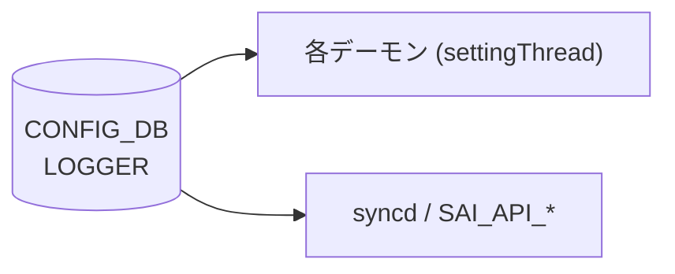

# LOGGER テーブル

## 概要

`LOGGER` テーブルは、SONiC の各デーモン（`orchagent`、`syncd` 等）および SAI API コンポーネント（`SAI_API_*`）のログ verbosity と出力先を [CONFIG_DB](../../reference/glossary.md#term-config_db) に保持する[^1]。各プロセスは起動時に `Logger::linkToDbNative()` / `linkToDb()` で自分のエントリを DB に登録し、以降 `settingThread` がテーブル変更を購読してリアルタイムに loglevel を変更する。

<!-- cdb-mermaid -->
### データフロー (自動生成)



!!! note "凡例"
    CONFIG_DB から各デーモンへの典型経路。詳細・例外は本ページ本文を参照。
<!-- /cdb-mermaid -->

## key 構造

```text
LOGGER|<component>
```

`<component>` はコンポーネント名（例: `orchagent`、`syncd`、`SAI_API_LAG`）。SAI コンポーネントは `SAI_API_` プレフィクスを持つ。

## フィールド

| フィールド | 型 | デフォルト | 説明 |
|-----------|----|-----------|------|
| `LOGLEVEL` | enum (swss または SAI) | `NOTICE` / `SAI_LOG_LEVEL_NOTICE` | ログ verbosity。swss コンポーネント: `EMERG`/`ALERT`/`CRIT`/`ERROR`/`WARN`/`NOTICE`/`INFO`/`DEBUG`。SAI コンポーネント: `SAI_LOG_LEVEL_CRITICAL`/`ERROR`/`WARN`/`NOTICE`/`INFO`/`DEBUG` |
| `LOGOUTPUT` | enum `SYSLOG`/`STDOUT`/`STDERR` | `SYSLOG` | ログ出力先。YANG `default SYSLOG` |
| `require_manual_refresh` | boolean | なし（省略可） | `true` の場合、loglevel 変更に SIGHUP が必要。未設定時は false 相当 |

<!-- defaults -->
## コード由来デフォルト (Phase A)

### `LOGLEVEL`

- **swss コンポーネント**: デフォルト `"NOTICE"`
  - 根拠: `sonic-swss-common/common/loglevel.h:4` — `#define DEFAULT_LOGLEVEL "NOTICE"`
  - `logger.cpp:linkToDbNative()` のデフォルト引数: `const char * defPrio="NOTICE"`[^2]
  - DB に `LOGLEVEL` キーが存在しない場合、`defPrio` の値でエントリを初期書き込みする（`logger.cpp:132-149`）
- **SAI コンポーネント (`SAI_API_*`)**: デフォルト `"SAI_LOG_LEVEL_NOTICE"`
  - 根拠: `sonic-swss-common/common/loglevel.h:5` — `#define SAI_DEFAULT_LOGLEVEL "SAI_LOG_LEVEL_NOTICE"`
  - `swssloglevel -d` 実行時は全 SAI コンポーネントを `SAI_LOG_LEVEL_NOTICE` にリセット（`loglevel.cpp:168-169`）
- **invalid 値フォールバック**: 未知の文字列が書き込まれた場合、`swssPrioNotify()` は `"NOTICE"` にフォールバックしてエラーログを出力（`logger.cpp:83-84`）

### `LOGOUTPUT`

- デフォルト: `"SYSLOG"`
- 根拠 (コード): `logger.cpp:161` — `linkToDb()` は `linkToDbWithOutput(...)` に固定値 `"SYSLOG"` を渡す
- 根拠 (YANG): `sonic-logger.yang:69` — `default SYSLOG;`
- 内部初期値: `logger.h:162` — `std::atomic<Output> m_output = { SWSS_SYSLOG };`
- **invalid 値フォールバック**: 未知の文字列が書き込まれた場合、`swssOutputNotify()` は `SWSS_SYSLOG` にフォールバック（`logger.cpp:105-106`）

### `require_manual_refresh`

- YANG に `default` 節なし
- `settingThread` は `LOGLEVEL`/`LOGOUTPUT` のみ購読し、`require_manual_refresh` を直接読むコードは `sonic-swss-common` 内に確認できない
- 未設定時は false 相当（SIGHUP 不要）として動作する
<!-- /defaults -->

<!-- ordering -->
## 書込み順依存 (Phase B)

`Logger::linkToDbWithOutput()` / `settingThread()` (`sonic-swss-common/common/logger.cpp`) を全行精読した結果、以下の順序依存・タイミング依存を検出した。中間ノート: `meta/_intermediate/cdb-flow/log-config-ordering.md`。

### 他テーブル先行必須

LOGGER テーブルは `VLAN`・`PORT`・`DEVICE_METADATA` 等の他テーブルを参照しない。**他テーブルに対する先行条件は存在しない**。

### 起動前 SET vs 起動後 SET

| タイミング | 挙動 | 根拠 |
|---|---|---|
| **デーモン起動前** に CONFIG_DB に `LOGLEVEL` を SET | `linkToDbWithOutput()` が `table.hget()` で既存値を読み出し、デフォルト上書きをスキップして即座に適用 | `logger.cpp:132-148` |
| **デーモン起動後** に `LOGLEVEL` を SET | `settingThread` が `SubscriberStateTable` でリアルタイム変更を受け取り反映。SELECT タイムアウトにより最大 **1000 ms** の適用遅延あり | `logger.cpp:192-263` |

どちらのタイミングでも機能するが、起動前設定の方がデフォルト上書きコストがなく確実。

### DEL は稼動中デーモンに反映されない

- `settingThread` (L237-238) は `op != SET_COMMAND` の場合 `continue` して無視する。
- LOGGER エントリを DEL しても稼動中デーモンの loglevel は変化しない。
- デーモン再起動時に `linkToDbWithOutput()` がデフォルト値でエントリを再書き込みする。

  evidence: `logger.cpp:237-238`

### 未登録コンポーネント名への SET は silently ignored

- `settingThread` (L238) は `!m_settingChangeObservers.contains(key)` の場合スキップ。
- 存在しないコンポーネント名への SET はエラーなく無視される。コンポーネント名は `swssloglevel -p` で確認すること。

### 推奨書込み順序

```text
# LOGGER テーブルは他テーブルに対する先行条件がないため任意タイミングで SET 可能。

# (推奨) デーモン起動前に事前設定:
SET CONFIG_DB LOGGER|orchagent  LOGLEVEL=DEBUG  LOGOUTPUT=SYSLOG
SET CONFIG_DB LOGGER|syncd      LOGLEVEL=INFO   LOGOUTPUT=SYSLOG

# デーモン起動後でも SET_COMMAND はリアルタイム反映される (最大 1000 ms 遅延):
SET CONFIG_DB LOGGER|orchagent  LOGLEVEL=NOTICE
```

<!-- /ordering -->

<!-- cross-refs -->
## 暗黙参照テーブル (Phase C)

`LOGGER` テーブルの処理コード (`sonic-swss-common/common/logger.cpp`) は CONFIG_DB の `LOGGER` テーブル**のみ**を読み書きし、他の CONFIG_DB テーブルへのアクセスは一切発生しない。

YANG `sonic-logger.yang` にも `leafref` が存在せず、他モジュールへの参照依存はない。

> evidence: `logger.cpp:126-149` (`linkToDbWithOutput()`)、`sonic-logger.yang` 全行精読。中間ノート: `meta/_intermediate/cdb-flow/log-config-cross-refs.md`

### LOGGER テーブルを読み取る側

| 参照元コンポーネント | 参照フィールド | タイミング | evidence |
|---|---|---|---|
| `config syslog level` (`config/syslog.py:684-686`) | `require_manual_refresh` | LOGLEVEL 書込み直後に再読 → `true` なら SIGHUP 送信 | `syslog.py:684-696` |
| `db_migrator.py` | テーブル全体 | DB マイグレーション時にスキーマ互換性確認 | `db_migrator.py:1207` |
| 各デーモン (`orchagent`・`syncd` 等) | `LOGLEVEL`・`LOGOUTPUT` | 起動時自己登録 + `settingThread` による購読 | `logger.cpp:126-263` |

`config syslog level` は LOGLEVEL を書き込んだ後、同エントリの `require_manual_refresh` を確認し、`true` の場合にのみ `docker exec … supervisorctl signal HUP <program>` または `kill -SIGHUP <pid>` を実行する。他 CONFIG_DB テーブルとの結合処理は行わない。
<!-- /cross-refs -->

<!-- failure -->
## 異常系・フォールバック挙動 (Phase D)

`sonic-swss-common/common/logger.cpp` を全行精読した結果、以下の異常系・フォールバック挙動を検出した。中間ノート: `meta/_intermediate/cdb-flow/log-config-failure.md`。

### 無効値フォールバック

| フィールド | 無効値を SET した場合の挙動 | フォールバック値 | evidence |
|---|---|---|---|
| `LOGLEVEL` | `SWSS_LOG_ERROR` でエラーログを出力し `NOTICE` に自動フォールバック。デーモンは停止しない | `NOTICE` (`SWSS_NOTICE`) | `logger.cpp:81-84` (`swssPrioNotify()`) |
| `LOGOUTPUT` | `SWSS_LOG_ERROR` でエラーログを出力し `SYSLOG` に自動フォールバック。デーモンは停止しない | `SYSLOG` (`SWSS_SYSLOG`) | `logger.cpp:103-106` (`swssOutputNotify()`) |

いずれも `YANG` バリデーション非通過値であっても **デーモン停止なし・自動フォールバック** で処理される。

### settingThread 内の異常系

| シナリオ | 挙動 | 備考 |
|---|---|---|
| `select()` が `Select::ERROR` を返す | `SWSS_LOG_NOTICE` でエラーログ → `continue`（スレッド継続） | DB 一時切断などで発生。自動リカバリなし | 
| `dynamic_cast<SubscriberStateTable *>` が NULL | `SWSS_LOG_ERROR` → `break`（`settingThread` 終了） | 内部不整合。デーモン再起動が必要 |
| `op != SET_COMMAND`（DEL など） | `continue` で silently ignored | DEL は稼動中デーモンに反映されない |
| 未登録コンポーネント名への SET | `continue` で silently ignored | エラーログなし |

evidence: `logger.cpp:210-241`

### DB 接続失敗

- `linkToDbWithOutput()` は起動時に `DBConnector db("CONFIG_DB", 0)` で CONFIG_DB に接続する
- DB 接続失敗時は `DBConnector` コンストラクタが例外をスローし、デーモン起動が失敗する可能性がある
- `settingThread` 内に DB 再接続ロジックはなく、起動後の DB 切断は `Select::ERROR` の繰り返しとして観測されるがスレッドは継続する（自動リカバリなし）
<!-- /failure -->

<!-- constants -->
## ハードコード定数 (Phase E)

`logger.cpp` / `loglevel.h` / `logger.h` にハードコードされ、CONFIG_DB・YANG では管理されない数値・enum 定数の一覧。

<!-- evidence: meta/_intermediate/cdb-flow/log-config-constants.md -->

### 1. デフォルト loglevel 定数 (loglevel.h:4–5)

| 定数名 | 値 | 用途 |
|--------|----|------|
| `DEFAULT_LOGLEVEL` | `"NOTICE"` | swss コンポーネントの `LOGLEVEL` 初期値。`linkToDbNative()` のデフォルト引数として参照され、DB に `LOGLEVEL` が存在しない場合に書き込まれる |
| `SAI_DEFAULT_LOGLEVEL` | `"SAI_LOG_LEVEL_NOTICE"` | SAI コンポーネント (`SAI_API_*`) の `LOGLEVEL` 初期値。`swssloglevel -d` による全コンポーネントリセット時の値 |

### 2. settingThread タイムアウト定数 (logger.cpp:208)

| 値 | 用途 |
|----|------|
| `1000` ms | `select.select(&selectable, 1000)` のタイムアウト間隔。LOGGER テーブルへの変更通知受信待ちの最大遅延を決定する。CONFIG_DB で変更不可のハードコード値 |

### 3. ログバッファサイズ定数 (logger.cpp:302, 378)

| 値 | 用途 |
|----|------|
| `0x1000` (4096 バイト) | `write()` / `wthrow()` 内で `vsnprintf(buffer, 0x1000, ...)` に使われるバッファ上限。4096 バイトを超えるログメッセージは切り捨てられる。CONFIG_DB とは無関係のバイナリ内固定値 |

### 4. Priority enum (logger.h:54–64)

`LOGLEVEL` フィールドに書き込める文字列と内部 enum 値の対応。YANG `swss_loglevel` 型で定義された有効値と一致する。

| 内部 enum 値 | CONFIG_DB 書き込み文字列 | デフォルト |
|------------|------------------------|-----------|
| `SWSS_EMERG` | `"EMERG"` | |
| `SWSS_ALERT` | `"ALERT"` | |
| `SWSS_CRIT` | `"CRIT"` | |
| `SWSS_ERROR` | `"ERROR"` | |
| `SWSS_WARN` | `"WARN"` | |
| `SWSS_NOTICE` | `"NOTICE"` | デフォルト (`DEFAULT_LOGLEVEL`) |
| `SWSS_INFO` | `"INFO"` | |
| `SWSS_DEBUG` | `"DEBUG"` | |

### 5. Output enum (logger.h:70–75)

`LOGOUTPUT` フィールドに書き込める文字列と内部 enum 値の対応。

| 内部 enum 値 | CONFIG_DB 書き込み文字列 | 出力先 | デフォルト |
|------------|------------------------|--------|-----------|
| `SWSS_SYSLOG` | `"SYSLOG"` | `vsyslog()` | デフォルト (YANG `default SYSLOG`) |
| `SWSS_STDOUT` | `"STDOUT"` | `printf()` | |
| `SWSS_STDERR` | `"STDERR"` | `fprintf(stderr, ...)` | |

### 6. プロセス内部初期値 (logger.h:160, 162)

DB から読み取る前にプロセス内で保持される初期値。

| メンバー変数 | 初期値 | 意味 |
|------------|--------|------|
| `m_minPrio` | `SWSS_NOTICE` | 最小ログ優先度の内部初期値。`linkToDbWithOutput()` で CONFIG_DB の値に更新される |
| `m_output` | `SWSS_SYSLOG` | ログ出力先の内部初期値。`linkToDbWithOutput()` で CONFIG_DB の値に更新される |

<!-- /constants -->

## 制約

- `LOGLEVEL` は `mandatory true`（YANG）。エントリ作成時に必須
- swss コンポーネントと SAI コンポーネントで loglevel の enum 型が異なる（`swss_loglevel` vs `sai_loglevel`）
- `swssloglevel` ツール（`-s` フラグ）で SAI コンポーネントを区別して操作可能

## 購読者

- **各デーモン** (`orchagent`、`syncd` 等): `Logger::settingThread()` が `CFG_LOGGER_TABLE_NAME` を `SubscriberStateTable` で購読し、`LOGLEVEL`/`LOGOUTPUT` 変更をリアルタイム反映
- **`swssloglevel` コマンド**: `sonic-swss-common/common/loglevel.cpp` — CLI から `LOGGER` テーブルを直接書き込む

## 関連 CONFIG_DB / YANG / CLI

- 関連 YANG: `sonic-logger`
- 関連 CLI: `swssloglevel -l <level> -c <component>`、`swssloglevel -p`（登録済みコンポーネント一覧）

<!-- ref-triangle:start -->

## 関連リファレンス

- [YANG: sonic-logger](../yang/sonic-logger.md)

<!-- ref-triangle:end -->

## 引用元

[^1]: `src/sonic-yang-models/yang-models/sonic-logger.yang` (container `LOGGER`). <https://github.com/sonic-net/sonic-buildimage/blob/9ea932ec2e18f35e58268ec2e4456b1d4afd65cd/src/sonic-yang-models/yang-models/sonic-logger.yang>
[^2]: `sonic-swss-common/common/logger.h` および `logger.cpp`. <https://github.com/sonic-net/sonic-swss-common/blob/158de8d3463ff4b841653f6d57190bb142b80d9c/common/logger.h>

<!-- glossary-links-injected: placeholder -->
