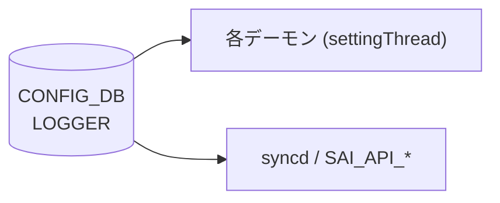

# LOGGER テーブル

## 概要

`LOGGER` テーブルは、[SONiC](../../reference/glossary.md#term-sonic) の各デーモン（`orchagent`、`syncd` 等）および [SAI](../../reference/glossary.md#term-sai) API コンポーネント（`SAI_API_*`）のログ verbosity と出力先を [CONFIG_DB](../../reference/glossary.md#term-config_db) に保持する[^1]。各プロセスは起動時に `Logger::linkToDbNative()` / `linkToDb()` で自分のエントリを DB に登録し、以降 `settingThread` がテーブル変更を購読してリアルタイムに loglevel を変更する。

<!-- cdb-mermaid -->
### データフロー (自動生成)



!!! note "凡例"
    CONFIG_DB から各デーモンへの典型経路。詳細・例外は本ページ本文を参照。
<!-- /cdb-mermaid -->

## key 構造

```text
LOGGER|<component>
```

`<component>` はコンポーネント名（例: `orchagent`、`syncd`、`SAI_API_LAG`）。[SAI](../../reference/glossary.md#term-sai) コンポーネントは `SAI_API_` プレフィクスを持つ。

## フィールド

| フィールド | 型 | デフォルト | 説明 |
|-----------|----|-----------|------|
| `LOGLEVEL` | enum (swss または [SAI](../../reference/glossary.md#term-sai)) | `NOTICE` / `SAI_LOG_LEVEL_NOTICE` | ログ verbosity。swss コンポーネント: `EMERG`/`ALERT`/`CRIT`/`ERROR`/`WARN`/`NOTICE`/`INFO`/`DEBUG`。SAI コンポーネント: `SAI_LOG_LEVEL_CRITICAL`/`ERROR`/`WARN`/`NOTICE`/`INFO`/`DEBUG` |
| `LOGOUTPUT` | enum `SYSLOG`/`STDOUT`/`STDERR` | `SYSLOG` | ログ出力先。[YANG](../../reference/glossary.md#term-yang) `default SYSLOG` |
| `require_manual_refresh` | boolean | なし（省略可） | `true` の場合、loglevel 変更に SIGHUP が必要。未設定時は false 相当 |

<!-- defaults -->
## コード由来デフォルト (Phase A)

### `LOGLEVEL`

- **swss コンポーネント**: デフォルト `"NOTICE"`
  - 根拠: `sonic-swss-common/common/loglevel.h:4` — `#define DEFAULT_LOGLEVEL "NOTICE"`
  - `logger.cpp:linkToDbNative()` のデフォルト引数: `const char * defPrio="NOTICE"`[^2]
  - DB に `LOGLEVEL` キーが存在しない場合、`defPrio` の値でエントリを初期書き込みする（`logger.cpp:132-149`）
- **SAI コンポーネント (`SAI_API_*`)**: デフォルト `"SAI_LOG_LEVEL_NOTICE"`
  - 根拠: `sonic-swss-common/common/loglevel.h:5` — `#define SAI_DEFAULT_LOGLEVEL "SAI_LOG_LEVEL_NOTICE"`
  - `swssloglevel -d` 実行時は全 SAI コンポーネントを `SAI_LOG_LEVEL_NOTICE` にリセット（`loglevel.cpp:168-169`）
- **invalid 値フォールバック**: 未知の文字列が書き込まれた場合、`swssPrioNotify()` は `"NOTICE"` にフォールバックしてエラーログを出力（`logger.cpp:83-84`）

### `LOGOUTPUT`

- デフォルト: `"SYSLOG"`
- 根拠 (コード): `logger.cpp:161` — `linkToDb()` は `linkToDbWithOutput(...)` に固定値 `"SYSLOG"` を渡す
- 根拠 ([YANG](../../reference/glossary.md#term-yang)): `sonic-logger.yang:69` — `default SYSLOG;`
- 内部初期値: `logger.h:162` — `std::atomic<Output> m_output = { SWSS_SYSLOG };`
- **invalid 値フォールバック**: 未知の文字列が書き込まれた場合、`swssOutputNotify()` は `SWSS_SYSLOG` にフォールバック（`logger.cpp:105-106`）

### `require_manual_refresh`

- [YANG](../../reference/glossary.md#term-yang) に `default` 節なし
- `settingThread` は `LOGLEVEL`/`LOGOUTPUT` のみ購読し、`require_manual_refresh` を直接読むコードは `sonic-swss-common` 内に確認できない
- 未設定時は false 相当（SIGHUP 不要）として動作する
<!-- /defaults -->

<!-- ordering -->
## 書込み順依存 (Phase B)

`Logger::linkToDbWithOutput()` / `settingThread()` (`sonic-swss-common/common/logger.cpp`) を全行精読した結果、以下の順序依存・タイミング依存を検出した。中間ノート: `meta/_intermediate/cdb-flow/log-config-ordering.md`。

### 他テーブル先行必須

LOGGER テーブルは `VLAN`・`PORT`・`DEVICE_METADATA` 等の他テーブルを参照しない。**他テーブルに対する先行条件は存在しない**。

### 起動前 SET vs 起動後 SET

| タイミング | 挙動 | 根拠 |
|---|---|---|
| **デーモン起動前** に [CONFIG_DB](../../reference/glossary.md#term-config_db) に `LOGLEVEL` を SET | `linkToDbWithOutput()` が `table.hget()` で既存値を読み出し、デフォルト上書きをスキップして即座に適用 | `logger.cpp:132-148` |
| **デーモン起動後** に `LOGLEVEL` を SET | `settingThread` が `SubscriberStateTable` でリアルタイム変更を受け取り反映。SELECT タイムアウトにより最大 **1000 ms** の適用遅延あり | `logger.cpp:192-263` |

どちらのタイミングでも機能するが、起動前設定の方がデフォルト上書きコストがなく確実。

### DEL は稼動中デーモンに反映されない

- `settingThread` (L237-238) は `op != SET_COMMAND` の場合 `continue` して無視する。
- LOGGER エントリを DEL しても稼動中デーモンの loglevel は変化しない。
- デーモン再起動時に `linkToDbWithOutput()` がデフォルト値でエントリを再書き込みする。

  evidence: `logger.cpp:237-238`

### 未登録コンポーネント名への SET は silently ignored

- `settingThread` (L238) は `!m_settingChangeObservers.contains(key)` の場合スキップ。
- 存在しないコンポーネント名への SET はエラーなく無視される。コンポーネント名は `swssloglevel -p` で確認すること。

### 推奨書込み順序

```text
# LOGGER テーブルは他テーブルに対する先行条件がないため任意タイミングで SET 可能。

# (推奨) デーモン起動前に事前設定:
SET CONFIG_DB LOGGER|orchagent  LOGLEVEL=DEBUG  LOGOUTPUT=SYSLOG
SET CONFIG_DB LOGGER|syncd      LOGLEVEL=INFO   LOGOUTPUT=SYSLOG

# デーモン起動後でも SET_COMMAND はリアルタイム反映される (最大 1000 ms 遅延):
SET CONFIG_DB LOGGER|orchagent  LOGLEVEL=NOTICE
```

<!-- /ordering -->

<!-- cross-refs -->
## 暗黙参照テーブル (Phase C)

`LOGGER` テーブルの処理コード (`sonic-swss-common/common/logger.cpp`) は [CONFIG_DB](../../reference/glossary.md#term-config_db) の `LOGGER` テーブル**のみ**を読み書きし、他の CONFIG_DB テーブルへのアクセスは一切発生しない。

YANG `sonic-logger.yang` にも `leafref` が存在せず、他モジュールへの参照依存はない。

> evidence: `logger.cpp:126-149` (`linkToDbWithOutput()`)、`sonic-logger.yang` 全行精読。中間ノート: `meta/_intermediate/cdb-flow/log-config-cross-refs.md`

### LOGGER テーブルを読み取る側

| 参照元コンポーネント | 参照フィールド | タイミング | evidence |
|---|---|---|---|
| `config syslog level` (`config/syslog.py:684-686`) | `require_manual_refresh` | LOGLEVEL 書込み直後に再読 → `true` なら SIGHUP 送信 | `syslog.py:684-696` |
| `db_migrator.py` | テーブル全体 | DB マイグレーション時にスキーマ互換性確認 | `db_migrator.py:1207` |
| 各デーモン (`orchagent`・`syncd` 等) | `LOGLEVEL`・`LOGOUTPUT` | 起動時自己登録 + `settingThread` による購読 | `logger.cpp:126-263` |

`config syslog level` は LOGLEVEL を書き込んだ後、同エントリの `require_manual_refresh` を確認し、`true` の場合にのみ `docker exec … supervisorctl signal HUP <program>` または `kill -SIGHUP <pid>` を実行する。他 CONFIG_DB テーブルとの結合処理は行わない。
<!-- /cross-refs -->

<!-- failure -->
## 異常系・フォールバック挙動 (Phase D)

`sonic-swss-common/common/logger.cpp` を全行精読した結果、以下の異常系・フォールバック挙動を検出した。中間ノート: `meta/_intermediate/cdb-flow/log-config-failure.md`。

### 無効値フォールバック

| フィールド | 無効値を SET した場合の挙動 | フォールバック値 | evidence |
|---|---|---|---|
| `LOGLEVEL` | `SWSS_LOG_ERROR` でエラーログを出力し `NOTICE` に自動フォールバック。デーモンは停止しない | `NOTICE` (`SWSS_NOTICE`) | `logger.cpp:81-84` (`swssPrioNotify()`) |
| `LOGOUTPUT` | `SWSS_LOG_ERROR` でエラーログを出力し `SYSLOG` に自動フォールバック。デーモンは停止しない | `SYSLOG` (`SWSS_SYSLOG`) | `logger.cpp:103-106` (`swssOutputNotify()`) |

いずれも `YANG` バリデーション非通過値であっても **デーモン停止なし・自動フォールバック** で処理される。

### settingThread 内の異常系

| シナリオ | 挙動 | 備考 |
|---|---|---|
| `select()` が `Select::ERROR` を返す | `SWSS_LOG_NOTICE` でエラーログ → `continue`（スレッド継続） | DB 一時切断などで発生。自動リカバリなし | 
| `dynamic_cast<SubscriberStateTable *>` が NULL | `SWSS_LOG_ERROR` → `break`（`settingThread` 終了） | 内部不整合。デーモン再起動が必要 |
| `op != SET_COMMAND`（DEL など） | `continue` で silently ignored | DEL は稼動中デーモンに反映されない |
| 未登録コンポーネント名への SET | `continue` で silently ignored | エラーログなし |

evidence: `logger.cpp:210-241`

### DB 接続失敗

- `linkToDbWithOutput()` は起動時に `DBConnector db("CONFIG_DB", 0)` で CONFIG_DB に接続する
- DB 接続失敗時は `DBConnector` コンストラクタが例外をスローし、デーモン起動が失敗する可能性がある
- `settingThread` 内に DB 再接続ロジックはなく、起動後の DB 切断は `Select::ERROR` の繰り返しとして観測されるがスレッドは継続する（自動リカバリなし）
<!-- /failure -->

<!-- constants -->
## ハードコード定数 (Phase E)

> **調査根拠**: `sonic-swss-common/common/logger.cpp`, `logger.h`, `schema.h` 全行精読 (2026-05-19)

`LOGGER` テーブルの処理で使われる値のうち、CONFIG_DB フィールドで制御できずソースに固定されている定数をまとめる。

### テーブル名定数 (`schema.h:392`)

```cpp
#define CFG_LOGGER_TABLE_NAME  "LOGGER"
```

CONFIG_DB 上のテーブル名。`logger.cpp` の `linkToDbWithOutput()` および `settingThread()` で常にこのマクロを使用。

### フィールド名定数 (`logger.h:28-29`)

```cpp
static constexpr const char * const DAEMON_LOGLEVEL  = "LOGLEVEL";
static constexpr const char * const DAEMON_LOGOUTPUT = "LOGOUTPUT";
```

`hget` / `hset` で使用するフィールド名。YANG の `leaf` 名 (`LOGLEVEL`, `LOGOUTPUT`) と一致しており、フィールド名を変更する手段は存在しない。

### DB 名固定値 (`logger.cpp:126, 195`)

```cpp
DBConnector db("CONFIG_DB", 0);
```

`Logger` が購読する DB は常に `"CONFIG_DB"` 固定。起動後の再設定手段はない。

### `LOGLEVEL` 有効値マップ (`logger.cpp:66-75`)

```cpp
const Logger::PriorityStringMap Logger::priorityStringMap = {
    { "EMERG",  SWSS_EMERG },
    { "ALERT",  SWSS_ALERT },
    { "CRIT",   SWSS_CRIT },
    { "ERROR",  SWSS_ERROR },
    { "WARN",   SWSS_WARN },
    { "NOTICE", SWSS_NOTICE },
    { "INFO",   SWSS_INFO },
    { "DEBUG",  SWSS_DEBUG }
};
```

このマップに存在しない文字列を `LOGLEVEL` にセットした場合は自動的に `"NOTICE"` (`SWSS_NOTICE`) にフォールバックする（`logger.cpp:81-84`）。

### `LOGOUTPUT` 有効値マップ (`logger.cpp:93-97`)

```cpp
const Logger::OutputStringMap Logger::outputStringMap = {
    { "SYSLOG", SWSS_SYSLOG },
    { "STDOUT", SWSS_STDOUT },
    { "STDERR", SWSS_STDERR }
};
```

このマップに存在しない文字列を `LOGOUTPUT` にセットした場合は自動的に `"SYSLOG"` (`SWSS_SYSLOG`) にフォールバックする（`logger.cpp:103-106`）。

### デフォルト値のハードコード

| 呼び出し元 | デフォルト LOGLEVEL | デフォルト LOGOUTPUT |
|-----------|--------------------|--------------------|
| `linkToDb()` | 呼び出し側依存（例: `"NOTICE"`） | `"SYSLOG"` (`logger.cpp:161`) |
| `linkToDbNative()` | `"NOTICE"`（第 2 引数デフォルト値） | `"SYSLOG"` |
| `m_output` メンバ初期値 | — | `SWSS_SYSLOG` (`logger.h:162`) |

CONFIG_DB の `LOGGER` テーブルにエントリが存在しない場合は、`linkToDbWithOutput()` が自動的にデフォルト値をテーブルへ書き込む（`logger.cpp:143-148`）。

<!-- /constants -->

<!-- side-effects -->
## 副次 DB 書込 (Phase F)

`sonic-swss-common/common/logger.cpp` および `loglevel.cpp` を全行精読した結果、`LOGGER` テーブルの処理は `CONFIG_DB` の `LOGGER` テーブル**のみ**を読み書きし、他 DB への副次書込は発生しない。中間ノート: `meta/_intermediate/cdb-flow/log-config-side-effects.md`。

### DB 別書込有無

| DB | 書込有無 | 根拠 |
|---|---|---|
| CONFIG_DB (`LOGGER` 自身) | **あり（自己書込）** | `linkToDbWithOutput()` が既存エントリ未作成時にデフォルト値 `{LOGLEVEL, LOGOUTPUT}` を `table.set()` で書き戻す | `logger.cpp:132-149` |
| [APPL_DB](../../reference/glossary.md#term-appl_db) | なし | `ProducerStateTable` 使用なし |
| [STATE_DB](../../reference/glossary.md#term-state_db) | なし | `StateTable` / `StateDBConnector` 参照なし |
| [COUNTERS_DB](../../reference/glossary.md#term-counters_db) | なし | ログ verbosity に統計カウンタなし |
| [ASIC_DB](../../reference/glossary.md#term-asic_db) | なし | SAI 非経由 |
| [FLEX_COUNTER_DB](../../reference/glossary.md#term-flex_counter_db) | なし | [FlexCounter](../../reference/glossary.md#term-flexcounter) 機能と無関係 |

### CONFIG_DB 自己書込の詳細

デーモン起動時に `linkToDbWithOutput()` は `table.hget(dbName, "LOGLEVEL")` と `table.hget(dbName, "LOGOUTPUT")` で既存値を確認し、どちらか一方でも未設定の場合にのみ `table.set(dbName, fieldValues)` でデフォルト値を書き戻す（`logger.cpp:132-149`）。デーモンが既に存在するエントリを上書きすることはない。

### DB 外副作用

DB 書込ではないが以下の副作用が発生する:

| 副作用 | トリガ | 根拠 |
|---|---|---|
| デーモン内部 loglevel 変更（`Logger::m_minPrio` / `m_output` 書き換え） | `settingThread` が `prioNotify` / `outputNotify` コールバック呼び出し | `logger.cpp:250-258` |
| SAI loglevel API 呼び出し (`sai_log_set()`) | `SAI_API_*` コンポーネントの LOGLEVEL 変更時、`syncd` 内コールバックが SAI ライブラリ loglevel を変更 | `syncd` 側 `swssPrioNotify` 実装 |
| デーモンへの SIGHUP 送信 | `config syslog level` CLI が `require_manual_refresh=true` のデーモンに `supervisorctl signal HUP` または `kill -SIGHUP` を発行 | `sonic-utilities/config/syslog.py:684-696` |

SIGHUP は `logger.cpp` 自体が送信するのではなく `config syslog level` CLI ツール側の動作である点に注意。
<!-- /side-effects -->

<!-- pubsub -->
## 通信メカニズム (Phase G)

> 調査対象: `sonic-swss-common/common/logger.cpp` L192-262、`common/loglevel.cpp` L42-206、`common/subscriberstatetable.cpp` L20-24、`common/schema.h` L16
> 中間ノート: `meta/_intermediate/cdb-flow/log-config-pubsub.md`

### 購読チャンネル

`LOGGER` テーブルに対する購読者は各デーモン自身の `settingThread` のみ。外部プロセスが `LOGGER` を購読する実装はソース内に存在しない。

| チャンネル | DB (dbId) | テーブル | 購読クラス | 購読者 |
|---|---|---|---|---|
| CONFIG_DB | CONFIG_DB (dbId=4) | `LOGGER` (`CFG_LOGGER_TABLE_NAME`) | `SubscriberStateTable` | 各デーモン (`orchagent`、`syncd` 等) の `settingThread` |

### `SubscriberStateTable` による keyspace PSUBSCRIBE

`Logger::settingThread()` (`logger.cpp:195-199`) は CONFIG_DB の `LOGGER` テーブルを `SubscriberStateTable` で購読する:

```cpp
DBConnector db("CONFIG_DB", 0);
auto table = std::make_shared<SubscriberStateTable>(&db, CFG_LOGGER_TABLE_NAME);
select.addSelectable(table.get());
```

`SubscriberStateTable` は内部 (`subscriberstatetable.cpp:20-24`) で次のパターンを PSUBSCRIBE する:

```
__keyspace@4__:LOGGER|*
```

CONFIG_DB の dbId は `schema.h:16` で `4` と定義される。`HSET "LOGGER|orchagent" LOGLEVEL DEBUG` が実行されると `__keyspace@4__:LOGGER|orchagent` チャネルに `hset` イベントが PUBLISH され、`settingThread` が受信する。

### 書き込み側 — `swss::Table::hset()` (Redis 直接書き込み)

`swssloglevel` ツール (`loglevel.cpp:42-44`) および `linkToDbWithOutput()` (`logger.cpp:127`) は `swss::Table` を使い [Redis](../../reference/glossary.md#term-redis) `HSET` を直接発行する。`ProducerStateTable` / `NotificationProducer` は使用しない。

| 書き込み元 | 使用 API | [Redis](../../reference/glossary.md#term-redis) コマンド |
|---|---|---|
| `swssloglevel -l <level> -c <component>` | `swss::Table::hset()` | `HSET LOGGER\|<component> LOGLEVEL <value>` |
| デーモン起動時 (`linkToDbWithOutput()`) | `swss::Table::set()` | `HSET LOGGER\|<component> LOGLEVEL <value> LOGOUTPUT <value>` |
| デーモン起動時読み取り | `swss::Table::hget()` | `HGET LOGGER\|<component> LOGLEVEL` / `LOGOUTPUT` |

### ループ構造とタイムアウト

`settingThread` は `select.select(&selectable, 1000)` (`logger.cpp:208`) で **1000 ms タイムアウト** のブロッキング select を実行する:

| 戻り値 | 処理 |
|---|---|
| `Select::TIMEOUT` | `SWSS_LOG_DEBUG` → `continue`（ポーリング継続） |
| `Select::ERROR` | `SWSS_LOG_NOTICE` → `continue`（エラー後も継続） |
| `m_stopEvent` | `break`（スレッド終了） |
| keyspace 通知 | `pop(koValues)` → `op == SET_COMMAND` かつ登録済みコンポーネント名のみ処理 |

CONFIG_DB への `HSET` から `settingThread` が反映するまでの最大遅延は **1000 ms**（タイムアウト次第）。

### 起動時スナップショット

`SubscriberStateTable` 自体は起動時スナップショット機能を持たない。デーモン起動時の既存 LOGLEVEL/LOGOUTPUT は `linkToDbWithOutput()` の `table.hget()` (`logger.cpp:132-139`) で直接読み取る。スナップショット取得は `settingThread` ではなく初期化パスが担当する。

<!-- /pubsub -->

<!-- platform -->
## プラットフォーム差分 (Phase H)

> 調査証跡: `meta/_intermediate/cdb-flow/log-config-platform.md`
> ソース: `sonic-swss-common/common/logger.cpp`, `sonic-swss-common/common/loglevel.cpp`, `sonic-utilities/config/syslog.py:661-698`

### ASIC/ベンダー依存性

`logger.cpp` の `linkToDbWithOutput()` および `settingThread()` は `DBConnector db("CONFIG_DB", 0)` でデフォルト namespace の CONFIG_DB に直接接続する。`platform` / `asic` / `hwsku` / `vendor` / `chassis` に基づく条件分岐は一切存在しない。[ASIC](../../reference/glossary.md#term-asic) ベンダーによる差異はない。

### multi-asic 構成

`swssloglevel` (C++ バイナリ) は namespace オプションを持たず、常にそのコンテナ内のデフォルト CONFIG_DB に接続する (`loglevel.cpp:129`)。multi-asic 構成では各 [ASIC](../../reference/glossary.md#term-asic) コンテナ (`asic0`, `asic1`, ...) で `swssloglevel` を個別実行する必要がある。

ホストから namespace を横断して設定できるのは `config syslog level` CLI のみ:

```python
# syslog.py:676-678
asic_id = multi_asic.get_asic_id_from_name(namespace)
container = f'{container}{asic_id}'
cfg_db = db.cfgdb_clients[namespace]
```

| ツール | namespace 対応 | 備考 |
|--------|---------------|------|
| `swssloglevel` (C++) | **なし** — コンテナ内専用 | `loglevel.cpp:129` |
| `config syslog level --namespace` (Python) | **あり** | `syslog.py:661-678` |

### SAI コンポーネント (`SAI_API_*`)

`syncd` は各 [ASIC](../../reference/glossary.md#term-asic) コンテナ内に 1 インスタンスとして存在する。`SAI_API_*` の LOGGER エントリは各コンテナの CONFIG_DB に独立して存在し、ASIC ベンダーによって登録される `SAI_API_*` コンポーネント名の一覧が異なる可能性がある。ただし logger.cpp/loglevel.cpp の処理ロジックはベンダー非依存で共通。

### SmartSwitch / VOQ Chassis

`logger.cpp` / `loglevel.cpp` に [SmartSwitch](../../reference/glossary.md#term-smartswitch) / [VOQ](../../reference/glossary.md#term-voq) Chassis 固有の分岐はない。[DPU](../../reference/glossary.md#term-dpu) コンテナでも同一の `Logger` ライブラリが使用されるが、CONFIG_DB 接続先はそれぞれのコンテナ内のデフォルト namespace に固定される。

<!-- /platform -->

## 制約

- `LOGLEVEL` は `mandatory true`（YANG）。エントリ作成時に必須
- swss コンポーネントと SAI コンポーネントで loglevel の enum 型が異なる（`swss_loglevel` vs `sai_loglevel`）
- `swssloglevel` ツール（`-s` フラグ）で SAI コンポーネントを区別して操作可能

## 購読者

- **各デーモン** (`orchagent`、`syncd` 等): `Logger::settingThread()` が `CFG_LOGGER_TABLE_NAME` を `SubscriberStateTable` で購読し、`LOGLEVEL`/`LOGOUTPUT` 変更をリアルタイム反映
- **`swssloglevel` コマンド**: `sonic-swss-common/common/loglevel.cpp` — CLI から `LOGGER` テーブルを直接書き込む

## 関連 CONFIG_DB / YANG / CLI

- 関連 YANG: `sonic-logger`
- 関連 CLI: `swssloglevel -l <level> -c <component>`、`swssloglevel -p`（登録済みコンポーネント一覧）

<!-- ref-triangle:start -->

## 関連リファレンス

- YANG: sonic-logger

<!-- ref-triangle:end -->

## 引用元

[^1]: `src/sonic-yang-models/yang-models/sonic-logger.yang` (container `LOGGER`). <https://github.com/sonic-net/sonic-buildimage/blob/9ea932ec2e18f35e58268ec2e4456b1d4afd65cd/src/sonic-yang-models/yang-models/sonic-logger.yang>
[^2]: `sonic-swss-common/common/logger.h` および `logger.cpp`. <https://github.com/sonic-net/sonic-swss-common/blob/158de8d3463ff4b841653f6d57190bb142b80d9c/common/logger.h>

<!-- glossary-links-injected: placeholder -->

<!-- glossary-links-injected: 865a18402f05 -->
