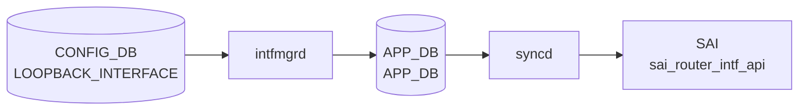

# LOOPBACK_INTERFACE テーブル

## 概要

ルータ ID やサービス IP として使う仮想ループバック IF を定義する[^1]。`Loopback0` は通常 [BGP](../../reference/glossary.md#term-bgp) の router-id / source として使われる。`intfmgrd` が Linux 上の dummy IF を生成し、`orchagent` `IntfsOrch` が [SAI](../../reference/glossary.md#term-sai) ルータ IF を作る。

<!-- cdb-mermaid -->
### データフロー (自動生成)



!!! note "凡例"
    CONFIG_DB から SAI までの典型経路を `docs/reference/config-db-orch-map.md` から機械生成したミニ図。詳細・例外は本ページ本文と対応表を参照。
<!-- /cdb-mermaid -->

## key 構造

```text
LOOPBACK_INTERFACE|<name>                       # 属性ロウ
LOOPBACK_INTERFACE|<name>|<ip-prefix>           # IP プレフィクス
```

`<name>` は `interface_name` typedef で `Loopback<N>` 形式。

## 属性ロウのフィールド

| フィールド | 型 | 必須 | デフォルト | 説明 |
|-----------|----|------|-----------|------|
| `name` (key) | `interface_name` | ✅ | - | ループバック名（例: `Loopback0`） |
| `vrf_name` | leafref `VRF.name` | - | - | バインドする [VRF](../../reference/glossary.md#term-vrf) |
| `nat_zone` | uint8 (0..3) | - | `0` | [NAT](../../reference/glossary.md#term-nat) zone |
| `admin_status` | `admin_status` | - | `up` | 管理状態 |

## IP プレフィクスロウ

| フィールド | 型 | 必須 | 説明 |
|-----------|----|------|------|
| `name` (key) | leafref 自テーブル `LOOPBACK_INTERFACE_LIST.name` | ✅ | ループバック名 |
| `ip-prefix` (key) | union (v4/v6 prefix) | ✅ | IP/プレフィクス |
| `scope` | enum `global`/`local` | - | アドレススコープ |
| `family` | `ip-family` | - | family。`ip-prefix` と整合する `must` |

## 購読者

- `intfmgrd`: Linux dummy IF / IP / [VRF](../../reference/glossary.md#term-vrf) binding を生成
- `orchagent` `IntfsOrch`: [SAI](../../reference/glossary.md#term-sai) ルータ IF
- `bgpcfgd`: `Loopback0` IPv4 を [BGP](../../reference/glossary.md#term-bgp) `bgp router-id` の既定値として参照（`DEVICE_METADATA.bgp_router_id` 未設定時）

## 関連 CONFIG_DB / YANG / CLI

- 関連 [CONFIG_DB](../../reference/glossary.md#term-config_db): `VRF`、`DEVICE_METADATA` (`bgp_adv_lo_prefix_as_128`)
- 関連 CLI: `config loopback add/del`、`config interface ip add Loopback0 ...`
- 関連 [YANG](../../reference/glossary.md#term-yang): `sonic-loopback-interface`

<!-- ref-triangle:start -->

## 関連リファレンス

- [YANG](../../reference/glossary.md#term-yang): [`sonic-loopback-interface`](../yang/sonic-loopback-interface.md)
- CLI: `config loopback`

<!-- ref-triangle:end -->

## 引用元

[^1]: [YANG](../../reference/glossary.md#term-yang) 定義: `sonic-loopback-interface.yang`. <https://github.com/sonic-net/sonic-buildimage/blob/9ea932ec2e18f35e58268ec2e4456b1d4afd65cd/src/sonic-yang-models/yang-models/sonic-loopback-interface.yang>

<!-- ops-hint -->
## 運用ヒント

### 典型値

- key 形式: `LOOPBACK_INTERFACE|Loopback0` (L3 enable 行) と `LOOPBACK_INTERFACE|Loopback0|<ip/prefix>`。
- `Loopback0` は [BGP](../../reference/glossary.md#term-bgp) router-id / VTEP src として標準利用。

### よくある誤設定

- L3 enable 行を省略すると IP 行だけでは Loopback が作られない。

### 確認コマンド

```bash
sonic-db-cli CONFIG_DB keys 'LOOPBACK_INTERFACE|*'
show ip interfaces | grep Loopback
```
<!-- /ops-hint -->

<!-- value-behavior -->
## 値依存挙動マトリクス

### `admin_status`

| 値 | 挙動 |
|----|------|
| `up`（デフォルト） | Linux dummy デバイスを UP 状態にする |
| `down` | Linux dummy デバイスを DOWN 状態にする |
| 設定コマンド失敗時 | `SWSS_LOG_WARN("Lo interface ip link set admin status %s failure. Runtime error: %s")` → warn のみで継続 |

### `scope`（IP プレフィクスロウ）

| 値 | 挙動 |
|----|------|
| `global` | グローバルスコープアドレス |
| `local` | ローカルスコープアドレス |

### `vrf_name`

| 値 | 挙動 |
|----|------|
| 設定あり | 指定 VRF にバインド |
| 未設定 | デフォルト VRF に属する |

### L3 enable 行の有無（特殊条件）

| 状態 | 挙動 |
|------|------|
| L3 enable 行なしで IP 行のみ投入 | dummy デバイス未作成のため `ip addr add` が失敗 |
| L3 enable 行あり | `ip link add <name> mtu 65536 type dummy` で作成後 IP を付与 |

<!-- /value-behavior -->

<!-- cdb-exceptions -->
## 例外条件・特殊挙動

<!-- evidence: sonic-swss/cfgmgr/intfmgr.cpp -->

| 条件 | 挙動 |
|------|------|
| L3 enable 行なしで IP 行のみ投入 | dummy デバイス未作成のため `ip addr add` が失敗。L3 enable 行（フィールドなし）が先に必要 |
| MTU 未設定 | `ip link add <name> mtu 65536 type dummy` で作成（intfmgr.cpp L28 `LOOPBACK_DEFAULT_MTU_STR "65536"`） |
| `ip link set admin_status` 失敗 | `SWSS_LOG_WARN("Lo interface ip link set admin status %s failure. Runtime error: %s")` → warn のみで継続 |
| `ip link del` 失敗 | `SWSS_LOG_ERROR` → dummy デバイスが OS に残存するが CONFIG_DB からはエントリが消える（不整合状態） |
| 同名 Loopback への重複 SET | `m_loopbackIntfList` の `find` で既存確認後スキップ |
| 削除済み Loopback への IP 追加 | L3 enable 行を再設定しないと反映されない |

<!-- /cdb-exceptions -->


<!-- runtime-trace -->
## 実コンテナ動作トレース

### 段階 1 — Consumer 登録

`intfmgrd` → `IntfsOrch` (APPL_DB 経由) が CONFIG_DB の `LOOPBACK_INTERFACE` テーブルを購読する。

`LOOPBACK_INTERFACE` の key は `<lo_name>|<ip_prefix>` または `<lo_name>`。`Loopback0` が BGP router-id として使用される。

### 段階 2 — CFG→APPL 翻訳

`APP_INTF_TABLE` に書き込み (loopback interface の IP address)

### 段階 3 — APPL→SAI

`sai_router_intf_api` — loopback router interface を作成/更新

### 段階 4 — タイミングと副作用

**適用タイミング**: CONFIG_DB 変化を `intfmgrd` が検知後 `APP_INTF_TABLE` に書き込み。`IntfsOrch` が SAI loopback router interface を更新。即時反映。

**副作用**: Loopback IP address は BGP の Router ID / peering source として使用される。削除すると BGP session に影響する可能性がある。
<!-- /runtime-trace -->

<!-- entry-points -->
## 書き込み入り口 (Direction A)

対象テーブル: `LOOPBACK_INTERFACE`

### CLI
- `config interface ip add/remove Loopback<N> <ip/prefix>`
  - ソース: `sonic-utilities/config/main.py (interface グループ)`

### minigraph / sonic-cfggen
- あり: `sonic-cfggen -m <minigraph.xml>` 実行時に本テーブルが生成・上書きされる

### REST / gNMI (sonic-mgmt-common)
- sonic-mgmt-common OpenConfig interfaces 経由

### db_migrator
- なし

### ビルド時デフォルト (init_cfg / j2 テンプレート)
- `sonic-cfggen -m` で minigraph から Loopback0 IP 等を生成

### ハードコードデフォルト
- なし

### ランタイム注入 (デーモン自動書き込み)
- なし
<!-- /entry-points -->

<!-- defaults -->
## コード由来の暗黙デフォルト

> 証跡: `sonic-swss/cfgmgr/intfmgr.cpp`, `sonic-swss/cfgmgr/natmgr.cpp`,
> `sonic-buildimage/src/sonic-bgpcfgd/bgpcfgd/managers_bgp.py`

### `admin_status` — YANG + コード二重保護

YANG default は `up`。さらに `intfmgrd` も空値または不正値を受け取った場合に `"up"` へフォールバックする
（`intfmgr.cpp:861-868`）。したがって `admin_status` が CONFIG_DB に存在しない場合も、不正文字列の場合も、
常に `"up"` として動作する。

### `nat_zone` — dead consumer（Loopback 上でのみ）

YANG default は `"0"` だが、`natmgr` は Loopback インターフェースに対して
mangle iptables ルールを**生成しない**（`natmgr.cpp:7526-7549, 7581`）。
値はキャッシュ (`m_natZoneInterfaceInfo`) に記録されるが、カーネルの mark 付与は行われない。
Loopback の `nat_zone` は設定可能だが、実際の NAT 効果はゼロ。

### `scope`（IP プレフィクスロウ）— dead field

`intfmgr` は `doIntfAddrTask` において APP_DB 書き込み時に `scope` を
常に `"global"` でハードコードする（`intfmgr.cpp:1134`）。CONFIG_DB の
`scope = "local"` は Orchagent / SAI に伝わらない。

### `family`（IP プレフィクスロウ）— dead consumer

`intfmgr` は `ip_prefix.isV4()` から family を自動判定し APP_DB に書く
（`intfmgr.cpp:1129`）。CONFIG_DB の `family` フィールドは読まれない。

### MTU — ハードコード `65536`

`LOOPBACK_INTERFACE` テーブルに `mtu` フィールドはない。`intfmgr` は
`ip link add <name> mtu 65536 type dummy` のハードコード値を使う
（`intfmgr.cpp:28, 201`）。CONFIG_DB から変更する経路は存在しない。

### IPv6 link-local アドレス — silent drop

`fe80::/10` の IPv6 アドレスはカーネルには付与されるが、APP_DB には
送信されない（`intfmgr.cpp:1123-1139`）。IntfsOrch / SAI に通知されず、
SAI ルータ IF の更新は発生しない。

### Loopback0 IPv4 欠如 — BGP peer ブロック（経路依存乖離）

`bgpcfgd` は `DEVICE_METADATA.bgp_router_id` が未設定の場合、
`Loopback0` の IPv4 アドレスを BGP peer 追加の必要条件とする
（`managers_bgp.py:184-189`）。`Loopback0` 行は存在しても IP プレフィクス行
がなければ BGP peer が永続的にペンディングになる。

### VOQ 環境固有の挙動

| 条件 | 挙動 | 証跡 |
|------|------|------|
| `switch_type == "voq"` | IPv6 アドレス付与時に `metric 256` を自動追加 | `intfmgr.cpp:103-106` |
| internal BGP peer | `Loopback4096` エントリが必須依存 | `managers_bgp.py:145-146` |
| `Loopback4096` 未設定 | VOQ 環境の internal BGP peer 設定がブロック | `managers_bgp.py:146` |

### `mac_addr` — 暗黙ゼロ MAC

`mac_addr` が未設定の場合、`intfmgr` は `MacAddress().to_string()` (= `00:00:00:00:00:00`)
を APP_DB に送信する（`intfmgr.cpp:1018-1020`）。Loopback では通常無視されるが、
APP_INTF_TABLE に記録される。

<!-- /defaults -->

<!-- ordering -->
## 書込み順依存 (Phase B)

> 調査対象: `sonic-swss/cfgmgr/intfmgr.cpp`
> 調査日: 2026-05-16

### 他テーブル先行必須

`LOOPBACK_INTERFACE` は `intfmgrd` が処理する。`isIntfStateOk()` 内で `Loopback` プレフィクスを検知すると **即 `true` を返す**（`intfmgr.cpp:696-699`）。PORT / PORTCHANNEL / VLAN など他テーブルへの依存は存在しない。

| 先行テーブル / 条件 | 確認先 STATE_DB | 依存の内容 | コード根拠 |
|------------------|----------------|-----------|-----------|
| 依存なし | — | `isIntfStateOk("Loopback*")` は常に `true` | `intfmgr.cpp:696-699` |
| `VRF` + vrfmgrd が STATE_VRF_TABLE に書く | `STATE_VRF_TABLE` | `vrf_name` 指定時のみ。未 ready → retry | `intfmgr.cpp:839-842` |
| Loopback 属性ロウが STATE_INTERFACE_TABLE に存在 | `STATE_INTERFACE_TABLE` | `isIntfCreated(alias)` が false → IP プレフィクスロウをスキップ | `intfmgr.cpp:1115` |

### Loopback 生成順序 (kernel)

`doIntfGeneralTask()` SET パス（Loopback 向け、`intfmgr.cpp` L772–1054）:

```
1. is_lo = true 確認                              (alias が "Loopback" で始まる)
2. ip link add <name> mtu 65536 type dummy       (新規作成時のみ。m_loopbackIntfList 未登録の場合)
                                                  MTU はハードコード 65536
3. adminStatus 正規化 → ip link set <name> up/down
                                                  (空値・不正値は "up" にフォールバック。
                                                   intfmgr.cpp:861-868, 870-880)
   ※ ステップ 2–3 は is_lo ブロック内（L856-880）
4. setIntfVrf(alias, vrf_name)                   (vrf_name 指定時。ip link set master/nomaster)
   ※ is_lo ブロック外の共通パス（L1007-1010）
5. setIntfMac(alias, mac) / mac_addr = "00:00:00:00:00:00" デフォルト付与
                                                  (intfmgr.cpp:1012-1020)
6. m_appIntfTableProducer.set(alias, data)       (APP_DB INTF_TABLE SET)
7. m_stateIntfTable.hset(alias, "vrf", …)        (STATE_DB 書込み)
```

> **注意**: 旧版ドキュメントではステップ 3（VRF）と 4（MAC）を admin_status 設定の前に記載していたが、
> コード上は VRF・MAC の設定（`setIntfVrf` / `setIntfMac`）は `is_lo` ブロックの外の共通パスに位置し、
> `ip link set up/down` の後に実行される（`intfmgr.cpp:1007-1020`）。

IP プレフィクスロウ（`doIntfAddrTask()` SET パス）は属性ロウの STATE_DB 書込み後に実行される。

### SET 後 DEL 順依存

| 操作 | 必須順序 | コード根拠 |
|------|---------|-----------|
| Loopback 属性ロウ (`LOOPBACK_INTERFACE|Loopback<N>`) の DEL | すべての IP プレフィクスロウを先に DEL してから | `intfmgr.cpp:1058-1063` |
| VRF 変更 | `vrf_name=""` で unbind → 新 VRF で rebind の 2 ステップ | `intfmgr.cpp:846-849` |

### 主要ポイント

- Loopback は他 IF と異なり STATE_DB の ready 待ちが**一切ない**（`isIntfStateOk` 常 true）
- `cold restart` 時は `flushLoopbackIntfs()` でカーネルから全 Loopback を削除後に再作成する（`intfmgr.cpp:57`）
- `warm-start` 時は `buildIntfReplayList()` が CONFIG_DB から Loopback キーを収集し replay する

詳細調査ノートは `meta/_intermediate/cdb-flow/loopback-interface-ordering.md` 参照。

<!-- /ordering -->

<!-- implicit-refs -->
## 暗黙参照 — VRF テーブルへの依存

> 証跡: `sonic-swss/cfgmgr/intfmgr.cpp`

`LOOPBACK_INTERFACE` テーブルの `vrf_name` フィールドは `VRF` テーブルへの leafref だが、
`intfmgrd` はそれを単純な文字列参照に留めず、**STATE_DB の `STATE_VRF_TABLE`** を使って
VRF の生成完了を確認する暗黙の依存関係を持つ。

### VRF 生成待ちによるブロック（`isIntfStateOk`）

`vrf_name` が非空のとき、`intfmgrd` は処理前に `STATE_VRF_TABLE.get(vrf_name)` を
呼び出す（`intfmgr.cpp:839-843`）。STATE_DB にエントリがなければ

```
SWSS_LOG_DEBUG("VRF is not ready, skipping %s", vrf_name.c_str())
```

を出力して `false` を返し、イベントをキューに保留する。**CONFIG_DB に VRF エントリが
存在していても、vrfmgrd が STATE_DB に書き込むまで Loopback は VRF にバインドされない。**

### VRF 変更禁止（`isIntfChangeVrf`）

既に STATE_DB の `STATE_INTF_TABLE.<alias>.vrf` に VRF 名が記録されている場合、
別の `vrf_name` への直接変更は拒否される（`intfmgr.cpp:846-849`）:

```
SWSS_LOG_ERROR("%s can not change to %s directly, skipping", alias.c_str(), vrf_name.c_str())
```

VRF を切り替えるには、先に `vrf_name` を空にして Loopback を解除し、再設定する必要がある。

### VRF バインド実装（`setIntfVrf`）

`vrf_name` が確定すると `intfmgr.cpp:149-163` の `setIntfVrf` が呼ばれ:

```bash
ip link set <alias> master <vrfName>   # バインド
ip link set <alias> nomaster            # 解除（vrf_name 空のとき）
```

バインドは Linux netlink 経由で即時反映される。失敗時は `SWSS_LOG_ERROR` が出るが
処理は継続される。

### 削除時の IP 残留ガード

DEL_COMMAND では、先に全 IP アドレスが削除されていることを `getIntfIpCount` で確認する。
IP が残っている場合は DEL を保留し、`vrf_name` の解除（`setIntfVrf(alias, "")`）は
IP 削除後まで実行されない（`intfmgr.cpp:1059-1065` コメント）。これにより、
VRF 解除後のアドレス競合（グローバル VRF への暗黙フォールバック）を防ぐ。

### まとめ — 暗黙参照の連鎖

| 参照元フィールド | 参照先テーブル | 確認手段 | 未解決時の挙動 |
|-----------------|--------------|---------|--------------|
| `vrf_name` | `VRF`（CONFIG_DB） | STATE_VRF_TABLE（STATE_DB） | Loopback 設定をキューで保留 |
| `vrf_name` (変更) | STATE_INTF_TABLE（STATE_DB） | `isIntfChangeVrf` | 変更を ERROR ログで拒否 |
| IP 削除 → VRF 解除 | 自テーブル IP カウント | `getIntfIpCount` | DEL を保留し順序を強制 |

<!-- /implicit-refs -->

<!-- glossary-links-injected: b5270404647a -->
