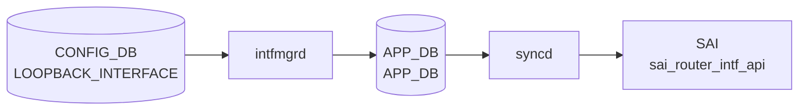

# LOOPBACK_INTERFACE テーブル

## 概要

ルータ ID やサービス IP として使う仮想ループバック IF を定義する[^1]。`Loopback0` は通常 [BGP](../../reference/glossary.md#term-bgp) の router-id / source として使われる。`intfmgrd` が Linux 上の dummy IF を生成し、`orchagent` `IntfsOrch` が [SAI](../../reference/glossary.md#term-sai) ルータ IF を作る。

<!-- cdb-mermaid -->
### データフロー (自動生成)



!!! note "凡例"
    CONFIG_DB から SAI までの典型経路を `docs/reference/config-db-orch-map.md` から機械生成したミニ図。詳細・例外は本ページ本文と対応表を参照。
<!-- /cdb-mermaid -->

## key 構造

```text
LOOPBACK_INTERFACE|<name>                       # 属性ロウ
LOOPBACK_INTERFACE|<name>|<ip-prefix>           # IP プレフィクス
```

`<name>` は `interface_name` typedef で `Loopback<N>` 形式。

## 属性ロウのフィールド

| フィールド | 型 | 必須 | デフォルト | 説明 |
|-----------|----|------|-----------|------|
| `name` (key) | `interface_name` | ✅ | - | ループバック名（例: `Loopback0`） |
| `vrf_name` | leafref `VRF.name` | - | - | バインドする [VRF](../../reference/glossary.md#term-vrf) |
| `nat_zone` | uint8 (0..3) | - | `0` | [NAT](../../reference/glossary.md#term-nat) zone |
| `admin_status` | `admin_status` | - | `up` | 管理状態 |

## IP プレフィクスロウ

| フィールド | 型 | 必須 | 説明 |
|-----------|----|------|------|
| `name` (key) | leafref 自テーブル `LOOPBACK_INTERFACE_LIST.name` | ✅ | ループバック名 |
| `ip-prefix` (key) | union (v4/v6 prefix) | ✅ | IP/プレフィクス |
| `scope` | enum `global`/`local` | - | アドレススコープ |
| `family` | `ip-family` | - | family。`ip-prefix` と整合する `must` |

## 購読者

- `intfmgrd`: Linux dummy IF / IP / [VRF](../../reference/glossary.md#term-vrf) binding を生成
- `orchagent` `IntfsOrch`: [SAI](../../reference/glossary.md#term-sai) ルータ IF
- `bgpcfgd`: `Loopback0` IPv4 を [BGP](../../reference/glossary.md#term-bgp) `bgp router-id` の既定値として参照（`DEVICE_METADATA.bgp_router_id` 未設定時）

## 関連 CONFIG_DB / YANG / CLI

- 関連 [CONFIG_DB](../../reference/glossary.md#term-config_db): `VRF`、`DEVICE_METADATA` (`bgp_adv_lo_prefix_as_128`)
- 関連 CLI: `config loopback add/del`、`config interface ip add Loopback0 ...`
- 関連 [YANG](../../reference/glossary.md#term-yang): `sonic-loopback-interface`

<!-- ref-triangle:start -->

## 関連リファレンス

- [YANG](../../reference/glossary.md#term-yang): [`sonic-loopback-interface`](../yang/sonic-loopback-interface.md)
- CLI: `config loopback`

<!-- ref-triangle:end -->

## 引用元

[^1]: [YANG](../../reference/glossary.md#term-yang) 定義: `sonic-loopback-interface.yang`. <https://github.com/sonic-net/sonic-buildimage/blob/9ea932ec2e18f35e58268ec2e4456b1d4afd65cd/src/sonic-yang-models/yang-models/sonic-loopback-interface.yang>

<!-- ops-hint -->
## 運用ヒント

### 典型値

- key 形式: `LOOPBACK_INTERFACE|Loopback0` (L3 enable 行) と `LOOPBACK_INTERFACE|Loopback0|<ip/prefix>`。
- `Loopback0` は [BGP](../../reference/glossary.md#term-bgp) router-id / [VTEP](../../reference/glossary.md#term-vtep) src として標準利用。

### よくある誤設定

- L3 enable 行を省略すると IP 行だけでは Loopback が作られない。

### 確認コマンド

```bash
sonic-db-cli CONFIG_DB keys 'LOOPBACK_INTERFACE|*'
show ip interfaces | grep Loopback
```
<!-- /ops-hint -->

<!-- value-behavior -->
## 値依存挙動マトリクス

### `admin_status`

| 値 | 挙動 |
|----|------|
| `up`（デフォルト） | Linux dummy デバイスを UP 状態にする |
| `down` | Linux dummy デバイスを DOWN 状態にする |
| 設定コマンド失敗時 | `SWSS_LOG_WARN("Lo interface ip link set admin status %s failure. Runtime error: %s")` → warn のみで継続 |

### `scope`（IP プレフィクスロウ）

| 値 | 挙動 |
|----|------|
| `global` | グローバルスコープアドレス |
| `local` | ローカルスコープアドレス |

### `vrf_name`

| 値 | 挙動 |
|----|------|
| 設定あり | 指定 [VRF](../../reference/glossary.md#term-vrf) にバインド |
| 未設定 | デフォルト VRF に属する |

### L3 enable 行の有無（特殊条件）

| 状態 | 挙動 |
|------|------|
| L3 enable 行なしで IP 行のみ投入 | dummy デバイス未作成のため `ip addr add` が失敗 |
| L3 enable 行あり | `ip link add <name> mtu 65536 type dummy` で作成後 IP を付与 |

<!-- /value-behavior -->

<!-- cdb-exceptions -->
## 例外条件・特殊挙動

<!-- evidence: sonic-swss/cfgmgr/intfmgr.cpp -->

| 条件 | 挙動 |
|------|------|
| L3 enable 行なしで IP 行のみ投入 | dummy デバイス未作成のため `ip addr add` が失敗。L3 enable 行（フィールドなし）が先に必要 |
| MTU 未設定 | `ip link add <name> mtu 65536 type dummy` で作成（intfmgr.cpp L28 `LOOPBACK_DEFAULT_MTU_STR "65536"`） |
| `ip link set admin_status` 失敗 | `SWSS_LOG_WARN("Lo interface ip link set admin status %s failure. Runtime error: %s")` → warn のみで継続 |
| `ip link del` 失敗 | `SWSS_LOG_ERROR` → dummy デバイスが OS に残存するが [CONFIG_DB](../../reference/glossary.md#term-config_db) からはエントリが消える（不整合状態） |
| 同名 Loopback への重複 SET | `m_loopbackIntfList` の `find` で既存確認後スキップ |
| 削除済み Loopback への IP 追加 | L3 enable 行を再設定しないと反映されない |

<!-- /cdb-exceptions -->

<!-- runtime-trace -->
## 実コンテナ動作トレース

### 段階 1 — Consumer 登録

`intfmgrd` → `IntfsOrch` ([APPL_DB](../../reference/glossary.md#term-appl_db) 経由) が [CONFIG_DB](../../reference/glossary.md#term-config_db) の `LOOPBACK_INTERFACE` テーブルを購読する。

`LOOPBACK_INTERFACE` の key は `<lo_name>|<ip_prefix>` または `<lo_name>`。`Loopback0` が BGP router-id として使用される。

### 段階 2 — CFG→APPL 翻訳

`APP_INTF_TABLE` に書き込み (loopback interface の IP address)

### 段階 3 — APPL→SAI

`sai_router_intf_api` — loopback router interface を作成/更新

### 段階 4 — タイミングと副作用

**適用タイミング**: CONFIG_DB 変化を `intfmgrd` が検知後 `APP_INTF_TABLE` に書き込み。`IntfsOrch` が [SAI](../../reference/glossary.md#term-sai) loopback router interface を更新。即時反映。

**副作用**: Loopback IP address は BGP の Router ID / peering source として使用される。削除すると BGP session に影響する可能性がある。
<!-- /runtime-trace -->

<!-- entry-points -->
## 書き込み入り口

対象テーブル: `LOOPBACK_INTERFACE`

### CLI
- `config interface ip add/remove Loopback<N> <ip/prefix>`
  - ソース: `sonic-utilities/config/main.py (interface グループ)`

### minigraph / sonic-cfggen
- あり: `sonic-cfggen -m <minigraph.xml>` 実行時に本テーブルが生成・上書きされる

### REST / gNMI (sonic-mgmt-common)
- [sonic-mgmt](../../reference/glossary.md#term-sonic-mgmt)-common OpenConfig interfaces 経由

### db_migrator
- なし

### ビルド時デフォルト (init_cfg / j2 テンプレート)
- `sonic-cfggen -m` で minigraph から Loopback0 IP 等を生成

### ハードコードデフォルト
- なし

### ランタイム注入 (デーモン自動書き込み)
- なし
<!-- /entry-points -->

<!-- defaults -->
## コード由来の暗黙デフォルト

> 証跡: `sonic-swss/cfgmgr/intfmgr.cpp`, `sonic-swss/cfgmgr/natmgr.cpp`,
> `sonic-buildimage/src/sonic-bgpcfgd/bgpcfgd/managers_bgp.py`

### `admin_status` — YANG + コード二重保護

YANG default は `up`。さらに `intfmgrd` も空値または不正値を受け取った場合に `"up"` へフォールバックする
（`intfmgr.cpp:861-868`）。したがって `admin_status` が CONFIG_DB に存在しない場合も、不正文字列の場合も、
常に `"up"` として動作する。

### `nat_zone` — dead consumer（Loopback 上でのみ）

YANG default は `"0"` だが、`natmgr` は Loopback インターフェースに対して
mangle iptables ルールを**生成しない**（`natmgr.cpp:7526-7549, 7581`）。
値はキャッシュ (`m_natZoneInterfaceInfo`) に記録されるが、カーネルの mark 付与は行われない。
Loopback の `nat_zone` は設定可能だが、実際の [NAT](../../reference/glossary.md#term-nat) 効果はゼロ。

### `scope`（IP プレフィクスロウ）— dead field

`intfmgr` は `doIntfAddrTask` において APP_DB 書き込み時に `scope` を
常に `"global"` でハードコードする（`intfmgr.cpp:1134`）。CONFIG_DB の
`scope = "local"` は Orchagent / SAI に伝わらない。

### `family`（IP プレフィクスロウ）— dead consumer

`intfmgr` は `ip_prefix.isV4()` から family を自動判定し APP_DB に書く
（`intfmgr.cpp:1129`）。CONFIG_DB の `family` フィールドは読まれない。

### MTU — ハードコード `65536`

`LOOPBACK_INTERFACE` テーブルに `mtu` フィールドはない。`intfmgr` は
`ip link add <name> mtu 65536 type dummy` のハードコード値を使う
（`intfmgr.cpp:28, 201`）。CONFIG_DB から変更する経路は存在しない。

### IPv6 link-local アドレス — silent drop

`fe80::/10` の IPv6 アドレスはカーネルには付与されるが、APP_DB には
送信されない（`intfmgr.cpp:1123-1139`）。IntfsOrch / SAI に通知されず、
SAI ルータ IF の更新は発生しない。

### Loopback0 IPv4 欠如 — BGP peer ブロック（経路依存乖離）

`bgpcfgd` は `DEVICE_METADATA.bgp_router_id` が未設定の場合、
`Loopback0` の IPv4 アドレスを BGP peer 追加の必要条件とする
（`managers_bgp.py:184-189`）。`Loopback0` 行は存在しても IP プレフィクス行
がなければ BGP peer が永続的にペンディングになる。

### VOQ 環境固有の挙動

| 条件 | 挙動 | 証跡 |
|------|------|------|
| `switch_type == "voq"` | IPv6 アドレス付与時に `metric 256` を自動追加 | `intfmgr.cpp:103-106` |
| internal BGP peer | `Loopback4096` エントリが必須依存 | `managers_bgp.py:145-146` |
| `Loopback4096` 未設定 | [VOQ](../../reference/glossary.md#term-voq) 環境の internal BGP peer 設定がブロック | `managers_bgp.py:146` |

### `mac_addr` — 暗黙ゼロ MAC

`mac_addr` が未設定の場合、`intfmgr` は `MacAddress().to_string()` (= `00:00:00:00:00:00`)
を APP_DB に送信する（`intfmgr.cpp:1018-1020`）。Loopback では通常無視されるが、
APP_INTF_TABLE に記録される。

<!-- /defaults -->

<!-- ordering -->
## 書込み順依存

> 調査対象: `sonic-swss/cfgmgr/intfmgr.cpp`
> 調査日: 2026-05-16

### 他テーブル先行必須

`LOOPBACK_INTERFACE` は `intfmgrd` が処理する。`isIntfStateOk()` 内で `Loopback` プレフィクスを検知すると **即 `true` を返す**（`intfmgr.cpp:696-699`）。PORT / PORTCHANNEL / [VLAN](../../reference/glossary.md#term-vlan) など他テーブルへの依存は存在しない。

| 先行テーブル / 条件 | 確認先 [STATE_DB](../../reference/glossary.md#term-state_db) | 依存の内容 | コード根拠 |
|------------------|----------------|-----------|-----------|
| 依存なし | — | `isIntfStateOk("Loopback*")` は常に `true` | `intfmgr.cpp:696-699` |
| `VRF` + [vrfmgrd](../../reference/glossary.md#term-vrfmgrd) が STATE_VRF_TABLE に書く | `STATE_VRF_TABLE` | `vrf_name` 指定時のみ。未 ready → retry | `intfmgr.cpp:839-842` |
| Loopback 属性ロウが STATE_INTERFACE_TABLE に存在 | `STATE_INTERFACE_TABLE` | `isIntfCreated(alias)` が false → IP プレフィクスロウをスキップ | `intfmgr.cpp:1115` |

### Loopback 生成順序 (kernel)

`doIntfGeneralTask()` SET パス（Loopback 向け、`intfmgr.cpp` L772–1054）:

```
1. is_lo = true 確認                              (alias が "Loopback" で始まる)
2. ip link add <name> mtu 65536 type dummy       (新規作成時のみ。m_loopbackIntfList 未登録の場合)
                                                  MTU はハードコード 65536
3. adminStatus 正規化 → ip link set <name> up/down
                                                  (空値・不正値は "up" にフォールバック。
                                                   intfmgr.cpp:861-868, 870-880)
   ※ ステップ 2–3 は is_lo ブロック内（L856-880）
4. setIntfVrf(alias, vrf_name)                   (vrf_name 指定時。ip link set master/nomaster)
   ※ is_lo ブロック外の共通パス（L1007-1010）
5. setIntfMac(alias, mac) / mac_addr = "00:00:00:00:00:00" デフォルト付与
                                                  (intfmgr.cpp:1012-1020)
6. m_appIntfTableProducer.set(alias, data)       (APP_DB INTF_TABLE SET)
7. m_stateIntfTable.hset(alias, "vrf", …)        (STATE_DB 書込み)
```

> **注意**: 旧版ドキュメントではステップ 3（VRF）と 4（MAC）を admin_status 設定の前に記載していたが、
> コード上は VRF・MAC の設定（`setIntfVrf` / `setIntfMac`）は `is_lo` ブロックの外の共通パスに位置し、
> `ip link set up/down` の後に実行される（`intfmgr.cpp:1007-1020`）。

IP プレフィクスロウ（`doIntfAddrTask()` SET パス）は属性ロウの [STATE_DB](../../reference/glossary.md#term-state_db) 書込み後に実行される。

### SET 後 DEL 順依存

| 操作 | 必須順序 | コード根拠 |
|------|---------|-----------|
| Loopback 属性ロウ (`LOOPBACK_INTERFACE|Loopback<N>`) の DEL | すべての IP プレフィクスロウを先に DEL してから | `intfmgr.cpp:1058-1063` |
| VRF 変更 | `vrf_name=""` で unbind → 新 VRF で rebind の 2 ステップ | `intfmgr.cpp:846-849` |

### 主要ポイント

- Loopback は他 IF と異なり [STATE_DB](../../reference/glossary.md#term-state_db) の ready 待ちが**一切ない**（`isIntfStateOk` 常 true）
- `cold restart` 時は `flushLoopbackIntfs()` でカーネルから全 Loopback を削除後に再作成する（`intfmgr.cpp:57`）
- `warm-start` 時は `buildIntfReplayList()` が CONFIG_DB から Loopback キーを収集し replay する

<!-- /ordering -->

<!-- cross-refs -->
## 暗黙参照テーブル

YANG leafref を超えた他テーブル・他 DB・プラットフォームファイルへの実装上の依存関係。

| 参照先 | DB / 場所 | 方向 | 契機 | 根拠コード |
|--------|-----------|------|------|-----------|
| `STATE_VRF_TABLE` | STATE_DB | READ | `vrf_name` 指定時の readiness ガード。未登録なら処理をキューに戻してリトライ | `intfmgr.cpp` L839–842 |
| `STATE_INTF_TABLE` | STATE_DB | READ | VRF 変更禁止チェック (`isIntfChangeVrf`)。既登録 VRF と異なる `vrf_name` 指定時に ERROR で拒否 | `intfmgr.cpp` L846–849 |
| `STATE_INTERFACE_TABLE` | STATE_DB | READ | IP プレフィクスロウ処理の前提確認 (`isIntfCreated`)。属性ロウ SET 完了前は IP アドレス設定をスキップしてリトライ | `intfmgr.cpp` L1115 |
| `DEVICE_METADATA\|localhost.switch_type` | CONFIG_DB | READ (起動時 1 回) | [VOQ](../../reference/glossary.md#term-voq) 判定。`voq` のとき IPv6 アドレス付与に `metric 256` を付与。起動後の変更は反映されない | `intfmgr.cpp` L70–75 |
| `VRF` (VrfOrch 内部マップ経由) | [orchagent](../../reference/glossary.md#term-orchagent) memory | READ | [orchagent](../../reference/glossary.md#term-orchagent) 側 VRF 存在確認。`m_vrfOrch->isVRFexists(vrf_name)` が false なら SET をリトライ | `intfsorch.cpp` L826–831 |
| `DEVICE_METADATA\|localhost.mac` → `gMacAddress` | CONFIG_DB (起動時) | READ | `mac_addr` 省略時の SAI `SAI_ROUTER_INTERFACE_ATTR_SRC_MAC_ADDRESS` フォールバック値 | `intfsorch.cpp` L1205 |
| `NAT_GLOBAL` → `gIsNatSupported` | CONFIG_DB (起動時) | READ | `nat_zone` 指定時の [NAT](../../reference/glossary.md#term-nat) 有効判定。`gIsNatSupported==false` のとき SAI NAT zone 属性未設定 | `intfsorch.cpp` L1287–1294 |

!!! note "補足"
    - **`STATE_*TABLE` 依存** は YANG leafref には現れない実行時 readiness ガード。VRF が未 ready なら Consumer がエントリを保持して自動再試行する。
    - **`DEVICE_METADATA.switch_type` 依存** は起動時 1 回読みのため、intfmgrd 起動後に `switch_type` を変更しても反映されない。
    - VRF バインド・IP 削除ガードの詳細は `<!-- implicit-refs -->` セクション参照。

<!-- /cross-refs -->

<!-- implicit-refs -->
## 暗黙参照 — VRF テーブルへの依存

> 証跡: `sonic-swss/cfgmgr/intfmgr.cpp`

`LOOPBACK_INTERFACE` テーブルの `vrf_name` フィールドは `VRF` テーブルへの leafref だが、
`intfmgrd` はそれを単純な文字列参照に留めず、**STATE_DB の `STATE_VRF_TABLE`** を使って
VRF の生成完了を確認する暗黙の依存関係を持つ。

### VRF 生成待ちによるブロック（`isIntfStateOk`）

`vrf_name` が非空のとき、`intfmgrd` は処理前に `STATE_VRF_TABLE.get(vrf_name)` を
呼び出す（`intfmgr.cpp:839-843`）。STATE_DB にエントリがなければ

```
SWSS_LOG_DEBUG("VRF is not ready, skipping %s", vrf_name.c_str())
```

を出力して `false` を返し、イベントをキューに保留する。**CONFIG_DB に VRF エントリが
存在していても、[vrfmgrd](../../reference/glossary.md#term-vrfmgrd) が STATE_DB に書き込むまで Loopback は VRF にバインドされない。**

### VRF 変更禁止（`isIntfChangeVrf`）

既に STATE_DB の `STATE_INTF_TABLE.<alias>.vrf` に VRF 名が記録されている場合、
別の `vrf_name` への直接変更は拒否される（`intfmgr.cpp:846-849`）:

```
SWSS_LOG_ERROR("%s can not change to %s directly, skipping", alias.c_str(), vrf_name.c_str())
```

VRF を切り替えるには、先に `vrf_name` を空にして Loopback を解除し、再設定する必要がある。

### VRF バインド実装（`setIntfVrf`）

`vrf_name` が確定すると `intfmgr.cpp:149-163` の `setIntfVrf` が呼ばれ:

```bash
ip link set <alias> master <vrfName>   # バインド
ip link set <alias> nomaster            # 解除（vrf_name 空のとき）
```

バインドは Linux netlink 経由で即時反映される。失敗時は `SWSS_LOG_ERROR` が出るが
処理は継続される。

### 削除時の IP 残留ガード

DEL_COMMAND では、先に全 IP アドレスが削除されていることを `getIntfIpCount` で確認する。
IP が残っている場合は DEL を保留し、`vrf_name` の解除（`setIntfVrf(alias, "")`）は
IP 削除後まで実行されない（`intfmgr.cpp:1059-1065` コメント）。これにより、
VRF 解除後のアドレス競合（グローバル VRF への暗黙フォールバック）を防ぐ。

### まとめ — 暗黙参照の連鎖

| 参照元フィールド | 参照先テーブル | 確認手段 | 未解決時の挙動 |
|-----------------|--------------|---------|--------------|
| `vrf_name` | `VRF`（CONFIG_DB） | STATE_VRF_TABLE（STATE_DB） | Loopback 設定をキューで保留 |
| `vrf_name` (変更) | STATE_INTF_TABLE（STATE_DB） | `isIntfChangeVrf` | 変更を ERROR ログで拒否 |
| IP 削除 → VRF 解除 | 自テーブル IP カウント | `getIntfIpCount` | DEL を保留し順序を強制 |

<!-- /implicit-refs -->

<!-- failure -->
## 失敗挙動

> 証跡: `sonic-swss/cfgmgr/intfmgr.cpp`, `sonic-swss/orchagent/intfsorch.cpp`

### 障害シナリオ一覧

| 障害シナリオ | 処理コンポーネント | ログレベル | 自動リトライ | 主な副作用 |
|------------|-----------------|-----------|-------------|-----------|
| `ip link add <Lo> type dummy` 失敗 | [intfmgrd](../../reference/glossary.md#term-intfmgrd) | ERROR | **なし** | OS に dummy デバイスが作成されないが `m_loopbackIntfList` には登録済みとなり、以後の SET で再作成が試みられない |
| `ip link del <Lo>` 失敗 | [intfmgrd](../../reference/glossary.md#term-intfmgrd) | ERROR | **なし** | OS の dummy デバイスが残存したまま CONFIG_DB エントリは消去される（不整合状態。次回再起動の `flushLoopbackIntfs` で回収） |
| `admin_status` に `"up"` / `"down"` 以外の値 | [intfmgrd](../../reference/glossary.md#term-intfmgrd) | WARN | — | `"up"` へサイレントフォールバック（`intfmgr.cpp:865-868`） |
| `ip link set <Lo> up/down` が runtime_error | intfmgrd | WARN | **なし** | OS の admin 状態と CONFIG_DB が乖離（`intfmgr.cpp:879-882`） |
| VRF 変更（既バインド VRF から別 VRF への直接変更） | intfmgrd | ERROR | **なし** | 変更イベントを消費して拒否。CONFIG_DB の値は書き換わるが実態は旧 VRF のまま（`intfmgr.cpp:846-849`） |
| `vrf_name` 指定時に STATE_VRF_TABLE に VRF 未登録 | intfmgrd | DEBUG | あり（VRF ready 後） | 設定がキューで保留。VRF 完了後に自動リトライ（`intfmgr.cpp:839-842`） |
| SAI `create_router_interface` が非 SUCCESS | [orchagent](../../reference/glossary.md#term-orchagent) IntfsOrch | ERROR | あり（`task_success` 非時） | `handleSaiCreateStatus` 判定後 `runtime_error` → フレームワークがタスクをリトライキューに戻す（`intfsorch.cpp:1296-1304`） |
| `loopback_action` に `"drop"` / `"forward"` 以外の値 | orchagent IntfsOrch | WARN | **なし** | SAI 属性未設定。SAI 実装依存のデフォルト action が維持される（`intfsorch.cpp:1162`） |
| [RIF](../../reference/glossary.md#term-rif) 削除時に参照カウント非 0（ネクストホップ等が参照中） | orchagent IntfsOrch | NOTICE | あり（自動） | 参照が解放されるまで [RIF](../../reference/glossary.md#term-rif) 削除を保留してリトライ（`intfsorch.cpp:1327-1330`） |
| 属性ロウ DEL 時に IP プレフィクスロウが残存 | orchagent IntfsOrch | なし | あり（自動） | IP 削除まで属性ロウ DEL を保留（サイレントリトライ、`intfsorch.cpp:1053-1064`） |

### ポイント

- **`ip link add` / `ip link del` の失敗は自動リカバリなし**。`intfmgrd` は ERROR を記録するだけでイベントを消費する。手動介入か再起動が必要。
- **VRF 直接変更は拒否されるがイベントが消費される**（リトライされない）。`vrf_name=""` で VRF 解除 → 再設定する 2 ステップが唯一の回避策（`intfmgr.cpp:846-849`）。
- **SAI 側の失敗はフレームワーク再試行あり**。orchagent は `handleSaiCreateStatus` / `handleSaiSetStatus` で retry / success / failure を判定し、リトライ可能なものはキューに戻す。
- **DEL の保留はログなし**。IP プレフィクスロウ残存による DEL 保留はサイレントなため、`sonic-db-cli CONFIG_DB hgetall 'LOOPBACK_INTERFACE|Loopback<N>'` で手動確認が必要。

<!-- /failure -->

<!-- constants -->
## ハードコード定数

> **Evidence**: `sonic-swss/cfgmgr/intfmgr.cpp` L22-29, L201 / `sonic-swss/orchagent/intfsorch.cpp` L43-47, L1148-1165, L1210-1228 / `sonic-utilities/config/main.py` L104-108 精読 (2026-05-16)

### intfmgrd — ループバック識別・MTU ハードコード

| 定数名 | 値 | 定義場所 | 説明 |
|--------|-----|---------|------|
| `LOOPBACK_PREFIX` | `"Loopback"` | `intfmgr.cpp` L22 | ループバック名のプレフィクス。`alias.compare(0, strlen(LOOPBACK_PREFIX), LOOPBACK_PREFIX)` で `is_lo = true` を判定する |
| `LOOPBACK_DEFAULT_MTU_STR` | `"65536"` | `intfmgr.cpp` L28 | Linux dummy デバイス作成時の固定 MTU。`ip link add <name> mtu 65536 type dummy` にハードコードされており、CONFIG_DB から変更する手段はない（`LOOPBACK_INTERFACE` テーブルに `mtu` フィールドなし） |
| `DEFAULT_MTU_STR` | `9100` | `intfmgr.cpp` L29 | 一般インターフェース（Ethernet/[LAG](../../reference/glossary.md#term-lag)/[VLAN](../../reference/glossary.md#term-vlan)）のデフォルト MTU。Loopback には使用されない |

### orchagent IntfsOrch — タスク優先度・更新インターバル

| 定数名 | 値 | 定義場所 | 説明 |
|--------|-----|---------|------|
| `intfsorch_pri` | `35` | `intfsorch.cpp` L43 | `IntfsOrch` のタスク優先度。orchagent 内の複数 Orch が同時イベントを持つ場合の処理順序を決定 |
| `UPDATE_MAPS_SEC` | `1` 秒 | `intfsorch.cpp` L45 | [RIF](../../reference/glossary.md#term-rif) 統計マップの更新インターバル。Loopback IF の統計もこの周期で収集される |

### orchagent IntfsOrch — loopback_action マッピング

`getSaiLoopbackAction()` 内の固定マップ（`intfsorch.cpp` L1148-1165）:

| CONFIG_DB 値 | SAI 列挙値 | 説明 |
|-------------|-----------|------|
| `"drop"` | `SAI_PACKET_ACTION_DROP` | ループバックパケットをドロップ |
| `"forward"` | `SAI_PACKET_ACTION_FORWARD` | ループバックパケットを転送 |
| その他の値 | — | `SWSS_LOG_WARN("Unsupported loopback action [%s]")` → SAI 属性未設定 |

SAI 属性: `SAI_ROUTER_INTERFACE_ATTR_LOOPBACK_PACKET_ACTION`

### CLI バリデーション定数 (sonic-utilities)

| 定数名 | 値 | 説明 |
|--------|-----|------|
| `CFG_LOOPBACK_PREFIX` | `"Loopback"` | CLI バリデーション用プレフィクス |
| `CFG_LOOPBACK_NAME_TOTAL_LEN_MAX` | `11` | `Loopback<N>` の最大文字列長（`Loopback999` = 11 文字） |
| `CFG_LOOPBACK_ID_MAX_VAL` | `999` | インターフェース番号 `<N>` の最大値 |

### 補足

- **`SAI_ROUTER_INTERFACE_TYPE_LOOPBACK` は使用されない**: `intfsorch.cpp` の `addRouterIntfs()` における `SAI_ROUTER_INTERFACE_ATTR_TYPE` の設定に Loopback 専用タイプは存在しない（`intfsorch.cpp` L1210-1228）。ループバック動作制御は `loopback_action` フィールドと `SAI_ROUTER_INTERFACE_ATTR_LOOPBACK_PACKET_ACTION` 属性で行う。
- **`loopback_action` 未設定時のデフォルト**: CONFIG_DB に `loopback_action` がなければ SAI 属性は設定されず、SAI 実装依存のデフォルト（通常 `forward`）が維持される。
- **MTU 変更不可**: `LOOPBACK_DEFAULT_MTU_STR = "65536"` はカーネル dummy デバイス作成コマンドにハードコードされており、CONFIG_DB 経由での変更手段は存在しない。

<!-- /constants -->

<!-- side-effects -->
## 副次書込み

> 証跡: `sonic-swss/cfgmgr/intfmgr.cpp`, `sonic-swss/orchagent/intfsorch.cpp`  
> 調査日: 2026-05-16

`LOOPBACK_INTERFACE` テーブルへの書込みは CONFIG_DB にとどまらず、以下の DB に副次書込みを発生させる。

### APPL_DB — APP_INTF_TABLE

`intfmgrd` は `doIntfGeneralTask()` / `doIntfAddrTask()` で `m_appIntfTableProducer`（Producer Channel）を使い [APPL_DB](../../reference/glossary.md#term-appl_db) に書く。

| キー | 書込みフィールド | タイミング | コード根拠 |
|------|----------------|-----------|-----------|
| `APP_INTF_TABLE\|<alias>` | `vrf_name`, `mac_addr`（未設定時 `"00:00:00:00:00:00"`）, `loopback_action`（指定時のみ） | 属性ロウ SET | `intfmgr.cpp:1053` |
| `APP_INTF_TABLE\|<alias>:<ip-prefix>` | `scope="global"`（ハードコード）, `family` | IP プレフィクスロウ SET（IPv6 link-local を除く） | `intfmgr.cpp:1137` |

**IPv6 link-local アドレス（`fe80::/10`）は [APPL_DB](../../reference/glossary.md#term-appl_db) に書かれない**。カーネルには付与されるが、APP_INTF_TABLE への `set` はスキップされる（`intfmgr.cpp:1123-1139`）。

### STATE_DB — STATE_INTERFACE_TABLE

`m_stateIntfTable` を通じて STATE_DB に書く。

| キー | 書込みフィールド | タイミング | コード根拠 |
|------|----------------|-----------|-----------|
| `STATE_INTERFACE_TABLE\|<alias>` | `vrf`（VRF 名。デフォルト VRF は空文字列） | 属性ロウ SET | `intfmgr.cpp:1054` |
| `STATE_INTERFACE_TABLE\|<alias>\|<ip-prefix>` | `state="ok"` | IP プレフィクスロウ SET（link-local 除く） | `intfmgr.cpp:1138` |

この `STATE_INTERFACE_TABLE` エントリが `isIntfCreated(alias)` チェックに使われるため、**IP プレフィクスロウの処理は属性ロウの STATE_DB 書込み後**でないと実行されない。

### COUNTERS_DB — COUNTERS_RIF_NAME_MAP / COUNTERS_RIF_TYPE_MAP

`orchagent` `IntfsOrch` は SAI RIF 作成後に `m_rifsToAdd` リストへ追加し、`UPDATE_MAPS_SEC = 1` 秒インターバルのタイマー（`generateInterfaceMap()`）で [COUNTERS_DB](../../reference/glossary.md#term-counters_db) に書く（`intfsorch.cpp:1530-1538`）。

| テーブル | ハッシュキー | フィールド | コード根拠 |
|---------|------------|-----------|-----------|
| `COUNTERS_RIF_NAME_MAP` | `""` | `<alias>` = `<sai_object_id>` | `intfsorch.cpp:1537` |
| `COUNTERS_RIF_TYPE_MAP` | `""` | `<sai_object_id>` = `<rif_type>` | `intfsorch.cpp:1538` |

削除時は `removeRifFromFlexCounter()` が `hdel` で両テーブルから削除し、[FLEX_COUNTER_DB](../../reference/glossary.md#term-flex_counter_db) のポーリングを停止する（`intfsorch.cpp:1559-1566`）。

### CHASSIS_APP_DB — SYSTEM_INTERFACE_TABLE（VOQ 環境のみ）

`isChassisDbInUse()` が true（[VOQ](../../reference/glossary.md#term-voq) シャーシ構成）の場合のみ `voqSyncAddIntf()` が呼ばれ、`SYSTEM_INTERFACE_TABLE|<system_alias>` に `oper_status` を書く（`intfsorch.cpp:1316-1317`）。通常の非 VOQ 環境では書込みは発生しない。

### まとめ表

| DB | テーブル | タイミング |
|----|---------|-----------|
| APPL_DB | `APP_INTF_TABLE` | 属性/IP ロウ SET 即時 |
| STATE_DB | `STATE_INTERFACE_TABLE` | 属性/IP ロウ SET 即時 |
| [COUNTERS_DB](../../reference/glossary.md#term-counters_db) | `COUNTERS_RIF_NAME_MAP`, `COUNTERS_RIF_TYPE_MAP` | SAI RIF 確定後 ≤1 秒 |
| CHASSIS_APP_DB | `SYSTEM_INTERFACE_TABLE` | SAI RIF 作成時（VOQ のみ） |

<!-- /side-effects -->

<!-- pubsub -->
## 通信メカニズム

### Redis 購読方式

`LOOPBACK_INTERFACE` テーブルへの変更通知は、`intfmgrd` が **`SubscriberStateTable`** を通じた **[Redis](../../reference/glossary.md#term-redis) keyspace 通知** (`PSUBSCRIBE __keyspace@4__:LOOPBACK_INTERFACE|*`) によって受信する。CONFIG_DB の書き手（`config loopback` CLI / `sonic-cfggen` / `swssconfig`）は `HSET LOOPBACK_INTERFACE|<key> ...` を直接実行するだけで `PUBLISH` は行わない。[Redis](../../reference/glossary.md#term-redis) サーバの `notify-keyspace-events` 機能がキー変更時に通知を自動配信する。

| 購読者 | 購読 API | 対象 DB | 購読テーブル / チャンネル | ハンドラ |
|--------|---------|---------|--------------------------|---------|
| `intfmgrd` | `SubscriberStateTable` (keyspace PSUBSCRIBE) | CONFIG_DB | `LOOPBACK_INTERFACE` | `doIntfGeneralTask()` / `doIntfAddrTask()` |
| `orchagent` `IntfsOrch` | `ConsumerStateTable` (channel SUBSCRIBE) | APPL_DB | `INTF_TABLE_CHANNEL` | `doTask()` → `doIntfTask()` |
| `orchagent` `IntfsOrch` (VOQ のみ) | `SubscriberStateTable` (keyspace PSUBSCRIBE) | CHASSIS_APP_DB | `SYSTEM_INTERFACE_TABLE` | `doTask()` → VOQ パス |

### keyspace 通知 → ハンドラ呼び出しの流れ

```
config interface ip add Loopback0 192.0.2.1/32
  ↓ HSET "LOOPBACK_INTERFACE|Loopback0|192.0.2.1/32" ...
Redis keyspace: PUBLISH "__keyspace@4__:LOOPBACK_INTERFACE|Loopback0|192.0.2.1/32"  "hset"
  ↓ SubscriberStateTable::psubscribe パターンマッチ
  ↓ Consumer::execute() → IntfMgr::doTask(Consumer&)
  ↓ doIntfAddrTask():  ip address add 192.0.2.1/32 dev Loopback0
  ↓ m_appIntfTableProducer.set("Loopback0:192.0.2.1/32", {scope="global", family="IPv4"})
     SADD INTF_TABLE_KEY_SET "Loopback0:192.0.2.1/32"
     HSET _INTF_TABLE|Loopback0:192.0.2.1/32 scope global family IPv4
     PUBLISH INTF_TABLE_CHANNEL@0 G          ← orchagent への通知
  ↓ m_stateIntfTable.hset("Loopback0|192.0.2.1/32", "state", "ok")
  ↓ ConsumerStateTable (orchagent IntfsOrch) が受信
  ↓ sai_router_intf_api->create_router_interface(...)
```

- keyspace 通知のペイロードは操作名（`hset`/`del` 等）のみ。フィールド値は `HGETALL` で再取得する。
- `ProducerStateTable` は Lua スクリプトで SADD→HSET→PUBLISH をアトミックに実行する（`producerstatetable.cpp:72-120`）。
- チャンネル名は `Table::getChannelName(dbId)` = `INTF_TABLE_CHANNEL@<dbId>` (`table.h:94`)。
- `SubscriberStateTable` の `DEFAULT_POP_BATCH_SIZE = 128`（`table.h:164`）—— 1 回の `pops()` で最大 128 件を一括取得。

### 起動時スナップショット

`SubscriberStateTable` コンストラクタは購読開始前に既存キーを `HGETALL` 相当でスキャンして `m_buffer` に流し込む (`subscriberstatetable.cpp:26-42`)。これにより `intfmgrd` 起動時に CONFIG_DB に既存する `LOOPBACK_INTERFACE|*` エントリがすべて `SET` として再適用される。Cold restart 時は `flushLoopbackIntfs()` でカーネルから全 Loopback を削除後に再作成し (`intfmgr.cpp:57`)、Warm start 時は `buildIntfReplayList()` がリプレイする。

### SELECT_TIMEOUT ポーリング

`intfmgrd` の Select ループは `SELECT_TIMEOUT = 1000` ミリ秒でタイムアウトし、`intfmgr.doTask()` をフォールバック呼び出しする (`intfmgrd.cpp:17,65-68`)。keyspace 通知が届いていない場合でもペンディングキューを定期的に再処理する。

> **Evidence**: `sonic-swss/cfgmgr/intfmgrd.cpp:19-80`、`sonic-swss/cfgmgr/intfmgr.cpp:31-76,1053,1137`、`sonic-swss/orchagent/orchdaemon.cpp:296`、`sonic-swss/orchagent/intfsorch.cpp:61-108`、`sonic-swss-common/common/subscriberstatetable.cpp:17-43`、`sonic-swss-common/common/producerstatetable.cpp:72-120`、`sonic-swss-common/common/table.h:85-96,164`
<!-- /pubsub -->

<!-- platform -->
## プラットフォーム / 環境差異

> 証跡: `sonic-swss/cfgmgr/intfmgr.cpp`, `sonic-swss/orchagent/intfsorch.cpp`,
> `sonic-buildimage/src/sonic-bgpcfgd/bgpcfgd/managers_bgp.py`,
> `sonic-utilities/scripts/ipintutil`  
> 調査日: 2026-05-16

### switch_type = "voq" — IPv6 metric 256 付与

`intfmgrd` は起動時に `DEVICE_METADATA.localhost.switch_type` を読み込み `mySwitchType` に保持する（`intfmgr.cpp:70-75`）。
`mySwitchType == "voq"` の場合、Loopback インターフェースへの **IPv6 アドレス付与コマンドに `metric 256` を追加**する（`intfmgr.cpp:103-106`）。

```
# 非 VOQ
ip -6 address add 2001:db8::1/128 dev Loopback0

# VOQ
ip -6 address add 2001:db8::1/128 dev Loopback0 metric 256
```

これは連結経路と static 経路を同一 metric にして eBGP / iBGP の [ECMP](../../reference/glossary.md#term-ecmp) グループを統一するためである。IPv4 アドレスへの影響はない（`intfmgr.cpp:87-91`）。

### VOQ 環境 — Loopback4096 必須依存 (bgpcfgd)

`bgpcfgd` は `peer_type == 'internal'` の BGP peer を処理する際、
`LOOPBACK_INTERFACE|Loopback4096` を依存として要求する（`managers_bgp.py:145-146`）。
`Loopback4096` が CONFIG_DB に存在しない限り **internal BGP peer の設定がブロック**される。

`Loopback4096` は Voq Inband Interface として機能し、通常の管理ツール（`show ip interfaces` 等）からは非表示にされる（`ipintutil:68-69`）。

### VOQ シャーシ — CHASSIS_APP_DB 連携 (orchagent)

`isChassisDbInUse()` が true（VOQ シャーシ構成）の場合、SAI RIF 作成後に `voqSyncAddIntf(alias)` が呼ばれ `CHASSIS_APP_DB.SYSTEM_INTERFACE_TABLE|<system_alias>` に `oper_status` を書く（`intfsorch.cpp:1314-1317`）。

| 環境 | CHASSIS_APP_DB 書込み |
|------|----------------------|
| 非 VOQ | なし |
| VOQ ローカル port/[LAG](../../reference/glossary.md#term-lag) | `SYSTEM_INTERFACE_TABLE|<system_alias>.oper_status` |
| VOQ リモート port | なし（`SAI_SYSTEM_PORT_TYPE_REMOTE` チェックでスキップ） |

### NAT サポート有無 — SAI RIF 属性の差異

`gIsNatSupported` フラグにより SAI RIF 作成時の属性が変わる（`intfsorch.cpp:1287-1294`）。

| 環境 | SAI 属性 |
|------|---------|
| NAT 非サポート（`gIsNatSupported == false`） | `SAI_ROUTER_INTERFACE_ATTR_NAT_ZONE_ID` 未設定 — SAI 実装デフォルト（通常 0） |
| NAT サポート（`gIsNatSupported == true`） | `NAT_ZONE_ID = port.m_nat_zone_id`（CONFIG_DB の `nat_zone` 値） |

> Loopback での `nat_zone` は `natmgrd` が mangle ルールを生成しないため実効 NAT 効果はゼロ。ただし NAT サポート環境では SAI RIF 属性として設定される。

### Cold restart / Warm restart — Loopback 保持ポリシー

| 起動モード | Loopback の扱い |
|-----------|---------------|
| Cold restart | `flushLoopbackIntfs()` でカーネルから全 dummy デバイス（`Loopback<N>`）を削除後、CONFIG_DB から再作成（`intfmgr.cpp:55-57, 222-242`） |
| Warm restart | `buildIntfReplayList()` で CONFIG_DB から既存 Loopback キーを収集してリプレイ。カーネルの dummy デバイスは保持（`intfmgr.cpp:61-67`） |

`flushLoopbackIntfs()` は `ip link show type dummy | grep -o 'Loopback[^:]*'` で全 dummy デバイスを列挙し `delLoopbackIntf()` を呼ぶ。

### VoqInband Interface — doIntfGeneralTask バイパス

`CFG_VOQ_INBAND_INTERFACE_TABLE_NAME`（`Loopback4096` など inband 専用インターフェース）への SET は `doIntfGeneralTask` をバイパスして APPL_DB に直接リレーする（`intfmgr.cpp:1195-1204`）。通常の L3 有効化フロー（dummy デバイス作成 / admin_status 設定）は実行されない。

### まとめ

| 差異要因 | 非デフォルト挙動 | コード根拠 |
|---------|----------------|-----------|
| `switch_type == "voq"` | Loopback への IPv6 アドレスに `metric 256` を付与 | `intfmgr.cpp:103-106` |
| VOQ + internal BGP peer | `Loopback4096` が CONFIG_DB に必須 | `managers_bgp.py:146` |
| VOQ シャーシ (`isChassisDbInUse`) | SAI RIF 作成後に CHASSIS_APP_DB に `oper_status` を同期 | `intfsorch.cpp:1314-1317` |
| `gIsNatSupported == true` | SAI RIF に `NAT_ZONE_ID` 属性を設定 | `intfsorch.cpp:1287-1294` |
| Cold restart | `flushLoopbackIntfs()` でカーネルの全 Loopback を削除後再作成 | `intfmgr.cpp:55-57` |
| Warm restart | `buildIntfReplayList()` でリプレイ、dummy デバイス保持 | `intfmgr.cpp:61-67` |
| VoqInband (Loopback4096 等) | `doIntfGeneralTask` バイパス → APPL_DB 直接リレー | `intfmgr.cpp:1195-1204` |

<!-- /platform -->

<!-- glossary-links-injected: 1d7d9a73e535 -->
