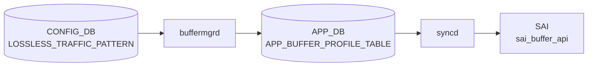

# LOSSLESS_TRAFFIC_PATTERN テーブル

## 概要

ロスレスフロー ([PFC](../../reference/glossary.md#term-pfc) で守るフロー) のトラフィックパターンを記述する設定テーブル[^1]。
ヘッドルームサイズの動的計算 (`buffermgrd` の dynamic-buffer モード) において、平均パケットサイズや小パケット比率を入力として使う。

<!-- cdb-mermaid -->
### データフロー (自動生成)



!!! note "凡例"
    CONFIG_DB から SAI までの典型経路を `docs/reference/config-db-orch-map.md` から機械生成したミニ図。詳細・例外は本ページ本文と対応表を参照。
<!-- /cdb-mermaid -->

## key 構造

```text
LOSSLESS_TRAFFIC_PATTERN|<name>
```

`<name>`: 1–32 文字。通常は `AZURE` の 1 件のみ。

## フィールド

| フィールド | 型 | 必須 | 説明 |
|-----------|----|----|------|
| `mtu` | uint16 (1..9216) | yes | ロスレスパケットの最大サイズ。ヘッドルームの XOFF サイズ計算に使う |
| `small_packet_percentage` | uint8 (0..100) | yes | 小パケット (`<= mtu/2` 想定) の比率。これが大きいほどヘッドルームを増やす |

## 購読者

- `buffermgrd` (dynamic buffer モード)。`headroom-pool-calculation` Jinja マクロ系で参照

## 関連 CONFIG_DB / YANG

- 関連 [CONFIG_DB](../../reference/glossary.md#term-config_db): `DEFAULT_LOSSLESS_BUFFER_PARAMETER`, `BUFFER_PROFILE`, `BUFFER_POOL`
- 関連 [YANG](../../reference/glossary.md#term-yang): `sonic-lossless-traffic-pattern`

<!-- ref-triangle:start -->

## 関連リファレンス

- [YANG](../../reference/glossary.md#term-yang): `sonic-lossless-traffic-pattern`

<!-- ref-triangle:end -->

## 引用元

[^1]: [YANG](../../reference/glossary.md#term-yang) 定義: `sonic-lossless-traffic-pattern.yang`. <https://github.com/sonic-net/sonic-buildimage/blob/9ea932ec2e18f35e58268ec2e4456b1d4afd65cd/src/sonic-yang-models/yang-models/sonic-lossless-traffic-pattern.yang>

## 関連ページ
- [CONFIG_DB: DEFAULT_LOSSLESS_BUFFER_PARAMETER](default-lossless-buffer-parameter.md)
- [CONFIG_DB: BUFFER_PROFILE](buffer-profile.md)

<!-- ops-hint -->
## 運用ヒント

### 典型値

- key: `LOSSLESS_TRAFFIC_PATTERN|AZURE` (通常 1 件のみ)。
- `mtu`: `1500` または `9216` (jumbo)。
- `small_packet_percentage`: 経験的に `50` 程度。

### よくある誤設定

- `mtu` を実 MTU と乖離した値にし、ヘッドルームが過小/過大になる。
- dynamic-buffer モード以外でこのテーブルを変更しても効かない (`buffermgrd` の動的モードのみ参照)。

### 確認コマンド

```bash
sonic-db-cli CONFIG_DB hgetall 'LOSSLESS_TRAFFIC_PATTERN|AZURE'
show buffer profile
```
<!-- /ops-hint -->

<!-- value-behavior -->
## 値依存挙動マトリクス

このテーブルに enum フィールドはない。数値フィールドの値と dynamic buffer モードの有無で動作が決まる。

### `mtu`（uint16 1..9216）

| 値 | 挙動 |
|----|------|
| `1500` | 標準イーサネット MTU。ヘッドルーム計算の標準入力 |
| `9216` | ジャンボフレーム。ヘッドルームが大きくなる |
| 未設定 | `buffermgrdyn` がデフォルト mtu 値を使用（"if mtu isn't configured, take the default value"） |
| 実 MTU と乖離した値 | headroom が過小（パケットロス）または過大（バッファ浪費）。バリデーションなし |

### `small_packet_percentage`（uint8 0..100）

| 値 | 挙動 |
|----|------|
| `0` | 小パケットなし。ヘッドルーム計算で最小のマージンを使用 |
| `50` | 経験的な標準値 |
| `100` | 全パケットが小パケット想定。ヘッドルームを最大化 |
| 0〜100 範囲外 | コード上バリデーションなし → headroom 計算式が異常値を返す可能性 |

### dynamic バッファモードの有無

| 条件 | 挙動 |
|------|------|
| dynamic buffer モード | `buffermgrdyn` がこのテーブルを参照してヘッドルームを動的計算 |
| 静的バッファモード | `buffermgr.cpp` はこのテーブルを参照しない。設定変更は headroom 計算に影響しない |

<!-- /value-behavior -->

<!-- cdb-exceptions -->
## 例外条件・特殊挙動

<!-- evidence: sonic-swss/cfgmgr/buffermgrdyn.cpp, sonic-utilities/scripts/db_migrator.py -->

| 条件 | 挙動 |
|------|------|
| dynamic バッファモード以外 | `buffermgr.cpp`（静的モード）はこのテーブルを参照しない。設定変更は headroom 計算に影響しない |
| `mtu` 未設定 | `buffermgrdyn` がデフォルト mtu 値を使用（buffermgrdyn.cpp L2263「if mtu isn't configured, take the default value」） |
| `mtu` が実 MTU と乖離 | headroom が過小（パケットロス）または過大（バッファ浪費）になる。バリデーションなし |
| `small_packet_percentage` が 0〜100 範囲外 | コード上でバリデーションなし。headroom 計算式が異常値を返す可能性。YANG スキーマ依存 |
| DB migration 時（AZURE エントリ自動挿入） | `db_migrator.py` L414 が `mtu=1024, small_packet_percentage=100` を挿入。Mellanox 向け初期値で他プラットフォームには不適切な場合がある |
| バッファプール未設定 | `SWSS_LOG_INFO("No shared buffer pool configured, skip calculating shared buffer pool size")` → サイレントスキップ |

<!-- /cdb-exceptions -->


<!-- runtime-trace -->
## 実コンテナ動作トレース

### 段階 1 — Consumer 登録

`buffermgrdyn` (動的バッファ管理) が CONFIG_DB の `LOSSLESS_TRAFFIC_PATTERN` テーブルを購読する。

`LOSSLESS_TRAFFIC_PATTERN` の key は `AZURE` 等のパターン名。`mtu` / `small_packet_percentage` 等のパラメータを保持。

### 段階 2 — CFG→APPL 翻訳

なし (内部計算パラメータ)

### 段階 3 — APPL→SAI

なし (直接 SAI 呼び出しなし — 計算結果が BUFFER_PROFILE 経由で SAI に到達)

### 段階 4 — タイミングと副作用

**適用タイミング**: CONFIG_DB 変化を `buffermgrdyn` が検知後、lossless バッファプロファイルを再計算。再計算結果が APPL_DB の BUFFER_PROFILE_TABLE に書き込まれる。

**副作用**: PFC lossless traffic パターン変更は lossless バッファ量の再計算を引き起こす。すべての lossless ポートのバッファプロファイルが再生成される。
<!-- /runtime-trace -->

<!-- entry-points -->
## 書き込み入り口 (Direction A)

対象テーブル: `LOSSLESS_TRAFFIC_PATTERN`

### CLI
- `config buffer lossless-traffic-pattern <mtu> <small_packet_percentage>`
  - ソース: `sonic-utilities/config/main.py (buffer グループ)`

### minigraph / sonic-cfggen
- なし

### REST / gNMI (sonic-mgmt-common)
- なし (対応 OpenConfig/SONiC YANG transformer なし)

### db_migrator
- なし

### ビルド時デフォルト (init_cfg / j2 テンプレート)
- `buffers_config.j2` からデフォルト MTU / small_packet_percentage が生成される場合あり

### ハードコードデフォルト
- なし

### ランタイム注入 (デーモン自動書き込み)
- `buffermgrd` がこのテーブルを読み取り Lossless バッファプロファイルを動的に算出
<!-- /entry-points -->

<!-- defaults -->
## コード由来の暗黙デフォルト (Phase A)

### `mtu`

| 検出種類 | 暗黙値 / 挙動 | 証拠 |
|---|---|---|
| **ハードコード固定値（j2 テンプレート）** | `"1024"` — `dynamic_mode` が定義されている場合に書き込まれるビルド時デフォルト。ポートの実 MTU（9216 等）とは無関係に固定 | `buffers_config.j2:344` |
| **ハードコード固定値（db_migrator 移行）** | `"1024"` — 静的→動的バッファ移行時（Mellanox 系）にハードコードで INSERT | `db_migrator.py:414` |
| **エントリ不在時 Lua エラー** | `LOSSLESS_TRAFFIC_PATTERN` エントリが一切存在しない場合、Lua の `redis.call('HGETALL', lossless_traffic_keys[1])` が `nil` インデックスエラーで失敗 → lossless ヘッドルーム計算が不能になる | `buffer_headroom_mellanox.lua:91-94` |

### `small_packet_percentage`

| 検出種類 | 暗黙値 / 挙動 | 証拠 |
|---|---|---|
| **ハードコード固定値（j2 テンプレート）** | `"50"` — dynamic buffer モード全プラットフォームのビルド時デフォルト | `buffers_config.j2:345` |
| **ハードコード固定値（db_migrator 移行）** | `"100"` — 同移行経路でハードコード INSERT | `db_migrator.py:414` |
| **経路依存 discrepancy** | j2 テンプレート経由では `50`、db_migrator 移行経由では `100` — 同一フィールドで経路によって初期値が異なる | `buffers_config.j2:345` / `db_migrator.py:414` |
| **フィールド欠落時 Lua 算術エラー** | `small_packet_percentage` が `nil` の場合、乗算式 `small_packet_percentage * minimal_packet_size` が Lua 算術エラーで失敗 → YANG `mandatory true` で通常防止されるが、手動 redis-cli 書き込み時は発生する可能性 | `buffer_headroom_mellanox.lua:146` |

> **スキャン証跡**: `buffers_config.j2` L342-347 全行読了、`db_migrator.py` L414 確認、`buffer_headroom_mellanox.lua` L91-102, 146-147 全行読了、`buffer_headroom_barefoot.lua` L80-90, 114 全行読了、`sonic-lossless-traffic-pattern.yang` 全行読了。
<!-- /defaults -->

<!-- ordering -->
## 書込順依存 (Task F Phase B)

`LOSSLESS_TRAFFIC_PATTERN` はベンダー別 Lua プラグイン (`buffer_headroom_<vendor>.lua`) が
`buffermgrdyn` から呼び出された際に CONFIG_DB から直接参照される。
そのため、ヘッドルーム計算が走るより前にこのテーブルが CONFIG_DB に存在していなければならない。

### BUFFER_POOL 先行必須

`buffermgrdyn` はヘッドルーム計算全体を `m_bufferPoolReady` フラグで制御する。
`m_bufferPoolReady == false` の間は Lua プラグイン自体が呼び出されないため、
`LOSSLESS_TRAFFIC_PATTERN` が CONFIG_DB に存在していても headroom 計算は実行されない。

| 依存テーブル | 理由 | 違反時の挙動 | evidence |
|---|---|---|---|
| `BUFFER_POOL` | `m_bufferPoolReady == false` のままでは Lua プラグインが呼ばれない | BUFFER_PROFILE の APPL_DB 書き込みがデファー。pool 登録後に `handlePendingBufferObjects()` が一括適用 | `buffermgrdyn.cpp:892-896` |

### DEFAULT_LOSSLESS_BUFFER_PARAMETER 先行必須

`buffermgrdyn` は `m_defaultThreshold` が空の場合もヘッドルーム計算をデファーする。
`m_defaultThreshold` は `DEFAULT_LOSSLESS_BUFFER_PARAMETER` の `default_dynamic_th` フィールドから取得する。
また Lua プラグイン自身も `DEFAULT_LOSSLESS_BUFFER_PARAMETER` テーブルを直接参照する。

| 依存テーブル | 理由 | 違反時の挙動 | evidence |
|---|---|---|---|
| `DEFAULT_LOSSLESS_BUFFER_PARAMETER` | `m_defaultThreshold.empty()` でデファー。Lua 内でも `KEYS DEFAULT_LOSSLESS_BUFFER_PARAMETER*` + `HGET over_subscribe_ratio` を直接読む | BUFFER_PROFILE の APPL_DB 書き込みがデファー | `buffermgrdyn.cpp:1460` / `buffer_headroom_mellanox.lua:105-106` |

### LOSSLESS_TRAFFIC_PATTERN 自身の存在必須制約

`buffer_headroom_<vendor>.lua` は `KEYS 'LOSSLESS_TRAFFIC_PATTERN*'` でキー一覧を取得し、
`lossless_traffic_keys[1]` に対して `HGETALL` を実行する。
エントリが 0 件の場合 `lossless_traffic_keys[1]` は `nil` となり、
`HGETALL nil` が Lua エラーとなってヘッドルーム計算全体が失敗する。
その結果、動的バッファモデルにおける全ロスレスポートの BUFFER_PROFILE が
APPL_DB に転送されず、PFC ヘッドルームが設定されない状態になる。

| 条件 | 挙動 | evidence |
|---|---|---|
| `LOSSLESS_TRAFFIC_PATTERN` エントリが 0 件 | `lossless_traffic_keys[1]` が nil → `HGETALL nil` → Lua エラー → headroom 計算失敗 | `buffer_headroom_mellanox.lua:91-94` |
| `LOSSLESS_TRAFFIC_PATTERN` エントリが 0 件 (Barefoot) | 同様: `lossless_traffic_keys[1]` が nil → `HGETALL nil` → エラー | `buffer_headroom_barefoot.lua:80-83` |

### STATE_DB.ASIC_TABLE 先行必須 (Mellanox のみ)

Mellanox 向け Lua プラグインは STATE_DB の `ASIC_TABLE` から `cell_size`、`pipeline_latency`、
`mac_phy_delay`、`peer_response_time` を読み込む。
これらは LOSSLESS_TRAFFIC_PATTERN の値 (`mtu`、`small_packet_percentage`) とともに
ヘッドルーム計算式に入力される。

| 依存テーブル | 理由 | 違反時の挙動 | evidence |
|---|---|---|---|
| `STATE_DB.ASIC_TABLE` (Mellanox) | `cell_size` 等の ASIC パラメータが取得できなければ計算式が `nil` 演算でエラー | headroom 計算失敗 → BUFFER_PROFILE が APPL_DB に転送されない | `buffer_headroom_mellanox.lua:61-80` |

詳細スキャンノートは `meta/_intermediate/cdb-flow/lossless-traffic-pattern-ordering.md` を参照。
<!-- /ordering -->

<!-- cross-refs -->
## 暗黙参照テーブル (Phase C)

`LOSSLESS_TRAFFIC_PATTERN` の YANG モデルは他テーブルへの leafref を一切持たないが、
`buffermgrdyn` から呼び出されるベンダー別 Lua プラグイン (`buffer_headroom_<vendor>.lua`) が
実行時に 3 つのテーブルを暗黙参照する。

### 1. STATE_DB.ASIC_TABLE

- **参照先テーブル**: `ASIC_TABLE*`（STATE_DB）
- **参照フィールド**: `cell_size`、`pipeline_latency`、`mac_phy_delay`、`peer_response_time`
- **参照方向**: `KEYS ASIC_TABLE*` → `HGETALL asic_keys[1]`（読み取り）
- **対象 Lua スクリプト**:
  - `buffer_headroom_mellanox.lua:62-80`
  - `buffer_headroom_barefoot.lua:57-76`
- **意味**:
  - これらの ASIC パラメータは `mtu`・`small_packet_percentage` とともにヘッドルーム計算式に入力される。
  - `asic_keys[1]` が nil（STATE_DB 未投入）の場合、`HGETALL nil` で Lua エラーとなり headroom 計算全体が失敗する。
  - ASIC_TABLE は `syncd` が ASIC 初期化時に STATE_DB へ書き込む。SONiC 起動シーケンス上 `buffermgrdyn` より先に完了するため、通常は問題にならない。

### 2. CONFIG_DB.DEFAULT_LOSSLESS_BUFFER_PARAMETER

- **参照先テーブル**: `DEFAULT_LOSSLESS_BUFFER_PARAMETER*`（CONFIG_DB）
- **参照フィールド**: `over_subscribe_ratio`
- **参照方向**: `KEYS DEFAULT_LOSSLESS_BUFFER_PARAMETER*` → `HGET ... over_subscribe_ratio`（読み取り）
- **対象 Lua スクリプト**: `buffer_headroom_mellanox.lua:105-106`
- **意味**:
  - `over_subscribe_ratio` は Shared Headroom Pool サイズの分母として使われる。
  - Lua スクリプトが直接 CONFIG_DB を参照するため、`buffermgrdyn` 本体の `m_defaultThreshold` キャッシュとは独立して読み取られる。
  - `DEFAULT_LOSSLESS_BUFFER_PARAMETER` エントリが存在しない場合、`default_lossless_param_keys[1]` が nil となり Lua エラー。

### 3. CONFIG_DB.BUFFER_POOL (ingress_lossless_pool)

- **参照先テーブル**: `BUFFER_POOL|ingress_lossless_pool`（CONFIG_DB）
- **参照フィールド**: `xoff`（Shared Headroom Pool サイズ）
- **参照方向**: `HGET BUFFER_POOL|ingress_lossless_pool xoff`（読み取り）
- **対象 Lua スクリプト**:
  - `buffer_headroom_mellanox.lua:109`
  - `buffer_headroom_barefoot.lua:94`
- **意味**:
  - `xoff` 値が Shared Headroom Pool (SHP) のサイズとして headroom 計算に組み込まれる。
  - フィールドが存在しない（SHP 未設定）場合、`tonumber(nil)` → `shp_size = nil` となる。Lua の算術では nil は計算エラーになるが、実際の計算式では `shp_size` が 0 扱いになるパスが多い。

### 参照関係サマリ

```
LOSSLESS_TRAFFIC_PATTERN (CONFIG_DB)  ←── 読み取られる側（leafref なし）
  Lua プラグイン (buffer_headroom_<vendor>.lua) が実行時に以下を暗黙参照
  ├─ [必須] STATE_DB.ASIC_TABLE               (cell_size / pipeline_latency 等)
  ├─ [必須] CONFIG_DB.DEFAULT_LOSSLESS_BUFFER_PARAMETER  (over_subscribe_ratio)
  └─ [条件] CONFIG_DB.BUFFER_POOL|ingress_lossless_pool  (xoff / SHP サイズ)
```

> **スキャン証跡**: `buffer_headroom_mellanox.lua` L55-110 全行読了、`buffer_headroom_barefoot.lua` L55-94 全行読了、`sonic-lossless-traffic-pattern.yang` 全行読了（leafref なし確認済み）。3 件暗黙参照抽出。
<!-- /cross-refs -->

<!-- failure -->
## 失敗・リトライ挙動 (Phase D)

`LOSSLESS_TRAFFIC_PATTERN` テーブルの値は `buffermgrdyn` が直接購読するのではなく、
ベンダー別 Lua ヘッドルーム計算プラグイン（`buffer_headroom_<vendor>.lua`）が実行時に
CONFIG_DB から直接参照する。そのため、C++ レイヤーの retry メカニズムは存在せず、
Lua 実行失敗はヘッドルーム計算の中断として現れる。
詳細スキャンノートは `meta/_intermediate/cdb-flow/lossless-traffic-pattern-failure.md` を参照。

### 失敗モード一覧

| # | 失敗条件 | 検出場所 | 直接影響 | 復旧手順 |
|---|----------|---------|---------|---------|
| 1 | `LOSSLESS_TRAFFIC_PATTERN` エントリが 0 件 | `buffer_headroom_<vendor>.lua` — `lossless_traffic_keys[1]` が `nil` → `HGETALL nil` → Lua エラー | `calculateHeadroom()` が `catch(...)` で捕捉 → `SWSS_LOG_WARN` → BUFFER_PROFILE が APPL_DB に書き込まれない | 正しい値で `LOSSLESS_TRAFFIC_PATTERN|<name>` を SET する |
| 2 | `mtu` または `small_packet_percentage` フィールド欠損 | Lua `tonumber(nil)` → 算術演算で nil エラー | 同上 (Lua エラーで計算中断) | 両フィールドを含む正しいエントリを SET する |
| 3 | Lua が空リストを返す（計算式入力不正） | `buffermgrdyn.cpp:621-623` — `ret.empty()` チェック | `SWSS_LOG_WARN("Failed to calculate headroom for %s")` → headroom 値が更新されない | フィールド値（`mtu`、`small_packet_percentage`）を適正値に修正する |
| 4 | DEL 操作後の次回計算 | Lua `KEYS 'LOSSLESS_TRAFFIC_PATTERN*'` → 0 件 → 上記 #1 と同様 | 全 lossless ポートのヘッドルーム再計算が失敗 | エントリを再 SET する |
| 5 | static buffer モード | `buffermgr.cpp` はこのテーブルを参照しない | エラーなし（**silent skip**）— 値変更は headroom 計算に影響しない | 動的バッファモード (`buffermgrdyn`) でのみ設定変更が有効 |

### 失敗の伝播経路

```text
LOSSLESS_TRAFFIC_PATTERN 欠損/不正
  ↓
buffer_headroom_<vendor>.lua: Lua エラー
  ↓
buffermgrdyn.cpp calculateHeadroom(): catch(...) 捕捉
  → SWSS_LOG_WARN("Lua scripts for headroom calculation were not executed successfully")
  ↓
BUFFER_PROFILE の headroom 値が未更新
  ↓
APPL_DB APP_BUFFER_PROFILE_TABLE への書き込みが行われない
  ↓
orchagent / BufferOrch が古い headroom 値または未設定のまま SAI へ書き込む
  → 最悪ケース: PFC lossless フローのバッファが不足しパケットロス
```

### 注意点

- C++ 側には **リトライロジックが存在しない**。エラーが発生してもエントリは削除され、次のトリガイベント（他テーブルの変更等）が来るまで再計算は行われない。
- YANG `mandatory true` のため CLI / gNMI 経由では不正省略は防止される。手動 redis-cli 書き込みや誤った automation ツールで起こりうる。
- `mtu` に `0` や負値は YANG の `range "1..9216"` で拒否されるが、Lua 内でバリデーションはないため YANG をバイパスした書き込みでは `lossless_mtu = 0` となり計算結果が 0 になりうる。

<!-- /failure -->
<!-- glossary-links-injected: b5626ca1f0f9 -->
