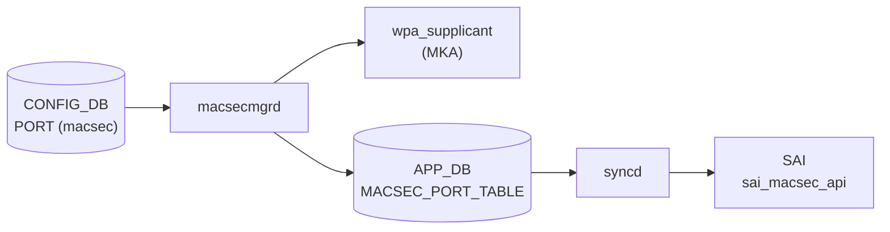

# PORT テーブル — `macsec` フィールド

## 概要

`PORT` テーブルの `macsec` フィールドは、ポートに適用する [MACsec](../../reference/glossary.md#term-macsec) プロファイル名を保持する[^1]。
`MACSEC_PROFILE` テーブルのエントリ名への leafref であり、このフィールドを設定することで `macsecmgrd` が `wpa_supplicant` を起動して MKA (MACsec Key Agreement) セッションを確立する。

フィールドが存在しない、または削除された場合は MACsec が無効化される。

<!-- cdb-mermaid -->
### データフロー (自動生成)



!!! note "凡例"
    CONFIG_DB から SAI までの典型経路を `docs/reference/config-db-orch-map.md` から機械生成したミニ図。詳細・例外は本ページ本文と対応表を参照。
<!-- /cdb-mermaid -->

## key 構造

`macsec` フィールドは既存の `PORT` テーブルエントリに追記される:

```text
PORT|<ifname>
    macsec = <profile_name>
```

- `<ifname>`: 物理ポート名 (例: `Ethernet0`)
- `<profile_name>`: `MACSEC_PROFILE` テーブルに存在するプロファイル名

## フィールド

| フィールド | 型 | 既定 | 説明 |
|-----------|----|------|------|
| `macsec` | leafref → `MACSEC_PROFILE.name` | — (省略可) | 適用する MACsec プロファイル名。省略時は MACsec 無効 |

<!-- defaults -->
## コード由来デフォルト値

> **出典**: `sonic-swss/cfgmgr/macsecmgr.cpp` (`enableMACsec` 関数)、`sonic-buildimage/dockers/docker-macsec/cli/config/plugins/macsec.py` (`add_port` コマンド)、`sonic-port.yang` (`leaf macsec` 定義) — 三者一致。

| フィールド | デフォルト値 | 根拠 |
|-----------|------------|------|
| `macsec` | — (省略可、省略時 = MACsec 無効) | YANG `default` ステートメントなし / C++ フィールド不在時 `disableMACsec()` を呼ぶ / CLI `profile` 引数は必須 (required) |

**明示的なデフォルト文字列は存在しない。** フィールドの有無が MACsec の有効/無効を直接制御する。

<!-- /defaults -->

## YANG 定義

`sonic-port.yang` での定義:

```yang
leaf macsec {
    description "MACsec profile name applied to the port.";
    type leafref {
        path "/macsec:sonic-macsec/macsec:MACSEC_PROFILE/macsec:MACSEC_PROFILE_LIST/macsec:name";
    }
}
```

`mandatory` なし・`default` なし。省略した場合は MACsec 無効。

## 制約

- `macsec` の値は `MACSEC_PROFILE` テーブルに存在するプロファイル名でなければならない (leafref 制約)
- CLI は `profile_entry = config_db.get_entry('MACSEC_PROFILE', profile)` で事前チェックを行い、プロファイルが存在しない場合は `ctx.fail()` でエラー

## 購読者

- `macsecmgrd` (`sonic-swss` の `MACsecMgr`): `CFG_PORT_TABLE_NAME` の SET/DEL イベントを購読
  - SET: `enableMACsec()` → `wpa_supplicant` 起動 → MKA セッション確立
  - DEL / macsec フィールドなし: `disableMACsec()` → `wpa_supplicant` 停止

## 関連 CONFIG_DB / YANG / CLI

- 関連 CONFIG_DB: `MACSEC_PROFILE` (プロファイル定義)
- 関連 CLI: `config macsec port add/del`
- 関連 [YANG](../../reference/glossary.md#term-yang): `sonic-port`, `sonic-macsec`

<!-- ref-triangle:start -->

## 関連リファレンス

- [YANG](../../reference/glossary.md#term-yang): [`sonic-macsec`](../yang/sonic-macsec.md)
- CONFIG_DB: [MACSEC_PROFILE](macsec-profile.md)

<!-- ref-triangle:end -->

## 引用元

[^1]: [YANG](../../reference/glossary.md#term-yang) 定義: `sonic-port.yang` (leaf macsec). <https://github.com/sonic-net/sonic-buildimage/blob/9ea932ec2e18f35e58268ec2e4456b1d4afd65cd/src/sonic-yang-models/yang-models/sonic-port.yang>

## 関連ページ

- [CONFIG_DB: MACSEC_PROFILE](macsec-profile.md)
- [CONFIG_DB: PORT](port.md)

<!-- ops-hint -->
## 運用ヒント

### 典型値

- key 形式: `PORT|Ethernet0`、フィールド: `macsec = myprofile`
- プロファイルを先に `MACSEC_PROFILE` に作成してからポートに割り当てる

### よくある誤設定

- `MACSEC_PROFILE` に存在しないプロファイル名を設定すると `macsecmgrd` が `task_need_retry` を返しセッションが確立されない
- MACsec を解除する場合は `config macsec port del <port>` で `macsec` フィールドを削除する (値を空にするのではなくフィールドを削除する)

### 確認コマンド

```bash
sonic-db-cli CONFIG_DB hget 'PORT|Ethernet0' macsec
config macsec port add Ethernet0 <profile_name>
config macsec port del Ethernet0
show macsec
```
<!-- /ops-hint -->

<!-- value-behavior -->
## 値依存挙動マトリクス

### `macsec`

| 値 | 挙動 |
|----|------|
| `<profile_name>` (有効なプロファイル名) | `macsecmgrd` が `wpa_supplicant` を起動し MKA セッションを確立。APPL_DB `MACSEC_PORT_TABLE` に書き込み |
| フィールド不在 / 空文字 | `disableMACsec()` が呼ばれる。MACsec 無効 |
| 存在しないプロファイル名 | `m_profiles.find(profile_name) == m_profiles.end()` → `SWSS_LOG_DEBUG` + `task_need_retry`。MACsec セッション未確立のまま待機 |

<!-- /value-behavior -->

<!-- cdb-exceptions -->
## 例外条件・特殊挙動

<!-- evidence: sonic-swss/cfgmgr/macsecmgr.cpp enableMACsec() -->

| 条件 | 挙動 |
|------|------|
| `macsec` フィールドなし / 空文字 | `disableMACsec()` を呼ぶ。ポートは非暗号化のまま継続 |
| 参照プロファイルが未ロード | `task_need_retry` を返して待機。プロファイルが `MACSEC_PROFILE` に設定されると再試行 |
| ポートが未 ready (state != "ok" または netdev_oper_status != "up") | `task_need_retry` を返して待機 |
| 既存プロファイルを別プロファイルに変更 | `disableMACsec()` を先に呼んでから新プロファイルで `enableMACsec()` を再実行。切替中に brief traffic interrupt が発生する |
| `wpa_supplicant` 起動失敗 | `SWSS_LOG_WARN` + `m_macsec_ports.erase()` + `task_need_retry`。MACsec 無効のままポートは継続 |
| `configureMACsec()` 失敗 | `disableMACsec()` にフォールバック。ポートは非暗号化のまま継続 |

<!-- /cdb-exceptions -->

<!-- runtime-trace -->
## 実コンテナ動作トレース

### 段階 1 — Consumer 登録

`macsecmgrd` が `CFG_PORT_TABLE_NAME` (`PORT`) を購読。SET イベントで `enableMACsec()`、DEL イベントで `disableMACsec()` を呼ぶ。

### 段階 2 — CFG→wpa_supplicant

`enableMACsec()`:
1. `macsec` フィールドからプロファイル名取得
2. `m_profiles` でプロファイル検索 (未ロードなら `task_need_retry`)
3. ポートの state/oper_status 確認 (未 ready なら `task_need_retry`)
4. `startWPASupplicant()` → `/sbin/wpa_supplicant -s -D macsec_sonic -g <sock>` を fork/exec
5. `configureMACsec()` → `wpa_cli` コマンドで MKA パラメータを投入

### 段階 3 — APPL→SAI

`MACsecOrch` が APPL_DB `MACSEC_PORT_TABLE` を購読し `sai_macsec_api` で SAI MACsec オブジェクトを作成。

### 段階 4 — タイミングと副作用

**適用タイミング**: CONFIG_DB 変化 → `macsecmgrd` 検知 → `wpa_supplicant` 起動/設定 → MKA ネゴシエーション → SAI MACsec SA 確立。非同期。

**副作用**: プロファイル変更時は既存 MACsec セッションを一旦切断してから再確立するため、brief traffic interrupt が発生する可能性がある。
<!-- /runtime-trace -->

<!-- entry-points -->
## 書き込み入り口 (Direction A)

対象テーブル: `PORT` (macsec フィールド)

### CLI
- `config macsec port add <port_name> <profile_name>` — `PORT.<port>.macsec = <profile_name>` を設定
- `config macsec port del <port_name>` — `PORT.<port>.macsec` フィールドを削除
  - ソース: `sonic-buildimage/dockers/docker-macsec/cli/config/plugins/macsec.py`

### minigraph / sonic-cfggen
- なし

### REST / gNMI (sonic-mgmt-common)
- なし

### db_migrator
- なし

### ビルド時デフォルト (init_cfg / j2 テンプレート)
- なし

### ハードコードデフォルト
- なし (フィールド不在 = MACsec 無効がコードデフォルト)

### ランタイム注入 (デーモン自動書き込み)
- なし
<!-- /entry-points -->

<!-- ordering -->
## 順序依存・起動順 (Phase B)

<!-- evidence: sonic-swss/cfgmgr/macsecmgr.cpp enableMACsec(), isPortStateOk(), removeProfile() -->

### PORT.macsec 有効化の前提条件

`PORT|<ifname>` の `macsec` フィールド SET イベントで `MACsecMgr::enableMACsec()` が呼ばれるが、以下の **2 条件をすべて満たすまで `task_need_retry` を返し続ける**。

1. **`MACSEC_PROFILE` が先にロードされていること**
   - `m_profiles.find(profile_name)` が失敗（プロファイル未登録）→ `task_need_retry`
   - `MACSEC_PROFILE|<name>` の SET イベントが `loadProfile()` で処理され、メモリキャッシュに格納されてから初めて有効になる。
   - 証跡: `cfgmgr/macsecmgr.cpp:488-495`

2. **PORT が STATE_DB で ready 状態であること**
   - `isPortStateOk(port_name)` が `STATE_PORT_TABLE_NAME` から `state == "ok"` かつ `netdev_oper_status == "up"` を確認する。
   - どちらか一方でも未達の場合は `task_need_retry`。
   - 証跡: `cfgmgr/macsecmgr.cpp:500-503, 614-631`

```
CONFIG_DB MACSEC_PROFILE|<name>  ← 先に存在必須
  ↓ (loadProfile 完了)
STATE_DB PORT_TABLE|<ifname>.state == "ok" && netdev_oper_status == "up"
  ↓ (両条件が揃ってから)
enableMACsec() → wpa_supplicant 起動 → MKA セッション確立
```

### プロファイル切替時の順序

ポートに既に MACsec が有効な状態で別のプロファイルを設定した場合:

```
disableMACsec()  ← 旧プロファイル解除・wpa_supplicant 停止
  ↓
enableMACsec()   ← 新プロファイルで wpa_supplicant を再起動・MKA 再確立
```

切替中に brief traffic interrupt が発生する。`disableMACsec()` が失敗した場合は新プロファイルの有効化に進まず `task_failed` を返す。
証跡: `cfgmgr/macsecmgr.cpp:519-527`

### プロファイル削除の順序ロック

`MACSEC_PROFILE` の DEL イベントで `removeProfile()` が呼ばれた際、当該プロファイルを参照しているポートが 1 つでも残っている間は `task_need_retry` を返し削除を拒否する。すべてのポートで `disableMACsec()` が完了してから削除が成立する。

```
MACSEC_PROFILE|<name> DEL
  ↓
removeProfile() — m_macsec_ports に当該 profile_name 参照ポートが存在するか検査
  ├─ 存在あり → task_need_retry (全ポート disableMACsec 完了まで待機)
  └─ 存在なし → m_profiles.erase() → task_success
```

証跡: `cfgmgr/macsecmgr.cpp:452-466`

### SAI MACsec オブジェクト作成順 (macsecorch)

APPL_DB 経由で `MACsecOrch` が SAI オブジェクトを生成する順序は厳密に定義されており、前段オブジェクトが未作成の場合は `task_need_retry` で待機する。

```
1. MACsec Switch Object  (initMACsecObject)   ← スイッチ単位で 1 回のみ
2. MACsec Port Object    (createMACsecPort)   ← PORT ごと
3. MACsec SC Object      (createMACsecSC)     ← Secure Channel ごと
4. MACsec SA Object      (createMACsecSA)     ← Secure Association ごと
```

削除は逆順 (SA → SC → Port → Switch) で行われる。

詳細分析: `meta/_intermediate/cdb-flow/macsec-port-ordering.md`
<!-- /ordering -->

<!-- cross-refs -->
## 暗黙参照テーブル (Phase C)

`PORT|<ifname>` の `macsec` フィールドを処理する際、`macsecmgrd` および `MACsecOrch` が Direction A 入力以外に暗黙的に参照するテーブル・DB を列挙する。スキャン詳細は `meta/_intermediate/cdb-flow/macsec-port-cross-refs.md` を参照。

### STATE_DB — PORT_TABLE（ポート ready ゲート）

| 参照先 | 参照方向 | 条件 | evidence |
|--------|---------|------|----------|
| STATE_DB `PORT_TABLE` (`state`, `netdev_oper_status`) | 読み出し (ゲート) — 必須 | `isPortStateOk()` が `state == "ok"` かつ `netdev_oper_status == "up"` を確認。未達なら `task_need_retry` | `macsecmgr.cpp:614-631` |

### CONFIG_DB — MACSEC_PROFILE（プロファイルキャッシュ）

| 参照先 | 参照方向 | 条件 | evidence |
|--------|---------|------|----------|
| CONFIG_DB `MACSEC_PROFILE` (`m_profiles` キャッシュ経由) | 読み出し (インメモリ) — 必須 | `m_profiles.find(profile_name)` が失敗するとプロファイル未ロードとして `task_need_retry` | `macsecmgr.cpp:488-495` |

### APPL_DB — MACSEC テーブル群（macsecmgrd → MACsecOrch パス）

| 参照先 | 参照方向 | 条件 | evidence |
|--------|---------|------|----------|
| APPL_DB `MACSEC_PORT_TABLE` | macsecmgrd が書き込み → MACsecOrch が読み出し | `enableMACsec()` 成功後 | `macsecorch.cpp:872-874` |
| APPL_DB `MACSEC_EGRESS_SC_TABLE` / `MACSEC_INGRESS_SC_TABLE` | MACsecOrch 読み出し | SC 作成時 | `macsecorch.cpp:876-882` |
| APPL_DB `MACSEC_EGRESS_SA_TABLE` / `MACSEC_INGRESS_SA_TABLE` | MACsecOrch 読み出し | SA 作成時 | `macsecorch.cpp:884-890` |

### STATE_DB — MACSEC 状態テーブル（MACsecOrch 書き戻し）

| 参照先 | 参照方向 | 条件 | evidence |
|--------|---------|------|----------|
| STATE_DB `STATE_MACSEC_PORT_TABLE_NAME` | 書き戻し (MACsecOrch) | SAI MACsec Port 作成後 | `macsecorch.cpp:633` |
| STATE_DB `STATE_MACSEC_{EGRESS,INGRESS}_SC_TABLE_NAME` | 書き戻し | SC 作成後 | `macsecorch.cpp:634-635` |
| STATE_DB `STATE_MACSEC_{EGRESS,INGRESS}_SA_TABLE_NAME` | 書き戻し | SA 作成後 | `macsecorch.cpp:636-637` |

### COUNTERS_DB — MACsec カウンタマップ

| 参照先 | 参照方向 | 条件 | evidence |
|--------|---------|------|----------|
| `COUNTERS_DB` `COUNTERS_MACSEC_NAME_MAP` / `COUNTERS_MACSEC_SA_GROUP` 等 | 書き込み (MACsecOrch) | MACsec SA 有効化後にフレックスカウンタを登録 | `macsecorch.cpp:639-667` |
<!-- /cross-refs -->

<!-- failure -->
## 失敗挙動 (Phase D)

<!-- evidence: sonic-swss/cfgmgr/macsecmgr.cpp enableMACsec(), disableMACsec(), startWPASupplicant() -->

### 失敗パス一覧

| # | トリガー | 発生箇所 | 結果 | retry |
|---|---------|---------|------|-------|
| 1 | `MACSEC_PROFILE` 未ロード | `enableMACsec()`: `m_profiles.find()` 失敗 | `SWSS_LOG_DEBUG` + `task_need_retry` | 無制限 |
| 2 | PORT が STATE_DB で未 ready (`state != "ok"` または `netdev_oper_status != "up"`) | `enableMACsec()`: `isPortStateOk()` 失敗 | `SWSS_LOG_DEBUG` + `task_need_retry` | 無制限 |
| 3 | `wpa_supplicant` fork 失敗 (`fork()` < 0) | `startWPASupplicant()` | `SWSS_LOG_WARN("Cannot start the wpa_supplicant of the port '%s' : %s")` + `m_macsec_ports.erase()` + `task_need_retry` | なし |
| 4 | `wpa_supplicant` execl 失敗 (pid = 0) | `startWPASupplicant()` | `SWSS_LOG_WARN` + `m_macsec_ports.erase()` + `task_failed` | なし |
| 5 | `wpa_supplicant` ソケット接続タイムアウト (RETRY_TIME 回失敗) | `startWPASupplicant()` ポーリングループ | `stopWPASupplicant()` → pid=0 として上位へ → `task_failed` | なし |
| 6 | `configureMACsec()` 失敗 (wpa_cli コマンド応答エラー) | `enableMACsec()` | `SWSS_LOG_WARN("The MACsec profile '%s' on the port '%s' loading fail")` + `disableMACsec()` でロールバック | なし |
| 7 | `unconfigureMACsec()` 失敗 (wpa_cli コマンド失敗) | `disableMACsec()` | `SWSS_LOG_WARN("Cannot stop MKA session on the port '%s'")` + `task_failed` | なし |
| 8 | `stopWPASupplicant()` 失敗 | `disableMACsec()` | `SWSS_LOG_WARN("Cannot stop WPA_SUPPLICANT process of the port '%s'")` + `task_failed`。プロセス残留の可能性あり | なし |

### task_failed 後の挙動

- `task_failed` 返却後、Consumer はエントリを破棄する。CONFIG_DB の `PORT|<ifname>.macsec` フィールドは残ったままになり、MACsec は無効状態で継続する。
- 失敗の記録先は syslog（`SWSS_LOG_WARN`）のみ。STATE_DB には `PORT.macsec` 固有の失敗エントリは書かれない。

### プロファイル変更時のロールバック

既存プロファイルから別プロファイルへ切り替える場合、`disableMACsec()` を先に呼ぶ。`disableMACsec()` が `task_failed` を返した場合は新プロファイルの `enableMACsec()` には進まず、`task_failed` をそのまま上位へ返す。
証跡: `cfgmgr/macsecmgr.cpp:519-530`

```bash
# syslog で失敗ログを確認
journalctl -u macsecmgrd | grep -iE "fail|warn|Cannot"
```

詳細調査: `meta/_intermediate/cdb-flow/macsec-port-failure.md`
<!-- /failure -->

<!-- constants -->
## ハードコード定数 (Phase E)

<!-- evidence: sonic-swss/cfgmgr/macsecmgr.cpp L27-49,L853 / sonic-swss/orchagent/macsecorch.cpp L24-42 -->

### macsecmgr.cpp — プロセス起動パス定数

| 定数 | 値 | 用途 | evidence |
|-----|-----|------|---------|
| `WPA_SUPPLICANT_CMD` | `"/sbin/wpa_supplicant"` | `startWPASupplicant()` で fork/exec する wpa_supplicant のフルパス | `macsecmgr.cpp:27` |
| `WPA_CLI_CMD` | `"/sbin/wpa_cli"` | `wpa_cli_exec()` / `wpa_cli_exec_and_check()` で呼び出す wpa_cli のフルパス | `macsecmgr.cpp:28` |
| `WPA_CONF` | `"/etc/wpa_supplicant.conf"` | wpa_supplicant 設定ファイルパス (起動引数として使用) | `macsecmgr.cpp:29` |
| `SOCK_DIR` | `"/var/run/"` | wpa_supplicant ソケットディレクトリ。`SOCK_DIR + port_name` でパスを構成 | `macsecmgr.cpp:30` |

### macsecmgr.cpp — wpa_supplicant 接続ポーリング定数

| 定数 | 値 | 用途 | evidence |
|-----|-----|------|---------|
| `RETRY_TIME` | `30` (回) | wpa_supplicant ソケット接続の最大ポーリング回数。0 でタイムアウト判定 → `stopWPASupplicant()` | `macsecmgr.cpp:32` |
| `RETRY_INTERVAL` | `100` ms | 各ポーリング間の待機時間。合計最大待機 = 30 × 100 = **3000 ms** | `macsecmgr.cpp:35` |
| `MAX_INTERFACE_REMOVE_RETRIES` | `3` (回) | `unconfigureMACsec()` での wpa_cli `interface_remove` タイムアウト時のリトライ上限。各リトライ間は 10 秒待機。FAIL 応答は即時成功扱い | `macsecmgr.cpp:853` |

### macsecmgr.cpp — AES キー長検証定数

| 定数 | 値 | 用途 | evidence |
|-----|-----|------|---------|
| `AES_LEN_128_BYTE` | `66` bytes | AES-128 CAK エンコード済み文字列長。先頭 2 bytes = magic salt index、残り 64 bytes = 32 byte CAK エンコード | `macsecmgr.cpp:48` |
| `AES_LEN_256_BYTE` | `130` bytes | AES-256 CAK エンコード済み文字列長。先頭 2 bytes = magic salt index、残り 128 bytes = 32 byte CAK エンコード | `macsecmgr.cpp:49` |

### macsecorch.cpp — SAI MACsec オブジェクト初期値

| 定数 | 値 | 用途 | evidence |
|-----|-----|------|---------|
| `DEFAULT_ENABLE_ENCRYPT` | `true` | MACsec Port 作成時の暗号化有効フラグ初期値 (`SAI_MACSEC_PORT_ATTR_ENABLE_ENCRYPT`) | `macsecorch.cpp:40,1424` |
| `DEFAULT_SCI_IN_SECTAG` | `false` | SecTAG 内 SCI 包含フラグの初期値 | `macsecorch.cpp:41,1425` |
| `DEFAULT_CIPHER_SUITE` | `SAI_MACSEC_CIPHER_SUITE_GCM_AES_128` | MACsec オブジェクト作成時のデフォルト暗号スイート。`MACSEC_PROFILE.cipher_suite` で上書きされる | `macsecorch.cpp:42,1426` |
| `m_max_sa_per_sc` SAI fallback | `4` | `SAI_MACSEC_ATTR_MAX_SECURE_ASSOCIATIONS_PER_SC` 非対応 SAI 向けフォールバック値 | `macsecorch.cpp:1330-1331` |

### macsecorch.cpp — ACL / Ethertype / 統計ポーリング定数

| 定数 | 値 | 用途 | evidence |
|-----|-----|------|---------|
| `AVAILABLE_ACL_PRIORITIES_LIMITATION` | `32` | MACsec ポートに割り当て可能な ACL 優先度エントリの最大数 | `macsecorch.cpp:24` |
| `EAPOL_ETHER_TYPE` | `0x888e` | EAPOL フレームの Ethertype。MKA ネゴシエーションパケット識別 | `macsecorch.cpp:25` |
| `PAUSE_ETHER_TYPE` | `0x8808` | PAUSE フレームの Ethertype。PFC バイパス/暗号化制御で参照 | `macsecorch.cpp:26` |
| `MACSEC_STAT_XPN_POLLING_INTERVAL_MS` | `1000` ms (1 秒) | XPN カウンタのポーリング間隔。ロールオーバー検出のため短めに設定 | `macsecorch.cpp:27` |
| `MACSEC_STAT_POLLING_INTERVAL_MS` | `10000` ms (10 秒) | 通常 MACsec 統計カウンタのポーリング間隔 | `macsecorch.cpp:28` |
| `PFC_MODE_DEFAULT` | `"bypass"` | PFC モード未指定時のデフォルト。MACsec Port 有効化後も PFC フレームは暗号化せずバイパスする | `macsecorch.cpp:32,2714` |

> **スキャン証跡**: `macsecmgr.cpp` L27-49, L853 精読。`macsecorch.cpp` L24-42, L646-669, L1330-1331, L1424-1426, L2714 精読。`macsecorch.h` L24 精読。定数 4 (パス) + 3 (ポーリング) + 2 (AES) + 4 (SAI) + 6 (ACL/Ethertype/stat) = 19 件抽出。中間ファイル: `meta/_intermediate/cdb-flow/macsec-port-constants.md`
<!-- /constants -->

<!-- side-effects -->
## 副次 DB 書込 (Phase F)

<!-- evidence: sonic-swss/orchagent/macsecorch.cpp createMACsecPort:1532-1535 / deleteMACsecPort:1792 / createMACsecSC:2039-2043 / deleteMACsecSC:2161-2165 / createMACsecSA:2371-2376 / deleteMACsecSA:2433-2437 / installCounter:2584-2593 / uninstallCounter:2613-2622 -->

`PORT.macsec` 設定を起点に `macsecmgrd` が `wpa_supplicant` 経由で MKA ネゴシエーションを完了すると、`MACsecOrch` が APPL_DB の MACsec テーブルを処理し以下の副次 DB 書込みを行う。主作用 (ASIC_DB への SAI MACsec オブジェクト書込み) を除く。

### STATE_DB — MACsec Port / SC / SA ステータス

`MACsecOrch::createMACsecPort()` は SAI MACsec Port 作成成功後に `STATE_MACSEC_PORT_TABLE_NAME` へ `max_sa_per_sc` / `state=ok` を書き込む (`macsecorch.cpp:1535`)。削除時は同エントリを削除 (`macsecorch.cpp:1792`)。

SC (Security Channel) / SA (Security Association) の作成・削除でも同様に STATE_DB へのエントリが書かれる:

| STATE_DB テーブル | キー | 書込タイミング |
|---|---|---|
| `STATE_MACSEC_PORT_TABLE_NAME` | `<port>` | SAI MACsec Port 作成/削除 (`macsecorch.cpp:1535, 1792`) |
| `STATE_MACSEC_EGRESS_SC_TABLE_NAME` | `<port>\|<sci>` | Egress SC 作成/削除 (`macsecorch.cpp:2039, 2161`) |
| `STATE_MACSEC_INGRESS_SC_TABLE_NAME` | `<port>\|<sci>` | Ingress SC 作成/削除 (`macsecorch.cpp:2043, 2165`) |
| `STATE_MACSEC_EGRESS_SA_TABLE_NAME` | `<port>\|<sci>\|<an>` | Egress SA 作成/削除 (`macsecorch.cpp:2371, 2433`) |
| `STATE_MACSEC_INGRESS_SA_TABLE_NAME` | `<port>\|<sci>\|<an>` | Ingress SA 作成/削除 (`macsecorch.cpp:2376, 2437`) |

### COUNTERS_DB / GB_COUNTERS_DB — COUNTERS_MACSEC_NAME_MAP

`installCounter()` (`macsecorch.cpp:2589`) は SAI MACsec SA / Flow オブジェクト登録時に `COUNTERS_DB` の `COUNTERS_MACSEC_NAME_MAP` テーブルへ `<obj_name>` → `<sai_object_id>` マッピングを `hset` で書き込む。削除時 (`macsecorch.cpp:2618`) は `hdel`。Gearbox が存在する場合は `GB_COUNTERS_DB` の同テーブルにも同様に書き込む (`macsecorch.cpp:2560-2568`)。

### FLEX_COUNTER_DB — SA / Flow 統計グループ

`installCounter()` は `FlexCounterManager` 経由で FLEX_COUNTER_DB に次の 3 グループを登録する:

| グループ | ポーリング間隔 | 用途 |
|---|---|---|
| `COUNTERS_MACSEC_SA_ATTR_GROUP` | 1000 ms | XPN カウンタ (ロールオーバー検出のため短周期) |
| `COUNTERS_MACSEC_SA_GROUP` | 10000 ms | SA 統計カウンタ (パケット数/バイト数) |
| `COUNTERS_MACSEC_FLOW_GROUP` | 10000 ms | Flow 統計カウンタ |

`setCounterIdList()` (`macsecorch.cpp:2584-2593`) で SA/Flow の SAI OID と統計属性リストを登録。削除時は `clearCounterIdList()` (`macsecorch.cpp:2613-2622`) で解除。

> **Evidence**: `sonic-swss/orchagent/macsecorch.cpp` L1535 (`m_state_macsec_port.set`), L1792 (`m_state_macsec_port.del`), L2039-2043 (SC set), L2161-2165 (SC del), L2371-2376 (SA set), L2433-2437 (SA del), L2560-2622 (counter 登録/削除)。中間ファイル: `meta/_intermediate/cdb-flow/macsec-port-side-effects.md`
<!-- /side-effects -->

<!-- pubsub -->
## Pub/Sub チャンネル (Phase G)

<!-- evidence: sonic-swss/cfgmgr/macsecmgrd.cpp L62-70,L80-105 / sonic-swss/cfgmgr/macsecmgr.cpp L289-349 / sonic-swss/orchagent/macsecorch.cpp L688-691 / sonic-swss/orchagent/orchdaemon.cpp L480-488 -->

`PORT.macsec` の設定変更は **3 層の pub/sub チャンネル** を経由してハードウェアへ伝達される。

### 層 1 — CONFIG_DB → macsecmgrd (SubscriberStateTable)

`macsecmgrd` は起動時に `MACsecMgr` へ次の 2 テーブルを `SubscriberStateTable` (Keyspace 通知ベース) として登録し、`Select` ループで受信する:

| 購読テーブル (CONFIG_DB) | SET ハンドラ | DEL ハンドラ | evidence |
|--------------------------|------------|------------|---------|
| `MACSEC_PROFILE` | `loadProfile()` — メモリキャッシュへ格納 | `removeProfile()` — キャッシュ削除 | `macsecmgr.cpp:296-297` |
| `PORT` | `enableMACsec()` — wpa_supplicant 起動・MKA セッション確立 | `disableMACsec()` — wpa_supplicant 停止 | `macsecmgr.cpp:298-299` |

**POST ゲート**: `macsecmgrd` は STATE_DB の MACsec POST 状態が `"pass"` または `"disabled"` になるまで `sleep(1); continue;` で CONFIG_DB イベントを全て無視する。ゲート通過後に初めて購読イベントが処理される。(`macsecmgrd.cpp:80-96`)

### 層 2 — APPL_DB → MACsecOrch (SubscriberStateTable)

`macsecmgrd` が wpa_supplicant 経由で MKA ネゴシエーション完了後に APPL_DB へ書き込み、`MACsecOrch` が購読する:

| 購読テーブル (APPL_DB) | 用途 | evidence |
|-----------------------|------|---------|
| `MACSEC_PORT_TABLE` | MACsec Port SAI オブジェクト作成/削除 | `orchdaemon.cpp:481` |
| `MACSEC_EGRESS_SC_TABLE` | Egress Secure Channel 管理 | `orchdaemon.cpp:482` |
| `MACSEC_INGRESS_SC_TABLE` | Ingress Secure Channel 管理 | `orchdaemon.cpp:483` |
| `MACSEC_EGRESS_SA_TABLE` | Egress Security Association 管理 | `orchdaemon.cpp:484` |
| `MACSEC_INGRESS_SA_TABLE` | Ingress Security Association 管理 | `orchdaemon.cpp:485` |

### 層 3 — ASIC_DB Notification → MACsecOrch (NotificationConsumer)

SAI MACsec POST (Power-On Self Test) 完了通知専用のチャンネル。ASIC_DB の `"NOTIFICATIONS"` チャンネルを `NotificationConsumer` で購読し、`"switch_macsec_post_status"` イベントを受信する:

```
ASIC_DB "NOTIFICATIONS" チャンネル
  └─ op == "switch_macsec_post_status"
       ├─ SAI_SWITCH_MACSEC_POST_STATUS_PASS → STATE_DB POST 状態 = "pass"
       └─ SAI_SWITCH_MACSEC_POST_STATUS_FAIL → STATE_DB POST 状態 = "fail"
```

(`macsecorch.cpp:688-691, 778-793`)

### 書き込みチャンネルまとめ

| 書き込み元 | 書き込み先 | チャンネル種別 |
|-----------|-----------|-------------|
| `macsecmgrd` | APPL_DB MACsec テーブル群 | `ProducerStateTable` |
| `MACsecOrch` | ASIC_DB (SAI) | `sai_macsec_api` 直接呼び出し |
| `MACsecOrch` | STATE_DB MACsec 状態テーブル | `Table::set()` / `Table::del()` |
| `MACsecOrch` | COUNTERS_DB / FLEX_COUNTER_DB | `FlexCounterManager` |

詳細調査: `meta/_intermediate/cdb-flow/macsec-port-pubsub.md`
<!-- /pubsub -->

<!-- platform -->
## プラットフォーム差 (Phase H)

`MACsecOrch` が SAI MACsec オブジェクトを生成する際のバックエンドは、ポートに **Gearbox PHY** が割り当てられているか、かつその PHY が MACsec をサポートするか (`macsec_supported`) によって 2 経路に分岐する。`macsecmgrd` 側 (cfgmgr) にはプラットフォーム分岐なし。

### バックエンド分岐ロジック

`MACsecOrchContext::get_port_id()` (L351–381) が採用する port_id:

| 構成 | `force_npu` | 使用する port_id | 使用する switch_id |
|------|-----------|----------------|-----------------|
| Gearbox PHY あり + `macsec_supported=true` | `false` | `port->m_line_side_id` (PHY ライン側) | `port->m_switch_id` (PHY スイッチ) |
| Gearbox PHY あり + `macsec_supported=false` | `true` | `port->m_port_id` (NPU) | `gSwitchId` (グローバル NPU) |
| Gearbox PHY なし | `true` | `port->m_port_id` (NPU) | `gSwitchId` (グローバル NPU) |

`macsec_supported=false` 時は `SWSS_LOG_NOTICE "backend=NPU (phy marked unsupported)"` が出力される (`macsecorch.cpp:374`)。

### Gearbox PHY 有効時のみ実行される処理

`createMACsecPort()` 内の PHY 専用コードパス (`macsecorch.cpp:1505–1527`):

| 処理 | 条件 | 内容 |
|------|------|------|
| PFC フォワード有効化 | `phy != nullptr` | `setPFCForward(port_id, true)` — PHY 経由でパケットが流れるため PFC フォワードが必要 |
| Port IPG 退避 + MACsec IPG 設定 | `phy != nullptr && phy->macsec_ipg != 0` | MACsec オーバーヘッド分の Inter-Packet Gap を PHY 仕様に合わせて変更 |
| PFC フォワード無効化 + IPG 復元 | `phy != nullptr` (削除時) | `deleteMACsecPort()` でロールバック (`macsecorch.cpp:1774–1785`) |

NPU バックエンド (Gearbox なし) では PFC フォワード変更・IPG 変更は**発生しない**。

### FlexCounter バックエンドの分岐

SA / フロー統計の収集先は `phy->macsec_supported` で切り替わる (`macsecorch.cpp:2536–2566`):

| 条件 | FlexCounter グループ |
|------|-------------------|
| `phy != nullptr && phy->macsec_supported` | `m_gb_macsec_*_manager` (Gearbox 側 COUNTERS_DB) |
| それ以外 | `m_macsec_*_manager` (NPU 側 COUNTERS_DB) |

!!! note "プラットフォーム識別は Gearbox 設定依存"
    MACsec のプラットフォーム分岐は `DEVICE_METADATA.platform` 文字列ではなく、`GEARBOX` テーブルの `phy` 定義 (`getGearboxPhy()`) と `macsec_supported` フラグで決まる。Gearbox 非搭載の環境（大多数の NPU 直結ポート）では分岐は発生せず NPU パスのみ。

詳細調査: `meta/_intermediate/cdb-flow/macsec-port-platform.md`
<!-- /platform -->
