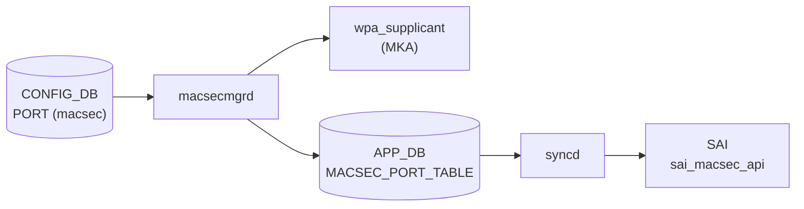

# PORT テーブル — `macsec` フィールド

## 概要

`PORT` テーブルの `macsec` フィールドは、ポートに適用する [MACsec](../../reference/glossary.md#term-macsec) プロファイル名を保持する[^1]。
`MACSEC_PROFILE` テーブルのエントリ名への leafref であり、このフィールドを設定することで `macsecmgrd` が `wpa_supplicant` を起動して MKA (MACsec Key Agreement) セッションを確立する。

フィールドが存在しない、または削除された場合は MACsec が無効化される。

<!-- cdb-mermaid -->
### データフロー (自動生成)



!!! note "凡例"
    CONFIG_DB から SAI までの典型経路を `docs/reference/config-db-orch-map.md` から機械生成したミニ図。詳細・例外は本ページ本文と対応表を参照。
<!-- /cdb-mermaid -->

## key 構造

`macsec` フィールドは既存の `PORT` テーブルエントリに追記される:

```text
PORT|<ifname>
    macsec = <profile_name>
```

- `<ifname>`: 物理ポート名 (例: `Ethernet0`)
- `<profile_name>`: `MACSEC_PROFILE` テーブルに存在するプロファイル名

## フィールド

| フィールド | 型 | 既定 | 説明 |
|-----------|----|------|------|
| `macsec` | leafref → `MACSEC_PROFILE.name` | — (省略可) | 適用する MACsec プロファイル名。省略時は MACsec 無効 |

<!-- defaults -->
## コード由来デフォルト値

> **出典**: `sonic-swss/cfgmgr/macsecmgr.cpp` (`enableMACsec` 関数)、`sonic-buildimage/dockers/docker-macsec/cli/config/plugins/macsec.py` (`add_port` コマンド)、`sonic-port.yang` (`leaf macsec` 定義) — 三者一致。

| フィールド | デフォルト値 | 根拠 |
|-----------|------------|------|
| `macsec` | — (省略可、省略時 = MACsec 無効) | YANG `default` ステートメントなし / C++ フィールド不在時 `disableMACsec()` を呼ぶ / CLI `profile` 引数は必須 (required) |

**明示的なデフォルト文字列は存在しない。** フィールドの有無が MACsec の有効/無効を直接制御する。

<!-- /defaults -->

## YANG 定義

`sonic-port.yang` での定義:

```yang
leaf macsec {
    description "MACsec profile name applied to the port.";
    type leafref {
        path "/macsec:sonic-macsec/macsec:MACSEC_PROFILE/macsec:MACSEC_PROFILE_LIST/macsec:name";
    }
}
```

`mandatory` なし・`default` なし。省略した場合は MACsec 無効。

## 制約

- `macsec` の値は `MACSEC_PROFILE` テーブルに存在するプロファイル名でなければならない (leafref 制約)
- CLI は `profile_entry = config_db.get_entry('MACSEC_PROFILE', profile)` で事前チェックを行い、プロファイルが存在しない場合は `ctx.fail()` でエラー

## 購読者

- `macsecmgrd` (`sonic-swss` の `MACsecMgr`): `CFG_PORT_TABLE_NAME` の SET/DEL イベントを購読
  - SET: `enableMACsec()` → `wpa_supplicant` 起動 → MKA セッション確立
  - DEL / macsec フィールドなし: `disableMACsec()` → `wpa_supplicant` 停止

## 関連 CONFIG_DB / YANG / CLI

- 関連 CONFIG_DB: `MACSEC_PROFILE` (プロファイル定義)
- 関連 CLI: `config macsec port add/del`
- 関連 [YANG](../../reference/glossary.md#term-yang): `sonic-port`, `sonic-macsec`

<!-- ref-triangle:start -->

## 関連リファレンス

- [YANG](../../reference/glossary.md#term-yang): [`sonic-macsec`](../yang/sonic-macsec.md)
- CONFIG_DB: [MACSEC_PROFILE](macsec-profile.md)

<!-- ref-triangle:end -->

## 引用元

[^1]: [YANG](../../reference/glossary.md#term-yang) 定義: `sonic-port.yang` (leaf macsec). <https://github.com/sonic-net/sonic-buildimage/blob/9ea932ec2e18f35e58268ec2e4456b1d4afd65cd/src/sonic-yang-models/yang-models/sonic-port.yang>

## 関連ページ

- [CONFIG_DB: MACSEC_PROFILE](macsec-profile.md)
- [CONFIG_DB: PORT](port.md)

<!-- ops-hint -->
## 運用ヒント

### 典型値

- key 形式: `PORT|Ethernet0`、フィールド: `macsec = myprofile`
- プロファイルを先に `MACSEC_PROFILE` に作成してからポートに割り当てる

### よくある誤設定

- `MACSEC_PROFILE` に存在しないプロファイル名を設定すると `macsecmgrd` が `task_need_retry` を返しセッションが確立されない
- MACsec を解除する場合は `config macsec port del <port>` で `macsec` フィールドを削除する (値を空にするのではなくフィールドを削除する)

### 確認コマンド

```bash
sonic-db-cli CONFIG_DB hget 'PORT|Ethernet0' macsec
config macsec port add Ethernet0 <profile_name>
config macsec port del Ethernet0
show macsec
```
<!-- /ops-hint -->

<!-- value-behavior -->
## 値依存挙動マトリクス

### `macsec`

| 値 | 挙動 |
|----|------|
| `<profile_name>` (有効なプロファイル名) | `macsecmgrd` が `wpa_supplicant` を起動し MKA セッションを確立。APPL_DB `MACSEC_PORT_TABLE` に書き込み |
| フィールド不在 / 空文字 | `disableMACsec()` が呼ばれる。MACsec 無効 |
| 存在しないプロファイル名 | `m_profiles.find(profile_name) == m_profiles.end()` → `SWSS_LOG_DEBUG` + `task_need_retry`。MACsec セッション未確立のまま待機 |

<!-- /value-behavior -->

<!-- cdb-exceptions -->
## 例外条件・特殊挙動

<!-- evidence: sonic-swss/cfgmgr/macsecmgr.cpp enableMACsec() -->

| 条件 | 挙動 |
|------|------|
| `macsec` フィールドなし / 空文字 | `disableMACsec()` を呼ぶ。ポートは非暗号化のまま継続 |
| 参照プロファイルが未ロード | `task_need_retry` を返して待機。プロファイルが `MACSEC_PROFILE` に設定されると再試行 |
| ポートが未 ready (state != "ok" または netdev_oper_status != "up") | `task_need_retry` を返して待機 |
| 既存プロファイルを別プロファイルに変更 | `disableMACsec()` を先に呼んでから新プロファイルで `enableMACsec()` を再実行。切替中に brief traffic interrupt が発生する |
| `wpa_supplicant` 起動失敗 | `SWSS_LOG_WARN` + `m_macsec_ports.erase()` + `task_need_retry`。MACsec 無効のままポートは継続 |
| `configureMACsec()` 失敗 | `disableMACsec()` にフォールバック。ポートは非暗号化のまま継続 |

<!-- /cdb-exceptions -->

<!-- runtime-trace -->
## 実コンテナ動作トレース

### 段階 1 — Consumer 登録

`macsecmgrd` が `CFG_PORT_TABLE_NAME` (`PORT`) を購読。SET イベントで `enableMACsec()`、DEL イベントで `disableMACsec()` を呼ぶ。

### 段階 2 — CFG→wpa_supplicant

`enableMACsec()`:
1. `macsec` フィールドからプロファイル名取得
2. `m_profiles` でプロファイル検索 (未ロードなら `task_need_retry`)
3. ポートの state/oper_status 確認 (未 ready なら `task_need_retry`)
4. `startWPASupplicant()` → `/sbin/wpa_supplicant -s -D macsec_sonic -g <sock>` を fork/exec
5. `configureMACsec()` → `wpa_cli` コマンドで MKA パラメータを投入

### 段階 3 — APPL→SAI

`MACsecOrch` が APPL_DB `MACSEC_PORT_TABLE` を購読し `sai_macsec_api` で SAI MACsec オブジェクトを作成。

### 段階 4 — タイミングと副作用

**適用タイミング**: CONFIG_DB 変化 → `macsecmgrd` 検知 → `wpa_supplicant` 起動/設定 → MKA ネゴシエーション → SAI MACsec SA 確立。非同期。

**副作用**: プロファイル変更時は既存 MACsec セッションを一旦切断してから再確立するため、brief traffic interrupt が発生する可能性がある。
<!-- /runtime-trace -->

<!-- entry-points -->
## 書き込み入り口 (Direction A)

対象テーブル: `PORT` (macsec フィールド)

### CLI
- `config macsec port add <port_name> <profile_name>` — `PORT.<port>.macsec = <profile_name>` を設定
- `config macsec port del <port_name>` — `PORT.<port>.macsec` フィールドを削除
  - ソース: `sonic-buildimage/dockers/docker-macsec/cli/config/plugins/macsec.py`

### minigraph / sonic-cfggen
- なし

### REST / gNMI (sonic-mgmt-common)
- なし

### db_migrator
- なし

### ビルド時デフォルト (init_cfg / j2 テンプレート)
- なし

### ハードコードデフォルト
- なし (フィールド不在 = MACsec 無効がコードデフォルト)

### ランタイム注入 (デーモン自動書き込み)
- なし
<!-- /entry-points -->
