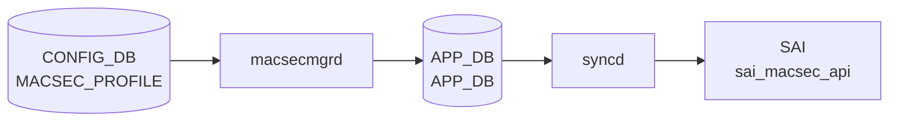

# MACSEC_PROFILE テーブル

## 概要

IEEE 802.1AE MACsec のセキュリティプロファイルを定義するテーブル[^1]。
`PORT.macsec` (port 側の leaf) から名前参照され、`macsecmgrd` / `wpa_supplicant` ベースの MKA (MACsec Key Agreement) 実装が CAK/CKN を読んで MACsec SA を確立する。

<!-- cdb-mermaid -->
### データフロー (自動生成)



!!! note "凡例"
    CONFIG_DB から SAI までの典型経路を `docs/reference/config-db-orch-map.md` から機械生成したミニ図。詳細・例外は本ページ本文と対応表を参照。
<!-- /cdb-mermaid -->

## key 構造

```text
MACSEC_PROFILE|<name>
```

`<name>`: 1–128 文字。

## フィールド

| フィールド | 型 | 既定 | 説明 |
|-----------|----|------|------|
| `priority` | uint8 | `255` | MKA アクター優先度。**小さいほど key server になりやすい** |
| `cipher_suite` | enum `GCM-AES-128` / `GCM-AES-256` / `GCM-AES-XPN-128` / `GCM-AES-XPN-256` | `GCM-AES-128` | データ暗号化アルゴリズム |
| `primary_cak` | hex 66 文字 (128-bit + KCK) または 130 文字 (256-bit) | — (mandatory) | プライマリ CAK |
| `primary_ckn` | hex 32 / 64 文字 | — (mandatory) | プライマリ CKN |
| `fallback_cak` | hex 66 / 130 文字 | — | プライマリ失敗時のフォールバック CAK |
| `fallback_ckn` | hex 32 / 64 文字 | — | フォールバック CKN |
| `policy` | `integrity_only` / `security` | `security` | 認証のみか暗号化込みか |
| `enable_replay_protect` | boolean | `false` | リプレイ保護の有効化 |
| `replay_window` | uint32 | — | `enable_replay_protect = true` 時のみ意味を持つ |
| `send_sci` | boolean | `true` | 送信フレームに SCI を含める |
| `rekey_period` | uint32 | `0` | 能動的 SAK 再生成周期 [秒]。0 で再生成しない |

## 制約 (YANG `must`)

- `fallback_cak` を設定する場合は `primary_cak` と同じ長さ
- `fallback_ckn != primary_ckn`

## 購読者

- `macsecmgrd` (`sonic-swss` の MacSecMgr)、`macsecorch`
- 配下で `wpa_supplicant` が MKA セッションを実行

## 関連 CONFIG_DB / YANG / CLI

- 関連 [CONFIG_DB](../../reference/glossary.md#term-config_db): `PORT` (`macsec` フィールドでプロファイル名参照)
- 関連 [YANG](../../reference/glossary.md#term-yang): `sonic-macsec`

<!-- ref-triangle:start -->

## 関連リファレンス

- [YANG](../../reference/glossary.md#term-yang): [`sonic-macsec`](../yang/sonic-macsec.md)

<!-- ref-triangle:end -->

<!-- cross-refs -->
## 暗黙参照 (Phase C)

<!-- source: sonic-swss/cfgmgr/macsecmgr.cpp -->

### PORT テーブルからの参照

`PORT` テーブルの `macsec` フィールドに記載されたプロファイル名を `macsecmgrd` (`MACsecMgr::enableMACsec`) が読み取り、`MACSEC_PROFILE` エントリを検索する。プロファイルが未ロードの場合は `task_need_retry` が返却され、ポートの MACsec は有効化されない。

```
CONFIG_DB:PORT.macsec  ──名前参照──▶  CONFIG_DB:MACSEC_PROFILE
```

プロファイル削除時、当該プロファイルを参照中のポートが存在する場合は削除が拒否される (`task_failed`)。

### MACSEC_SC への間接参照

`configureMACsec()` が `wpa_supplicant` を通じて MKA セッションを確立後、`macsecorch` が APPL_DB 経由で SAI MACsec SC (Secure Channel) オブジェクトを生成する。`send_sci` / `policy` / `cipher_suite` の各フィールドが SC の動作モードに直接影響する。

### wpa_supplicant 連携

`macsecmgrd` は MACsec コントロールプレーンとして `/sbin/wpa_supplicant` を子プロセスで起動し、`/sbin/wpa_cli` を介して以下のパラメータを注入する。

| MACSEC_PROFILE フィールド | wpa_cli パラメータ |
|--------------------------|-------------------|
| `primary_cak` | `mka_cak` |
| `primary_ckn` | `mka_ckn` |
| `priority` | `mka_priority` |
| `rekey_period` | `mka_rekey_period`（0 の場合は設定しない） |
| `cipher_suite` | `macsec_ciphersuite` |
| `send_sci` | `macsec_include_sci` |
| `enable_replay_protect` | `macsec_replay_protect` |
| `replay_window` | `macsec_replay_window`（`enable_replay_protect=true` 時のみ） |
| `policy` | `macsec_integ_only`（`integrity_only` → 1） |

詳細分析: [`meta/_intermediate/cdb-flow/macsec-profile-cross-refs.md`](../../../../meta/_intermediate/cdb-flow/macsec-profile-cross-refs.md)
<!-- /cross-refs -->

## 引用元

[^1]: [YANG](../../reference/glossary.md#term-yang) 定義: `sonic-macsec.yang`. <https://github.com/sonic-net/sonic-buildimage/blob/9ea932ec2e18f35e58268ec2e4456b1d4afd65cd/src/sonic-yang-models/yang-models/sonic-macsec.yang>

## 関連ページ
- [CONFIG_DB: PORT](port.md)

<!-- ops-hint -->
## 運用ヒント

### 典型値

- key 形式: `MACSEC_PROFILE|<profile-name>`。
- `cipher_suite`: `GCM-AES-XPN-256`、`priority`: 64、`policy`: `security`、`rekey_period`: `0`（手動）。

### よくある誤設定

- 鍵 (`primary_cak`/`fallback_cak`) を 16/32B 以外で入れると MKA セッションが上がらない。

### 確認コマンド

```bash
sonic-db-cli CONFIG_DB keys 'MACSEC_PROFILE|*'
show macsec
```
<!-- /ops-hint -->

<!-- value-behavior -->
## 値依存挙動マトリクス

### `policy`

| 値 | 挙動 |
|----|------|
| `security`（デフォルト） | MKA SA 確立 + データ暗号化 |
| `integrity_only` | MKA SA 確立のみ。実データは平文（認証のみ） |
| その他 | `throw std::invalid_argument("Invalid policy : ...")` → `task_invalid_entry`（破棄） |

### `cipher_suite`（CAK 長と連動）

| 値 | CAK 長 | 挙動 |
|----|--------|------|
| `GCM-AES-128`（デフォルト） | 66 hex 文字 | 128-bit AES 暗号化 |
| `GCM-AES-256` | 130 hex 文字 | 256-bit AES 暗号化 |
| `GCM-AES-XPN-128` | 66 hex 文字 | Extended Packet Numbering 付き 128-bit AES |
| `GCM-AES-XPN-256` | 130 hex 文字 | Extended Packet Numbering 付き 256-bit AES |
| CAK 長不一致 | — | `throw std::invalid_argument("Invalid length for cipher_string : ...")` → `task_invalid_entry` |
| その他 | — | `throw std::invalid_argument("Invalid cipher_suite : ...")` → `task_invalid_entry` |

### `rekey_period`

| 値 | 挙動 |
|----|------|
| `0`（デフォルト） | 能動的 SAK 再生成なし（MKA 自然な鍵更新のみ） |
| 正値 | 指定秒数ごとに SAK を再生成（`mka_rekey_period` として `wpa_supplicant` に設定） |

### `enable_replay_protect`

| 値 | 挙動 |
|----|------|
| `false`（デフォルト） | リプレイ保護なし（`macsec_replay_protect = 0`） |
| `true` | リプレイ保護有効。`replay_window` の値も `wpa_supplicant` に渡す（`macsec_replay_window = N`） |

### `send_sci`

| 値 | 挙動 |
|----|------|
| `true`（デフォルト） | 送信フレームに SCI を含める |
| `false` | SCI を含めない（特定機器との相互接続で必要な場合がある） |

<!-- /value-behavior -->

<!-- cdb-exceptions -->
## 例外条件・特殊挙動

<!-- evidence: sonic-swss/cfgmgr/macsecmgr.cpp -->

| 条件 | 挙動 |
|------|------|
| `policy` に不正値 | `throw std::invalid_argument("Invalid policy : ...")` → `SWSS_LOG_WARN` → `task_invalid_entry`（破棄・再試行なし） |
| `cipher_suite` に不正値または CAK 長不正 | `throw std::invalid_argument("Invalid length for cipher_string : ...")` → task_invalid_entry |
| `fallback_cak` 設定時に `fallback_ckn` なし | `GetValue(ta, fallback_ckn)` が false → フォールバックキー設定スキップ。MKA フォールバック機能が動作しない |
| `wpa_supplicant` 起動失敗 | `SWSS_LOG_WARN("Cannot start the wpa_supplicant of the port '%s' : %s")` → MACsec 無効のままポート継続動作 |
| フィールド値の型変換失敗 | `SWSS_LOG_ERROR("Cannot convert value(%s) in field(%s)")` → デフォルト / 前回値を使用 |
| MACsec 有効化で例外発生 | `SWSS_LOG_WARN("Enable MACsec fail : %s")` → ポートは非暗号化のまま継続 |
| MACsec 無効化失敗 | `SWSS_LOG_WARN("Disable MACsec fail : %s")` → wpa_supplicant プロセスが残留する可能性 |

<!-- /cdb-exceptions -->


<!-- runtime-trace -->
## 実コンテナ動作トレース

### 段階 1 — Consumer 登録

`macsecmgrd` → `MACsecOrch` (APPL_DB 経由) が CONFIG_DB の `MACSEC_PROFILE` テーブルを購読する。

`MACSEC_PROFILE` の key はプロファイル名。`primary_cak` / `fallback_cak` / `cipher_suite` 等のキー情報を保持。

### 段階 2 — CFG→APPL 翻訳

`APP_MACSEC_TABLE` / `APP_MACSEC_PORT_TABLE` 等に書き込み

### 段階 3 — APPL→SAI

`sai_macsec_api` — MACsec セキュリティアソシエーション (SC/SA) を作成/更新

### 段階 4 — タイミングと副作用

**適用タイミング**: CONFIG_DB 変化を `macsecmgrd` が検知後 APPL_DB に書き込み。`MACsecOrch` が SAI MACsec オブジェクトを作成/更新。キーロールオーバーは非同期。

**副作用**: MACsec プロファイル変更は該当ポートの MACsec セキュリティアソシエーションを再生成。切り替え中に brief traffic interrupt が発生する可能性がある。
<!-- /runtime-trace -->

<!-- entry-points -->
## 書き込み入り口 (Direction A)

対象テーブル: `MACSEC_PROFILE`

### CLI
- `config macsec profile add/del <name> --priority <n> --cipher_suite <suite> --primary_cak <key> --primary_ckn <ckn>`
  - ソース: `sonic-utilities/config/main.py (macsec グループ)`

### minigraph / sonic-cfggen
- なし

### REST / gNMI (sonic-mgmt-common)
- なし (対応 OpenConfig/SONiC YANG transformer なし)

### db_migrator
- なし

### ビルド時デフォルト (init_cfg / j2 テンプレート)
- なし

### ハードコードデフォルト
- なし

### ランタイム注入 (デーモン自動書き込み)
- なし
<!-- /entry-points -->

<!-- failure -->
## 失敗挙動 (Phase D)

<!-- source: sonic-swss/cfgmgr/macsecmgr.cpp -->

### 不正 priority

`priority` フィールドの値を uint8 に変換できない場合（例: 256 以上の数値・非数値文字列）、`get_value()` 内の `boost::bad_lexical_cast` が捕捉され `SWSS_LOG_ERROR("Cannot convert value(%s) in field(%s)")` が出力される。変換失敗時は `get_value` が `false` を返し、`MACsecProfile::update()` はデフォルト値 `priority = 255` を適用して処理を続行する。エントリ破棄は発生しない。

```
priority 変換失敗
  └─ SWSS_LOG_ERROR("Cannot convert value(%s) in field(%s)")
  └─ priority = 255 (デフォルト) で継続
  └─ task_success（エントリ保持）
```

### CAK 長違反

`primary_cak` / `fallback_cak` の hex 文字列長が `cipher_suite` と不一致の場合、`decodeKey()` が `std::invalid_argument("Invalid length for cipher_string : ...")` を送出する。これは `loadProfile()` の catch ブロックで捕捉され `SWSS_LOG_WARN` が出力されて `task_failed` が返る。**再試行なし**でエントリは破棄される。

| cipher_suite | 期待 CAK 長 | 実際が異なる場合 |
|---|---|---|
| `GCM-AES-128` / `GCM-AES-XPN-128` | 66 hex 文字 | `throw std::invalid_argument` → `task_failed` |
| `GCM-AES-256` / `GCM-AES-XPN-256` | 130 hex 文字 | `throw std::invalid_argument` → `task_failed` |

```
loadProfile()
  └─ profile.update(profile_attr)
       └─ GetValue(ta, primary_cak)
            └─ decodeKey(cipher_str, cipher_suite)
                 └─ length mismatch → throw invalid_argument
  └─ catch(invalid_argument) → SWSS_LOG_WARN
  └─ return task_failed  ← 再試行なし、エントリ破棄
```

### SAK refresh（wpa_cli コマンド）失敗

`configureMACsec()` が `wpa_cli_exec_and_check()` を使い `mka_cak` / `mka_priority` 等を `wpa_supplicant` に設定する際、wpa_cli の応答が "OK" で始まらない場合は `std::runtime_error` が送出される。`configureMACsec()` の catch ブロックが `SWSS_LOG_WARN("Enable MACsec fail : %s")` を出力し `false` を返す。`enableMACsec()` はこれを受けて `disableMACsec()` を呼び出してポートを安全な状態に戻す。

`wpa_supplicant` プロセス起動自体が失敗した場合（`startWPASupplicant()` が 0 を返す）は `task_failed`、-1 以下（`fork` 失敗）は `task_need_retry` となる。

```
enableMACsec()
  └─ startWPASupplicant()
       ├─ pid < 0  → SWSS_LOG_WARN → task_need_retry
       └─ pid == 0 → SWSS_LOG_WARN → task_failed
  └─ configureMACsec()
       └─ wpa_cli_exec_and_check() → "OK" でない応答
            └─ throw runtime_error
       └─ catch → SWSS_LOG_WARN("Enable MACsec fail : %s")
       └─ return false
  └─ disableMACsec() 呼出し（ポートを非暗号化状態へ復元）
```

詳細分析: [`meta/_intermediate/cdb-flow/macsec-profile-failure.md`](../../../../meta/_intermediate/cdb-flow/macsec-profile-failure.md)
<!-- /failure -->

<!-- pubsub -->
## 通信メカニズム (Phase G)

<!-- source: sonic-swss/cfgmgr/macsecmgr.cpp, sonic-swss/cfgmgr/macsecmgrd.cpp -->

### CONFIG_DB Subscribe

`macsecmgrd` は `swss::DBConnector("CONFIG_DB", 0)` で接続し、`Orch` 基底クラスの `Consumer`（`SubscriberStateTable`）を介して `MACSEC_PROFILE` および `PORT` テーブルを購読する。イベントループは `swss::Select::select(&sel, SELECT_TIMEOUT=1000ms)` でポーリングし、FIPS MACSec POST state（STATE_DB の `MACSEC_POST_STATE`）が `"pass"` または `"disabled"` になるまで全処理をブロックする。

| テーブル | コマンド | ハンドラ |
|---------|---------|---------|
| `MACSEC_PROFILE` | SET | `loadProfile()` — メモリへプロファイルをキャッシュ |
| `MACSEC_PROFILE` | DEL | `removeProfile()` — 参照中ポートがあれば拒否 |
| `PORT` | SET | `enableMACsec()` — `PORT.macsec` が空なら `disableMACsec` に委譲 |
| `PORT` | DEL | `disableMACsec()` — wpa_supplicant 停止 + MKA セッション解除 |

### wpa_supplicant Unix Domain Socket

ポートごとに Unix Domain Socket `/var/run/<port_name>` を生成し、`fork()` + `execl()` で `wpa_supplicant -s -D macsec_sonic -g /var/run/<port_name>` を起動する。`configureMACsec()` は `/sbin/wpa_cli -g <sock>` で `MACSEC_PROFILE` の各フィールドを注入する。wpa_cli 応答が `"OK"` 以外の場合は `std::runtime_error` → `disableMACsec()` でロールバック。

### APPL_DB MACSEC 経路

`macsecmgrd` は APPL_DB に直接書き込まない。wpa_supplicant が MKA/SAK を確立した後、`MACsecOrch`（orchagent）が下記 APPL_DB テーブルを Subscribe して SAI に変換する。

| APPL_DB テーブル | 役割 |
|----------------|------|
| `APP_MACSEC_PORT_TABLE_NAME` | ポートレベル MACsec 設定 |
| `APP_MACSEC_EGRESS_SC_TABLE_NAME` | 送信 Secure Channel |
| `APP_MACSEC_INGRESS_SC_TABLE_NAME` | 受信 Secure Channel |
| `APP_MACSEC_EGRESS_SA_TABLE_NAME` | 送信 Secure Association |
| `APP_MACSEC_INGRESS_SA_TABLE_NAME` | 受信 Secure Association |

```
CONFIG_DB:MACSEC_PROFILE (SET)
  │ SubscriberStateTable
  ▼
macsecmgrd::loadProfile()  ─── プロファイルをメモリにキャッシュ

CONFIG_DB:PORT.macsec (SET)
  │ SubscriberStateTable
  ▼
macsecmgrd::enableMACsec()
  ├─ fork/execl: wpa_supplicant -D macsec_sonic -g /var/run/<port>
  └─ wpa_cli: mka_cak / mka_ckn / priority / cipher_suite 等を注入
        │ MKA セッション確立・SAK 配布
        ▼
       APPL_DB: APP_MACSEC_{PORT,EGRESS_SC,INGRESS_SC,EGRESS_SA,INGRESS_SA}
        │ SubscriberStateTable (MACsecOrch)
        ▼
       sai_macsec_api → ASIC/HW
```

詳細分析: [`meta/_intermediate/cdb-flow/macsec-profile-pubsub.md`](../../../../meta/_intermediate/cdb-flow/macsec-profile-pubsub.md)
<!-- /pubsub -->

<!-- glossary-links-injected: b5626ca1f0f9 -->
