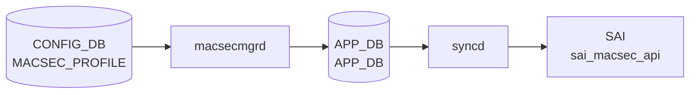

# MACSEC_PROFILE テーブル

## 概要

IEEE 802.1AE MACsec のセキュリティプロファイルを定義するテーブル[^1]。
`PORT.macsec` (port 側の leaf) から名前参照され、`macsecmgrd` / `wpa_supplicant` ベースの MKA (MACsec Key Agreement) 実装が CAK/CKN を読んで MACsec SA を確立する。

<!-- cdb-mermaid -->
### データフロー (自動生成)



!!! note "凡例"
    CONFIG_DB から SAI までの典型経路を `docs/reference/config-db-orch-map.md` から機械生成したミニ図。詳細・例外は本ページ本文と対応表を参照。
<!-- /cdb-mermaid -->

## key 構造

```
MACSEC_PROFILE|<name>
```

`<name>`: 1–128 文字。

## フィールド

| フィールド | 型 | 既定 | 説明 |
|-----------|----|------|------|
| `priority` | uint8 | `255` | MKA アクター優先度。**小さいほど key server になりやすい** |
| `cipher_suite` | enum `GCM-AES-128` / `GCM-AES-256` / `GCM-AES-XPN-128` / `GCM-AES-XPN-256` | `GCM-AES-128` | データ暗号化アルゴリズム |
| `primary_cak` | hex 66 文字 (128-bit + KCK) または 130 文字 (256-bit) | — (mandatory) | プライマリ CAK |
| `primary_ckn` | hex 32 / 64 文字 | — (mandatory) | プライマリ CKN |
| `fallback_cak` | hex 66 / 130 文字 | — | プライマリ失敗時のフォールバック CAK |
| `fallback_ckn` | hex 32 / 64 文字 | — | フォールバック CKN |
| `policy` | `integrity_only` / `security` | `security` | 認証のみか暗号化込みか |
| `enable_replay_protect` | boolean | `false` | リプレイ保護の有効化 |
| `replay_window` | uint32 | — | `enable_replay_protect = true` 時のみ意味を持つ |
| `send_sci` | boolean | `true` | 送信フレームに SCI を含める |
| `rekey_period` | uint32 | `0` | 能動的 SAK 再生成周期 [秒]。0 で再生成しない |

## 制約 (YANG `must`)

- `fallback_cak` を設定する場合は `primary_cak` と同じ長さ
- `fallback_ckn != primary_ckn`

## 購読者

- `macsecmgrd` (`sonic-swss` の MacSecMgr)、`macsecorch`
- 配下で `wpa_supplicant` が MKA セッションを実行

## 関連 CONFIG_DB / YANG / CLI

- 関連 CONFIG_DB: `PORT` (`macsec` フィールドでプロファイル名参照)
- 関連 YANG: `sonic-macsec`

<!-- ref-triangle:start -->

## 関連リファレンス

- YANG: [`sonic-macsec`](../yang/sonic-macsec.md)

<!-- ref-triangle:end -->

## 引用元

[^1]: YANG 定義: `sonic-macsec.yang`. <https://github.com/sonic-net/sonic-buildimage/blob/9ea932ec2e18f35e58268ec2e4456b1d4afd65cd/src/sonic-yang-models/yang-models/sonic-macsec.yang>

## 関連ページ
- [CONFIG_DB: PORT](port.md)

<!-- ops-hint -->
## 運用ヒント

### 典型値

- key 形式: `MACSEC_PROFILE|<profile-name>`。
- `cipher_suite`: `GCM-AES-XPN-256`、`priority`: 64、`policy`: `security`、`rekey_period`: `0`（手動）。

### よくある誤設定

- 鍵 (`primary_cak`/`fallback_cak`) を 16/32B 以外で入れると MKA セッションが上がらない。

### 確認コマンド

```bash
sonic-db-cli CONFIG_DB keys 'MACSEC_PROFILE|*'
show macsec
```
<!-- /ops-hint -->
