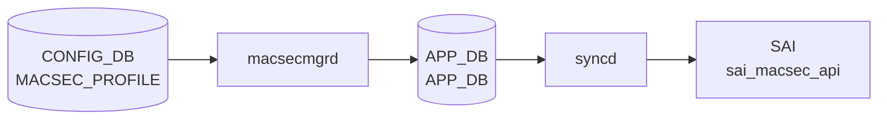

# MACSEC_PROFILE テーブル

## 概要

IEEE 802.1AE MACsec のセキュリティプロファイルを定義するテーブル[^1]。
`PORT.macsec` (port 側の leaf) から名前参照され、`macsecmgrd` / `wpa_supplicant` ベースの MKA (MACsec Key Agreement) 実装が CAK/CKN を読んで MACsec SA を確立する。

<!-- cdb-mermaid -->
### データフロー (自動生成)



!!! note "凡例"
    CONFIG_DB から SAI までの典型経路を `docs/reference/config-db-orch-map.md` から機械生成したミニ図。詳細・例外は本ページ本文と対応表を参照。
<!-- /cdb-mermaid -->

<!-- pubsub -->
## 通信メカニズム (Phase G)

### MACsecMgr — CONFIG_DB Consumer 登録

`MACsecMgr::MACsecMgr(cfgDb, stateDb, tables)` が `Orch(cfgDb, tables)` で次のテーブルを Consumer 登録する。

| テーブル | DB | 目的 |
|---|---|---|
| `CFG_MACSEC_PROFILE_TABLE_NAME` ("MACSEC_PROFILE") | CONFIG_DB | MKA プロファイル設定 (CAK/CKN/cipher_suite/policy 等) |
| `CFG_PORT_TABLE_NAME` ("PORT") | CONFIG_DB | ポートの `macsec` フィールドでプロファイル名参照 |

`doTask()` の TaskMap:

| テーブル | op | メソッド |
|---|---|---|
| `MACSEC_PROFILE` | SET | `loadProfile()` — プロファイルをキャッシュ |
| `MACSEC_PROFILE` | DEL | `removeProfile()` — プロファイルを削除 |
| `PORT` | SET | `enableMACsec()` — wpa_supplicant 起動・設定投入 |
| `PORT` | DEL | `disableMACsec()` — wpa_supplicant 停止 |

### wpa_supplicant 経路

`enableMACsec()` が per-port の `wpa_supplicant` を `fork/exec` し、`wpa_cli` コマンドで MKA パラメータ (CAK/CKN/cipher_suite/rekey_period 等) を投入する。`wpa_supplicant` が MKA ネゴシエーションを行い MACsec SA を確立する。

```
/sbin/wpa_supplicant -s /var/run/<port>  (per-port ソケット)
  └─ wpa_cli set_network <id> key_mgmt NONE
  └─ wpa_cli set_network <id> ca_cert / psk (CAK/CKN)
  └─ wpa_cli set_network <id> mka_rekey_period <N>
  └─ wpa_cli set_network <id> macsec_policy / macsec_replay_protect
```

### APP_DB Publish → MACsecOrch → SAI

`wpa_supplicant` の MKA 完了後、APP_DB の MACsec テーブルに書き込まれ `MACsecOrch` が SAI `sai_macsec_api` を呼び出す。

| SAI API | 操作 |
|---|---|
| `create_macsec()` / `remove_macsec()` | ingress/egress MACsec オブジェクト |
| `create_macsec_port()` / `remove_macsec_port()` | ポート MACsec |
| `create_macsec_flow()` / `remove_macsec_flow()` | フロー |
| `create_macsec_sc()` / `remove_macsec_sc()` | Secure Channel |
| `create_macsec_sa()` / `remove_macsec_sa()` | Secure Association |

### 通信フロー

```
CONFIG_DB MACSEC_PROFILE|<name>  (SET)
  └─ macsecmgrd  MACsecMgr::loadProfile()

CONFIG_DB PORT|<port>.macsec = <profile>  (SET)
  └─ macsecmgrd  MACsecMgr::enableMACsec()
       ├─ fork/exec /sbin/wpa_supplicant  (MKA ネゴシエーション)
       │    └─ wpa_cli で CAK/CKN/cipher_suite 投入
       └─ APP_DB APP_MACSEC_PORT_TABLE / *SC_TABLE / *SA_TABLE
            └─ [orchagent] MACsecOrch::doTask()
                 └─ sai_macsec_api->create_macsec_sa() 等

ASIC_DB NOTIFICATIONS  (POST 完了通知)
  └─ MACsecOrch::doTask(NotificationConsumer &)
       └─ handleNotification() → 初期化継続
```

<!-- /pubsub -->

## key 構造

```text
MACSEC_PROFILE|<name>
```

`<name>`: 1–128 文字。

## フィールド

| フィールド | 型 | 既定 | 説明 |
|-----------|----|------|------|
| `priority` | uint8 | `255` | MKA アクター優先度。**小さいほど key server になりやすい** |
| `cipher_suite` | enum `GCM-AES-128` / `GCM-AES-256` / `GCM-AES-XPN-128` / `GCM-AES-XPN-256` | `GCM-AES-128` | データ暗号化アルゴリズム |
| `primary_cak` | hex 66 文字 (128-bit + KCK) または 130 文字 (256-bit) | — (mandatory) | プライマリ CAK |
| `primary_ckn` | hex 32 / 64 文字 | — (mandatory) | プライマリ CKN |
| `fallback_cak` | hex 66 / 130 文字 | — | プライマリ失敗時のフォールバック CAK |
| `fallback_ckn` | hex 32 / 64 文字 | — | フォールバック CKN |
| `policy` | `integrity_only` / `security` | `security` | 認証のみか暗号化込みか |
| `enable_replay_protect` | boolean | `false` | リプレイ保護の有効化 |
| `replay_window` | uint32 | — | `enable_replay_protect = true` 時のみ意味を持つ |
| `send_sci` | boolean | `true` | 送信フレームに SCI を含める |
| `rekey_period` | uint32 | `0` | 能動的 SAK 再生成周期 [秒]。0 で再生成しない |

<!-- defaults -->
## コード由来デフォルト値

> **出典**: `sonic-swss/cfgmgr/macsecmgr.cpp` (GetValue フォールバック)、`docker-macsec/cli/config/plugins/macsec.py` (`add_profile` コマンド)、`sonic-macsec.yang` (`default` ステートメント) — 三者完全一致。

| フィールド | デフォルト値 | 根拠 |
|-----------|------------|------|
| `priority` | `255` | YANG `default 255` / C++ fallback `priority = 255` / CLI `default=255` |
| `cipher_suite` | `GCM-AES-128` | YANG `default "GCM-AES-128"` / CLI `default="GCM-AES-128"` |
| `policy` | `security` | YANG `default "security"` / C++ fallback `policy = Policy::SECURITY` / CLI `default="security"` |
| `enable_replay_protect` | `false` | YANG `default "false"` / C++ fallback `enable_replay_protect = false` / CLI `default=False` |
| `replay_window` | `0` (暗黙) | C++ fallback `replay_window = 0` / CLI `default=0`。YANG `default` なし (`when` 条件で `enable_replay_protect = true` 時のみ有効) |
| `send_sci` | `true` | YANG `default "true"` / C++ fallback `send_sci = true` / CLI `default=True` |
| `rekey_period` | `0` | YANG `default 0` / C++ fallback `rekey_period = 0` / CLI `default=0` |
| `primary_cak` | — (必須) | YANG `mandatory true` / CLI `required=True` |
| `primary_ckn` | — (必須) | YANG `mandatory true` / CLI `required=True` |
| `fallback_cak` | — (省略可) | YANG optional leaf、設定省略時はフォールバック MKA 無効 |
| `fallback_ckn` | — (省略可) | YANG optional leaf、`fallback_cak` 設定時に必要 |

<!-- /defaults -->

## 制約 (YANG `must`)

- `fallback_cak` を設定する場合は `primary_cak` と同じ長さ
- `fallback_ckn != primary_ckn`

## 購読者

- `macsecmgrd` (`sonic-swss` の MacSecMgr)、`macsecorch`
- 配下で `wpa_supplicant` が MKA セッションを実行

## 関連 CONFIG_DB / YANG / CLI

- 関連 [CONFIG_DB](../../reference/glossary.md#term-config_db): `PORT` (`macsec` フィールドでプロファイル名参照)
- 関連 [YANG](../../reference/glossary.md#term-yang): `sonic-macsec`

<!-- ref-triangle:start -->

## 関連リファレンス

- [YANG](../../reference/glossary.md#term-yang): [`sonic-macsec`](../yang/sonic-macsec.md)

<!-- ref-triangle:end -->

## 引用元

[^1]: [YANG](../../reference/glossary.md#term-yang) 定義: `sonic-macsec.yang`. <https://github.com/sonic-net/sonic-buildimage/blob/9ea932ec2e18f35e58268ec2e4456b1d4afd65cd/src/sonic-yang-models/yang-models/sonic-macsec.yang>

## 関連ページ
- [CONFIG_DB: PORT](port.md)

<!-- ops-hint -->
## 運用ヒント

### 典型値

- key 形式: `MACSEC_PROFILE|<profile-name>`。
- `cipher_suite`: `GCM-AES-XPN-256`、`priority`: 64、`policy`: `security`、`rekey_period`: `0`（手動）。

### よくある誤設定

- 鍵 (`primary_cak`/`fallback_cak`) を 16/32B 以外で入れると MKA セッションが上がらない。

### 確認コマンド

```bash
sonic-db-cli CONFIG_DB keys 'MACSEC_PROFILE|*'
show macsec
```
<!-- /ops-hint -->

<!-- value-behavior -->
## 値依存挙動マトリクス

### `policy`

| 値 | 挙動 |
|----|------|
| `security`（デフォルト） | MKA SA 確立 + データ暗号化 |
| `integrity_only` | MKA SA 確立のみ。実データは平文（認証のみ） |
| その他 | `throw std::invalid_argument("Invalid policy : ...")` → `task_invalid_entry`（破棄） |

### `cipher_suite`（CAK 長と連動）

| 値 | CAK 長 | 挙動 |
|----|--------|------|
| `GCM-AES-128`（デフォルト） | 66 hex 文字 | 128-bit AES 暗号化 |
| `GCM-AES-256` | 130 hex 文字 | 256-bit AES 暗号化 |
| `GCM-AES-XPN-128` | 66 hex 文字 | Extended Packet Numbering 付き 128-bit AES |
| `GCM-AES-XPN-256` | 130 hex 文字 | Extended Packet Numbering 付き 256-bit AES |
| CAK 長不一致 | — | `throw std::invalid_argument("Invalid length for cipher_string : ...")` → `task_invalid_entry` |
| その他 | — | `throw std::invalid_argument("Invalid cipher_suite : ...")` → `task_invalid_entry` |

### `rekey_period`

| 値 | 挙動 |
|----|------|
| `0`（デフォルト） | 能動的 SAK 再生成なし（MKA 自然な鍵更新のみ） |
| 正値 | 指定秒数ごとに SAK を再生成（`mka_rekey_period` として `wpa_supplicant` に設定） |

### `enable_replay_protect`

| 値 | 挙動 |
|----|------|
| `false`（デフォルト） | リプレイ保護なし（`macsec_replay_protect = 0`） |
| `true` | リプレイ保護有効。`replay_window` の値も `wpa_supplicant` に渡す（`macsec_replay_window = N`） |

### `send_sci`

| 値 | 挙動 |
|----|------|
| `true`（デフォルト） | 送信フレームに SCI を含める |
| `false` | SCI を含めない（特定機器との相互接続で必要な場合がある） |

<!-- /value-behavior -->

<!-- ordering -->
## 順序依存・起動順

<!-- evidence: sonic-swss/cfgmgr/macsecmgr.cpp, sonic-swss/orchagent/macsecorch.cpp -->

### PORT 先行条件 (macsecmgr)

`PORT.macsec` フィールドが設定されると `MACsecMgr::enableMACsec()` が呼ばれるが、起動にはふたつの前提条件をすべて満たす必要がある。

1. **MACSEC_PROFILE が先に存在すること** — `m_profiles.find(profile_name)` が見つからない場合は `task_need_retry` を返し、プロファイルが登録されるまで再試行し続ける。
2. **PORT が STATE_DB で ready 状態であること** — `isPortStateOk(port_name)` が `STATE_PORT_TABLE_NAME` を参照し、`state == "ok"` かつ `netdev_oper_status == "up"` でなければ同様に `task_need_retry`。

```
CONFIG_DB に MACSEC_PROFILE|<name> が存在
  ↓ (先行必須)
STATE_DB PORT|<port> state=ok, netdev_oper_status=up
  ↓ (先行必須)
enableMACsec() → wpa_supplicant 起動 → MKA セッション確立
```

ソース: `cfgmgr/macsecmgr.cpp` L487–504

### wpa_supplicant 起動順 (macsecmgr)

`startWPASupplicant()` は `fork()` + `execl()` で `/sbin/wpa_supplicant -s -D macsec_sonic -g <sock>` を起動し、その後 **ソケット (`/var/run/wpa_supplicant/<port>`) が応答を返すまで最大 `RETRY_TIME` 回ポーリング**（`wpa_cli_exec(..., "status")`）してから次処理（`configureMACsec`）に進む。ソケット応答前に `configureMACsec` を呼ぶと接続失敗になるため、ここで暗黙的なブロッキング待機が発生する。

```
fork() + execl(wpa_supplicant)
  ↓ (ポーリング待機: RETRY_TIME 回)
wpa_supplicant ソケット応答
  ↓
configureMACsec() — wpa_cli 経由でインターフェース追加・MKA 設定
```

ソース: `cfgmgr/macsecmgr.cpp` L635–678

### SAI macsec_sa 作成順 (macsecorch)

`MACsecOrch` では SAI オブジェクトを以下の厳密な順序で作成する。前段オブジェクトが未作成の場合は `task_need_retry` を返し待機する。

```
1. MACsec Switch Object (initMACsecObject)  ← スイッチ単位で 1 回のみ
     ↓
2. MACsec Port Object (createMACsecPort)    ← PORT ごと
     ↓
3. MACsec SC (Security Channel) Object (createMACsecSC)
     ↓
4. MACsec SA (Security Association) Object (createMACsecSA)
     ↓ (最初の SA 作成時のみ)
5. ACL エントリアクションを "packet action" から "MACsec flow" に切り替え
```

- SC が存在しない状態で `taskUpdateEgressSA` / `taskUpdateIngressSA` を呼ぶと `task_need_retry` → SC 作成まで待機。
- SA 削除時に当該 SC の SA が 0 件になると、ACL エントリアクションを "MACsec flow" から "packet action" に戻す（逆順クリーンアップ）。
- Egress SA は `encoding_an` フィールドが一致する AN のみ作成し、不一致は `task_need_retry`。
- Ingress SA は `active = true` で作成、`active = false` で削除するトリガ型制御。

ソース: `orchagent/macsecorch.cpp` L960–996 (Port), L1887–1909 (SC), L2223–2382 (SA)

<!-- /ordering -->

<!-- cdb-exceptions -->
## 例外条件・特殊挙動

<!-- evidence: sonic-swss/cfgmgr/macsecmgr.cpp -->

| 条件 | 挙動 |
|------|------|
| `policy` に不正値 | `throw std::invalid_argument("Invalid policy : ...")` → `SWSS_LOG_WARN` → `task_invalid_entry`（破棄・再試行なし） |
| `cipher_suite` に不正値または CAK 長不正 | `throw std::invalid_argument("Invalid length for cipher_string : ...")` → task_invalid_entry |
| `fallback_cak` 設定時に `fallback_ckn` なし | `GetValue(ta, fallback_ckn)` が false → フォールバックキー設定スキップ。MKA フォールバック機能が動作しない |
| `wpa_supplicant` 起動失敗 | `SWSS_LOG_WARN("Cannot start the wpa_supplicant of the port '%s' : %s")` → MACsec 無効のままポート継続動作 |
| フィールド値の型変換失敗 | `SWSS_LOG_ERROR("Cannot convert value(%s) in field(%s)")` → デフォルト / 前回値を使用 |
| MACsec 有効化で例外発生 | `SWSS_LOG_WARN("Enable MACsec fail : %s")` → ポートは非暗号化のまま継続 |
| MACsec 無効化失敗 | `SWSS_LOG_WARN("Disable MACsec fail : %s")` → wpa_supplicant プロセスが残留する可能性 |

<!-- /cdb-exceptions -->

<!-- failure -->
## 失敗挙動 (Phase D)

### 失敗パス一覧

<!-- evidence: sonic-swss/cfgmgr/macsecmgr.cpp, sonic-swss/orchagent/macsecorch.cpp -->

| # | トリガー | 発生箇所 | 結果 | retry |
|---|---------|---------|------|-------|
| 1 | `cipher_suite` に不正値 | `lexical_convert()` → `throw std::invalid_argument("Invalid cipher_suite : ...")` | `SWSS_LOG_WARN` → `task_failed` | なし |
| 2 | CAK 長が `cipher_suite` と不一致 | `decodeKey()` → `throw std::invalid_argument("Invalid length for cipher_string : ...")` | `SWSS_LOG_WARN` → `task_failed` | なし |
| 3 | `policy` に不正値 | `lexical_convert()` → `throw std::invalid_argument("Invalid policy : ...")` | `SWSS_LOG_WARN` → `task_failed` | なし |
| 4 | `wpa_supplicant` fork 失敗 (`fork()` < 0) | `startWPASupplicant()` | `SWSS_LOG_WARN("Cannot start the wpa_supplicant of the port '%s' : %s")` + `errno` → `task_failed` | なし |
| 5 | `wpa_supplicant` 起動後 socket 接続タイムアウト | `startWPASupplicant()` retry ループ | `stopWPASupplicant()` + `SWSS_LOG_WARN("Cannot connect to wpa_supplicant.")` → `task_failed` | なし |
| 6 | MKA プロファイルロード失敗 | `loadMKAProfile()` | `SWSS_LOG_WARN("The MACsec profile '%s' on the port '%s' loading fail")` → `task_failed` | なし |
| 7 | `enableMACsec()` 内 `runtime_error` | `catch(runtime_error)` | `SWSS_LOG_WARN("Enable MACsec fail : %s")` → ポート非暗号化のまま継続 | なし |
| 8 | `disableMACsec()` で wpa_supplicant 停止失敗 | `stopMKASession()` / `stopWPASupplicant()` | `SWSS_LOG_WARN("Cannot stop MKA session ...")` / `SWSS_LOG_WARN("Cannot stop WPA_SUPPLICANT ...")` → `task_failed`、プロセス残留の可能性 | なし |
| 9 | SAI `create/set macsec` 恒久エラー | `parseHandleSaiStatusFailure()` | `task_failed` | なし |
| 10 | SAI MACsec POST 失敗通知 | `doPostCompletionTask()` | `setMacsecPostState(m_state_db, "fail")` + `SWSS_LOG_ERROR("MACSec POST failed")` | なし |
| 11 | プロファイル DEL 時にポートが使用中 | `removeProfile()` | `task_need_retry`（全ポート MACsec 無効化まで待機） | 無制限 |

### task_failed 後の挙動

`macsecmgr` が `task_failed` を返すと Consumer はエントリを破棄し、ポートは MACsec 無効のまま継続動作する。`macsecorch` も同様。SAI 一時エラー（`SAI_STATUS_NOT_READY` 等）は `task_need_retry` で無制限再試行される。

### wpa_supplicant 起動失敗の詳細

`fork()` 後に子プロセスが `execv("/sbin/wpa_supplicant", ...)` を実行。Unix socket 接続を一定回数試みて失敗した場合、`stopWPASupplicant()` を呼び出して `wpa_supplicant_pid = 0` にクリアし `task_failed` を返す。ポートの MACsec は有効化されない。<!-- evidence: macsecmgr.cpp L544-558, L676 -->

### SAI POST 失敗の詳細

`macsecorch` 初期化時に `SAI_SWITCH_ATTR_MACSEC_POST_STATUS` を照会。`SAI_SWITCH_MACSEC_POST_STATUS_FAIL` が返ると STATE_DB に `status: fail` を書き込む。その後の通知（`switch_macsec_post_status` / `macsec_post_status`）でも失敗を検出した場合は同様に記録される。<!-- evidence: macsecorch.cpp L710-711, L791-792, L856-857 -->

### STATE_DB / syslog への記録

- SAI POST 失敗のみ STATE_DB に記録される（`MACSEC_POST|switch` エントリ）
- その他の失敗は `syslog`（`SWSS_LOG_WARN` / `SWSS_LOG_ERROR`）への出力のみ
- CONFIG_DB のエントリは失敗後も残る

```bash
# syslog 確認
journalctl -u macsecmgrd | grep -iE "fail|warn|error"
# STATE_DB POST ステータス確認
sonic-db-cli STATE_DB hgetall 'MACSEC_POST|switch'
```

> 中間調査ファイル: `meta/_intermediate/cdb-flow/macsec-profile-failure.md`
<!-- /failure -->

<!-- runtime-trace -->
## 実コンテナ動作トレース

### 段階 1 — Consumer 登録

`macsecmgrd` → `MACsecOrch` (APPL_DB 経由) が CONFIG_DB の `MACSEC_PROFILE` テーブルを購読する。

`MACSEC_PROFILE` の key はプロファイル名。`primary_cak` / `fallback_cak` / `cipher_suite` 等のキー情報を保持。

### 段階 2 — CFG→APPL 翻訳

`APP_MACSEC_TABLE` / `APP_MACSEC_PORT_TABLE` 等に書き込み

### 段階 3 — APPL→SAI

`sai_macsec_api` — MACsec セキュリティアソシエーション (SC/SA) を作成/更新

### 段階 4 — タイミングと副作用

**適用タイミング**: CONFIG_DB 変化を `macsecmgrd` が検知後 APPL_DB に書き込み。`MACsecOrch` が SAI MACsec オブジェクトを作成/更新。キーロールオーバーは非同期。

**副作用**: MACsec プロファイル変更は該当ポートの MACsec セキュリティアソシエーションを再生成。切り替え中に brief traffic interrupt が発生する可能性がある。
<!-- /runtime-trace -->

<!-- entry-points -->
## 書き込み入り口 (Direction A)

対象テーブル: `MACSEC_PROFILE`

### CLI
- `config macsec profile add/del <name> --priority <n> --cipher_suite <suite> --primary_cak <key> --primary_ckn <ckn>`
  - ソース: `sonic-utilities/config/main.py (macsec グループ)`

### minigraph / sonic-cfggen
- なし

### REST / gNMI (sonic-mgmt-common)
- なし (対応 OpenConfig/SONiC YANG transformer なし)

### db_migrator
- なし

### ビルド時デフォルト (init_cfg / j2 テンプレート)
- なし

### ハードコードデフォルト
- なし

### ランタイム注入 (デーモン自動書き込み)
- なし
<!-- /entry-points -->

<!-- side-effects -->
## 副次 DB 書込 (Direction B — orch / mgr が書く先)

> ソース: `sonic-swss/orchagent/macsecorch.cpp`, `sonic-swss/cfgmgr/macsecmgr.cpp`

### STATE_DB

`MACSEC_PROFILE` を読んだ `macsecmgrd` → `MACsecOrch` が以下のテーブルへ書き込む。

| テーブル | キー形式 | 書込フィールド | タイミング |
|----------|----------|----------------|------------|
| `STATE_MACSEC_PORT_TABLE` (`MACSEC_PORT_TABLE`) | `<port_name>` | `max_sa_per_sc`, `state=ok` | `MACsecOrch::createMACsecPort()` 成功時 |
| `STATE_MACSEC_EGRESS_SC_TABLE` | `<port_name>\|<SCI>` | `state=ok` | `MACsecOrch::createMACsecSC()` で egress SC 確立時 |
| `STATE_MACSEC_INGRESS_SC_TABLE` | `<port_name>\|<SCI>` | `state=ok` | `MACsecOrch::createMACsecSC()` で ingress SC 確立時 |
| `STATE_MACSEC_EGRESS_SA_TABLE` | `<port_name>\|<SCI>\|<AN>` | `state=ok` | `MACsecOrch::createMACsecSA()` で egress SA 確立時 |
| `STATE_MACSEC_INGRESS_SA_TABLE` | `<port_name>\|<SCI>\|<AN>` | `state=ok` | `MACsecOrch::createMACsecSA()` で ingress SA 確立時 |

削除は `del()` で対応 — ポート/SC/SA 削除時に各テーブルのエントリを消去する。

### ASIC_DB（SAI 経由）

`macsecorch.cpp` が `sai_macsec_api` を呼び出し、syncd 経由で ASIC_DB に反映される。

| SAI API 呼び出し | 主な属性 | タイミング |
|-----------------|----------|------------|
| `sai_macsec_api->create_macsec()` | `SAI_MACSEC_ATTR_DIRECTION`, `SAI_MACSEC_ATTR_PHYSICAL_BYPASS_ENABLE` | MACsec グローバルオブジェクト初回作成 |
| `sai_macsec_api->create_macsec_port()` | ポート OID, 方向 | MACsecOrch がポートを有効化するとき |
| `sai_macsec_api->create_macsec_sc()` | SC OID, SCI, 方向, 暗号スイート | SC 確立時 |
| `sai_macsec_api->create_macsec_sa()` | `SAI_MACSEC_SA_ATTR_AN`, `SAI_MACSEC_SA_ATTR_SAK`, `SAI_MACSEC_SA_ATTR_SALT`, `SAI_MACSEC_SA_ATTR_AUTH_KEY`, `SAI_MACSEC_SA_ATTR_CONFIGURED_EGRESS_XPN` / `SAI_MACSEC_SA_ATTR_MINIMUM_INGRESS_XPN` | MKA が SA を合意したとき (APP_DB 経由) |
| `sai_macsec_api->remove_macsec_sa()` | SA OID | SA 削除/ロールオーバー時 |
| `sai_macsec_api->set_macsec_sa_attribute()` | `SAI_MACSEC_SA_ATTR_CONFIGURED_EGRESS_XPN` / `SAI_MACSEC_SA_ATTR_MINIMUM_INGRESS_XPN` (XPN 更新) | XPN 再生成が要求されたとき |

### wpa_supplicant 設定書込

`macsecmgrd` が `wpa_cli set_network` コマンドで wpa_supplicant プロセスに MKA パラメータを渡す。書込先はプロセス内ランタイム状態（ファイルではなくソケット経由）。

| wpa_supplicant フィールド | 対応 CONFIG_DB フィールド | 備考 |
|--------------------------|--------------------------|------|
| `macsec_policy` | — | 常に `1` (MACsec 有効) |
| `macsec_integ_only` | `policy` | `integrity_only` → 1, `security` → 0 |
| `mka_cak` | `primary_cak` | CAK を暗号スイートに応じてデコードして渡す |
| `mka_ckn` | `primary_ckn` | そのまま渡す |
| `mka_priority` | `priority` | MKA アクター優先度 |
| `mka_rekey_period` | `rekey_period` | `rekey_period > 0` の場合のみ設定 |
| `macsec_ciphersuite` | `cipher_suite` | GCM-AES-128 / 256 / XPN-128 / XPN-256 |
| `macsec_include_sci` | `send_sci` | `true` → 1, `false` → 0 |
| `macsec_replay_protect` | `enable_replay_protect` | `true` → 1, `false` → 0 |
| `macsec_replay_window` | `replay_window` | `enable_replay_protect=true` の場合のみ設定 |

設定後 `enable_network` を呼び出して MKA セッションを開始する。失敗時は `SWSS_LOG_WARN("Enable MACsec fail : %s")` を記録しポートは非暗号化状態のまま継続する。
<!-- /side-effects -->

<!-- constants -->
## ハードコード定数 (Phase E)

### macsecmgr.cpp 固定値

| 定数 | 値 | 用途 | evidence |
|-----|-----|------|---------|
| `AES_LEN_128_BYTE` | `66` | GCM-AES-128 / GCM-AES-XPN-128 の CAK hex 文字数チェック値 | `cfgmgr/macsecmgr.cpp:48` |
| `AES_LEN_256_BYTE` | `130` | GCM-AES-256 / GCM-AES-XPN-256 の CAK hex 文字数チェック値 | `cfgmgr/macsecmgr.cpp:49` |
| `rekey_period` デフォルト | `0` | フィールド未設定時のフォールバック値。0 = 能動的 SAK 再生成なし | `cfgmgr/macsecmgr.cpp:377-379` |
| `RETRY_TIME` | `30` (回) | wpa_supplicant 起動失敗時の最大リトライ回数 | `cfgmgr/macsecmgr.cpp:32` |
| `RETRY_INTERVAL` | `100` ms | リトライ間隔 | `cfgmgr/macsecmgr.cpp:35` |
| `WPA_SUPPLICANT_CMD` | `"/sbin/wpa_supplicant"` | wpa_supplicant バイナリパス (ハードコード) | `cfgmgr/macsecmgr.cpp:27` |
| `WPA_CONF` | `"/etc/wpa_supplicant.conf"` | wpa_supplicant 設定ファイルパス | `cfgmgr/macsecmgr.cpp:29` |
| `SOCK_DIR` | `"/var/run/"` | wpa_supplicant ソケットディレクトリ | `cfgmgr/macsecmgr.cpp:30` |

### cipher_suite 文字列 → SAI enum マッピング

| CONFIG_DB 文字列 | CAK hex 長 | 備考 |
|----------------|-----------|------|
| `GCM-AES-128`（デフォルト） | 66 文字 | `AES_LEN_128_BYTE` |
| `GCM-AES-256` | 130 文字 | `AES_LEN_256_BYTE` |
| `GCM-AES-XPN-128` | 66 文字 | XPN = Extended Packet Numbering |
| `GCM-AES-XPN-256` | 130 文字 | XPN = Extended Packet Numbering |
| その他 | — | `throw std::invalid_argument("Invalid cipher_suite : ...")` |

<!-- evidence: cfgmgr/macsecmgr.cpp:69-91, 113-135 -->

### macsecorch.cpp 固定値

| 定数 | 値 | 用途 | evidence |
|-----|-----|------|---------|
| `DEFAULT_CIPHER_SUITE` | `SAI_MACSEC_CIPHER_SUITE_GCM_AES_128` | 新規ポート初期化時のデフォルト cipher suite (`GCM-AES-128` と対応) | `orchagent/macsecorch.cpp:42` |
| `DEFAULT_ENABLE_ENCRYPT` | `true` | 新規ポート初期化時の暗号化有効フラグ | `orchagent/macsecorch.cpp:40` |
| `DEFAULT_SCI_IN_SECTAG` | `false` | 新規ポート初期化時の SCI in SecTAG フラグ | `orchagent/macsecorch.cpp:41` |
| `MACSEC_STAT_XPN_POLLING_INTERVAL_MS` | `1000` ms | XPN cipher 使用時の SA 統計ポーリング間隔 | `orchagent/macsecorch.cpp:27` |
| `MACSEC_STAT_POLLING_INTERVAL_MS` | `10000` ms | 通常 cipher 使用時の SA 統計ポーリング間隔 | `orchagent/macsecorch.cpp:28` |
| `EAPOL_ETHER_TYPE` | `0x888E` | EAPOL フレーム識別用 EtherType (ACL バイパス) | `orchagent/macsecorch.cpp:25` |
| `PAUSE_ETHER_TYPE` | `0x8808` | PAUSE フレーム識別用 EtherType (ACL バイパス) | `orchagent/macsecorch.cpp:26` |
| `AVAILABLE_ACL_PRIORITIES_LIMITATION` | `32` | MACsec ACL に使用可能な優先度数の上限 | `orchagent/macsecorch.cpp:24` |
| `PFC_MODE_DEFAULT` | `"bypass"` | PFC フレームの MACsec 処理デフォルトモード | `orchagent/macsecorch.cpp:32` |

### PFC mode 文字列定数

| 値 | 意味 |
|----|------|
| `"bypass"`（デフォルト） | PFC フレームを MACsec 暗号化対象から除外 |
| `"encrypt"` | PFC フレームも MACsec 暗号化 |
| `"strict_encrypt"` | MACsec 有効ポートでは PFC を必ず暗号化 |

<!-- evidence: orchagent/macsecorch.cpp:29-32 -->
<!-- /constants -->

<!-- platform -->
## プラットフォーム差異

### Gearbox PHY 搭載ポート vs. NPU ネイティブポート

MACsec の SAI オブジェクト操作対象は、ポートに Gearbox PHY が接続されているかどうかで切り替わる。

| 条件 | MACsec オブジェクト対象 | カウンタ管理 |
|------|------------------------|-------------|
| `gearbox_phy_t.macsec_supported == true` | PHY 側の line-side port (`port.m_line_side_id`) と PHY の switch ID を使用 | `m_gb_macsec_sa_stat_manager` / `m_gb_macsec_flow_stat_manager` / `m_gb_macsec_counters_map` |
| PHY なし、または `macsec_supported == false` | NPU 側の port (`port.m_port_id`) とグローバル switch ID (`gSwitchId`) を使用 | `m_macsec_sa_stat_manager` / `m_macsec_flow_stat_manager` / `m_macsec_counters_map` |

PHY が接続されていても `macsec_supported` が `false` の場合、`MACsecOrch` は NPU 側へフォールバックし、ログに `"backend=NPU (phy marked unsupported)"` を出力する。

**コード証跡** (`macsecorch.cpp:363, 409, 2539, 2547, 2555, 2563`):
```cpp
force_npu = !phy->macsec_supported;
if (!force_npu && port->m_line_side_id != SAI_NULL_OBJECT_ID)
    m_port_id = port->m_line_side_id;  // PHY 側を使用
else
    m_port_id = port->m_port_id;       // NPU 側へフォールバック
```

### SAI MACsec capability クエリ

初期化時に以下の SAI ケーパビリティを実行時にクエリし、ASIC ベンダーの実装状態に応じて動作を変える。

| SAI ケーパビリティ | 用途 | 非対応時の挙動 |
|-------------------|------|--------------|
| `SAI_ACL_TABLE_ATTR_FIELD_MACSEC_SCI` の `create_implemented` | ACL テーブルで SCI フィールドのマッチを使うかどうか | `saiAclFieldSciMatchSupported = false` にして SCI ACL マッチを無効化 |
| `SAI_MACSEC_ATTR_SCI_IN_INGRESS_MACSEC_ACL` | Ingress ACL で SCI をキーとするか、Flow ごとに複数 ACL エントリを使うかを判定 | get 失敗時は `task_failed` を返しポート有効化を中断 |
| `SAI_MACSEC_ATTR_MAX_SECURE_ASSOCIATIONS_PER_SC` | SC ごとの最大 SA 数 (2 or 4) | サポートなし時はデフォルト `4` を使用 |

**コード証跡** (`macsecorch.cpp:672–681, 1302–1345`):
```cpp
// ACL SCI フィールドサポート確認
sai_query_attribute_capability(..., SAI_ACL_TABLE_ATTR_FIELD_MACSEC_SCI, &capability);
if (capability.create_implemented == false)
    saiAclFieldSciMatchSupported = false;

// SA per SC 数のクエリ (非対応時デフォルト 4)
attr.id = SAI_MACSEC_ATTR_MAX_SECURE_ASSOCIATIONS_PER_SC;
status = sai_macsec_api->get_macsec_attribute(...);
if (status != SAI_STATUS_SUCCESS)
    m_max_sa_per_sc = 4;  // デフォルトにフォールバック
```

### POST (Power-On Self-Test) 対応差異

`SAI_MACSEC_ATTR_ENABLE_POST` / `SAI_SWITCH_ATTR_MACSEC_POST_STATUS` は ASIC ベンダー依存の POST 機能。

| POST 状態 | `STATE_DB.MACSEC_POST_STATUS` 値 | 動作 |
|-----------|----------------------------------|------|
| `switch-level-post-in-progress` | ASIC 全体レベルで POST が進行中。Switch 初期化時に有効化済み | `SAI_SWITCH_ATTR_MACSEC_POST_STATUS` をポーリングして pass/fail を記録 |
| `macsec-level-post-in-progress` | MACsec オブジェクト初期化時に POST を有効化する方式 | `SAI_MACSEC_ATTR_ENABLE_POST = true` を egress/ingress オブジェクト作成時に付与 |
| 上記以外 | POST 非対応 ASIC | POST 通知サブスクリプションを設定しない |

POST 未対応 ASIC (SAI が本属性を実装しない環境) では `m_enable_post = false` のままとなり、MACsec オブジェクト初期化時の `SAI_MACSEC_ATTR_ENABLE_POST` 設定がスキップされる。

**コード証跡** (`macsecorch.cpp:695–728, 1246–1251, 1278–1283`):
```cpp
if (m_enable_post) {
    attr.id = SAI_MACSEC_ATTR_ENABLE_POST;
    attr.value.booldata = true;
    attrs.push_back(attr);
}
```

### Physical Bypass モード

egress / ingress 両方の MACsec オブジェクト作成時に `SAI_MACSEC_ATTR_PHYSICAL_BYPASS_ENABLE = true` を設定する。これは ASIC が MACsec をバイパスする初期状態を確保するためであり、MKA ネゴシエーション完了後に SA が確立されてから暗号化が有効になる流れを保証する。

**コード証跡** (`macsecorch.cpp:1242–1244, 1274–1276`):
```cpp
attr.id = SAI_MACSEC_ATTR_PHYSICAL_BYPASS_ENABLE;
attr.value.booldata = true;
```

### 非対応 / スコープ外

- ベンダー固有 ASIC ドライバの内部実装差（SAI 抽象化で隠蔽）
- ベンダー版 SONiC（NVIDIA Cumulus / Edgecore ECNOS 等）はスコープ外
- master ブランチ以外のバックポート差異はスコープ外
<!-- /platform -->

<!-- glossary-links-injected: b5626ca1f0f9 -->
