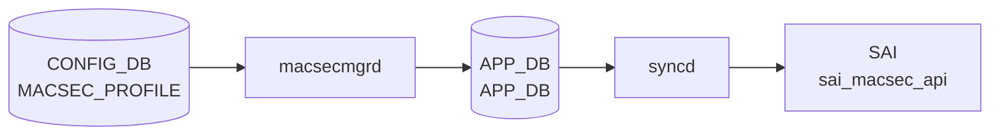

# MACSEC_PROFILE テーブル

## 概要

IEEE 802.1AE MACsec のセキュリティプロファイルを定義するテーブル[^1]。
`PORT.macsec` (port 側の leaf) から名前参照され、`macsecmgrd` / `wpa_supplicant` ベースの MKA (MACsec Key Agreement) 実装が CAK/CKN を読んで MACsec SA を確立する。

<!-- cdb-mermaid -->
### データフロー (自動生成)



!!! note "凡例"
    CONFIG_DB から SAI までの典型経路を `docs/reference/config-db-orch-map.md` から機械生成したミニ図。詳細・例外は本ページ本文と対応表を参照。
<!-- /cdb-mermaid -->

<!-- pubsub -->
## 通信メカニズム (Phase G)

### MACsecMgr — CONFIG_DB Consumer 登録

`MACsecMgr::MACsecMgr(cfgDb, stateDb, tables)` が `Orch(cfgDb, tables)` で次のテーブルを Consumer 登録する。

| テーブル | DB | 目的 |
|---|---|---|
| `CFG_MACSEC_PROFILE_TABLE_NAME` ("MACSEC_PROFILE") | CONFIG_DB | MKA プロファイル設定 (CAK/CKN/cipher_suite/policy 等) |
| `CFG_PORT_TABLE_NAME` ("PORT") | CONFIG_DB | ポートの `macsec` フィールドでプロファイル名参照 |

`doTask()` の TaskMap:

| テーブル | op | メソッド |
|---|---|---|
| `MACSEC_PROFILE` | SET | `loadProfile()` — プロファイルをキャッシュ |
| `MACSEC_PROFILE` | DEL | `removeProfile()` — プロファイルを削除 |
| `PORT` | SET | `enableMACsec()` — wpa_supplicant 起動・設定投入 |
| `PORT` | DEL | `disableMACsec()` — wpa_supplicant 停止 |

### wpa_supplicant 経路

`enableMACsec()` が per-port の `wpa_supplicant` を `fork/exec` し、`wpa_cli` コマンドで MKA パラメータ (CAK/CKN/cipher_suite/rekey_period 等) を投入する。`wpa_supplicant` が MKA ネゴシエーションを行い MACsec SA を確立する。

```
/sbin/wpa_supplicant -s /var/run/<port>  (per-port ソケット)
  └─ wpa_cli set_network <id> key_mgmt NONE
  └─ wpa_cli set_network <id> ca_cert / psk (CAK/CKN)
  └─ wpa_cli set_network <id> mka_rekey_period <N>
  └─ wpa_cli set_network <id> macsec_policy / macsec_replay_protect
```

### APP_DB Publish → MACsecOrch → SAI

`wpa_supplicant` の MKA 完了後、APP_DB の MACsec テーブルに書き込まれ `MACsecOrch` が SAI `sai_macsec_api` を呼び出す。

| SAI API | 操作 |
|---|---|
| `create_macsec()` / `remove_macsec()` | ingress/egress MACsec オブジェクト |
| `create_macsec_port()` / `remove_macsec_port()` | ポート MACsec |
| `create_macsec_flow()` / `remove_macsec_flow()` | フロー |
| `create_macsec_sc()` / `remove_macsec_sc()` | Secure Channel |
| `create_macsec_sa()` / `remove_macsec_sa()` | Secure Association |

### 通信フロー

```
CONFIG_DB MACSEC_PROFILE|<name>  (SET)
  └─ macsecmgrd  MACsecMgr::loadProfile()

CONFIG_DB PORT|<port>.macsec = <profile>  (SET)
  └─ macsecmgrd  MACsecMgr::enableMACsec()
       ├─ fork/exec /sbin/wpa_supplicant  (MKA ネゴシエーション)
       │    └─ wpa_cli で CAK/CKN/cipher_suite 投入
       └─ APP_DB APP_MACSEC_PORT_TABLE / *SC_TABLE / *SA_TABLE
            └─ [orchagent] MACsecOrch::doTask()
                 └─ sai_macsec_api->create_macsec_sa() 等

ASIC_DB NOTIFICATIONS  (POST 完了通知)
  └─ MACsecOrch::doTask(NotificationConsumer &)
       └─ handleNotification() → 初期化継続
```

<!-- /pubsub -->

## key 構造

```text
MACSEC_PROFILE|<name>
```

`<name>`: 1–128 文字。

## フィールド

| フィールド | 型 | 既定 | 説明 |
|-----------|----|------|------|
| `priority` | uint8 | `255` | MKA アクター優先度。**小さいほど key server になりやすい** |
| `cipher_suite` | enum `GCM-AES-128` / `GCM-AES-256` / `GCM-AES-XPN-128` / `GCM-AES-XPN-256` | `GCM-AES-128` | データ暗号化アルゴリズム |
| `primary_cak` | hex 66 文字 (128-bit + KCK) または 130 文字 (256-bit) | — (mandatory) | プライマリ CAK |
| `primary_ckn` | hex 32 / 64 文字 | — (mandatory) | プライマリ CKN |
| `fallback_cak` | hex 66 / 130 文字 | — | プライマリ失敗時のフォールバック CAK |
| `fallback_ckn` | hex 32 / 64 文字 | — | フォールバック CKN |
| `policy` | `integrity_only` / `security` | `security` | 認証のみか暗号化込みか |
| `enable_replay_protect` | boolean | `false` | リプレイ保護の有効化 |
| `replay_window` | uint32 | — | `enable_replay_protect = true` 時のみ意味を持つ |
| `send_sci` | boolean | `true` | 送信フレームに SCI を含める |
| `rekey_period` | uint32 | `0` | 能動的 SAK 再生成周期 [秒]。0 で再生成しない |

## 制約 (YANG `must`)

- `fallback_cak` を設定する場合は `primary_cak` と同じ長さ
- `fallback_ckn != primary_ckn`

## 購読者

- `macsecmgrd` (`sonic-swss` の MacSecMgr)、`macsecorch`
- 配下で `wpa_supplicant` が MKA セッションを実行

## 関連 CONFIG_DB / YANG / CLI

- 関連 [CONFIG_DB](../../reference/glossary.md#term-config_db): `PORT` (`macsec` フィールドでプロファイル名参照)
- 関連 [YANG](../../reference/glossary.md#term-yang): `sonic-macsec`

<!-- ref-triangle:start -->

## 関連リファレンス

- [YANG](../../reference/glossary.md#term-yang): [`sonic-macsec`](../yang/sonic-macsec.md)

<!-- ref-triangle:end -->

## 引用元

[^1]: [YANG](../../reference/glossary.md#term-yang) 定義: `sonic-macsec.yang`. <https://github.com/sonic-net/sonic-buildimage/blob/9ea932ec2e18f35e58268ec2e4456b1d4afd65cd/src/sonic-yang-models/yang-models/sonic-macsec.yang>

## 関連ページ
- [CONFIG_DB: PORT](port.md)

<!-- ops-hint -->
## 運用ヒント

### 典型値

- key 形式: `MACSEC_PROFILE|<profile-name>`。
- `cipher_suite`: `GCM-AES-XPN-256`、`priority`: 64、`policy`: `security`、`rekey_period`: `0`（手動）。

### よくある誤設定

- 鍵 (`primary_cak`/`fallback_cak`) を 16/32B 以外で入れると MKA セッションが上がらない。

### 確認コマンド

```bash
sonic-db-cli CONFIG_DB keys 'MACSEC_PROFILE|*'
show macsec
```
<!-- /ops-hint -->

<!-- value-behavior -->
## 値依存挙動マトリクス

### `policy`

| 値 | 挙動 |
|----|------|
| `security`（デフォルト） | MKA SA 確立 + データ暗号化 |
| `integrity_only` | MKA SA 確立のみ。実データは平文（認証のみ） |
| その他 | `throw std::invalid_argument("Invalid policy : ...")` → `task_invalid_entry`（破棄） |

### `cipher_suite`（CAK 長と連動）

| 値 | CAK 長 | 挙動 |
|----|--------|------|
| `GCM-AES-128`（デフォルト） | 66 hex 文字 | 128-bit AES 暗号化 |
| `GCM-AES-256` | 130 hex 文字 | 256-bit AES 暗号化 |
| `GCM-AES-XPN-128` | 66 hex 文字 | Extended Packet Numbering 付き 128-bit AES |
| `GCM-AES-XPN-256` | 130 hex 文字 | Extended Packet Numbering 付き 256-bit AES |
| CAK 長不一致 | — | `throw std::invalid_argument("Invalid length for cipher_string : ...")` → `task_invalid_entry` |
| その他 | — | `throw std::invalid_argument("Invalid cipher_suite : ...")` → `task_invalid_entry` |

### `rekey_period`

| 値 | 挙動 |
|----|------|
| `0`（デフォルト） | 能動的 SAK 再生成なし（MKA 自然な鍵更新のみ） |
| 正値 | 指定秒数ごとに SAK を再生成（`mka_rekey_period` として `wpa_supplicant` に設定） |

### `enable_replay_protect`

| 値 | 挙動 |
|----|------|
| `false`（デフォルト） | リプレイ保護なし（`macsec_replay_protect = 0`） |
| `true` | リプレイ保護有効。`replay_window` の値も `wpa_supplicant` に渡す（`macsec_replay_window = N`） |

### `send_sci`

| 値 | 挙動 |
|----|------|
| `true`（デフォルト） | 送信フレームに SCI を含める |
| `false` | SCI を含めない（特定機器との相互接続で必要な場合がある） |

<!-- /value-behavior -->

<!-- cdb-exceptions -->
## 例外条件・特殊挙動

<!-- evidence: sonic-swss/cfgmgr/macsecmgr.cpp -->

| 条件 | 挙動 |
|------|------|
| `policy` に不正値 | `throw std::invalid_argument("Invalid policy : ...")` → `SWSS_LOG_WARN` → `task_invalid_entry`（破棄・再試行なし） |
| `cipher_suite` に不正値または CAK 長不正 | `throw std::invalid_argument("Invalid length for cipher_string : ...")` → task_invalid_entry |
| `fallback_cak` 設定時に `fallback_ckn` なし | `GetValue(ta, fallback_ckn)` が false → フォールバックキー設定スキップ。MKA フォールバック機能が動作しない |
| `wpa_supplicant` 起動失敗 | `SWSS_LOG_WARN("Cannot start the wpa_supplicant of the port '%s' : %s")` → MACsec 無効のままポート継続動作 |
| フィールド値の型変換失敗 | `SWSS_LOG_ERROR("Cannot convert value(%s) in field(%s)")` → デフォルト / 前回値を使用 |
| MACsec 有効化で例外発生 | `SWSS_LOG_WARN("Enable MACsec fail : %s")` → ポートは非暗号化のまま継続 |
| MACsec 無効化失敗 | `SWSS_LOG_WARN("Disable MACsec fail : %s")` → wpa_supplicant プロセスが残留する可能性 |

<!-- /cdb-exceptions -->


<!-- runtime-trace -->
## 実コンテナ動作トレース

### 段階 1 — Consumer 登録

`macsecmgrd` → `MACsecOrch` (APPL_DB 経由) が CONFIG_DB の `MACSEC_PROFILE` テーブルを購読する。

`MACSEC_PROFILE` の key はプロファイル名。`primary_cak` / `fallback_cak` / `cipher_suite` 等のキー情報を保持。

### 段階 2 — CFG→APPL 翻訳

`APP_MACSEC_TABLE` / `APP_MACSEC_PORT_TABLE` 等に書き込み

### 段階 3 — APPL→SAI

`sai_macsec_api` — MACsec セキュリティアソシエーション (SC/SA) を作成/更新

### 段階 4 — タイミングと副作用

**適用タイミング**: CONFIG_DB 変化を `macsecmgrd` が検知後 APPL_DB に書き込み。`MACsecOrch` が SAI MACsec オブジェクトを作成/更新。キーロールオーバーは非同期。

**副作用**: MACsec プロファイル変更は該当ポートの MACsec セキュリティアソシエーションを再生成。切り替え中に brief traffic interrupt が発生する可能性がある。
<!-- /runtime-trace -->

<!-- entry-points -->
## 書き込み入り口 (Direction A)

対象テーブル: `MACSEC_PROFILE`

### CLI
- `config macsec profile add/del <name> --priority <n> --cipher_suite <suite> --primary_cak <key> --primary_ckn <ckn>`
  - ソース: `sonic-utilities/config/main.py (macsec グループ)`

### minigraph / sonic-cfggen
- なし

### REST / gNMI (sonic-mgmt-common)
- なし (対応 OpenConfig/SONiC YANG transformer なし)

### db_migrator
- なし

### ビルド時デフォルト (init_cfg / j2 テンプレート)
- なし

### ハードコードデフォルト
- なし

### ランタイム注入 (デーモン自動書き込み)
- なし
<!-- /entry-points -->

<!-- glossary-links-injected: b5626ca1f0f9 -->
