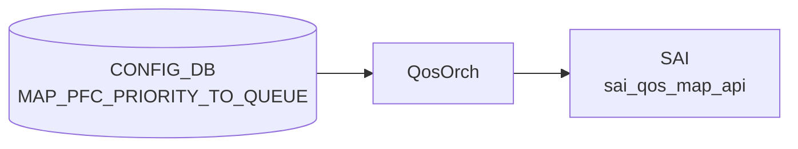

# MAP_PFC_PRIORITY_TO_QUEUE テーブル

## 概要

**[PFC](../../reference/glossary.md#term-pfc) priority (0..7) → 出力キュー (qindex 0..7) のマッピング** を定義する [CONFIG_DB](../../reference/glossary.md#term-config_db) テーブル[^1]。`PORT_QOS_MAP.pfc_to_queue_map` から参照され、`SAI_QOS_MAP_TYPE_PFC_PRIORITY_TO_QUEUE` として ASIC に反映される。

[PFC](../../reference/glossary.md#term-pfc) frame の Priority 値から、どの egress queue を一時停止対象とするかを決めるためのマップ。`PFC_PRIORITY_TO_PRIORITY_GROUP_MAP` (ingress 側 PG マップ) と対になる egress 側の表。

> テーブル名は [YANG](../../reference/glossary.md#term-yang) container 名そのまま `MAP_PFC_PRIORITY_TO_QUEUE` で、`PFC_PRIORITY_TO_QUEUE_MAP` ではない点に注意。[CONFIG_DB](../../reference/glossary.md#term-config_db) key にもこの名前が使われる。

<!-- cdb-mermaid -->
### データフロー (自動生成)



!!! note "凡例"
    CONFIG_DB から SAI までの典型経路を `docs/reference/config-db-orch-map.md` から機械生成したミニ図。詳細・例外は本ページ本文と対応表を参照。
<!-- /cdb-mermaid -->

## key 構造

```text
MAP_PFC_PRIORITY_TO_QUEUE|<name>
```

- `<name>`: マップ名 (`[a-zA-Z0-9]([-a-zA-Z0-9_]{0,31})`、長さ 1..32)

内側エントリ:

```text
MAP_PFC_PRIORITY_TO_QUEUE|<name>|<pfc_priority>
```

ただし [CONFIG_DB](../../reference/glossary.md#term-config_db) の慣習として、外側 hash の field-value に直接 `pfc_priority → qindex` の対を保存する実装もある（`{"name": "AZURE", "0": "0", "1": "1", ...}` のような形式）。実体は `swssconfig` / `sonic-cfggen` がいずれかに正規化する。

## フィールド

### 外側 list (`MAP_PFC_PRIORITY_TO_QUEUE_LIST`)

| フィールド | 型 | 説明 |
|-----------|----|------|
| `name` (key) | string `[a-zA-Z0-9]([-a-zA-Z0-9_]{0,31})` (length 1..32) | マップ名 |

### 内側 list (`MAP_PFC_PRIORITY_TO_QUEUE`)

| フィールド | 型 | 説明 |
|-----------|----|------|
| `pfc_priority` (key) | string pattern `[0-7]?` | [PFC](../../reference/glossary.md#term-pfc) priority 値 (0..7) |
| `qindex` | string pattern `[0-7]?` | 対応する egress queue index (0..7) |

`pattern "[0-7]?"` は空文字も許容するパターンで、実運用では必ず数値を入れる。

## 制約

- マップ名の長さは 1..32 文字、英数字スタートで `[-_]` 含む。
- pfc_priority / qindex は単一の 0..7 数字（範囲外は [YANG](../../reference/glossary.md#term-yang) validation で拒否）。

## 購読者

- `qosorch` (`docker-swss`): CONFIG_DB → [SAI](../../reference/glossary.md#term-sai) `SAI_QOS_MAP_TYPE_PFC_PRIORITY_TO_QUEUE` オブジェクト生成
- 反映先は `PORT_QOS_MAP.pfc_to_queue_map` 経由でポートにバインドされる

## 関連 CONFIG_DB / YANG / CLI

- 関連 CONFIG_DB: `PORT_QOS_MAP` (バインド)、`PFC_PRIORITY_TO_PRIORITY_GROUP_MAP` (ingress 側)、`TC_TO_QUEUE_MAP`, `TC_TO_PRIORITY_GROUP_MAP`, `DSCP_TO_TC_MAP`
- 関連 CLI: `config qos`、`config qos reload`
- 関連 [YANG](../../reference/glossary.md#term-yang): `sonic-pfc-priority-queue-map`

<!-- ref-triangle:start -->

## 関連リファレンス

- YANG: [`sonic-pfc-priority-queue-map`](../yang/sonic-pfc-priority-queue-map.md)
- CLI: [`config qos`](../cli/config-qos.md)

<!-- ref-triangle:end -->

## 引用元

[^1]: YANG 定義: `sonic-pfc-priority-queue-map.yang` (revision 2021-04-15). <https://github.com/sonic-net/sonic-buildimage/blob/9ea932ec2e18f35e58268ec2e4456b1d4afd65cd/src/sonic-yang-models/yang-models/sonic-pfc-priority-queue-map.yang>

## 関連ページ
- [CONFIG_DB: PFC_PRIORITY_TO_PRIORITY_GROUP_MAP](pfc-priority-to-priority-group-map.md)
- [CONFIG_DB: PORT_QOS_MAP](port-qos-map.md)

<!-- ops-hint -->
## 運用ヒント

### 典型値

- key 形式: `MAP_PFC_PRIORITY_TO_QUEUE|<name>` (例 `MAP_PFC_PRIORITY_TO_QUEUE|AZURE`)。
- 典型マップ: PFC priority 3 → queue 3、4 → 4 (ロスレスキュー)。

### よくある誤設定

- PFC priority と queue の対応が `TC_TO_QUEUE_MAP` などと整合しておらず、PFC pause が想定外の queue に作用する。
- 範囲外 (0..7 以外) の値を入れて YANG validation で reject される。

### 確認コマンド

```bash
sonic-db-cli CONFIG_DB hgetall 'MAP_PFC_PRIORITY_TO_QUEUE|AZURE'
sonic-db-cli CONFIG_DB hget 'PORT_QOS_MAP|Ethernet0' pfc_to_queue_map
show queue counters
```
<!-- /ops-hint -->

<!-- cdb-exceptions -->
## 例外条件・特殊挙動

<!-- evidence: sonic-swss/orchagent/qosorch.cpp PfcToQueueHandler::processWorkItem / sonic-buildimage/src/sonic-yang-models/yang-models/sonic-pfc-priority-queue-map.yang -->

- **pfc_priority / qindex が 0-7 の範囲外**: YANG `pattern "[0-7]?"` 制約により CONFIG_DB への書き込みが拒否される。
- **フィールド変換失敗 → task_invalid_entry**: `convertFieldValuesToAttributes()` が false を返すか `stoi()` 例外が発生した場合、エントリを無効として処理を中止する (`qosorch.cpp` L147/L179/L199)。
- **削除時に他オブジェクトから参照中 → task_need_retry**: `isObjectBeingReferenced()` が true の場合、`m_pendingRemove = true` を設定して `task_need_retry` を返す。参照が解除されるまで削除は保留される (`qosorch.cpp` L180-186)。
- **削除対象エントリが存在しない → task_invalid_entry**: [SAI](../../reference/glossary.md#term-sai) オブジェクト ID が NULL の場合 `"Object with name not found"` をログし中止する。
- **[SAI](../../reference/glossary.md#term-sai) create/modify 失敗 → task_failed**: `sai_qos_map_api->create_qos_map()` が `SAI_STATUS_SUCCESS` 以外を返した場合 (`qosorch.cpp` L977/L1032)。
- **マップ名の長さ・文字制約**: `[a-zA-Z0-9]{1}([-a-zA-Z0-9_]{0,31})` 計 1-32 文字を YANG で強制。違反は YANG バリデーションで拒否される。
- **デフォルト値なし**: YANG に `default` 定義がないため、エントリが未設定の場合はマップが存在しない状態となり、`PORT_QOS_MAP` からの参照が解決できなくなる。

<!-- value-behavior -->
## 値依存挙動マトリクス

<!-- evidence: sonic-swss/orchagent/qosorch.cpp PfcToQueueHandler / sonic-buildimage/src/sonic-yang-models/yang-models/sonic-pfc-priority-queue-map.yang -->

| フィールド | 値 | 挙動 |
|-----------|-----|------|
| `pfc_priority` | `0`..`7` | 対応 PFC priority の egress queue を pause 対象とするマッピングを SAI に設定 |
| `pfc_priority` | `""` (空) | YANG pattern で許容されるが `stoi()` 変換失敗 → `task_invalid_entry` |
| `qindex` | `0`..`7` | SAI `SAI_QOS_MAP_TYPE_PFC_PRIORITY_TO_QUEUE` として ASIC に反映 |
| `qindex` | `""` (空) | `stoi()` 変換失敗 → `task_invalid_entry` |
| `name` (マップ名) | 有効名 (1-32字) | orchagent が SAI qos_map object を作成し `PORT_QOS_MAP.pfc_to_queue_map` から参照可能に |
| `name` (マップ名) | pattern/length 違反 | YANG バリデーション拒否 |

enum なし — `pfc_priority`/`qindex` は数値文字列のみ。
<!-- /value-behavior -->


<!-- runtime-trace -->
## 実コンテナ動作トレース

### 段階 1 — Consumer 登録

`QosOrch` (orchagent 直接 CFG 購読) が CONFIG_DB の `MAP_PFC_PRIORITY_TO_QUEUE` テーブルを購読する。

`MAP_PFC_PRIORITY_TO_QUEUE` の key はマップ名。PFC priority (0-7) → Queue (0-7) のマッピング。

### 段階 2 — CFG→APPL 翻訳

なし (orchagent が直接 CONFIG_DB を購読)

### 段階 3 — APPL→SAI

`sai_qos_map_api` — PFC priority → Queue マッピングテーブルを作成

### 段階 4 — タイミングと副作用

**適用タイミング**: orchagent が CONFIG_DB 変化を検知後即座に SAI QoS map を作成/更新。ポートへの割り当ては `PORT_QOS_MAP` で行う。

**副作用**: PFC priority → Queue マッピング変更は PFC フロー制御の動作に直接影響。誤設定で lossless traffic が loss になる可能性がある。
<!-- /runtime-trace -->

<!-- entry-points -->
## 書き込み入り口 (Direction A)

対象テーブル: `MAP_PFC_PRIORITY_TO_QUEUE`

### CLI
- `config qos map pfc-priority-queue add/del <map-name> <pfc> <queue>`
  - ソース: `sonic-utilities/config/main.py (qos グループ)`

### minigraph / sonic-cfggen
- なし

### REST / gNMI (sonic-mgmt-common)
- なし (対応 OpenConfig/SONiC YANG transformer なし)

### db_migrator
- なし

### ビルド時デフォルト (init_cfg / j2 テンプレート)
- `qos_config.j2` から platform 別 PFC→Queue マップが生成

### ハードコードデフォルト
- なし

### ランタイム注入 (デーモン自動書き込み)
- なし
<!-- /entry-points -->

<!-- glossary-links-injected: d2191ccfe0bd -->

<!-- derivation -->
## 派生・条件付き登録 (Phase 6/7)

### Phase 6: 自動派生

| 派生先フィールド | 派生元条件 | 派生値 | ソース |
|---|---|---|---|
| `pfc_priority` / `qindex` (初期値) | `qos_config.j2` から platform 別 QoS ポリシーが読み込まれたとき | AZURE プロファイル等の platform 定義マップ値 | `sonic-buildimage/files/build_templates/qos_config.j2:209` |

minigraph.py からの直接派生はなし。`config qos reload` 時に `qos_config.j2` Jinja テンプレートが `MAP_PFC_PRIORITY_TO_QUEUE` を CONFIG_DB に書き込む。

### Phase 7: 条件付き登録

| 条件 | 影響 | ソース |
|---|---|---|
| `QosOrch` は常時登録 (platform 非依存) | `MAP_PFC_PRIORITY_TO_QUEUE` 購読は無条件 | `orchdaemon.cpp:374-384` |
| `CFG_PFC_PRIORITY_TO_QUEUE_MAP_TABLE_NAME` も同 QosOrch が購読 | MAP_PFC_PRIORITY_TO_QUEUE と PFC_PRIORITY_TO_PRIORITY_GROUP_MAP は同一 orch インスタンス | `orchdaemon.cpp:377-378` |

### グレップカバレッジ

| 項目 | hit 数 | 証跡 |
|---|---|---|
| qos_config.j2 MAP_PFC_PRIORITY_TO_QUEUE | 1 | `qos_config.j2:209` |
| QosOrch 登録 | 2 | `orchdaemon.cpp:374,384` |

<!-- /derivation -->

<!-- handler-branching -->
### Phase 8: Handler メソッド内分岐

`QosOrch` が `MAP_PFC_PRIORITY_TO_QUEUE` テーブルを処理する。`PfcToQueueHandler::processWorkItem()` 内での分岐:

| Handler | メソッド | 分岐条件 | 効果 | evidence |
|---|---|---|---|---|
| `QosOrch` | `doTask()` → `convertFieldValuesToAttributes()` | `stoi()` 変換失敗 (pfc_priority/qindex が非数値・空文字) | `task_invalid_entry` でエントリ破棄 | `sonic-swss/orchagent/qosorch.cpp:147,179,199` |
| `QosOrch` | `PfcToQueueHandler` | `isObjectBeingReferenced()` = true かつ DEL 操作 | `m_pendingRemove=true` + `task_need_retry`。参照解除まで削除保留 | `sonic-swss/orchagent/qosorch.cpp:180-186` |
| `QosOrch` | `PfcToQueueHandler` | SAI object ID が NULL かつ DEL 操作 | `"Object with name not found"` ログ + `task_invalid_entry` | `sonic-swss/orchagent/qosorch.cpp:156-162` |
| `QosOrch` | `sai_qos_map_api->create_qos_map()` | SAI 返値 ≠ `SAI_STATUS_SUCCESS` | `task_failed` | `sonic-swss/orchagent/qosorch.cpp:977,1032` |

> **スキャン証跡**: `QosOrch::PfcToQueueHandler` を全行読了、4 件分岐抽出。Phase 6/7 derivation ブロックの evidence 再確認: qos_config.j2 からの platform 別マップ書き込みは実ソースと整合 — 誤読なし。

<!-- /handler-branching -->

<!-- platform -->
## プラットフォーム差分 (Phase H)

<!-- evidence: sonic-swss/orchagent/qosorch.cpp / sonic-buildimage/files/build_templates/qos_config.j2 / sonic-buildimage/device/**/ -->

### ASIC capability チェック

`MAP_PFC_PRIORITY_TO_QUEUE` に対して `querySwitchCapability` 呼び出しは行われない。`SAI_QOS_MAP_TYPE_PFC_PRIORITY_TO_QUEUE` のサポートは全 ASIC で同一 SAI API を使用する。`DSCP_TO_TC_MAP` が `SAI_SWITCH_ATTR_QOS_DSCP_TO_TC_MAP` で capability を確認するのとは対照的に、PFC 系 queue マップには SWITCH レベル適用パスもなく、capability 分岐なし (`qosorch.cpp:1956` 参照)。

### PFC priority / queue 数の制限

YANG `pattern "[0-7]?"` により pfc_priority / qindex は 0..7 (8 値) に固定。実際のプラットフォーム実装を確認した結果、**全プラットフォームで 0→0 .. 7→7 の identity map** のみ使用されている。非 identity マッピングはコード上サポートされるが公式デバイス設定には存在しない。

| プラットフォーム | map 名 | エントリ数 | マッピング | ソース |
|--------------|-------|----------|-----------|-------|
| デフォルト fallback | `"AZURE"` | 8 | identity (0→0..7→7) | `qos_config.j2:211` |
| Marvell dbmvtx9180 | `"AZURE"` | 8 | identity | `device/marvell/.../qos.json.j2:21` |
| DellEMC Z9332f (参照実装) | `"DEFAULT"` | 8 | identity | `device/dell/x86_64-dellemc_z9332f_d1508-r0/.../qos.json.j2.pfc.reference` |
| DellEMC S52xx/Z94xx | `"AZURE"` | 8 | identity | `device/dell/x86_64-dellemc_s5248f_c3538-r0/.../qos.json.j2` |
| Supermicro sse_t7132s | `"AZURE"` | 8 | identity | `device/supermicro/.../qos.json.j2` |

### pfc_to_pg_map_supported_asics との関係

`qos_config.j2:163` の `pfc_to_pg_map_supported_asics = ['mellanox', 'barefoot']` は **ingress 側 `PFC_PRIORITY_TO_PRIORITY_GROUP_MAP`** の ASIC 制限であり、本テーブル（egress 側 queue マップ）には影響しない。Mellanox / Tofino ASIC 以外でも `MAP_PFC_PRIORITY_TO_QUEUE` の設定・SAI 適用は可能。

### VOQ chassis 差分

| 項目 | 非 VOQ | VOQ chassis |
|------|-------|------------|
| `PfcToQueueHandler` コードパス | 共通 | 共通 (VOQ 分岐なし) |
| `QUEUE` テーブル key 形式 | `port\|index` (2 トークン) | `hostname\|asic\|port\|index` (4 トークン) (`qosorch.cpp:1772`) |
| WRED キュー ID 取得 | `port.m_queue_ids` | `getPortVoQIds()` (`qosorch.cpp:1715`) |
| リモートポート scheduler | 適用あり | スキップ (`SAI_SYSTEM_PORT_TYPE_REMOTE` 判定, `qosorch.cpp:1639`) |
| qos_config.j2 QUEUE 生成対象 | 物理ポート | システムポート (ロスレスキュー 3/4 に `AZURE_LOSSLESS`) |

VOQ chassis でも `MAP_PFC_PRIORITY_TO_QUEUE` マップオブジェクト自体の作成・削除は非 VOQ と同一コードパスで処理される。差異は QUEUE テーブルとの連携（システムポート key 形式）と WRED プロファイル適用先のキュー ID 取得方法のみ。

> 詳細: `meta/_intermediate/cdb-flow/map-pfc-priority-to-queue-platform.md`

<!-- /platform -->
