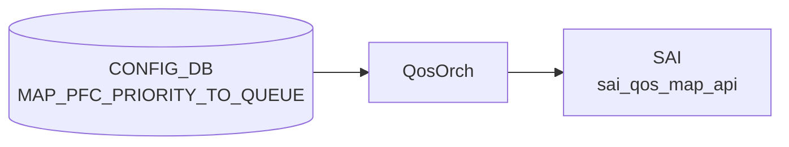

# MAP_PFC_PRIORITY_TO_QUEUE テーブル

## 概要

**[PFC](../../reference/glossary.md#term-pfc) priority (0..7) → 出力キュー (qindex 0..7) のマッピング** を定義する [CONFIG_DB](../../reference/glossary.md#term-config_db) テーブル[^1]。`PORT_QOS_MAP.pfc_to_queue_map` から参照され、`SAI_QOS_MAP_TYPE_PFC_PRIORITY_TO_QUEUE` として ASIC に反映される。

[PFC](../../reference/glossary.md#term-pfc) frame の Priority 値から、どの egress queue を一時停止対象とするかを決めるためのマップ。`PFC_PRIORITY_TO_PRIORITY_GROUP_MAP` (ingress 側 PG マップ) と対になる egress 側の表。

> テーブル名は [YANG](../../reference/glossary.md#term-yang) container 名そのまま `MAP_PFC_PRIORITY_TO_QUEUE` で、`PFC_PRIORITY_TO_QUEUE_MAP` ではない点に注意。[CONFIG_DB](../../reference/glossary.md#term-config_db) key にもこの名前が使われる。

<!-- cdb-mermaid -->
### データフロー (自動生成)



!!! note "凡例"
    CONFIG_DB から SAI までの典型経路を `docs/reference/config-db-orch-map.md` から機械生成したミニ図。詳細・例外は本ページ本文と対応表を参照。
<!-- /cdb-mermaid -->

## key 構造

```text
MAP_PFC_PRIORITY_TO_QUEUE|<name>
```

- `<name>`: マップ名 (`[a-zA-Z0-9]([-a-zA-Z0-9_]{0,31})`、長さ 1..32)

内側エントリ:

```text
MAP_PFC_PRIORITY_TO_QUEUE|<name>|<pfc_priority>
```

ただし [CONFIG_DB](../../reference/glossary.md#term-config_db) の慣習として、外側 hash の field-value に直接 `pfc_priority → qindex` の対を保存する実装もある（`{"name": "AZURE", "0": "0", "1": "1", ...}` のような形式）。実体は `swssconfig` / `sonic-cfggen` がいずれかに正規化する。

## フィールド

### 外側 list (`MAP_PFC_PRIORITY_TO_QUEUE_LIST`)

| フィールド | 型 | 説明 |
|-----------|----|------|
| `name` (key) | string `[a-zA-Z0-9]([-a-zA-Z0-9_]{0,31})` (length 1..32) | マップ名 |

### 内側 list (`MAP_PFC_PRIORITY_TO_QUEUE`)

| フィールド | 型 | 説明 |
|-----------|----|------|
| `pfc_priority` (key) | string pattern `[0-7]?` | [PFC](../../reference/glossary.md#term-pfc) priority 値 (0..7) |
| `qindex` | string pattern `[0-7]?` | 対応する egress queue index (0..7) |

`pattern "[0-7]?"` は空文字も許容するパターンで、実運用では必ず数値を入れる。

## 制約

- マップ名の長さは 1..32 文字、英数字スタートで `[-_]` 含む。
- pfc_priority / qindex は単一の 0..7 数字（範囲外は [YANG](../../reference/glossary.md#term-yang) validation で拒否）。

## 購読者

- `qosorch` (`docker-swss`): CONFIG_DB → [SAI](../../reference/glossary.md#term-sai) `SAI_QOS_MAP_TYPE_PFC_PRIORITY_TO_QUEUE` オブジェクト生成
- 反映先は `PORT_QOS_MAP.pfc_to_queue_map` 経由でポートにバインドされる

## 関連 CONFIG_DB / YANG / CLI

- 関連 CONFIG_DB: `PORT_QOS_MAP` (バインド)、`PFC_PRIORITY_TO_PRIORITY_GROUP_MAP` (ingress 側)、`TC_TO_QUEUE_MAP`, `TC_TO_PRIORITY_GROUP_MAP`, `DSCP_TO_TC_MAP`
- 関連 CLI: `config qos`、`config qos reload`
- 関連 [YANG](../../reference/glossary.md#term-yang): `sonic-pfc-priority-queue-map`

<!-- ref-triangle:start -->

## 関連リファレンス

- YANG: [`sonic-pfc-priority-queue-map`](../yang/sonic-pfc-priority-queue-map.md)
- CLI: [`config qos`](../cli/config-qos.md)

<!-- ref-triangle:end -->

## 引用元

[^1]: YANG 定義: `sonic-pfc-priority-queue-map.yang` (revision 2021-04-15). <https://github.com/sonic-net/sonic-buildimage/blob/9ea932ec2e18f35e58268ec2e4456b1d4afd65cd/src/sonic-yang-models/yang-models/sonic-pfc-priority-queue-map.yang>

## 関連ページ
- [CONFIG_DB: PFC_PRIORITY_TO_PRIORITY_GROUP_MAP](pfc-priority-to-priority-group-map.md)
- [CONFIG_DB: PORT_QOS_MAP](port-qos-map.md)

<!-- ops-hint -->
## 運用ヒント

### 典型値

- key 形式: `MAP_PFC_PRIORITY_TO_QUEUE|<name>` (例 `MAP_PFC_PRIORITY_TO_QUEUE|AZURE`)。
- 典型マップ: PFC priority 3 → queue 3、4 → 4 (ロスレスキュー)。

### よくある誤設定

- PFC priority と queue の対応が `TC_TO_QUEUE_MAP` などと整合しておらず、PFC pause が想定外の queue に作用する。
- 範囲外 (0..7 以外) の値を入れて YANG validation で reject される。

### 確認コマンド

```bash
sonic-db-cli CONFIG_DB hgetall 'MAP_PFC_PRIORITY_TO_QUEUE|AZURE'
sonic-db-cli CONFIG_DB hget 'PORT_QOS_MAP|Ethernet0' pfc_to_queue_map
show queue counters
```
<!-- /ops-hint -->

<!-- cdb-exceptions -->
## 例外条件・特殊挙動

<!-- evidence: sonic-swss/orchagent/qosorch.cpp PfcToQueueHandler::processWorkItem / sonic-buildimage/src/sonic-yang-models/yang-models/sonic-pfc-priority-queue-map.yang -->

- **pfc_priority / qindex が 0-7 の範囲外**: YANG `pattern "[0-7]?"` 制約により CONFIG_DB への書き込みが拒否される。
- **フィールド変換失敗 → task_invalid_entry**: `convertFieldValuesToAttributes()` が false を返すか `stoi()` 例外が発生した場合、エントリを無効として処理を中止する (`qosorch.cpp` L147/L179/L199)。
- **削除時に他オブジェクトから参照中 → task_need_retry**: `isObjectBeingReferenced()` が true の場合、`m_pendingRemove = true` を設定して `task_need_retry` を返す。参照が解除されるまで削除は保留される (`qosorch.cpp` L180-186)。
- **削除対象エントリが存在しない → task_invalid_entry**: [SAI](../../reference/glossary.md#term-sai) オブジェクト ID が NULL の場合 `"Object with name not found"` をログし中止する。
- **[SAI](../../reference/glossary.md#term-sai) create/modify 失敗 → task_failed**: `sai_qos_map_api->create_qos_map()` が `SAI_STATUS_SUCCESS` 以外を返した場合 (`qosorch.cpp` L977/L1032)。
- **マップ名の長さ・文字制約**: `[a-zA-Z0-9]{1}([-a-zA-Z0-9_]{0,31})` 計 1-32 文字を YANG で強制。違反は YANG バリデーションで拒否される。
- **デフォルト値なし**: YANG に `default` 定義がないため、エントリが未設定の場合はマップが存在しない状態となり、`PORT_QOS_MAP` からの参照が解決できなくなる。

<!-- value-behavior -->
## 値依存挙動マトリクス

<!-- evidence: sonic-swss/orchagent/qosorch.cpp PfcToQueueHandler / sonic-buildimage/src/sonic-yang-models/yang-models/sonic-pfc-priority-queue-map.yang -->

| フィールド | 値 | 挙動 |
|-----------|-----|------|
| `pfc_priority` | `0`..`7` | 対応 PFC priority の egress queue を pause 対象とするマッピングを SAI に設定 |
| `pfc_priority` | `""` (空) | YANG pattern で許容されるが `stoi()` 変換失敗 → `task_invalid_entry` |
| `qindex` | `0`..`7` | SAI `SAI_QOS_MAP_TYPE_PFC_PRIORITY_TO_QUEUE` として ASIC に反映 |
| `qindex` | `""` (空) | `stoi()` 変換失敗 → `task_invalid_entry` |
| `name` (マップ名) | 有効名 (1-32字) | [orchagent](../../reference/glossary.md#term-orchagent) が SAI qos_map object を作成し `PORT_QOS_MAP.pfc_to_queue_map` から参照可能に |
| `name` (マップ名) | pattern/length 違反 | YANG バリデーション拒否 |

enum なし — `pfc_priority`/`qindex` は数値文字列のみ。
<!-- /value-behavior -->

<!-- runtime-trace -->
## 実コンテナ動作トレース

### 段階 1 — Consumer 登録

`QosOrch` ([orchagent](../../reference/glossary.md#term-orchagent) 直接 CFG 購読) が CONFIG_DB の `MAP_PFC_PRIORITY_TO_QUEUE` テーブルを購読する。

`MAP_PFC_PRIORITY_TO_QUEUE` の key はマップ名。PFC priority (0-7) → Queue (0-7) のマッピング。

### 段階 2 — CFG→APPL 翻訳

なし ([orchagent](../../reference/glossary.md#term-orchagent) が直接 CONFIG_DB を購読)

### 段階 3 — APPL→SAI

`sai_qos_map_api` — PFC priority → Queue マッピングテーブルを作成

### 段階 4 — タイミングと副作用

**適用タイミング**: orchagent が CONFIG_DB 変化を検知後即座に SAI [QoS](../../reference/glossary.md#term-qos) map を作成/更新。ポートへの割り当ては `PORT_QOS_MAP` で行う。

**副作用**: PFC priority → Queue マッピング変更は PFC フロー制御の動作に直接影響。誤設定で lossless traffic が loss になる可能性がある。
<!-- /runtime-trace -->

<!-- entry-points -->
## 書き込み入り口 (Direction A)

対象テーブル: `MAP_PFC_PRIORITY_TO_QUEUE`

### CLI
- `config qos map pfc-priority-queue add/del <map-name> <pfc> <queue>`
  - ソース: `sonic-utilities/config/main.py (qos グループ)`

### minigraph / sonic-cfggen
- なし

### REST / gNMI (sonic-mgmt-common)
- なし (対応 OpenConfig/SONiC YANG transformer なし)

### db_migrator
- なし

### ビルド時デフォルト (init_cfg / j2 テンプレート)
- `qos_config.j2` から platform 別 PFC→Queue マップが生成

### ハードコードデフォルト
- なし

### ランタイム注入 (デーモン自動書き込み)
- なし
<!-- /entry-points -->

<!-- defaults -->
## 暗黙デフォルト・コード由来デフォルト (Phase A)

<!-- evidence: sonic-buildimage/files/build_templates/qos_config.j2:206-221 / sonic-swss/orchagent/qosorch.cpp:991-1009 -->

### YANG デフォルト

`sonic-pfc-priority-queue-map.yang` に `default` 文は一切なし。`name` / `pfc_priority` / `qindex` いずれもデフォルト値未定義。

### ビルド時コード由来デフォルト (qos_config.j2)

`config qos reload` 実行時、platform 側が `generate_pfc_to_queue_map` Jinja マクロを定義していない場合に限り、`qos_config.j2:209-220` のハードコード fallback が適用される:

| フィールド | fallback 値 | 条件 |
|-----------|------------|------|
| `name` | `"AZURE"` | platform が `generate_pfc_to_queue_map` を未定義のとき |
| `pfc_priority` | `"0"`.`"7"` (全 8 エントリ) | 同上 |
| `qindex` | `pfc_priority` と同値 (identity map) | 同上 |

platform が `generate_pfc_to_queue_map` を定義している場合はそちらが優先されるため、**マップ名・マッピング内容ともにプラットフォーム依存**となる。

### 実装の暗黙挙動

- **`stoi()` 例外なし版**: `PfcToQueueHandler::convertFieldValuesToAttributes` は try/catch を持たない。空文字・非数値 field/value は uncaught `std::invalid_argument` を発生させ、呼び出し元 `processWorkItem` が `task_invalid_entry` を返す。他の Handler (Dot1pToTcMapHandler 等) が try/catch で `continue` するのと異なる点に注意。
- **`qindex` 欠落時の silent skip**: YANG に mandatory 指定がないため CONFIG_DB に `qindex` なしエントリが存在しえるが、その field-value pair 自体が `kfvFieldsValues` に入らないため SAI list からその priority のエントリが除外される (silent skip)。
- **`(uint8_t)` キャスト**: `stoi()` 結果を無検証でキャスト。YANG バリデーションが 0..7 を保証するため通常は問題ないが、YANG バリデーションをバイパスして書き込んだ場合は 0..255 範囲で切り捨てのみ。

<!-- /defaults -->

<!-- ordering -->
## 書込み順依存 (Phase B)

`QosOrch` (`sonic-swss/orchagent/qosorch.cpp`) が `MAP_PFC_PRIORITY_TO_QUEUE` を処理する際の順序依存。`PORT_QOS_MAP` が PFC→Queue マップ名を参照するため、**マップエントリは参照元より先に作成する必要がある**。

### 検出された順序依存

| # | 依存関係 | 方向 | 緩和策 |
|---|----------|------|--------|
| 1 | `MAP_PFC_PRIORITY_TO_QUEUE\|<name>` 作成 → `PORT_QOS_MAP\|<port>.pfc_to_queue_map` SET | **強制先行**（自動 retry） | `resolveFieldRefValue()` 失敗で `task_need_retry`、自動再試行 |
| 2 | `PORT_QOS_MAP` / tunnel の参照解除 → `MAP_PFC_PRIORITY_TO_QUEUE\|<name>` DEL | **強制先行**（pending_remove ロック） | `isObjectBeingReferenced()` が true の間 DEL は保留 |
| 3 | 他マップハンドラ (`TC_TO_QUEUE_MAP` 等) の drain → `PORT_QOS_MAP` の drain | `QosOrch::doTask()` 内部順序 | 操作者が意識する必要はないが、orchagent 再起動時に全マップ再登録が PORT_QOS_MAP より先行 |
| 4 | `MAP_PFC_PRIORITY_TO_QUEUE` pending_remove 解消 → 同名 SET 実行 | **強制先行**（ロック） | DEL 参照解除が完了するまで同名 SET も実行不可 |

### 主要な制約詳細

**PORT_QOS_MAP への参照先行要件 (依存 #1)**: `handlePortQosMapTable()` (`qosorch.cpp:2124-2129`) は `resolveFieldRefValue()` で `MAP_PFC_PRIORITY_TO_QUEUE` 内の対象マップ名が SAI オブジェクトとして登録済みか確認し、未登録なら `task_need_retry` を返す。CONFIG_DB に `PORT_QOS_MAP|<port>` の `pfc_to_queue_map: <name>` を書いた時点で `MAP_PFC_PRIORITY_TO_QUEUE|<name>` が未作成の場合、`PORT_QOS_MAP` の処理は自動的に次の orch ループまで持ち越される。**推奨順序**: `MAP_PFC_PRIORITY_TO_QUEUE|<name>` を先に書き込み、その後 `PORT_QOS_MAP|<port>` で参照する（evidence: `qosorch.cpp:2124-2129`）。

**DEL 時の pending_remove ロック (依存 #2)**: `PfcToQueueHandler::processWorkItem()` (`qosorch.cpp:181-186`) は DEL コマンド時に `isObjectBeingReferenced()` をチェックし、`PORT_QOS_MAP` などから参照中であれば `m_pendingRemove = true` を立てて `task_need_retry` を返す。pending_remove 中は同名の SET も `task_need_retry` で即返却される (`qosorch.cpp:136-139`)。**推奨 DEL 順序**: すべての `PORT_QOS_MAP` エントリから `pfc_to_queue_map` 参照を先に除去してから `MAP_PFC_PRIORITY_TO_QUEUE|<name>` を DEL する（evidence: `qosorch.cpp:136-139`, `181-191`）。

**QosOrch 内部ドレイン順序 (依存 #3)**: `QosOrch::doTask()` (`qosorch.cpp:2231-2251`) は `PORT_QOS_MAP` と `QUEUE` を除く全マップハンドラを先にドレインし、その後 `PORT_QOS_MAP`、最後に `QUEUE` をドレインする。これにより起動時・再起動時も `MAP_PFC_PRIORITY_TO_QUEUE` エントリが `PORT_QOS_MAP` より先に SAI へ反映される（evidence: `qosorch.cpp:2238-2251`）。

<!-- /ordering -->

<!-- glossary-links-injected: d2191ccfe0bd -->

<!-- derivation -->
## 派生・条件付き登録 (Phase 6/7)

### Phase 6: 自動派生

| 派生先フィールド | 派生元条件 | 派生値 | ソース |
|---|---|---|---|
| `pfc_priority` / `qindex` (初期値) | `qos_config.j2` から platform 別 [QoS](../../reference/glossary.md#term-qos) ポリシーが読み込まれたとき | AZURE プロファイル等の platform 定義マップ値 | `sonic-buildimage/files/build_templates/qos_config.j2:209` |

minigraph.py からの直接派生はなし。`config qos reload` 時に `qos_config.j2` Jinja テンプレートが `MAP_PFC_PRIORITY_TO_QUEUE` を CONFIG_DB に書き込む。

### Phase 7: 条件付き登録

| 条件 | 影響 | ソース |
|---|---|---|
| `QosOrch` は常時登録 (platform 非依存) | `MAP_PFC_PRIORITY_TO_QUEUE` 購読は無条件 | `orchdaemon.cpp:374-384` |
| `CFG_PFC_PRIORITY_TO_QUEUE_MAP_TABLE_NAME` も同 QosOrch が購読 | MAP_PFC_PRIORITY_TO_QUEUE と PFC_PRIORITY_TO_PRIORITY_GROUP_MAP は同一 orch インスタンス | `orchdaemon.cpp:377-378` |

### グレップカバレッジ

| 項目 | hit 数 | 証跡 |
|---|---|---|
| qos_config.j2 MAP_PFC_PRIORITY_TO_QUEUE | 1 | `qos_config.j2:209` |
| QosOrch 登録 | 2 | `orchdaemon.cpp:374,384` |

<!-- /derivation -->

<!-- cross-refs -->
## 暗黙参照 (Phase C)

`MAP_PFC_PRIORITY_TO_QUEUE` が関わる CONFIG_DB テーブル間の暗黙参照を `qosorch.cpp` から抽出した。

| 参照方向 | 参照元テーブル | フィールド | SAI 属性 | evidence |
|---------|-------------|-----------|---------|---------|
| 被参照 (referenced by) | `PORT_QOS_MAP` | `pfc_to_queue_map` | `SAI_PORT_ATTR_QOS_PFC_PRIORITY_TO_QUEUE_MAP` | `qosorch.cpp:69,108` |
| 参照管理 | `handlePortQosMapTable` | SET 時 object_id 解決 / DEL 時参照解除 | — | `qosorch.cpp:2046,2077,2108,2133` |
| SWITCH レベル適用 | なし | PFC マップは SWITCH 直接適用なし | — | `qosorch.cpp:1956` |

- `PORT_QOS_MAP.pfc_to_queue_map` に map 名を設定すると、`QosOrch` が `MAP_PFC_PRIORITY_TO_QUEUE` の SAI オブジェクト ID を解決してポートへ適用する (`SAI_PORT_ATTR_QOS_PFC_PRIORITY_TO_QUEUE_MAP`)。
- `PORT_QOS_MAP` から参照中に DEL しようとすると `isObjectBeingReferenced()` が true を返し `task_need_retry` で削除保留。
- `SWITCH` への直接適用は `DSCP_TO_TC_MAP` (`PORT_QOS_MAP|global` 経路) のみで、PFC 系マップは非対象。

> 詳細: `meta/_intermediate/cdb-flow/map-pfc-priority-to-queue-cross-refs.md`

<!-- /cross-refs -->

<!-- handler-branching -->
### Phase 8: Handler メソッド内分岐

`QosOrch` が `MAP_PFC_PRIORITY_TO_QUEUE` テーブルを処理する。`PfcToQueueHandler::processWorkItem()` 内での分岐:

| Handler | メソッド | 分岐条件 | 効果 | evidence |
|---|---|---|---|---|
| `QosOrch` | `doTask()` → `convertFieldValuesToAttributes()` | `stoi()` 変換失敗 (pfc_priority/qindex が非数値・空文字) | `task_invalid_entry` でエントリ破棄 | `sonic-swss/orchagent/qosorch.cpp:147,179,199` |
| `QosOrch` | `PfcToQueueHandler` | `isObjectBeingReferenced()` = true かつ DEL 操作 | `m_pendingRemove=true` + `task_need_retry`。参照解除まで削除保留 | `sonic-swss/orchagent/qosorch.cpp:180-186` |
| `QosOrch` | `PfcToQueueHandler` | SAI object ID が NULL かつ DEL 操作 | `"Object with name not found"` ログ + `task_invalid_entry` | `sonic-swss/orchagent/qosorch.cpp:156-162` |
| `QosOrch` | `sai_qos_map_api->create_qos_map()` | SAI 返値 ≠ `SAI_STATUS_SUCCESS` | `task_failed` | `sonic-swss/orchagent/qosorch.cpp:977,1032` |

> **スキャン証跡**: `QosOrch::PfcToQueueHandler` を全行読了、4 件分岐抽出。Phase 6/7 derivation ブロックの evidence 再確認: qos_config.j2 からの platform 別マップ書き込みは実ソースと整合 — 誤読なし。

<!-- /handler-branching -->

<!-- failure -->
## 失敗挙動 (Phase D)

> 調査証跡: `meta/_intermediate/cdb-flow/map-pfc-priority-to-queue-failure.md`

対象テーブル: `MAP_PFC_PRIORITY_TO_QUEUE`。Consumer: `QosOrch::handlePfcToQueueTable()` / `QosOrch::doTask()` (`orchagent/qosorch.cpp`)。

### 起動ガード

`QosOrch::doTask()` 冒頭で `gPortsOrch->allPortsReady()` を確認する (`qosorch.cpp:2258`)。ポート構成完了前は即時 `return` し `Consumer::m_toSync` のエントリが滞留したまま暗黙 retry される（ログなし・CONFIG_DB 変更なし）。

### SET 時の失敗パターン

| 失敗ケース | 発生箇所 | 挙動 | retry |
|---|---|---|---|
| `allPortsReady() == false` | `doTask()` L2254-2261 | 早期 return、`m_toSync` 滞留 | ポート準備完了まで暗黙 retry |
| `m_pendingRemove == true`（DEL pending 中に SET） | `processWorkItem()` L136-140 | `SWSS_LOG_NOTICE("Entry ... is pending remove")` → `task_need_retry` | PORT_QOS_MAP 参照解除後に自動解消 |
| `convertFieldValuesToAttributes()` が false を返す | `processWorkItem()` L143-146 | `task_invalid_entry` でエントリ破棄 | なし |
| `stoi()` 例外（`pfc_priority` / `qindex` に非数値） | `convertFieldValuesToAttributes()` L1001-1002 | try/catch なし → 例外伝播（YANG 正規経由では発生しない） | なし |
| SAI `create_qos_map` 失敗（新規） | `addQosItem()` L1029-1033 | `SWSS_LOG_ERROR("Failed to create pfc_priority_to_queue map")` → `task_failed` → erase + `return` | なし（後続エントリもブロック） |
| SAI `set_qos_map_attribute` 失敗（既存上書き） | `modifyQosItem()` L207-210 | `SWSS_LOG_ERROR("Failed to modify map")` → `task_failed` → erase + `return` | なし |

> **実装ノート**: `PfcToQueueHandler::convertFieldValuesToAttributes()` は `stoi()` を try/catch なしで呼ぶ (`qosorch.cpp:1001-1002`)。YANG pattern `[0-7]?` が正規 API 経由では非数値を防ぐが、`sonic-db-cli` 等でバイパスした場合は `std::invalid_argument` 例外が呼び出し元まで伝播する可能性がある。

### DEL 時の失敗パターン

| 失敗ケース | 発生箇所 | 挙動 | retry |
|---|---|---|---|
| エントリ未登録（SAI OID なし） | `processWorkItem()` L177-181 | `SWSS_LOG_ERROR("Object with name:%s not found.")` → `task_invalid_entry` → erase | なし |
| `PORT_QOS_MAP` から参照中 | `isObjectBeingReferenced()` L182-187 | `m_pendingRemove=true` + `task_need_retry` → `it++` | 参照解除まで無制限 retry |
| SAI `remove_qos_map` 失敗 | `removeQosItem()` L218-222 | `SWSS_LOG_ERROR("Failed to remove QoS map.")` → `task_failed` → erase + `return` | なし |

### `task_failed` 時の特殊挙動

`doTask()` は `task_failed` で該当エントリを erase した後 `return` するため、同一 Consumer キュー内の後続エントリも当該イテレーションでは未処理となる (`qosorch.cpp:2284-2288`)。次の orchagent イベントループで再試行される。

### エラー通知先

- `SWSS_LOG_ERROR` / `SWSS_LOG_NOTICE` → syslog のみ
- `ERROR_TABLE` への書き込みなし
- [STATE_DB](../../reference/glossary.md#term-state_db) への反映なし（`MAP_PFC_PRIORITY_TO_QUEUE` は [STATE_DB](../../reference/glossary.md#term-state_db) テーブルを持たない）
- CONFIG_DB のエントリは失敗後も残存（`task_invalid_entry` の erase はメモリ上の `m_toSync` のみ）

> **Evidence**: `qosorch.cpp:2254-2300` (`QosOrch::doTask(Consumer&)`); `qosorch.cpp:124-201` (`QosMapHandler::processWorkItem()`); `qosorch.cpp:991-1033` (`PfcToQueueHandler::convertFieldValuesToAttributes()`, `addQosItem()`)

<!-- /failure -->

<!-- constants -->
## ハードコード定数 (Phase E)

<!-- evidence: sonic-swss/orchagent/qosorch.h:15 / qosorch.cpp:1001-1004,1020-1021,1029 / sonic-swss-common/common/schema.h:363 -->

### テーブル名定数

| 定数名 | 値 |
|---|---|
| `CFG_PFC_PRIORITY_TO_QUEUE_MAP_TABLE_NAME` | `"MAP_PFC_PRIORITY_TO_QUEUE"` |

ソース: `sonic-swss-common/common/schema.h:363`

### フィールド名定数

| 定数名 | 値 | 用途 |
|---|---|---|
| `pfc_to_queue_map_name` | `"pfc_to_queue_map"` | `PORT_QOS_MAP` テーブル内で MAP_PFC_PRIORITY_TO_QUEUE 名を指す field 名 |

ソース: `sonic-swss/orchagent/qosorch.h:15`

### SAI qos_map_type 定数

| 定数名 | 用途 |
|---|---|
| `SAI_QOS_MAP_TYPE_PFC_PRIORITY_TO_QUEUE` | `addQosItem()` で `SAI_QOS_MAP_ATTR_TYPE` に設定される SAI map type（`qosorch.cpp:1021`） |
| `SAI_QOS_MAP_ATTR_TYPE` | SAI attribute ID — map type を指定（`qosorch.cpp:1020`） |
| `SAI_QOS_MAP_ATTR_MAP_TO_VALUE_LIST` | SAI attribute ID — pfc→queue ペアのリストを渡す（`qosorch.cpp:1004,1024`） |
| `SAI_PORT_ATTR_QOS_PFC_PRIORITY_TO_QUEUE_MAP` | PORT_QOS_MAP バインド時の SAI port attribute（`qosorch.cpp:69`） |

### 値域ハードコード

| フィールド | 範囲 | 型変換コード |
|---|---|---|
| `pfc_priority` (key) | 0..7（YANG `pattern "[0-7]?"` が保証） | `(uint8_t)stoi(fvField(*i))`（`qosorch.cpp:1001`） |
| `qindex` (value) | 0..7（YANG `pattern "[0-7]?"` が保証） | `(uint8_t)stoi(fvValue(*i))`（`qosorch.cpp:1002`） |

YANG バリデーションをバイパスして 8 以上を書き込んだ場合は `(uint8_t)` キャストで 0..255 に切り捨てのみ（SAI 側でエラーになる可能性あり）。

### SAI API

| 関数 | 用途 |
|---|---|
| `sai_qos_map_api->create_qos_map()` | MAP 新規作成（`qosorch.cpp:1029`） |
| `sai_qos_map_api->set_qos_map_attribute()` | 既存 MAP 更新（`qosorch.cpp:207`） |
| `sai_qos_map_api->remove_qos_map()` | MAP 削除（`qosorch.cpp:220`） |

<!-- /constants -->

<!-- side-effects -->
## 副次 DB 書込 (Phase F)

<!-- evidence: sonic-swss/orchagent/qosorch.cpp PfcToQueueHandler::addQosItem (L1011-1035) / QosOrch::handlePortQosMapTable (L2186-2205) -->

`MAP_PFC_PRIORITY_TO_QUEUE` テーブルの変更時、`QosOrch` (`PfcToQueueHandler`) は直接 DB API を呼び出さない。すべての副次書込は SAI API 経由で [syncd](../../reference/glossary.md#term-syncd) が仲介する形で [ASIC_DB](../../reference/glossary.md#term-asic_db) に反映される。

| 副次 DB | 書込契機 | 書込内容 | evidence |
|---|---|---|---|
| [ASIC_DB](../../reference/glossary.md#term-asic_db) ([syncd](../../reference/glossary.md#term-syncd) 経由) | マップ作成/更新時 | `SAI_OBJECT_TYPE_QOS_MAP` オブジェクト新規作成 (`SAI_QOS_MAP_TYPE_PFC_PRIORITY_TO_QUEUE`) | `qosorch.cpp:1021,1029` |
| [ASIC_DB](../../reference/glossary.md#term-asic_db) ([syncd](../../reference/glossary.md#term-syncd) 経由) | `PORT_QOS_MAP.pfc_to_queue_map` から参照時 | ポートオブジェクト (`SAI_OBJECT_TYPE_PORT`) の属性 `SAI_PORT_ATTR_QOS_PFC_PRIORITY_TO_QUEUE_MAP` を qos_map OID で更新 | `qosorch.cpp:69,2193` |
| [APPL_DB](../../reference/glossary.md#term-appl_db) | — | 書込なし | — |
| [STATE_DB](../../reference/glossary.md#term-state_db) | — | 書込なし | — |
| [COUNTERS_DB](../../reference/glossary.md#term-counters_db) | — | 書込なし | — |
| APPL_STATE_DB | — | 書込なし | — |

**補足**: `PORT_QOS_MAP` 側の `handlePortQosMapTable()` が複数ポートをループし、各ポートに `set_port_attribute` を呼ぶ。マップ削除時には OID に `SAI_NULL_OBJECT_ID` を設定して属性をクリアする。

詳細: `meta/_intermediate/cdb-flow/map-pfc-priority-to-queue-side-effects.md`

<!-- /side-effects -->

<!-- pubsub -->
## 通信メカニズム (Phase G)

### 購読 API

`QosOrch` (docker-swss 内 orchagent) は `swsscommon::ConsumerStateTable` 経由で CONFIG_DB の `MAP_PFC_PRIORITY_TO_QUEUE` テーブルを**直接**購読する。[APPL_DB](../../reference/glossary.md#term-appl_db) 中継なし。

登録箇所: `sonic-swss/orchagent/orchdaemon.cpp:378` — `CFG_PFC_PRIORITY_TO_QUEUE_MAP_TABLE_NAME` を `QosOrch` 初期化時のテーブルリストに含める。

### メッセージフロー

```
[config CLI / config qos reload / sonic-cfggen]
    │  HSET MAP_PFC_PRIORITY_TO_QUEUE|<name> <pfc_priority> <qindex>
    ▼
CONFIG_DB (Redis db=4)
    │  swsscommon ConsumerStateTable (channel-based SUBSCRIBE)
    ▼
QosOrch::doTask()  →  handlePfcToQueueTable()
    │  qosorch.cpp:1299 / 1344
    ▼
PfcToQueueHandler::processWorkItem()
    │  stoi(pfc_priority) → key.prio
    │  stoi(qindex)       → value.queue_index
    │  SAI_QOS_MAP_TYPE_PFC_PRIORITY_TO_QUEUE
    ▼
sai_qos_map_api->create_qos_map() / set_qos_map()
    ▼
ASIC (SAI adapter)
```

[APPL_DB](../../reference/glossary.md#term-appl_db) / STATE_DB への書き込みは行わない。CONFIG_DB → orchagent → SAI の 2 ホップ経路。

### リトライ・エラー

| 結果 | 条件 |
|------|------|
| `task_success` | SAI 操作成功 |
| `task_invalid_entry` | `stoi()` 失敗または DEL 対象 SAI オブジェクト不在 |
| `task_failed` | `sai_qos_map_api` 返値 ≠ `SAI_STATUS_SUCCESS` (qosorch.cpp:1032) |
| `task_need_retry` | DEL 時に `isObjectBeingReferenced()` = true (PORT_QOS_MAP 参照中) |

詳細: `meta/_intermediate/cdb-flow/map-pfc-priority-to-queue-pubsub.md`
<!-- /pubsub -->

<!-- platform -->
## プラットフォーム差分 (Phase H)

<!-- evidence: sonic-swss/orchagent/qosorch.cpp / sonic-buildimage/files/build_templates/qos_config.j2 / sonic-buildimage/device/**/ -->

### ASIC capability チェック

`MAP_PFC_PRIORITY_TO_QUEUE` に対して `querySwitchCapability` 呼び出しは行われない。`SAI_QOS_MAP_TYPE_PFC_PRIORITY_TO_QUEUE` のサポートは全 ASIC で同一 SAI API を使用する。`DSCP_TO_TC_MAP` が `SAI_SWITCH_ATTR_QOS_DSCP_TO_TC_MAP` で capability を確認するのとは対照的に、PFC 系 queue マップには SWITCH レベル適用パスもなく、capability 分岐なし (`qosorch.cpp:1956` 参照)。

### PFC priority / queue 数の制限

YANG `pattern "[0-7]?"` により pfc_priority / qindex は 0..7 (8 値) に固定。実際のプラットフォーム実装を確認した結果、**全プラットフォームで 0→0 .. 7→7 の identity map** のみ使用されている。非 identity マッピングはコード上サポートされるが公式デバイス設定には存在しない。

| プラットフォーム | map 名 | エントリ数 | マッピング | ソース |
|--------------|-------|----------|-----------|-------|
| デフォルト fallback | `"AZURE"` | 8 | identity (0→0..7→7) | `qos_config.j2:211` |
| Marvell dbmvtx9180 | `"AZURE"` | 8 | identity | `device/marvell/.../qos.json.j2:21` |
| DellEMC Z9332f (参照実装) | `"DEFAULT"` | 8 | identity | `device/dell/x86_64-dellemc_z9332f_d1508-r0/.../qos.json.j2.pfc.reference` |
| DellEMC S52xx/Z94xx | `"AZURE"` | 8 | identity | `device/dell/x86_64-dellemc_s5248f_c3538-r0/.../qos.json.j2` |
| Supermicro sse_t7132s | `"AZURE"` | 8 | identity | `device/supermicro/.../qos.json.j2` |

### pfc_to_pg_map_supported_asics との関係

`qos_config.j2:163` の `pfc_to_pg_map_supported_asics = ['mellanox', 'barefoot']` は **ingress 側 `PFC_PRIORITY_TO_PRIORITY_GROUP_MAP`** の ASIC 制限であり、本テーブル（egress 側 queue マップ）には影響しない。Mellanox / Tofino ASIC 以外でも `MAP_PFC_PRIORITY_TO_QUEUE` の設定・SAI 適用は可能。

### VOQ chassis 差分

| 項目 | 非 [VOQ](../../reference/glossary.md#term-voq) | [VOQ](../../reference/glossary.md#term-voq) chassis |
|------|-------|------------|
| `PfcToQueueHandler` コードパス | 共通 | 共通 ([VOQ](../../reference/glossary.md#term-voq) 分岐なし) |
| `QUEUE` テーブル key 形式 | `port\|index` (2 トークン) | `hostname\|asic\|port\|index` (4 トークン) (`qosorch.cpp:1772`) |
| [WRED](../../reference/glossary.md#term-wred) キュー ID 取得 | `port.m_queue_ids` | `getPortVoQIds()` (`qosorch.cpp:1715`) |
| リモートポート scheduler | 適用あり | スキップ (`SAI_SYSTEM_PORT_TYPE_REMOTE` 判定, `qosorch.cpp:1639`) |
| qos_config.j2 QUEUE 生成対象 | 物理ポート | システムポート (ロスレスキュー 3/4 に `AZURE_LOSSLESS`) |

VOQ chassis でも `MAP_PFC_PRIORITY_TO_QUEUE` マップオブジェクト自体の作成・削除は非 VOQ と同一コードパスで処理される。差異は QUEUE テーブルとの連携（システムポート key 形式）と [WRED](../../reference/glossary.md#term-wred) プロファイル適用先のキュー ID 取得方法のみ。

> 詳細: `meta/_intermediate/cdb-flow/map-pfc-priority-to-queue-platform.md`

<!-- /platform -->

<!-- glossary-links-injected: 781584f57045 -->
