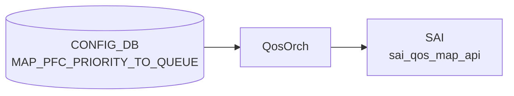

# MAP_PFC_PRIORITY_TO_QUEUE テーブル

## 概要

**[PFC](../../reference/glossary.md#term-pfc) priority (0..7) → 出力キュー (qindex 0..7) のマッピング** を定義する [CONFIG_DB](../../reference/glossary.md#term-config_db) テーブル[^1]。`PORT_QOS_MAP.pfc_to_queue_map` から参照され、`SAI_QOS_MAP_TYPE_PFC_PRIORITY_TO_QUEUE` として ASIC に反映される。

[PFC](../../reference/glossary.md#term-pfc) frame の Priority 値から、どの egress queue を一時停止対象とするかを決めるためのマップ。`PFC_PRIORITY_TO_PRIORITY_GROUP_MAP` (ingress 側 PG マップ) と対になる egress 側の表。

> テーブル名は [YANG](../../reference/glossary.md#term-yang) container 名そのまま `MAP_PFC_PRIORITY_TO_QUEUE` で、`PFC_PRIORITY_TO_QUEUE_MAP` ではない点に注意。[CONFIG_DB](../../reference/glossary.md#term-config_db) key にもこの名前が使われる。

<!-- cdb-mermaid -->
### データフロー (自動生成)



!!! note "凡例"
    CONFIG_DB から SAI までの典型経路を `docs/reference/config-db-orch-map.md` から機械生成したミニ図。詳細・例外は本ページ本文と対応表を参照。
<!-- /cdb-mermaid -->

## key 構造

```text
MAP_PFC_PRIORITY_TO_QUEUE|<name>
```

- `<name>`: マップ名 (`[a-zA-Z0-9]([-a-zA-Z0-9_]{0,31})`、長さ 1..32)

内側エントリ:

```text
MAP_PFC_PRIORITY_TO_QUEUE|<name>|<pfc_priority>
```

ただし [CONFIG_DB](../../reference/glossary.md#term-config_db) の慣習として、外側 hash の field-value に直接 `pfc_priority → qindex` の対を保存する実装もある（`{"name": "AZURE", "0": "0", "1": "1", ...}` のような形式）。実体は `swssconfig` / `sonic-cfggen` がいずれかに正規化する。

## フィールド

### 外側 list (`MAP_PFC_PRIORITY_TO_QUEUE_LIST`)

| フィールド | 型 | 説明 |
|-----------|----|------|
| `name` (key) | string `[a-zA-Z0-9]([-a-zA-Z0-9_]{0,31})` (length 1..32) | マップ名 |

### 内側 list (`MAP_PFC_PRIORITY_TO_QUEUE`)

| フィールド | 型 | 説明 |
|-----------|----|------|
| `pfc_priority` (key) | string pattern `[0-7]?` | [PFC](../../reference/glossary.md#term-pfc) priority 値 (0..7) |
| `qindex` | string pattern `[0-7]?` | 対応する egress queue index (0..7) |

`pattern "[0-7]?"` は空文字も許容するパターンで、実運用では必ず数値を入れる。

## 制約

- マップ名の長さは 1..32 文字、英数字スタートで `[-_]` 含む。
- pfc_priority / qindex は単一の 0..7 数字（範囲外は [YANG](../../reference/glossary.md#term-yang) validation で拒否）。

## 購読者

- `qosorch` (`docker-swss`): CONFIG_DB → [SAI](../../reference/glossary.md#term-sai) `SAI_QOS_MAP_TYPE_PFC_PRIORITY_TO_QUEUE` オブジェクト生成
- 反映先は `PORT_QOS_MAP.pfc_to_queue_map` 経由でポートにバインドされる

## 関連 CONFIG_DB / YANG / CLI

- 関連 CONFIG_DB: `PORT_QOS_MAP` (バインド)、`PFC_PRIORITY_TO_PRIORITY_GROUP_MAP` (ingress 側)、`TC_TO_QUEUE_MAP`, `TC_TO_PRIORITY_GROUP_MAP`, `DSCP_TO_TC_MAP`
- 関連 CLI: `config qos`、`config qos reload`
- 関連 [YANG](../../reference/glossary.md#term-yang): `sonic-pfc-priority-queue-map`

<!-- ref-triangle:start -->

## 関連リファレンス

- YANG: [`sonic-pfc-priority-queue-map`](../yang/sonic-pfc-priority-queue-map.md)
- CLI: [`config qos`](../cli/config-qos.md)

<!-- ref-triangle:end -->

## 引用元

[^1]: YANG 定義: `sonic-pfc-priority-queue-map.yang` (revision 2021-04-15). <https://github.com/sonic-net/sonic-buildimage/blob/9ea932ec2e18f35e58268ec2e4456b1d4afd65cd/src/sonic-yang-models/yang-models/sonic-pfc-priority-queue-map.yang>

## 関連ページ
- [CONFIG_DB: PFC_PRIORITY_TO_PRIORITY_GROUP_MAP](pfc-priority-to-priority-group-map.md)
- [CONFIG_DB: PORT_QOS_MAP](port-qos-map.md)

<!-- ops-hint -->
## 運用ヒント

### 典型値

- key 形式: `MAP_PFC_PRIORITY_TO_QUEUE|<name>` (例 `MAP_PFC_PRIORITY_TO_QUEUE|AZURE`)。
- 典型マップ: PFC priority 3 → queue 3、4 → 4 (ロスレスキュー)。

### よくある誤設定

- PFC priority と queue の対応が `TC_TO_QUEUE_MAP` などと整合しておらず、PFC pause が想定外の queue に作用する。
- 範囲外 (0..7 以外) の値を入れて YANG validation で reject される。

### 確認コマンド

```bash
sonic-db-cli CONFIG_DB hgetall 'MAP_PFC_PRIORITY_TO_QUEUE|AZURE'
sonic-db-cli CONFIG_DB hget 'PORT_QOS_MAP|Ethernet0' pfc_to_queue_map
show queue counters
```
<!-- /ops-hint -->

<!-- cdb-exceptions -->
## 例外条件・特殊挙動

<!-- evidence: sonic-swss/orchagent/qosorch.cpp PfcToQueueHandler::processWorkItem / sonic-buildimage/src/sonic-yang-models/yang-models/sonic-pfc-priority-queue-map.yang -->

- **pfc_priority / qindex が 0-7 の範囲外**: YANG `pattern "[0-7]?"` 制約により CONFIG_DB への書き込みが拒否される。
- **フィールド変換失敗 → task_invalid_entry**: `convertFieldValuesToAttributes()` が false を返すか `stoi()` 例外が発生した場合、エントリを無効として処理を中止する (`qosorch.cpp` L147/L179/L199)。
- **削除時に他オブジェクトから参照中 → task_need_retry**: `isObjectBeingReferenced()` が true の場合、`m_pendingRemove = true` を設定して `task_need_retry` を返す。参照が解除されるまで削除は保留される (`qosorch.cpp` L180-186)。
- **削除対象エントリが存在しない → task_invalid_entry**: [SAI](../../reference/glossary.md#term-sai) オブジェクト ID が NULL の場合 `"Object with name not found"` をログし中止する。
- **[SAI](../../reference/glossary.md#term-sai) create/modify 失敗 → task_failed**: `sai_qos_map_api->create_qos_map()` が `SAI_STATUS_SUCCESS` 以外を返した場合 (`qosorch.cpp` L977/L1032)。
- **マップ名の長さ・文字制約**: `[a-zA-Z0-9]{1}([-a-zA-Z0-9_]{0,31})` 計 1-32 文字を YANG で強制。違反は YANG バリデーションで拒否される。
- **デフォルト値なし**: YANG に `default` 定義がないため、エントリが未設定の場合はマップが存在しない状態となり、`PORT_QOS_MAP` からの参照が解決できなくなる。

<!-- value-behavior -->
## 値依存挙動マトリクス

<!-- evidence: sonic-swss/orchagent/qosorch.cpp PfcToQueueHandler / sonic-buildimage/src/sonic-yang-models/yang-models/sonic-pfc-priority-queue-map.yang -->

| フィールド | 値 | 挙動 |
|-----------|-----|------|
| `pfc_priority` | `0`..`7` | 対応 PFC priority の egress queue を pause 対象とするマッピングを SAI に設定 |
| `pfc_priority` | `""` (空) | YANG pattern で許容されるが `stoi()` 変換失敗 → `task_invalid_entry` |
| `qindex` | `0`..`7` | SAI `SAI_QOS_MAP_TYPE_PFC_PRIORITY_TO_QUEUE` として ASIC に反映 |
| `qindex` | `""` (空) | `stoi()` 変換失敗 → `task_invalid_entry` |
| `name` (マップ名) | 有効名 (1-32字) | orchagent が SAI qos_map object を作成し `PORT_QOS_MAP.pfc_to_queue_map` から参照可能に |
| `name` (マップ名) | pattern/length 違反 | YANG バリデーション拒否 |

enum なし — `pfc_priority`/`qindex` は数値文字列のみ。
<!-- /value-behavior -->

<!-- glossary-links-injected: d2191ccfe0bd -->
