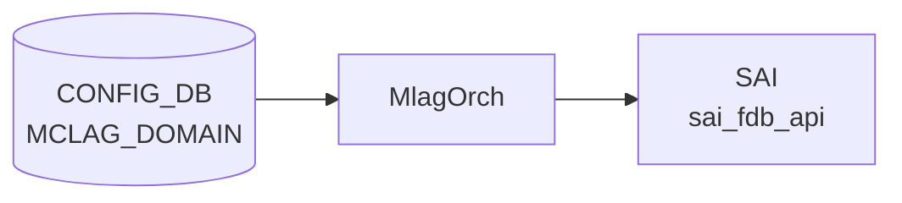

# MCLAG_DOMAIN / MCLAG_INTERFACE / MCLAG_UNIQUE_IP テーブル

## 概要

MC-[LAG](../../reference/glossary.md#term-lag) (Multi-Chassis Link Aggregation) のドメイン設定とメンバー / unique-IP 設定を [CONFIG_DB](../../reference/glossary.md#term-config_db) に保持する 3 テーブル[^1]。`iccpd` (`docker-iccpd`) がこれらを購読し、ICCP セッションと MC-[LAG](../../reference/glossary.md#term-lag) メンバー [LAG](../../reference/glossary.md#term-lag) の同期を制御する。

- `MCLAG_DOMAIN` — 1 ドメインの基本パラメータ（最大 1 エントリ）
- `MCLAG_INTERFACE` — ドメインに紐づく MC-LAG メンバー [PortChannel](../../reference/glossary.md#term-portchannel)
- `MCLAG_UNIQUE_IP` — MC-LAG ピア間で [VLAN](../../reference/glossary.md#term-vlan) インターフェースに **異なる IP** を持たせる対象 [VLAN](../../reference/glossary.md#term-vlan)

<!-- cdb-mermaid -->
### データフロー (自動生成)



!!! note "凡例"
    CONFIG_DB から SAI までの典型経路を `docs/reference/config-db-orch-map.md` から機械生成したミニ図。詳細・例外は本ページ本文と対応表を参照。
<!-- /cdb-mermaid -->

## key 構造

```text
MCLAG_DOMAIN|<domain_id>
MCLAG_INTERFACE|<domain_id>|<if_name>
MCLAG_UNIQUE_IP|<if_name>
```

## MCLAG_DOMAIN フィールド

| フィールド | 型 | デフォルト | 説明 |
|-----------|----|-----------|------|
| `domain_id` (key) | uint16 (1..4095) | — | MC-LAG ドメイン ID |
| `source_ip` | inet:ipv4-address | — | ICCP セッションのソース IP |
| `peer_ip` | inet:ipv4-address | — | ICCP セッションのピア IP |
| `peer_link` | union leafref → `PORT.name` または `PORTCHANNEL.name` | — | ピアリンク（バックアップデータパス） |
| `keepalive_interval` | uint16 (1..60) [秒] | 1 | ICCP keepalive 間隔 |
| `session_timeout` | uint16 (1..3600) [秒] | 30 | ICCP セッションタイムアウト |

**must 制約**: `keepalive_interval * 3 <= session_timeout`

**max-elements: 1** — ドメインは 1 件のみ

## MCLAG_INTERFACE フィールド

| フィールド | 型 | 説明 |
|-----------|----|------|
| `domain_id` (key) | leafref → `MCLAG_DOMAIN.domain_id` | 所属ドメイン |
| `if_name` (key) | leafref → `PORTCHANNEL.name` | MC-LAG メンバー LAG |
| `if_type` | string | プレースホルダ（インスタンス作成用） |

## MCLAG_UNIQUE_IP フィールド

| フィールド | 型 | 説明 |
|-----------|----|------|
| `if_name` (key) | string パターン `Vlan<id>` | unique-ip を許可する [VLAN](../../reference/glossary.md#term-vlan) インターフェース名 |
| `unique_ip` | enum `enable` | 有効化フラグ（無効時はエントリ削除） |

**must 制約**: `MCLAG_DOMAIN_LIST` が少なくとも 1 つ存在すること

[YANG](../../reference/glossary.md#term-yang) コメントによれば、本来 `MCLAG_UNIQUE_IP.if_name` は `VLAN.name` への leafref にしたいが libyang back-links の制約で plain string になっている。

## 購読者

- `iccpd` (`docker-iccpd`) — MC-LAG 制御プレーン
- 間接的に `teamd` ([PortChannel](../../reference/glossary.md#term-portchannel) のメンバー同期)

## 関連 CONFIG_DB / YANG / CLI

- 関連 [CONFIG_DB](../../reference/glossary.md#term-config_db): `PORTCHANNEL`、`PORTCHANNEL_MEMBER`、`VLAN`、`VLAN_INTERFACE`、`PORT`
- 関連 [YANG](../../reference/glossary.md#term-yang): `sonic-mclag`、`sonic-portchannel`、`sonic-port`
- 関連 CLI: `config mclag`

<!-- ref-triangle:start -->

## 関連リファレンス

- [YANG](../../reference/glossary.md#term-yang): [`sonic-mclag`](../yang/sonic-mclag.md)
- CLI: [`config mclag`](../cli/config-mclag.md)

<!-- ref-triangle:end -->

## 引用元

[^1]: YANG 定義: `sonic-mclag.yang`. <https://github.com/sonic-net/sonic-buildimage/blob/9ea932ec2e18f35e58268ec2e4456b1d4afd65cd/src/sonic-yang-models/yang-models/sonic-mclag.yang>

## 関連ページ
- [CONFIG_DB: PORTCHANNEL](portchannel.md)
- [CONFIG_DB: VLAN](vlan.md)

<!-- ops-hint -->
## 運用ヒント

### 典型値

- key 形式: `MCLAG_DOMAIN|<domain-id>` (1..4095)。
- `source_ip` / `peer_ip`: keepalive 用 IP（Loopback 推奨）。
- `peer_link`: `PortChannel0001` 等の ICL/peer-link。
- `mclag_system_mac`: 両 ToR で同一 MAC。

### よくある誤設定

- `mclag_system_mac` を両 ToR で別値にすると [LACP](../../reference/glossary.md#term-lacp) system-id が異なり MC-LAG が組まれない。
- `peer_link` を VLAN trunk にしないと peer 間の MAC 同期が動かない。

### 確認コマンド

```bash
sonic-db-cli CONFIG_DB hgetall 'MCLAG_DOMAIN|1'
mclagdctl -i 1 dump state
show mclag brief
```
<!-- /ops-hint -->

<!-- cdb-exceptions -->
## 例外条件・特殊挙動

<!-- evidence: sonic-swss/mclagsyncd/mclaglink.cpp MclagLink::processCfgMclagDomainTableUpdates / sonic-buildimage/src/sonic-yang-models/yang-models/sonic-mclag.yang -->

- **domain_id が 1-4095 の範囲外**: YANG `range "1..4095"` / `error-message "MCLAG Domain ID out of range"` により拒否される。
- **keepalive_interval が 1-60 の範囲外 (デフォルト 1)**: YANG `range "1..60"` で制約。
- **session_timeout が 1-3600 の範囲外 (デフォルト 30)**: YANG `range "1..3600"` で制約。
- **keepalive_interval × 3 > session_timeout → YANG must 制約違反**: YANG `must "(keepalive_interval * 3) <= session_timeout"` に違反するとバリデーション段階で拒否される。
- **変更差分なし → 重複更新を無視**: `!attrBmap && !attrDelBmap` の場合 `"no change - duplicate update"` を SWSS_LOG_NOTICE してリターン。iccpd への送信は行われない (`mclaglink.cpp` L812)。
- **存在しないドメインの DEL → SWSS_LOG_WARN + スキップ**: `"Domain [%d] deletion - domain not found"` を WARN ログして処理を終了。iccpd へは送信されない (`mclaglink.cpp` L836)。
- **既存エントリへの SET 時の差分更新**: `source_ip`・`peer_ip`・`peer_link` は既存値との差分のみを iccpd へ通知。空文字列で上書きした場合は `MCLAG_CFG_OPER_ATTR_DEL` を発行する (`mclaglink.cpp` L749-L795)。

<!-- value-behavior -->
## 値依存挙動マトリクス

<!-- evidence: sonic-swss/mclagsyncd/mclaglink.cpp / sonic-buildimage/src/sonic-yang-models/yang-models/sonic-mclag.yang -->

| フィールド | 値 | 挙動 |
|-----------|-----|------|
| `keepalive_interval` | 1 (default) | 1秒ごとに ICCP keepalive 送信 |
| `keepalive_interval` | N (1..60) | N 秒ごとに送信。`session_timeout >= N*3` が YANG must 制約で必須 |
| `session_timeout` | 30 (default) | 30秒 ICCP 応答なしでセッション断 |
| `session_timeout` | < keepalive_interval*3 | YANG must 制約違反 → バリデーション拒否 |
| `unique_ip` | `enable` | 当該 VLAN IF に対してピア ToR 間で異なる IP アドレスを許可 |
| `if_type` (MCLAG_INTERFACE) | 任意文字列 | プレースホルダ。実際の制御動作に影響なし (エントリ存在でメンバー登録) |

enum: `unique_ip` = `enable` のみ (無効化はエントリ削除)。
<!-- /value-behavior -->

<!-- runtime-trace -->
## 実コンテナ動作トレース

### 段階 1 — Consumer 登録

`MlagOrch` ([orchagent](../../reference/glossary.md#term-orchagent) 直接 CFG 購読) + `mclagsyncd` が [CONFIG_DB](../../reference/glossary.md#term-config_db) の `MCLAG_DOMAIN` テーブルを購読する。

`MCLAG_DOMAIN` の key は domain ID (例: `1`)。`peer_link` / `peer_ip` / `source_ip` / `session_timeout` 等を保持。

### 段階 2 — CFG→APPL 翻訳

なし ([orchagent](../../reference/glossary.md#term-orchagent) が直接 CONFIG_DB を購読)

### 段階 3 — APPL→SAI

`sai_fdb_api` ([FDB](../../reference/glossary.md#term-fdb) 同期) + `mclagsyncd` が [MCLAG](../../reference/glossary.md#term-mclag) ピアとの制御接続を管理

### 段階 4 — タイミングと副作用

**適用タイミング**: [orchagent](../../reference/glossary.md#term-orchagent) が CONFIG_DB 変化を検知後、[MCLAG](../../reference/glossary.md#term-mclag) セッションのネゴシエーションを開始。`mclagsyncd` が ICCP (Inter-Chassis Control Protocol) 接続を確立。非同期で完了。

**副作用**: [MCLAG](../../reference/glossary.md#term-mclag) domain の peer IP/source IP 変更は ICCP session reset を引き起こす。ICCP session reset 中は MCLAG で同期していた [FDB](../../reference/glossary.md#term-fdb)/[ARP](../../reference/glossary.md#term-arp) が失われる可能性がある。
<!-- /runtime-trace -->

<!-- entry-points -->
## 書き込み入り口 (Direction A)

対象テーブル: `MCLAG_DOMAIN`

### CLI
- `config mclag add/del <domain-id> --local_ip <ip> --peer_ip <ip> --peer_link <port>`
  - ソース: `sonic-utilities/config/mclag.py`

### minigraph / sonic-cfggen
- なし

### REST / gNMI (sonic-mgmt-common)
- [sonic-mgmt](../../reference/glossary.md#term-sonic-mgmt)-common xfmr_mclag.go 経由 (OpenConfig MCLAG)

### db_migrator
- なし

### ビルド時デフォルト (init_cfg / j2 テンプレート)
- なし

### ハードコードデフォルト
- なし

### ランタイム注入 (デーモン自動書き込み)
- なし
<!-- /entry-points -->

<!-- glossary-links-injected: f50d4e92baed -->

<!-- derivation -->
## 派生・条件付き登録 (Phase 6/7)

### Phase 6: 自動派生

minigraph.py および init_cfg.json.j2 からの `MCLAG_DOMAIN` 自動派生はなし。iccpd デーモンが CONFIG_DB の `MCLAG_DOMAIN` を読み取り、`APP_DB` に状態を書き込む方向。CONFIG_DB への書き込みは CLI (`config mclag`) のみ。

### Phase 7: 条件付き登録

| 条件 | 影響 | ソース |
|---|---|---|
| `MlagOrch` は常時登録 (platform 非依存) | `CFG_MCLAG_TABLE_NAME` + `CFG_MCLAG_INTF_TABLE_NAME` を無条件で購読 | `orchdaemon.cpp:536-540` |
| `gPortsOrch->allPortsReady()` が false | `doTask()` を早期リターン (全ポート初期化待ち) | `sonic-swss/orchagent/mlagorch.cpp:49-52` |

### グレップカバレッジ

| 項目 | hit 数 | 証跡 |
|---|---|---|
| MlagOrch 登録 | 1 | `orchdaemon.cpp:540` |
| allPortsReady guard | 1 | `mlagorch.cpp:49-52` |

<!-- /derivation -->

<!-- handler-branching -->
### Phase 8: Handler メソッド内分岐

`MlagOrch::doTask()` → `doMlagDomainTask()` の分岐:

| Handler | メソッド | 分岐条件 | 効果 | evidence |
|---|---|---|---|---|
| `MlagOrch` | `doTask()` | `table_name == CFG_MCLAG_TABLE_NAME` | `doMlagDomainTask()` にディスパッチ | `sonic-swss/orchagent/mlagorch.cpp:54-56` |
| `MlagOrch` | `doTask()` | `table_name == CFG_MCLAG_INTF_TABLE_NAME` | `doMlagInterfaceTask()` にディスパッチ | `sonic-swss/orchagent/mlagorch.cpp:58-60` |
| `MlagOrch` | `doTask()` | それ以外のテーブル名 | `SWSS_LOG_ERROR` + 処理なし | `sonic-swss/orchagent/mlagorch.cpp:63-65` |
| `MlagOrch` | `doMlagDomainTask()` | SET で `peer_link` フィールドが空 | erase してスキップ（peer_link は必須） | `sonic-swss/orchagent/mlagorch.cpp:98-99` |
| `MlagOrch` | `doMlagDomainTask()` | `addIslInterface(peer_link)` = false | `it++` (retry) | `sonic-swss/orchagent/mlagorch.cpp:96` |

> **スキャン証跡**: `mlagorch.cpp:45-105` を全行読了、5 件分岐抽出。minigraph からの自動派生なしを確認 — 誤読なし。

<!-- /handler-branching -->

<!-- failure -->
## 失敗挙動 (Phase D)

<!-- evidence: sonic-swss/orchagent/mlagorch.cpp L45-250 -->

### MlagOrch 失敗パス一覧

| # | トリガー | 箇所 | 動作 | retry |
|---|---------|------|------|-------|
| 1 | 不正テーブル名 | `doTask()` L62-65 | `SWSS_LOG_ERROR("MLAG receives invalid table %s")` + キューに残留 | なし（永続エラー） |
| 2 | SET 時 `peer_link` フィールドが空または未存在 | `doMlagDomainTask()` L91-99 | erase してサイレントスキップ。ISL 登録は行われない | なし |
| 3 | `addIslInterface()` が false を返す | `doMlagDomainTask()` L93-96 | `it++`（erase せず） → 次の doTask() で再試行 | あり（現実装では到達不可） |
| 4 | 重複 MLAG IF ADD (`m_mlagIntfs` に既存) | `addMlagInterface()` L198-201 | `SWSS_LOG_ERROR("MLAG adds duplicate MLAG interface %s")` + notify なし | なし |
| 5 | 未知 MLAG IF の DEL (`m_mlagIntfs` に不在) | `delMlagInterface()` L220-223 | `SWSS_LOG_ERROR("MLAG deletes unknown MLAG interface %s")` + notify なし | なし |
| 6 | 不明な op_type | `doMlagDomainTask()` L108-112 / `doMlagInterfaceTask()` L149-152 | `SWSS_LOG_ERROR("MLAG receives unknown operation type %s")` + erase | なし |

### peer_ip バリデーション

`MlagOrch` は `peer_ip` フィールドを参照しない。`peer_ip` の不正値（フォーマット違反等）は YANG (`sonic-mclag.yang` `inet:ipv4-address` 型) でバリデーション段階に拒否され、`mlagorch.cpp` レベルには到達しない。

### PORTCHANNEL 未解決時の挙動

`addIslInterface()` (L156-172) は Port オブジェクトの存在確認を行わない（`gPortsOrch->getPort()` コールなし）。指定した `peer_link` の PORTCHANNEL が CONFIG_DB に未存在でも `addIslInterface()` は成功し `SUBJECT_TYPE_MLAG_ISL_CHANGE` を notify する。PORTCHANNEL 未解決による失敗は下流 observer 側で検知される。

### SAI bridge_port 失敗

`MlagOrch` は [SAI](../../reference/glossary.md#term-sai) API を直接呼ばない。`addIslInterface()` / `delIslInterface()` は observer 通知 (`notify()`) のみ実行する。[SAI](../../reference/glossary.md#term-sai) bridge_port 操作は下流 observer が担当し、失敗フィードバックは `mlagorch.cpp` には返らない。

### STATE_DB / ERROR_TABLE への記録

`MlagOrch` は [STATE_DB](../../reference/glossary.md#term-state_db) / ERROR_TABLE への書き込みを行わない。失敗はすべて syslog (`SWSS_LOG_ERROR`) のみ。

```bash
docker exec swss cat /var/log/swss/orchagent.log | grep -i "MLAG"
```

<!-- /failure -->

<!-- side-effects -->
## 副次 DB 書込 (Phase F)

<!-- evidence: sonic-swss/orchagent/mlagorch.cpp / sonic-swss/mclagsyncd/mclaglink.cpp / sonic-swss/fdbsyncd/fdbsync.cpp -->

`MCLAG_DOMAIN` を CONFIG_DB に書き込むと、`mclagsyncd` (MclagLink) が iccpd と連携し以下の副次書込が発生する。

### STATE_DB STATE_MCLAG_TABLE

| キー | フィールド | 書込トリガー | evidence |
|---|---|---|---|
| `STATE_MCLAG_TABLE\|<domain_id>` | `oper_status = "up"\|"down"` | ICCP セッション up/down 通知 (iccpd → mclagsyncd) | `mclaglink.cpp:mclagsyncdSetIccpState()` |
| `STATE_MCLAG_TABLE\|<domain_id>` | `role = "active"\|"standby"`, `system_mac` | ICCP ロールネゴシエーション完了 | `mclaglink.cpp:mclagsyncdSetIccpRole()` |
| `STATE_MCLAG_TABLE\|<domain_id>` | `system_mac` | `MCLAG_MSG_TYPE_SET_SYSTEM_ID` 受信時 | `mclaglink.cpp:mclagsyncdSetSystemId()` |
| `STATE_MCLAG_TABLE\|<domain_id>` | (エントリ削除) | `MCLAG_MSG_TYPE_DEL_ICCP_INFO` 受信時 | `mclaglink.cpp:mclagsyncdDelIccpInfo()` |

### STATE_DB MCLAG_LOCAL_INTF_TABLE / MCLAG_REMOTE_INTF_TABLE

| キー | フィールド | 書込トリガー | evidence |
|---|---|---|---|
| `STATE_MCLAG_LOCAL_INTF_TABLE\|<if_name>` | `port_isolate_peer_link = "true"\|"false"` | ローカル IF port-isolation 変化 | `mclaglink.cpp:setLocalIfPortIsolate()` |
| `STATE_MCLAG_REMOTE_INTF_TABLE\|<domain_id>\|<if_name>` | `oper_status = "up"\|"down"` | リモートピア IF 状態変化 | `mclaglink.cpp:mclagsyncdSetRemoteIfState()` |

### ASIC_DB 参照 (読取のみ)

`mclagsyncd` は [FDB](../../reference/glossary.md#term-fdb) エントリのポート解決のため [ASIC_DB](../../reference/glossary.md#term-asic_db) を**読み取り専用**で参照する。

```
ASIC_STATE:SAI_OBJECT_TYPE_BRIDGE_PORT:<oid>
  SAI_BRIDGE_PORT_ATTR_PORT_ID   →  ポート OID へのマッピング
  SAI_BRIDGE_PORT_ATTR_TUNNEL_ID →  トンネル OID（フォールバック）
```

evidence: `mclaglink.cpp` `getBridgePortIdToAttrPortIdMap()` (L73-L96)

### APPL_DB FDB_TABLE

iccpd からの FDB ADD/DEL 通知を受け、`mclagsyncd` が [APPL_DB](../../reference/glossary.md#term-appl_db) に書き込む。

```
FDB_TABLE|Vlan<vid>:<mac>
  port  =  "<if_name>"
  type  =  "dynamic" | "dynamic_local"
```

- ADD: `MCLAG_FDB_OPER_ADD` 受信時に `p_fdb_tbl->set()` を実行
- DEL: `MCLAG_FDB_OPER_DEL` 受信時に `p_fdb_tbl->del()` を実行
- [APPL_DB](../../reference/glossary.md#term-appl_db) FDB_TABLE → [fdbsyncd](../../reference/glossary.md#term-fdbsyncd) → orchagent → sai_fdb_api → [ASIC_DB](../../reference/glossary.md#term-asic_db) の順に伝播
- evidence: `mclaglink.cpp:512-517`

### MlagOrch observer 通知 (内部)

`MlagOrch` は DB に書き込まない代わりに Subject 通知を broadcast し、`FdbOrch` がポート down 時の FDB フラッシュ制御に使用する。

| Subject | トリガー | 効果 |
|---|---|---|
| `SUBJECT_TYPE_MLAG_ISL_CHANGE` | `addIslInterface()` / `delIslInterface()` | FdbOrch が ISL 判定を更新 |
| `SUBJECT_TYPE_MLAG_INTF_CHANGE` | `addMlagInterface()` / `delMlagInterface()` | FdbOrch が MLAG ポートリストを更新; MLAG ポート down 時に FDB フラッシュをスキップ (`fdborch.cpp:1209`) |

<!-- /side-effects -->

<!-- pubsub -->
## 通信メカニズム (Phase G)

MCLAG の通信経路は **MlagOrch 系**（orchagent 内・Observer パターン）と **mclagsyncd 系**（独立デーモン・TCP IPC 経由で iccpd へ転送）の二系統ある。

### CONFIG_DB 購読経路

**MlagOrch** は `Orch` 継承により `MCLAG_DOMAIN`・`MCLAG_INTERFACE` を CONFIG_DB から直接 Consumer として購読する（`orchdaemon.cpp:536-540`）。keyspace 通知 (`__keyspace@4__:MCLAG|*`) を受信し、`doTask()` → `doMlagDomainTask()` / `doMlagInterfaceTask()` でディスパッチする。

**mclagsyncd** は同時に別の SubscriberStateTable で同テーブルを購読する。`MCLAG_DOMAIN` は起動時から購読し、初回 SET 成功後に `MCLAG_INTERFACE` と `MCLAG_UNIQUE_IP` を動的に追加する（`addDomainCfgDependentSelectables()`、`mclaglink.cpp:903-921`）。

### MlagOrch → 内部 Observer 通知 → FdbOrch

MlagOrch は [SAI](../../reference/glossary.md#term-sai) を直接呼ばず、orchagent 内の Observer 通知を使う:

| SubjectType | 発生トリガー | 影響先 |
|-------------|------------|--------|
| `SUBJECT_TYPE_MLAG_ISL_CHANGE` | `peer_link` 追加/削除 | FdbOrch が `isIslInterface()` で ISL 判定 |
| `SUBJECT_TYPE_MLAG_INTF_CHANGE` | MC-LAG メンバー追加/削除 | FdbOrch が `isMlagInterface()` でフラッシュ制御 |

SAI 操作は FdbOrch 経由: MCLAG メンバーが oper-down の場合に `sai_fdb_api->remove_fdb_entry()` を呼ぶ（`fdborch.cpp:1666`）。mclagsyncd は [ASIC_DB](../../reference/glossary.md#term-asic_db) の `ASIC_STATE:SAI_OBJECT_TYPE_BRIDGE_PORT:*` を**読み取り専用**で参照し FDB ポート OID を解決する（`mclaglink.cpp:79-95`）。

### mclagsyncd → iccpd TCP IPC

```
CONFIG_DB ──SubscriberStateTable──▶ mclagsyncd ──TCP 127.0.6.1:2626──▶ iccpd
```

定数: `MCLAG_DEFAULT_IP = 0x7f000006`（127.0.6.1）、`MCLAG_DEFAULT_PORT = 2626`（`mclag.h:23,56`）。  
mclagsyncd が TCP サーバとして `listen / accept` し、iccpd が接続する。テーブル変化ごとに差分のみを `write(m_connection_socket, ...)` で送信する。

### mclagsyncd → APPL_DB (ProducerStateTable)

iccpd からの命令を受けて [APPL_DB](../../reference/glossary.md#term-appl_db) へ書き込む:

| APPL_DB テーブル | 消費者 |
|-----------------|--------|
| `MCLAG_FDB_TABLE` | FdbOrch |
| `ISOLATION_GROUP_TABLE` | IsolationGroupOrch |
| `INTF_TABLE` / `LAG_TABLE` / `PORT_TABLE` | IntfsOrch / PortsOrch |
| `ACL_TABLE_TABLE` / `ACL_RULE_TABLE` | AclOrch |
| `FLUSHFDBREQUEST`（NotificationProducer） | FdbOrch |

### タイムアウト / リトライ

| デーモン | select タイムアウト | リトライ |
|---------|-------------------|--------|
| mclagsyncd | 無限（デフォルト max） | 接続断で即時再 accept() |
| orchagent | 1000 ms (`orchdaemon.cpp:23`) | 特別なバックオフなし |
| iccpd | 1 秒（CONNECT_INTERVAL_SEC） | TCP 再接続周期 |

> **中間解析メモ**: `meta/_intermediate/cdb-flow/mclag-domain-pubsub.md`
<!-- /pubsub -->

<!-- cross-refs -->
## 暗黙参照テーブル (Phase C)

<!-- evidence: sonic-swss/orchagent/mlagorch.cpp / sonic-swss/orchagent/fdborch.cpp / sonic-buildimage/src/sonic-yang-models/yang-models/sonic-mclag.yang -->

### MCLAG_DOMAIN → 参照先

| 参照元フィールド | 参照先テーブル | 参照種別 | evidence |
|---|---|---|---|
| `MCLAG_DOMAIN.peer_link` | CONFIG_DB `PORT` / `PORTCHANNEL` | YANG leafref (ISL ポート存在必須) | `sonic-mclag.yang:62-71` |
| `MCLAG_INTERFACE.if_name` | CONFIG_DB `PORTCHANNEL` | YANG leafref (MLAG member LAG) | `sonic-mclag.yang:115-116` |

### 参照先 → MCLAG_DOMAIN

| 参照元テーブル | 参照フィールド | 参照種別 | evidence |
|---|---|---|---|
| `MCLAG_INTERFACE` | `domain_id` leafref | YANG 必須制約 (DOMAIN 先行) | `sonic-mclag.yang:108-109` |
| `MCLAG_UNIQUE_IP` | (テーブル全体) | YANG must "count(DOMAIN) != 0" | `sonic-mclag.yang:132-134` |

### 下流 FDB テーブルへの暗黙影響

| トリガー | 影響先 | 挙動 | evidence |
|---|---|---|---|
| MCLAG_INTERFACE 登録済み [PortChannel](../../reference/glossary.md#term-portchannel) が oper-down | APPL_DB `FDB_TABLE` | FDB フラッシュをスキップ（ピア側保持のため） | `fdborch.cpp:1209-1212` |
| MCLAG 広告 FDB の削除 + ポート oper-down | APPL_DB `FDB_TABLE` | 削除 origin を `FDB_ORIGIN_LEARN` に書き換えてローカル MAC 削除 | `fdborch.cpp:1665-1670` |

> **NEIGHBOR への参照なし**: `mlagorch.cpp` は `NEIGHBOR` / `NEIGH` テーブルを直接参照しない。隣接解決は `neighorch` が担当し、MCLAG はポート状態通知に留まる。

<!-- /cross-refs -->

<!-- ordering -->
## 書込み順序依存 (Phase B)

<!-- evidence: sonic-swss/orchagent/mlagorch.cpp L45-250 / sonic-swss/mclagsyncd/mclaglink.cpp L626-930 / sonic-buildimage/src/sonic-yang-models/yang-models/sonic-mclag.yang / sonic-utilities/config/mclag.py -->

### 設定順序（追加）

1. **PORT / PORTCHANNEL** を先に CONFIG_DB に存在させる
   - `MCLAG_DOMAIN.peer_link` の YANG leafref は `PORT.name` または `PORTCHANNEL.name` への参照。存在しないと YANG バリデーション拒否。
   - `MCLAG_INTERFACE.if_name` の YANG leafref は `PORTCHANNEL.name` への参照。同様に先行必須。
   - evidence: `sonic-mclag.yang:62-71`, `sonic-mclag.yang:115-116`

2. **MCLAG_DOMAIN** を設定してから MCLAG_INTERFACE / MCLAG_UNIQUE_IP を書く
   - `MCLAG_INTERFACE.domain_id` は `MCLAG_DOMAIN.domain_id` への leafref（YANG 必須）。
   - `MCLAG_UNIQUE_IP` には `must "count(MCLAG_DOMAIN_LIST/domain_id) != 0"` が課されており、MCLAG_DOMAIN が 0 件だとエントリ書込み拒否。
   - CLI `config mclag unique-ip add` も Python 側で `MCLAG_DOMAIN` キー存在を事前チェック。
   - evidence: `sonic-mclag.yang:108-109`, `sonic-mclag.yang:132-134`, `config/mclag.py:328-329`

3. **mclagsyncd の購読開始タイミング**に注意する
   - mclagsyncd は MCLAG_DOMAIN の**初回 SET 成功後**に初めて `MCLAG_INTERFACE` テーブルと `MCLAG_UNIQUE_IP` テーブルの購読を開始する（`addDomainCfgDependentSelectables()`）。
   - MCLAG_DOMAIN の書込み前に MCLAG_INTERFACE / MCLAG_UNIQUE_IP を書いても iccpd への通知は届かない。
   - evidence: `mclaglink.cpp:814-818`, `mclaglink.cpp:903-907`, `mclaglink.cpp:910-921`

4. **VLAN_INTERFACE の IP / [VRF](../../reference/glossary.md#term-vrf) を先に削除**してから MCLAG_UNIQUE_IP を有効化する
   - CLI は対象 VLAN IF に [VRF](../../reference/glossary.md#term-vrf) バインドまたは IP アドレスがある場合に `ctx.fail()` で拒否する。
   - YANG 側の back-link 制約は現在コメントアウトされているため、sonic-db-cli 直接書込みでは回避できるが非推奨。
   - evidence: `config/mclag.py:338-347`, `sonic-mclag.yang:137-142`

5. **allPortsReady() 完了後**にエントリが処理される
   - `MlagOrch::doTask()` L49-52 で全ポート初期化前は即 return。PortsOrch 起動完了が先行必須。
   - evidence: `mlagorch.cpp:49-52`

### 削除順序

| ステップ | 操作 | 理由 |
|---------|------|------|
| 1 | `MCLAG_INTERFACE` を DEL | `domain_id` leafref の dangling 防止 |
| 2 | `MCLAG_UNIQUE_IP` を DEL | MCLAG_DOMAIN DEL で mclagsyncd が購読停止する前に整理 |
| 3 | `MCLAG_DOMAIN` を DEL | CLI `config mclag del` は 1-2 を自動実行してから domain を削除 |

> CLI `config mclag del <domain_id>` は同ドメインの全 MCLAG_INTERFACE を自動削除してから MCLAG_DOMAIN を削除する（`config/mclag.py:186-199`）。手動で sonic-db-cli を使う場合は上記順序に従うこと。

### 順序依存サマリ

| # | 依存関係 | 強制度 | 緩和策 |
|---|----------|--------|--------|
| 1 | allPortsReady() 完了 → MCLAG 処理 | 強制 | PortsOrch 起動待ち（自動） |
| 2 | PORT / PORTCHANNEL → MCLAG_DOMAIN.peer_link | YANG バリデーション必須 | ポートを先に設定 |
| 3 | PORTCHANNEL + MCLAG_DOMAIN → MCLAG_INTERFACE | YANG バリデーション必須 | 1→2→3 の順序 |
| 4 | MCLAG_DOMAIN → MCLAG_UNIQUE_IP | YANG must 必須 + CLI チェック | MCLAG_DOMAIN を先に書く |
| 5 | MCLAG_DOMAIN 初回 ADD → mclagsyncd が INTF/UNIQUE_IP 購読開始 | mclagsyncd 内部 | MCLAG_DOMAIN SET 完了後に書く |
| 6 | VLAN_INTERFACE IP/[VRF](../../reference/glossary.md#term-vrf) 削除 → MCLAG_UNIQUE_IP 設定 | CLI チェック必須 | CLI 経由では先に IP/VRF を外す |
| 7 | MCLAG_INTERFACE DEL → MCLAG_UNIQUE_IP DEL → MCLAG_DOMAIN DEL | 推奨 | CLI del が自動実行（INTF のみ） |

<!-- /ordering -->

<!-- defaults -->
## フィールドデフォルト (Phase A)

### MCLAG_DOMAIN

| フィールド | デフォルト | 出典 | hard |
|-----------|-----------|------|------|
| `keepalive_interval` | `1` | YANG `default 1;` (`sonic-mclag.yang` L81) | 0 |
| `session_timeout` | `30` | YANG `default 30;` (`sonic-mclag.yang` L91) | 0 |
| `source_ip` | (必須・省略不可) | YANG mandatory-equivalent (default 文なし) | — |
| `peer_ip` | (必須・省略不可) | YANG mandatory-equivalent (default 文なし) | — |
| `peer_link` | (必須・省略不可) | YANG mandatory-equivalent; `mlagorch.cpp` L85-91 で空時 skip | — |

### MCLAG_INTERFACE

| フィールド | デフォルト | 出典 | hard |
|-----------|-----------|------|------|
| `if_type` | (省略可・参照なし) | プレースホルダ。`mlagorch.cpp` 全体で値参照なし | — |

### MCLAG_UNIQUE_IP

| フィールド | デフォルト | 出典 | hard |
|-----------|-----------|------|------|
| `unique_ip` | (エントリ不在 = 無効) | YANG コメント "by default disable"; `enum enable` のみ有効値 | — |

> **hard=0**: すべての推奨デフォルトは YANG `default` 文由来。iccpd 内部の定数 (`MCLAG_DEFAULT_PORT 2626` 等) は CONFIG_DB フィールドとは無関係。
<!-- /defaults -->

<!-- constants -->
## ハードコード定数 (Phase E)

<!-- evidence: sonic-swss/orchagent/mlagorch.cpp / sonic-swss/mclagsyncd/mclag.h / sonic-buildimage/src/iccpd/include/scheduler.h / sonic-buildimage/src/iccpd/include/iccp_csm.h / sonic-swss/mclagsyncd/mclaglink.cpp -->

### MlagOrch 内定数

`mlagorch.cpp` 自体にハードコード数値定数はない。テーブル名照合は `swss-common` 側マクロ (`CFG_MCLAG_TABLE_NAME="MCLAG_DOMAIN"`) を使用。`peer_link` フィールドが空の場合はエントリを erase してスキップ（必須フィールド扱い）。

### YANG デフォルト値

| フィールド | デフォルト | ソース |
|---|---|---|
| `keepalive_interval` | `1` 秒 | `sonic-mclag.yang:81` (`default 1;`) |
| `session_timeout` | `30` 秒 | `sonic-mclag.yang:91` (`default 30;`) |

### iccpd 内部フォールバック定数

CONFIG_DB の `keepalive_interval` / `session_timeout` が空（CLI 外経路で省略）の場合、mclagsyncd は `-1` を iccpd に送信し、iccpd 側で以下の定数にフォールバックする。

| 定数 | 値 | 用途 | ソース |
|---|---|---|---|
| `CONNECT_INTERVAL_SEC` | `1` 秒 | `keepalive_interval` 空時の fallback | `scheduler.h:40` |
| `HEARTBEAT_TIMEOUT_SEC` | `15` 秒 | `session_timeout` 空時の fallback | `scheduler.h:42` |
| `CONNECT_TIMEOUT_MSEC` | `100` ms | ピア接続 socket タイムアウト | `scheduler.h:41` |

> **注意**: YANG default (`session_timeout=30`) と iccpd fallback (`HEARTBEAT_TIMEOUT_SEC=15`) は値が異なる。CLI 経由では YANG default が CONFIG_DB に書かれるため、iccpd fallback は CONFIG_DB 直書きで空の場合のみ発火する。  
> evidence: `iccp_csm.c:125-126`, `mlacp_link_handler.c:3108,3120`

### ICCP セッションポート

| 定数 | 値 | 用途 | ソース |
|---|---|---|---|
| `ICCP_TCP_PORT` | `8888` | iccpd ↔ ピア iccpd 間 ICCP TCP ポート（変更不可） | `iccp_csm.h:53` |

### mclagsyncd ↔ iccpd IPC 定数

| 定数 | 値 | 用途 | ソース |
|---|---|---|---|
| `MCLAG_DEFAULT_IP` | `127.0.0.6` | mclagsyncd IPC listen アドレス | `mclag.h:23` |
| `MCLAG_DEFAULT_PORT` | `2626` | mclagsyncd ↔ iccpd TCP IPC ポート | `mclag.h:56` |

### SAI bridge_port_attr

mclagsyncd が ISOLATION_GROUP_TABLE の MEMBERS を構築する際、ASIC_DB から以下の SAI 属性を参照してポート OID を解決する。

| 属性 | 役割 | ソース |
|---|---|---|
| `SAI_BRIDGE_PORT_ATTR_PORT_ID` | 通常 bridge port のポート OID | `mclaglink.cpp:87` |
| `SAI_BRIDGE_PORT_ATTR_TUNNEL_ID` | トンネル bridge port 時のフォールバック | `mclaglink.cpp:90` |

<!-- /constants -->

<!-- platform -->
## プラットフォーム差 (Phase H)

<!-- evidence: sonic-swss/orchagent/mlagorch.cpp / sonic-swss/mclagsyncd/mclaglink.cpp / sonic-swss/mclagsyncd/mclaglink.h -->

### MlagOrch (orchagent) 側のプラットフォーム差

`MlagOrch` は **[ASIC](../../reference/glossary.md#term-asic) 識別ロジックを持たない**。`mlagorch.cpp` 全行 (250 行) に `getenv("platform")` / `m_platform` / SAI 直接呼び出しは 0 件。`addIslInterface()` / `addMlagInterface()` は Subject 通知 (`SUBJECT_TYPE_MLAG_ISL_CHANGE` / `SUBJECT_TYPE_MLAG_INTF_CHANGE`) のみを broadcast し、実際の SAI 操作は `FdbOrch` 側が担う。CONFIG_DB の `MCLAG_DOMAIN` / `MCLAG_INTERFACE` フィールド値はすべてのプラットフォームで共通。

### SAI bridge_port capability と FDB 解決

`mclagsyncd::getBridgePortIdToAttrPortIdMap()` (`mclaglink.cpp:74-99`) が ASIC_DB の `SAI_OBJECT_TYPE_BRIDGE_PORT` を走査し、ポート OID を解決する。

```cpp
// mclaglink.cpp:87-92
auto attr_port_id = hash.find("SAI_BRIDGE_PORT_ATTR_PORT_ID");
if (attr_port_id == hash.end())
{
    attr_port_id = hash.find("SAI_BRIDGE_PORT_ATTR_TUNNEL_ID");
    if (attr_port_id == hash.end())
        continue;  // 両 attr 不在 → FDB エントリをスキップ
}
```

| [ASIC](../../reference/glossary.md#term-asic) 種別 | bridge_port 解決経路 | 影響 |
|---|---|---|
| Broadcom / Mellanox (通常ポート) | `SAI_BRIDGE_PORT_ATTR_PORT_ID` (一次) | 正常解決 |
| VxLAN トンネルポート系 | `SAI_BRIDGE_PORT_ATTR_TUNNEL_ID` (フォールバック) | 正常解決 |
| capability 未実装 [ASIC](../../reference/glossary.md#term-asic) | 両 attr 不在 → `continue` | APPL_DB への FDB 伝播スキップ |

### Broadcom / Mellanox MCLAG port isolation 対応差

`mclagsyncd::setPortIsolate()` (`mclaglink.cpp:190-282` / `284-378`) は **環境変数 `platform`** を `getenv()` で取得し、APPL_DB 書込先を 2 経路に分岐させる。`platform` は `docker-iccpd/iccpd.sh` がコンテナ起動時に `asic_type` から設定する。

```cpp
// mclaglink.h:54-59
#define BRCM_PLATFORM_SUBSTRING   "broadcom"
#define BFN_PLATFORM_SUBSTRING    "barefoot"
#define CTC_PLATFORM_SUBSTRING    "centec"
#define CLX_PLATFORM_SUBSTRING    "clounix"
#define MRVL_PRST_PLATFORM_SUBSTRING "marvell-prestera"
#define MRVL_TL_PLATFORM_SUBSTRING   "marvell-teralynx"
```

| `platform` 値 | APPL_DB 書込先 | 除外ポート | SAI 経路 |
|---|---|---|---|
| `broadcom` / `barefoot` / `centec` / `clounix` / `marvell-prestera` / `marvell-teralynx` | `ISOLATION_GROUP_TABLE\|MCLAG_ISO_GRP` (TYPE=bridge-port) | MEMBERS から `Ethernet` 系を除外 | `SAI_OBJECT_TYPE_ISOLATION_GROUP` |
| `mellanox` / `vs` / その他未定義 | `ACL_TABLE_TABLE\|mclag` + `ACL_RULE_TABLE\|mclag:mclag` (type=L3, PACKET_ACTION=DROP) | OUT_PORTS から `PortChannel` 系を除外 | `SAI_OBJECT_TYPE_ACL_TABLE` / `ACL_ENTRY` |

[ACL](../../reference/glossary.md#term-acl) fallback (`mellanox` 等) では L3 [ACL](../../reference/glossary.md#term-acl) リソースを 1 テーブル消費する点に注意。

#### 削除挙動差

| 条件 | ISOLATION_GROUP 経路 (Broadcom 等) | [ACL](../../reference/glossary.md#term-acl) fallback (Mellanox 等) |
|---|---|---|
| ICCP up + リモート全 I/F down | MEMBERS を空にしてエントリ **保持** | — |
| ICCP down / dst port 空 (`op_len==0`) | `ISOLATION_GROUP_TABLE\|MCLAG_ISO_GRP` DEL | `ACL_TABLE_TABLE\|mclag` DEL |

### kernel bridge との連携差

MCLAG は kernel bridge (`brX`) を iccpd が直接操作しない設計。FDB 同期は `APPL_DB FDB_TABLE` → `fdborch` → `sai_fdb_api` の経路のみを使う。`fdbsyncd` が netlink で kernel bridge FDB 変化を監視して APPL_DB に反映する点は Broadcom / Mellanox とも共通。`SUBJECT_TYPE_MLAG_ISL_CHANGE` 受信後の FdbOrch による FDB flush スキップ制御 (`fdborch.cpp:1209-1212`) も全プラットフォーム共通。

### まとめ

| 観点 | platform 差 |
|---|---|
| `MlagOrch` (CONFIG_DB → orchagent) | **差なし**（ASIC 識別コード 0 件） |
| CONFIG_DB `MCLAG_DOMAIN` フィールド値 | 全プラットフォーム共通 |
| `getBridgePortIdToAttrPortIdMap()` (FDB 解決) | `SAI_BRIDGE_PORT_ATTR_TUNNEL_ID` フォールバックあり（VxLAN 系で差が出る可能性） |
| port isolation (mclagsyncd) | `broadcom`/`barefoot`/`centec`/`clounix`/`marvell-*` → `ISOLATION_GROUP_TABLE`、`mellanox`/その他 → ACL fallback |
| kernel bridge 連携 | 全プラットフォーム共通 (`fdbsyncd` 経由) |
| multi-ASIC (chassis / T2) | サポート外（host 名前空間 CONFIG_DB のみ参照） |

> 中間調査詳細: `meta/_intermediate/cdb-flow/mclag-domain-platform.md`
<!-- /platform -->

<!-- glossary-links-injected: fc6086834412 -->
