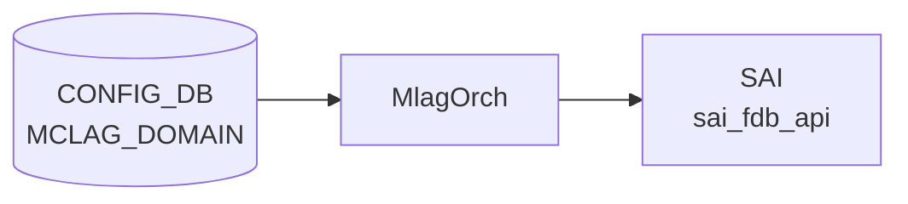

# MCLAG_DOMAIN / MCLAG_INTERFACE / MCLAG_UNIQUE_IP テーブル

## 概要

MC-[LAG](../../reference/glossary.md#term-lag) (Multi-Chassis Link Aggregation) のドメイン設定とメンバー / unique-IP 設定を [CONFIG_DB](../../reference/glossary.md#term-config_db) に保持する 3 テーブル[^1]。`iccpd` (`docker-iccpd`) がこれらを購読し、ICCP セッションと MC-[LAG](../../reference/glossary.md#term-lag) メンバー [LAG](../../reference/glossary.md#term-lag) の同期を制御する。

- `MCLAG_DOMAIN` — 1 ドメインの基本パラメータ（最大 1 エントリ）
- `MCLAG_INTERFACE` — ドメインに紐づく MC-LAG メンバー [PortChannel](../../reference/glossary.md#term-portchannel)
- `MCLAG_UNIQUE_IP` — MC-LAG ピア間で [VLAN](../../reference/glossary.md#term-vlan) インターフェースに **異なる IP** を持たせる対象 [VLAN](../../reference/glossary.md#term-vlan)

<!-- cdb-mermaid -->
### データフロー (自動生成)



!!! note "凡例"
    CONFIG_DB から SAI までの典型経路を `docs/reference/config-db-orch-map.md` から機械生成したミニ図。詳細・例外は本ページ本文と対応表を参照。
<!-- /cdb-mermaid -->

## key 構造

```text
MCLAG_DOMAIN|<domain_id>
MCLAG_INTERFACE|<domain_id>|<if_name>
MCLAG_UNIQUE_IP|<if_name>
```

## MCLAG_DOMAIN フィールド

| フィールド | 型 | デフォルト | 説明 |
|-----------|----|-----------|------|
| `domain_id` (key) | uint16 (1..4095) | — | MC-LAG ドメイン ID |
| `source_ip` | inet:ipv4-address | — | ICCP セッションのソース IP |
| `peer_ip` | inet:ipv4-address | — | ICCP セッションのピア IP |
| `peer_link` | union leafref → `PORT.name` または `PORTCHANNEL.name` | — | ピアリンク（バックアップデータパス） |
| `keepalive_interval` | uint16 (1..60) [秒] | 1 | ICCP keepalive 間隔 |
| `session_timeout` | uint16 (1..3600) [秒] | 30 | ICCP セッションタイムアウト |

**must 制約**: `keepalive_interval * 3 <= session_timeout`

**max-elements: 1** — ドメインは 1 件のみ

## MCLAG_INTERFACE フィールド

| フィールド | 型 | 説明 |
|-----------|----|------|
| `domain_id` (key) | leafref → `MCLAG_DOMAIN.domain_id` | 所属ドメイン |
| `if_name` (key) | leafref → `PORTCHANNEL.name` | MC-LAG メンバー LAG |
| `if_type` | string | プレースホルダ（インスタンス作成用） |

## MCLAG_UNIQUE_IP フィールド

| フィールド | 型 | 説明 |
|-----------|----|------|
| `if_name` (key) | string パターン `Vlan<id>` | unique-ip を許可する [VLAN](../../reference/glossary.md#term-vlan) インターフェース名 |
| `unique_ip` | enum `enable` | 有効化フラグ（無効時はエントリ削除） |

**must 制約**: `MCLAG_DOMAIN_LIST` が少なくとも 1 つ存在すること

[YANG](../../reference/glossary.md#term-yang) コメントによれば、本来 `MCLAG_UNIQUE_IP.if_name` は `VLAN.name` への leafref にしたいが libyang back-links の制約で plain string になっている。

## 購読者

- `iccpd` (`docker-iccpd`) — MC-LAG 制御プレーン
- 間接的に `teamd` ([PortChannel](../../reference/glossary.md#term-portchannel) のメンバー同期)

## 関連 CONFIG_DB / YANG / CLI

- 関連 [CONFIG_DB](../../reference/glossary.md#term-config_db): `PORTCHANNEL`、`PORTCHANNEL_MEMBER`、`VLAN`、`VLAN_INTERFACE`、`PORT`
- 関連 [YANG](../../reference/glossary.md#term-yang): `sonic-mclag`、`sonic-portchannel`、`sonic-port`
- 関連 CLI: `config mclag`

<!-- ref-triangle:start -->

## 関連リファレンス

- [YANG](../../reference/glossary.md#term-yang): [`sonic-mclag`](../yang/sonic-mclag.md)
- CLI: [`config mclag`](../cli/config-mclag.md)

<!-- ref-triangle:end -->

## 引用元

[^1]: YANG 定義: `sonic-mclag.yang`. <https://github.com/sonic-net/sonic-buildimage/blob/9ea932ec2e18f35e58268ec2e4456b1d4afd65cd/src/sonic-yang-models/yang-models/sonic-mclag.yang>

## 関連ページ
- [CONFIG_DB: PORTCHANNEL](portchannel.md)
- [CONFIG_DB: VLAN](vlan.md)

<!-- ops-hint -->
## 運用ヒント

### 典型値

- key 形式: `MCLAG_DOMAIN|<domain-id>` (1..4095)。
- `source_ip` / `peer_ip`: keepalive 用 IP（Loopback 推奨）。
- `peer_link`: `PortChannel0001` 等の ICL/peer-link。
- `mclag_system_mac`: 両 ToR で同一 MAC。

### よくある誤設定

- `mclag_system_mac` を両 ToR で別値にすると [LACP](../../reference/glossary.md#term-lacp) system-id が異なり MC-LAG が組まれない。
- `peer_link` を VLAN trunk にしないと peer 間の MAC 同期が動かない。

### 確認コマンド

```bash
sonic-db-cli CONFIG_DB hgetall 'MCLAG_DOMAIN|1'
mclagdctl -i 1 dump state
show mclag brief
```
<!-- /ops-hint -->

<!-- cdb-exceptions -->
## 例外条件・特殊挙動

<!-- evidence: sonic-swss/mclagsyncd/mclaglink.cpp MclagLink::processCfgMclagDomainTableUpdates / sonic-buildimage/src/sonic-yang-models/yang-models/sonic-mclag.yang -->

- **domain_id が 1-4095 の範囲外**: YANG `range "1..4095"` / `error-message "MCLAG Domain ID out of range"` により拒否される。
- **keepalive_interval が 1-60 の範囲外 (デフォルト 1)**: YANG `range "1..60"` で制約。
- **session_timeout が 1-3600 の範囲外 (デフォルト 30)**: YANG `range "1..3600"` で制約。
- **keepalive_interval × 3 > session_timeout → YANG must 制約違反**: YANG `must "(keepalive_interval * 3) <= session_timeout"` に違反するとバリデーション段階で拒否される。
- **変更差分なし → 重複更新を無視**: `!attrBmap && !attrDelBmap` の場合 `"no change - duplicate update"` を SWSS_LOG_NOTICE してリターン。iccpd への送信は行われない (`mclaglink.cpp` L812)。
- **存在しないドメインの DEL → SWSS_LOG_WARN + スキップ**: `"Domain [%d] deletion - domain not found"` を WARN ログして処理を終了。iccpd へは送信されない (`mclaglink.cpp` L836)。
- **既存エントリへの SET 時の差分更新**: `source_ip`・`peer_ip`・`peer_link` は既存値との差分のみを iccpd へ通知。空文字列で上書きした場合は `MCLAG_CFG_OPER_ATTR_DEL` を発行する (`mclaglink.cpp` L749-L795)。

<!-- value-behavior -->
## 値依存挙動マトリクス

<!-- evidence: sonic-swss/mclagsyncd/mclaglink.cpp / sonic-buildimage/src/sonic-yang-models/yang-models/sonic-mclag.yang -->

| フィールド | 値 | 挙動 |
|-----------|-----|------|
| `keepalive_interval` | 1 (default) | 1秒ごとに ICCP keepalive 送信 |
| `keepalive_interval` | N (1..60) | N 秒ごとに送信。`session_timeout >= N*3` が YANG must 制約で必須 |
| `session_timeout` | 30 (default) | 30秒 ICCP 応答なしでセッション断 |
| `session_timeout` | < keepalive_interval*3 | YANG must 制約違反 → バリデーション拒否 |
| `unique_ip` | `enable` | 当該 VLAN IF に対してピア ToR 間で異なる IP アドレスを許可 |
| `if_type` (MCLAG_INTERFACE) | 任意文字列 | プレースホルダ。実際の制御動作に影響なし (エントリ存在でメンバー登録) |

enum: `unique_ip` = `enable` のみ (無効化はエントリ削除)。
<!-- /value-behavior -->


<!-- runtime-trace -->
## 実コンテナ動作トレース

### 段階 1 — Consumer 登録

`MlagOrch` (orchagent 直接 CFG 購読) + `mclagsyncd` が CONFIG_DB の `MCLAG_DOMAIN` テーブルを購読する。

`MCLAG_DOMAIN` の key は domain ID (例: `1`)。`peer_link` / `peer_ip` / `source_ip` / `session_timeout` 等を保持。

### 段階 2 — CFG→APPL 翻訳

なし (orchagent が直接 CONFIG_DB を購読)

### 段階 3 — APPL→SAI

`sai_fdb_api` (FDB 同期) + `mclagsyncd` が MCLAG ピアとの制御接続を管理

### 段階 4 — タイミングと副作用

**適用タイミング**: orchagent が CONFIG_DB 変化を検知後、MCLAG セッションのネゴシエーションを開始。`mclagsyncd` が ICCP (Inter-Chassis Control Protocol) 接続を確立。非同期で完了。

**副作用**: MCLAG domain の peer IP/source IP 変更は ICCP session reset を引き起こす。ICCP session reset 中は MCLAG で同期していた FDB/ARP が失われる可能性がある。
<!-- /runtime-trace -->

<!-- entry-points -->
## 書き込み入り口 (Direction A)

対象テーブル: `MCLAG_DOMAIN`

### CLI
- `config mclag add/del <domain-id> --local_ip <ip> --peer_ip <ip> --peer_link <port>`
  - ソース: `sonic-utilities/config/mclag.py`

### minigraph / sonic-cfggen
- なし

### REST / gNMI (sonic-mgmt-common)
- sonic-mgmt-common xfmr_mclag.go 経由 (OpenConfig MCLAG)

### db_migrator
- なし

### ビルド時デフォルト (init_cfg / j2 テンプレート)
- なし

### ハードコードデフォルト
- なし

### ランタイム注入 (デーモン自動書き込み)
- なし
<!-- /entry-points -->

<!-- glossary-links-injected: f50d4e92baed -->
