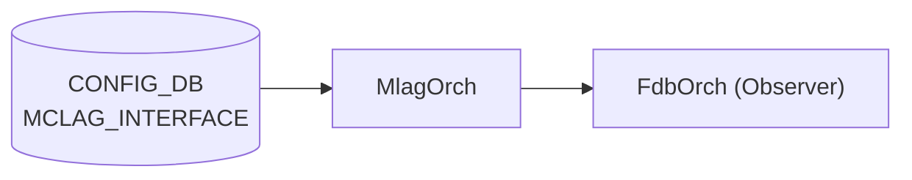

# MCLAG_INTERFACE テーブル

## 概要

MC-[LAG](../../reference/glossary.md#term-lag) (Multi-Chassis Link Aggregation) のドメインに紐づくメンバー [PortChannel](../../reference/glossary.md#term-portchannel) を [CONFIG_DB](../../reference/glossary.md#term-config_db) に保持するテーブル[^1]。`iccpd` (`docker-iccpd`) と `MlagOrch` (orchagent) がこのテーブルを購読し、ICCP セッション経由でメンバー [LAG](../../reference/glossary.md#term-lag) の同期を制御する。

`MCLAG_INTERFACE` は複合 key (`domain_id|if_name`) を使用し、1 ドメインに複数の MC-LAG メンバー PortChannel を登録できる。

<!-- cdb-mermaid -->
### データフロー (自動生成)



!!! note "凡例"
    CONFIG_DB から MlagOrch までの典型経路。MlagOrch は SAI を直接呼ばず、Observer 通知 (`SUBJECT_TYPE_MLAG_INTF_CHANGE`) を broadcast し FdbOrch が FDB フラッシュ制御に利用する。
<!-- /cdb-mermaid -->

## key 構造

```text
MCLAG_INTERFACE|<domain_id>|<if_name>
```

- `domain_id`: MC-LAG ドメイン ID（`MCLAG_DOMAIN` への leafref）
- `if_name`: MC-LAG メンバー PortChannel 名（`PORTCHANNEL` への leafref）

## フィールド

| フィールド | 型 | デフォルト | 説明 |
|-----------|----|-----------|------|
| `domain_id` (key) | leafref → `MCLAG_DOMAIN.domain_id` | — | 所属 MC-LAG ドメイン ID |
| `if_name` (key) | leafref → `PORTCHANNEL.name` | — | MC-LAG メンバー PortChannel 名 |
| `if_type` | string | — | プレースホルダフィールド（インスタンス作成用）。実際の動作制御には使用されない |

CLI `config mclag member add` は `if_type` に `"PortChannel"` を固定値で書き込む（`config/mclag.py:293`）が、`MlagOrch` は `if_type` フィールドを参照しない。

## 購読者

- `MlagOrch` (orchagent) — `doMlagInterfaceTask()` でメンバー登録を処理し、`SUBJECT_TYPE_MLAG_INTF_CHANGE` を broadcast
- `mclagsyncd` — `addDomainCfgDependentSelectables()` により MCLAG_DOMAIN 初回 SET 後に購読開始。iccpd へメンバー情報を転送

## 関連 CONFIG_DB / YANG / CLI

- 関連 [CONFIG_DB](../../reference/glossary.md#term-config_db): `MCLAG_DOMAIN`、`PORTCHANNEL`、`PORTCHANNEL_MEMBER`
- 関連 [YANG](../../reference/glossary.md#term-yang): `sonic-mclag`、`sonic-portchannel`
- 関連 CLI: `config mclag member add/del`

<!-- ref-triangle:start -->

## 関連リファレンス

- [YANG](../../reference/glossary.md#term-yang): [`sonic-mclag`](../yang/sonic-mclag.md)
- CLI: [`config mclag`](../cli/config-mclag.md)
- 親ページ: [MCLAG_DOMAIN / MCLAG_INTERFACE / MCLAG_UNIQUE_IP](mclag-domain.md)

<!-- ref-triangle:end -->

## 引用元

[^1]: YANG 定義: `sonic-mclag.yang`. <https://github.com/sonic-net/sonic-buildimage/blob/9ea932ec2e18f35e58268ec2e4456b1d4afd65cd/src/sonic-yang-models/yang-models/sonic-mclag.yang>

## 関連ページ

- [CONFIG_DB: MCLAG_DOMAIN / MCLAG_INTERFACE / MCLAG_UNIQUE_IP](mclag-domain.md)
- [CONFIG_DB: PORTCHANNEL](portchannel.md)

<!-- ops-hint -->
## 運用ヒント

### 典型値

- key 形式: `MCLAG_INTERFACE|<domain-id>|<portchannel-name>` 例: `MCLAG_INTERFACE|1|PortChannel0001`
- `if_type`: CLI 経由では常に `"PortChannel"` が設定される（値は参照されないが慣例として設定する）。

### よくある誤設定

- MCLAG_DOMAIN が存在しない状態で MCLAG_INTERFACE を書くと YANG バリデーション違反となる。
- 対象 PORTCHANNEL が CONFIG_DB に存在しない状態で書くと leafref 違反となる。
- mclagsyncd は MCLAG_DOMAIN の初回 SET 後にのみ MCLAG_INTERFACE を購読するため、MCLAG_DOMAIN より先に書いた場合は iccpd に通知が届かない。

### 確認コマンド

```bash
sonic-db-cli CONFIG_DB hgetall 'MCLAG_INTERFACE|1|PortChannel0001'
show mclag brief
show mclag interface
```
<!-- /ops-hint -->

<!-- ordering -->
## 書込み順序依存 (Phase B)

<!-- evidence: sonic-swss/orchagent/mlagorch.cpp L45-250 / sonic-swss/mclagsyncd/mclaglink.cpp L814-929 / sonic-buildimage/src/sonic-yang-models/yang-models/sonic-mclag.yang / sonic-utilities/config/mclag.py -->

### 設定順序（追加）

1. **PORT / PORTCHANNEL を先に CONFIG_DB に存在させる**
   - `MCLAG_INTERFACE.if_name` の YANG leafref は `PORTCHANNEL.name` への参照。対象 PortChannel が存在しないと YANG バリデーション拒否。
   - evidence: `sonic-mclag.yang:115-116`

2. **MCLAG_DOMAIN を設定してから MCLAG_INTERFACE を書く**
   - `MCLAG_INTERFACE.domain_id` は `MCLAG_DOMAIN.domain_id` への leafref（YANG 必須）。MCLAG_DOMAIN が 0 件の状態では YANG バリデーション段階で拒否される。
   - CLI `config mclag member add` も `ADHOC_VALIDATION` ブロックで `MCLAG_DOMAIN` エントリ存在を事前チェックし、0 件の場合は `"MCLAG Domain ... not configured"` で中断する。
   - evidence: `sonic-mclag.yang:108-109`, `config/mclag.py:283-286`

3. **MCLAG_DOMAIN の初回 ADD が完了してから MCLAG_INTERFACE を書く（mclagsyncd タイミング）**
   - `mclagsyncd` は MCLAG_DOMAIN の初回 SET が成功した後に初めて MCLAG_INTERFACE テーブルの SubscriberStateTable を生成・Select に追加する（`addDomainCfgDependentSelectables()`）。
   - MCLAG_DOMAIN SET 完了前に MCLAG_INTERFACE を書いても mclagsyncd は購読しておらず、iccpd へのメンバー通知が届かない。
   - evidence: `mclaglink.cpp:814-818`, `mclaglink.cpp:910-921`

4. **allPortsReady() 完了後にエントリが処理される**
   - `MlagOrch::doTask()` L49-52 で全ポート初期化前は即 return。PortsOrch 起動完了が先行必須。
   - MCLAG_INTERFACE エントリはキューに保留され、PortsOrch 起動完了後に一括処理される。
   - evidence: `mlagorch.cpp:49-52`

### 削除順序

| ステップ | 操作 | 理由 |
|---------|------|------|
| 1 | `MCLAG_INTERFACE` を DEL | `domain_id` leafref の dangling 防止 |
| 2 | `MCLAG_DOMAIN` を DEL | MCLAG_INTERFACE DEL 後に実行 |

> CLI `config mclag del <domain_id>` は同ドメインの全 MCLAG_INTERFACE を自動削除してから MCLAG_DOMAIN を削除する（`config/mclag.py:186-199`）。手動で sonic-db-cli を使う場合は上記順序に従うこと。

### 順序依存サマリ

| # | 依存関係 | 強制度 | 緩和策 |
|---|----------|--------|--------|
| 1 | allPortsReady() 完了 → MCLAG_INTERFACE 処理 | 強制 | 自動待機（キュー保留） |
| 2 | PORTCHANNEL 存在 → MCLAG_INTERFACE.if_name | YANG leafref 必須 | PortChannel を先に設定 |
| 3 | MCLAG_DOMAIN 存在 → MCLAG_INTERFACE SET | YANG leafref + CLI チェック必須 | MCLAG_DOMAIN を先に書く |
| 4 | MCLAG_DOMAIN 初回 ADD 完了 → mclagsyncd が MCLAG_INTERFACE 購読開始 | mclagsyncd 内部タイミング | MCLAG_DOMAIN SET 完了後に MCLAG_INTERFACE を書く |
| 5 | MCLAG_INTERFACE DEL → MCLAG_DOMAIN DEL | 推奨（dangling 防止） | CLI del が自動実行 |

> 中間調査ノート: `meta/_intermediate/cdb-flow/mclag-interface-ordering.md`
<!-- /ordering -->

<!-- cross-refs -->
## 暗黙参照マップ (Phase C)

<!-- evidence: sonic-buildimage/src/sonic-yang-models/yang-models/sonic-mclag.yang L108-116 / sonic-swss/orchagent/mlagorch.cpp L49-52,193-231 / sonic-swss/orchagent/fdborch.cpp L1209-1212,1665-1670 / sonic-swss/mclagsyncd/mclaglink.cpp L918,938-941,1512-1633,1811 / sonic-swss-common/common/schema.h L379,441-442 -->

### MCLAG_INTERFACE → 参照先テーブル

| 参照先テーブル / DB | 参照箇所 | 参照種別 |
|---|---|---|
| `PORTCHANNEL` (CONFIG_DB) | `sonic-mclag.yang:115-116` | YANG leafref 必須。`if_name` が `/sonic-portchannel/PORTCHANNEL/PORTCHANNEL_LIST/name` を参照。PortChannel 未存在時は YANG バリデーション拒否 |
| `MCLAG_DOMAIN` (CONFIG_DB) | `sonic-mclag.yang:108-109` | YANG leafref 必須。`domain_id` が `MCLAG_DOMAIN_LIST/domain_id` を参照。MCLAG_DOMAIN 未存在時は YANG バリデーション拒否 |

> `PortsOrch` の `allPortsReady()` も暗黙的な先行条件だが、これは MlagOrch 処理キューの待機メカニズムであり YANG 制約ではない（`mlagorch.cpp:49-52`）。

### MCLAG_INTERFACE ← 参照元（他テーブル / モジュールから参照される）

| 参照元 | 参照方法 | 用途 | evidence |
|---|---|---|---|
| `FdbOrch` (orchagent) | `gMlagOrch->isMlagInterface(port.m_alias)` 直接呼び出し | MCLAG メンバーポートの oper-down 時に FDB フラッシュをスキップ | `fdborch.cpp:1209-1212` |
| `FdbOrch` (orchagent) | `gMlagOrch->isMlagInterface(port.m_alias)` 直接呼び出し | MCLAG 広告 FDB 削除 + ポート down 時に MAC 削除 origin を `FDB_ORIGIN_LEARN` に書き換え | `fdborch.cpp:1665-1670` |
| `mclagsyncd` | `SubscriberStateTable` (`CFG_MCLAG_INTF_TABLE_NAME`) | MCLAG_DOMAIN 初回 SET 後に購読開始し、iccpd へメンバー名を IPC 転送 | `mclaglink.cpp:918,938-941` |
| `config mclag member add/del` (CLI) | `config/mclag.py:283-293` | SET 前に MCLAG_DOMAIN 存在をアドホックチェック。`if_type="PortChannel"` を固定書込み | `mclag.py:283-293` |

### STATE_DB / APPL_DB への副次書込み（MCLAG_INTERFACE 起因）

MCLAG_INTERFACE の SET/DEL を受けた mclagsyncd → iccpd → mclagsyncd IPC 経由で以下のテーブルが書き換わる。

| 書込み先テーブル | DB | キー形式 | 書込みタイミング |
|---|---|---|---|
| `MCLAG_LOCAL_INTF_TABLE` | STATE_DB | `<if_name>` | iccpd からポート分離設定受信時。`port_isolate_peer_link` を true/false で更新 (`mclaglink.cpp:1512-1533`) |
| `MCLAG_REMOTE_INTF_TABLE` | STATE_DB | `<domain_id>\|<if_name>` | iccpd からリモートインターフェース状態受信時。`oper_status` 等を更新 (`mclaglink.cpp:1538-1633`) |
| `ISOLATION_GROUP_TABLE` | APPL_DB | `MCLAG_ISO_GRP` | iccpd からポート分離グループ指示受信時。`TYPE`, `PORTS`, `MEMBERS` を更新 (`mclaglink.cpp:1811`) |

!!! note "副次書込みのタイミング"
    `MCLAG_LOCAL_INTF_TABLE` / `MCLAG_REMOTE_INTF_TABLE` / `ISOLATION_GROUP_TABLE` への書込みは MCLAG_INTERFACE SET 直後ではなく、ICCP セッション確立後の iccpd ネゴシエーション完了を待って行われる。CONFIG_DB 書込み後すぐに STATE_DB を確認しても空の場合がある。

> 中間調査ノート: `meta/_intermediate/cdb-flow/mclag-interface-cross-refs.md`
<!-- /cross-refs -->

<!-- failure -->
## 失敗挙動 (Phase D)

<!-- evidence: sonic-swss/orchagent/mlagorch.cpp L45-250 / sonic-swss/mclagsyncd/mclaglink.cpp L989-1086 / sonic-swss/mclagsyncd/mclagsyncd.cpp L44-124 -->

### MlagOrch 失敗パス（MCLAG_INTERFACE 操作）

| # | トリガー | 箇所 | 動作 | retry |
|---|---------|------|------|-------|
| 1 | 重複 MCLAG_INTERFACE ADD（`m_mlagIntfs` に既存） | `addMlagInterface()` L196-213 | `SWSS_LOG_ERROR("MLAG adds duplicate MLAG interface %s")` + notify なし | なし（`return true` でキューから除去） |
| 2 | 未知 MCLAG_INTERFACE DEL（`m_mlagIntfs` に不在） | `delMlagInterface()` L219-233 | `SWSS_LOG_ERROR("MLAG deletes unknown MLAG interface %s")` + notify なし | なし（`return true` でキューから除去） |
| 3 | 不明な op_type | `doMlagInterfaceTask()` L149-152 | `SWSS_LOG_ERROR("MLAG receives unknown operation type %s")` + erase | なし |
| 4 | `allPortsReady()` 未完了 | `doTask()` L49-52 | 早期 return → エントリをキュー保留 | PortsOrch 起動後に自動再処理（保留であり失敗ではない） |

> `addMlagInterface()` / `delMlagInterface()` はどちらも常に `return true` を返すため、エラーが発生してもエントリはキューから除去される（再試行なし）。失敗は syslog のみ記録される。

### mclagsyncd 失敗パス（MCLAG_INTERFACE → iccpd IPC）

| # | トリガー | 箇所 | 動作 | retry |
|---|---------|------|------|-------|
| 5 | キーから `<if_name>` 部が空 | `mclagsyncdSendMclagIfaceCfg()` L1022-1027 | `SWSS_LOG_ERROR("Invalid Key %s Format. No mclag iface specified")` + `continue` でエントリスキップ | なし |
| 6 | iccpd への IPC 書き込み失敗（バッファ中間送信） | `mclagsyncdSendMclagIfaceCfg()` L1055-1060 | `SWSS_LOG_ERROR("...buffer full; write to m_connection_socket failed")` | なし（残バッファは継続処理） |
| 7 | iccpd への IPC 書き込み失敗（最終送信） | `mclagsyncdSendMclagIfaceCfg()` L1078-1084 | `SWSS_LOG_ERROR("mclagsycnd to ICCPD, mclag iface cfg send; write to m_connection_socket failed")` | なし（iccpd はメンバー情報を受け取れず ICCP 不完全） |

### IPC 接続断・再接続時の自動リカバリ

`mclagsyncd.cpp` の外側 `while(1)` ループは iccpd との接続断 (`MclagConnectionClosedException`) を捕捉して再接続を行う。再接続後は `mclagsyncdFetchMclagInterfaceConfigFromConfigdb()` を呼び、CONFIG_DB の全 MCLAG_INTERFACE エントリを再読み込みして iccpd へ再送信する。

- MCLAG_INTERFACE の IPC 送信失敗は iccpd 再起動 / 接続断で自動回復する
- evidence: `mclagsyncd.cpp:57-58,112-115`

!!! warning "malformed メッセージ受信時は mclagsyncd プロセスが終了"
    iccpd から malformed メッセージ（`mclag_msg_ok()` 検証失敗）を受信すると `system_error` が throw され、`catch (const exception& e)` ブロックで `return 0` → mclagsyncd プロセス終了となる。`MclagConnectionClosedException` と異なり **while(1) で再接続しない**。systemd が mclagsyncd を restart する。
    evidence: `mclagsyncd.cpp:116-120`, `mclaglink.cpp:1901-1902`

### STATE_DB / ERROR_TABLE への記録

- `MlagOrch` は STATE_DB / ERROR_TABLE への書き込みを行わない。失敗はすべて syslog (`SWSS_LOG_ERROR`) のみ
- `mclagsyncd` も MCLAG_INTERFACE 処理失敗時は STATE_DB を更新しない（STATE_DB への書き込みは iccpd からの応答受信後に行われるため、iccpd への送信に失敗した場合は STATE_DB も更新されない）

```bash
# orchagent ログで MCLAG_INTERFACE 失敗確認
docker exec swss grep -i "MLAG" /var/log/swss/orchagent.log

# mclagsyncd ログ確認
docker exec iccpd grep -i "mclag iface" /var/log/swss/mclagsyncd.log
```

> 中間調査ノート: `meta/_intermediate/cdb-flow/mclag-interface-failure.md`
<!-- /failure -->
