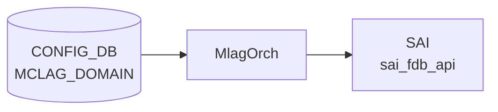

# MCLAG_INTERFACE テーブル

## 概要

MC-[LAG](../../reference/glossary.md#term-lag) (Multi-Chassis Link Aggregation) のドメインに紐づくメンバー [PortChannel](../../reference/glossary.md#term-portchannel) を [CONFIG_DB](../../reference/glossary.md#term-config_db) に保持するテーブル[^1]。`iccpd` (`docker-iccpd`) と `MlagOrch` ([orchagent](../../reference/glossary.md#term-orchagent)) がこのテーブルを購読し、ICCP セッション経由でメンバー [LAG](../../reference/glossary.md#term-lag) の同期を制御する。

`MCLAG_INTERFACE` は複合 key (`domain_id|if_name`) を使用し、1 ドメインに複数の MC-[LAG](../../reference/glossary.md#term-lag) メンバー [PortChannel](../../reference/glossary.md#term-portchannel) を登録できる。

<!-- cdb-mermaid -->
### データフロー (自動生成)



!!! note "凡例"
    CONFIG_DB から SAI までの典型経路を `docs/reference/config-db-orch-map.md` から機械生成したミニ図。詳細・例外は本ページ本文と対応表を参照。
<!-- /cdb-mermaid -->

## key 構造

```text
MCLAG_INTERFACE|<domain_id>|<if_name>
```

- `domain_id`: MC-LAG ドメイン ID（`MCLAG_DOMAIN` への leafref）
- `if_name`: MC-LAG メンバー [PortChannel](../../reference/glossary.md#term-portchannel) 名（`PORTCHANNEL` への leafref）

## フィールド

| フィールド | 型 | デフォルト | 説明 |
|-----------|----|-----------|------|
| `domain_id` (key) | leafref → `MCLAG_DOMAIN.domain_id` | — | 所属 MC-LAG ドメイン ID |
| `if_name` (key) | leafref → `PORTCHANNEL.name` | — | MC-LAG メンバー PortChannel 名 |
| `if_type` | string | — | プレースホルダフィールド（インスタンス作成用）。実際の動作制御には使用されない |

CLI `config mclag member add` は `if_type` に `"PortChannel"` を固定値で書き込む（`config/mclag.py:293`）が、`MlagOrch` は `if_type` フィールドを参照しない。

## 購読者

- `MlagOrch` ([orchagent](../../reference/glossary.md#term-orchagent)) — `doMlagInterfaceTask()` でメンバー登録を処理し、`SUBJECT_TYPE_MLAG_INTF_CHANGE` を broadcast
- `mclagsyncd` — `addDomainCfgDependentSelectables()` により MCLAG_DOMAIN 初回 SET 後に購読開始。iccpd へメンバー情報を転送

## 関連 CONFIG_DB / YANG / CLI

- 関連 [CONFIG_DB](../../reference/glossary.md#term-config_db): `MCLAG_DOMAIN`、`PORTCHANNEL`、`PORTCHANNEL_MEMBER`
- 関連 [YANG](../../reference/glossary.md#term-yang): `sonic-mclag`、`sonic-portchannel`
- 関連 CLI: `config mclag member add/del`

<!-- ref-triangle:start -->

## 関連リファレンス

- [YANG](../../reference/glossary.md#term-yang): [`sonic-mclag`](../yang/sonic-mclag.md)
- CLI: [`config mclag`](../cli/config-mclag.md)
- 親ページ: [MCLAG_DOMAIN / MCLAG_INTERFACE / MCLAG_UNIQUE_IP](mclag-domain.md)

<!-- ref-triangle:end -->

## 引用元

[^1]: [YANG](../../reference/glossary.md#term-yang) 定義: `sonic-mclag.yang`. <https://github.com/sonic-net/sonic-buildimage/blob/9ea932ec2e18f35e58268ec2e4456b1d4afd65cd/src/sonic-yang-models/yang-models/sonic-mclag.yang>

## 関連ページ

- [CONFIG_DB: MCLAG_DOMAIN / MCLAG_INTERFACE / MCLAG_UNIQUE_IP](mclag-domain.md)
- [CONFIG_DB: PORTCHANNEL](portchannel.md)

<!-- ops-hint -->
## 運用ヒント

### 典型値

- key 形式: `MCLAG_INTERFACE|<domain-id>|<portchannel-name>` 例: `MCLAG_INTERFACE|1|PortChannel0001`
- `if_type`: CLI 経由では常に `"PortChannel"` が設定される（値は参照されないが慣例として設定する）。

### よくある誤設定

- MCLAG_DOMAIN が存在しない状態で MCLAG_INTERFACE を書くと YANG バリデーション違反となる。
- 対象 PORTCHANNEL が [CONFIG_DB](../../reference/glossary.md#term-config_db) に存在しない状態で書くと leafref 違反となる。
- mclagsyncd は MCLAG_DOMAIN の初回 SET 後にのみ MCLAG_INTERFACE を購読するため、MCLAG_DOMAIN より先に書いた場合は iccpd に通知が届かない。

### 確認コマンド

```bash
sonic-db-cli CONFIG_DB hgetall 'MCLAG_INTERFACE|1|PortChannel0001'
show mclag brief
show mclag interface
```
<!-- /ops-hint -->

<!-- ordering -->
## 書込み順序依存 (Phase B)

<!-- evidence: sonic-swss/orchagent/mlagorch.cpp L45-250 / sonic-swss/mclagsyncd/mclaglink.cpp L814-929 / sonic-buildimage/src/sonic-yang-models/yang-models/sonic-mclag.yang / sonic-utilities/config/mclag.py -->

### 設定順序（追加）

1. **PORT / PORTCHANNEL を先に CONFIG_DB に存在させる**
   - `MCLAG_INTERFACE.if_name` の YANG leafref は `PORTCHANNEL.name` への参照。対象 PortChannel が存在しないと YANG バリデーション拒否。
   - evidence: `sonic-mclag.yang:115-116`

2. **MCLAG_DOMAIN を設定してから MCLAG_INTERFACE を書く**
   - `MCLAG_INTERFACE.domain_id` は `MCLAG_DOMAIN.domain_id` への leafref（YANG 必須）。MCLAG_DOMAIN が 0 件の状態では YANG バリデーション段階で拒否される。
   - CLI `config mclag member add` も `ADHOC_VALIDATION` ブロックで `MCLAG_DOMAIN` エントリ存在を事前チェックし、0 件の場合は `"MCLAG Domain ... not configured"` で中断する。
   - evidence: `sonic-mclag.yang:108-109`, `config/mclag.py:283-286`

3. **MCLAG_DOMAIN の初回 ADD が完了してから MCLAG_INTERFACE を書く（mclagsyncd タイミング）**
   - `mclagsyncd` は MCLAG_DOMAIN の初回 SET が成功した後に初めて MCLAG_INTERFACE テーブルの SubscriberStateTable を生成・Select に追加する（`addDomainCfgDependentSelectables()`）。
   - MCLAG_DOMAIN SET 完了前に MCLAG_INTERFACE を書いても mclagsyncd は購読しておらず、iccpd へのメンバー通知が届かない。
   - evidence: `mclaglink.cpp:814-818`, `mclaglink.cpp:910-921`

4. **allPortsReady() 完了後にエントリが処理される**
   - `MlagOrch::doTask()` L49-52 で全ポート初期化前は即 return。PortsOrch 起動完了が先行必須。
   - MCLAG_INTERFACE エントリはキューに保留され、PortsOrch 起動完了後に一括処理される。
   - evidence: `mlagorch.cpp:49-52`

### 削除順序

| ステップ | 操作 | 理由 |
|---------|------|------|
| 1 | `MCLAG_INTERFACE` を DEL | `domain_id` leafref の dangling 防止 |
| 2 | `MCLAG_DOMAIN` を DEL | MCLAG_INTERFACE DEL 後に実行 |

> CLI `config mclag del <domain_id>` は同ドメインの全 MCLAG_INTERFACE を自動削除してから MCLAG_DOMAIN を削除する（`config/mclag.py:186-199`）。手動で sonic-db-cli を使う場合は上記順序に従うこと。

### 順序依存サマリ

| # | 依存関係 | 強制度 | 緩和策 |
|---|----------|--------|--------|
| 1 | allPortsReady() 完了 → MCLAG_INTERFACE 処理 | 強制 | 自動待機（キュー保留） |
| 2 | PORTCHANNEL 存在 → MCLAG_INTERFACE.if_name | YANG leafref 必須 | PortChannel を先に設定 |
| 3 | MCLAG_DOMAIN 存在 → MCLAG_INTERFACE SET | YANG leafref + CLI チェック必須 | MCLAG_DOMAIN を先に書く |
| 4 | MCLAG_DOMAIN 初回 ADD 完了 → mclagsyncd が MCLAG_INTERFACE 購読開始 | mclagsyncd 内部タイミング | MCLAG_DOMAIN SET 完了後に MCLAG_INTERFACE を書く |
| 5 | MCLAG_INTERFACE DEL → MCLAG_DOMAIN DEL | 推奨（dangling 防止） | CLI del が自動実行 |

> 中間調査ノート: `meta/_intermediate/cdb-flow/mclag-interface-ordering.md`
<!-- /ordering -->

<!-- constants -->
## ハードコード定数 (Phase E)

<!-- evidence: sonic-swss/mclagsyncd/mclaglink.h / sonic-swss/mclagsyncd/mclag.h / sonic-utilities/config/mclag.py -->

### mclagsyncd 内定数

`mclagsyncd` が MCLAG_INTERFACE エントリを iccpd へ転送する際、以下の定数が適用される。

| 定数 | 値 | 用途 | ソース |
|---|---|---|---|
| `MAX_L_PORT_NAME` | `20` (バイト) | `mclag_iface_cfg_info.mclag_iface[]` 配列長。PortChannel 名の転送上限 | `mclaglink.h:52` |
| `MCLAG_MAX_SEND_MSG_LEN` | `4096` バイト | mclagsyncd → iccpd 間 IPC 送信バッファ上限。1 メッセージに格納できるインターフェース設定数はこの上限に依存 | `mclag.h:62` |
| `MCLAG_PROTO_VERSION` | `1` | IPC プロトコルバージョン（固定値。変更不可） | `mclag.h:81` |

> **実運用上の注意**: `MAX_L_PORT_NAME = 20` は null 終端を含む配列長のため、実効上限は **19 バイト**。`PortChannel` (11 文字) + 数字部分 4 桁 = 最大 15 文字 (`CFG_PORTCHANNEL_NAME_TOTAL_LEN_MAX = 15`) のため通常の PortChannel 名は範囲内。しかし `strncpy` による無言切り捨てを防ぐため、カスタム名で長い場合は注意が必要。

### CLI 側定数（config/mclag.py）

| 定数 | 値 | 用途 | ソース |
|---|---|---|---|
| `CFG_PORTCHANNEL_PREFIX` | `"PortChannel"` | `if_name` として許可する名前プレフィックス。これ以外のプレフィックスは CLI が拒否 | `config/mclag.py:10` |
| `CFG_PORTCHANNEL_PREFIX_LEN` | `11` | プレフィックス文字数（`"PortChannel"` の長さ） | `config/mclag.py:11` |
| `CFG_PORTCHANNEL_MAX_VAL` | `9999` | PortChannel 番号の最大値（`PortChannel0`〜`PortChannel9999`） | `config/mclag.py:12` |
| `CFG_PORTCHANNEL_NAME_TOTAL_LEN_MAX` | `15` | PortChannel 名の最大文字数（`PortChannel9999` = 15 文字） | `config/mclag.py:13` |
| `if_type` 固定値 | `"PortChannel"` | `config mclag member add` が MCLAG_INTERFACE エントリに書き込む `if_type` の値。`MlagOrch` はこの値を参照しないが、CLI は常に固定で書き込む | `config/mclag.py:293` |

<!-- evidence:
source: sonic-swss/mclagsyncd/mclaglink.h#L52 (sha: 4305596156d70e9797e8a881b3d19b46de0bce0d)
excerpt: |
  #define MAX_L_PORT_NAME 20
  struct mclag_iface_cfg_info {
      int op_type;
      int domain_id;
      char mclag_iface[MAX_L_PORT_NAME];
  };
reasoning: mclag_iface[] の配列長が MAX_L_PORT_NAME=20 で固定されているため、MCLAG_INTERFACE の if_name (PortChannel 名) は 19 バイトを超えると iccpd 転送時に無言切り捨てされる。通常の命名規則 (CFG_PORTCHANNEL_NAME_TOTAL_LEN_MAX=15) では問題ないが、カスタムポート名を使う場合は要注意。
-->

<!-- evidence-rendered:start -->
??? note "📋 検証エビデンス: sonic-swss/mclagsyncd/mclaglink.h#L52 (sha: 4305596156d70e9797e8a881b3d19b46de0bce0d)"

    **出典**:

    `sonic-swss/mclagsyncd/mclaglink.h#L52 (sha: 4305596156d70e9797e8a881b3d19b46de0bce0d)`

    **抜粋**:

    ```text
    #define MAX_L_PORT_NAME 20
    struct mclag_iface_cfg_info {
        int op_type;
        int domain_id;
        char mclag_iface[MAX_L_PORT_NAME];
    };
    ```

    **判断根拠**: mclag_iface[] の配列長が MAX_L_PORT_NAME=20 で固定されているため、MCLAG_INTERFACE の if_name (PortChannel 名) は 19 バイトを超えると iccpd 転送時に無言切り捨てされる。通常の命名規則 (CFG_PORTCHANNEL_NAME_TOTAL_LEN_MAX=15) では問題ないが、カスタムポート名を使う場合は要注意。

<!-- evidence-rendered:end -->

<!-- evidence:
source: sonic-utilities/config/mclag.py#L10-L14 (sha: a3e5b4c9fb7a95e213d08f8761e6c94f02a18b41)
excerpt: |
  CFG_PORTCHANNEL_PREFIX = "PortChannel"
  CFG_PORTCHANNEL_PREFIX_LEN = 11
  CFG_PORTCHANNEL_MAX_VAL = 9999
  CFG_PORTCHANNEL_NAME_TOTAL_LEN_MAX = 15
  CFG_PORTCHANNEL_NO="<0-9999>"
reasoning: CLI レベルで MCLAG_INTERFACE の if_name に設定できる PortChannel 名を上記定数で厳格に制限している。YANG leafref は名前の形式を検証しないが、CLI はこれらの定数で事前フィルタする。
-->

<!-- evidence-rendered:start -->
??? note "📋 検証エビデンス: sonic-utilities/config/mclag.py#L10-L14 (sha: a3e5b4c9fb7a95e213d08f8761e6c94f02a18b41)"

    **出典**:

    `sonic-utilities/config/mclag.py#L10-L14 (sha: a3e5b4c9fb7a95e213d08f8761e6c94f02a18b41)`

    **抜粋**:

    ```text
    CFG_PORTCHANNEL_PREFIX = "PortChannel"
    CFG_PORTCHANNEL_PREFIX_LEN = 11
    CFG_PORTCHANNEL_MAX_VAL = 9999
    CFG_PORTCHANNEL_NAME_TOTAL_LEN_MAX = 15
    CFG_PORTCHANNEL_NO="<0-9999>"
    ```

    **判断根拠**: CLI レベルで MCLAG_INTERFACE の if_name に設定できる PortChannel 名を上記定数で厳格に制限している。YANG leafref は名前の形式を検証しないが、CLI はこれらの定数で事前フィルタする。

<!-- evidence-rendered:end -->

<!-- /constants -->

<!-- cross-refs -->
## 暗黙参照マップ (Phase C)

<!-- evidence: sonic-buildimage/src/sonic-yang-models/yang-models/sonic-mclag.yang L108-116 / sonic-swss/orchagent/mlagorch.cpp L49-52,193-231 / sonic-swss/orchagent/fdborch.cpp L1209-1212,1665-1670 / sonic-swss/mclagsyncd/mclaglink.cpp L918,938-941,1512-1633,1811 / sonic-swss-common/common/schema.h L379,441-442 -->

### MCLAG_INTERFACE → 参照先テーブル

| 参照先テーブル / DB | 参照箇所 | 参照種別 |
|---|---|---|
| `PORTCHANNEL` (CONFIG_DB) | `sonic-mclag.yang:115-116` | YANG leafref 必須。`if_name` が `/sonic-portchannel/PORTCHANNEL/PORTCHANNEL_LIST/name` を参照。PortChannel 未存在時は YANG バリデーション拒否 |
| `MCLAG_DOMAIN` (CONFIG_DB) | `sonic-mclag.yang:108-109` | YANG leafref 必須。`domain_id` が `MCLAG_DOMAIN_LIST/domain_id` を参照。MCLAG_DOMAIN 未存在時は YANG バリデーション拒否 |

> `PortsOrch` の `allPortsReady()` も暗黙的な先行条件だが、これは MlagOrch 処理キューの待機メカニズムであり YANG 制約ではない（`mlagorch.cpp:49-52`）。

### MCLAG_INTERFACE ← 参照元（他テーブル / モジュールから参照される）

| 参照元 | 参照方法 | 用途 | evidence |
|---|---|---|---|
| `FdbOrch` ([orchagent](../../reference/glossary.md#term-orchagent)) | `gMlagOrch->isMlagInterface(port.m_alias)` 直接呼び出し | [MCLAG](../../reference/glossary.md#term-mclag) メンバーポートの oper-down 時に [FDB](../../reference/glossary.md#term-fdb) フラッシュをスキップ | `fdborch.cpp:1209-1212` |
| `FdbOrch` (orchagent) | `gMlagOrch->isMlagInterface(port.m_alias)` 直接呼び出し | [MCLAG](../../reference/glossary.md#term-mclag) 広告 [FDB](../../reference/glossary.md#term-fdb) 削除 + ポート down 時に MAC 削除 origin を `FDB_ORIGIN_LEARN` に書き換え | `fdborch.cpp:1665-1670` |
| `mclagsyncd` | `SubscriberStateTable` (`CFG_MCLAG_INTF_TABLE_NAME`) | MCLAG_DOMAIN 初回 SET 後に購読開始し、iccpd へメンバー名を IPC 転送 | `mclaglink.cpp:918,938-941` |
| `config mclag member add/del` (CLI) | `config/mclag.py:283-293` | SET 前に MCLAG_DOMAIN 存在をアドホックチェック。`if_type="PortChannel"` を固定書込み | `mclag.py:283-293` |

### STATE_DB / APPL_DB への副次書込み（MCLAG_INTERFACE 起因）

MCLAG_INTERFACE の SET/DEL を受けた mclagsyncd → iccpd → mclagsyncd IPC 経由で以下のテーブルが書き換わる。

| 書込み先テーブル | DB | キー形式 | 書込みタイミング |
|---|---|---|---|
| `MCLAG_LOCAL_INTF_TABLE` | [STATE_DB](../../reference/glossary.md#term-state_db) | `<if_name>` | iccpd からポート分離設定受信時。`port_isolate_peer_link` を true/false で更新 (`mclaglink.cpp:1512-1533`) |
| `MCLAG_REMOTE_INTF_TABLE` | [STATE_DB](../../reference/glossary.md#term-state_db) | `<domain_id>\|<if_name>` | iccpd からリモートインターフェース状態受信時。`oper_status` 等を更新 (`mclaglink.cpp:1538-1633`) |
| `ISOLATION_GROUP_TABLE` | [APPL_DB](../../reference/glossary.md#term-appl_db) | `MCLAG_ISO_GRP` | iccpd からポート分離グループ指示受信時。`TYPE`, `PORTS`, `MEMBERS` を更新 (`mclaglink.cpp:1811`) |

!!! note "副次書込みのタイミング"
    `MCLAG_LOCAL_INTF_TABLE` / `MCLAG_REMOTE_INTF_TABLE` / `ISOLATION_GROUP_TABLE` への書込みは MCLAG_INTERFACE SET 直後ではなく、ICCP セッション確立後の iccpd ネゴシエーション完了を待って行われる。CONFIG_DB 書込み後すぐに STATE_DB を確認しても空の場合がある。

> 中間調査ノート: `meta/_intermediate/cdb-flow/mclag-interface-cross-refs.md`
<!-- /cross-refs -->

<!-- failure -->
## 失敗挙動マトリクス (Phase D)

<!-- evidence: sonic-swss/orchagent/mlagorch.cpp L45-52,136-155,193-234 / sonic-swss/mclagsyncd/mclaglink.cpp L918-960,989-1085 / sonic-swss/mclagsyncd/mclagsyncd.cpp L44-124 -->

`MCLAG_INTERFACE` の SET/DEL を処理する 2 つの Consumer（`MlagOrch` と `mclagsyncd`）それぞれの失敗経路を整理する。

### MlagOrch (orchagent) の失敗経路

| # | 失敗条件 | 発生箇所 | 結果 | retry |
|---|---------|---------|------|-------|
| 1 | `allPortsReady()` 未完了 | `mlagorch.cpp:49-52` | 即 `return`。エントリはキューに保留 | あり（PortsOrch 起動完了後に自動処理） |
| 2 | 不明 operation type（SET / DEL 以外） | `mlagorch.cpp:148-151` | `SWSS_LOG_ERROR` + エントリ erase（ドロップ） | なし |
| 3 | 重複 SET（既登録 if_name を再 SET） | `mlagorch.cpp:196-213` | `SWSS_LOG_ERROR("MLAG adds duplicate MLAG interface")` のみ。`m_mlagIntfs` 変更・Observer 通知なし。エントリは erase される | なし |
| 4 | 未知 if_name の DEL（未登録 if_name を DEL） | `mlagorch.cpp:219-233` | `SWSS_LOG_ERROR("MLAG deletes unknown MLAG interface")` のみ。エントリは erase される | なし |

`addMlagInterface()` / `delMlagInterface()` はどちらも常に `return true` を返す設計であるため、orchagent 側は **retry ループに入らない**。エラーが発生してもエントリは即座に erase され、再試行されない。

### mclagsyncd の失敗経路

| # | 失敗条件 | 発生箇所 | 結果 | retry |
|---|---------|---------|------|-------|
| 5 | MCLAG_DOMAIN が未 SET の状態で MCLAG_INTERFACE を書く | `mclaglink.cpp:918`（購読テーブル未生成） | `mclagsyncd` は MCLAG_INTERFACE を購読していないため**完全に無視**（エラーログなし） | なし（ICCP セッション再確立後に iccpd が再 fetch） |
| 6 | key の `<if_name>` 部分が空 | `mclaglink.cpp:1022-1027` | `SWSS_LOG_ERROR("Invalid Key ... No mclag iface specified")` → `continue` で当該エントリをスキップ | なし |
| 7 | iccpd 向け IPC `write()` 失敗（バッファ中間送信） | `mclaglink.cpp:1055-1060` | `SWSS_LOG_ERROR` のみ。デーモン継続 | なし（残バッファは継続処理） |
| 8 | iccpd 向け IPC `write()` 失敗（最終送信） | `mclaglink.cpp:1078-1084` | `SWSS_LOG_ERROR` のみ。iccpd への MCLAG_INTERFACE 通知が欠落 | なし（ICCP セッション再確立時に再 fetch） |
| 9 | iccpd からの malformed メッセージ受信 | `mclaglink.cpp:1901-1902` | `system_error` throw → mclagsyncd プロセス終了 (`return 0`) | systemd による restart |

### IPC 接続断・再接続時の自動リカバリ

`mclagsyncd.cpp` の外側 `while(1)` ループは iccpd との接続断 (`MclagConnectionClosedException`) を捕捉して再接続する。再接続後は `mclagsyncdFetchMclagInterfaceConfigFromConfigdb()` を呼び、CONFIG_DB の全 MCLAG_INTERFACE エントリを再読み込みして iccpd へ再送信する（evidence: `mclagsyncd.cpp:57-58,112-115`）。

ケース #7〜#8（IPC 送信失敗）は iccpd 再起動 / 接続断で自動回復する。ケース #9（malformed メッセージ）は `MclagConnectionClosedException` と異なり while(1) で再接続せず、systemd が mclagsyncd を restart する。

### 失敗後の復旧パス

- **ケース #1 (allPortsReady 未完了)**: エントリは orchagent の Consumer キューに残り、PortsOrch 起動完了後の次回 `doTask()` 呼び出しで自動処理される。
- **ケース #2〜#4 (MlagOrch 側エラー)**: エントリは erase されて失われる。再設定には CLI または sonic-db-cli での再 SET が必要。
- **ケース #5 (mclagsyncd 購読未開始)**: MCLAG_DOMAIN を SET してから MCLAG_INTERFACE を再 SET することで解消。
- **ケース #6〜#8 (mclagsyncd IPC 失敗)**: ICCP セッションが再確立されると CONFIG_DB を全量再 fetch して iccpd に送信する。

!!! warning "silent drop に注意"
    ケース #5（MCLAG_DOMAIN 未設定時の MCLAG_INTERFACE 書込）はエラーログが一切出力されず、mclagsyncd 側で完全に無視される。`show mclag interface` で期待したエントリが出ない場合は MCLAG_DOMAIN の存在確認と mclagsyncd ログの確認を行うこと。

### STATE_DB / ERROR_TABLE への記録

`MlagOrch` は [STATE_DB](../../reference/glossary.md#term-state_db) / ERROR_TABLE への書き込みを行わない。失敗はすべて syslog (`SWSS_LOG_ERROR`) のみ。`mclagsyncd` も MCLAG_INTERFACE 処理失敗時は STATE_DB を更新しない（STATE_DB への書き込みは iccpd からの応答受信後に行われるため、iccpd への送信に失敗した場合は STATE_DB も更新されない）。

```bash
# orchagent ログで MCLAG_INTERFACE 失敗確認
docker exec swss grep -i "MLAG" /var/log/swss/orchagent.log

# mclagsyncd ログ確認
docker exec iccpd grep -i "mclag iface" /var/log/swss/mclagsyncd.log
```

> 中間調査ノート: `meta/_intermediate/cdb-flow/mclag-interface-failure.md`
<!-- /failure -->

<!-- side-effects -->
## 副次 DB 書込 (Phase F)

<!-- evidence: sonic-swss/mclagsyncd/mclaglink.cpp L66,L423,L429,L1509-1533,L1538-1633 / sonic-swss/orchagent/mlagorch.cpp L193-234 / sonic-swss-common/common/schema.h L440-443 -->

CONFIG_DB `MCLAG_INTERFACE` の SET/DEL を受けた `MlagOrch` および `mclagsyncd` が副次的に書き込む DB エントリの一覧。

### MlagOrch (orchagent) の副次書込

`MlagOrch::addMlagInterface()` / `delMlagInterface()` は内部マップ (`m_mlagIntfs`) の更新と `SUBJECT_TYPE_MLAG_INTF_CHANGE` Observer 通知のみを行う。STATE_DB / [APPL_DB](../../reference/glossary.md#term-appl_db) / [COUNTERS_DB](../../reference/glossary.md#term-counters_db) への直接書込は **0 件**（`mlagorch.cpp` に `state_db` / `appl_db` / `counters_db` への書込呼出なし）。

### mclagsyncd の副次書込

`mclagsyncd` は MCLAG_INTERFACE の SET/DEL を受けて iccpd へ IPC 通知を送信し、iccpd との ICCP ネゴシエーション完了後に以下の STATE_DB テーブルを更新する。

| 副次 DB | テーブル | キー形式 | 書込フィールド | 書込タイミング | ソース |
|---|---|---|---|---|---|
| STATE_DB | `MCLAG_LOCAL_INTF_TABLE` | `<if_name>` | `port_isolate_peer_link = true\|false` | iccpd からポート分離設定受信時 (`setLocalIfPortIsolate()`) | `mclaglink.cpp:L1520` |
| STATE_DB | `MCLAG_LOCAL_INTF_TABLE` | `<if_name>` | — (del) | iccpd からローカル IF 削除通知受信時 (`deleteLocalIfPortIsolate()`) | `mclaglink.cpp:L1533` |
| STATE_DB | `MCLAG_REMOTE_INTF_TABLE` | `<mlag_id>\|<if_name>` | `oper_status = up\|down` | iccpd からリモート IF 状態通知受信時 (`mclagsyncdSetRemoteIfState()`) | `mclaglink.cpp:L1584` |
| STATE_DB | `MCLAG_REMOTE_INTF_TABLE` | `<mlag_id>\|<if_name>` | — (del) | iccpd からリモート IF 削除通知受信時 (`mclagsyncdDelRemoteIfInfo()`) | `mclaglink.cpp:L1633` |
| [APPL_DB](../../reference/glossary.md#term-appl_db) | `FLUSHFDBREQUEST` (通知チャネル) | — | `ALL` | ICCP セッション確立直後の [FDB](../../reference/glossary.md#term-fdb) フラッシュ要求 | `mclaglink.cpp:L423,L429` |

### 副次書込なし

| DB | 根拠 |
|---|---|
| [COUNTERS_DB](../../reference/glossary.md#term-counters_db) | `p_counters_db->hgetall("COUNTERS_PORT_NAME_MAP")` (`mclaglink.cpp:L66`) は **読取専用**。書込呼出なし |
| [ASIC_DB](../../reference/glossary.md#term-asic_db) | `MlagOrch` から [SAI](../../reference/glossary.md#term-sai) 直接呼出なし。FDB 削除などは `FdbOrch` Observer 経由（間接） |
| [FLEX_COUNTER_DB](../../reference/glossary.md#term-flex_counter_db) | MCLAG_INTERFACE には [FlexCounter](../../reference/glossary.md#term-flexcounter) 登録なし |

!!! note "副次書込のタイミング"
    STATE_DB (`MCLAG_LOCAL_INTF_TABLE` / `MCLAG_REMOTE_INTF_TABLE`) への書込は CONFIG_DB `MCLAG_INTERFACE` SET 直後ではなく、ICCP セッション確立後の iccpd ネゴシエーション完了を待って行われる。`sonic-db-cli CONFIG_DB hset 'MCLAG_INTERFACE|...'` 実行直後に `sonic-db-cli STATE_DB hgetall 'MCLAG_LOCAL_INTF_TABLE|...'` を確認しても空の場合がある。`show mclag interface` コマンドで ICCP ネゴシエーション完了後の状態を確認すること。

<!-- evidence:
source: sonic-swss/mclagsyncd/mclaglink.cpp#L1509-1533 (sha: 4305596156d70e9797e8a881b3d19b46de0bce0d)
excerpt: |
  /* Set local interface portisolate field enable/disable in the
   * STATE_MCLAG_LOCAL_INTF_TABLE. */
  void MclagLink::setLocalIfPortIsolate(std::string mclag_if, bool is_enable) {
      ...
      fvVector.push_back(make_pair("port_isolate_peer_link", is_enable ? "true" : "false"));
      p_mclag_local_intf_tbl->set(key, fvVector);
  }
  void MclagLink::deleteLocalIfPortIsolate(std::string mclag_if) {
      p_mclag_local_intf_tbl->del(mclag_if);
  }
reasoning: MCLAG_INTERFACE の SET/DEL に応じて iccpd が port-isolation 設定を mclagsyncd に返送し、STATE_DB MCLAG_LOCAL_INTF_TABLE を更新する。
-->

<!-- evidence-rendered:start -->
??? note "📋 検証エビデンス: sonic-swss/mclagsyncd/mclaglink.cpp#L1509-1533 (sha: 4305596156d70e9797e8a881b3d19b46de0bce0d)"

    **出典**:

    `sonic-swss/mclagsyncd/mclaglink.cpp#L1509-1533 (sha: 4305596156d70e9797e8a881b3d19b46de0bce0d)`

    **抜粋**:

    ```text
    /* Set local interface portisolate field enable/disable in the
     * STATE_MCLAG_LOCAL_INTF_TABLE. */
    void MclagLink::setLocalIfPortIsolate(std::string mclag_if, bool is_enable) {
        ...
        fvVector.push_back(make_pair("port_isolate_peer_link", is_enable ? "true" : "false"));
        p_mclag_local_intf_tbl->set(key, fvVector);
    }
    void MclagLink::deleteLocalIfPortIsolate(std::string mclag_if) {
        p_mclag_local_intf_tbl->del(mclag_if);
    }
    ```

    **判断根拠**: MCLAG_INTERFACE の SET/DEL に応じて iccpd が port-isolation 設定を mclagsyncd に返送し、STATE_DB MCLAG_LOCAL_INTF_TABLE を更新する。

<!-- evidence-rendered:end -->

<!-- evidence:
source: sonic-swss/mclagsyncd/mclaglink.cpp#L1538-1633 (sha: 4305596156d70e9797e8a881b3d19b46de0bce0d)
excerpt: |
  /* Set remote interface state field oper_status in the STATE_MCLAG_REMOTE_INTF_TABLE.
   * Key = "Mclag<id>|interface" */
  void MclagLink::mclagsyncdSetRemoteIfState(char *msg, size_t msg_len) {
      ...
      key = to_string(mlag_id) + "|" + lag_name;
      p_mclag_remote_intf_tbl->set(key, fvVector);
  }
reasoning: ICCP ピアからのリモートインターフェース oper 状態変化が iccpd 経由で mclagsyncd に届き、STATE_DB MCLAG_REMOTE_INTF_TABLE が更新される。
-->

<!-- evidence-rendered:start -->
??? note "📋 検証エビデンス: sonic-swss/mclagsyncd/mclaglink.cpp#L1538-1633 (sha: 4305596156d70e9797e8a881b3d19b46de0bce0d)"

    **出典**:

    `sonic-swss/mclagsyncd/mclaglink.cpp#L1538-1633 (sha: 4305596156d70e9797e8a881b3d19b46de0bce0d)`

    **抜粋**:

    ```text
    /* Set remote interface state field oper_status in the STATE_MCLAG_REMOTE_INTF_TABLE.
     * Key = "Mclag<id>|interface" */
    void MclagLink::mclagsyncdSetRemoteIfState(char *msg, size_t msg_len) {
        ...
        key = to_string(mlag_id) + "|" + lag_name;
        p_mclag_remote_intf_tbl->set(key, fvVector);
    }
    ```

    **判断根拠**: ICCP ピアからのリモートインターフェース oper 状態変化が iccpd 経由で mclagsyncd に届き、STATE_DB MCLAG_REMOTE_INTF_TABLE が更新される。

<!-- evidence-rendered:end -->

<!-- evidence:
source: sonic-swss/mclagsyncd/mclaglink.cpp#L423,429 (sha: 4305596156d70e9797e8a881b3d19b46de0bce0d)
excerpt: |
  swss::NotificationProducer flushFdb(p_appl_db.get(), "FLUSHFDBREQUEST");
  ...
  flushFdb.send("ALL", "ALL", values);
reasoning: ICCP セッション確立直後に APPL_DB の FLUSHFDBREQUEST チャネルへ通知を送信して全 FDB フラッシュを要求する。MCLAG_INTERFACE の直接 SET への応答ではなく ICCP セッション状態変化に連動。
-->

<!-- evidence-rendered:start -->
??? note "📋 検証エビデンス: sonic-swss/mclagsyncd/mclaglink.cpp#L423,429 (sha: 4305596156d70e9797e8a881b3d19b46de0bce0d)"

    **出典**:

    `sonic-swss/mclagsyncd/mclaglink.cpp#L423,429 (sha: 4305596156d70e9797e8a881b3d19b46de0bce0d)`

    **抜粋**:

    ```text
    swss::NotificationProducer flushFdb(p_appl_db.get(), "FLUSHFDBREQUEST");
    ...
    flushFdb.send("ALL", "ALL", values);
    ```

    **判断根拠**: ICCP セッション確立直後に APPL_DB の FLUSHFDBREQUEST チャネルへ通知を送信して全 FDB フラッシュを要求する。MCLAG_INTERFACE の直接 SET への応答ではなく ICCP セッション状態変化に連動。

<!-- evidence-rendered:end -->

> 中間調査ノート: `meta/_intermediate/cdb-flow/mclag-interface-side.md`
<!-- /side-effects -->

<!-- pubsub -->
## 通信メカニズム (Phase G)

<!-- evidence: sonic-swss/mclagsyncd/mclagsyncd.cpp L41,57-58,66-110 / sonic-swss/mclagsyncd/mclaglink.cpp L813-818,903-941,989-1085,164-188 / sonic-swss/orchagent/mlagorch.cpp L45-52,193-234 / sonic-swss/orchagent/orchdaemon.cpp L536-540 -->

`MCLAG_INTERFACE` テーブルの変化は **MlagOrch**（orchagent 内）と **mclagsyncd**（独立デーモン）の 2 つの Consumer が受け取る。

### mclagsyncd — SubscriberStateTable の遅延登録

`mclagsyncd` は起動時に `MCLAG_DOMAIN`（`CFG_MCLAG_TABLE_NAME`）のみを購読する。`MCLAG_INTERFACE`（`CFG_MCLAG_INTF_TABLE_NAME`）の `SubscriberStateTable` は、MCLAG_DOMAIN の**初回 SET（新規作成）が成功した後**に `addDomainCfgDependentSelectables()` で動的に生成・登録される（`mclaglink.cpp:813-818,910-941`）。

```
processMclagDomainCfg():
  └─ op=="SET" && !entryExists  →  add_cfg_dependent_selectables = 1
       └─ addDomainCfgDependentSelectables()
            ├─ new SubscriberStateTable(config_db, CFG_MCLAG_INTF_TABLE_NAME)
            └─ m_select->addSelectable(p_mclag_intf_cfg_tbl)
```

`MCLAG_DOMAIN` が削除されると `delDomainCfgDependentSelectables()` で購読が解除され、`p_mclag_intf_cfg_tbl` が delete される（`mclaglink.cpp:845-847,954-959`）。

### mclagsyncd — SELECT ループでのディスパッチ

```cpp
// mclagsyncd.cpp:86-92
else if (temps == (Selectable *)mclag.getMclagIntfCfgTable()) {
    std::deque<KeyOpFieldsValuesTuple> entries;
    mclag.getMclagIntfCfgTable()->pops(entries);
    mclag.mclagsyncdSendMclagIfaceCfg(entries);
}
```

`pops()` で取り出したエントリを `mclagsyncdSendMclagIfaceCfg()` に渡し、`MCLAG_SYNCD_MSG_TYPE_CFG_MCLAG_IFACE` メッセージとして TCP ソケット（`127.0.0.6:2626`）経由で `iccpd` に送信する。Select タイムアウトは指定なし（無限待機）。

### mclagsyncd — 起動時全量 fetch

接続確立直後に `mclagsyncdFetchMclagInterfaceConfigFromConfigdb()`（`mclagsyncd.cpp:58`）が呼ばれ、`Table::dump()` で CONFIG_DB の全 MCLAG_INTERFACE エントリを取得して iccpd に一括送信する。iccpd 再起動・接続断後の再接続時も全設定が自動復元される。

### MlagOrch (orchagent) — Consumer 登録

`MlagOrch` は `Orch` 継承により orchagent 起動時から CONFIG_DB の `MCLAG_INTERFACE` を Consumer として購読する（`orchdaemon.cpp:536-540`）。イベントは `doTask()` → `doMlagInterfaceTask()` → `addMlagInterface()` / `delMlagInterface()` でディスパッチされる。[SAI](../../reference/glossary.md#term-sai) 直接呼出はなく、`SUBJECT_TYPE_MLAG_INTF_CHANGE` Observer 通知で `FdbOrch` に伝達する。

### 通信経路サマリ

| 経路 | Consumer | プロトコル | 行き先 |
|------|---------|-----------|--------|
| CONFIG_DB → MlagOrch | orchagent Consumer (keyspace) | [Redis](../../reference/glossary.md#term-redis) keyspace notification | FdbOrch (Observer 通知) |
| CONFIG_DB → mclagsyncd | SubscriberStateTable (動的登録) | [Redis](../../reference/glossary.md#term-redis) keyspace notification | iccpd (TCP IPC 127.0.0.6:2626) |
| iccpd → mclagsyncd → STATE_DB | — | TCP IPC → swss Table::set | `MCLAG_LOCAL_INTF_TABLE` / `MCLAG_REMOTE_INTF_TABLE` |

### タイムアウト / リトライ

| デーモン | select タイムアウト | 再試行 |
|---------|-------------------|----|
| mclagsyncd | 無限（指定なし） | 接続断で即時 `accept()` 再試行 + 全量再 fetch |
| orchagent (MlagOrch) | 1000 ms (`orchdaemon.cpp:23`) | キュー保留（allPortsReady 完了まで） |

> 中間調査ノート: `meta/_intermediate/cdb-flow/mclag-interface-pubsub.md`
<!-- /pubsub -->

<!-- platform -->
## プラットフォーム差・SAI capability 分岐 (Phase H)

<!-- evidence: sonic-swss/mclagsyncd/mclaglink.cpp L190-380 / sonic-swss/mclagsyncd/mclaglink.h L54-59 / sonic-swss/orchagent/mlagorch.cpp L193-234 -->

### Port Isolation の 2 系統

`mclagsyncd` が iccpd から受け取ったポート隔離指示を APPL_DB に変換する `MclagLink::setPortIsolate()`（`mclaglink.cpp:190`）は、`getenv("platform")` でプラットフォーム文字列を取得し、ホワイトリストと照合して 2 つのパスに分岐する（`mclaglink.cpp:192-202`）。

| プラットフォーム（`getenv("platform")` の値） | 代表 [ASIC](../../reference/glossary.md#term-asic) / ベンダー | 隔離メカニズム |
|---|---|---|
| `"broadcom"` | Broadcom XGS / DNX | APPL_DB `ISOLATION_GROUP_TABLE` |
| `"barefoot"` | Intel Tofino / Tofino2 | APPL_DB `ISOLATION_GROUP_TABLE` |
| `"centec"` | Centec (CTC7132 等) | APPL_DB `ISOLATION_GROUP_TABLE` |
| `"clounix"` | Clounix | APPL_DB `ISOLATION_GROUP_TABLE` |
| `"marvell-prestera"` | Marvell Prestera (98DX 等) | APPL_DB `ISOLATION_GROUP_TABLE` |
| `"marvell-teralynx"` | Marvell Teralynx | APPL_DB `ISOLATION_GROUP_TABLE` |
| それ以外（`"mellanox"` / `nullptr` 等） | Mellanox/NVIDIA, [VS](../../reference/glossary.md#term-vs) 等 | APPL_DB [ACL](../../reference/glossary.md#term-acl) (`mclag` テーブル) |

プラットフォーム文字列定数は `mclaglink.h:54-59` に直接定義される（`orchagent/orch.h` のコピー）。

### ISOLATION_GROUP_TABLE パス（Broadcom / Barefoot / Centec / Clounix / Marvell）

ホワイトリスト対応プラットフォームでは `APPL_DB:ISOLATION_GROUP_TABLE:MCLAG_ISO_GRP` を書き込む（`mclaglink.cpp:236-244`）。

```text
APPL_DB:ISOLATION_GROUP_TABLE:MCLAG_ISO_GRP
  DESCRIPTION = "Isolation group for MCLAG"
  TYPE        = "bridge-port"
  PORTS       = <peer-link PortChannel>
  MEMBERS     = <リモート MCLAG PortChannel のカンマ区切りリスト>
```

リモートインターフェース全断または ICCP セッション断（`op_hdr->op_len == 0`）のとき:
- ICCP セッション稼働中 (`is_iccp_up == true`): `MEMBERS` を空にして `MCLAG_ISO_GRP` を更新（グループは保持）
- ICCP セッション断 (`is_iccp_up == false`): `MCLAG_ISO_GRP` を DEL

### ACL ベース隔離パス（Mellanox / その他・未設定）

ホワイトリスト非対応（Mellanox/NVIDIA、[VS](../../reference/glossary.md#term-vs)、VPP、`platform` 未設定等）では `APPL_DB:ACL_TABLE_TABLE:mclag` と `APPL_DB:ACL_RULE_TABLE:mclag:mclag` を書き込む（`mclaglink.cpp:288-375`）。

```text
APPL_DB:ACL_TABLE_TABLE:mclag
  policy_desc = "Mclag egress port isolate acl"
  type        = "L3"
  ports       = <peer-link PortChannel>

APPL_DB:ACL_RULE_TABLE:mclag:mclag
  IP_TYPE       = "ANY"
  OUT_PORTS     = <リモート MCLAG PortChannel（Ethernet* は除外）>
  PACKET_ACTION = "DROP"
```

`Ethernet` プレフィックスのポートは `OUT_PORTS` から除外される（`mclaglink.cpp:354-362`）。`op_hdr->op_len == 0` の場合は `ACL_TABLE_TABLE:mclag` を DEL する。`platform` が `nullptr`（未設定）の場合も [ACL](../../reference/glossary.md#term-acl) パスに落ちる。

### MlagOrch は SAI 非依存・プラットフォーム差なし

`orchagent/mlagorch.cpp` は [SAI](../../reference/glossary.md#term-sai) API を一切呼び出さない。`addMlagInterface()` / `delMlagInterface()` は内部 set (`m_mlagIntfs`) の更新と `SUBJECT_TYPE_MLAG_INTF_CHANGE` Observer 通知のみであり、プラットフォーム文字列参照も存在しない（`mlagorch.cpp:193-234`）。`FdbOrch` 側の MCLAG_INTERFACE 処理にもプラットフォーム分岐はない。

### multi-ASIC / VoQ chassis 非対応

`mlagorch.cpp` に `gMySwitchType == "voq"` 等の分岐はなく、`mclaglink.cpp` / `mclagsyncd.cpp` に `CHASSIS_APP_DB` 参照もない。[MCLAG](../../reference/glossary.md#term-mclag) 機能は single-[ASIC](../../reference/glossary.md#term-asic) single-box 構成を前提とし、multi-[ASIC](../../reference/glossary.md#term-asic) / VoQ chassis 環境では動作保証なし。`docker-iccpd` は名前空間引数を取らず、単一の CONFIG_DB / STATE_DB / APPL_DB のみを参照する。

> 中間調査ノート: `meta/_intermediate/cdb-flow/mclag-interface-platform.md`
<!-- /platform -->

<!-- glossary-links-injected: 0af8863862be -->
